# アセットのデジタル著作権管理 {#digital-rights-management-in-assets}

多くの場合、デジタルアセットは、利用の条件と期間を明記したライセンスに関連付けられています。[!DNL Adobe Experience Manager Assets] は [!DNL Experience Manager] プラットフォームに完全に統合されているので、アセットの有効期限に関する情報やアセットの状態を効率的に管理できます。ライセンス情報をアセットに関連付けることもできます。

## アセットの有効期限 {#asset-expiration}

アセットの有効期限は、アセットのライセンス要件を徹底する有効な方法です。公開済みアセットの有効期限が切れたらアセットを非公開にすることで、ライセンス違反が発生する可能性を回避します。管理者権限のないユーザーは、有効期限切れのアセットを編集、コピー、移動、公開、ダウンロードできません。

You can view the expiration status of an asset in the [!DNL Assets] console in both the card and list views.

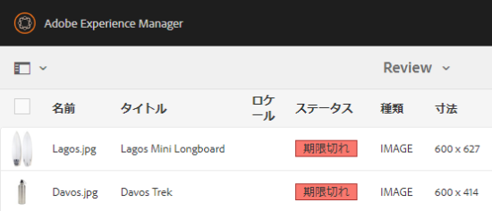

*図：リスト表示の「[!UICONTROL ステータス]」列には、期限切れのバナーが表示されます。*

You can view the expiration status of an asset in the [!UICONTROL Timeline] in left rail.

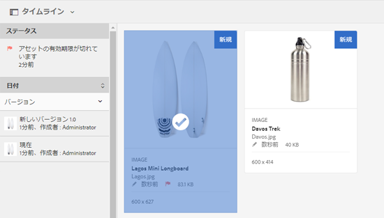

>[!NOTE]
>
>アセットの有効期限の表示はタイムゾーンごとに異なります。

You can also view the expiration status of assets in the **[!UICONTROL References]** rail. ここではアセットの有効期限切れのステータスと、複合アセットと参照元のサブアセット、コレクションおよびプロジェクトの間の関係を管理します。

1. 参照先の Web ページと複合アセットを表示するアセットに移動します。
1. アセットを選択し、左側のレールで **[!UICONTROL 参照]** (References)を開きます。 For expired assets, the [!UICONTROL References] rail displays the expiry status **[!UICONTROL Asset is Expired]** at the top.

   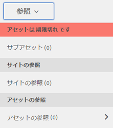

   If the asset has expired subassets, the [!UICONTROL References] rail displays the status **[!UICONTROL Asset has Expired Sub-Assets]**.

   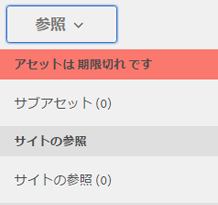

### 有効期限切れのアセットの検索 {#search-expired-assets}

検索パネルで、有効期限切れのアセット（有効期限切れのサブアセットを含む）を検索できます。

1. [!DNL Assets] コンソールで、ツールバーの「**[!UICONTROL 検索]**」をクリックしてオムニサーチボックスを表示します。

1. オムニサーチボックスのカーソルで、Enter キーを押して検索結果ページを表示します。
1. 左側のレールで検索パネルを開きます。 Click the **[!UICONTROL Expiry Status]** option to expand it.

   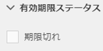

1. 「 **[!UICONTROL 期限切れ]**」を選択します。 検索結果をフィルタリングした後は、期限切れのアセットのみが表示されます。

「**[!UICONTROL 期限切れ]**」オプションを選択すると、[!DNL Assets] コンソールに複合アセットによって参照されている有効期限切れのアセットとサブセットのみが表示されます。有効期限切れのサブアセットを参照する複合アセットは、サブアセットの有効期限切れの直後には表示されません。代わりに、次回スケジューラーが実行されたときに、それらのアセットが有効期限切れのサブアセットを参照していることを [!DNL Experience Manager] が検出した後で表示されます。

公開済みアセットの有効期限をスケジューラーの現在のサイクルより前の日付に変更する場合、スケジューラーは次回の実行時にも引き続きこのアセットを有効期限切れのアセットとして検出し、ステータスにそれを反映させます。

さらに、何らかの誤作動やエラーによりスケジューラーが現在のサイクルの有効期限切れアセットを検出できない場合、スケジューラーはこれらのアセットを次回のサイクルで再確認し、有効期限切れのステータスを検出します。

[!DNL Assets] コンソールに有効期限切れのサブアセットと共に参照先の複合アセットを表示するには、[!DNL Experience Manager] Configuration Manager で **[!UICONTROL Adobe CQ DAM Expiry Notification]** ワークフローを設定します。

1. [!DNL Experience Manager] Configuration Manager を開きます。
1. 「**[!UICONTROL Adobe CQ DAM Expiry Notification]**」を選択します。デフォルトでは、「**[!UICONTROL Time based Scheduler]**」が選択されており、指定の時間にアセットに有効期限切れのサブアセットがあるかどうかをチェックするジョブのスケジュールを設定します。ジョブが完了すると、有効期限切れのサブアセットを持つアセットと参照元のアセットが検索結果に有効期限切れと表示されます。

1. ジョブを定期的に実行するには、「**[!UICONTROL Time Based Scheduler Rule]**」フィールドをクリアして、「**[!UICONTROL Periodic Scheduler]**」フィールドの時間（秒数）を変更します。例えば、式例では、00時間にジョブを `0 0 0 &ast; &ast; ?` トリガーします。
1. アセットの有効期限が切れたときに電子メールを受け取るには、「**[!UICONTROL send email]**」を選択します。

   >[!NOTE]
   >
   >Only the asset creator (the person who uploads a particular asset to [!DNL Assets]) receives an email when the asset expires. See [how to configure email notification](/help/sites-administering/notification.md) for additional details around configuring email notifications at the overall [!DNL Experience Manager] level.

1. 「**[!UICONTROL Prior notification in seconds]**」フィールドで、アセットの有効期限が切れる何秒前に有効期限切れに関する通知を受け取るかを指定します。アセットの作成者は、アセットの有効期限が切れる前に、指定した時間が経過するとアセットの有効期限が切れることを知らせるメッセージを受け取ります。 アセットの有効期限が切れると、有効期限が切れたことを知らせる別の通知を受け取ります。さらに、有効期限切れのアセットはアクティベートが解除されます。

1. 「**[!UICONTROL 保存]**」をクリックします。

## アセットの状態 {#asset-states}

[!DNL Assets] コンソールには、アセットの様々な状態を表示できます。特定のアセットの現在の状態により、カード表示にその状態について記述されたラベル（期限切れ、公開済み、承認済み、拒否など）が表示されます。

1. [!DNL Assets] ユーザーインターフェイスでアセットを選択します。
1. ツールバーの「**[!UICONTROL 公開]**」をクリックします。If you don&#39;t see **Publish** on the toolbar, click **[!UICONTROL More]** on the toolbar and locate **[!UICONTROL Publish]**  option.
1. メニューの「**[!UICONTROL 公開]**」を選択して、確認ダイアログを閉じます。
1. 選択モードを終了します。アセットの公開ステータスは、カード表示のアセットのサムネールの下部に表示されます。リスト表示では、「公開」列にアセットが公開された時間が表示されます。

   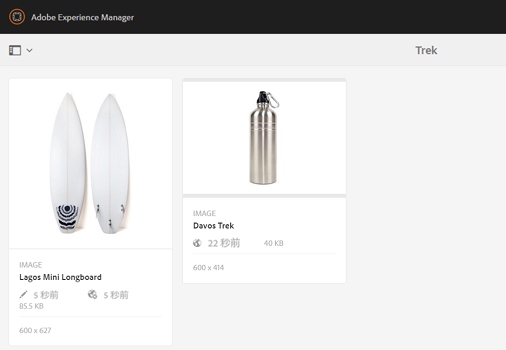

1. To display its asset details page, in the [!DNL Assets] interface, select an asset and click **[!UICONTROL Properties]** .

1. 「[!UICONTROL 詳細]」タブの「**[!UICONTROL 期限切れ]**」フィールドで、アセットの有効期限日を設定します。

   ![[有効期限]フィールドにアセットの有効期限の日時を設定します。](assets/asset-properties-advanced-tab.png)

   *図：[!UICONTROL アセットの有効期限を設定するための]「アセットの[!UICONTROL プロパティ]」ページの「詳細」タブ。*

1. 「**[!UICONTROL 保存]**」をクリックし、次に「**[!UICONTROL 閉じる]**」をクリックしてアセットコンソールを表示します。
1. アセットの公開ステータスは、カード表示のアセットのサムネールの下部に、有効期限切れのステータスを示します。リスト表示では、アセットのステータスが「**[!UICONTROL 期限切れ]**」と表示されます。

   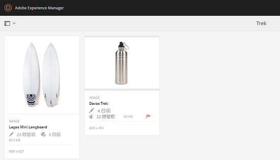

1. [!DNL Assets] コンソールで、フォルダーを選択してフォルダーにレビュータスクを作成します。
1. レビュータスクでアセットを承認または拒否して、「**[!UICONTROL 完了]**」をクリックします。
1. レビュータスクを作成するフォルダーに移動します。承認または拒否したアセットのステータスがカード表示の下部に表示されます。リスト表示では、承認および有効期限のステータスが該当する列に表示されます。

   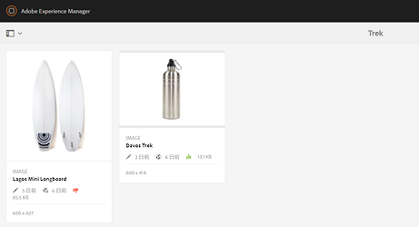

1. To search for assets based on their status, click **[!UICONTROL Search]**  to display the Omnisearch bar.
1. Return キーを押し、「[!DNL Experience Manager]」をクリックして検索パネルを表示します。
1. 検索パネルで、「**[!UICONTROL 公開ステータス]**」をクリックして「**[!UICONTROL 公開済み]**」を選択し、[!DNL Assets] で公開済みのアセットを検索します。

   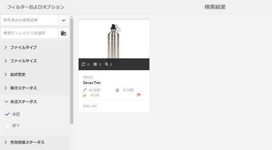

1. 「**[!UICONTROL 承認ステータス]**」をクリックし、適切なアイコンをクリックして承認済みまたは却下されたアセットを検索します。

   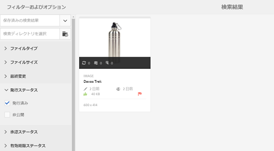

1. 有効期限切れのステータスに基づいてアセットを検索するには、検索パネルで「**[!UICONTROL 有効期限ステータス]**」を選択して適切なオプションを選択します。

   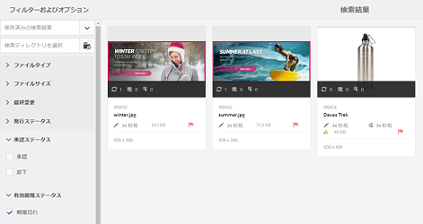

1. 各種検索ファセットで、ステータスの組み合わせに基づいてアセットを検索することもできます。検索ファセットで適切なオプションを選択することで、例えば、レビュータスクで承認されており、まだ有効期限が切れていない公開済みのアセットを検索することもできます。

   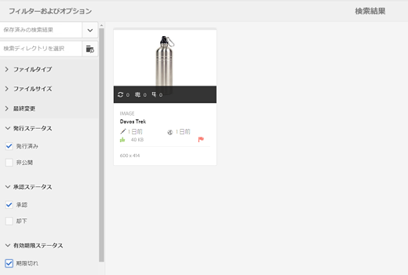

## [!DNL Assets] のデジタル著作権管理 {#digital-rights-management-in-assets-1}

この機能は、[!DNL Adobe Experience Manager Assets] からライセンスの必要なアセットをダウンロードする前に、使用許諾契約書への同意をリクエストするものです。

保護されたアセットを選択して「**[!UICONTROL ダウンロード]**」をクリックすると、ライセンスページが表示されるので、このページで使用許諾契約書に同意します。使用許諾契約に同意しない場合、「**[!UICONTROL ダウンロード]**」オプションは使用できません。

選択した項目に保護されたアセットが複数含まれている場合、一度に 1 つずつアセットを選択し、使用許諾契約書に同意し、アセットのダウンロードに進みます。

アセットは、次のいずれかの条件が満たされた場合に保護されていると見なされます。

* アセットのメタデータプロパティ `xmpRights:WebStatement` が、そのアセットの使用許諾契約書を含む ページのパスを指している。
* アセットのメタデータプロパティ `adobe_dam:restrictions` の値が、使用許諾契約書を指定する生の HTML である。

>[!NOTE]
>
> の以前のリリースにライセンスを保存するために使用されていた場所 `/etc/dam/drm/licenses` は非推奨（廃止予定）となりました。[!DNL Experience Manager]
>
>ライセンスページを作成または変更する場合、または [!DNL Experience Manager] の以前のリリースから移植する場合は、ライセンスページを `/apps/settings/dam/drm/licenses` または `/conf/&ast;/settings/dam/drm/licenses` に保存することをお勧めします。

### DRM で保護されたアセットのダウンロード {#downloading-drm-assets}

1. カード表示で、ダウンロードするアセットを選択し、「**[!UICONTROL ダウンロード]**」をクリックします。
1. **[!UICONTROL 著作権管理]**&#x200B;ページで、ダウンロードするアセットをリストから選択します。
1. [!UICONTROL ライセンス]パネルで、「**[!UICONTROL 同意する]**」を選択します。アセットの横にチェックマークが表示されます。「**[!UICONTROL ダウンロード]**」オプションをクリックします。

   >[!NOTE]
   >
   >「**[!UICONTROL ダウンロード]**」オプションは、保護されたアセットの使用許諾契約に同意した場合にのみ有効になります。ただし、選択範囲が保護されたアセットと保護されていないアセットの両方で構成されている場合は、保護されたアセットのみがパネルに表示され、「**[!UICONTROL ダウンロード]**」オプションが有効になって、保護されていないアセットのダウンロードが可能になります。保護された複数のアセットの使用許諾契約に同時に承諾するには、リストからアセットを選択して「**[!UICONTROL 同意する]**」を選択します。

   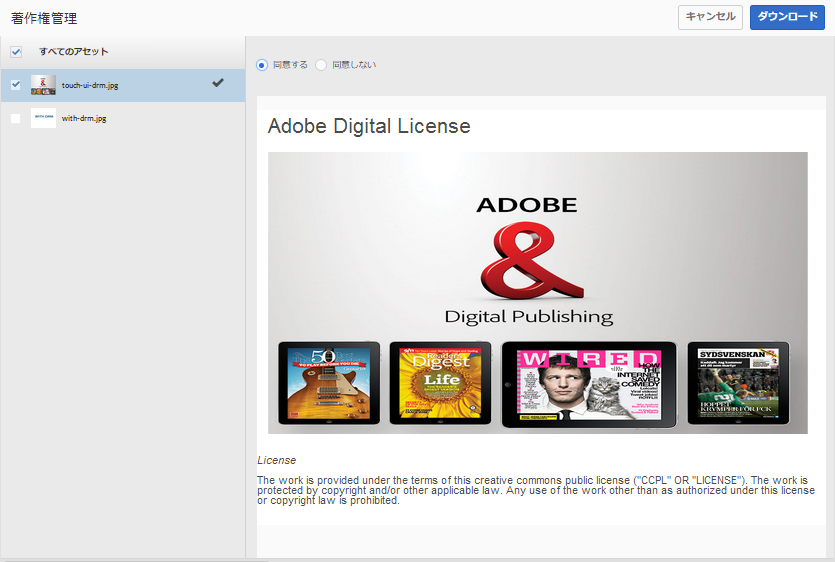

1. ダイアログで、「**[!UICONTROL ダウンロード]**」をクリックして、アセットまたはそのレンディションをダウンロードします。
