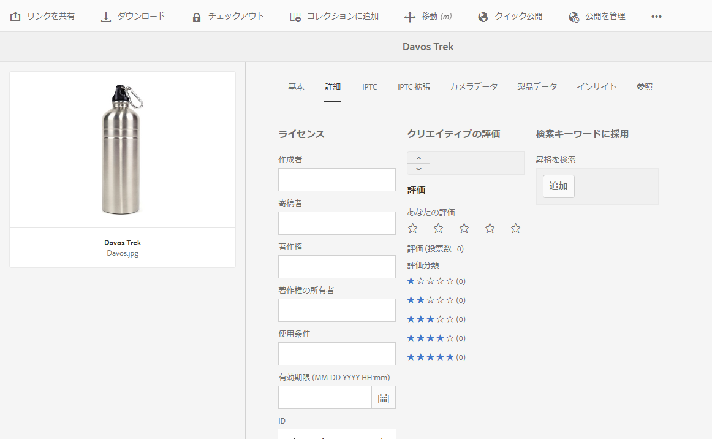

# Digital Rights Management for digital assets {#digital-rights-management-in-assets}

多くの場合、デジタルアセットはライセンスに関連付けられています。ライセンスは、利用条件とその期間を指定します。Adobe Experience Manager (AEM) Assets は AEM プラットフォームに完全に統合されているので、アセットの有効期限に関する情報やアセットの状態を効率的に管理できます。ライセンス情報をアセットに関連付けることもできます。

## アセットの有効期限 {#asset-expiration}

アセットの有効期限は、アセットのライセンス要件を徹底する有効な方法です。公開済みアセットの有効期限が切れたらアセットを非公開にすることで、ライセンス違反が発生する可能性を回避します。管理者権限のないユーザーは、有効期限切れのアセットを編集、コピー、移動、公開、ダウンロードできません。

アセットの有効期限ステータスは、カード表示とリスト表示の両方のアセットコンソールで確認できます。

*図：カード表示では、カード上のフラグが期限切れアセットを示します*

**リスト表示**

*図：リスト表示の「[!UICONTROL Status]」列には、「[!UICONTROL Expired]」バナーが表示されます。*

タイムラインで、アセットの有効期限切れのステータスを確認できます。アセットを選択してグローバルナビゲーションメニューから「タイムライン」を選択します。

You can also view the expiration status of assets in the **[!UICONTROL References]** rail. ここではアセットの有効期限切れのステータスと、複合アセットと参照元のサブアセット、コレクションおよびプロジェクトの間の関係を管理します。

1. 参照先の Web ページと複合アセットを表示するアセットに移動します。
1. アセットとExperience Managerのロゴを選択します。

1. メニューで「**[!UICONTROL 参照]**」を選択します。

   

   有効期限切れのアセットの場合、参照レールの上部に有効期限切れのステータス「**[!UICONTROL アセットは期限切れです]**」が表示されます。

   

   アセットに有効期限切れのサブアセットがある場合、参照レールにステータス「**[!UICONTROL アセットに有効期限切れのサブアセットがあります]**」が表示されます。

   

### 有効期限切れのアセットの検索 {#search-expired-assets}

検索パネルで、有効期限切れのアセット（有効期限切れのサブアセットを含む）を検索できます。

1. In the Assets console, click the **[!UICONTROL Search]** in the toolbar to display the Omnisearch box.

1. 「Omnisearch」ボックスにカーソルを置き、Returnキーを押して、検索結果ページを表示します。

   

1. 「Experience Managerロゴ」をクリックして検索パネルを表示します。

   

1. Click the **[!UICONTROL Expiry Status]** option to expand it.

   

1. 「**[!UICONTROL 期限切れ]**」を選択します。有効期限切れのアセットが検索結果に表示されます。

   

「**期限切れ**」オプションを選択すると、アセットコンソールに複合アセットによって参照されている有効期限切れのアセットとサブセットのみが表示されます。有効期限切れのサブアセットを参照する複合アセットは、サブアセットの有効期限切れの直後には表示されません。代わりに、それらは次回スケジューラーが実行され、有効期限切れのサブアセットを参照していることを AEM Assets が検出した後に表示されます。

公開済みアセットの有効期限をスケジューラーの現在のサイクルより前の日付に変更する場合、スケジューラーは次回の実行時にも引き続きこのアセットを有効期限切れのアセットとして検出し、ステータスにそれを反映させます。

さらに、何らかの誤作動やエラーによりスケジューラーが現在のサイクルの有効期限切れアセットを検出できない場合、スケジューラーはこれらのアセットを次回のサイクルで再確認し、有効期限切れのステータスを検出します。

アセットコンソールに有効期限切れのサブアセットと共に参照先の複合アセットを表示するには、AEM Configuration Manager で **Adobe CQ DAM Expiry Notification** ワークフローを設定します。

1. AEM Configuration Manager を開きます。
1. 「**[!UICONTROL Adobe CQ DAM Expiry Notification]**」を選択します。デフォルトでは、「**[!UICONTROL Time based Scheduler]**」が選択されており、指定の時間にアセットに有効期限切れのサブアセットがあるかどうかをチェックするジョブのスケジュールを設定します。ジョブが完了すると、有効期限切れのサブアセットを持つアセットと参照元のアセットが検索結果に有効期限切れと表示されます。

   

1. ジョブを定期的に実行するには、「**[!UICONTROL Time Based Scheduler Rule]**」フィールドをクリアして、「**[!UICONTROL Periodic Scheduler]**」フィールドの時間（秒数）を変更します。例えば、「0 0 0 &amp;ast; &amp;ast; ?」と指定するとジョブが 00 時間でトリガーされます。
1. アセットの有効期限が切れたときに電子メールを受け取るには、「**[!UICONTROL send email]**」を選択します。

   >[!NOTE]
   >
   >アセットの有効期限が切れると、アセットの作成者（AEM Assets に特定のアセットをアップロードしたユーザー）のみが電子メールを受け取ります。AEM の全レベルの電子メール通知の設定に関する追加情報について詳しくは、[電子メール通知の設定](/help/sites-administering/notification.md)を参照してください。

1. 「**[!UICONTROL Prior notification in seconds]**」フィールドで、アセットの有効期限が切れる何秒前に有効期限切れに関する通知を受け取るかを指定します。管理者かアセットの作成者の場合、アセットの有効期限が切れる前に、指定の時間が経過した後にアセットの有効期限が切れることを知らせるメッセージを受け取ります。

   アセットの有効期限が切れると、有効期限が切れたことを知らせる別の通知を受け取ります。さらに、有効期限切れのアセットはアクティベートが解除されます。

1. 「**[!UICONTROL 保存]**」をクリックします。

## アセットの状態 {#asset-states}

Adobe Experience Manager (AEM) Assets のアセットコンソールには、アセットの様々な状態が表示されます。特定のアセットの現在の状態により、カード表示にその状態について記述されたラベル（期限切れ、公開済み、承認済み、拒否など）が表示されます。

1. Assets ユーザーインターフェイスでアセットを選択します。

   

1. Click **[!UICONTROL Publish]** from the toolbar. If you don&#39;t see **Publish** on the toolbar, click **[!UICONTROL More]** on the toolbar and locate **[!UICONTROL Publish]** option.

   

1. メニューの「**[!UICONTROL 公開]**」を選択して、確認ダイアログを閉じます。
1. 選択モードを終了します。アセットの公開ステータスは、カード表示のアセットのサムネールの下部に表示されます。リスト表示では、「公開」列にアセットが公開された時間が表示されます。

   

1. In the Assets interface, select an asset and click **[!UICONTROL Properties]** to display its asset details page.

   

1. In the Advanced tab, set an expiration date for the asset from the **[!UICONTROL Expires]** field.

   

   *図：アセットの有効期限を設定するためのアセットプロパティの「詳細」タブ*

1. 「**[!UICONTROL 保存]**」をクリックし、次に「**[!UICONTROL 閉じる]**」をクリックしてアセットコンソールを表示します。
1. アセットの公開ステータスは、カード表示のアセットのサムネールの下部に、有効期限切れのステータスを示します。リスト表示では、アセットのステータスが「**[!UICONTROL 期限切れ]**」と表示されます。

   

1. アセットコンソールで、フォルダーを選択してフォルダーにレビュータスクを作成します。
1. レビュータスクでアセットを承認または拒否して、「**[!UICONTROL 完了]**」をクリックします。
1. レビュータスクを作成するフォルダーに移動します。承認または拒否したアセットのステータスがカード表示の下部に表示されます。リスト表示では、承認および有効期限のステータスが該当する列に表示されます。

   

1. To search for assets based on their status, click **[!UICONTROL Search]** to display the Omnisearch bar.

   

1. Returnキーを押し、「GlobalNav」をクリ **[!UICONTROL ックして]** 、検索パネルを表示します。
1. In the Search panel, click **[!UICONTROL Publish Status]** and select **[!UICONTROL Published]** to search for published assets in AEM Assets.

   

1. Click **[!UICONTROL Approval Status]** and click the appropriate option to search for approved or rejected assets.

   

1. 有効期限切れのステータスに基づいてアセットを検索するには、検索パネルで「**[!UICONTROL 有効期限ステータス]**」を選択して適切なオプションを選択します。

   

1. 各種検索ファセットで、ステータスの組み合わせに基づいてアセットを検索することもできます。検索ファセットで適切なオプションを選択することで、例えば、レビュータスクで承認されており、まだ有効期限が切れていない公開済みのアセットを検索することもできます。

   

## アセットのデジタル著作権管理 {#digital-rights-management-in-assets-1}

この機能を使用すると、Adobe Experience Manager Assetsからライセンスされたアセットをダウンロードする前に、使用許諾契約への同意が強制されます。

If you select a protected asset and click **[!UICONTROL Download]**, you are redirected to a license page where you accept the license agreement. 使用許諾契約書に同意しない場合、「**[!UICONTROL ダウンロード]**」ボタンは無効になります。

選択した項目に保護されたアセットが複数含まれている場合、一度に 1 つずつアセットを選択し、使用許諾契約書に同意し、アセットのダウンロードに進みます。

アセットは、次のいずれかの条件が満たされた場合に保護されていると見なされます。

* アセットのメタデータプロパティ `xmpRights:WebStatement` が、そのアセットの使用許諾契約書を含む ページのパスを指している。
* アセットのメタデータプロパティ `adobe_dam:restrictions` の値が、使用許諾契約書を指定する生の HTML である。

>[!NOTE]
>
>AEM の以前のリリースにライセンスを保存するために使用されていた場所 `/etc/dam/drm/licenses` は非推奨（廃止予定）となりました。
>
>If you create or modify licence pages, or port them from previous AEM releases, Adobe recommends that you store them under `/apps/settings/dam/drm/licenses` or `/conf/&ast;/settings/dam/drm/licenses`.

### DRM保護アセットのダウンロード {#downloading-drm-assets}

1. In the Card view, select the assets you want to download and click **[!UICONTROL Download]**.
1. **[!UICONTROL 著作権管理]**&#x200B;ページで、ダウンロードするアセットをリストから選択します。
1. In the License pane, choose **[!UICONTROL Agree]**. A tick mark appears beside the asset for which you accept the license agreement. Click the **[!UICONTROL Download]** button.

   >[!NOTE]
   >
   >「**[!UICONTROL ダウンロード]**」ボタンは、保護されたアセットに対して使用許諾契約書に同意することを選択した場合のみ有効になります。ただし、選択項目に保護されたアセットと保護されていないアセットの両方が含まれている場合は、左側のパネルには保護されたアセットのみが表示され、保護されていないアセットをダウンロードするための「**[!UICONTROL ダウンロード]**」ボタンが有効になります。保護された複数のアセットの使用許諾契約書に同時に同意するには、リストからそれらのアセットを選択して、「**[!UICONTROL 同意する]**」を選択してください。

   

1. In the dialog, click **[!UICONTROL Download]** to download the asset or its renditions.
