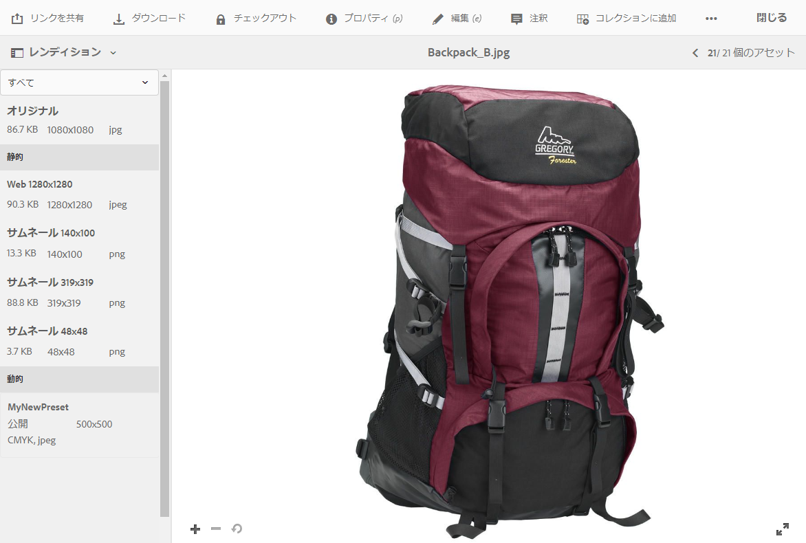

# Dynamic Media の操作 {#working-with-dynamic-media}

[Dynamic Media](https://business.adobe.com/jp/products/experience-manager/assets/dynamic-media.html) は、マーチャンダイジングおよびマーケティング用のリッチなビジュアルアセットをオンデマンドで配信するもので、これらのアセットは、Web、モバイルおよびソーシャルサイトでの利用に合わせて自動的に拡大縮小されます。Dynamic Media は、一連のプライマリソースアセットを使用し、パフォーマンスが最適化されスケーラビリティに優れたグローバルネットワーク経由で、複数のリッチコンテンツのバリエーションをリアルタイムで生成および配信します。

Dynamic Media は、ズーム、360 度スピン、ビデオなどのインタラクティブな視聴エクスペリエンスを提供します。Dynamic Media は Adobe Experience Manager デジタルアセット管理（AEM Assets）ソリューションのワークフローを独自に取り込むことで、デジタルキャンペーン管理プロセスを簡素化および効率化します。

<!-- >ARTICLE IS MISSING. GIVES 404 [!NOTE]
>
>A Community article is available on [Working with Adobe Experience Manager and Dynamic Media](https://helpx.adobe.com/experience-manager/using/aem_dynamic_media.html). -->

## Dynamic Media の機能 {#what-you-can-do-with-dynamic-media}

Dynamic Mediaを使用すると、アセットを公開する前に管理できます。 一般的なアセットの操作方法については、[デジタルアセットの操作](manage-assets.md)で詳しく説明しています。一般的なトピックには、アセットのアップロード、ダウンロード、編集、公開と、プロパティの表示、編集、アセットの検索が含まれます。

Dynamic Media 限定の機能は次のとおりです。

* [カルーセルバナー](carousel-banners.md)
* [画像セット](image-sets.md)
* [インタラクティブ画像](interactive-images.md)
* [インタラクティブビデオ](interactive-videos.md)
* [混在メディアセット](mixed-media-sets.md)
* [パノラマ画像](panoramic-images.md)

* [スピンセット](spin-sets.md)
* [ビデオ](video.md)
* [Dynamic Media アセットの配信](delivering-dynamic-media-assets.md)
* [アセットの管理](managing-assets.md)
* [クイックビューを使用したカスタムポップアップの作成](custom-pop-ups.md)

[Dynamic Media の設定](administering-dynamic-media.md)も参照してください。

>[!NOTE]
>
>Dynamic Media の使用と、Dynamic Media Classic と Adobe Experience Manager の統合の違いについては、[Dynamic Media Classic 統合 と Dynamic Media](/help/sites-administering/scene7.md#aem-scene-integration-versus-dynamic-media) を参照してください。

## Dynamic Media が有効な場合と無効な場合の比較 {#dynamic-media-on-versus-dynamic-media-off}

Dynamic Media が有効（オン）になっているかどうかは、次の特徴から判断できます。

* アセットのダウンロードやプレビューで動的レンディションを使用できる。
* 画像セット、スピンセット、混在メディアセットを使用できる。
* PTIFF レンディションが作成されている。

画像アセットを選択した場合、Dynamic Media を[有効](config-dynamic.md#enabling-dynamic-media)にしているときとアセットのビューが異なります。Dynamic Media では、オンデマンドの HTML5 ビューアが使用されます。

### 動的レンディション {#dynamic-renditions}

「**[!UICONTROL 動的]**」の下にある画像プリセットやビューアプリセットなどの動的レンディションは、Dynamic Media が有効な場合に使用できます。

### 画像セット、スピンセット、混在メディアセット {#image-sets-spins-sets-mixed-media-sets}

画像セット、スピンセットおよび混在メディアセットは、Dynamic Media が有効な場合に使用できます。

### PTIFF レンディション {#ptiff-renditions}

Dynamic Media 対応のアセットには `pyramid.tiffs` が含まれます。

### アセットのビューの変化 {#asset-views-change}

Dynamic Mediaを有効にした場合、 `+` および `-` ボタン。 クリックして特定の領域にズームインすることもできます。 「元に戻す」を選択すると元のバージョンに戻り、斜めの矢印をクリックして画像を全画面表示にすることができます。 Dynamic Media enabled は次のようになります。

Dynamic Media を無効にした場合は、次のようにズームイン、ズームアウトおよび元のサイズに戻す操作が可能です。

