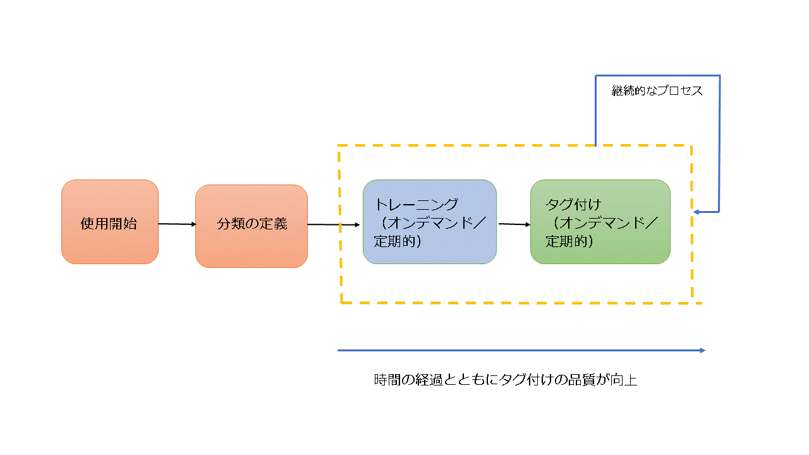
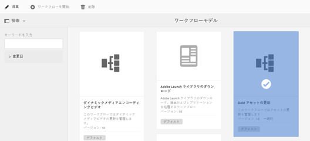
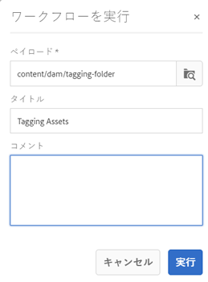
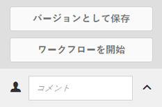

# 拡張スマートタグ {#enhanced-smart-tags}

## 拡張スマートタグの概要 {#overview-of-enhanced-smart-tags}

デジタルアセットを扱う組織では、アセットメタデータで分類に基づく統制語彙を使用することがますます多くなっています。これには、基本的に、従業員、パートナーおよび顧客が特定のクラスのデジタルアセットを参照したり、検索したりする場合によく使用するキーワードのリストが含まれます。分類に基づく統制語彙によりアセットをタグ付けすると、タグベースの検索でアセットを特定し、取得することが容易になります。

自然言語語彙と比較して、ビジネス上の分類に基づいたデジタルアセットのタグ付けでは、デジタルアセットを会社のビジネスと容易に連携させることができ、関連性の最も高いアセットが検索で表示されるようになります。

例えば、自動車メーカーでは、プロモーションキャンペーンを計画するために様々なモデルの画像を検索する際、関連性の高い画像のみが表示されるように、モデル名を使用して車の画像をタグ付けすることができます。

スマートコンテンツサービスで適切なタグを適用するには、分類を認識するようにサービスをトレーニングする必要があります。サービスをトレーニングするにはまず、アセットのセットとそれらのアセットを最も的確に表すタグをキュレーションします。これらのタグをアセットに適用し、トレーニングワークフローを実行してサービスがこれを学習できるようにします。

タグのトレーニングが完了して準備が整ったら、サービスは、タグ付けワークフローを通じてこれらのタグをアセットに適用できるようになります。

背景には、スマートコンテンツサービスはAdobe Senesi AIフレームワークを使用して、タグ構造とビジネス分類に対する画像認識アルゴリズムのトレーニングを行っています。 その後、このコンテンツインテリジェンスを使用して、アセットの個々のセットに関連性の高いタグが適用されます。

スマートコンテンツサービスは、Adobe I/O上でホストされるクラウドサービスです。 この機能をAdobe Experience Managerで使用するには、Experience Manager管理者がシステムインスタンスをAdobe I/Oと統合する必要があります。

要約すると、スマートコンテンツサービスを使用するための主な手順は次のとおりです。

* 使用開始
* アセットおよびタグの検討（分類の定義）
* スマートコンテンツサービスのトレーニング
* 自動タグ付け

## 前提条件 {#prerequisites}

Adobe I/O で統合を作成してスマートコンテンツサービスを使用する前に、以下の事項を確認します。

* 組織の管理者権限を持つ Adobe ID アカウントがあること。
* 組織でスマートコンテンツサービスが有効化されていること。

## 使用開始 {#onboarding}

スマートコンテンツサービスは、Adobe Experience Manager のアドオンとして購入できます。購入後、Adobe I/Oへのリンクを記載した電子メールが組織の管理者に送信されます。

管理者は、このリンクに従ってSmart Content ServiceとExperience Managerを統合できます。 To integrate the service with Experience Manager Assets, see [Configure Smart Tags](config-smart-tagging.md).

管理者がサービスを設定し、Experience Managerでユーザーを追加すると、オンボーディングプロセスが完了します。

>[!NOTE]
>
>Experience Manager6.3以前のバージョンを使用し、アセットにタグ付けサービスが必要な場合は、「 [スマートタグ](https://helpx.adobe.com/experience-manager/6-3/assets/using/touch-ui-smart-tags.html)」を参照してください。 スマートタグは最新のAI機能を使用しないので、高度なスマートタグサービスに比べて正確性が低くなります。

## アセットとタグの確認 {#reviewing-assets-and-tags}

使用開始プロセスが完了したら、まず、ビジネスのコンテキストにおいて各画像を最も的確に表すタグのセットを識別します。

次に、各画像をレビューして、特定のビジネス要件について製品を最も的確に表す画像のセットを識別します。Ensure that the assets in your curated set conform to [Smart Content Service training guidelines](smart-tags-training-guidelines.md).

アセットをフォルダーに追加し、プロパティページで各アセットにタグを適用します。その後、このフォルダーに対してトレーニングワークフローを実行します。キュレーション後のアセットセットを使用すると、スマートコンテンツサービスで分類の定義を使用して、より多くのアセットを効果的にトレーニングできます。

>[!NOTE]
>
>1. トレーニングは元に戻すことができないプロセスです。キュレーション後のアセットセット内のタグを十分に確認してから、スマートコンテンツサービスに対してそれらのタグのトレーニングを実施することをお勧めします。
>1. Please do read [Smart Content Service training guidelines](smart-tags-training-guidelines.md) before starting training for any tag.
>1. スマートコンテンツサービスのトレーニングを初めておこなうときには、少なくとも 2 つの異なるタグについてトレーニングすることをお勧めします。

## Smart Content Serviceのトレーニング {#training-the-smart-content-service}

スマートコンテンツサービスでビジネス上の分類を認識できるように、ビジネスに関連するタグが既に含まれているアセットのセットに対してサービスを実行します。トレーニングが完了すると、サービスは、類似するアセットのセットに同じ分類を適用できるようになります。

サービスのトレーニングを複数回実施すると、関連性の高いタグを適用する能力が向上します。トレーニングサイクルが終了するたびに、タグ付けワークフローを実行し、アセットが適切にタグ付けされるかどうかを確認します。

スマートコンテンツサービスのトレーニングは、定期的に実施することも、必要に応じて実施することもできます。

>[!NOTE]
>
>トレーニングワークフローは、フォルダーに対してのみ実行されます。

### 定期的なトレーニング {#periodic-training}

スマートコンテンツサービスを有効にして、フォルダー内のアセットおよび関連するタグに関する定期的なトレーニングを実施することができます。Open the [!UICONTROL Properties] page of your asset folder, select **[!UICONTROL Enable Smart Tags]** under the **[!UICONTROL Details]** tab, and save the changes.

フォルダーに対してこのオプションを選択すると、Experience Managerはトレーニングワークフローを自動的に実行し、フォルダーアセットとそのタグに関するSmart Content Serviceのトレーニングを行います。 デフォルトでは、トレーニングワークフローは週に 1 回、土曜日の午前 0 時 30 分に実行されます。

### オンデマンドのトレーニング {#on-demand-training}

ワークフローコンソールから、必要に応じていつでもスマートコンテンツサービスのトレーニングをおこなうことができます。

1. In Experience Manager interface, go to **[!UICONTROL Tools]** > **[!UICONTROL Workflow]** > **[!UICONTROL Models]**.
1. From the **[!UICONTROL Workflow Models]** page, select the **[!UICONTROL Smart Tags Training]** workflow and then click **[!UICONTROL Start Workflow]** from the toolbar.
1. **[!UICONTROL ワークフローを実行]**&#x200B;ダイアログで、サービスのトレーニングに使用するタグ付けされたアセットが格納されているペイロードフォルダーを参照します。
1. ワークフローのタイトルを指定し、コメントを追加します。Then, click **[!UICONTROL Run]**. アセットとタグがトレーニングのために送信されます。

   

>[!NOTE]
>
>フォルダー内のアセットがトレーニング用に処理されると、変更されたアセットのみが後続のトレーニングサイクルで処理されます。

### 表示トレーニングレポート {#viewing-training-reports}

アセットのトレーニングセット内のタグに関するスマートコンテンツサービスのトレーニングが実施されたかどうかを確認するには、レポートコンソールでトレーニングワークフローレポートを調べます。

1. Experience Managerインターフェイスで、 **[!UICONTROL ツール]** / **[!UICONTROL アセット]** / **[!UICONTROL レポートに移動します]**。
1. **[!UICONTROL アセットレポート]**&#x200B;ページで、「**[!UICONTROL 作成]**」をクリックします。
1. 「**[!UICONTROL スマートタグトレーニング]**」レポートを選択し、ツールバーで「**[!UICONTROL 次へ]**」をクリックします。
1. レポートのタイトルと説明を指定します。「**[!UICONTROL レポートをスケジュール]**」で、「**[!UICONTROL 今すぐ]**」オプションを選択したままにします。レポートを後で生成するようにスケジュールするには、「**[!UICONTROL 後で]**」を選択し、日時を指定します。次に、ツールバーの「**[!UICONTROL 作成]**」をクリックします。
1. **[!UICONTROL アセットレポート]**&#x200B;ページで、生成したレポートを選択します。レポートを表示するには、ツールバーの「**[!UICONTROL 表示]**」アイコンをクリックします。
1. レポートの詳細をレビューします。

   レポートには、トレーニングしたタグのトレーニングステータスが表示されます。「**[!UICONTROL トレーニングステータス]**」列の緑色は、そのタグについて、スマートコンテンツサービスのトレーニングが実施されたことを示します。黄色は、特定のタグに関するサービスのトレーニングが完全には実施されていないことを示します。この場合、特定のタグを含む画像をさらに追加し、トレーニングワークフローを実行して、そのタグに関するサービスのトレーニングを完全に実施します。

   このレポートにタグが表示されない場合は、それらのタグに関するトレーニングワークフローを再度実行してください。

1. レポートをダウンロードするには、リストから対象のレポートを選択し、ツールバーの「**[!UICONTROL ダウンロード]**」をクリックします。レポートが Microsoft Excel スプレッドシートとしてダウンロードされます。

## アセットの自動タグ付け {#tagging-assets-automatically}

スマートコンテンツサービスのトレーニングが完了したら、タグ付けワークフローを実行して、類似するアセットの個々のセットに適切なタグを自動的に適用することができます。

タグ付けワークフローは、定期的に実行することも、必要に応じて実行することもできます。

>[!NOTE]
>
>タグ付けワークフローは、アセットとフォルダーの両方に対して実行されます。

### 定期的なタグ付け {#periodic-tagging}

スマートコンテンツサービスを有効にして、フォルダー内のアセットを定期的にタグ付けすることができます。Open the properties page of your asset folder, select **[!UICONTROL Enable Smart Tags]** under the **[!UICONTROL Details]** tab, and save the changes.

フォルダーに対してこのオプションを選択すると、Smart Content Serviceはフォルダー内のアセットに自動的にタグを付けます。 デフォルトでは、タグ付けワークフローは毎日午前12時に実行されます。

### オンデマンドのタグ付け {#on-demand-tagging}

次の場所からタグ付けワークフローを実行して、アセットをすぐにタグ付けすることができます。

* ワークフローコンソール
* タイムライン

>[!NOTE]
>
>タイムラインからタグ付けワークフローを実行する場合、一度に最大 15 個のアセットにタグを適用できます。

#### ワークフローコンソールからのアセットのタグ付け {#tagging-assets-from-the-workflow-console}

1. In Experience Manager interface, go to **[!UICONTROL Tools]** > **[!UICONTROL Workflow]** > **[!UICONTROL Models]**.
1. **[!UICONTROL ワークフローモデル]**&#x200B;ページで、「**[!UICONTROL DAM スマートタグアセット]**」ワークフローを選択し、ツールバーの「**[!UICONTROL ワークフローを開始]**」をクリックします。

   

1. **[!UICONTROL ワークフローを実行]**&#x200B;ダイアログで、タグを自動的に適用するアセットが格納されているペイロードフォルダーを参照します。
1. ワークフローのタイトルとオプションのコメントを指定します。「**[!UICONTROL 実行]**」をクリックします。

   

   アセットフォルダーに移動してタグをレビューし、スマートコンテンツサービスによってアセットが適切にタグ付けされているかどうかを確認します。For details, see [Managing Smart Tags](managing-smart-tags.md).

#### タイムラインからのアセットのタグ付け {#tagging-assets-from-the-timeline}

1. Assets のユーザーインターフェイスで、スマートタグを適用するアセットが格納されているフォルダーまたは特定のアセットを選択します。
1. 左上隅から、**[!UICONTROL タイムライン]**&#x200B;を開きます。
1. 左側のサイドバーの下部からアクションを開き、「**[!UICONTROL 開始ワークフロー]**」をクリックします。

   

1. 「**[!UICONTROL DAM スマートタグアセット]**」ワークフローを選択し、ワークフローのタイトルを指定します。
1. 「**[!UICONTROL 開始]**」をクリックします。ワークフローによってアセットにタグが適用されます。アセットフォルダーに移動してタグをレビューし、スマートコンテンツサービスによってアセットが適切にタグ付けされているかどうかを確認します。For details, see [manage Smart Tags](managing-smart-tags.md).

>[!NOTE]
>
>後続のタグ付けサイクルでは、新しくトレーニングされたタグを使用して、変更したアセットのみが再度タグ付けされます。ただし、タグ付けワークフローの最後のタグ付けサイクルと現在のタグ付けサイクルの間のギャップが 24 時間を超える場合は、変更されないアセットもタグ付けされます。定期的なタグ付けワークフローについては、時間の間隔が 6 ヶ月を超えると、変更されていないアセットがタグ付けされます。
