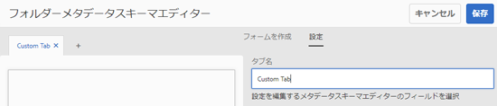
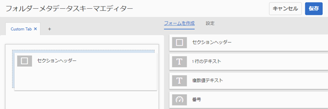
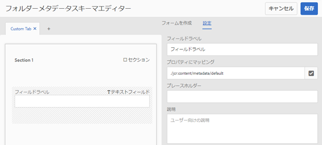
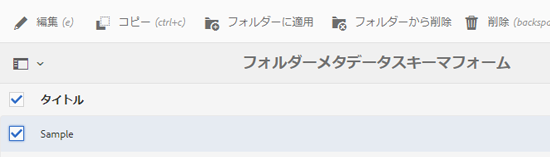
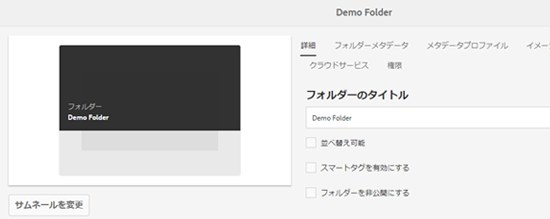
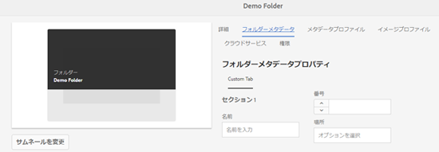
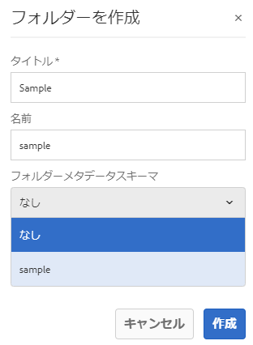

# フォルダーメタデータスキーマ {#folder-metadata-schema}

Adobe Experience Managerアセットを使用すると、アセットフォルダ用のメタデータスキーマを作成できます。このフォルダフォルダは、フォルダのプロパティページに表示されるレイアウトとメタデータを定義します。

## フォルダーメタデータスキーマフォームの追加 {#add-a-folder-metadata-schema-form}

フォルダーメタデータスキーマフォームエディターを使用して、フォルダーのメタデータスキーマを作成および編集します。

1. Experience Managerインターフェイスで、 **[!UICONTROL ツール]** / **[!UICONTROL アセット]** / **[!UICONTROL フォルダーメタデータスキーマに移動します]**。
1. On the [!UICONTROL Folder Metadata Schema Forms] page, click **[!UICONTROL Create]**.
1. Specify a name for the form, and click **[!UICONTROL Create]**. The new schema form is listed in the [!UICONTROL Schema Forms] page.

## フォルダーメタデータスキーマフォームの編集 {#edit-folder-metadata-schema-forms}

以下を含む、新しく追加された、または既存のメタデータスキーマフォームを編集できます。

* タブ
* タブ内のフォーム項目

これらのフォーム項目を CRX リポジトリのメタデータノード内のフィールドにマップしたり、フォーム項目を設定したりできます。新しいタブまたはフォーム項目をメタデータスキーマフォームに追加できます。

1. In the Schema Forms page, select the form you created, and then select the **[!UICONTROL Edit]** option from the toolbar.
1. In the Folder Metadata Schema Editor page, click `+` to add a tab to the form. To rename the tab, click the default name and specify the new name under **[!UICONTROL Settings]**.

   

   タブを追加するには、をクリックし `+`ます。 タブ `X` を削除するには、そのタブをクリックします。

1. アクティブになっているタブで、「**[!UICONTROL フォームを作成]**」タブから 1 つ以上のコンポーネントを追加します。

   

   複数のタブを作成する場合は、特定のタブをクリックしてコンポーネントを追加します。

1. コンポーネントを設定するには、コンポーネントを選択して、「**[!UICONTROL 設定]**」タブでそのプロパティを変更します。

   必要に応じて、「**[!UICONTROL 設定]**」タブからコンポーネントを削除します。

   

1. Click **[!UICONTROL Save]** from the toolbar to save the changes.

### フォームを作成するコンポーネント {#components-to-build-forms}

「**[!UICONTROL フォームを作成]**」タブには、フォルダーメタデータスキーマフォーム内で使用するフォーム項目が一覧表示されます。「**[!UICONTROL 設定]**」タブには、「**[!UICONTROL フォームを作成]**」タブで選択した各項目の属性が表示されます。以下は、「**[!UICONTROL フォームを作成]**」タブで使用可能なフォーム項目のリストです。

| コンポーネント名 | 説明 |
|---|---|
| [!UICONTROL セクションヘッダー] | 共通コンポーネントのリストに対してセクションヘッダーを追加します。 |
| [!UICONTROL 1 行のテキスト] | 1 行のテキストのプロパティを追加します。これは文字列として保存されます。 |
| [!UICONTROL 複数値テキスト] | 複数値テキストプロパティを追加します。これは文字列の配列として保存されます。 |
| [!UICONTROL 番号] | 数値コンポーネントを追加します。 |
| [!UICONTROL 日付] | 日付コンポーネントを追加します。 |
| [!UICONTROL ドロップダウン] | ドロップダウンリストを追加します。 |
| [!UICONTROL 標準タグ] | タグを追加します。 |
| [!UICONTROL 非表示のフィールド] | 非表示のフィールドを追加します。このフィールドは、アセットの保存時に POST パラメーターとして送信されます。 |

### フォーム項目の編集 {#editing-form-items}

To edit the properties of form items, click the component and edit all or a subset of the following properties in the **[!UICONTROL Settings]** tab.

**[!UICONTROL フィールドラベル]**：フォルダーのプロパティページに表示されるメタデータプロパティの名前。

**[!UICONTROL プロパティにマッピング]**：このプロパティは、フォルダーノードが保存されている CRX リポジトリ内でのフォルダーノードの相対パスを指定します。この値は、パスがフォルダーのノードの下にあることを示す「**./**」で始まります。

このプロパティの有効な値は次のとおりです。

* `./jcr:content/metadata/dc:title`：フォルダーのメタデータノードにある値を、プロパティ `dc:title` として格納します。

* `./jcr:created`：フォルダーのノードにある JCR プロパティを表示します。これらのプロパティを CRXDE で設定する場合、これらのプロパティは保護されているので、「編集を無効にする」としてマークすることをお勧めします。そうしない場合は、アセットのプロパティを保存するときに、「`Asset(s) failed to modify`」というエラーが発生します。

プロパティパスにスペースを含めないでください。コンポーネントがメタデータスキーマフォームに適切に表示されなくなります。

**[!UICONTROL JSON パス]**：オプションのキーと値のペアを指定する JSON ファイルのパスを指定します。

**[!UICONTROL プレースホルダー]**：このプロパティを使用して、メタデータプロパティに関連するプレースホルダーテキストを指定します。

**[!UICONTROL 選択肢]**：リストの選択肢を指定するには、このプロパティを使用します。

**[!UICONTROL 説明]**：メタデータコンポーネントの短い説明を追加するには、このプロパティを使用します。

**[!UICONTROL クラス]**：プロパティに関連付けられているオブジェクトクラス。

## フォルダーメタデータスキーマフォームの削除 {#delete-folder-metadata-schema-forms}

フォルダーメタデータスキーマフォームページから、フォルダーメタデータスキーマフォームを削除できます。フォームを削除するには、フォームを選択し、ツールバーの削除オプションをクリックします。

## フォルダーメタデータスキーマの割り当て {#assign-a-folder-metadata-schema}

フォルダーメタデータスキーマフォームページから、またはフォルダーの作成時に、フォルダーにフォルダーメタデータスキーマを割り当てることができます。

フォルダーのメタデータスキーマを設定すると、スキーマフォームのパスは、フォルダーノードの `folderMetadataSchema` プロパティ（.*/jcr:content* 下）に保存されます。

### フォルダーメタデータスキーマページからのスキーマへの割り当て {#assign-to-a-schema-from-the-folder-metadata-schema-page}

1. Experience Managerインターフェイスで、 **[!UICONTROL ツール]** / **[!UICONTROL アセット]**/ **[!UICONTROL フォルダーメタデータスキーマに移動します]**。
1. フォルダーメタデータスキーマフォームページから、フォルダーに適用するスキーマフォームを選択します。
1. From the toolbar, click **[!UICONTROL Apply to Folder(s)]**.

1. Select the folder on which to apply the schema and then click **[!UICONTROL Apply]**. 既にフォルダーにメタデータスキーマが適用されている場合は、既存のメタデータスキーマを上書きするかどうかを確認する警告メッセージが表示されます。「**[!UICONTROL 上書き]**」をクリックします。
1. メタデータスキーマを適用したフォルダーのメタデータプロパティを開きます。

   

   To view the folder metadata fields, click the **[!UICONTROL Folder Metadata]** tab.

   

### フォルダー作成時のスキーマの割り当て {#assign-a-schema-when-creating-a-folder}

フォルダーを作成するときに、フォルダーメタデータスキーマを割り当てることができます。システムに 1 つ以上のフォルダーメタデータスキーマが存在する場合は、**[!UICONTROL フォルダーを作成]**&#x200B;ダイアログに追加リストが表示されます。希望のスキーマを選択できます。デフォルトではスキーマは選択されていません。

1. From the [!DNL Experience Manager Assets] user interface, click **[!UICONTROL Create]** from the toolbar.
1. フォルダーのタイトルと名前を指定します。
1. フォルダーメタデータスキーマリストから希望のスキーマを選択します。Then, click **[!UICONTROL Create]**.

   

1. メタデータスキーマを適用したフォルダーのメタデータプロパティを開きます。
1. To view the folder metadata fields, click the **[!UICONTROL Folder Metadata]** tab.

## フォルダーメタデータスキーマの使用 {#use-the-folder-metadata-schema}

フォルダーメタデータスキーマが設定されたフォルダーのプロパティを開きます。A **[!UICONTROL Folder Metadata]** tab is displayed in the folder [!UICONTROL Properties] page. フォルダーメタデータスキーマフォームを表示するには、このタブを選択します。

Enter metadata values in the various fields and click **[!UICONTROL Save]** to store the values. 指定した値は、CRX リポジトリ内のフォルダーノードに保存されます。

