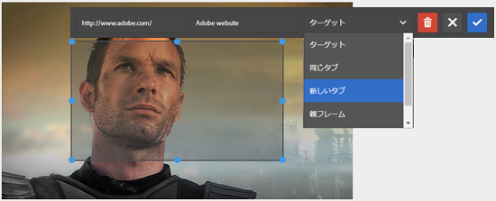

# 追加画像マップ {#adding-image-maps}

画像マップを使用すると、ハイパーリンクが指定された 1 つ以上の領域を追加できます。この領域は、他のハイパーリンクと同様に機能します。

1. Do any one of the following to open **[!UICONTROL In-place Image Editor]**:

   * Using Quick Actions, click **[!UICONTROL Edit]** that appears on an asset in the **[!UICONTROL Card]** view. In the List view, select the asset and click **[!UICONTROL Edit]** option in the toolbar.

      >[!NOTE]
      >
      >Quick Actions is not available in the **[!UICONTROL List]** view.

   * In the **[!UICONTROL Card]** or **[!UICONTROL List]** view, select the asset and click **[!UICONTROL Edit]** on the toolbar.
   * Click **[!UICONTROL Edit]** from the asset page.

      

1. 画像マップを挿入するには、ツールバーの「マップ **** 画像マップを起動  」をクリックします。
1. 画像マップの図形を選択します。選択した図形のホットスポットが画像上に置かれます。

   

1. ホットスポットをクリックし、URLとAltテキストを入力します。 From the **[!UICONTROL Target]** list, specify where you want the image map displayed, for example the same tab, a new tab, or an iFrame. For example, enter `https://www.adobe.com` as the URL, `Adobe website` as the Alt text, and specify **[!UICONTROL New Tab]** from the **[!UICONTROL Target]** list for the image map to open in a new tab.

   

1. 「 **[!UICONTROL 確認]** 」をクリックし、「 **[!UICONTROL 完了]** 」をクリックして、ツールバーから「チェック完了  」を選択し、変更を保存します。

   To delete the image map, click the hot-spot and click **[!UICONTROL Delete]** .

1. 画像マップを表示するには、アセットの詳細ページに移動し、画像の上にカーソルを置きます。

   

   If the Dynamic Media option is enabled, navigate to the Asset editor and click **[!UICONTROL Map]** to view all the applied image maps.
