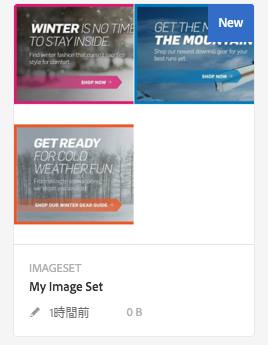
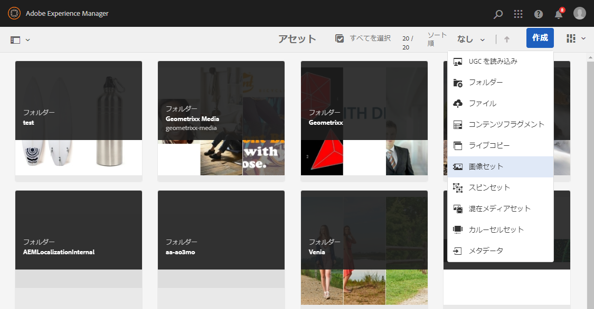
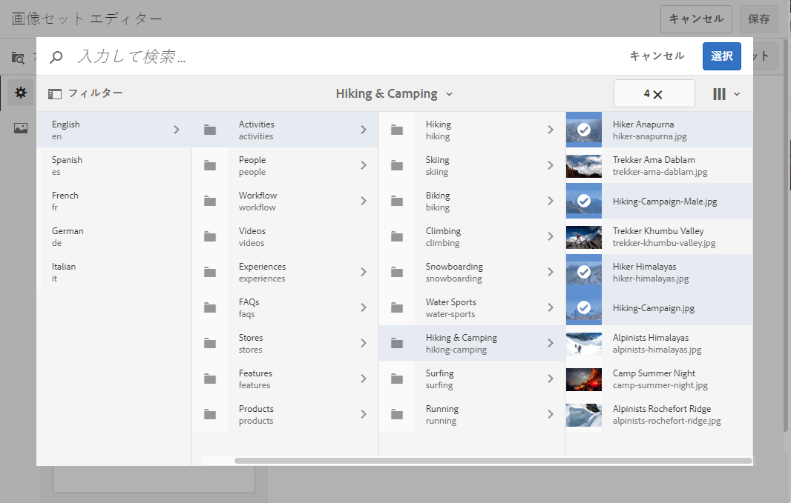
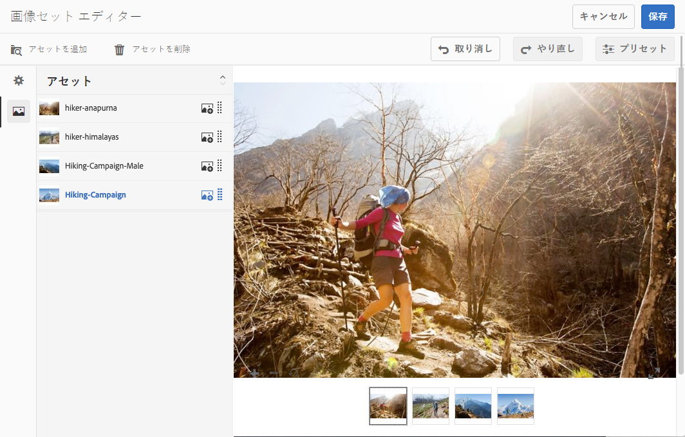
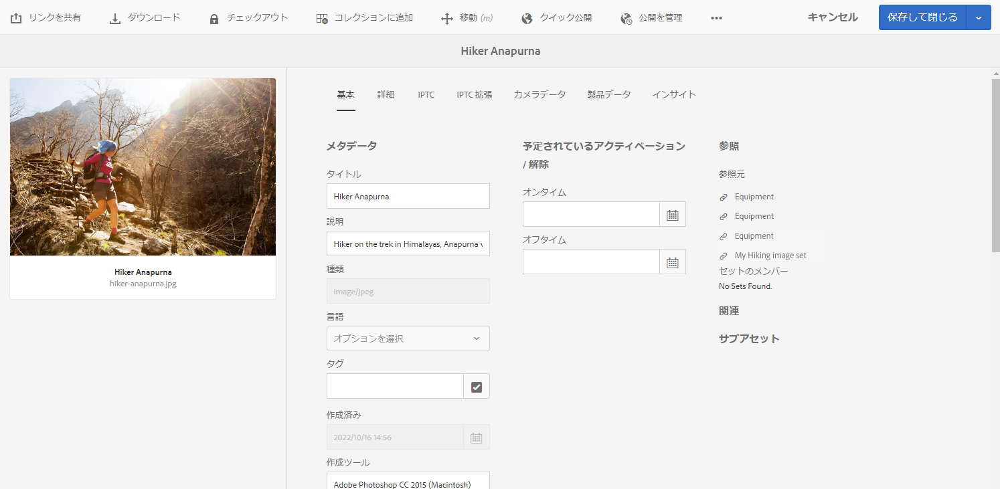
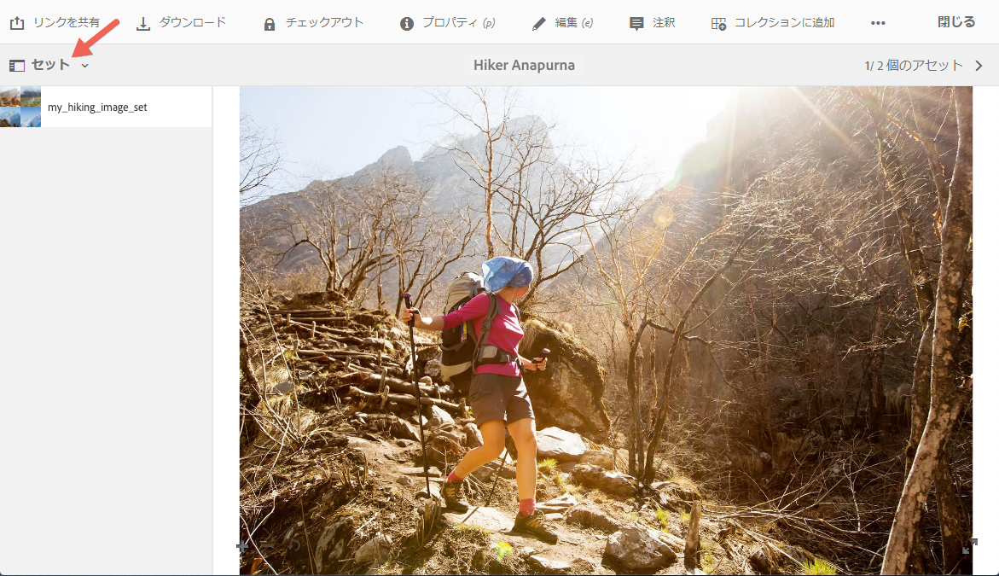
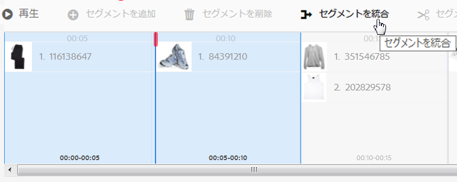

# 画像セット {#image-sets}

画像セットを使用すると、統合された表示エクスペリエンスが得られ、ユーザーはサムネール画像を選択して項目の様々なビューを表示できます。 画像セットによって、アイテムの代替的なビューを表示でき、ビューアでは画像をより近くで確認するためのズームツールを利用できます。

画像セットのバナーには、「 `IMAGESET`. また、画像セットが公開されている場合、公開日が&#x200B;**[!UICONTROL 地球]**&#x200B;アイコン付きでバナーに表示され、最終変更日も&#x200B;**[!UICONTROL 鉛筆]**&#x200B;アイコン付きで表示されます。

画像セット内では、画像セットを作成しサムネールを追加することで、スウォッチを作成することもできます。

この使い方は、アイテムを異なる色、パターンまたは仕上がりで表示する場合に便利です。カラースウォッチを含む画像セットを作成するには、ユーザーに表示する色、パターンまたは仕上がりごとに画像を 1 つずつ用意する必要があります。また、色、パターンまたは仕上がりごとに 1 つのカラースウォッチ、パターンスウォッチまたは仕上がりスウォッチを用意する必要もあります。

例として、つばの色が異なる帽子の画像を表示します。つばの色は、赤、緑、青です。この場合、同じ帽子について 3 つの写真が必要になります。赤のつばの写真、緑のつばの写真、青のつばの写真が必要です。また、赤のカラースウォッチ、緑のカラースウォッチ、青のカラースウォッチも必要になります。カラースウォッチは、スウォッチセットビューアで選択したサムネールとして機能し、赤い、緑の、または青い、札の付いたキャップを表示します。

>[!NOTE]
>
>Assets ユーザーインターフェイスについて詳しくは、 [アセットの管理](/help/assets/manage-assets.md).

## クイックスタート：画像セット {#quick-start-image-sets}

**すぐに使い始めるには：**

1. [複数ビュー用のプライマリソース画像をアップロードします](#uploading-assets-in-image-sets)。

   まずは画像セット用の画像をアップロードします。画像を選択する際には、ユーザーは画像セットビューアで画像をズームできます。 最適なズーム詳細には、最大サイズで 2,000 ピクセル以上の画像を使用してください。Dynamic Mediaでは、それぞれ最大 25 MP（メガピクセル）の画像をレンダリングできます。 例えば、5000 x 5000 MP の画像や、その他のサイズの組み合わせを最大 25 MP まで使用できます。

   詳しくは、 [Dynamic Media — サポートされるラスターイメージ形式](/help/assets/assets-formats.md#supported-raster-image-formats-dynamic-media) 画像セットでサポートされる形式のリスト。

<!--    Adobe Experience Manager Assets supports many image file formats, but lossless TIFF, PNG, and EPS images are recommended. -->

1. [画像セットを作成します](#creating-image-sets)。

   画像セットで、ユーザーは画像セットビューアでサムネール画像を選択します。

   Assets で画像セットを作成するには、に移動します。 **[!UICONTROL 作成]** > **[!UICONTROL 画像セット]**. 次に、画像を追加し、「 **[!UICONTROL 保存]**.

   [バッチセットプリセット](/help/assets/config-dms7.md)を使用して画像セットを自動的に作成することもできます。
   >[!IMPORTANT]
   >
   >バッチセットは、アセットの取り込みの一環として IPS(Image Production System) で作成され、Dynamic Media - Scene7モードでのみ使用できます。

   詳しくは、 [アップロード用の画像セットアセットの準備とファイルのアップロード](#uploading-assets-in-image-sets).

   [セレクターの操作](/help/assets/working-with-selectors.md)を参照してください。

1. 必要に応じて[画像セットビューアプリセット](/help/assets/managing-viewer-presets.md)を追加します。

   管理者は、画像セットビューアプリセットを作成または編集できます。画像セットを特定のビューアプリセットで表示するには、画像セットを選択し、左側のレールのドロップダウンメニューで「 」を選択します。 **[!UICONTROL ビューア]**.

   に移動します。 **[!UICONTROL ツール]** > **[!UICONTROL Assets]** > **[!UICONTROL ビューアプリセット]** ビューアプリセットを作成または編集する場合。

1. （オプション）バッチセットプリセットを使用して作成した[画像セットの表示](/help/assets/image-sets.md#viewing-image-sets)
1. [画像セットをプレビューします](/help/assets/previewing-assets.md)。

   画像セットを選択すると、プレビューできます。サムネールアイコンを選択して、選択したビューアでの画像セットの表示を確認できます。 **[!UICONTROL ビューア]**&#x200B;メニューから様々なビューアを選択できます。このメニューは左パネルのドロップダウンメニューにあります。

1. [画像セットを発行します](/help/assets/publishing-dynamicmedia-assets.md)。

   画像セットを公開すると、URL と埋め込みコードがアクティベートされます。 さらに、作成した[カスタムビューアプリセットを公開する](/help/assets/managing-viewer-presets.md)必要があります。既製のビューアプリセットが既に公開されています。

1. [URL を Web アプリケーションにリンクする](/help/assets/linking-urls-to-yourwebapplication.md)か、[ビデオビューアまたは画像ビューアを埋め込みます](/help/assets/embed-code.md)。

   画像セットの URL 呼び出しが作成され、画像セットの公開後にそれらの URL 呼び出しがアクティベートされます。アセットをプレビューする際に、これらの URL をコピーできます。または、URL を Web サイトに埋め込むこともできます。

   画像セットを選択し、左パネルのドロップダウンメニューで「**[!UICONTROL ビューア]**」を選択します。

   詳しくは、[Web ページへの画像セットのリンク](/help/assets/linking-urls-to-yourwebapplication.md)および[ビデオビューアまたは画像ビューアの埋め込み](/help/assets/embed-code.md)を参照してください。

画像セットを編集するには、 [画像セットを編集](#editing-image-sets). を参照してください。また、[画像セットのプロパティ](/help/assets/manage-assets.md#editing-properties)を表示および編集することができます。

セットの作成で問題が発生した場合は、[Dynamic Media - Scene7 モードのトラブルシューティング](/help/assets/troubleshoot-dms7.md#images-and-sets)の「画像とセット」を参照してください。

## 画像セット内のアセットのアップロード {#uploading-assets-in-image-sets}

まずは画像セット用の画像をアップロードします。画像を選択する際には、ユーザーは画像セットビューアで画像をズームできます。 最大サイズで 2,000 ピクセル以上の画像を使用してください。画像セットでは多くの画像ファイル形式がサポートされますが、可逆圧縮 TIFF、PNG および EPS 画像の使用が推奨されます。

画像セット用の画像のアップロードは、[AEM Assets での他のアセットのアップロード](/help/assets/manage-assets.md#uploading-assets)と同様に実行できます。

詳しくは、 [Dynamic Media — サポートされるラスターイメージ形式](/help/assets/assets-formats.md#supported-raster-image-formats-dynamic-media) 画像セットでサポートされる形式のリスト。

### アップロード用の画像セットアセットの準備 {#preparing-image-set-assets-for-upload}

画像セットを作成する前に、画像が適切なサイズと形式であることを確認します。

複数ビューの画像セットを作成するには、異なる視点からアイテムを表示するための画像、または同じアイテムの異なる面を表示するための画像が必要になります。目標は、閲覧者がアイテムの見た目や機能について全体的に把握できるように、アイテムの重要な特徴を際立たせることです。

ユーザーは画像セット内で画像をズームできるので、最大サイズで 2,000 ピクセル以上の画像を使用してください。<!-- Assets support many image file formats, but lossless TIFF, PNG, and EPS images are recommended. -->

>[!NOTE]
>
>また、製品スウォッチを示すサムネールを使用する場合は、次の操作を行う必要があります。
>
>同じ画像を異なる色、パターンまたは仕上がりで表示するためのビネットまたは異なる写真が必要になります。また、それぞれの色、パターンまたは仕上がりに対応するサムネールファイルも必要です。例えば、同じジャケットをブラック、ブラウン、グリーンで表示する画像セットのサムネールを表示するには、次の項目が必要です。
>
>* 同じジャケットのブラック、ブラウンおよびグリーンの写真。
>* ブラック、ブラウンおよびグリーンの色のサムネール。

## 画像セットの作成 {#creating-image-sets}

画像セットは、ユーザーインターフェイスまたは API 経由で作成できます。ここでは、UI で画像セットを作成する方法について説明します。

>[!NOTE]
>
>[バッチセットプリセット](/help/assets/config-dms7.md#creating-batch-set-presets-to-auto-generate-image-sets-and-spin-sets)を使用して画像セットを自動的に作成することもできます。
>**重要：**&#x200B;バッチセットは IPS（Image Production System）によってアセット取り込みの一環として作成され、Dynamic Media - Scene7 モードでのみ使用できます。

画像セットに追加したアセットは、自動的に英数字順で追加されます。追加後に、手動でアセットの順番を変更したり、並べ替えたりすることができます。

>[!NOTE]
>
>ファイル名に「,」（コンマ）が含まれているアセットについては、画像セットはサポートされません。

**画像セットを作成するには：**

1. Experience Managerで、Experience Managerロゴを選択してグローバルナビゲーションコンソールにアクセスし、に移動します。 **[!UICONTROL ナビゲーション]** > **[!UICONTROL Assets]**. 画像セットを作成する場所に移動し、に移動します。 **[!UICONTROL 作成]** > **[!UICONTROL 画像セット]** をクリックして、画像セットエディターページを開きます。

   アセットを格納しているフォルダー内からセットを作成することもできます。

   

1. 画像セットエディターページで、 **[!UICONTROL タイトル]** フィールドに、画像セットの名前を入力します。 この名前は、画像セット全般のバナーに表示されます。オプションで、説明を入力します。

   

1. 次のいずれかの操作を行います。

   * 画像セットエディターページの左上隅付近にある「**[!UICONTROL アセットを追加]**」を選択します。

   * 画像セットエディターページの中央付近にある「**[!UICONTROL タップしてアセットセレクターを開く]**」を選択します。
   画像セットに含めるアセットを選択します。 選択済みのアセットにはチェックマークアイコンが付いています。作業が完了したら、ページの右上隅付近にある「**[!UICONTROL 選択]**」を選択します。

   アセットセレクターでは、キーワードを入力して **[!UICONTROL Enter]** キーをタップまたはクリックすることで、アセットを検索することができます。フィルターを適用して、検索結果を絞り込むこともできます。パス、コレクション、ファイルタイプおよびタグでフィルタリングできます。フィルターを選択してから、ツールバーの&#x200B;**[!UICONTROL フィルター]**&#x200B;アイコンを選択します。表示アイコンをタップし、**[!UICONTROL 列表示]**、**[!UICONTROL カード表示]**、**[!UICONTROL リスト表示]**&#x200B;のいずれかを選択してビューを変更します。

   [セレクターの操作](/help/assets/working-with-selectors.md)を参照してください。

   

1. 画像セットに追加したアセットは、自動的に英数字順で追加されます。追加後に、手動でアセットの順番を変更したり、並べ替えたりすることができます。

   必要に応じて、アセットのファイル名の右にあるアセットの並べ替えアイコンをドラッグして、画像をセットリスト内で上下に並べ替えます。

   

   サムネールまたはスウォッチを変更する場合は、 **+** **サムネール** アイコンをクリックし、必要なサムネールまたはスウォッチに移動します。 すべての画像の選択が完了したら、「 」を選択します。 **[!UICONTROL 保存]**.

1. （オプション）次のいずれかの操作を行います。

   * 画像を削除するには、画像を選択し、「**[!UICONTROL アセットを削除]**」を選択します。

   * ページの右上隅付近にプリセットを適用するには、「]**プリセット**[!UICONTROL 」を選択した後、すべてのアセットに一度に適用するプリセットを選択します。
   >[!NOTE]
   >
   >画像セットを作成する際に、画像セットのサムネールを変更したり、Experience Managerが画像セット内のアセットに基づいてサムネールを自動的に選択するように設定したりできます。 サムネールを選択するには、「 」を選択します。 **[!UICONTROL サムネールを変更]** 画像セットエディターページの「タイトル」フィールドの上にある任意の画像を選択します（他のフォルダーに移動して画像を探すこともできます）。 サムネールを選択した状態で、画像セットからサムネールを生成するExperience Managerを選択した場合は、「 **[!UICONTROL 切り替え先]** > **[!UICONTROL 自動サムネール]**.

1. 「**[!UICONTROL 保存]**」を選択します。新しく作成した画像セットが、作成先のフォルダーに表示されます。

## 画像セットの表示 {#viewing-image-sets}

画像セットは、ユーザーインターフェイスで作成することも、[バッチセットプリセット](/help/assets/config-dms7.md#creating-batch-set-presets-to-auto-generate-image-sets-and-spin-sets)を使用して自動的に作成することもできます。

>[!IMPORTANT]
>
>バッチセットは IPS で作成されます [画像制作システム] アセットの取り込みの一環として使用でき、Dynamic Media - Scene7モードでのみ使用できます。)

ただし、バッチセットプリセットを使用して作成したセットは、ユーザーインターフェイスに表示&#x200B;*されません*。これらのセットは 3 つの異なる方法で表示できます（これらの方法は、画像セットをユーザーインターフェイスで作成した場合も使用できます）。

* 個々のアセットのプロパティを開きます。選択したアセットが参照されている、またはメンバーとして含まれているセットがプロパティで示されます。セット全体を表示する場合は、セットの名前を選択します。

   

* 任意のセットのメンバー画像で、**[!UICONTROL セット]**&#x200B;メニューを選択して、アセットがメンバーとして含まれているセットを表示します。

   

* 検索で、「**[!UICONTROL フィルター]**」を選択し、「**[!UICONTROL Dynamic Media]**」を展開して「**[!UICONTROL セット]**」を選択します。

   検索結果として、UI で手動で作成した一致するセットか、バッチセットプリセットを使用して自動的に作成した一致するセットが返されます。自動セットの場合、検索クエリは、「次を含む」検索条件に基づくExperience Manager検索とは異なる「次の語句で始まる」検索条件を使用して実行されます。 フィルターを「**[!UICONTROL セット]**」に設定するのが、自動セットを検索する唯一の方法です。

   

>[!NOTE]
>
>セットは、ユーザーインターフェイスを使用して表示できます。詳しくは、 [画像セットを編集](#editing-image-sets).

## 画像セットの編集 {#editing-image-sets}

画像セットには、次のような様々な編集タスクを実行できます。

* 画像セットへの画像の追加
* 画像セット内の画像の順序を変更します。
* 画像セットのアセットの削除
* ビューアプリセットの適用
* 画像セットの削除

**画像セットを編集するには:**

1. 次のいずれかの操作を行います。

   * 画像セットアセット上にマウスポインターを置き、**[!UICONTROL 編集]**（鉛筆アイコン）を選択します。
   * 画像セットアセットの上にマウスポインターを置いて、「 **[!UICONTROL 選択]** （チェックマークアイコン）をクリックし、「 **[!UICONTROL 編集]** をクリックします。
   * 画像セットアセットでを選択し、「 」を選択します。 **[!UICONTROL 編集]** （鉛筆アイコン）を使用して、

1. 画像セット内の画像を編集するには、次のいずれかの操作を行います。

   * アセットを並べ替えるには、画像を新しい位置までドラッグします（並べ替えアイコンを選択して項目を移動します）。
   * 項目を昇順または降順に並べ替えるには、列の見出しを選択します。
   * アセットを追加するか既存のアセットを更新するには、 **[!UICONTROL アセットを追加]**. アセットに移動して選択し、ページの右上隅付近にある「]**選択**[!UICONTROL 」を選択します。

      >[!NOTE]
      >
      >Experience Manager でサムネール用に使用されている画像を別の画像に置き換えて削除しても、元のアセットは表示されたままになります。
   * アセットを削除するには、アセットを選択して、「**[!UICONTROL アセットを削除]**」を選択します。
   * プリセットを適用するには、ページの右上隅付近にある「**[!UICONTROL プリセット]**」を選択し、ビューアプリセットを選択します。
   * サムネールを追加または変更するには、該当するアセットの右横にあるサムネールアイコンを選択します。新しいサムネールまたはスウォッチアセットに移動して選択し、「**[!UICONTROL 選択]**」を選択します。
   * 画像セット全体を削除するには、画像セットの場所に移動して画像セットを選択し、「**[!UICONTROL 削除]**」を選択します。

   >[!NOTE]
   >
   >画像セット内の画像を編集するには、セットの場所に移動し、「 」を選択します。 **[!UICONTROL メンバーを設定]** 左側のレールで、個々のアセットの鉛筆アイコンを選択して、編集ウィンドウを開きます。

1. 編集が完了したら、「**[!UICONTROL 保存]**」を選択します。

## 画像セットのプレビュー {#previewing-image-sets}

詳しくは、[アセットのプレビュー](/help/assets/previewing-assets.md)を参照してください。

## 画像セットを公開 {#publishing-image-sets}

[アセットの公開](/help/assets/publishing-dynamicmedia-assets.md)を参照してください。
