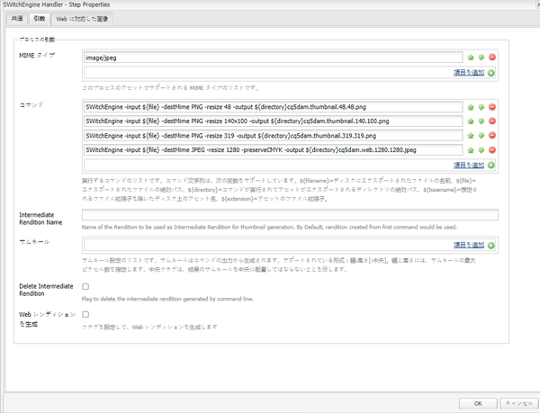
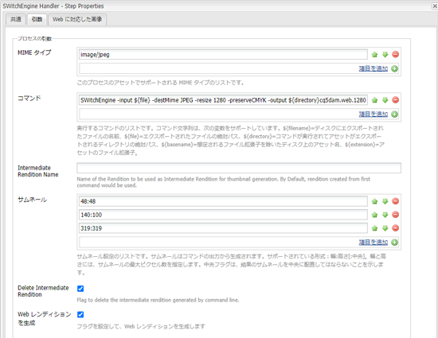

# 画像トランスコーディングライブラリ {#imaging-transcoding-library}

アドビの画像トランスコーディングライブラリは独自の画像処理ソリューションであり、以下のような中心的な画像処理機能を実行できます。

* エンコード
* トランスコーディング（サポートされる形式間での変換）
* PS およびインテル IPP アルゴリズムを使用する画像リサンプリング
* ビット深度およびカラープロファイルの保持
* JPEG画質圧縮
* 画像のサイズ変更

画像処理トランスコードライブラリは、CMYKをサポートし、CMYK -Alphaを除く完全なアルファをサポートします。

Imaging Transcoding Libraryは、幅広いファイル形式とプロファイルをサポートするだけでなく、パフォーマンス、拡張性、品質に関して、他のサードパーティ製のソリューションと比べて大きな利点を有します。 Imaging Transcoding Libraryを使用する主な利点は次のとおりです。

* **ファイルサイズまたは解像度を増やして拡大**：拡大・縮小は、主にファイルのデコード中のサイズ変更によって実現します。これは画像トランスコーディングライブラリに搭載された特許取得済みの機能です。この機能により、ランタイム中のメモリ使用状況が常に最適化され、ファイルサイズの増加やメガピクセル解像度の二次関数ではなくなります。画像トランスコーディングライブラリは、より大容量の高解像度（メガピクセル値がより高い）ファイルを処理できます。ImageMagick などのサードパーティツールの場合、大容量のファイルを処理できず、ファイルの処理中にクラッシュします。
* **Photoshop 品質の圧縮およびサイズ変更アルゴリズム**：ダウンサンプリングの品質（スムーズ、シャープ、自動バイキュービック）および圧縮品質に関する業界標準に準拠しています。Imaging Transcoding Libraryは、入力画像の画質係数をさらに評価し、出力画像の最適なテーブルと画質設定をインテリジェントに使用します。 この機能により、画質を損なうことなく最適なサイズのファイルが作成されます。
* **高スループット：** 応答時間は短く、スループットは常にImageMagickよりも長くなります。 したがって、Imaging Transcoding Libraryは、ユーザーの待ち時間を短縮し、ホスティングのコストを削減する必要があります。
* **同時負荷に対する拡張性：** Imaging Transcoding Libraryは、同時負荷条件下で最適に動作します。 CPU パフォーマンスとメモリ使用状況を最適化し、応答時間を短縮しながら、高スループットを実現するため、ホスティングコストを抑えることができます。

## サポートされているプラットフォーム {#supported-platforms}

Imaging Transcoding Libraryは、RHEL 7およびCentOS 7ディストリビューションでのみ使用できます。

>[!NOTE]
>
>Mac OS やその他の *nix 系ディストリビューション（Debian、Ubuntu など）はサポートされていません。

## 使用方法 {#usage}

画像トランスコーディングライブラリ用のコマンドライン引数には、以下を使用できます。

```shell
 -destMime PNG/JPEG: Mime type of output rendition
 -BitDepth 8/16: Preserves Bit Depth. Bitdepth ‘4’ is automatically converted to ‘8’
 -preserveBitDepth: Downscales Bit Depth (No upscaling)
 -preserveCMYK: Preserves CMYK color space
 -jpegQuality: Provides jpeg quality parameter (0-12 , corresponding to Photoshop qualities)
 -ResamplingMethod BiCubic/Lanczos/PSBicubic: Provides resampling methods. PSBicubic is a Photoshop quality resampling method.
 -resize
```

You can configure the following options for the `-resize` parameter:

* `X`: `Works similar to AEM. For example -resize 319.`
* `WxH`: `Aspect Ratio will not be maintained, For example -resize 319X319.`
* `Wx`: `Fixes the width and calculates the height maintaining the aspect ratio. For example -resize 319x.`
* `xH`: `Fixes the height and calculates the width maintaining the aspect ratio. For example -resize x319.`

```shell
 -AllowUpsampling (Resizes smaller images)
 -input <fileName>
 -output <fileName>
```

## 画像トランスコーディングライブラリの設定 {#configuring-imaging-transcoding-library}

ITL処理を設定するには、設定ファイルを作成し、ワークフローを更新して実行します。

### 抽出されたバンドルの設定ファイルを作成 {#create-conf-file}

ライブラリを設定するには、次の手順でライブラリを示す.confファイルを作成します。 管理者またはルート権限が必要です。

1. Download the [Imaging Transcoding Library package](https://www.adobeaemcloud.com/content/marketplace/marketplaceProxy.html?packagePath=/content/companies/public/adobe/packages/aem630/product/assets/aem-assets-imaging-transcoding-library-pkg) and install it using the Package Manager. パッケージはAEM 6.5と互換性があります。

1. のバンドルIDを確認するに `com.day.cq.dam.cq-dam-switchengine`は、Webコンソールにログインし、 **[!UICONTROL OSGi/Bundles]**&#x200B;をクリックします。 または、バンドルコンソールを開くには、 `https://[aem_server:[port]/system/console/bundles/` URLにアクセスします。 バンドルと `com.day.cq.dam.cq-dam-switchengine` そのIDを探します。

1. コマンドを使用してフォルダーをチェックし、必要なすべてのライブラリが抽出されていることを確認します。ここで `ls -la /aem65/author/crx-quickstart/launchpad/felix/bundle<id>/data/binaries/`、フォルダー名はバンドルIDを使用して構築されます。 例えば、バンドルIDが `ls -la /aem65/author/crx-quickstart/launchpad/felix/bundle588/data/binaries/` である場合、コマンドはで `588`す。

1. ライブラリにリンクする `SWitchEngineLibs.conf` ファイルを作成します。

   ```shell
   cd `/etc/ld.so.conf.d`
   touch SWitchEngineLibs.conf
   vi SWitchEngineLibs.conf
   ```

1. confファイルへの追加パス( `/aem65/author/crx-quickstart/launchpad/felix/bundle<id>/data/binaries/``cat SWitchEngineLibs.conf` コマンドを使用)。

1. コマンドを実行して、必要なリンクとキャッシュを作成します。 `ldconfig`

1. AEMの開始に使用するアカウントで、 `.bash_profile` ファイルを編集します。 次 `LD_LIBRARY_PATH` を追加追加します。

   ```shell
   LD_LIBRARY_PATH=.
   export LD_LIBRARY_PATH
   ```

1. パスの値をに確実に設定するには、 `.``echo $LD_LIBRARY_PATH` コマンドを使用します。 出力は次のとおりです `.`。 値がに設定されていない場合は `.`、セッションを再起動します。

### DAM更新アセット [!UICONTROL の構成] ワークフロー {#configure-dam-asset-update-workflow}

画像処理用ライブラリを使用するように、 [!UICONTROL DAM Update Asset] Workflowを更新します。

1. Experience Managerユーザーインターフェイスで、 **[!UICONTROL ツール/ワークフロー/モデルを選択します]**。

1. From the **[!UICONTROL Workflow Models]** page, open the **[!UICONTROL DAM Update Asset]** workflow model in edit mode.

1. Open the **[!UICONTROL Process Thumbnails]** workflow process step. In the **[!UICONTROL Thumbnails]** tab, add the MIME types for which you want to skip the default thumbnail generation process in the **[!UICONTROL Skip Mime Types]** list.
For example, if you want to create thumbnails for a TIFF image using Imaging Transcoding Library, specify `image/tiff` in the **[!UICONTROL Skip Mime Types]** field.

1. 「**[!UICONTROL Web に対応した画像]**」タブで、デフォルトの Web レンディション生成プロセスをスキップする MIME タイプを「**[!UICONTROL リストをスキップ]**」に追加します。For example, if you skipped MIME type `image/tiff` in the above step, add `image/tiff` to the skip list.

1. Open the **[!UICONTROL EPS thumbnails (powered by ImageMagick)]** step, navigate to the **[!UICONTROL Arguments]** tab. In the **[!UICONTROL Mime Types]** list, add the MIME types you want Imaging Transcoding Library to process. For example, if you skipped the MIME type `image/tiff` in the above step, add `image/jpeg` to the **[!UICONTROL Mime Types]** list.

1. 既定のコマンドが存在する場合は、そのコマンドを削除します。

1. サイドパネルを切り替えて、ステップのリストから&#x200B;**[!UICONTROL SWitchEngine ハンドラー]**&#x200B;を追加します。

1. コ追加マンドを [!UICONTROL SwitchEngine Handler] （カスタム要件に基づく）に追加します。 指定するコマンドのパラメータを要件に合わせて調整します。 例えば、JPEG 画像のカラープロファイルを保持したい場合、「**[!UICONTROL コマンド]**」リストに以下のコマンドを追加します。

   * `SWitchEngine -input ${file} -destMime PNG -resize 48 -output ${directory}cq5dam.thumbnail.48.48.png`
   * `SWitchEngine -input ${file} -destMime PNG -resize 140x100 -output ${directory}cq5dam.thumbnail.140.100.png`
   * `SWitchEngine -input ${file} -destMime PNG -resize 319 -output ${directory}cq5dam.thumbnail.319.319.png`
   * `SWitchEngine -input ${file} -destMime JPEG -resize 1280 -preserveCMYK -output ${directory}cq5dam.web.1280.1280.jpeg`
   

1. （オプション）1つのコマンドを使用して、中間レンディションからサムネールを生成します。 中間レンディションは静的レンディションと Web レンディションを生成するソースとなります。この方法は最初の方法より処理が高速です。ただし、この方法ではサムネールにカスタムパラメーターを適用できません。

   

1. Webレンディションを生成するには、「 **[!UICONTROL Web対応の画像]** 」タブでパラメータを設定します。

1. 更新された [!UICONTROL DAM Update Asset] Workflowモデルを同期します。 ワークフローを保存します。

設定の検証を行い、TIFF画像をアップロードしてerror.logファイルを監視します。 のメンションを含む `INFO` メッセージが表示され `SwitchEngineHandlingProcess execute: executing command line`ます。 ログには、生成されたレンディションが記述されています。 ワークフローが完了すると、AEMで新しいレンディションを表示できます。

>[!MORELIKETHIS]
>
>* [サポートされるMIMEタイプの記事](assets-formats.md#supported-image-transcoding-library)