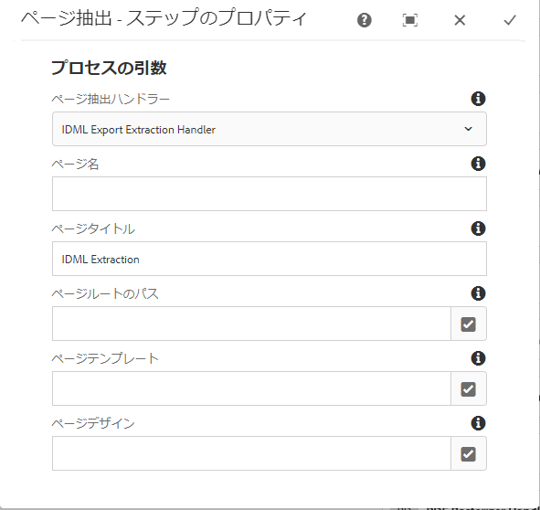
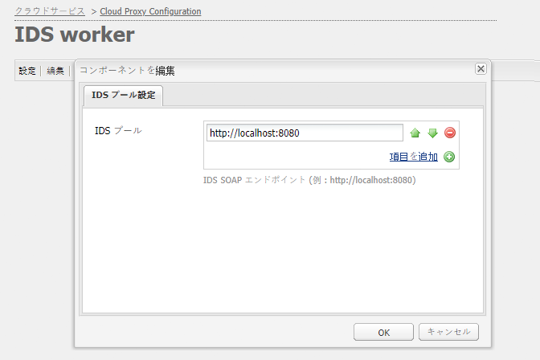

# 統合 [!DNL Adobe Experience Manager Assets] 対象 [!DNL Adobe InDesign Server] {#integrating-aem-assets-with-indesign-server}

[!DNL Adobe Experience Manager Assets] 使用する:

* プロキシ：特定の処理タスクのロードを分配するために使用します。A proxy is an [!DNL Experience Manager] instance that communicates with a proxy worker to fulfil a specific task, and other [!DNL Experience Manager] instances to deliver the results.
* プロキシワーカー：特定のタスクを定義し管理するために使用します。These can cover a wide variety of tasks; for example, using an [!DNL InDesign Server] to process files.

To fully upload files to [!DNL Experience Manager Assets] that you have created with [!DNL Adobe InDesign] a proxy is used. This uses a proxy worker to communicate with the [!DNL Adobe InDesign Server], where [scripts](https://www.adobe.com/jp/devnet/indesign/documentation.html#idscripting) are run to extract metadata and generate various renditions for [!DNL Experience Manager Assets]. The proxy worker enables the two-way communication between the [!DNL InDesign Server] and the [!DNL Experience Manager] instance(s) in a cloud configuration.

>[!NOTE]
>
>[!DNL Adobe InDesign] は、2つの異なるオファーとして提供されます。 [印刷やデジタル配布のためのページレイアウトのデザインに使用するAdobe InDesign](https://www.adobe.com/jp/products/indesign.html) デスクトップアプリケーション。 [Adobe InDesign Server](https://www.adobe.com/jp/products/indesignserver.html) では、で作成した内容に基づいて、自動ドキュメントをプログラムで作成でき [!DNL InDesign]ます。 ExtendScript [エンジンに対するインターフェイスを提供するサービスとして機能します。スクリプトは](https://www.adobe.com/jp/devnet/scripting.html) 、に似た形式で記述され [!DNL ExtendScript]てい [!DNL JavaScript]ます。 For information about [!DNL InDesign] scripts see [https://www.adobe.com/devnet/indesign/documentation.html#idscripting](https://www.adobe.com/jp/devnet/indesign/documentation.html#idscripting).

## How the extraction works {#how-the-extraction-works}

The [!DNL Adobe InDesign Server] can be integrated with [!DNL Experience Manager Assets] so that INDD files created with [!DNL InDesign] can be uploaded, renditions generated, all media extracted (for example, video) and stored as assets:

>[!NOTE]
>
>Previous versions of [!DNL Experience Manager] were able to extract XMP and the thumbnail, now all media can be extracted.

1. Upload your INDD file to [!DNL Experience Manager Assets].
1. A framework sends command script(s) to the [!DNL InDesign Server] via SOAP (Simple Object Access Protocol).
このコマンドスクリプトは、次のことを実行します。

   * INDD ファイルを取得します。
   * 実行 [!DNL InDesign Server] コマンド：

      * 構造、テキストおよびすべてのメディアファイルが抽出されます。
      * PDF と JPG のレンディションが生成されます。
      * HTML と IDML のレンディションが生成されます。
   * Post the resulting files back to [!DNL Experience Manager Assets].

   >[!NOTE]
   >
   >IDMLは、 [!DNL InDesign] ファイルのすべてのコンテンツをレンダリングするXMLベースの形式です。 It is stored as an compressed package using [ZIP](https://www.techterms.com/definition/zip) compression. 詳しくは、InDesign Interchange Formats INX and [IDMLを参照してください](http://www.peachpit.com/articles/article.aspx?p=1381880&amp;seqNum=8)。

   >[!CAUTION]
   >
   >If the [!DNL InDesign Server] is not installed or not configured, then you can still upload an INDD file into [!DNL Experience Manager]. ただし、この場合に生成されるレンディションは、PNG と JPEG に限定されます。HTML、IDML またはページのレンディションを生成することはできません。

1. 抽出およびレンダリング生成後：

   * 構造が `cq:Page`（レンディションタイプ）に複製されます。
   * The extracted text and files are stored in [!DNL Experience Manager Assets].
   * All renditions are stored in [!DNL Experience Manager Assets], in the asset itself.

## をExperience Manager [!DNL InDesign Server] と統合する {#integrating-the-indesign-server-with-aem}

To integrate the [!DNL InDesign Server] for use with [!DNL Experience Manager Assets] and after configuring your proxy, you need to:

1. [InDesign Server をインストールします](#installing-the-indesign-server)。
1. If required, [configure the Experience Manager Assets Workflow](#configuring-the-aem-assets-workflow).
これは、デフォルト値がインスタンスに適さない場合にのみ必要です。
1. [InDesign Server のプロキシワーカー](#configuring-the-proxy-worker-for-indesign-server)を設定します。

### Install the [!DNL InDesign Server] {#installing-the-indesign-server}

To install and start the [!DNL InDesign Server] for use with [!DNL Experience Manager]:

1. Download and install the [!DNL InDesign Server].

1. If required, you can customize the configuration of your [!DNL InDesign Server] instance.

1. コマンドラインから、サーバーを起動します。

   `<*ids-installation-dir*>/InDesignServer.com -port 8080`

   SOAP プラグインがポート 8080 でリスンする状態でサーバーが起動されます。すべてのログメッセージと出力がコマンドウィンドウに直接書き込まれます。

   >[!NOTE]
   >
   >ファイルに出力メッセージを保存してリダイレクトを使用する場合は、例えば Windows の場合は次のように実行します。
   >`<ids-installation-dir>/InDesignServer.com -port 8080 > ~/temp/INDD-logfile.txt 2>&1`

### ワークフローの設定 [!DNL Experience Manager Assets] {#configuring-the-aem-assets-workflow}

[!DNL Experience Manager Assets] には、次の項目に特にいくつかのプロセス手順を持つ、事前設定済みのワークフロー **[!UICONTROL DAM更新アセット]**&#x200B;があり [!DNL InDesign]ます。

* [メディア抽出](#media-extraction)
* [ページ抽出](#page-extraction)

This workflow is setup with default values that can be adapted for your setup on the various author instances (this is a standard workflow, so further information is available under [Editing a Workflow](/help/sites-developing/workflows-models.md#configuring-a-workflow-step)). If you are using the default values (including the SOAP port), then no configuration is needed.

After the setup, uploading [!DNL InDesign] files into [!DNL Experience Manager Assets] (by any of the usual methods) triggers the workflow to process the asset and prepare the various renditions. Test your configuration by uploading an INDD file into [!DNL Experience Manager Assets] to confirm that you see the different renditions created by IDS under `<*your_asset*>.indd/Renditions`

#### Media extraction {#media-extraction}

このステップでは、INDD ファイルからのメディアの抽出を制御します。

カスタマイズするには、**[!UICONTROL メディア抽出]**&#x200B;ステップの「**[!UICONTROL 引数]**」タブを編集します。

メディア抽出の引数とスクリプトパス

* **ExtendScript library**: これは、他のスクリプトで必要となる、単純なhttpのget/postメソッドライブラリです。

* **拡張スクリプト**: ここでは、異なるスクリプトの組み合わせを指定できます。 If you want your own scripts to be executed on the [!DNL InDesign Server], save the scripts at `/apps/settings/dam/indesign/scripts`.

スクリプトについて詳し [!DNL Adobe InDesign] くは、InDesign開発者ドキュメントを参照し [てください](https://www.adobe.com/jp/devnet/indesign/documentation.html#idscripting)

>[!CAUTION]
>
>ExtendScript ライブラリは変更しないでください。このライブラリは Sling との通信に必要になる HTTP 機能を提供するものです。This setting specifies the library to be send to the [!DNL InDesign Server] for use there.

The `ThumbnailExport.jsx` script run by the Media Extraction workflow step generates a thumbnail rendition in JPG format. This rendition is used by the Process Thumbnails workflow step to generate the static renditions required by [!DNL Experience Manager].

サムネールを処理ワークフローステップは、異なるサイズの静的レンディションを生成するように設定できます。Ensure that you do not remove the defaults, because they are required by the [!DNL Experience Manager Assets] interface. 最後に、「画像プレビューのレンディションを削除」ワークフローの手順で、JPGサムネールのレンディションが不要になったので削除されます。

#### Page extraction {#page-extraction}

This creates an [!DNL Experience Manager] page from the extracted elements. 抽出ハンドラーが、レンディション（現時点では HTML または IDML）からデータを抽出するために使用されます。このデータを元に、PageBuilder を使用してページが作成されます。

カスタマイズするには、**[!UICONTROL ページ抽出]**&#x200B;ステップの「**[!UICONTROL 引数]**」タブを編集します。

* **ページ抽出ハンドラ**: ポップアップリストから、使用するハンドラーを選択します。 抽出ハンドラーは、関連する `RenditionPicker`（`ExtractionHandler` API を参照）によって選択された特定のレンディションに対して動作します。In a standard [!DNL Experience Manager] installation the following is available:
   * IDML Export Extraction Handle: Operates on the `IDML` rendition generated in the MediaExtract step.

* **ページ名**: 結果のページに割り当てる名前を指定します。 空白の場合、名前は「page」（「page」が既に存在する場合は派生）になります。

* **ページタイトル**: 結果のページに割り当てるタイトルを指定します。

* **Page Root Path**: 結果のページのルート位置へのパス。 空白のままにすると、アセットのレンディションを保持するノードが使用されます。

* **ページテンプレート**: 結果のページの生成時に使用するテンプレートです。

* **ページデザイン**: 結果のページを生成するときに使用するページデザインです。

### 次のプロキシワーカーを設定 [!DNL InDesign Server] {#configuring-the-proxy-worker-for-indesign-server}

>[!NOTE]
>
>ワーカーは、プロキシインスタンス上にあります。

1. 「ツール」コンソールの左側のウィンドウで、「**[!UICONTROL クラウドサービス設定]**」を展開します。次に、「**[!UICONTROL クラウドプロキシ設定]**」を展開します。

1. 「**[!UICONTROL IDS ワーカー]**」をダブルクリックし、開いて設定します。

1. 「**[!UICONTROL 編集]**」をクリックして設定ダイアログを開き、必要な設定を定義します。

   

   * **IDS Pool**：との通信に使用するSOAPエンドポイント [!DNL InDesign Server]。 アイテムの追加、削除、および注文は必須にすることができます。

1. 「OK」をクリックして保存します。

### Configure Day CQ Link Externalizer {#configuring-day-cq-link-externalizer}

If the [!DNL InDesign Server] and [!DNL Experience Manager] run on different hosts or either or both these applications do not run on default ports, configure [!UICONTROL Day CQ Link Externalizer] to set the host name, port, and content path for the [!DNL InDesign Server].

1. Access the Web Console at `https://[aem_server]:[port]/system/console/configMgr`.
1. Locate the configuration **[!UICONTROL Day CQ Link Externalizer]**, and click **[!UICONTROL Edit]** to open it.
1. Specify the host name and context path for the [!DNL Adobe InDesign Server] and click **Save**.

   

### 次の並列ジョブ処理を有効にする [!DNL InDesign Server] {#enabling-parallel-job-processing-for-indesign-server-s}

IDS の並列ジョブ処理を有効にすることができます。処理可能な並列ジョブ(`x`)の最大数を決定 [!DNL InDesign Server] します。

* On a single multiprocessor machine, the maximum number of parallel jobs (`x`) that an [!DNL InDesign Server] can process is one less than the number of processors running IDS.
* 複数のマシンで IDS を実行する場合は、すべてのマシンで使用可能なプロセッサーの総数を把握して、そこからマシン総数を減算する必要があります。

IDS 並列ジョブ数を設定するには：

1. Felix Console の「**[!UICONTROL Configurations]**」タブを開きます。次に URL の例を挙げます。 `https://[aem_server]:[port]/system/console/configMgr`.

1. Select the IDS processing queue under `Apache Sling Job Queue Configuration`.

1. 次のように設定します。

   * **Type** - `Parallel`
   * **Maximum Parallel Jobs** - `<*x*>`（上で計算した値）

1. これらの変更を保存します。
1. Adobe CS6以降でマルチセッションサポートを有効にするには、「 `enable.multisession.name``com.day.cq.dam.ids.impl.IDSJobProcessor.name` 設定」のチェックボックスをオンにします。
1. [IDS ワーカー設定](#configuring-the-proxy-worker-for-indesign-server)に SOAP エンドポイントを追加して、`x` 個の IDS ワーカーから成るプールを作成します。

   If there are multiple machines running [!DNL InDesign Server], add SOAP endpoints (number of processors per machine -1) for each machine.

<!-- 
TBD: Make updates to configurations for allow and block list after product updates are done.
-->

>[!NOTE]
>
>ワーカーのプールを使用する場合、IDSワーカーのブロックリストを有効にできます。
>
>To do so, enable the **[!UICONTROL enable.retry.name]** checkbox, under the `com.day.cq.dam.ids.impl.IDSJobProcessor.name` configuration, which enables IDS job retrials.
>
>Also, under the `com.day.cq.dam.ids.impl.IDSPoolImpl.name` configuration, set a positive value for `max.errors.to.blacklist` parameter which determines number of job retrials before barring an IDS from the job handlers list.
>
>By default, after the configurable (`retry.interval.to.whitelist.name`) time in minutes the IDS worker is revalidated. ワーカーがオンラインで見つかった場合は、ブロックされたリストから削除されます。

## 10.0以降のサポート [!DNL InDesign Server] を有効にする {#enabling-support-for-indesign-server-or-later}

For [!DNL InDesign Server] 10.0 or higher, perform the following steps to enable multi-session support.

1. Open Configuration Manager from your [!DNL Experience Manager Assets] instance `https://[aem_server]:[port]/system/console/configMgr`.
1. 設定 `com.day.cq.dam.ids.impl.IDSJobProcessor.name` を編集します。
1. **[!UICONTROL ids.cc.enable]** オプションを選択し、「**[!UICONTROL 保存]**」をクリックします。

>[!NOTE]
>
>For [!DNL InDesign Server] integration with [!DNL Experience Manager Assets], use a multi-core processor because the session support feature necessary for the integration is not supported on single core systems.

## 秘密鍵 [!DNL Experience Manager] 証明書の設定 {#configure-aem-credentials}

You can change the default administrator credentials (user name and password) for accessing the [!DNL InDesign Server] from your [!DNL Experience Manager] instance without breaking the integration with the [!DNL InDesign Server].

1. `/etc/cloudservices/proxy.html` にアクセスします。
1. ダイアログで、新しいユーザー名とパスワードを指定します。
1. この資格情報を保存します。

>[!MORELIKETHIS]
>
>* [Adobe InDesign Serverについて](https://www.adobe.com/products/indesignserver/faq.html)

