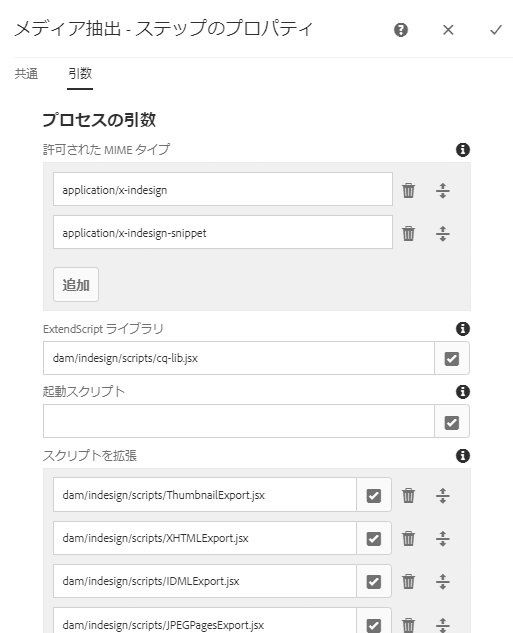

# [!DNL Adobe Experience Manager Assets]と[!DNL Adobe InDesign Server] {#integrating-aem-assets-with-indesign-server}を統合します

[!DNL Adobe Experience Manager Assets] 使用する:

* プロキシ：特定の処理タスクのロードを分配するために使用します。プロキシとは、プロキシワーカーと通信して特定のタスクを実行し、他の[!DNL Experience Manager]インスタンスと通信して結果を配信する[!DNL Experience Manager]インスタンスです。
* プロキシワーカー：特定のタスクを定義し管理するために使用します。これらは、様々な作業をカバーできます。例えば、[!DNL InDesign Server]を使用してファイルを処理します。

[!DNL Adobe InDesign]で作成したファイルを[!DNL Experience Manager Assets]に完全にアップロードするには、プロキシを使用します。 これは、プロキシワーカーを使用して[!DNL Adobe InDesign Server]と通信します。[スクリプト](https://www.adobe.com/jp/devnet/indesign/documentation.html#idscripting)は、メタデータを抽出し、[!DNL Experience Manager Assets]の様々なレンディションを生成するために実行されます。 プロキシワーカーは、クラウド構成内の[!DNL InDesign Server]インスタンスと[!DNL Experience Manager]インスタンス間の双方向通信を可能にします。

>[!NOTE]
>
>[!DNL Adobe InDesign] は、2つの異なるオファーとして提供されます。[Adobe](https://www.adobe.com/jp/products/indesign.html) 印刷やデジタル配信用のページレイアウトのデザインに使用するInDesignデスクトップアプリケーション。[Adobe InDesign ](https://www.adobe.com/jp/products/indesignserver.html) Serveleでは、での作成に基づいて、自動化されたドキュメントをプログラムで作成できま [!DNL InDesign]す。[ExtendScript](https://www.adobe.com/jp/devnet/scripting.html)エンジンへのインターフェイスを提供するサービスとして動作します。スクリプトは[!DNL ExtendScript]で記述され、[!DNL JavaScript]に似ています。 [!DNL InDesign]スクリプトについて詳しくは、[https://www.adobe.com/devnet/indesign/documentation.html#idscripting](https://www.adobe.com/devnet/indesign/documentation.html#idscripting)を参照してください。

## 抽出の仕組み{#how-the-extraction-works}

[!DNL Adobe InDesign Server]を[!DNL Experience Manager Assets]と統合して、[!DNL InDesign]で作成されたINDDファイルのアップロード、レンディションの生成、すべてのメディアの抽出（ビデオなど）をおこない、アセットとして保存できます。

>[!NOTE]
>
>以前のバージョンの[!DNL Experience Manager]ではXMPとサムネールを抽出できましたが、現在はすべてのメディアを抽出できます。

1. INDDファイルを[!DNL Experience Manager Assets]にアップロードします。
1. フレームワークは、コマンドスクリプトをSOAP(Simple Object Access Protocol)経由で[!DNL InDesign Server]に送信します。
このコマンドスクリプトは、次のことを実行します。

   * INDD ファイルを取得します。
   * [!DNL InDesign Server]コマンドを実行します。

      * 構造、テキストおよびすべてのメディアファイルが抽出されます。
      * PDF と JPG のレンディションが生成されます。
      * HTML と IDML のレンディションが生成されます。
   * 結果のファイルを[!DNL Experience Manager Assets]に戻します。

   >[!NOTE]
   >
   >IDMLは、[!DNL InDesign]ファイルのすべてのコンテンツをレンダリングするXMLベースの形式です。 [ZIP](https://www.techterms.com/definition/zip)圧縮を使用した圧縮パッケージとして保存されます。 詳しくは、[InDesign交換形式INXおよびIDML](https://www.peachpit.com/articles/article.aspx?p=1381880&amp;seqNum=8)を参照してください。

   >[!CAUTION]
   >
   >[!DNL InDesign Server]がインストールされていない場合や設定されていない場合でも、[!DNL Experience Manager]にINDDファイルをアップロードできます。 ただし、この場合に生成されるレンディションは、PNG と JPEG に限定されます。HTML、IDML またはページのレンディションを生成することはできません。

1. 抽出およびレンダリング生成後：

   * 構造が `cq:Page`（レンディションタイプ）に複製されます。
   * 抽出されたテキストとファイルは、[!DNL Experience Manager Assets]に格納されます。
   * すべてのレンディションは、アセット自体の[!DNL Experience Manager Assets]に保存されます。

## [!DNL InDesign Server]をExperience Manager{#integrating-the-indesign-server-with-aem}と統合する

[!DNL InDesign Server]を[!DNL Experience Manager Assets]と共に使用するために統合するには、プロキシを設定した後に次の手順を実行する必要があります。

1. [InDesign Server をインストールします](#installing-the-indesign-server)。
1. 必要に応じて、[Experience Managerアセットワークフロー](#configuring-the-aem-assets-workflow)を設定します。
これは、デフォルト値がインスタンスに適さない場合にのみ必要です。
1. [InDesign Server のプロキシワーカー](#configuring-the-proxy-worker-for-indesign-server)を設定します。

### [!DNL InDesign Server] {#installing-the-indesign-server}

[!DNL InDesign Server]をインストールして[!DNL Experience Manager]で使用するには、次の手順に従います。

1. [!DNL InDesign Server]をダウンロードしてインストールします。

1. 必要に応じて、[!DNL InDesign Server]インスタンスの設定をカスタマイズできます。

1. コマンドラインから、サーバーを起動します。

   `<*ids-installation-dir*>/InDesignServer.com -port 8080`

   SOAP プラグインがポート 8080 でリスンする状態でサーバーが起動されます。すべてのログメッセージと出力がコマンドウィンドウに直接書き込まれます。

   >[!NOTE]
   >
   >ファイルに出力メッセージを保存してリダイレクトを使用する場合は、例えば Windows の場合は次のように実行します。
   >`<ids-installation-dir>/InDesignServer.com -port 8080 > ~/temp/INDD-logfile.txt 2>&1`

### [!DNL Experience Manager Assets]ワークフロー{#configuring-the-aem-assets-workflow}を設定します

[!DNL Experience Manager Assets] には、特に次の処理手順を含む、事前設 **[!UICONTROL 定済みのワークフロー「DAMアセットの更新]**」があり [!DNL InDesign]ます。

* [メディア抽出](#media-extraction)
* [ページ抽出](#page-extraction)

このワークフローは、様々なオーサーインスタンスで設定に合わせて調整できるデフォルト値を使用して設定されます（これは標準のワークフローなので、詳しくは、[ワークフローの編集](/help/sites-developing/workflows-models.md#configuring-a-workflow-step)を参照してください）。 デフォルト値（SOAPポートを含む）を使用している場合は、設定は不要です。

設定後、（通常の方法のいずれかによって）[!DNL InDesign]ファイルを[!DNL Experience Manager Assets]にアップロードすると、ワークフローがトリガーされ、アセットが処理されて様々なレンディションが準備されます。 INDDファイルを[!DNL Experience Manager Assets]にアップロードし、`<*your_asset*>.indd/Renditions`の下にIDSで作成された様々なレンディションが表示されることを確認して、設定をテストします。

#### メディア抽出{#media-extraction}

このステップでは、INDD ファイルからのメディアの抽出を制御します。

カスタマイズするには、**[!UICONTROL メディア抽出]**&#x200B;ステップの「**[!UICONTROL 引数]**」タブを編集します。

メディア抽出の引数とスクリプトパス

* **ExtendScriptライブラリ**:これは、他のスクリプトに必要な単純なhttp get/postメソッドライブラリです。

* **スクリプトの拡張**:ここで様々なスクリプトの組み合わせを指定できます。[!DNL InDesign Server]で独自のスクリプトを実行する場合は、`/apps/settings/dam/indesign/scripts`にスクリプトを保存します。

[!DNL Adobe InDesign]スクリプトについて詳しくは、[InDesign開発者向けドキュメント](https://www.adobe.com/devnet/indesign/documentation.html#idscripting)を参照してください。

>[!CAUTION]
>
>ExtendScript ライブラリは変更しないでください。このライブラリは Sling との通信に必要になる HTTP 機能を提供するものです。この設定では、[!DNL InDesign Server]に送信してそこで使用するライブラリを指定します。

メディア抽出ワークフローステップで実行される`ThumbnailExport.jsx`スクリプトにより、サムネールのレンディションがJPG形式で生成されます。 このレンディションは、サムネールを処理ワークフローステップで[!DNL Experience Manager]に必要な静的レンディションを生成するために使用されます。

サムネールを処理ワークフローステップは、異なるサイズの静的レンディションを生成するように設定できます。デフォルト値は[!DNL Experience Manager Assets]インターフェイスで必要になるので、削除しないでください。 最後に、画像プレビューレンディションを削除ワークフローステップで、JPGサムネールレンディションが不要になったので削除されます。

#### ページ抽出{#page-extraction}

抽出された要素から[!DNL Experience Manager]ページが作成されます。 抽出ハンドラーが、レンディション（現時点では HTML または IDML）からデータを抽出するために使用されます。このデータを元に、PageBuilder を使用してページが作成されます。

カスタマイズするには、**[!UICONTROL ページ抽出]**&#x200B;ステップの「**[!UICONTROL 引数]**」タブを編集します。

* **ページ抽出ハンドラー**:ポップアップ・リストから、使用するハンドラを選択します。抽出ハンドラーは、関連する `RenditionPicker`（`ExtractionHandler` API を参照）によって選択された特定のレンディションに対して動作します。標準の[!DNL Experience Manager]インストールでは、次の機能を使用できます。
   * IDML書き出し抽出ハンドル：MediaExtractステップで生成された`IDML`レンディションに対して動作します。

* **ページ名**:生成されるページに割り当てる名前を指定します。空白の場合、名前は「page」（「page」が既に存在する場合は派生形）になります。

* **ページタイトル**:生成されるページに割り当てるタイトルを指定します。

* **ページルートパス**:生成されるページのルート位置へのパス。空白の場合、アセットのレンディションを保持しているノードが使用されます。

* **ページテンプレート**:ページの生成時に使用するテンプレート。

* **ページデザイン**:ページの生成時に使用するページデザイン。

### [!DNL InDesign Server] {#configuring-the-proxy-worker-for-indesign-server}のプロキシワーカーを設定します。

>[!NOTE]
>
>ワーカーは、プロキシインスタンス上にあります。

1. 「ツール」コンソールの左側のウィンドウで、「**[!UICONTROL クラウドサービス設定]**」を展開します。次に、「**[!UICONTROL クラウドプロキシ設定]**」を展開します。

1. 「**[!UICONTROL IDS ワーカー]**」をダブルクリックし、開いて設定します。

1. 「**[!UICONTROL 編集]**」をクリックして設定ダイアログを開き、必要な設定を定義します。

   

   * **IDS**
Pool：との通信に使用するSOAPエンドポイント [!DNL InDesign Server]。必要な項目の追加、削除および並べ替えを行うことができます。

1. 「OK」をクリックして保存します。

### Day CQ Link Externalizer {#configuring-day-cq-link-externalizer}の設定

[!DNL InDesign Server]と[!DNL Experience Manager]が別のホスト上にある場合、またはこれらのアプリケーションの一方または両方がデフォルトのポートで動作しない場合は、[!UICONTROL Day CQ Link Externalizer]を設定して、[!DNL InDesign Server]のホスト名、ポートおよびコンテンツのパスを設定します。

1. `https://[aem_server]:[port]/system/console/configMgr`のWebコンソールにアクセスします。
1. 設定&#x200B;**[!UICONTROL Day CQ Link Externalizer]**&#x200B;を探します。 **[!UICONTROL 編集]**&#x200B;をクリックして開きます。
1. Link Externalizerの設定は、[!DNL Experience Manager]デプロイメントと[!DNL InDesign Server]の絶対URLを作成するのに役立ちます。 **[!UICONTROL Domains]**&#x200B;フィールドを使用して、[!DNL Adobe InDesign Server]のホスト名とコンテキストパスを指定します。 「**保存**」をクリックします。

   

### [!DNL InDesign Server] {#enabling-parallel-job-processing-for-indesign-server}の並列ジョブ処理を有効にする

IDS の並列ジョブ処理を有効にすることができます。[!DNL InDesign Server]が処理できる並列ジョブの最大数(`x`)を決定します。

* 1台のマルチプロセッサマシンで、[!DNL InDesign Server]が処理できる並列ジョブ(`x`)の最大数は、IDSを実行するプロセッサの数より1減ります。
* 複数のマシンで IDS を実行する場合は、すべてのマシンで使用可能なプロセッサーの総数を把握して、そこからマシン総数を減算する必要があります。

IDS 並列ジョブ数を設定するには：

1. Felix Console の「**[!UICONTROL Configurations]**」タブを開きます。次に URL の例を挙げます。`https://[aem_server]:[port]/system/console/configMgr` です。

1. `Apache Sling Job Queue Configuration`の下のIDS処理キューを選択します。

1. 次のように設定します。

   * **Type** - `Parallel`
   * **Maximum Parallel Jobs** - `<*x*>`（上で計算した値）

1. これらの変更を保存します。
1. AdobeCS6以降のマルチセッションサポートを有効にするには、`com.day.cq.dam.ids.impl.IDSJobProcessor.name`設定の下にある`enable.multisession.name`チェックボックスをオンにします。
1. [IDS ワーカー設定](#configuring-the-proxy-worker-for-indesign-server)に SOAP エンドポイントを追加して、`x` 個の IDS ワーカーから成るプールを作成します。

   [!DNL InDesign Server]を実行する複数のマシンがある場合は、各マシンにSOAPエンドポイント（マシン1台あたりのプロセッサ数 —1）を追加します。

<!-- 
TBD: Make updates to configurations for allow and block list after product updates are done.
-->

>[!NOTE]
>
>ワーカーのプールを操作する場合、IDSワーカーのブロックリストを有効にできます。
>
>そのためには、`com.day.cq.dam.ids.impl.IDSJobProcessor.name`設定の下にある&#x200B;**[!UICONTROL enable.retry.name]**&#x200B;チェックボックスをオンにします。これにより、IDSジョブ再試行が有効になります。
>
>また、`com.day.cq.dam.ids.impl.IDSPoolImpl.name`設定の下の`max.errors.to.blacklist`パラメーターに正の値を設定します。このパラメーターは、IDSをジョブハンドラーリストから除外するまでのジョブ再試行回数を指定します。
>
>デフォルトでは、設定可能な(`retry.interval.to.whitelist.name`)時間（分）が経過すると、IDSワーカーが再検証されます。 ワーカーがオンラインである場合は、ブロックリストから削除されます。

## [!DNL InDesign Server] 10.0以降の{#enabling-support-for-indesign-server-or-later}のサポートを有効にする

[!DNL InDesign Server] 10.0以降の場合は、次の手順を実行してマルチセッションサポートを有効にします。

1. [!DNL Experience Manager Assets]インスタンス`https://[aem_server]:[port]/system/console/configMgr`からConfiguration Managerを開きます。
1. 設定 `com.day.cq.dam.ids.impl.IDSJobProcessor.name` を編集します。
1. **[!UICONTROL ids.cc.enable]** オプションを選択し、「**[!UICONTROL 保存]**」をクリックします。

>[!NOTE]
>
>[!DNL Experience Manager Assets]との[!DNL InDesign Server]統合の場合、統合に必要なセッションサポート機能はシングルコアシステムではサポートされないので、マルチコアプロセッサを使用してください。

## [!DNL Experience Manager]資格情報{#configure-aem-credentials}の設定

[!DNL InDesign Server]との統合を中断することなく、[!DNL Experience Manager]デプロイメントから[!DNL InDesign Server]にアクセスするためのデフォルトの管理者資格情報（ユーザー名とパスワード）を変更できます。

1. `/etc/cloudservices/proxy.html` にアクセスします。
1. ダイアログで、新しいユーザー名とパスワードを指定します。
1. この資格情報を保存します。

>[!MORELIKETHIS]
>
>* [Adobe InDesign Serverについて](https://www.adobe.com/products/indesignserver/faq.html)

