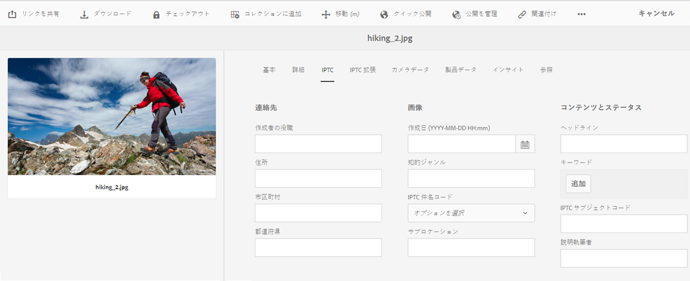

# IPTCメタデータの操作 {#support-for-iptc-metadata}

Learn how [!DNL Adobe Experience Manager Assets] supports the IPTC metadata, Creative ratings, and keywords added to assets through [!DNL Adobe Bridge] and other [!DNL Adobe Creative Cloud] apps.

[!DNL Adobe Experience Manager Assets] は、アセットの記述に広く使用されるIPTCメタデータ標準をサポートしています。 This way, [!DNL Assets] enhances the acceptance of its images among various parties, including photographers, creative agencies, libraries, museums, and so on.

包括的なメタデータプロパティを定義するための IPTC コアおよび IPTC 拡張のメタデータスキーマが、アセット用のデフォルトのメタデータスキーマに組み込まれました。これにより、画像に示されている人、場所、製品に関して、正確で信頼性の高いデータを追加できます。また、画像作成に関する日付、名前および識別子に加え、著作権情報を表示する柔軟な方法もサポートされています。

アセットのプロパティページに新たなタブが組み込まれていて、編集可能なフィールドに IPTC コアと IPTC 拡張のメタデータが個別に表示されます。

1. From the [!DNL Assets] user interface, select an image.
1. ツールバーの「**[!UICONTROL プロパティ]**」をクリックします。
1. 「 **[!UICONTROL IPTC]** 」タブをクリックして、アセットのIPTC表示を選択します。
1. 必要に応じて、IPTCメタデータのプロパティを編集します。

   

1. Click the **[!UICONTROL IPTC Extension]** tab to view IPTC Extension metadata for the asset.
1. 必要に応じて、IPTC Extensionメタデータのプロパティを編集します。
1. Click **[!UICONTROL Save &amp; Close]** to save the changes.

## Creative rating support {#creative-rating-support}

プロパティページには、個々のユーザーの評価と総評価が表示されるほか、Adobe Bridge およびその他のクリエイティブアプリを通じてアセットに割り当てられた評価も表示されるようになりました。

これらの評価は、「**[!UICONTROL 詳細]**」タブ内の「**[!UICONTROL クリエイティブの評価]**」セクションの下に表示されます。

この評価は読み取り専用プロパティであり、評価値は 1～5 です。検索パネルで、クリエイティブの評価に基づいてアセットを検索できます。

ただし、ユーザーがおこなったカスタムの変更との競合を避けるため、このプロパティには現在のところインデックスは付けられません。

## Keyword support {#keyword-support}

The **[!UICONTROL IPTC]** tab of the [!UICONTROL Properties] page also displays keywords added to assets through Adobe Bridge and other Adobe Creative Cloud apps. これらのキーワードの編集や、キーワードの追加も「**[!UICONTROL IPTC]**」タブでおこなえます。

