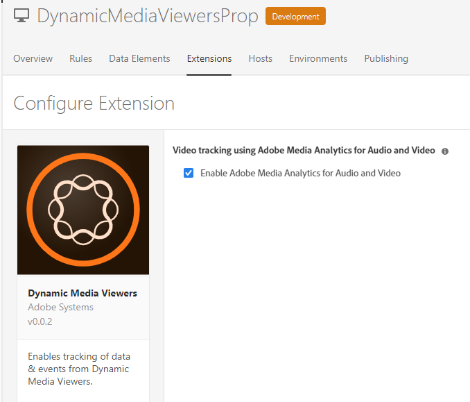
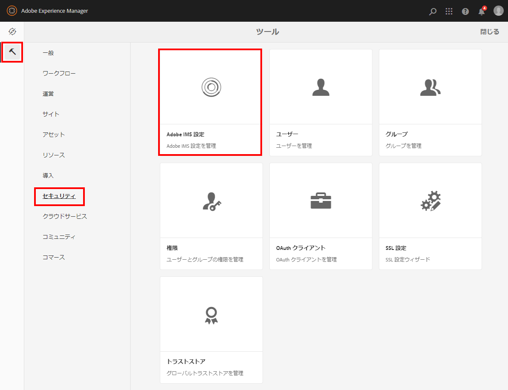
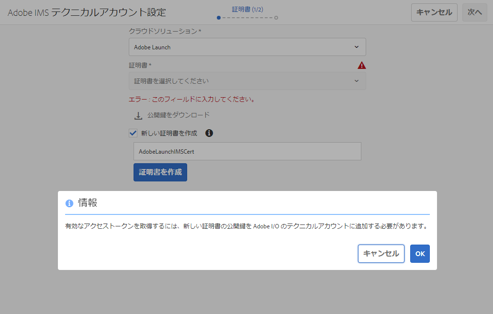
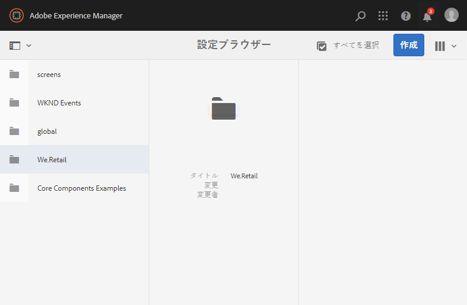

# Dynamic Media Viewers と Adobe Analytics および Adobe Launch の統合 {#integrating-dynamic-media-viewers-with-adobe-analytics-and-adobe-launch}

## Adobe AnalyticsおよびAdobe launchとのDynamic Media Viewerの統合について教えてください。 {#what-is-dynamic-media-viewers-integration-with-adobe-analytics-and-adobe-launch}

The new *Dynamic Media Viewers* extension for Adobe Launch, along with the recent release of Dynamic Media Viewers 5.13, lets customers of Dynamic Media, Adobe Analytics, and Adobe Launch to use events and data specific for the Dynamic Media Viewers in their Adobe Launch configuration.

この統合により、Adobe Analyticsを使用して、Webサイト上でのダイナミックメディアビューアの使用状況を追跡できます。 同時に、Adobeまたはサードパーティ製の他のLaunch拡張機能を持つViewerによって公開されたイベントやデータを使用できます。

拡張機能につ [いて詳しくは、『Experience Platform Launch User](https://docs.adobe.com/content/help/en/launch/using/extensions-ref/overview.html) Guide』のAdobe Extensionを参照してください。

**** このドキュメントの対象読者：サイト管理者、AEMプラットフォームの開発者、および操作の開発者。

### 統合の制限 {#limitations-of-the-integration}

* ダイナミックメディアビューア用のAdobe Launch統合は、AEMオーサーノードでは機能しません。 WCMページからトラッキングが公開されるまで、トラッキングを表示することはできません。
* Dynamic Media viewerのAdobe Launch統合は、「ポップアップ」操作モードではサポートされません。このモードでは、ビューアのURLは、アセットの詳細ページの「URL」ボタンを使用して取得されます。
* Adobe launch統合は、（パラメーターを介して）従来のビューアのAnalytics統合と同時に使用することはで `config2=` きません。
* ビデオトラッキングのサポートは、トラッキングの概要で説明されているように、コア再生トラッキ [ングのみに制限されま](https://docs.adobe.com/content/help/en/media-analytics/using/sdk-implement/track-av-playback/track-core-overview.html)す。 特に、QoS、広告、チャプター/セグメント、エラーの追跡はサポートされていません。
* データ要素の記憶時間設定は、 *Dynamic Media Viewers拡張を使用したデータ要素ではサポートさ* れません。 「Storage Duration」は「 **[!UICONTROL None」に設定する必要があります]**。

### 統合の使用例 {#use-cases-for-the-integration}

Adobe launchとの統合の主な使用例は、AEM AssetsとAEM Sitesの両方を使用するお客様です。 このような場合は、AEMオーサーノードとAdobe Launchの標準統合を設定し、サイトインスタンスをAdobe launchプロパティに関連付けることができます。 その後、サイトページに追加されたダイナミックメディアWCMコンポーネントは、ビューアのデータとイベントを追跡します。

AEMサイト [でのダイナミックメディアビューアの追跡についてを参照してください](https://wiki.corp.adobe.com/display/~oufimtse/Dynamic+Media+Viewers+integration+with+Adobe+Launch#DynamicMediaViewersintegrationwithAdobeLaunch-TrackingDynamicMediaViewersinAEMSites)。

統合でサポートされる2番目の使用例は、AEM Assetsのみ、またはDynamic Media Classicを使用するお客様です。 このような場合は、ビューアの埋め込みコードを取得し、Webサイトページに追加します。 次に、Adobe LaunchからAdobe Launchライブラリ実稼働用URLを取得し、Webページコードに手動で追加します。

埋め込みコ [ードを使用したダイナミックメディアビューアの追跡についてを参照してくださ](https://wiki.corp.adobe.com/display/~oufimtse/Dynamic+Media+Viewers+integration+with+Adobe+Launch#DynamicMediaViewersintegrationwithAdobeLaunch-TrackingDynamicMediaViewersusingEmbedcode)い。

## 統合でのデータおよびイベントの追跡の仕組み {#how-data-and-event-tracking-works-in-the-integration}

この統合では、次の2種類の独立したタイプのダイナミックメディアビューアトラッキングを利用します。 *Adobe Analytics* と *Adobe Analytics for Audio and Video*。

### Adobe Analyticsを使用した追跡について {#about-tracking-using-adobe-analytics}

Adobe Analyticsを使用すると、エンドユーザーがWebサイト上で動的メディアビューアとやり取りしたときに実行したアクションを追跡できます。 また、Adobe Analyticsでは、ビューア固有のデータを追跡できます。 例えば、ビュー読み込みイベントを、アセット名、発生したズーム操作、ビデオ再生操作などと共に追跡して記録できます。

Adobe Launchでは、データ要素とルールの概念が連携し *て* 、Adobe Analyticsの追跡を *有効にします* 。

#### Adobe Launchのデータ要素について {#about-data-elements-in-adobe-launch}

Adobe launchのデータ要素は、名前の付いたプロパティです。このプロパティの値は、静的に定義されるか、Webページの状態や動的メディアビューアのデータに基づいて動的に計算されます。

データ要素の定義で使用できるオプションは、Adobe Launchプロパティにインストールされる拡張機能のリストによって異なります。 「Core」拡張機能がプレインストールされ、任意の設定で初期状態で使用できます。 この「コア」拡張機能を使用すると、cookie、JavaScriptコード、クエリ文字列、その他多くのソースから取得した値を持つデータ要素を定義できます。

Adobe Analyticsで追跡を行う場合は、拡張機能のインストールと設定で説明されているように、追加の拡張機能 [をインストールする必要があります](#installing-and-setup-of-extensions)。 Dynamic Media Viewers拡張機能には、Dynamic viewerイベントの引数である値のデータ要素を定義する機能が追加されています。 例えば、ビューアのタイプや、読み込み時にビューアから報告されたアセット名を参照することができ、エンドユーザがズームしたときに報告されるズームレベルなどを参照できます。

Dynamic Media Viewer拡張機能は、データ要素の値を自動的に最新の状態に保ちます。

定義したデータ要素は、データ要素ピッカーウィジェットを使用して、Adobe Launch UIの他の場所で使用できます。 特に、ダイナミックメディアビューアの追跡を目的として定義されたデータ要素は、ルール内のAdobe Analytics拡張の変数設定アクションで参照されます（以下を参照）。

詳しく [は、『Experience Platform Launch](https://docs.adobe.com/content/help/en/launch/using/reference/manage-resources/data-elements.html) User Guide』の「Data elements」を参照してください。

#### Adobe Launchのルールについて {#about-rules-in-adobe-launch}

Adobe Launchのルールは、ルールを構成する3つの領域を定義する非知的な設定です。 *Events*、 *Conditions*、 *Actions*:

* *イベント* (if)は、ルールをトリガーするタイミングをAdobe launchに知らせます。
* *条件は* （条件が満たされた場合）、ルールのトリガー時に許可または禁止する追加の制限事項をAdobe Launchに知らせます。
* *アクション* （次に）は、ルールがトリガーされた場合にAdobe Launchに対して何を行うかを指示します。

「イベント」、「条件」および「アクション」セクションで使用できるオプションは、Adobe Launchプロパティにインストールされている拡張機能によって異なります。 *Core* Extensionはプレインストールされており、あらゆる設定ですぐに使用できます。 この拡張機能には、フォーカスの変更、キーの押下、フォームの送信など、基本的なブラウザーレベルのアクションなど、イベントに関するいくつかのオプションが用意されています。 また、cookieの値、ブラウザーのタイプなど、条件のオプションも含まれます。 「アクション」では、「カスタムコード」オプションのみを使用できます。

Adobe Analyticsの追跡の場合は、「拡張機能のインストールと設定」の説明に従って、追加の拡張機能をい [くつかインストールする必要があります](#installing-and-setup-of-extensions)。 具体的には：

* Dynamic Media Viewers Extensionは、サポートされるイベントのリストを、ビューアの読み込み、アセットの入れ替え、ズームイン、ビデオ再生など、Dynamic mediaビューアに固有のイベントに拡張します。
* Adobe Analyticsの拡張機能では、サポートされるアクションのリストが拡張され、データをトラッキングサーバーに送信するために必要な2つのアクションが用意されています。変数 *と送信ビ* ーコン **。

ダイナミックメディアビューアを追跡するには、次のいずれかのタイプを使用できます。

* Dynamic Media Viewer拡張機能、Core拡張機能またはその他の拡張機能からのイベント。
* ルール定義の条件。 または、条件領域を空のままにします。

「アクション」セクションでは、「変数の設定」アクションが必要 *です* 。 このアクションは、Adobe Analyticsにデータを使用してトラッキング変数を設定する方法を指示します。 同時に、「変数を設定」アク *ションは* 、トラッキングサーバーに何も送信しません。

「 *Set Variables* 」アクションの後に「 *Send Beacon* 」アクションが続く必要があります。 「 *Send Beacon* 」アクションは、実際にはAnalyticsトラッキングサーバーにデータを送信します。 「変数の設定」と「ビ *ーコンの送信* 」の両方のアク *ションは*、Adobe Analytics拡張機能から取得されます。

詳しく [は、『Experience](https://docs.adobe.com/content/help/en/launch/using/reference/manage-resources/rules.html) Platform Launch User Guide』の「Rules」を参照してください。

#### 設定例 {#sample-configuration}

Adobe Launch内の以下のサンプル設定では、ビューアの読み込み時にアセット名を追跡する方法を示します。

1. 「データ要 **[!UICONTROL 素]** 」タブで、Dynamic Media Viewers拡張機能からイベン `AssetName` トのパラメ `asset` ータ `LOAD` ーを参照するデータ要素を定義します。

   

1. 「ルール」 **[!UICONTROL タブで]** 、ルールTrackAssetOnLoadを定義 *します*。

   このルールでは、「イベン **[!UICONTROL ト]** 」フィールドで **[!UICONTROL は、Dynamic Media Viewers拡張機能のLOAD]** イベントを使用します。

   

1. アクション設定には、Adobe Analytics拡張から2つのアクションタイプがあります。

   *変数を設定し*、選択した分析変数をデータ要素の値にマップ `AssetName` します。

   *ビーコンの送信*（Adobe Analyticsにトラッキング情報を送信）。

   

1. 結果のルール設定は次のようになります。

   

### Adobe Analytics for audioとVideoについて {#about-adobe-analytics-for-audio-and-video}

Experience cloudアカウントがオーディオおよびビデオ用のAdobe Analyticsを使用するよう登録されている場合は、 *Dynamic Media Viewers* Extensionの設定でビデオの追跡を有効にするだけで十分です。 ビデオ指標はAdobe Analyticsで使用できるようになります。 ビデオトラッキングは、Adobe Media Analytics for audioおよびVideo拡張の有無に依存します。

詳しくは、 [拡張機能のインストールとセットアップを参照してくださ](#installing-and-setup-of-extensions)い。

現在、ビデオトラッキングのサポートは、トラッキングの概要で説明されている「コア再生」トラッキングの [みに制限されます](https://docs.adobe.com/content/help/en/media-analytics/using/sdk-implement/track-av-playback/track-core-overview.html)。 特に、QoS、広告、チャプター/セグメント、エラーの追跡はサポートされていません。

## Dynamic Media Viewers拡張機能の使用 {#using-the-dynamic-media-viewers-extension}

「統合の使用例 [」で説明したように](#use%20cases%20for%20the%20integration)、AEM Sitesの新しいAdobe Launch統合を使用し、埋め込みコードを使用して、Dynamic Media viewerを追跡できます。

### AEMサイトでのダイナミックメディアビューアの追跡 {#tracking-dynamic-media-viewers-in-aem-sites}

AEMサイトでダイナミックメディアビューアを追跡するには、「すべての統合ピースの設定 [」の下に表示されるすべての手順を](#configuring-all-the-integration-pieces) 、実行する必要があります。 具体的には、IMS設定とAdobe Launch cloud設定を作成する必要があります。

適切な設定に従って、ダイナミックメディアでサポートされるWCMコンポーネントを使用してサイトページに追加したダイナミックメディアビューアは、Adobe Analytics、Adobe Analytics for Video、またはその両方に対するデータを自動的に追跡します。

詳しくは、 [アドビのサイトを使用したページへのダイナミックメディアアセットの追加を参照してください](https://helpx.adobe.com/experience-manager/6-5/help/assets/adding-dynamic-media-assets-to-pages.html)。

### 埋め込みコードを使用したダイナミックメディアビューアの追跡 {#tracking-dynamic-media-viewers-using-embed-code}

AEMサイトを使用しない、またはAEMサイト以外のWebページにダイナミックメディアビューアを埋め込まない、またはその両方を使用しないお客様は、引き続きAdobe launch統合を使用できます。

「Adobe Analyticsの設定」および「Adobe launchの設定 [」の設定手順を実](#configuringadobeanalytics) 行する必要があります  。 ただし、AEM関連の設定手順は不要です。

適切な設定が行われたら、ダイナミックメディアビューアを使用してWebページにAdobe Launchサポートを追加できます。

Adobe Launchラ [イブラリ埋め込みコードの使用方法について詳しくは](https://docs.adobe.com/content/help/en/launch/using/implement/configure/implement-the-launch-install-code.html) 、「埋め込みコードの起動」の追加を参照してください。

AEMダイナ [ミックメディアの埋め込みコード機能の使用方法について詳しくは、Webページへのビデオビューアまたは画像ビューアの埋め込み](https://helpx.adobe.com/experience-manager/6-5/help/assets/embed-code.html) （英語のみ）を参照してください。

**埋め込みコードを使用してDynamic mediaビューアを追跡するには**:

1. ダイナミックメディアビューアを埋め込むためのWebページを準備します。
1. 最初にAdobe launchにログインして、Adobe launchライブラリの埋め込みコードを取得します(Adobe launchの設定 [を参照](#configuringadobelaunch))。
1. 「 **[!UICONTROL Property]**」をクリックし、「 **[!UICONTROL Environments]** 」タブをクリックします。
1. Webページの環境に関連する環境レベルを取得します。 次に、「 **[!UICONTROL Install]** 」列で、ボックスアイコンをクリックします。
1. **[!UICONTROL Web Install Instructionsダイアログボックスで]** 、Adobe Launchライブラリの埋め込みコード全体と、それを囲むタグをコピー `<script/>` します。

## Dynamic Media Viewers拡張機能リファレンスガイド {#reference-guide-for-the-dynamic-media-viewers-extension}

### ダイナミックメディアビューア設定について {#about-the-dynamic-media-viewers-configuration}

次の条件のすべてに当てはまる場合、Dynamic Media Viewer ExtensionはAdobe Launchライブラリと自動的に統合されます。

* Adobe Launchライブラリグローバルオブジ `_satellite`ェクト()がページに存在します。
* Dynamic Media Viewers拡張機能は、で `_dmviewers_v001()` 定義されます `_satellite`。

* `config2=` viewerパラメーターが指定されていない場合、ビューアは従来のAnalytics統合を使用しません。

さらに、Viewerの設定でパラメーターを指定して、ViewerでAdobe launchの統合を明示的に無効にす `launch=0` るオプションもあります。 The default value of this parameter is `1`.

### Dynamic Media Viewers拡張の設定 {#configuring-the-dynamic-media-viewers-extension}

Dynamic Media Viewers拡張の唯一の設定オプションは、「オーディオとビデオに対し **[!UICONTROL てAdobe Media Analyticsを有効にする」です]**。

このオプションをオン（オン）にし、Adobe Media Analytics for Audio and Video拡張機能がインストールされ、適切に設定されている場合、ビデオ再生指標はAdobe Analytics for Audio and videoソリューションに送信されます。 このオプションを無効にすると、ビデオトラッキングがオフになります。

Adobe Media Analytics for Audio and Video拡張機能をインスト *ールせずに* 、このオプションを有効にした場合、このオプションは無効になります。

### Dynamic Media Viewers拡張機能のデータ要素について {#about-data-elements-in-the-dynamic-media-viewers-extension}

Dynamic Media Viewers拡張機能で提供されるデータ要素のタイプは、「データ要素のタイプ」ドロ **[!UICONTROL ップダウンリスト]****[!UICONTROL の「ビューアイベント]** 」のみです。

選択すると、データ要素エディターは、次の2つのフィールドを含むフォームをレンダリングします。

* **[!UICONTROL DMビューアのイベントデータ型]** — 引数を持つDynamic Media Viewers拡張機能でサポートされるすべてのビューアイベントと、特別な **[!UICONTROL COMMON]** （共通）項目を識別するドロップダウンリスト。 「 **[!UICONTROL COMMON]** 」項目は、ビューアから送信されるすべてのタイプのイベントに共通するイベントパラメータのリストを表します。
* **[!UICONTROL トラッキングパラメータ]** — 選択したダイナミックメディアビューアイベントの引数。

各ビューアタ [イプでサポートされるイベントのリストについては](https://marketing.adobe.com/resources/help/en_US/s7/viewers_ref/c_html5_s7_aem_asset_viewers.html) 、『Dynamic Media Viewersリファレンスガイド』を参照してください。特定のビューアセクションに移動し、「Adobe Analyticsトラッキングのサポート」サブセクションをクリックします。 現在、『Dynamic Media Viewersリファレンスガイド』では、イベントの引数について説明していません。

次に、ダイナミックメディアビューアのデータ要素のライフサイクルを考 *えてみましょう*。 このようなデータ要素の値は、対応するダイナミックメディアビューアイベントがページで発生した後に設定されます。 例えば、データ要素が **[!UICONTROL LOAD]** イベントとその「asset」引数を指す場合、ビューアが初めてLOADイベントを実行した後で、このようなデータ要素の値が有効なデータを受け取ります。 データ要素が **[!UICONTROL ZOOM]** イベントとその「scale」引数を指す場合、そのようなデータ要素の値は、ビューアが初めて **[!UICONTROL ZOOM]** イベントを送信するまで空のままです。

同様に、ビューアがページ上の対応するイベントを送信すると、データ要素の値が自動的に更新されます。 値の更新は、特定のイベントがルール設定で指定されていない場合でも行われます。 例えば、ZOOMイベントの「scale **[!UICONTROL 」パラメータに対してデータ要素]** ZoomScaleを定義し、ルール設定に存在する唯一のルールが **[!UICONTROL LOAD]****** イベントによってトリガーされた場合、ユーザがビューア内でズームを実行するたびにZoomScaleの値が更新されます。

ダイナミックメディアビューアはWebページ上で一意の識別子を持ちます。 データ要素は、値自体と、値が入力されたビューアを追跡します。 つまり、同じページに複数のビューアがあり、 **[!UICONTROL LOAD]** イベントとその「asset」引数を指す **[!UICONTROL AssetName]** Data要素がある場合、 **[!UICONTROL AssetName]** Data Elementは、ページに読み込まれた各ビューアに関連付けられたアセット名のコレクションを保持します。

データ要素から返される正確な値は、コンテキストによって異なります。 ダイナミックメディアビューアイベントによってトリガーされたルール内でデータ要素が要求された場合、ルールを開始したビューアに対してデータ要素の値が返されます。 また、他のAdobe Launch拡張機能からイベントによってトリガーされたルール内でデータ要素が要求された場合、データ要素の値は、このデータ要素を更新する最後の値であったViewerからの値になります。

**次のサンプルの設定を考えてみましょう**。

* 2つのダイナミックメディアズームビューアを持つWebページこれらは、viewer1および *viewer* 2と呼 *ばれます*。

* **[!UICONTROL ZoomScale]** Data Elementは、 **[!UICONTROL ZOOMイベントとその「scale]** 」引数を指します。
* **[!UICONTROL TrackPan]** Ruleに次の情報が含まれます。

   * ダイナミックメディアビューアの **[!UICONTROL PAN]** イベントをトリガーとして使用します。
   * ZoomScaleデータ要素の **[!UICONTROL 値を]** Adobe Analyticsに送信します。

* 
   * **[!UICONTROL TrackKey]** Ruleに次の情報が含まれます。

   * Core Adobe Launch拡張のキー押下イベントをトリガーとして使用します。
   * ZoomScaleデータ要素の **[!UICONTROL 値を]** Adobe Analyticsに送信します。

ここで、エンドユーザーが2つのビューアでWebページを読み込んだとします。 ビュ *ーア* 1では、50%の拡大率でズームインします。次に、 *viewer2では*、25%の拡大率でズームインします。 *viewer1では*、画像がパンされ、最後にキーボードのキーが押されます。

エンドユーザーのアクティビティによって、Adobe Analyticsに対して次の2つのトラッキングコールが実行されます。

* 最初の呼び出しは、 **[!UICONTROL TrackPan]** ruleが、ユーザが *viewer1でパンしたときにトリガーされるために発生します*。 この呼び出しでは、ルールが **[!UICONTROL viewer1によってトリガーされたことをデータ要素が認識し、対応するスケール値が取得されるので、]** ZoomScale ** Data Elementの値として50%が送信されます。
* 2回目の呼び出しは、ユーザ **[!UICONTROL ーがキーボードのキーを押したときにTrackKey]** ruleがトリガーされるために発生します。 ルールがビューアによってトリガされなかったので、この呼び出 **[!UICONTROL しでは]** 25%がZoomScale Data Elementの値として送信されます。 したがって、データ要素は最新の値を返します。

上記のサンプルは、データ要素の値の寿命にも影響します。 Dynamic Media viewerで管理されるデータ要素の値は、WebページにViewer自体が配置された後でも、Adobe Launchライブラリコードに保存されます。 つまり、非ダイナミックメディアビューアの拡張によってトリガーされるルールがあり、そのようなデータ要素を参照する場合、ビューアがWebページに存在しなくなっても、データ要素は最後に認識された値を返します。

いずれの場合も、ダイナミックメディアビューアによって駆動されるデータ要素の値は、ローカルストレージやサーバに保存されません。代わりに、クライアント側のAdobe Launchライブラリにのみ保存されます。 Webページがリロードされると、このようなデータ要素の値は消えます。

一般に、データ要素エディターでは、ストレージ期間の選 [択がサポートされま](https://docs.adobe.com/content/help/en/launch/using/reference/manage-resources/data-elements.html#create-a-data-element)す。 ただし、Dynamic Media Viewers拡張機能を使用するデータ要素は、「なし」の保存時間オプションのみをサポート **[!UICONTROL します]**。 その他の値の設定はユーザーインターフェイスで可能ですが、この場合、データ要素の動作は定義されていません。 拡張機能は、データ要素の値を独自に管理します。ビューアのライフサイクル全体でビューアのイベント引数の値を維持するデータ要素。

### Dynamic Media Viewers拡張のルールについて {#about-rules-in-the-dynamic-media-viewers-extension}

ルールエディターで、イベントエディターの新しい設定オプションが追加されます。 また、には、事前に設定されたデータ要素を使用する代わりに、アクションエディターでイベントパラメーターを短い手動で参照するオプションも用意されています。

#### イベントエディターについて {#about-the-events-editor}

イベントエディターで、Dynamic Media Viewers拡張機能によって、ビューアイベントと呼ばれる新し **[!UICONTROL いイベントタ]** イプが **[!UICONTROL 追加されます]**。

選択すると、イベントエディターによってドロップダウン **[!UICONTROL Dynamic Media viewerイベントがレンダリングされ]**、Dynamic mediaビューアでサポートされている使用可能なイベントがすべて表示されます。

#### アクションエディターについて {#about-the-actions-editor}

Dynamic Media Viewers拡張機能を使用すると、Dynamic mediaビューアのイベントパラメーターを使用して、Adobe Analytics拡張機能の変数を設定エディターでAnalytics変数にマッピングできます。

最も簡単な方法は、次の2つの手順を実行することです。

* まず、1つ以上のデータ要素を定義します。各データ要素は、ダイナミックメディアビューアイベントのパラメーターを表します。
* 最後に、Adobe Analytics拡張機能の変数を設定エディターで、データ要素ピッカーアイコン（3つのスタックされたディスク）をクリックし、データ要素を選択ダイアログボックスを開き、データ要素を選択します。

ただし、別の方法を使用して、データ要素の作成をバイパスすることは可能です。 Analytics変数割り当ての値入力フィールドにイベント引数の完全修飾名を入力し、パーセント記号(%)で囲んで、ダイナミックメディアビューアイベントから引数を直接参照できます。 **** 例：

`%event.detail.dm.LOAD.asset%`

データ要素を使用する場合と、直接イベント引数の参照を使用する場合の間には、重要な違いがあることに注意してください。 データ要素の場合、どのイベントが変数の設定アクションをトリガーしても、ルールをトリガーするイベントは、動的ビューアとは無関係にすることができます（例えば、Core拡張からWebページをマウスクリックする場合）。 ただし、直接引数参照を使用する場合は、ルールをトリガーするイベントが参照するイベント引数に対応していることを確認することが重要です。

例えば、ルールがDynamic Media Viewer `%event.detail.dm.LOAD.asset%` 拡張機能の **[!UICONTROL LOAD]** イベントによってトリガーされた場合、参照は正しいアセット名を返します。 ただし、他のイベントの場合は空の値を返します。

次の表に、ダイナミックメディアビューアのイベントと、サポートされている引数を示します。

<table>
 <tbody>
  <tr>
   <td>ビューアのイベント名</td>
   <td>引数の参照</td>
  </tr>
  <tr>
   <td><code>COMMON</code></td>
   <td><code>%event.detail.dm.objID%</code></td>
  </tr>
  <tr>
   <td> </td>
   <td><code>%event.detail.dm.compClass%</code></td>
  </tr>
  <tr>
   <td> </td>
   <td><code>%event.detail.dm.instName%</code></td>
  </tr>
  <tr>
   <td> </td>
   <td><code>%event.detail.dm.timeStamp%</code></td>
  </tr>
  <tr>
   <td><code>BANNER</code> </td>
   <td><code>%event.detail.dm.BANNER.asset%</code></td>
  </tr>
  <tr>
   <td> </td>
   <td><code>%event.detail.dm.BANNER.frame%</code></td>
  </tr>
  <tr>
   <td> </td>
   <td><code>%event.detail.dm.BANNER.label%</code></td>
  </tr>
  <tr>
   <td><code>HREF</code></td>
   <td><code>%event.detail.dm.HREF.rollover%</code></td>
  </tr>
  <tr>
   <td><code>ITEM</code></td>
   <td><code>%event.detail.dm.ITEM.rollover%</code></td>
  </tr>
  <tr>
   <td><code>LOAD</code></td>
   <td><code>%event.detail.dm.LOAD.applicationname%</code></td>
  </tr>
  <tr>
   <td><strong> </strong></td>
   <td><code>%event.detail.dm.LOAD.asset%</code></td>
  </tr>
  <tr>
   <td><strong> </strong></td>
   <td><code>%event.detail.dm.LOAD.company%</code></td>
  </tr>
  <tr>
   <td><strong> </strong></td>
   <td><code>%event.detail.dm.LOAD.sdkversion%</code></td>
  </tr>
  <tr>
   <td><strong> </strong></td>
   <td><code>%event.detail.dm.LOAD.viewertype%</code></td>
  </tr>
  <tr>
   <td><strong> </strong></td>
   <td><code>%event.detail.dm.LOAD.viewerversion%</code></td>
  </tr>
  <tr>
   <td><code>METADATA</code></td>
   <td><code>%event.detail.dm.METADATA.length%</code></td>
  </tr>
  <tr>
   <td> </td>
   <td><code>%event.detail.dm.METADATA.type%</code></td>
  </tr>
  <tr>
   <td><code>MILESTONE</code></td>
   <td><code>%event.detail.dm.MILESTONE.milestone%</code></td>
  </tr>
  <tr>
   <td><code>PAGE</code></td>
   <td><code>%event.detail.dm.PAGE.frame%</code></td>
  </tr>
  <tr>
   <td> </td>
   <td><code>%event.detail.dm.PAGE.label%</code></td>
  </tr>
  <tr>
   <td><code>PAUSE</code></td>
   <td><code>%event.detail.dm.PAUSE.timestamp%</code></td>
  </tr>
  <tr>
   <td><code>PLAY</code></td>
   <td><code>%event.detail.dm.PLAY.timestamp%</code></td>
  </tr>
  <tr>
   <td><code>SPIN</code></td>
   <td><code>%event.detail.dm.SPIN.framenumber%</code></td>
  </tr>
  <tr>
   <td><code>STOP</code></td>
   <td><code>%event.detail.dm.STOP.timestamp%</code></td>
  </tr>
  <tr>
   <td><code>SWAP</code></td>
   <td><code>%event.detail.dm.SWAP.asset%</code></td>
  </tr>
  <tr>
   <td><code>SWATCH</code></td>
   <td><code>%event.detail.dm.SWATCH.frame%</code></td>
  </tr>
  <tr>
   <td> </td>
   <td><code>%event.detail.dm.SWATCH.label%</code></td>
  </tr>
  <tr>
   <td><code>TARG</code></td>
   <td><code>%event.detail.dm.TARG.frame%</code></td>
  </tr>
  <tr>
   <td> </td>
   <td><code>%event.detail.dm.TARG.label%</code></td>
  </tr>
  <tr>
   <td><code>ZOOM</code></td>
   <td><code>%event.detail.dm.ZOOM.scale%</code></td>
  </tr>
 </tbody>
</table>

## すべての統合ピースの設定 {#configuring-all-the-integration-pieces}

**始める前に**

まだ行っていない場合は、この節の前にすべてのドキュメントを十分に確認し、統合の完全性を理解することをお勧めします。

ここでは、ダイナミックメディアビューアをAdobe AnalyticsおよびAdobe Analytics for Audio and videoと統合するために必要な設定手順について説明します。 Dynamic Media Viewers拡張機能をAdobe Launchの他の目的で使用することは可能ですが、このドキュメントでは扱わないシナリオが考えられます。

次のアドビ製品で統合を設定します。

* Adobe Analytics — トラッキング変数とレポートを設定します。
* Adobe Launch — ビューアの追跡を有効にするプロパティ、1つ以上のルールおよび1つ以上のデータ要素を定義します。

さらに、この統合ソリューションをAEMサイトで使用する場合は、次の設定も行う必要があります。

* Adobe I/O Console - Adobe Launch用に統合が作成されます。
* AEMオーサーノード — IMS設定とAdobe Launchクラウド設定

設定の一環として、Adobe AnalyticsとAdobe Launchが既に有効になっているAdobe Experience cloudの会社にアクセスできることを確認してください。

## 統合のためのAdobe Analyticsの設定 {#configuring-adobe-analytics-for-the-integration}

Adobe Analyticsを設定した後、統合に対して次の設定が行われます。

* レポートスイートが配置され、選択されています。
* Analytics変数は、トラッキングデータを受け取るために使用できます。
* Adobe Analytics内で収集されたデータを表示するレポートを使用できます。

『 [Analytics導入ガイド』も参照してください](https://docs.adobe.com/content/help/en/analytics/implementation/home.html)。

**統合用にAdobe Analyticsを設定するには**:

1. まず、Experience cloudホームページからAdobe Analyticsにアクセス [します](https://exc-home.experiencecloud.adobe.com/exc-home/home.html#/)。 メニューバーで、ページの右上隅近くにあるソリューションアイコン（3 x 3のドット表）をクリックし、「 **[!UICONTROL Analytics]**」をクリックします。

   

   次に、レポートスイートを選択します。

### レポートスイートの選択 {#selecting-a-report-suite}

1. Adobe Analyticsページの右上隅近くの「レポートの検索 **** 」フィールドの右側で、ドロップダウンリストから適切なレポートスイートを選択します。 複数のレポートスイートが使用可能で、どちらを使用するかが不明な場合は、Adobe Analytics管理者に問い合わせて、使用するレポートスイートの選択をお手伝いします。

   下の図では、ユーザがDynamicMediaViewersExtensionDocという名前のレポートスイー *トを作成し* 、ドロップダウンリストから選択しています。 レポートスイート名は説明用です。最終的に選択するレポートスイートの名前は異なります。

   使用できるレポートスイートがない場合は、ユーザーまたはAdobe Analytics管理者がレポートスイートを作成してから、設定を続行する必要があります。

   「レポー [トとレポートスイート](https://docs.adobe.com/content/help/en/analytics/implementation/analytics-basics/ref-reports-report-suites.html) 」および「レ [ポートスイートの作成」を参照してくださ](https://docs.adobe.com/content/help/en/analytics/admin/admin-console/create-report-suite.html)い。

   Adobe Analyticsでは、管理者/レポートスイートでレ **[!UICONTROL ポートスイートを管理します]**。

   

   Adobe Analytics変数を設定します。

### Adobe Analytics変数の設定 {#setting-up-adobe-analytics-variables}

1. Webページ上での動的メディアビューアの動作を追跡するために使用する1つ以上のAdobe Analytics変数を指定します。

   Adobe Analyticsでサポートされている任意のタイプの変数を使用できます。 変数タイプ(カスタムトラフィック [prop]、コンバージョンeVar [])に関する決定は、Analytics実装の特定のニーズによって行う必要があります。

   「propと [eVarの概要」を参照してください](https://docs.adobe.com/content/help/en/analytics/implementation/analytics-basics/traffic-props-evars/props-evars.html)。

   このドキュメントの目的では、カスタムトラフィック(prop)変数のみが使用されます。これは、Webページでアクションが発生してから数分以内にAnalyticsレポートで使用できるようになるためです。

   新しいカスタムトラフィック変数を有効にするには、Adobe Analyticsのツールバーで管理者/レポートス **[!UICONTROL イートをクリックします]**。

1. Report Suite Managerページ **[!UICONTROL で正しいレポートを選択し]** 、ツールバーで設定を編集/トラフィック/トラフィック変 **[!UICONTROL 数をクリックします]**。
1. ここで、未使用の変数を取得し、わかりやすい名前( **[!UICONTROL Viewerアセット(prop 30)]**)を付け、「有効」列のコンボボックスを「有効」に変更します。

   次のスクリーンショットは、ビューアが使用するアセット名を追跡するためのカスタムトラフィック変数( **[!UICONTROL prop30]**)の例です。

   

1. 変数リストの下部で、「保存」をクリックし **[!UICONTROL ます]**。

### Setting up a report {#setting-up-a-report}

1. 一般に、Adobe Analyticsでのレポートの設定は、特定のプロジェクトのニーズに左右されます。 したがって、詳細なレポート設定は、この統合の範囲外です。

   ただし、Adobe Analytics変数の設定でカスタムトラフィック変数を設定すると、カスタムトラフィックレポートがAdobe Analyticsで自動的に使用可能にな **[ることを知っています](#setting-up-adobe-analytics-variables)**。

   例えば、ビューアアセット( **[!UICONTROL prop 30)変数のレポートは、カスタムトラフィック/カスタムトラフィック21-30/ビューアアセット(]** prop 30)の下のレポートメニューから使用できます ****。

   ビューアアセット(prop 30)の作成直後にこ **[!UICONTROL のレポートを表示すると]** 、データが表示されません。これは、統合のこの時点で予想されます。

   

## 統合のためのAdobe Launchの設定 {#configuring-adobe-launch-for-the-integration}

Adobe Launchを設定した後、統合に対して次の設定が行われます。

* すべての設定をまとめるための新しいプロパティの作成。
* 拡張機能のインストールとセットアップ。 プロパティにインストールされたすべての拡張のクライアント側コードは、1つのライブラリにまとめられます。 このライブラリは後でWebページで使用されます。
* データ要素とルールの設定を参照してください。 この設定は、Dynamic mediaビューアから取得するデータ、追跡ロジックをトリガーするタイミング、Adobe Analyticsでビューアのデータを送信する場所を定義します。
* ライブラリの公開。

**統合用にAdobe Launchを設定するには**:

1. まず、Experience cloudのホームページからAdobe Launchにアクセス [します](https://exc-home.experiencecloud.adobe.com/exc-home/home.html#/)。 メニューバーで、ページの右上隅近くにあるソリューションアイコン（3 x 3ドットの表）をクリックし、「起動」をクリックし **[!UICONTROL ます]**。

   Adobe launchを直接開 [くこともできます](https://launch.adobe.com/)。

   

### Adobe Launchでのプロパティの作成 {#creating-a-property-in-adobe-launch}

Adobe Launchのプロパティは、すべての設定をまとめた名前付き設定です。 構成設定のライブラリが様々な環境レベル（開発、ステージングおよび実稼働）で生成および公開されます。

「プロパティの作 [成」も参照してください](https://docs.adobe.com/content/help/en/launch/using/implement/configure/create-a-property.html)。

1. Adobe Launchで、「新しいプロパティ」を **[!UICONTROL クリックします]**。
1. プロパテ **[!UICONTROL ィを作成ダイアログ]** ・ボックスの「 **[!UICONTROL 名前]** 」フィールドに、Webサイトのタイトルなど、説明的な名前を入力します。 例：`DynamicMediaViewersProp.`
1. 「ドメイ **[!UICONTROL ン]** 」フィールドに、Webサイトのドメインを入力します。
1. 「詳細オ **[!UICONTROL プション]** 」ドロップダウンで、使用する拡張(この場合はダイナミックメディアビューア ******)がまだリリースされていない場合に備えて、「拡張機能の開発用に設定（後で変更できません）」を有効にします。

   

1. 「**[!UICONTROL 保存]**」をクリックします。

   新しく作成されたプロパティをクリックし、「拡張機能のイ *ンストールとセットアップ」に進みま*&#x200B;す。

### 拡張機能のインストールとセットアップ {#installing-and-setup-of-extensions}

Adobe launchで使用可能なすべての拡張機能は、エクステンション/カタ **[!UICONTROL ログに一覧表示されます]**。

拡張機能をインストールするには、「インストール」をク **[!UICONTROL リックしま]**&#x200B;す。 必要に応じて、1回限りの拡張機能の設定を実行し、「保存」をクリッ **[!UICONTROL クします]**。

必要に応じて、次の拡張機能をインストールし、設定する必要があります。

* （必須） *Experience Cloud IDサービス*拡張機能

追加の設定は必要ありません。提案された値に対しては受け入れます。 完了したら、必ず「保存」をクリックし **[!UICONTROL ます]**。

詳しくは、 [Experience Cloud IDサービス拡張を参照してください](https://docs.adobe.com/content/help/en/launch/using/extensions-ref/adobe-extension/id-service-extension/overview.html)。

* （必須） *Adobe Analytics* Extension

この拡張機能を設定するには、まずAdobe Analyticsの管理者/レポートスイートの「レポートスイートID **[!UICONTROL 」列見出しにある「レ]**&#x200B;ポートスイートID **** 」が必要です。

(デモ目的でのみ、以下のスクリーンショットでは、DynamicMediaViewersExtensionDoc **** レポートスイートのレポートスイートIDが使用されます。 このIDは、以前の「レポートスイートの選択」で [作成および使用されています](#selecting-a-report-suite) 。)

拡張機能のインストールページで、「 **[!UICONTROL Development Report Suites]** 」フィールド、「 **[!UICONTROL Staging Report Suites]** 」フィールド、「 **[!UICONTROL Production Report Suites]** 」フィールドにレポートスイートIDを入力します。

*ビデオトラッキングを使用する予定の場合にのみ、次の項目を設定します。*

Install Extensionページ **[!UICONTROL で]** 、「 **[!UICONTROL General]**」を展開し、「Tracking Server」を指定します。 トラッキングサーバーはテンプレートに従い `<trackingNamespace>.sc.omtrdc.net`ます。ここ `<trackingNamespace>` で、はプロビジョニング電子メールで取得した情報です。

「**[!UICONTROL 保存]**」をクリックします。

詳しくは、 [Adobe Analytics Extensionを参照してください](https://docs.adobe.com/content/help/en/launch/using/extensions-ref/adobe-extension/analytics-extension/overview.html)。

* (オプション、ビデオトラッキングが必要な場合にのみ必要) *Adobe Media Analytics for Audio and Video* extension

トラッキングサーバーフィールドに入力します。 Adobe Media Analytics for Audio and Video ** Extensionのトラッキングサーバーは、Adobe Analyticsで使用されるトラッキングサーバーとは異なります。 これはテンプレートに従いま `<trackingNamespace>.hb.omtrdc.net`す。ここで `<trackingNamespace>` は、プロビジョニング電子メールの情報です。

その他のフィールドはすべてオプションです。

詳しくは、 [Adobe Media Analytics for Audio and Video Extensionを参照してください](https://docs.adobe.com/content/help/en/launch/using/extensions-ref/adobe-extension/media-analytics-extension/overview.html)。

* （必須） *Dynamic Media Viewers* Extension

「ビデ **[!UICONTROL オ分析を有効にする]** 」を選択して、ビデオハートビートトラッキングを有効にします。

このドキュメントの作成時点では、 *Dynamic Media Viewers* Extensionは、開発用にAdobe Launchプロパティが作成されている場合にのみ使用できます。

詳しくは、 [「Adobe Launchでのプロパティの作成」を参照してください](#creating-a-property-in-adobe-launch)。

拡張機能のインストールと設定が完了すると、少なくとも次の5つの拡張機能（ビデオを追跡していない場合は4つ）が拡張機能/インストール領域に表示されます。

### データ要素とルールの設定 {#setting-up-data-elements-and-rules}

Adobe Launchで、ダイナミックメディアビューアの追跡に必要なデータ要素とルールを作成します。

Adobe Launchを使 [用した追跡の概要については、「統合でのデータとイベントの追跡のしくみ](#how-data-and-event-tracking-works-in-the-integration) 」を参照してください。

ビュー  アの読み込み時にアセット名を追跡する方法を示すAdobe Launchの設定例については、設定例を参照してください。

拡張機能 [の機能について詳しくは、](#configuring-the-dynamic-media-viewers-extension) 「Dynamic Media Viewers拡張機能の設定」を参照してください。

### ライブラリの公開 {#publishing-a-library}

Adobe Launchの設定（プロパティ、拡張機能、ルール、データ要素の設定を含む）を変更するには、そのような変更を発行 *する* *必要があります。* Adobe launchでの公開は、プロパティ設定の「公開」タブから実行します。

Adobe Launchには、複数の開発環境、1つのステージング環境、1つの実稼働環境がある場合があります。 デフォルトでは、AEMのAdobe Launch Cloud Configurationは、AEM作成者ノードをAdobe launchのStage環境に、AEM発行ノードをAdobe launchの実稼働環境にポイントします。 この配置は、デフォルトのAEM設定で、Adobe LaunchライブラリをAEMオーサーで使用するためにステージング環境に公開し、AEMパブリッシュで使用できるように実稼働環境に公開する必要があることを意味します。

Adobe Launch環 [境について詳しくは](https://docs.adobe.com/content/help/en/launch/using/reference/publish/environments.html) 、「環境」を参照してください。

ライブラリの公開には、次の2つの手順を実行します。

* 必要な変更（新しい変更や更新）をすべてライブラリに含めて、新しいライブラリを追加して構築します。
* 様々な環境レベル（開発からステージングおよび実稼働へ）でのライブラリの移動

#### 新しいライブラリの追加と構築 {#adding-and-building-a-new-library}

1. Adobe launchで初めて「公開」タブを開くと、ライブラリリストは空になります。

   左の列で、「新しいライブラリを追 **[!UICONTROL 加」をクリックします]**。

   

1. 新しいライブラリを作成ページの「名前」フィ **[!UICONTROL ールドに]** 、新しいライブラリを説明する名前を入力します。 例：

   *DynamicMediaViewersLib*

   「環境」ドロップダウンリストから、「環境」レベルを選択します。 最初は、開発レベルのみを選択できます。 ページの左下近くにある「変更されたすべてのリソースを追 **[!UICONTROL 加」をクリックします]**。

   

1. Near the upper-right corner of the page, click **[!UICONTROL Save &amp; Build for Development]**.

   数分でライブラリが作成され、使用できる状態になります。

   

   >[!NOTE]
   >
   >次回Adobe Launchの設定を変更する場合は、プロパティ設定の下の「 **[!UICONTROL Publishing]** 」タブに移動し **** 、以前に作成したライブラリをクリックします。
   >
   >
   >ライブラリの公開画面で、「変更されたすべてのリ **[!UICONTROL ソースを追加」をクリックし]**、「開発用に保 **[!UICONTROL 存してビルド」をクリックします]**。

#### 環境レベルでのライブラリの移動 {#moving-a-library-up-through-environment-levels}

1. 新しいライブラリが追加されると、そのライブラリは最初は開発環境に配置されます。 これをステージング環境レベル（「送信済み」列に対応）に移動するには、ライブラリのドロップダウンメニューで「承認用に送信」を **[!UICONTROL クリックします]**。

   

1. 確認ダイアログボックスで、「送信」をクリッ **[!UICONTROL クします]**。

   ライブラリが「送信済み」列に移動した後、ライブラリのドロップダウンメニューで、「ステージング用にビルド」を **[!UICONTROL クリックします]**。

   

1. 同様のプロセスに従って、ステージング環境から実稼働環境（「発行済み」列）にライブラリを移動します。

   まず、ドロップダウンメニューで[投稿の承認] **[!UICONTROL をクリックします]**。

   

1. ドロップダウンメニューで、「ビルドして実稼働 **[!UICONTROL 環境に公開」をクリックします]**。

   

   Adobe launchでの [公開プロセスについて詳しくは、「公開](https://docs.adobe.com/content/help/en/launch/using/reference/publish/overview.html) 」を参照してください。

## 統合のためのAdobe Experience Managerの設定 {#configuring-adobe-experience-manager-for-the-integration}

前提条件:

* AEMは、作成者インスタンスと発行インスタンスの両方を実行します。
* AEMオーサーノードがダイナミックメディア — Scene7実行モード(dynamicmedia_s7)で設定されている
* ダイナミックメディアWCMコンポーネントはAEMサイトで有効になっています。

AEM設定は、次の2つの主な手順で構成されます。

* AEM IMSの設定。
* Adobe Launch cloudの設定を参照してください。

### AEM IMSの設定 {#configuring-aem-ims}

1. AEM作成者で、ツールアイコン（ハンマー）をクリックし、セキュリティ/Adobe IMS **[!UICONTROL 設定をクリックします]**。

   

1. Adobe IMC設定ページの左上隅近くにある「作成」をクリックし **[!UICONTROL ます]**。
1. Adobe IMSテクニカル **[!UICONTROL アカウント設定ページの]** 「 **[!UICONTROL Cloud Solution]** 」ドロップダウンリストで、「Adobe Launch」をクリ **[!UICONTROL ックします]**。
1. 「新し **[!UICONTROL い証明書を作成]**」を有効にし、テキストフィールドに証明書に意味のある値を入力します。 例えば、 *AdobeLaunchIMSCertとします*。 「**[!UICONTROL 証明書を作成]**」をクリックします。

   次の情報メッセージが表示されます。

   *有効なアクセストークンを取得するには、新しい証明書の公開鍵をAdobe I/O！のテクニカルアカウントに追加する必要があります*。

   [ **[!UICONTROL OK]** ]をクリックして、情報ダイアログボックスを閉じます。

   

1. 「公開 **[!UICONTROL 鍵をダウンロード]** 」をクリックして、公開鍵ファイル(*.crt)をローカルシステムにダウンロードします。

   >[!NOTE]
   >
   >この時点で、 ****** Adobe IMS Technical Account Configuration **[!UICONTROL (]** Adobe IMSテクニカルアカウント設定)ページを開いたままにします。ページ ***を閉じず*** 、「次へ」 ***をクリックしません*** 。 このページは、手順の後半で表示されます。

   

1. 新しいブラウザータブで、 [Adobe I/Oコンソールに移動します](https://console.adobe.io/integrations)。

1. Adobe I/Oコ **[!UICONTROL ンソール統合ページの右上隅近くにある]** 「新しい統合」をクリッ **[!UICONTROL クします]**。
1. 「 **[!UICONTROL Create a new integration]** 」ダイアログ・ボックスで、「 **[!UICONTROL Access an API]** 」ラジオ・ボタンが選択されていることを確認し、「 **[!UICONTROL Continue」をクリックします]**。

   

1. 2つ目の「新しい統 **[!UICONTROL 合を作成」ページで]** 、「 **[!UICONTROL Experience Platform Launch API]** 」ラジオボタンを有効（オン）にします。 In the lower-right corner of the page, click **[!UICONTROL Continue]**.

   

1. 3番目の[新しい統 **[!UICONTROL 合を作成]ページで]** 、次の操作を行います。

   * 「 **[!UICONTROL Name]** 」フィールドにわかりやすい名前を入力します。 例えば、 *DynamicMediaViewersIOです*。

   * 「説明」フ **[!UICONTROL ィールドに]** 、統合の説明を入力します。

   * 「公開鍵 **[!UICONTROL 証明書]** 」領域で、以前にこの手順でダウンロードした公開鍵ファイル(*.crt)をアップロードします。

   * 「エクスペリエ **[!UICONTROL ンスプラットフォーム起動API用のロールを選択」の見出しで]** 、「管理者」を **[!UICONTROL 選択します]**。

   * 「 **[!UICONTROL Select one or more product profiles for Experience Platform Launch API]** 」の見出しで、 **[!UICONTROL Launch - &lt;your_company_name>という名前の製品プロファイルを選択します]**。
   

1. Click **[!UICONTROL Create integration]**.
1. 統合が作成さ **[!UICONTROL れたページで]** 、「統合の詳細を **[!UICONTROL 続行」をクリックします]**。

   

1. 「統合の詳細」ページが表示されます。****以下のようになります。

   >[!NOTE]
   >
   >***この統合の詳細ページは開いたままにします***。 「概要」タブと「 **[!UICONTROL JWT]** 」タブの様々な情報が **[!UICONTROL すぐに必要になります]** 。

   

   統合の詳細ページ。

1. 前に開いた **[!UICONTROL Adobe IMSテクニカルアカウント設定ページに戻ります]** 。 ページの右上隅にある「次へ」をクリックし **[!UICONTROL て]** 、 **[!UICONTROL Adobe IMS Technical Account Configuration(]** Adobe IMSテクニカルアカウント設定)ウィンドウでアカウント **[!UICONTROL (]** Account)ページを開きます。

   (前にページを誤って閉じた場合は、AEM作成者に戻って、ツール/セキュリティ/Adobe IMS **[!UICONTROL 設定をクリックします]**。 「**[!UICONTROL 作成]**」をクリックします。「 **[!UICONTROL Cloud Solution]** 」ドロップダウンリストで、「 **[!UICONTROL Adobe Launch]**」を選択します。 「証明書 **** 」ドロップダウンリストで、以前に作成した証明書の名前を選択します。)

   

   Adobe IMSテクニカルアカウント設定 — 証明書ページ

1. アカウ **[!UICONTROL ント]** ページには5つのフィールドがあり、前の手順の統合の詳細ページからの情報を使用して入力する必要があります。

   

   Adobe IMSテクニカルアカウント設定 — アカウントページ

1. アカウント **[!UICONTROL ページで]** 、以下のフィールドに入力します。

   * **[!UICONTROL タイトル]** — 説明的なアカウントのタイトルを入力します。
   * **[!UICONTROL 認証サーバー]** — 以前に開いた統合の詳細ページに戻ります。 Click the **[!UICONTROL JWT]** tab. 次に示すように、サーバ名（パスを除く）をコピーします。
   [アカウント **** ]ページに戻り、その名前を各フィールドに貼り付けます。
例えば、 `https://ims-na1.adobelogin.com/`（サーバー名の例は説明用です）。

   

   統合の詳細ページ — 「JWT」タブ

1. **[!UICONTROL APIキー]** — 統合の詳細ページに戻ります。 「概要 **[!UICONTROL 」タブをクリックし、「]** APIキー（クライアントID） **[!UICONTROL 」フィールドの右にある「コピー」をクリック]** します ****。

   「アカウント **[!UICONTROL 」ページに戻り、キーをそれぞれの**]****フィールドに貼り付けます。

   

   統合の詳細ページ。

1. **[!UICONTROL クライアントシークレット]**— 統合の詳細ページに戻ります。 「概要」タブ **[!UICONTROL で]** 、「クライアントシークレット **[!UICONTROL を取得」をクリックします]**。 「 **[!UICONTROL Client secret]** 」フィールドの右側で、「 **[!UICONTROL Copy]**」をクリックします。

   [アカウント **** ]ページに戻り、キーを各フィールドに貼り付けます。

1. **[!UICONTROL ペイロード]** — 統合の詳細ページに戻ります。 「 **[!UICONTROL JWT]** 」タブの「JWT Payload」フィールドで、JSONオブジェクトコード全体をコピーします。

   [アカウント **** ]ページに戻り、それぞれのフィールドにコードを貼り付けます。

   

   統合の詳細ページ — 「JWT」タブ

   すべてのフィールドに値が入力されたアカウントページは、次のようになります。

   

1. Near the upper-right corner of the **[!UICONTROL Account]** page, click **[!UICONTROL Create]**.

   AEM IMSが設定され、「 **[!UICONTROL Adobe IMS Configurations」に新しいIMSAccountがリストされます]**。

   

## 統合のためのAdobe Launch cloudの設定 {#configuring-adobe-launch-cloud-for-the-integration}

1. AEM作成者の左上隅近くにあるツールアイコン（ハンマー）をクリックし、クラウドサービス/Adobe起動設定 **[!UICONTROL をクリックします]**。

   

1. Adobe Launch Configurations **[!UICONTROL ページの左パネルで]** 、Adobe Launch Configurationを適用するAEMサイトを選択します。

   以下のスクリーンショットでは、 **[!UICONTROL We.Retail]** siteが選択されています。

   

1. ページの左上隅近くにある「作成」をクリックし **[!UICONTROL ます]**。
1. Adobe Launch Configuration **[!UICONTROL の作成]** (Create Adobe Launch Configuration **[!UICONTROL )ウィンドウの一般ページ（1/3ページ）で、次のフ]** ィールドに入力します。

   * **[!UICONTROL タイトル]** — 説明的な設定タイトルを入力します。 For example, `We.Retail Launch cloud configuration`.

   * **[!UICONTROL Associated Adobe IMS Configuration]** - AEM IMSの設定で前に作成したIMS設定を [選択します](#configuring-aem-ims)。

   * **[!UICONTROL 会社]** - 「会社」ド **[!UICONTROL ロップダウンリストから]** 、Experience cloudの会社を選択します。 リストが自動的に入力されます。

   * **[!UICONTROL プロパティ]** - 「プロパティ」ドロップダウンリストから、以前に作成したAdobe launchプロパティを選択します。 リストが自動的に入力されます。
   すべてのフィールドに入力すると、 **[!UICONTROL 一般]** (General)ページは次のようになります。

   

1. 左上隅近くにある「次へ」をクリックし **[!UICONTROL ます]**。
1. Adobe Launch Configuration **[!UICONTROL の作成ウィンドウの]** Staging **[!UICONTROL ページ（2/3ページ）]** で、次のフィールドに入力します。

   「 **[!UICONTROL Library URI]** 」フィールドで、Adobe Launchライブラリのステージングバージョンの場所を確認します。 AEMはこのフィールドに自動的に入力します。

   説明の目的でのみ、この手順では、Adobe CDNにデプロイされたAdobe launchライブラリを使用します。

   >[!NOTE]
   >
   >自動入力されたライブラリURI(Uniform Resource Identifier)の形式が正しくないことを確認します。 必要に応じて、URIがプロトコル相対URIを表すように修正します。 つまり、ダブルスラッシュから始まります。
   >
   >
   >For example: `//assets.adobetm.com/launch-xxxx`.

   ステー **[!UICONTROL ジング]** ページは次のようになります。 「 **[!UICONTROL Archive]** 」オプションと「 **[!UICONTROL Load Library Asynchronously]** 」オプションは設定さ ***れ*** ていません。

   

1. 右上隅近くにある「次へ」をクリック **[!UICONTROL します]**。
1. 必要に応じて、 **[!UICONTROL Adobe Launch Configuration]** ( **[!UICONTROL Adobe Launch設定を作成)ウィンドウの実稼働ページ（3/3ページ）で、前のステージングページで行ったのと同様に、自動入力された実稼働URIを修正し]** ます **** 。
1. 右上隅近くにある「作成」をクリックし **[!UICONTROL ます]**。

   新しいAdobe Launch cloud設定が作成され、次の例のようにWebサイトの横に表示されます。

   

1. 新しいAdobe Launch cloud設定を選択します（設定タイトルを選択すると、設定タイトルの左側にチェックマークが表示されます）。 On the toolbar, click **[!UICONTROL Publish]**.

   

現在、AEMオーサーは、ダイナミックメディアビューアとAdobe launchの統合をサポートしていません。

ただし、AEM発行ノードではサポートされています。 AEM Publishは、Adobe Launch cloud設定のデフォルト設定を使用して、Adobe launchの実稼働環境を使用します。 そのため、テスト中は毎回、開発環境から実稼働環境にAdobe launchライブラリの更新をプッシュする必要があります。

上記のAEMパブリッシュ用のAdobe Launch cloud設定で、Adobe Launchライブラリの開発URLまたはステージングURLを指定することで、この制限を回避できます。 これにより、AEM発行ノードはAdobe Launchライブラリの開発版またはステージング版を使用するようになります。

Adobe Launch cloudの設  定について詳しくは、「Adobe I/Oを使用したAEMとAdobe launchの統合」を参照してください。
