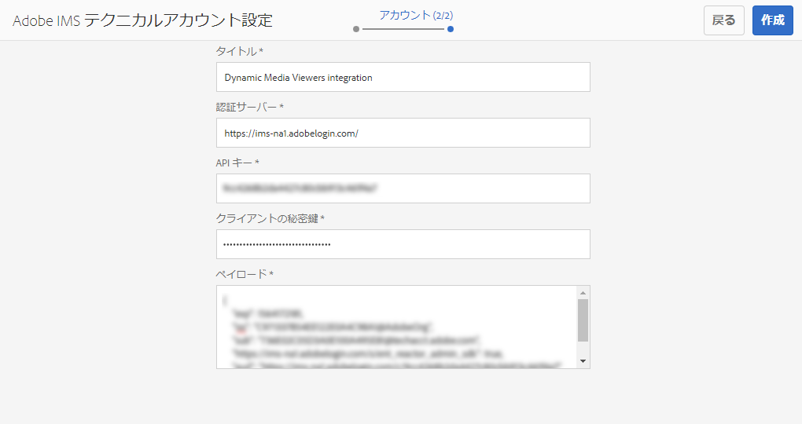
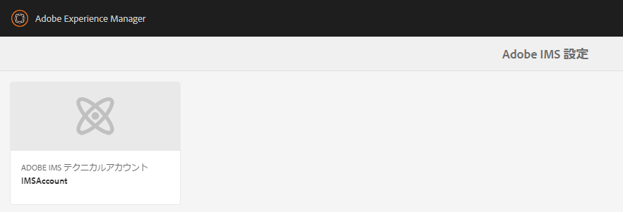
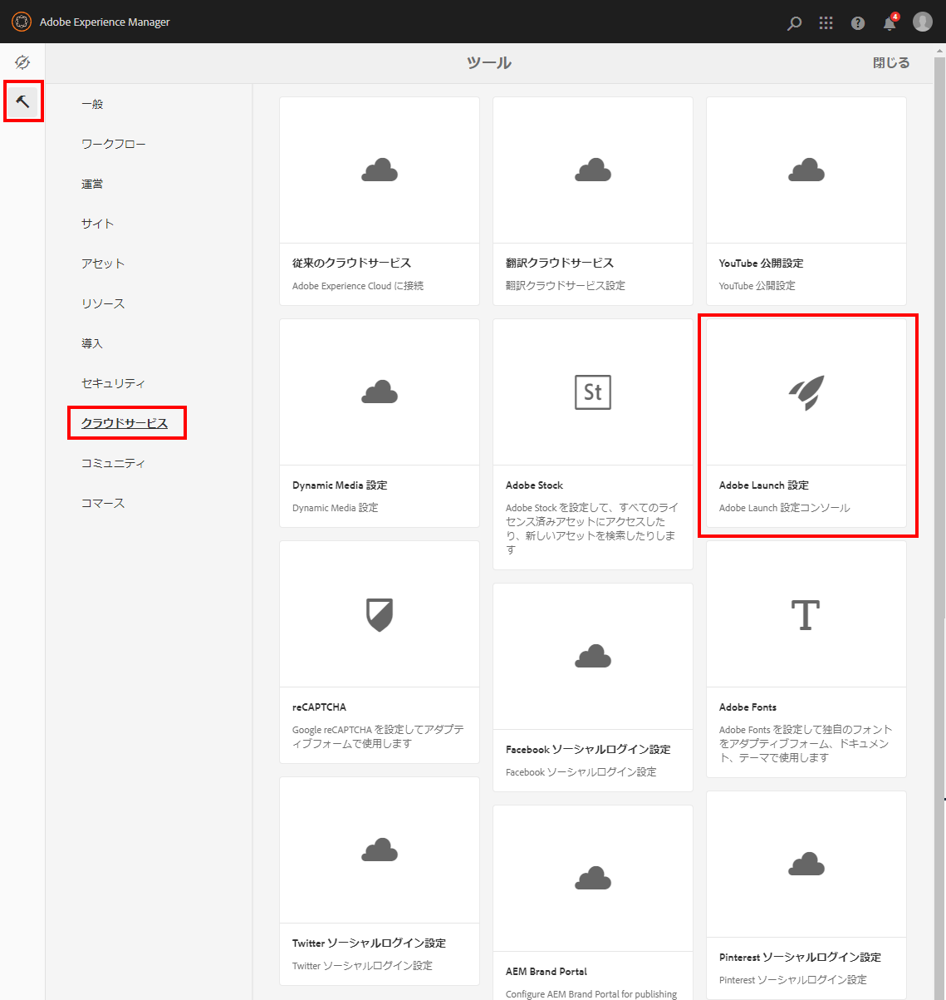

# Dynamic MediaビューアとAdobe AnalyticsおよびExperience Platform Launchの統合{#integrating-dynamic-media-viewers-with-adobe-analytics-and-adobe-launch}

## Dynamic MediaビューアとAdobe AnalyticsおよびExperience Platform Launchの統合について教えてください。{#what-is-dynamic-media-viewers-integration-with-adobe-analytics-and-adobe-launch}

<!-- Leave this hidden path here; it points to the topic source from Sasha https://wiki.corp.adobe.com/pages/viewpage.action?spaceKey=~oufimtse&title=Dynamic+Media+Viewers+integration+with+Adobe+Launch -->

新しい&#x200B;*Dynamic Mediaビューア* Platform launchビューアおよびDynamic Mediaビューア5.13の拡張機能により、Adobe AnalyticsおよびPlatform launchのお客様は、ビューアに固有のイベントとデータをPlatform launch設定で使用できます。

この統合により、Adobe Analytics を使用して、Web サイト上での Dynamic Media ビューアの使用状況を追跡できます。同時に、Adobeまたはサードパーティ製のその他のExperience Platform Launch拡張子を持つイベントおよびビューアによって公開されたデータを使用できます。

拡張機能について詳しくは、『Experience Platform Launchユーザーガイド』の「[Adobe拡張機能](https://experienceleague.adobe.com/docs/launch/using/extensions-ref/overview.html#adobe-extension)」を参照してください。

**このトピックは、** サイト管理者、Experience Managerプラットフォームの開発者およびオペレーションの担当者を対象としています。

### 統合の制限 {#limitations-of-the-integration}

* Dynamic MediaビューアのExperience Platform Launch統合は、Experience Manager作成者ノードでは機能しません。 公開されるまで、WCM ページからのトラッキングを表示することはできません。
* Dynamic MediaビューアのExperience Platform Launch統合は、「ポップアップ」操作モードではサポートされません。このモードでは、ビューアのURLは、アセットの詳細ページの「URL」ボタンを使用して取得されます。
* Experience Platform Launch統合は、従来のビューアのAnalytics統合と同時に（`config2=`パラメーターを介して）使用することはできません。
* ビデオトラッキングのサポートは、[トラッキングの概要](https://experienceleague.adobe.com/docs/media-analytics/using/sdk-implement/track-av-playback/track-core-overview.html#player-events)で説明されているように、「コア再生」のトラッキングのみに制限されます。 具体的には、QoS、広告、チャプター／セグメント、エラーのトラッキングはサポートされていません。
* データ要素のストレージデュレーション設定は、*Dynamic Media ビューア*&#x200B;拡張機能を使用したデータ要素ではサポートされません。ストレージデュレーションは **[!UICONTROL None]** に設定する必要があります。

### 統合の事例 {#use-cases-for-the-integration}

Experience Platform Launchとの統合の主な使用例は、AEM AssetsとAEM Sitesの両方を使用するお客様です。 このような場合は、AEM作成者ノードとExperience Platform Launchの標準的な統合を設定し、SitesインスタンスをExperience Platform Launchプロパティに関連付けることができます。 その後、Site ページに追加された Dynamic Media WCM コンポーネントは、ビューアのデータとイベントを追跡します。

[AEM Sites での Dynamic Media ビューアのトラッキングについて](https://wiki.corp.adobe.com/display/~oufimtse/Dynamic+Media+Viewers+integration+with+Adobe+Launch#DynamicMediaViewersintegrationwithAdobeLaunch-TrackingDynamicMediaViewersinAEMSites)を参照してください。

統合が支える 2 番目の事例は、AEM Assets のみ、または Dynamic Media Classic を使用するお客様です。その場合、ビューアの埋め込みコードを取得して、Web サイトページに追加します。次に、Experience Platform LaunchからExperience Platform Launchライブラリの実稼働URLを取得し、Webページコードに手動で追加します。

[埋め込みコードを使用した Dynamic Media ビューアのトラッキングについて](https://wiki.corp.adobe.com/display/~oufimtse/Dynamic+Media+Viewers+integration+with+Adobe+Launch#DynamicMediaViewersintegrationwithAdobeLaunch-TrackingDynamicMediaViewersusingEmbedcode)を参照してください。

## 統合でのデータとイベントのトラッキングの仕組み {#how-data-and-event-tracking-works-in-the-integration}

この統合では、*Adobe Analytics* と *Adobe Analytics for Audio and Video* という、2 種類の独立したタイプの Dynamic Media ビューアのトラッキングを利用します。

### Adobe Analytics を使用したトラッキングについて {#about-tracking-using-adobe-analytics}

Adobe Analytics を使用すると、エンドユーザーが Web サイト上で Dynamic Media ビューアとやり取りしたときに実行したアクションを追跡できます。また、Adobe Analytics では、ビューア固有のデータも追跡できます。例えば、表示の読み込みイベントを、アセット名、発生したズーム操作、ビデオ再生操作と共に追跡して記録できます。

Experience Platform Launchでは、*データ要素*&#x200B;と&#x200B;*ルール*&#x200B;の概念が連携して、Adobe Analyticsの追跡を有効にします。

#### Experience Platform Launch{#about-data-elements-in-adobe-launch}のデータ要素について

Experience Platform Launch内のデータ要素は、値が静的に定義されるか、WebページまたはDynamic Mediaビューアのデータの状態に基づいて動的に計算される名前付きのプロパティです。

データ要素の定義で使用できるオプションは、Experience Platform Launchプロパティにインストールされている拡張子のリストによって異なります。 「コア」拡張機能はプレインストールされ、任意の設定で初期状態で使用できます。この「コア」拡張機能を使用すると、cookie、JavaScriptコード、クエリ文字列、その他多くのソースから取得される値をデータ要素として定義できます。

Adobe Analytics追跡の場合は、[拡張機能のインストールとセットアップ](#installing-and-setup-of-extensions)の説明に従って、複数の拡張機能をインストールする必要があります。 Dynamic Media ビューア拡張機能には、Dynamic Viewer イベントの引数である値のデータ要素を定義する機能が追加されています。例えば、読み込み時にビューアからレポートされたビューアタイプやアセット名を参照することができます。エンドユーザがズームした場合にレポートされるズームレベルは大幅に増えます。

Dynamic Mediaビューア拡張機能は、データ要素の値を自動的に最新の状態に保ちます。

定義したデータ要素は、データ要素ピッカーウィジェットを使用して、Experience Platform LaunchUIの他の場所で使用できます。 特に、Dynamic Mediaビューア追跡の目的で定義されたデータ要素は、Ruleの「Adobe Analytics拡張の変数アクションを設定」から参照します（以下を参照）。

[データ要素](https://experienceleague.adobe.com/docs/launch/using/reference/manage-resources/data-elements.html#reference)を参照してください。

#### Experience Platform Launch{#about-rules-in-adobe-launch}のルールについて

Experience Platform Launchのルールは不可知の設定で、ルールを構成する3つの領域を定義します。*イベント*、*条件*、*アクション*:

* *イベント* (if)は、ルールをトリガーするタイミングをExperience Platform Launchに伝えます。
* *条件* (if)は、ルールのトリガー時に他のどの制限を許可または許可しないかをExperience Platform Launchに伝えます。
* *アクション* （次に）は、ルールがトリガーされた場合に実行する操作をExperience Platform Launchに指示します。

「イベント」、「条件」、「操作」セクションで使用できるオプションは、「Experience Platform Launchのプロパティ」にインストールされている拡張機能に応じて異なります。 コア&#x200B;**&#x200B;拡張機能はプレインストールされており、どのような設定でも初期状態ですぐに使用できます。この拡張機能には、基本的なブラウザーレベルのアクションなど、イベントに対して複数のオプションが用意されています。 これらのアクションには、フォーカスの変更、キーの押下、フォームの送信が含まれます。 また、条件についても、cookie の値、ブラウザータイプなどのオプションが用意されています。アクションについては、カスタムコードオプションのみ使用できます。

Adobe Analytics追跡の場合、[拡張機能のインストールとセットアップ](#installing-and-setup-of-extensions)の説明に従って、他の複数の拡張機能をインストールする必要があります。 具体的には以下のとおりです。

* Dynamic Media ビューア拡張機能は、サポートされるイベントのリストを、ビューアの読み込み、アセットの入れ替え、ズームイン、ビデオ再生など、Dynamic Media ビューアに固有のイベントに拡張します。
* Adobe Analytics 拡張機能は、サポートされるアクションのリストを拡張し、データをトラッキングサーバーに送信するために必要な、変数設定&#x200B;**&#x200B;とビーコン送信&#x200B;**&#x200B;という 2 つのアクションが用意されています。

Dynamic Mediaビューアを追跡するには、次のいずれかのタイプを使用できます。

* Dynamic Media ビューア拡張機能、コア拡張機能またはその他の拡張機能からのイベント。
* ルール定義の条件。または、条件領域を空のままにすることもできます。

アクションセクションでは、*変数設定*&#x200B;アクションが必要です。このアクションは、Adobe Analytics にデータを使用してトラッキング変数を設定する方法を知らせます。同時に、*変数設定*&#x200B;アクションは、トラッキングサーバーに何も送信しません。

*変数設定*&#x200B;アクションに続けて、*ビーコン送信*&#x200B;アクションを使用する必要があります。*ビーコン送信*&#x200B;アクションは、実際に Analytics トラッキングサーバーにデータを送信します。*変数設定*&#x200B;と&#x200B;*ビーコン送信*&#x200B;アクションは、いずれも Adobe Analytics 拡張機能から得られます。

[ルール](https://experienceleague.adobe.com/docs/launch/using/reference/manage-resources/rules.html#reference)を参照してください。

#### サンプル設定 {#sample-configuration}

Experience Platform Launch内の次の設定例は、ビューアの読み込み時にアセット名を追跡する方法を示しています。

1. 「**[!UICONTROL データ要素]**」タブで、Dynamic Media ビューア拡張機能から `LOAD` イベントの `asset` パラメーターを参照するデータ要素 `AssetName` を定義します。

   

1. 「**[!UICONTROL ルール]**」タブで、ルール *TrackAssetOnLoad* を定義します。

   このルールでは、「**[!UICONTROL イベント]**」フィールドは、Dynamic Media ビューア拡張機能の **[!UICONTROL LOAD]** イベントを使用します。

   

1. アクション設定には、Adobe Analytics 拡張機能の 2 つのアクションタイプがあります。

   変数設定&#x200B;**&#x200B;は、選択した分析変数を `AssetName` データ要素の値にマップします。

   *ビーコン送信*&#x200B;は、Adobe Analytics にトラッキング情報を送信します。

   

1. ルール設定結果は次のようになります。

   

### Adobe Analytics for Audio and Video について {#about-adobe-analytics-for-audio-and-video}

Experience Cloud アカウントが Adobe Analytics for Audio and Video を使用するよう登録されている場合、*Dynamic Media ビューア*&#x200B;拡張機能の設定でビデオのトラッキングを有効にするだけで十分です。ビデオ指標が Adobe Analytics で使用できるようになります。ビデオトラッキングは、Adobe Media Analytics for Audio and Video 拡張機能の有無に依存します。

詳しくは、[拡張機能のインストールとセットアップ](#installing-and-setup-of-extensions)を参照してください。

現在、ビデオトラッキングのサポートは、[トラッキングの概要](https://experienceleague.adobe.com/docs/media-analytics/using/sdk-implement/track-av-playback/track-core-overview.html#player-events)で説明されているように、「コア再生」トラッキングのみに制限されます。具体的には、QoS、広告、チャプター／セグメント、エラーのトラッキングはサポートされていません。

## Dynamic Media ビューア拡張機能の使用 {#using-the-dynamic-media-viewers-extension}

[統合](#use-cases-for-the-integration)の使用例で説明したように、AEM Sitesの新しいExperience Platform Launch統合で、埋め込みコードを使用して、Dynamic Mediaビューアを追跡できます。

### AEM Sites での Dynamic Media ビューアのトラッキング {#tracking-dynamic-media-viewers-in-aem-sites}

AEM Sites で Dynamic Media ビューアを追跡するには、[すべての統合ピースの設定](#configuring-all-the-integration-pieces)で説明している手順をすべて実行する必要があります。特に、IMS設定とExperience Platform Launchクラウド設定を作成する必要があります。

適切な設定に従って、Dynamic Media でサポートされる WCM コンポーネントを使用してサイトページに追加した Dynamic Media ビューアは、Adobe Analytics、Adobe Analytics for Video、またはその両方に対するデータを自動的に追跡します。

<!-- To be reviewed and updated although this is found live in the AEMaaCS version:
See [Adding Dynamic Media Assets to Pages using Adobe Sites](https://helpx.adobe.com/experience-manager/6-5/help/assets/adding-dynamic-media-assets-to-pages.html).
-->

### 埋め込みコードを使用した Dynamic Media ビューアのトラッキング {#tracking-dynamic-media-viewers-using-embed-code}

AEM Sitesを使用しない顧客や、Dynamic MediaのビューアをAEM Sites以外のWebページ、またはその両方に埋め込まない顧客は、引き続きExperience Platform Launch統合を使用できます。

[Adobe Analyticsの設定](#configuring-adobe-analytics-for-the-integration)と[Experience Platform Launch](#configuring-adobe-launch-for-the-integration)の設定の節の設定手順を実行します。 ただし、Experience Manager関連の設定手順は必要ありません。

適切な設定に従って、Dynamic Mediaビューアを使用してWebページにExperience Platform Launchサポートを追加できます。

Experience Platform Launchライブラリの埋め込みコードの使用方法について詳しくは、追加[Platform launchの埋め込みコード](https://experienceleague.adobe.com/docs/launch-learn/implementing-in-websites-with-launch/configure-launch/launch-add-embed.html#configure-launch)を参照してください。

<!-- To be reviewed and updated although this is found live in the AEMaaCS version:
See [Embedding the Video or Image Viewer on a Web Page](https://helpx.adobe.com/experience-manager/6-5/help/assets/embed-code.html) to learn more about how to use the embed code feature of AEM Dynamic Media.
-->

**埋め込みコードを使用して Dynamic Media ビューアを追跡するには**:

1. Dynamic Media ビューアを埋め込む Web ページを準備します。
1. 最初にExperience Platform Launchにログインして、Experience Platform Launchライブラリの埋め込みコードを取得します([Experience Platform Launchの設定](#configuring-adobe-launch-for-the-integration)を参照)。
1. **[!UICONTROL プロパティ]**&#x200B;をクリックし、「**[!UICONTROL 環境]**」タブをクリックします。
1. Web ページの環境に関連する環境レベルを取得します。次に、「**[!UICONTROL インストール]**」列のボックスアイコンをクリックします。
1. **[!UICONTROL Web Install]** Instructionsダイアログボックスで、Experience Platform Launchライブラリの埋め込みコード全体を、周囲の `<script/>` タグと共にコピーします。

## Dynamic Media ビューア拡張機能リファレンスガイド {#reference-guide-for-the-dynamic-media-viewers-extension}

### Dynamic Media ビューアの設定について {#about-the-dynamic-media-viewers-configuration}

次の条件が満たされる場合、Dynamic MediaViewer拡張機能はExperience Platform Launchライブラリと自動的に統合されます。

* Experience Platform Launchライブラリグローバルオブジェクト(`_satellite`)がページに存在します。
* Dynamic Media ビューア拡張機能の `_dmviewers_v001()` 関数が、`_satellite` で定義されている。

* `config2=` ビューアパラメーターが指定されていない。つまり、ビューアが従来の Analytics 統合を使用していない。

また、ビューアの設定で`launch=0`パラメーターを指定して、ビューアのExperience Platform Launch統合を明示的に無効にするオプションもあります。 このパラメーターのデフォルト値は `1` です。

### Dynamic Media ビューア拡張機能の設定 {#configuring-the-dynamic-media-viewers-extension}

Dynamic Media ビューア拡張機能の唯一の設定オプションは、**[!UICONTROL Adobe Media Analytics for Audio and Video を有効にする]**&#x200B;です。

このオプションをオン（有効）にした場合に、オーディオおよびビデオ用のAdobe MediumのAnalyticsの拡張機能がインストールされ、設定されると、ビデオ再生指標がAdobe Analyticsに送信され、オーディオおよびビデオソリューションが使用されます。 このオプションを無効にすると、ビデオトラッキングがオフになります。

Adobe Mediumのオーディオおよびビデオ用のAnalytics拡張機能がインストールされていない状態で&#x200B;*このオプションを有効にした場合、このオプションは無効です。*

### Dynamic Media ビューア拡張機能のデータ要素について {#about-data-elements-in-the-dynamic-media-viewers-extension}

Dynamic Media ビューア拡張機能で提供されるデータ要素タイプは、「**[!UICONTROL データ要素タイプ]**」ドロップダウンリストの&#x200B;**[!UICONTROL ビューアイベント]**&#x200B;のみです。

選択すると、データ要素エディターは、次の 2 つのフィールドを含むフォームをレンダリングします。

* **[!UICONTROL DM ビューアイベントデータタイプ]** - 引数を持つ Dynamic Media ビューア拡張機能でサポートされるすべてのビューアイベントと、特別な **[!UICONTROL COMMON]** 項目を識別するドロップダウンリスト。**[!UICONTROL COMMON]** 項目は、ビューアから送信されるすべてのタイプのイベントに共通するイベントパラメーターのリストを表します。
* **[!UICONTROL トラッキングパラメーター-]** - 選択した Dynamic Media ビューアイベントの引数。

各ビューアタイプでサポートされているイベントのリストについては、[Dynamic Mediaビューアリファレンスガイド](https://experienceleague.adobe.com/docs/dynamic-media-developer-resources/library/viewers-aem-assets-dmc/c-html5-s7-aem-asset-viewers.html?lang=ja#viewers-aem-assets-dmc)を参照してください。特定のビューアセクションに移動し、「Adobe Analytics追跡のサブセクションのサポート」をクリックします。 現在、Dynamic Media ビューアリファレンスガイドでは、イベントの引数について説明していません。

ここで、Dynamic Mediaビューア&#x200B;*データ要素*&#x200B;のライフサイクルを考えてみましょう。 このようなデータ要素の値は、対応する Dynamic Media ビューアイベントがページで発生した後に設定されます。例えば、データ要素が&#x200B;**[!UICONTROL LOAD]**&#x200B;イベントとその&quot;asset&quot;引数を指しているとします。 この場合、このようなデータ要素の値は、ビューアが初めて&#x200B;**[!UICONTROL LOAD]**&#x200B;イベントを実行した後に有効なデータを受け取ります。 データ要素が&#x200B;**[!UICONTROL ZOOM]**&#x200B;イベントとその「scale」引数を指す場合、そのようなデータ要素の値は、ビューアが最初に&#x200B;**[!UICONTROL ZOOM]**&#x200B;イベントを送信するまで空のままです。

同様に、ビューアがページ上の対応するイベントを送信すると、データ要素の値は自動的に更新されます。値の更新は、特定のイベントがルール設定で指定されていない場合でもおこなわれます。例えば、データ要素&#x200B;**[!UICONTROL ZoomScale]**&#x200B;がZOOMイベントの「scale」パラメータに定義されているとします。 ただし、ルール設定に存在する唯一のルールは、**[!UICONTROL LOAD]**&#x200B;イベントによってトリガされます。 **[!UICONTROL ZoomScale]**&#x200B;の値は、ユーザがビューア内でズームを実行するたびに更新されます。

Dynamic Media ビューアは Web ページ上で一意の識別子を持ちます。データ要素は値自体を追跡し、値が埋め込まれたビューアを追跡します。 例えば、同じページに複数のビューアがあり、**[!UICONTROL LOAD]**&#x200B;イベントとその&quot;asset&quot;引数を指す&#x200B;**[!UICONTROL AssetName]**&#x200B;データ要素があるとします。 **[!UICONTROL AssetName]**&#x200B;データ要素は、ページに読み込まれた各ビューアに関連付けられたアセット名のコレクションを保持します。

データ要素から返される正確な値は、コンテキストによって異なります。Dynamic Media ビューアイベントによってトリガーされたルール内でデータ要素が要求された場合、ルールを開始したビューアに対してデータ要素の値が返されます。また、他のPlatform launch拡張子のイベントによってトリガーされたルール内のデータ要素が要求されます。 この時点で、データ要素の値は、このデータ要素を更新する最後のビューアから取得されます。

**次の設定例を考えてみましょう**。

* 2つのDynamic Mediaズームビューアを持つWebページ：*viewer1*&#x200B;および&#x200B;*viewer2*。

* **[!UICONTROL ZoomScale]** データ要素は、**[!UICONTROL ZOOM]** イベントとその「scale」引数を指します。
* **[!UICONTROL TrackPan]** ルールには、次の情報が含まれます。

   * Dynamic Media ビューアの **[!UICONTROL PAN]** イベントをトリガーとして使用。
   * **[!UICONTROL ZoomScale]** データ要素の値を Adobe Analytics に送信。

* **[!UICONTROL TrackKey]** ルールには、次の情報が含まれます。

   * CoreExperience Platform Launch拡張機能のキー押下イベントをトリガーとして使用します。
   * **[!UICONTROL ZoomScale]** データ要素の値を Adobe Analytics に送信。

ここで、エンドユーザーが 2 つのビューアで Web ページを読み込んだとします。*viewer1* では 50％の拡大率でズームインし、次に、*viewer2* では 25％の拡大率でズームインします。*viewer1*&#x200B;では、画像をパンし、最後にキーボードのキーを選択します。

エンドユーザーのアクティビティによって、Adobe Analytics に対して次の 2 つのトラッキングコールが実行されます。

* 最初の呼び出しは、ユーザーが *viewer1* でパンしたときに **[!UICONTROL TrackPan]** ルールがトリガーされることから発生します。この呼び出しにより、**[!UICONTROL ZoomScale]**&#x200B;データ要素の値として50%が送信されます。これは、データ要素が、ルールが&#x200B;*viewer1*&#x200B;によってトリガーされることを認識し、対応するスケール値を取得するからです。
* 2 回目の呼び出しは、ユーザーがキーボードのキーを押したときに **[!UICONTROL TrackKey]** ルールがトリガーされるので発生します。ルールをトリガーしたのがビューアでなかったので、この呼び出しでは **[!UICONTROL ZoomScale]** データ要素の値として 25％が送信されます。このようにして、データ要素は最新の値を返します。

上記のサンプル設定は、データ要素の値の寿命にも影響します。Dynamic Mediaビューアで管理されるデータ要素の値は、ビューア自体がWebページに配置された後でも、Platform launchライブラリコードに保存されます。 つまり、Dynamic Media以外のビューアの拡張によってトリガーされるルールがあり、そのようなデータ要素を参照する場合、データ要素は最後に認識された値を返します。 ビューアがWebページに存在しなくなった場合でも、

いずれにしても、Dynamic Mediaビューアが駆動するデータ要素の値は、ローカルストレージまたはサーバに保存されません。代わりに、クライアント側のExperience Platform Launchライブラリにのみ保持されます。 Web ページがリロードされると、このようなデータ要素の値は消去されます。

一般に、データ要素エディターでは、[ストレージ期間の選択](https://experienceleague.adobe.com/docs/launch/using/reference/manage-resources/data-elements.html?lang=en#create-a-data-element)がサポートされます。ただし、Dynamic Media ビューア拡張機能を使用するデータ要素は、ストレージ期間「**[!UICONTROL なし]**」オプションのみサポートします。その他の値はユーザーインターフェイスで設定可能ですが、この場合、データ要素の動作は定義されていません。拡張機能は、データ要素の値を独自に管理します。データ要素は、ビューアのライフサイクル全体でビューアのイベント引数の値を維持します。

### Dynamic Media ビューア拡張機能のルールについて {#about-rules-in-the-dynamic-media-viewers-extension}

ルールエディターで、イベントエディターの新しい設定オプションが追加されます。また、事前に設定されたデータ要素を使用する代わりに、イベントエディターでアクションのパラメーターを短い方法で手動で参照するオプションも用意されています。

#### イベントエディターについて {#about-the-events-editor}

イベントエディタで、Dynamic Mediaビューア拡張機能により、**[!UICONTROL ビューアイベント]**&#x200B;と呼ばれる&#x200B;**[!UICONTROL イベントタイプ]**&#x200B;が追加されます。

選択すると、イベントエディターによって「**[!UICONTROL Dynamic Media ビューアイベント]**」ドロップダウンがレンダリングされ、Dynamic Media ビューアでサポートされる使用可能なイベントがすべて表示されます。

#### アクションエディターについて {#about-the-actions-editor}

Dynamic Media ビューア拡張機能を使用すると、Dynamic Media ビューアのイベントパラメーターを使用して、Adobe Analytics 拡張機能の変数設定エディターで分析変数にマッピングできます。

最も簡単な方法は、次の 2 つの手順を実行することです。

* まず、1 つ以上のデータ要素を定義します。各データ要素は、Dynamic Media ビューアイベントのパラメーターを表します。
* 最後に、Adobe Analytics 拡張機能の変数設定エディターで、データ要素ピッカーアイコン（3 つの重なったディスク）をクリックし、データ要素を選択ダイアログボックスを開き、データ要素を選択します。

ただし、別の方法を使用して、データ要素の作成をスキップすることは可能です。引数は、Dynamic Mediaビューアイベントから直接参照できます。 Analytics変数の割り当ての&#x200B;**[!UICONTROL 値]**&#x200B;入力フィールドに、イベント引数の完全修飾名を入力します。 必ずパーセント記号(%)で囲んでください。 例：

`%event.detail.dm.LOAD.asset%`

データ要素を使用する場合と、直接イベント引数参照を使用する場合の間に重要な違いがあります。 データ要素の場合、「Set Variables」トリガーがどのイベントに属していてもかまいません。ルールをトリガーするイベントは、動的ビューアとは無関係の場合があります。 例えば、Core拡張機能からWebページをクリックします。 ただし、直接引数参照を使用する場合は、ルールをトリガーするイベントが、参照するイベント引数に対応していることを確認することが重要です。

例えば、`%event.detail.dm.LOAD.asset%` の参照は、ルールが Dynamic Media ビューア拡張機能の **[!UICONTROL LOAD]** イベントによってトリガーされる場合、正しいアセット名を返します。ただし、他のイベントの場合は空の値を返します。

次の表に、Dynamic Media ビューアイベントと、サポートされている引数を示します。

<table>
 <tbody>
  <tr>
   <td>ビューアのイベント名</td>
   <td>引数の参照</td>
  </tr>
  <tr>
   <td><code>COMMON</code></td>
   <td><code>%event.detail.dm.objID%</code></td>
  </tr>
  <tr>
   <td> </td>
   <td><code>%event.detail.dm.compClass%</code></td>
  </tr>
  <tr>
   <td> </td>
   <td><code>%event.detail.dm.instName%</code></td>
  </tr>
  <tr>
   <td> </td>
   <td><code>%event.detail.dm.timeStamp%</code></td>
  </tr>
  <tr>
   <td><code>BANNER</code> </td>
   <td><code>%event.detail.dm.BANNER.asset%</code></td>
  </tr>
  <tr>
   <td> </td>
   <td><code>%event.detail.dm.BANNER.frame%</code></td>
  </tr>
  <tr>
   <td> </td>
   <td><code>%event.detail.dm.BANNER.label%</code></td>
  </tr>
  <tr>
   <td><code>HREF</code></td>
   <td><code>%event.detail.dm.HREF.rollover%</code></td>
  </tr>
  <tr>
   <td><code>ITEM</code></td>
   <td><code>%event.detail.dm.ITEM.rollover%</code></td>
  </tr>
  <tr>
   <td><code>LOAD</code></td>
   <td><code>%event.detail.dm.LOAD.applicationname%</code></td>
  </tr>
  <tr>
   <td><strong> </strong></td>
   <td><code>%event.detail.dm.LOAD.asset%</code></td>
  </tr>
  <tr>
   <td><strong> </strong></td>
   <td><code>%event.detail.dm.LOAD.company%</code></td>
  </tr>
  <tr>
   <td><strong> </strong></td>
   <td><code>%event.detail.dm.LOAD.sdkversion%</code></td>
  </tr>
  <tr>
   <td><strong> </strong></td>
   <td><code>%event.detail.dm.LOAD.viewertype%</code></td>
  </tr>
  <tr>
   <td><strong> </strong></td>
   <td><code>%event.detail.dm.LOAD.viewerversion%</code></td>
  </tr>
  <tr>
   <td><code>METADATA</code></td>
   <td><code>%event.detail.dm.METADATA.length%</code></td>
  </tr>
  <tr>
   <td> </td>
   <td><code>%event.detail.dm.METADATA.type%</code></td>
  </tr>
  <tr>
   <td><code>MILESTONE</code></td>
   <td><code>%event.detail.dm.MILESTONE.milestone%</code></td>
  </tr>
  <tr>
   <td><code>PAGE</code></td>
   <td><code>%event.detail.dm.PAGE.frame%</code></td>
  </tr>
  <tr>
   <td> </td>
   <td><code>%event.detail.dm.PAGE.label%</code></td>
  </tr>
  <tr>
   <td><code>PAUSE</code></td>
   <td><code>%event.detail.dm.PAUSE.timestamp%</code></td>
  </tr>
  <tr>
   <td><code>PLAY</code></td>
   <td><code>%event.detail.dm.PLAY.timestamp%</code></td>
  </tr>
  <tr>
   <td><code>SPIN</code></td>
   <td><code>%event.detail.dm.SPIN.framenumber%</code></td>
  </tr>
  <tr>
   <td><code>STOP</code></td>
   <td><code>%event.detail.dm.STOP.timestamp%</code></td>
  </tr>
  <tr>
   <td><code>SWAP</code></td>
   <td><code>%event.detail.dm.SWAP.asset%</code></td>
  </tr>
  <tr>
   <td><code>SWATCH</code></td>
   <td><code>%event.detail.dm.SWATCH.frame%</code></td>
  </tr>
  <tr>
   <td> </td>
   <td><code>%event.detail.dm.SWATCH.label%</code></td>
  </tr>
  <tr>
   <td><code>TARG</code></td>
   <td><code>%event.detail.dm.TARG.frame%</code></td>
  </tr>
  <tr>
   <td> </td>
   <td><code>%event.detail.dm.TARG.label%</code></td>
  </tr>
  <tr>
   <td><code>ZOOM</code></td>
   <td><code>%event.detail.dm.ZOOM.scale%</code></td>
  </tr>
 </tbody>
</table>

## すべての統合ピースの設定 {#configuring-all-the-integration-pieces}

**始める前に**

Adobeでは、この節の前にドキュメントを十分に見直し、統合を完全に理解することをお勧めします。

ここでは、Dynamic Media ビューアを Adobe Analytics および Adobe Analytics for Audio and video と統合するために必要な設定手順について説明します。Experience Platform Launchの他の目的でDynamic Mediaビューア拡張機能を使用することは可能ですが、このドキュメントではそのようなシナリオについては説明しません。

次のAdobe製品を使用して統合を設定します。

* Adobe Analytics — トラッキング変数とレポートの設定に使用します。
* Experience Platform Launch — プロパティ、1つ以上のルールおよび1つ以上のデータ要素を定義して、ビューアの追跡を有効にするために使用します。

また、この統合ソリューションをExperience Managerサイトで使用する場合は、次の設定も行う必要があります。

* [!DNL Adobe I/O] コンソール —Experience Platform Launch用に統合が作成されます。
* Experience Manager作成者ノード — IMS設定とExperience Platform Launchクラウド設定。

設定の一部として、Adobe AnalyticsとExperience Platform Launchが既に有効になっているAdobe Experience Cloudの会社にアクセスできることを確認します。

## 統合のための Adobe Analytics の設定 {#configuring-adobe-analytics-for-the-integration}

Adobe Analytics を設定した後、統合のために次の設定がおこなわれます。

* レポートスイートが配置され、選択される。
* Analytics 変数がトラッキングデータを受け取るために使用可能になる。
* Adobe Analytics 内で収集されたデータを表示するレポートが使用可能になる。

[Analytics 導入ガイド](https://experienceleague.adobe.com/docs/analytics/implementation/home.html)も参照してください。

**統合のために Adobe Analytics を設定するには**：

1. まず、Experience Cloud [ホームページ](https://exc-home.experiencecloud.adobe.com/exc-home/home.html#/)から Adobe Analytics にアクセスします。メニューバーで、ページの右上隅付近にあるソリューションアイコン（3 x 3 のドットテーブル）をクリックし、**[!UICONTROL Analytics]** をクリックします。

   

   次に、レポートスイートを選択します。

### レポートスイートの選択 {#selecting-a-report-suite}

1. Adobe Analytics ページの右上隅近くの「**[!UICONTROL レポートの検索]**」フィールドの右側にあるドロップダウンリストから、適切なレポートスイートを選択します。複数のレポートスイートが使用可能で、どれを使用するか不明な場合は、Adobe Analytics 管理者が使用するレポートスイートを選択するのに役立ちます。

   下の図では、ユーザーが *DynamicMediaViewersExtensionDoc* という名前のレポートスイートを作成し、ドロップダウンリストから選択しています。レポートスイート名は、説明の目的でのみ使用します。 最終的に選択するレポートスイートの名前は、ユーザー次第です。

   使用できるレポートスイートがない場合は、設定を続行する前に、ユーザーまたは Adobe Analytics 管理者がレポートスイートを作成する必要があります。

   [レポートとレポートスイート](https://experienceleague.adobe.com/docs/analytics/admin/manage-report-suites/report-suites-admin.html#manage-report-suites)および[レポートスイートの作成](https://experienceleague.adobe.com/docs/analytics/admin/admin-console/create-report-suite.html#admin-console)を参照してください。

   Adobe Analytics では、**[!UICONTROL 管理者／レポートスイート]**&#x200B;でレポートスイートを管理します。

   

   次に、Adobe Analytics変数を設定します。

### Adobe Analytics 変数の設定 {#setting-up-adobe-analytics-variables}

1. WebページでのDynamic Mediaビューアの行動の追跡に使用する1つ以上のAdobe Analytics変数を指定します。

   Adobe Analytics でサポートされている任意のタイプの変数を使用できます。変数型に関する決定(カスタムトラフィック[props]、コンバージョン[eVar]など)は、Analytics実装の特定のニーズに左右されます。

   [prop と eVar の概要](https://experienceleague.adobe.com/docs/analytics/implementation/vars/page-vars/evar.html#vars)を参照してください。

   このドキュメントの目的上、カスタムトラフィック(prop)変数は、Webページ上でアクションが発生した数分後にAnalyticsレポートで使用できるようになるので、使用するのは1つのみです。

   新しいカスタムトラフィック変数を有効にするには、Adobe Analyticsのツールバーで、**[!UICONTROL 管理者/レポートスイート]**&#x200B;をクリックします。

1. **[!UICONTROL Report Suite Manager]**&#x200B;ページで正しいレポートを選択し、ツールバーで&#x200B;**[!UICONTROL 設定を編集/トラフィック/トラフィック変数]**&#x200B;をクリックします。
1. そこで、未使用の変数を選択し、わかりやすい名前(**[!UICONTROL ビューアアセット(prop 30)]**)を付け、有効列のコンボボックスを「有効」に変更します。

   次のスクリーンショットは、ビューアが使用するアセット名を追跡するためのカスタムトラフィック変数(**[!UICONTROL prop30]**)の例です。

   

1. 変数リストの下部で、「**[!UICONTROL 保存]**」をクリックします。

### レポートの設定 {#setting-up-a-report}

1. 一般に、Adobe Analytics でのレポートの設定は、特定のプロジェクトのニーズに左右されます。したがって、詳細なレポート設定は、この統合の範囲外です。

   ただし、[Adobe Analytics変数の設定](#setting-up-adobe-analytics-variables)でカスタムトラフィック変数を設定すると、カスタムトラフィックレポートがAdobe Analyticsで自動的に使用できるようになります。

   例えば、**[!UICONTROL ビューアアセット（prop 30）]**&#x200B;変数のレポートは、**[!UICONTROL カスタムトラフィック／カスタムトラフィック 21～30／ビューアアセット（prop 30）]**&#x200B;下のレポートメニューから使用できます。

   **[!UICONTROL ビューアアセット（prop 30）]**&#x200B;を作成した直後にこのレポートを表示すると、データが表示されません。これは、統合のこの時点で予想されることです。

   

## 統合のExperience Platform Launchの設定{#configuring-adobe-launch-for-the-integration}

統合を設定した後、Experience Platform Launchに対して次の設定が行われます。

* すべての設定をまとめるための新しいプロパティの作成。
* 拡張機能のインストールとセットアップ。プロパティにインストールされたすべての拡張機能のクライアント側コードは、1 つのライブラリにまとめられる。このライブラリは後で Web ページで使用されます。
* データ要素とルールの設定。この設定は、Dynamic Media ビューアから取得するデータ、トラッキングロジックをトリガーするタイミング、Adobe Analytics でビューアのデータを送信する場所を定義するものです。
* ライブラリの公開。

**統合のExperience Platform Launchを設定するには**:

1. Experience Cloud[ホームページ](https://exc-home.experiencecloud.adobe.com/exc-home/home.html#/)からExperience Platform Launchにアクセスして開始。 メニューバーで、ページの右上隅付近にあるソリューションアイコン（3 x 3 ドットのテーブル）をクリックし、**[!UICONTROL Launch]** をクリックします。

   [Experience Platform Launchを直接](https://launch.adobe.com/)開くこともできます。

   

### Experience Platform Launch{#creating-a-property-in-adobe-launch}でのプロパティの作成

Experience Platform Launch内のプロパティは、すべての設定をまとめた名前付き設定です。 構成設定のライブラリが様々な環境レベル（開発、ステージングおよび実稼動）で生成され、公開されます。

「[起動プロパティの作成](https://experienceleague.adobe.com/docs/launch-learn/implementing-in-mobile-android-apps-with-launch/configure-launch/launch-create-a-property.html#configure-launch)」も参照してください。

1. Experience Platform Launchで、「**[!UICONTROL 新しいプロパティ]**」をクリックします。
1. **[!UICONTROL プロパティを作成]**&#x200B;ダイアログボックスの「**[!UICONTROL 名前]**」フィールドに、Web サイトのタイトルなど、わかりやすい名前を入力します。例：`DynamicMediaViewersProp.`
1. 「**[!UICONTROL ドメイン]**」フィールドに、Web サイトのドメインを入力します。
1. **[!UICONTROL 高度なオプション]**&#x200B;ドロップダウンで、使用する拡張機能(この場合は&#x200B;*Dynamic Mediaビューア*)がまだリリースされていない場合に、**[!UICONTROL 拡張機能開発用に設定（後で変更できません）]**&#x200B;を有効にします。

   

1. 「**[!UICONTROL 保存]**」をクリックします。

   新しく作成したプロパティをクリックし、*拡張子のインストールとセットアップ*&#x200B;に進みます。

### 拡張機能のインストールとセットアップ {#installing-and-setup-of-extensions}

Experience Platform Launch内で使用可能なすべての拡張子は、**[!UICONTROL 拡張子/カタログ]**&#x200B;の下に一覧表示されます。

拡張機能をインストールするには、「**[!UICONTROL インストール]**」をクリックします。必要に応じて、1 回限りの拡張機能の設定を実行し、「**[!UICONTROL 保存]**」をクリックします。

必要に応じて、次の拡張機能をインストールし、設定する必要があります。

* （必須） *Experience CloudIDサービス*拡張

追加の設定は必要ありません。提案されたあらゆる値を受け入れます。完了したら、必ず「**[!UICONTROL 保存]**」をクリックします。

詳しくは、[Experience Cloud ID サービス拡張機能](https://experienceleague.adobe.com/docs/launch/using/extensions-ref/adobe-extension/id-service-extension/overview.html#extensions-ref)を参照してください。

* （必須）*Adobe Analytics 拡張機能*

この拡張機能を設定するには、Adobe Analyticsの&#x200B;**[!UICONTROL 管理者/レポートスイート]**&#x200B;の下、**[!UICONTROL レポートスイートID]**&#x200B;列見出しの下にあるレポートスイートIDが必要です。

(デモ目的でのみ、**[!UICONTROL DynamicMediaViewersExtensionDoc]**&#x200B;レポートスイートのレポートスイートIDは、次のスクリーンショットで使用します。 この ID は、以前の[レポートスイートの選択](#selecting-a-report-suite)で作成および使用されていました）

拡張機能のインストールページで、「**[!UICONTROL 開発レポートスイート]**」フィールド、「**[!UICONTROL ステージングレポートスイート]**」フィールド、「**[!UICONTROL 実稼動レポートスイート]**」フィールドに、レポートスイート ID を入力します。

*ビデオトラッキングを使用する予定の場合のみ、次の項目を設定します。*

**[!UICONTROL 拡張機能のインストール]**&#x200B;ページで、「**[!UICONTROL 一般]**」を展開し、「トラッキングサーバー」を指定します。トラッキングサーバーはテンプレート `<trackingNamespace>.sc.omtrdc.net` に従います。`<trackingNamespace>` は、プロビジョニング電子メールで取得した情報です。

「**[!UICONTROL 保存]**」をクリックします。

詳しくは、[Adobe Analytics 拡張機能](https://experienceleague.adobe.com/docs/launch/using/extensions-ref/adobe-extension/analytics-extension/overview.html#extensions-ref)を参照してください。

* (オプション、ビデオトラッキングが必要な場合にのみ必要)*オーディオおよびビデオ用のAnalyticsのAdobe Medium*&#x200B;拡張子

「トラッキングサーバー」フィールドに入力します。*Adobe Media Analytics for Audio and Video* 拡張機能のトラッキングサーバーは、Adobe Analytics で使用されるトラッキングサーバーとは異なります。これはテンプレート `<trackingNamespace>.hb.omtrdc.net` に従います。`<trackingNamespace>` は、プロビジョニング電子メールの情報です。

その他のフィールドはオプションです。

詳しくは、[Adobe Media Analytics for Audio and Video 拡張機能](https://experienceleague.adobe.com/docs/launch/using/extensions-ref/adobe-extension/media-analytics-extension/overview.html#extensions-ref)を参照してください。

* （必須）** Dynamic Media ビューア拡張機能

**[!UICONTROL ビデオ分析を有効にする]**&#x200B;を選択して、ビデオハートビートトラッキングを有効（オン）にします。

このドキュメントの記述時点で、*Dynamic Mediaビューア*&#x200B;の拡張子は、開発用にExperience Platform Launchプロパティが作成されている場合にのみ使用できます。

「[Experience Platform Launch](#creating-a-property-in-adobe-launch)でのプロパティの作成」を参照してください。

拡張機能のインストールと設定が完了すると、少なくとも次の 5 つの拡張機能（ビデオをトラッキングしていない場合は 4 つ）が拡張機能／インストール領域に表示されます。

### データ要素とルールの設定 {#setting-up-data-elements-and-rules}

Experience Platform Launchで、Dynamic Mediaビューアの追跡に必要なデータ要素とルールを作成します。

Experience Platform Launchを使用した追跡の概要については、[統合](#how-data-and-event-tracking-works-in-the-integration)でのデータとイベントの追跡のしくみを参照してください。

ビューアの読み込み時にアセット名を追跡する方法を示すExperience Platform Launchでの設定例については、[サンプル設定](#sample-configuration)を参照してください。

拡張機能の機能について詳しくは、[Dynamic Media ビューア拡張機能の設定](#configuring-the-dynamic-media-viewers-extension)を参照してください。

### ライブラリの公開 {#publishing-a-library}

Experience Platform Launchの設定（プロパティ、拡張子、ルール、データ要素の設定を含む）を変更するには、*publish*&#x200B;する必要があります。 Experience Platform Launchでの公開は、プロパティ設定の「公開」タブから実行します。

platform launchには、複数の開発環境、1つのステージング環境、1つの実稼動環境が存在する可能性があります。 デフォルトでは、Experience ManagerのPlatform launchクラウド設定は、Experience Manager作成者ノードをPlatform launchのステージ環境に向けます。 Experience Manager公開ノードは、Platform launchの実稼働環境を指し示します。 この配置は、デフォルトのExperience Manager設定では、Platform launchライブラリをステージング環境に発行する必要があることを意味します。 これを行うと、Experience Manager作成者で使用できます。 その後、実稼働環境に公開して、Experience Manager公開で使用できるようにします。

Experience Platform Launch環境の詳細については、[環境](https://experienceleague.adobe.com/docs/launch/using/reference/publish/environments/environments.html#environment-types)を参照してください。

ライブラリの公開には、次の 2 つの手順を実行します。

* 必要な変更（新しい変更や更新）をすべてライブラリに含めて、新しいライブラリを追加して構築。
* 様々な環境レベル（開発からステージングおよび実稼動へ）でライブラリを上に移動します。

#### 新しいライブラリの追加と構築 {#adding-and-building-a-new-library}

1. Experience Platform Launchで初めて「発行」タブを開くと、ライブラリリストは空になります。

   左の列で、「**[!UICONTROL 新しいライブラリを追加]**」をクリックします。

   

1. 新しいライブラリを作成ページの「**[!UICONTROL 名前]**」フィールドに、新しいライブラリのわかりやすい名前を入力します。例：

   *DynamicMediaViewersLib*

   「環境」ドロップダウンリストから、環境レベルを選択します。最初は、選択できるのは開発レベルのみです。ページの左下近くにある「**[!UICONTROL 変更されたすべてのリソースを追加]**」をクリックします。

   

1. ページの右上隅にある「**[!UICONTROL 開発用に保存してビルド]**」をクリックします。

   数分後に、ライブラリが作成され、使用できる状態になります。

   

   >[!NOTE]
   >
   >次にExperience Platform Launch設定を変更する場合は、**[!UICONTROL プロパティ]**&#x200B;設定の下の&#x200B;**[!UICONTROL 発行]**&#x200B;タブに移動し、以前に作成したライブラリをクリックします。
   >
   >
   >ライブラリの公開画面で、「**[!UICONTROL 変更されたすべてのリソースを追加]**」をクリックし、「**[!UICONTROL 開発用に保存してビルド]**」をクリックします。

#### 環境レベルを使用したライブラリの上への移動{#moving-a-library-up-through-environment-levels}

1. 新しいライブラリを追加すると、そのライブラリは開発環境に表示されます。 これをステージング環境レベル（「送信済み」列に対応）に移動するには、ライブラリのドロップダウンメニューで「**[!UICONTROL 承認用に送信]**」をクリックします。

   

1. 確認ダイアログボックスで、「**[!UICONTROL 送信]**」をクリックします。

   ライブラリが「送信済み」列に移動した後、ライブラリのドロップダウンメニューで、「**[!UICONTROL ステージング用にビルド]**」をクリックします。

   

1. ステージング環境から実稼働環境（「発行済み」列）にライブラリを移動するには、同様のプロセスに従います。

   まず、ドロップダウンメニューの「**[!UICONTROL 公開の承認]**」をクリックします。

   

1. ドロップダウンメニューの「**[!UICONTROL ビルドして実稼動環境に公開]**」をクリックします。

   

   Experience Platform Launchでの公開プロセスについて詳しくは、[公開](https://experienceleague.adobe.com/docs/launch/using/reference/publish/overview.html#reference)を参照してください。

## 統合のための Adobe Experience Manager の設定 {#configuring-adobe-experience-manager-for-the-integration}

前提条件：

* AEM は、オーサーインスタンスとパブリッシュインスタンスの両方を実行します。
* AEM authorノードはDynamic Media-Scene7実行モード(dynamicmedia_s7)で設定されます。
* Dynamic Media WCM コンポーネントは AEM Sites で有効になっています。

AEM 設定は、次の 2 つの主な手順で構成されます。

* AEM IMS の設定。
* Experience Platform Launchクラウドの設定を参照してください。

### AEM IMS の設定 {#configuring-aem-ims}

1. AEM オーサーで、ツールアイコン（ハンマー）をクリックし、**[!UICONTROL セキュリティ／Adobe IMS 設定]**&#x200B;をクリックします。

   

1. Adobe IMC 設定ページの左上隅付近にある「**[!UICONTROL 作成]**」をクリックします。
1. **[!UICONTROL AdobeIMSテクニカルアカウント設定]**&#x200B;ページの&#x200B;**[!UICONTROL クラウドソリューション]**&#x200B;ドロップダウンリストで、**[!UICONTROL Experience Platform Launch]**&#x200B;をクリックします。
1. 「**[!UICONTROL 新しい証明書を作成]**」を有効にし、テキストフィールドに証明書に意味のある値を入力します。例えば、*AdobeLaunchIMSCert* と入力します。「**[!UICONTROL 証明書を作成]**」をクリックします。

   次の情報メッセージが表示されます。

   *有効なアクセストークンを取得するために、Adobe I/O時に新しい証明書の公開鍵がテクニカルアカウントに追加されます。*

   情報ダイアログボックスを閉じるには、「**[!UICONTROL OK]**」をクリックします。

   

1. 公開鍵ファイル(*.crt)をローカルシステムにダウンロードするには、[**[!UICONTROL 公開鍵]**&#x200B;のダウンロード]をクリックします。

   >[!NOTE]
   >
   >この時点で、**[!UICONTROL Adobe IMS テクニカルアカウント設定ページを&#x200B;***開いたまま***にします。ページは]**&#x200B;閉じずに&#x200B;******、「***次へ***」もクリックしません。手順の後半で、このページに戻ります。

   

1. 新しいブラウザータブで、[[!DNL Adobe I/O] コンソール](https://console.adobe.io/integrations)に移動します。

1. **[!UICONTROL Adobe I/O コンソール統合]**&#x200B;ページの右上隅近くにある「**[!UICONTROL 新規の統合]**」をクリックします。
1. **[!UICONTROL 統合の新規作成]**&#x200B;ダイアログボックスで、「**[!UICONTROL API へのアクセス]**」ラジオボタンが選択されていることを確認し、「**[!UICONTROL 続行]**」をクリックします。

   

1. **[!UICONTROL 統合の新規作成]**&#x200B;の 2 ページ目で、「**[!UICONTROL Experience Platform Launch API]**」ラジオボタンを有効（オン）にします。ページの右下隅にある「**[!UICONTROL 続行]**」をクリックします。

   

1. **[!UICONTROL 統合の新規作成]**&#x200B;の 3 ページ目で、次の操作をおこないます。

   * 「**[!UICONTROL 名前]**」フィールドにわかりやすい名前を入力します。例えば、*DynamicMediaViewersIO* と入力します。

   * 「**[!UICONTROL 説明]**」フィールドに、統合の説明を入力します。

   * 「**[!UICONTROL 公開鍵証明書]**」領域で、これらの手順で以前にダウンロードした公開鍵ファイル(*.crt)をアップロードします。

   * 「**[!UICONTROL Experience Platform Launch API 用の役割を選択]**」の見出しの下から「**[!UICONTROL 管理者]**」を選択します。

   * 「**[!UICONTROL Experience Platform Launch API 用の製品プロファイルを 1 つ以上選択]**」の見出しの下から、**[!UICONTROL Launch - &lt;your_company_name>]**&#x200B;という名前の製品プロファイルを選択します。

   

1. 「**[!UICONTROL 統合を作成]**」をクリックします。
1. **[!UICONTROL 統合が作成された]**&#x200B;ページで、「**[!UICONTROL 統合の詳細を続行]**」をクリックします。

   

1. 統合の詳細ページ&#x200B;****&#x200B;が表示され、次のようになります。

   >[!NOTE]
   >
   >***この統合の詳細ページは開いたままにします***。**[!UICONTROL 概要]**&#x200B;タブと&#x200B;**[!UICONTROL JWT]**&#x200B;タブの情報は、すぐに必要になります。

   

   統合の詳細ページ.

1. 前に開いておいた **[!UICONTROL Adobe IMS テクニカルアカウント設定]**&#x200B;ページに戻ります。ページの右上隅にある「**[!UICONTROL 次へ]**」をクリックして、**[!UICONTROL Adobe IMS テクニカルアカウント設定]**&#x200B;ウィンドウで&#x200B;**[!UICONTROL アカウント]**&#x200B;ページを開きます。

   (前にページを閉じた場合は、Experience Manager作成者に戻り、**[!UICONTROL ツール/セキュリティ/AdobeIMS設定]**&#x200B;をクリックします。 「**[!UICONTROL 作成]**」をクリックします。**[!UICONTROL Cloud Solution]**&#x200B;ドロップダウンリストで、**[!UICONTROL Experience Platform Launch]**&#x200B;を選択します。 「**[!UICONTROL 証明書]**」ドロップダウンリストで、以前に作成した証明書の名前を選択します。)

   

   Adobe IMS テクニカルアカウント設定 - 証明書ページ.

1. **[!UICONTROL アカウント]**&#x200B;ページには、前の手順の統合の詳細ページの情報を使用して入力する必要がある5つのフィールドがあります。

   

   Adobe IMS テクニカルアカウント設定 - アカウントページ.

1. **[!UICONTROL アカウント]**&#x200B;ページで以下のフィールドに入力します。

   * **[!UICONTROL タイトル]** - 説明的なアカウントのタイトルを入力します。
   * **[!UICONTROL 認証サーバー]** - 以前に開いた統合の詳細ページに戻ります。「**[!UICONTROL JWT]**」タブをクリックします。次に示すように、サーバ名（パスを除く）をコピーします。

（サーバー名の例は説明用です）   **[!UICONTROL アカウント]**ページに戻り、その名前を各フィールドに貼り付けます。
例：`https://ims-na1.adobelogin.com/`（サーバー名の例は説明用です）。

   

   統合の詳細ページ - 「JWT」タブ

1. **[!UICONTROL API キー]** - 統合の詳細ページに戻ります。「**[!UICONTROL 概要]**」タブをクリックし、「**[!UICONTROL API キー（クライアント ID）]**」フィールドの右にある「**[!UICONTROL コピー]**」をクリックします。

   **[!UICONTROL アカウント]**&#x200B;ページに戻り、キーを****フィールドに貼り付けます。

   

   統合の詳細ページ.

1. **[!UICONTROL クライアントシークレット]** - 統合の詳細ページに戻ります。「**[!UICONTROL 概要]**」タブで、「**[!UICONTROL クライアントシークレットを取得]**」をクリックします。「**[!UICONTROL クライアントシークレット]**」フィールドの右側の「**[!UICONTROL コピー]**」をクリックします。

   **[!UICONTROL アカウント]**&#x200B;ページに戻り、キーを各フィールドに貼り付けます。

1. **[!UICONTROL ペイロード]** - 統合の詳細ページに戻ります。「**[!UICONTROL JWT]**」タブの「JWT ペイロード」フィールドで、JSON オブジェクトコード全体をコピーします。

   **[!UICONTROL アカウント]**&#x200B;ページに戻り、コードを各フィールドに貼り付けます。

   

   統合の詳細ページ - 「JWT」タブ

   すべてのフィールドが入力されたアカウントページは、次のようになります。

   

1. ****&#x200B;アカウントページの右上隅にある「**[!UICONTROL 作成]**」をクリックします。

   AEM IMS が設定され、**[!UICONTROL Adobe IMS 設定]**&#x200B;に新しい IMSAccount が表示されます。

   

## 統合用のExperience Platform Launchクラウドの設定{#configuring-adobe-launch-cloud-for-the-integration}

1. AEM authorで、左上隅近くにあるツールアイコン（ハンマー）をクリックし、**[!UICONTROL Cloud Services/Experience Platform Launch設定]**&#x200B;をクリックします。

   

1. **[!UICONTROL Experience Platform Launch設定]**&#x200B;ページの左側のパネルで、Experience Platform Launch設定を適用するAEMサイトを選択します。

   以下のスクリーンショットでは、**[!UICONTROL We.Retail]** サイトが選択されています。

   

1. ページの左上隅近くにある「**[!UICONTROL 作成]**」をクリックします。
1. **[!UICONTROL Experience Platform Launch設定を作成]**&#x200B;ウィンドウの&#x200B;**[!UICONTROL 一般]**&#x200B;ページ（1/3ページ）で、次のフィールドに入力します。

   * **[!UICONTROL タイトル]** - 説明的な設定のタイトルを入力します。例： `We.Retail Launch cloud configuration`

   * **[!UICONTROL 関連付けられた Adobe IMS 設定]** - [AEM IMS の設定で前に作成した IMS 設定を選択します](#configuring-aem-ims)。

   * **[!UICONTROL 会社]** - 「**[!UICONTROL 会社]**」ドロップダウンリストから、Experience Cloud の会社を選択します。リストが自動的に入力されます。

   * **[!UICONTROL プロパティ]**  — プロパティドロップダウンリストから、以前に作成したExperience Platform Launchプロパティを選択します。リストが自動的に入力されます。
   すべてのフィールドに入力すると、**[!UICONTROL 一般]**&#x200B;ページは次のようになります。

   

1. 左上隅近くにある「**[!UICONTROL 次へ]**」をクリックします。
1. **[!UICONTROL Experience Platform Launch設定を作成]**&#x200B;ウィンドウの&#x200B;**[!UICONTROL ステージング]**&#x200B;ページ（2/3ページ）で、次のフィールドに入力します。

   「**[!UICONTROL ライブラリURI]**」フィールドで、Experience Platform Launchライブラリのステージングバージョンの場所を確認します。 AEM はこのフィールドに自動的に入力します。

   説明の目的でのみ、この手順では、AdobeCDNにデプロイされるExperience Platform Launchライブラリを使用します。

   >[!NOTE]
   >
   >自動入力されたライブラリ URI（Uniform Resource Identifier）の形式に誤りがないか確認します。必要に応じて、URI がプロトコル相対 URI を表すように修正します。つまり、ダブルスラッシュから始まります。
   >
   >
   >例：`//assets.adobetm.com/launch-xxxx`

   **[!UICONTROL ステージング]**&#x200B;ページは、次のように表示されます。 **[!UICONTROL アーカイブ]**&#x200B;と&#x200B;**[!UICONTROL 非同期にライブラリを読み込む]**&#x200B;オプションは、***設定されていません***:

   

1. 右上隅近くにある「**[!UICONTROL 次へ]**」をクリックします。
1. **[!UICONTROL Experience Platform Launch設定を作成]**&#x200B;ウィンドウの&#x200B;**[!UICONTROL 実稼動]**&#x200B;ページ（3/3ページ）で、必要に応じて、自動入力される実稼動URIを、前の&#x200B;**[!UICONTROL ステージング]**&#x200B;ページで行ったのと同じように修正します。
1. 右上隅近くにある「**[!UICONTROL 作成]**」をクリックします。

   次の例のように、新しいExperience Platform Launchクラウド設定が作成され、Webサイトの横に表示されます。

1. 新しいExperience Platform Launchクラウド設定を選択します（設定タイトルを選択すると、設定タイトルの左側にチェックマークが表示されます）。 ツールバーの「**[!UICONTROL 公開]**」をクリックします。

   

現在、AEM authorは、Dynamic MediaビューアとExperience Platform Launchの統合をサポートしていません。

ただし、Experience Manager公開ノードではサポートされています。 Experience Manager公開ノードは、Platform launchクラウド設定のデフォルト設定を使用して、実稼働環境のExperience Platform Launchを使用します。 したがって、テスト中は毎回、Experience Platform Launchライブラリの更新を開発から実稼働環境にプッシュする必要があります。

この制限は回避できます。 上記のPlatform launch発行ノードのPlatform launchクラウド設定で、Experience Managerライブラリの開発用URLまたはステージング用URLを指定します。 これにより、Experience Manager発行ノードは開発版またはステージング版のPlatform launchライブラリを使用するようになります。

Experience Platform Launchクラウドの設定について詳しくは、「[AEMとExperience Platform Launchの統合（Via [!DNL Adobe I/O]](https://helpx.adobe.com/jp/experience-manager/using/aem_launch_adobeio_integration.html)を使用）」を参照してください。
