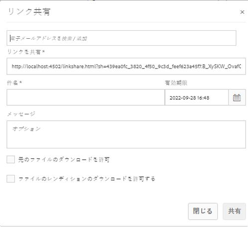

# リンクとしてのアセットの共有 {#asset-link-sharing}

| バージョン | 記事リンク |
| -------- | ---------------------------- |
| AEM as a Cloud Service | [ここをクリックしてください](https://experienceleague.adobe.com/docs/experience-manager-cloud-service/content/assets/manage/share-assets.html?lang=en) |
| AEM 6.5 | この記事 |
| AEM 6.4 | [ここをクリックしてください](https://experienceleague.adobe.com/docs/experience-manager-64/assets/administer/link-sharing.html?lang=en) |

[!DNL Adobe Experience Manager Assets] では、アセット、フォルダー、コレクションを組織内や外部（パートナーやベンダーなど）のメンバーと共有できます。リンクによるアセットの共有は、外部の関係者が [!DNL Assets] にログインせずにリソースを利用できる便利な方法です。

>[!PREREQUISITES]
>
>* リンクとして共有するフォルダーやアセットに対する `Edit ACL` 権限が必要です。
>* ユーザーに電子メールを送信するには、[Day CQ Mail Service](#configmailservice) で SMTP サーバーの詳細を設定します。 

## アセットの共有 {#share-assets}

ユーザーと共有するアセットの URL を生成するには、[!UICONTROL リンク共有]ダイアログを使用します。

* 共有リンクを表示できるのは、`/var/dam/share` の場所への管理者特権または読み取り権限を持つユーザーです。
* `/var/dam/jobs/download` の場所で読み取り権限を持つユーザーは、共有リンクからアセットをダウンロードできます。

1. [!DNL Assets] のユーザーインターフェイスで、リンクとして共有するアセットを選択します。

1. ツールバーの「**[!UICONTROL リンクを共有]**」をクリックします。**[!UICONTROL 共有]**&#x200B;をクリックした後に作成されるリンク は、事前に[!UICONTROL リンクを共有]フィールドで表示されます。リンクは、「**[!UICONTROL 送信]**」を選択するまで作成されません。

   

   *図：アセットをリンクとして共有するためのダイアログ。*

1. **[!UICONTROL リンク共有]**&#x200B;ダイアログの電子メールアドレスボックスに、リンクを共有するユーザーの電子メール ID を入力します。1 人または複数のユーザーを追加できます。

   >[!NOTE]
   >
   >組織内のメンバーではないユーザーの電子メール ID を入力した場合、ユーザーの電子メール ID に「[!UICONTROL External User]」というプレフィックスが付きます。

1. 「**[!UICONTROL 件名]**」ボックスに、共有するアセットの件名を入力します。

1. 「**[!UICONTROL メッセージ]**」ボックスに、オプションでメッセージを入力します。

1. 「**[!UICONTROL 有効期限]**」フィールドに、日付ピッカーを使用してリンクの有効期限の日付と時間を指定します。リンクのデフォルトの有効期間は 1 日です。

   

1. ユーザーが元のアセットをダウンロードできるようにするには、「**[!UICONTROL 元のファイルのダウンロードを許可]**」を選択します。ユーザーが共有アセットのレンディションのみをダウンロードできるようにするには、「**[!UICONTROL ファイルのレンディションのダウンロードを許可]**」を選択します。

1. 「**[!UICONTROL 共有]**」をクリックします。電子メールでリンクをユーザーと共有することを確認するメッセージが表示されます。

1. 共有アセットを表示するには、ユーザーが受け取った電子メールのリンクをクリックまたはタップします。アセットのプレビューを生成するには、共有アセットをクリックまたはタップします。プレビューを閉じるには、「**[!UICONTROL 戻る]**」をクリックします。フォルダーを共有したら、「**[!UICONTROL 親フォルダー]**」をクリックして親フォルダーに戻ります。

   

   >[!NOTE]
   >
   >[!DNL Experience Manager] は、[サポートされているファイルタイプ](/help/assets/assets-formats.md)のアセットのプレビューの生成のみをサポートしています。他の MIME タイプを共有した場合は、アセットのダウンロードのみ可能で、プレビューはできません。

1. 共有アセットをダウンロードするには、ツールバーの「**[!UICONTROL 選択]**」を選択し、アセットをクリックした後、ツールバーの「**[!UICONTROL ダウンロード]**」をクリックします。

   

1. リンクとして共有したアセットを表示するには、 [!DNL Assets] ユーザーインターフェイスで [!DNL Experience Manager] ロゴに移動します。 「**[!UICONTROL ナビゲーション]**」を選択します。ナビゲーションウィンドウで、「**[!UICONTROL 共有リンク]**」を選択して共有アセットのリストを表示します。

1. アセットの共有を解除するには、対象のアセットを選択し、ツールバーの「**[!UICONTROL 共有しない]**」をクリックします。確認メッセージが表示されます。 また、このアセットの項目がリストから削除されます。

## Day CQ Mail Service の設定 {#configure-day-cq-mail-service}

1. [!DNL Experience Manager] ホームページで、**[!UICONTROL ツール]**／**[!UICONTROL 操作]**／**[!UICONTROL Web コンソール]**&#x200B;に移動します。 
1. サービスのリストから、**[!UICONTROL Day CQ Mail Service]** を探します。
1. サービスの横の「**[!UICONTROL 編集]**」をクリックして、**[!UICONTROL Day CQ Mail Service]** のパラメーターと名前に対して言及される詳細を次のように設定します。

   * SMTP server host name：電子メールサーバーのホスト名
   * SMTP server port：電子メールサーバーのポート
   * SMTP user：メールサーバーのユーザー名
   * SMTP パスワード：電子メールサーバーのパスワード

   

1. **[!UICONTROL 保存]**&#x200B;をクリックします。

## 最大データサイズの設定 {#configure-maximum-data-size}

リンク共有機能を使用して共有されているリンクからアセットをダウンロードすると、[!DNL Experience Manager] は、リポジトリのアセットの階層を圧縮して、ZIP ファイルにしてアセットを返します。ただし、ZIP ファイルとして圧縮できるデータ量に制限がないと、膨大なデータが圧縮の対象となり、JVM のメモリ不足エラーの原因となります。この状況による潜在的な DoS 攻撃からシステムを保護するには、Configuration Manager で **[!UICONTROL Day CQ DAM Adhoc Asset Share Proxy Servlet]** の **[!UICONTROL Max Content Size (uncompressed)]** パラメーターを使用して、最大サイズを設定します。アセットの未圧縮時のサイズが設定値を超えていると、アセットのダウンロード要求は拒否されます。デフォルト値は 100 MB です。

1. [!DNL Experience Manager] のロゴをクリックし、**[!UICONTROL ツール]**／**[!UICONTROL 操作]**／**[!UICONTROL Web コンソール]**&#x200B;に移動します。
1. Web コンソールで、**[!UICONTROL Day CQ DAM Adhoc Asset Share Proxy Servlet]** 設定を見つけます。
1. **[!UICONTROL Day CQ DAM Adhoc Asset Share Proxy Servlet]** 設定を編集モードで開き、**[!UICONTROL Max Content Size (uncompressed)]** パラメーターの値を変更します。

   

1. 変更内容を保存します。

## ベストプラクティスとトラブルシューティング {#best-practices-and-troubleshooting}

* 名前に空白を含むアセットフォルダーまたはコレクションは共有されない場合があります。
* ユーザーが共有アセットをダウンロードできない場合は、[!DNL Experience Manager] 管理者に[ダウンロード制限](#configure-maximum-data-size)を確認してください。
* 共有アセットへのリンクを含む電子メールを送信できない場合、または他のユーザーがお客様からの電子メールを受信できない場合、[!DNL Experience Manager] 管理者に[電子メールサービス](#configure-day-cq-mail-service)が設定されているかどうかを確認してください。
* リンク共有機能を使用してアセットを共有できない場合は、適切な権限を持っていることを確認してください。[アセットの共有](#share-assets)を参照してください。
* 共有アセットが別の場所に移動されると、そのリンクは機能しなくなります。リンクを再作成し、ユーザーと再共有します。

* [!DNL Experience Manager] オーサーデプロイメントのリンクを外部エンティティに共有する場合は、次の URL（リンク共有で使用される URL）を `GET` リクエストのみに対して公開してください。セキュリティ上の理由から、他の URL をブロックします。

   * `http://[aem_server]:[port]/linkshare.html`
   * `http://[aem_server]:[port]/linksharepreview.html`
   * `http://[aem_server]:[port]/linkexpired.html`
   [!DNL Experience Manager] インターフェイスで、**[!UICONTROL ツール]**／**[!UICONTROL 操作]**／**[!UICONTROL Web コンソール]**&#x200B;にアクセスします。Web コンソールで **[!UICONTROL Day CQ Link Externalizer]** 設定を開き、`local`、`author` および `publish` に対して、記載された値を持つ&#x200B;**[!UICONTROL ドメイン]**&#x200B;フィールドで、次のプロパティを変更します。`local` プロパティと `author` プロパティには、それぞれローカルインスタンスとオーサーインスタンスの URL を指定します。1 つの [!DNL Experience Manager] オーサーインスタンスを実行している場合、同じ値を `local` および `author` プロパティに使用します。パブリッシュインスタンスには、[!DNL Experience Manager] パブリッシュインスタンスの URL を指定します。
