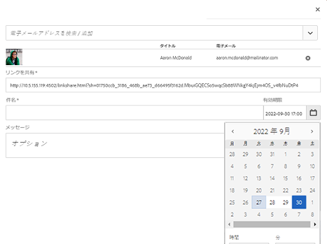
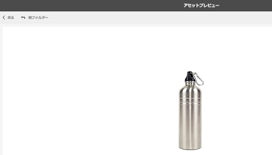
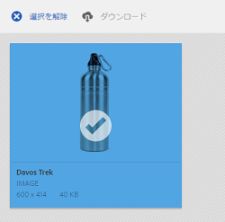

# リンクを使用したアセットの共有 {#asset-link-sharing}

Adobe Experience Managerアセットを使用すると、アセット、フォルダー、コレクションをURLとして組織のメンバーや、パートナーやベンダーなどの外部エンティティと共有できます。 リンクによるアセットの共有は、外部の関係者が Assets にログインすることなくリソースを利用するための便利な方法です。

>[!NOTE]
>
>リンクとして共有するフォルダーまたはアセットのACLを編集権限が必要です。

## アセットの共有 {#sharelink}

ユーザーと共有するアセットの URL を生成するには、リンク共有ダイアログを使用します。`/var/dam/share` の場所への管理者特権または読み取り権限を持つユーザーが、共有されたリンクを表示することができます。

>[!NOTE]
>
>リンクをユーザーと共有する前に、Day CQ Mail Service が設定されていることを確認してください。[Day CQ Mail Service を設定](/help/assets/link-sharing.md#configmailservice)せずにリンクの共有を試行すると、エラーが発生します。

1. Assets のユーザーインターフェイスで、リンクとして共有するアセットを選択します。
1. From the toolbar, click the **[!UICONTROL Share Link]** .

   「**[!UICONTROL リンクを共有]**」フィールドにアセットリンクが自動的に作成されます。このリンクをコピーしてユーザーと共有します。リンクのデフォルトの有効期間は 1 日です。

   

   *図： アセットをリンクとして共有するためのダイアログ。*

   または、この手順の 3～7 に進んで電子メールの受信者を追加し、リンクの有効期限を設定して、ダイアログから送信することもできます。

   >[!NOTE]
   >
   >If you want to share links from your Experience Manager Author instance to external entities, ensure that you only expose the following URLs (which are used for link sharing) for `GET` requests only. 他のURLをブロックして、Experience Manager作成者のセキュリティを確保します。
   >
   >* http://[aem_server]:[port]/linkshare.html
   >* http://[aem_server]:[port]/linksharepreview.html
   >* http://[aem_server]:[port]/linkexpired.html

   >[!NOTE]
   >
   >共有アセットが別の場所に移動されると、そのリンクは機能しなくなります。リンクを再作成し、ユーザーと再共有します。

1. Experience Managerインターフェイスで、 **[!UICONTROL ツール]** / **[!UICONTROL 操作]** / **[!UICONTROL Webコンソールにアクセスします]**。

1. **[!UICONTROL Day CQ Link Externalizerの設定を開き、「]** Domains **[!UICONTROL 」フィールドの次のプロパティを、「]** 、 `local`」、「」、「」に関する値で変更しま `author``publish`す。 For the `local` and `author` properties, provide the URL for the local and the author instance respectively. Both `local` and `author` properties have the same value if you run a single Experience Manager Author instance. For `publish`, provide the URL for the Experience Manager publish instance.

1. **[!UICONTROL リンク共有]**&#x200B;ダイアログの電子メールアドレスボックスに、リンクを共有するユーザーの電子メール ID を入力します。このリンクを複数のユーザーと共有することもできます。

   ユーザーが組織内のメンバーの場合は、入力領域の下のリストに表示される電子メール ID の候補から、ユーザーの電子メール ID を選択します。外部ユーザーの場合は、完全な電子メール ID を入力してリストから選択します。

   ユーザーへの電子メールの送信を有効にするには、[Day CQ Mail Service](#configmailservice) で SMTP サーバーの詳細を設定します。

   

   *図： リンクの共有ダイアログからアセットへのリンクを直接[!UICONTROL 共有します]。*

   >[!NOTE]
   >
   >If you enter an email ID of a user that is not a member of your organization, the words [!UICONTROL External User] are prefixed with the email ID of the user.

1. In the **[!UICONTROL Subject]** field, enter a subject for the asset you want to share.

1. In the **[!UICONTROL Message]** field, enter an optional message.

1. 「**[!UICONTROL 有効期限]**」フィールドに、日付選択を使用してリンクの有効期限の日付と時間を指定します。デフォルトでは、有効期限日はリンクを共有した日から 1 週間後に設定されます。

   

1. ユーザーが元の画像をレンディションと共にダウンロードすることを許可するには、「**[!UICONTROL 元のファイルのダウンロードを許可]**」を選択します。

   >[!NOTE]
   >
   >デフォルトでは、ユーザーはリンクとして共有されているアセットのレンディションのみをダウンロードできます。

1. 「**[!UICONTROL 共有]**」をクリックします。リンクが電子メールによってユーザーと共有されることを確認するメッセージが表示されます。
1. 共有アセットを表示するには、ユーザーに送信する電子メール内のリンクをクリックします。 共有アセットが **[!UICONTROL Adobe Marketing Cloud]** ページに表示されます。

   

   リスト表示に切り替えるには、ツールバーのレイアウトオプションをクリックします。

1. アセットのプレビューを生成するには、共有アセットをクリックします。 To close the preview and return to the **[!UICONTROL Marketing Cloud]** page, click **[!UICONTROL Back]** in the toolbar. If you have shared a folder, click **[!UICONTROL Parent Folder]** to return to the parent folder.

   

   >[!NOTE]
   >
   >Experience Managerでは、次のMIMEタイプのアセットのプレビューの生成がサポートされています。 JPG、PNG、GIF、BMP、INDD、PDF、PPT。 他の MIME タイプのアセットのみをダウンロードできます。

1. To download the shared asset, click **[!UICONTROL Select]** from the toolbar, click the asset, and then click **[!UICONTROL Download]** from the toolbar.

   

1. リンクとして共有したアセットを表示するには、アセットUIに移動し、Experience Managerロゴをクリックします。 リストから「**[!UICONTROL ナビゲーション]**」を選択して、ナビゲーションウィンドウを表示します。
1. ナビゲーションウィンドウで、「**[!UICONTROL 共有リンク]**」を選択して共有アセットのリストを表示します。
1. To un-share an asset, select it and click **[!UICONTROL Unshare]** from the toolbar. 確認メッセージが次に表示されます。 アセットのエントリがリストから削除されます。

## Day CQ 電子メールサービスの設定 {#configmailservice}

1. Experience Managerホームページで、 **[!UICONTROL ツール]** / **[!UICONTROL 操作]** / **[!UICONTROL Webコンソールに移動します]**。
1. サービスのリストから、**[!UICONTROL Day CQ Mail Service]** を探します。
1. Click **[!UICONTROL Edit]** beside the service, and configure the following parameters for **[!UICONTROL Day CQ Mail Service]** with the details mentioned against their names:

   * SMTP server host name：電子メールサーバーのホスト名
   * SMTP server port：電子メールサーバーのポート
   * SMTP user：メールサーバーのユーザー名
   * SMTP password：電子メールサーバーのパスワード

   

1. 「**[!UICONTROL 保存]**」をクリックします。

## 最大データサイズの設定 {#maxdatasize}

リンク共有機能を使用して共有されたリンクからアセットをダウンロードすると、Experience Managerはリポジトリからアセット階層を圧縮し、ZIPファイルに戻します。 ただし、ZIP ファイルとして圧縮できるデータ量に制限がないと、膨大なデータが圧縮の対象となり、JVM のメモリ不足エラーの原因となります。この状況による潜在的な DoS 攻撃からシステムを保護するには、Configuration Manager で Day CQ DAM Adhoc Asset Share Proxy Servlet の「**[!UICONTROL Max Content Size (uncompressed)]**」パラメーターを使用して、最大サイズを設定します。アセットの未圧縮時のサイズが設定値を超えていると、アセットのダウンロード要求は拒否されます。デフォルト値は 100 MB です。

1. Click the Experience Manager logo and then go to **[!UICONTROL Tools]** > **[!UICONTROL Operations]** > **[!UICONTROL Web Console]**.
1. From the Web Console, locate the **[!UICONTROL Day CQ DAM Adhoc Asset Share Proxy Servlet]** configuration.
1. 「**[!UICONTROL Day CQ DAM Adhoc Asset Share Proxy Servlet]**」設定を編集モードで開き、「**[!UICONTROL Max Content Size (uncompressed)]**」パラメーターの値を変更します。

   

1. 変更内容を保存します。

## ベストプラクティスとトラブルシューティング {#bestpractices}

* 名前に空白を含むアセットフォルダーまたはコレクションは共有されない場合があります。
* If users cannot download the shared assets, check with your Experience Manager administrator what the [download limits](#maxdatasize) are.
* If you cannot send email with links to shared assets or if the other users cannot receive your email, check with your Experience Manager administrator if the [email service](#configmailservice) is configured or not.
* リンク共有機能を使用してアセットを共有できない場合は、適切な権限を持っていることを確認してください。[アセットの共有](#sharelink)を参照してください。
