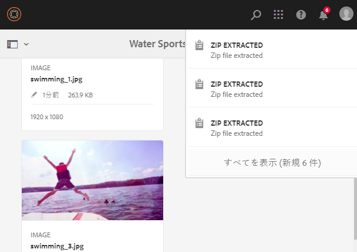
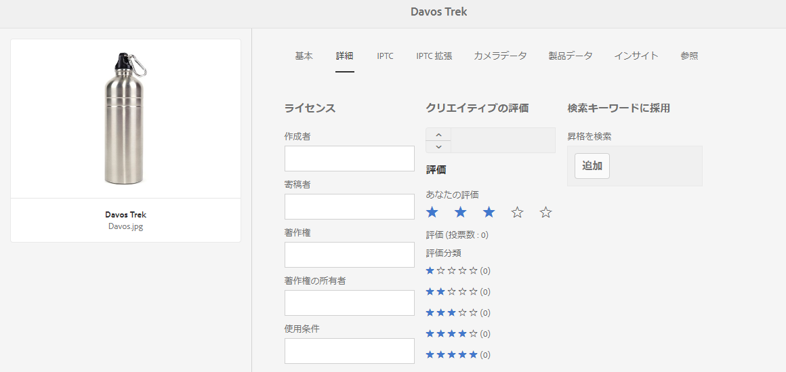
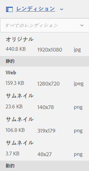
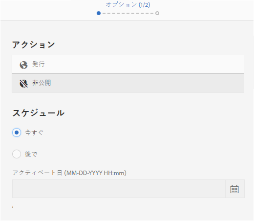
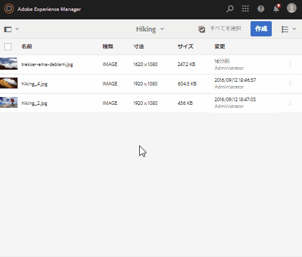
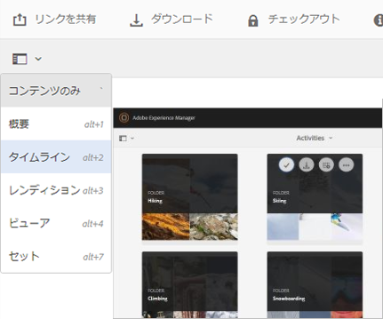

# デジタルアセットの管理 {#manage-digital-assets}

In [!DNL Adobe Experience Manager Assets]を使用すると、アセットの保存や管理以外の操作を実行できます。 [!DNL Experience Manager] は、エンタープライズグレードのアセット管理機能を提供します。 アセットの編集と共有、詳細検索の実行、サポートされている多数のファイル形式の複数のレンディションの作成が可能です。 また、バージョンやデジタル著作権の管理、アセットの処理の自動化、メタデータの管理と管理、注釈を使用した共同作業などをおこなうこともできます。

この記事では、作成やアップロードなど、基本的なアセット管理タスクについて説明します。メタデータの更新；コピー、移動、削除；アセットの公開、非公開、検索。 ユーザーインターフェイスについては、 [assets ユーザーインターフェイスの概要](/help/sites-authoring/basic-handling.md). コンテンツフラグメントを管理するには、 [コンテンツフラグメントを管理](/help/assets/content-fragments/content-fragments-managing.md) アセット。

## フォルダーの作成 {#creating-folders}

`Nature` に関するすべての画像などの、アセットのコレクションを構成する場合に、それらを保存するフォルダーを作成できます。フォルダーを使用すると、アセットを分類および整理できます。ただし、[!DNL Experience Manager Assets] では、効率向上のために必ずアセットをフォルダーで整理しなければならないということではありません。

>[!NOTE]
>
>* の共有 [!DNL Assets] タイプのフォルダー `sling:OrderedFolder` は、Experience Cloudとの共有時はサポートされません。 フォルダーを共有する場合は、フォルダーを作成するときに [!UICONTROL Ordered] を選択しないでください。
>* [!DNL Experience Manager] では、`subassets` をフォルダーの名前として使用することはできません。これは、複合アセットのサブアセットを含むノード用に予約されているキーワードです。


1. フォルダーを作成するデジタルアセットフォルダーの場所に移動します。メニューで、「**[!UICONTROL 作成]**」をクリックします。「**[!UICONTROL 新規フォルダー]**」を選択します。
1. 「**[!UICONTROL タイトル]**」フィールドにフォルダー名を入力します。デフォルトでは、フォルダー名として指定したタイトルが使用されます。フォルダーが作成されると、デフォルトのフォルダー名を上書きして、別のフォルダー名を指定できます。
1. 「**[!UICONTROL 作成]**」をクリックします。作成したフォルダーがデジタルアセットフォルダーに表示されます。

以下の文字（スペース区切りリスト）はサポートされません。

* アセットファイル名に次の文字を含めることはできません。`* / : [ \\ ] | # % { } ? &`
* アセットフォルダー名に次の文字を含めることはできません。`* / : [ \\ ] | # % { } ? \" . ^ ; + & \t`

アセットファイル名の拡張子に特殊文字を含めないでください。

## アセットのアップロード {#uploading-assets}

<!-- TBD the following:
Move this section into a new article. CQDOC-14874 ticket is created for this.
In this complete article, replace emphasis with UICONTROL where appropriate.
-->

様々な種類のアセット ( 画像、PDFファイル、RAW ファイルなど ) を、ローカルフォルダーまたはネットワークドライブからにアップロードできます。 [!DNL Experience Manager Assets].

>[!NOTE]
>
>Dynamic Media - Scene7モードでは、デフォルトのアセットアップロードファイルサイズは 2 GB 以下です。 2 GB を超えるアセットのアップロード（最大 15 GB まで）を設定するには、 [（オプション）2 GB を超えるアセットのアップロードに対するDynamic Media - Scene7モードの設定](/help/assets/config-dms7.md#optional-config-dms7-assets-larger-than-2gb).

アセットは、処理プロファイルが割り当てられたまたは割り当てられていないフォルダーにアップロードできます。

処理プロファイルが割り当てられているフォルダーの場合、プロファイル名がカード表示のサムネールに表示されます。リスト表示では、プロファイル名が「**処理プロファイル**」に表示されます。詳しくは、[処理プロファイル](/help/assets/processing-profiles.md)を参照してください。

アセットをアップロードする前に、アセットが [形式](/help/assets/assets-formats.md) その [!DNL Experience Manager Assets] サポート。

1. [!DNL Assets] ユーザーインターフェイスで、デジタルアセットを追加する場所に移動します。
1. アセットをアップロードするには、以下のいずれかの操作を行います。

   * ツールバーで、 **[!UICONTROL 作成]**. 次に、メニューで、 **[!UICONTROL ファイル]**. 表示されたダイアログで、必要に応じてファイル名を変更できます。
   * HTML5 をサポートするブラウザーで、アセットを [!DNL Assets] ユーザーインターフェイスに直接ドラッグします。ファイル名を変更するためのダイアログは表示されません。

   

   複数のファイルを選択する場合は、 `Ctrl` または `Command` キーを押し、ファイル選択ダイアログでアセットを選択します。 iPad を使用している場合、一度に選択できるファイルは 1 つだけです。

   サイズの大きなアセット（500 MB 超）のアップロードを一時停止して、同じページから後で再開できます。クリック **[!UICONTROL 一時停止]** をクリックします。

   

サイズが大きいと見なされるアセットのサイズは変更できます。例えば、（500 MB でなく）1000 MB を超えるサイズのアセットをサイズが大きいと見なすようにシステムを設定できます。この場合、 **[!UICONTROL 一時停止]** は、サイズが 1000 MB を超えるアセットがアップロードされたときに、プログレスバーに表示されます。

この [!UICONTROL 一時停止] 1,000 MB を超えるファイルが 1,000 MB 未満のファイルでアップロードされた場合、オプションは表示されません。 ただし、1000 MB 未満のファイルのアップロードをキャンセルした場合、 **[!UICONTROL 一時停止]** オプションが表示されます。

サイズ制限を変更するには、 `chunkUploadMinFileSize` プロパティ `fileupload` CRX リポジトリのノード。

クリック時 **[!UICONTROL 一時停止]**、 **[!UICONTROL 再生]** オプション。 アップロードを再開するには、 **[!UICONTROL 再生]**.

進行中のアップロードをキャンセルするには、進行状況バーの横にある閉じるボタン（「`X`」）をクリックします。アップロード処理をキャンセルすると、[!DNL Assets] はアセットのアップロード済みの部分を削除します。

アップロードを再開する機能は、帯域幅が狭く、ネットワークの誤作動によりサイズの大きなアセットのアップロードに時間がかかるシナリオで特に便利です。アップロード処理を一時停止して、後で状況が改善したときに処理を再開できます。再開すると、処理を一時停止した箇所からアップロードが開始されます。

アップロード処理中に、 [!DNL Experience Manager] アップロードするアセットの一部をデータのチャンクとして CRX リポジトリに保存します。 アップロードが完了したら、 [!DNL Experience Manager] これらのチャンクをリポジトリ内の単一のデータブロックに統合します。

未完了のチャンクアップロードジョブのクリーンアップタスクを設定するには、次に移動します。 `https://[aem_server]:[port]/system/console/configMgr/org.apache.sling.servlets.post.impl.helper.ChunkCleanUpTask`.

>[!CAUTION]
>
>チャンクのアップロードは、デフォルト値が 500 MB で、チャンクサイズが 50 MB の場合にトリガーされます。 次を編集する場合、 [Apache Jackrabbit Oak TokenConfiguration](https://experienceleague.adobe.com/docs/experience-cloud-kcs/kbarticles/KA-16464.html) そして、 `timeout configuration` アセットのアップロードに要する時間を短くするには、アセットのアップロード中にセッションタイムアウトの状況が発生します。 したがって、 `chunkUploadMinFileSize` および `chunksize` 各チャンクリクエストがセッションを更新するようにします。
>
>credential-expiry-timeout、待ち時間、帯域幅、予想される同時アップロードでは、次の項目が確実に選択されるようにする最大値が指定されます。
>
>* サイズが大きいファイルに対してチャンクアップロードを有効にすると、アップロード中に資格情報の有効期限が切れる可能性が高くなります。
>
>* 証明書の有効期限が切れる前に各チャンクが確実に完了するようにするため。


アセットをアップロードする場所で既に使用可能なアセットと同じ名前のアセットをアップロードすると、警告ダイアログが表示されます。

既存のアセットを置き換えるか、別のバージョンを作成するか、アップロードする新しいアセットの名前を変更して両方のアセットを残すかを選択できます。既存のアセットを置き換えると、アセットのメタデータと、既存のアセットに対して以前に行った変更（注釈や切り抜きなど）は削除されます。 両方のアセットを保持することを選択した場合、新しいアセットの名前は数字で変更されます `1` 名前に追加されます。


>[!NOTE]
>
>[!UICONTROL 名前の競合]ダイアログで「**[!UICONTROL 置換]**」を選択すると、新しいアセットのアセット ID が再生成されます。この ID は以前のアセットの ID とは異なります。
>
>アセットインサイトによる [!DNL Adobe Analytics] でのインプレッション数やクリック数の追跡が有効になっている場合は、再生成されたアセット ID により、[!DNL Analytics] から取得したアセットのデータが無効になります。

アップロードしたアセットがに存在する場合 [!DNL Assets]、 **[!UICONTROL 検出された重複]** ダイアログで、重複するアセットをアップロードしようとしていることが警告されます。 ダイアログは、 `SHA 1` 既存のアセットのバイナリのチェックサム値が、アップロードするアセットのチェックサム値と一致します。 この場合、アセットの名前は関係ありません。

>[!NOTE]
>
>この [!UICONTROL 検出された重複] ダイアログは、重複検出機能が有効な場合にのみ表示されます。 重複の検出機能を有効にするには、 [重複項目の検出を有効にする](/help/assets/duplicate-detection.md).


[!DNL Assets] で重複アセットを保持するには、「**[!UICONTROL 保持]**」をクリックします。アップロードした重複アセットを削除するには、「**[!UICONTROL 削除]**」をクリックします。

[!DNL Experience Manager Assets] では、ファイル名に禁止文字が含まれるアセットをアップロードできません。ファイル名に禁止文字が含まれるアセットをアップロードしようとすると、[!DNL Assets] に警告メッセージが表示され、これらの文字を削除するか使用可能な名前でアップロードするまでアップロードが停止されます。

組織固有のファイル命名規則に合うように、[!UICONTROL アセットをアップロード]ダイアログでは、アップロードするファイルに長い名前を指定できます。

ただし、以下の文字（スペース区切りリスト）はサポートされていません。

* アセットファイル名に含めてはいけない文字：`* / : [ \\ ] | # % { } ? &`
* アセットフォルダー名に含めてはいけない文字：`* / : [ \\ ] | # % { } ? \" . ^ ; + & \t`

アセットファイル名の拡張子に特殊文字を含めないでください。


さらに、[!DNL Assets] ユーザーインターフェイスには、アップロードした最新のアセットまたは最初に作成したフォルダーが表示されます。

ファイルがアップロードされる前にアップロード操作をキャンセルすると、[!DNL Assets] が現在のファイルのアップロードを停止し、コンテンツを更新します。ただし、既にアップロードされているファイルは削除されません。

[!DNL Assets] のアップロード進行状況ダイアログには、アップロードが成功したファイルと失敗したファイルの数が表示されます。

### 順次アップロード {#serialuploads}

多数のアセットを一括でアップロードすると、大量の I/O リソースが消費され、のパフォーマンスに悪影響を与える可能性があります [!DNL Assets] デプロイメント。 特に、低速なインターネット接続の場合、ディスク I/O の急増により、アップロードにかかる時間が大幅に増加します。さらに、Web ブラウザーでは、POSTリクエスト数に追加の制限が課される場合があります [!DNL Assets] は、同時にアセットのアップロードを処理できます。 その結果、アップロード操作に失敗したり、途中で終了したりすることがあります。 つまり、 [!DNL Experience Manager Assets] 多数のファイルを取り込む際に、一部のファイルが見つからない場合や、ファイルを取り込めない場合があります。

この状況を乗り越えるには [!DNL Assets] は、すべてのアセットを同時に取り込むのではなく、一括アップロード操作中に 1 つのアセットを一度に取り込み（シリアルアップロード）します。

アセットの順次アップロードは、デフォルトで有効になっています。この機能を無効にし、同時アップロードを許可するには、 `fileupload` ノードを作成し、 `parallelUploads` プロパティを `true`.

### FTP を使用したアセットのアップロード {#uploading-assets-using-ftp}

Dynamic Media では、FTP サーバー経由でアセットをバッチアップロードできます。大きなアセット（1 GB を超える）をアップロードする場合や、フォルダーとサブフォルダー全体をアップロードする場合は、FTP を使用する必要があります。 FTP アップロードを定期的にスケジュール設定することもできます。

>[!NOTE]
>
>Dynamic Media - Scene7モードでは、デフォルトのアセットアップロードファイルサイズは 2 GB 以下です。 2 GB を超えるアセットのアップロード（最大 15 GB まで）を設定するには、 [（オプション）2 GB を超えるアセットのアップロードに対するDynamic Media - Scene7モードの設定](/help/assets/config-dms7.md#optional-config-dms7-assets-larger-than-2gb).

>[!NOTE]
>
>FTP を使用してDynamic Media - Scene7モードでアセットをアップロードするには、 [!DNL Experience Manager] オーサーインスタンス。 連絡先 [Adobeカスタマーサポート](https://experienceleague.adobe.com/?support-solution=General&amp;lang=ja#support) をクリックして FP-18912にアクセスし、FTP アカウントの設定を完了します。 詳しくは、 [一括アセット移行用の機能パック18912をインストールする](/help/assets/bulk-ingest-migrate.md).
>
>アセットのアップロードに FTP を使用する場合は、 [!DNL Experience Manager] は無視されます。 代わりに、Dynamic Media Classic で定義したファイル処理ルールが使用されます。

**FTP によりアセットをアップロードするには**

1. 任意の FTP クライアントを使用して、プロビジョニングメールで受け取った FTP ユーザー名とパスワードで FTP サーバーにログインします。FTP クライアントで、ファイルやフォルダーを FTP サーバーにアップロードします。

1. [Dynamic Media Classic デスクトップアプリケーション](https://experienceleague.adobe.com/docs/dynamic-media-classic/using/intro/dynamic-media-classic-desktop-app.html#system-requirements-dmc-app)を開き、アカウントにログインします。

   資格情報とログインは、プロビジョニング時にAdobeから提供されました。 この情報がない場合は、Adobeカスタマーサポートにお問い合わせください。

1. グローバルナビゲーションバーの「**[!UICONTROL アップロード]**」をクリックします。
1. アップロードページの左上隅付近で「**[!UICONTROL FTP 経由]**」タブをクリックします。
1. ページの左側でファイルのアップロード元の FTP フォルダーを選択し、ページの右側でアップロード先のフォルダーを選択します。
1. ページの右下隅付近で「**[!UICONTROL オプション]**」をクリックし、選択したフォルダー内のアセットに基づいて必要なオプションを設定します。

   [アップロードオプションを設定](#upload-job-options)を参照してください。

   >[!NOTE]
   >
   >FTP を使用してアセットをアップロードする場合、Dynamic Media Classic(S7) で設定したアップロードジョブオプションが、 [!DNL Experience Manager].

1. アップロードオプションを設定ダイアログボックスの右下隅で、 **[!UICONTROL 保存]**.
1. アップロードページの右下隅で「**[!UICONTROL アップロードを送信]**」をクリックします。

   アップロードの進行状況を確認するには、グローバルナビゲーションバーの「**[!UICONTROL ジョブ]**」をクリックします。ジョブページに、アップロードの進行状況が表示されます。次の場所で作業を続行できます： [!DNL Experience Manager] をクリックして、いつでもDynamic Media Classicのジョブページに戻り、進行中のジョブを確認できます。
進行中のアップロードジョブをキャンセルするには、 **[!UICONTROL キャンセル]** をクリックします。

#### アップロードオプションを設定 {#upload-job-options}

| アップロードオプション | サブオプション | 説明 |
|---|---|---|
| Job Name |  | テキストフィールドにあらかじめ入力されるデフォルト名。ユーザーが入力した名前部分や日付と時刻のスタンプが含まれます。デフォルト名を使用するか、このアップロードジョブ用に独自に作成した名前を入力することができます。<br>このジョブと他のアップロードジョブや公開ジョブはジョブページに記録されます。ここでジョブのステータスを確認できます。 |
| アップロード後に公開 |  | アップロードしたアセットを自動的に公開します。 |
| 任意のフォルダーでベース名が同じファイルを上書き |  | アップロードするファイルと同じ名前のファイルが既にある場合にアップロードするファイルで置き換えるには、このオプションを選択します。このオプションの名前は、**[!UICONTROL アプリケーション設定]**／**[!UICONTROL 一般設定]**／**[!UICONTROL アプリケーションへのアップロード]**／**[!UICONTROL 画像を上書き]**&#x200B;での設定に応じて異なる可能性があります。 |
| アップロード時に Zip または Tar ファイルを解凍 |  |  |
| オプション |  | クリック **[!UICONTROL ジョブオプション]** そのため、 [!UICONTROL アップロードジョブオプション] ダイアログボックスを開き、アップロードジョブ全体に影響を与えるオプションを選択します。 これらのオプションはすべてのファイルタイプで同じです。<br>アプリケーションの全般設定ページから、ファイルのアップロード用のデフォルトオプションを選択できます。このページを開くには、**[!UICONTROL セットアップ]**／**[!UICONTROL アプリケーション設定]**&#x200B;を選択します。を選択します。 **[!UICONTROL デフォルトのアップロードオプション]** オプションを使用して [!UICONTROL アップロードジョブオプション] ダイアログボックス |
|  | セッションに他のセッション属性     | 「一時」または「定期」を選択します。定期ジョブを設定するには、繰り返しオプション（毎日、毎週、またはカスタム）を選択し、FTP アップロードジョブを反復する頻度を指定します。次に、必要に応じてスケジューリングオプションを指定します。 |
|  | サブフォルダーを含める | アップロードしたいフォルダー内のすべてのサブフォルダーをアップロードします。アップロードするフォルダーとサブフォルダーの名前は、自動的ににに入力されます。 [!DNL Experience Manager Assets]. |
|  | 切り抜きツールオプション | 画像の端から手動で切り抜くには、切り抜きメニューを選択し、「手動」を選択します。次に、画像のいずれかの辺または各辺から切り抜くピクセル数を入力します。画像から切り抜かれる範囲は、画像ファイルの ppi（画素密度）設定に応じて異なります。例えば、画像が 150 ppi で表示されている場合に、「上」、「右」、「下」、「左」テキストボックスに 75 と入力すると、各辺から 0.5 inch ずつ切り抜かれます。<br>画像からホワイトスペースを自動的に切り抜くには、切り抜きメニューを開き、「手動」を選択し、「上」、「右」、「下」、「左」フィールドに画像の各辺から切り抜くピクセル数を入力します。また、切り抜きメニューで「トリミング」を選択し、以下のオプションを選択することもできます。<br> **トリミング対象カラー** <ul><li>**カラー** - 「カラー」オプションを選択します。 次に、隅メニューを選択し、切り抜きたいホワイトスペースの色を最も表現している色の画像の角を選択します。</li><li>****&#x200B;透明度 - 「透明度」オプションを選択します。<br> **許容値**  — スライダーをドラッグして、0 ～ 1 の許容値を指定します。色に基づくトリミングの場合は、0 を指定すると、画像の隅で選択した色と完全に一致するピクセルのみが切り抜かれます。 1 に近いほど、色の違いに対する許容度が高くなります。<br> 透明度に基づくトリミングでは、切り抜くピクセルが透明な場合のみ、0 を指定してください。1 に近いほど、不透明さに対する許容度が高くなります。</li></ul><br>これらの切り抜きオプションは非破壊的です。 |
|  | カラープロファイルオプション | 配信に使用される最適なファイルを作成するときのカラー変換を選択します。<ul><li>デフォルトの色保存：画像にカラースペース情報が含まれる場合はソース画像の色を保持します。カラー変換はおこなわれません。今日ほぼすべての画像に適切なカラープロファイルが埋め込まれています。ただし、CMYK のソース画像にカラープロファイルが埋め込まれていないと、色が standard Red Green Blue（sRGB）カラースペースに変換されます。sRGB は Web ページでの画像表示に最適なカラースペースです。</li><li>オリジナルカラースペースを維持：アップロード時にカラー変換をおこなわずに元の色を保持します。カラープロファイルが埋め込まれていない画像の場合、カラー変換はすべて、公開設定で設定したデフォルトのカラープロファイルを使用しておこなわれます。このカラープロファイルは、このオプションで作成したファイルのカラーと一致しない可能性があります。したがって、「デフォルトの色保存」オプションを使用することをお勧めします。</li><li>カスタム アップロード元／アップロード先<br> アップロード元とアップロード先のカラースペースを選択できるメニューが開きます。この詳細オプションは、ソースファイルに埋め込まれたカラー情報より優先されます。送信するすべての画像のカラープロファイルデータが正しくないか不足している場合に、このオプションを選択します。</li></ul> |
|  | 画像編集オプション | 画像のクリッピングマスクを保持し、カラープロファイルを選択できます。<br> 詳しくは、 [アップロード時の画像編集のオプションを設定します](#setting-image-editing-options-at-upload). |
|  | Postscript オプション | PostScript® ファイルのラスタライズ、ファイルの切り抜き、透明背景の維持、解像度の選択、カラースペースの選択をおこなうことができます。<br>[PostScript および Illustrator のアップロードオプションの設定](#setting-postscript-and-illustrator-upload-options)を参照してください。 |
|  | Photoshop オプション | Adobe® Photoshop® ファイルからのテンプレート作成、レイヤーの維持、レイヤーの命名方法の指定、テキストの抽出、テンプレートへの画像のアンカー方法の指定をおこなうことができます。<br> テンプレートは、 [!DNL Experience Manager].<br>[Photoshop アップロードオプションの設定](#setting-photoshop-upload-options)を参照してください。 |
|  | PDF オプション | ファイルのラスタライズ、検索単語とリンクの抽出、eCatalog の自動生成、解像度の設定、カラースペースの選択をおこなうことができます。<br>eCatalog はでサポートされていません [!DNL Experience Manager]. <br>[PDF アップロードオプションの設定](#setting-pdf-upload-options)を参照してください。 |
|  | Illustrator オプション | Adobe Illustrator® ファイルのラスタライズ、透明背景の維持、解像度の選択、カラースペースの選択をおこなうことができます。<br>[PostScript および Illustrator のアップロードオプションの設定](#setting-postscript-and-illustrator-upload-options)を参照してください。 |
|  | EVideo オプション | ビデオプリセットを選択して、ビデオファイルをトランスコードできます。<br>[eVideo アップロードオプションの設定](#setting-evideo-upload-options)を参照してください。 |
|  | バッチセットプリセット | アップロードしたファイルから画像セットまたはスピンセットを作成するには、使用したいプリセットの「アクティブ」列をクリックします。複数のプリセットを選択できます。プリセットは、Dynamic Media Classic のアプリケーション設定／バッチセットプリセットページで作成します。<br>バッチセットプリセットの作成について詳しくは、[画像セットとスピンセットの自動生成用のバッチセットプリセットの設定](config-dms7.md#creating-batch-set-presets-to-auto-generate-image-sets-and-spin-sets)を参照してください。<br>[アップロード時のバッチセットプリセットの設定](#setting-batch-set-presets-at-upload)を参照してください。 |

#### アップロード時の画像編集のオプションの設定 {#setting-image-editing-options-at-upload}

AI、EPS、PSDファイルなどの画像ファイルをアップロードする際に、 [!UICONTROL アップロードジョブオプション] ダイアログボックス：

* 画像の端から切り抜きの空白（上記の表の説明を参照）。
* 画像の側面から手動で切り抜く（上の表の説明を参照してください）。
* カラープロファイルを選択する（上の表でオプションの説明を参照してください）。
* クリッピングパスからマスクを作成する。
* アンシャープマスクオプションで画像にシャープニングを適用する
* ノックアウトの背景

<!--
| Option | Sub-option | Description |
|---|---|---|
| Create Mask From Clipping Path | | Create a mask for the image based on its clipping path information. This option applies to images created with image-editing applications in which a clipping path was created. |
| Unsharp Masking | | Lets you fine-tune a sharpening filter effect on the final downsampled image, controlling the intensity of the effect, the radius of the effect (as measured in pixels), and a threshold of contrast that is ignored.<br> This effect uses the same options as Photoshop’s Unsharp Mask filter. Contrary to what the name suggests, Unsharp Mask is a sharpening filter. Under Unsharp Masking, set the options you want. Setting options are described in the following: |
| | Amount | Controls the amount of contrast that is applied to edge pixels.<br> Think of it as the intensity of the effect. The main difference between the amount values of Unsharp Mask in Dynamic Media and the amount values in Adobe Photoshop, is that Photoshop has an amount range of 1% to 500%. Whereas, in Dynamic Media, the value range is 0.0 to 5.0. A value of 5.0 is the rough equivalent of 500% in Photoshop; a value of 0.9 is the equivalent of 90%, and so on. |
| | Radius | Controls the radius of the effect. The value range is 0-250.<br> The effect is run on all pixels in an image and radiates out from all pixels in all directions. The radius is measured in pixels. For example, to get a similar sharpening effect for a 2000 x 2000 pixel image and 500 x 500 pixel image, you would set a radius of two pixels on the 2000 x 2000 pixel image and a radius value of one pixel on the 500 x 500 pixel image. A larger value is used for an image that has more pixels. |
| | Threshold | Threshold is a range of contrast that is ignored when the Unsharp Mask filter is applied. It is important so that no "noise" is introduced to an image when this filter is used. The value range is 0-255, which is the number of brightness steps in a grayscale image. 0=black, 128=50% gray and 255=white.<br> For example, a threshold value of 12 ignores slight variations is skin tone brightness to avoid adding noise, but still add edge contrast to areas such as where eyelashes meet skin.<br> For example, if you have a photo of someone’s face, the Unsharp Mask affects the parts of the image, such as where eyelashes and skin meet to create an obvious area of contrast, and the smooth skin itself. Even the smoothest skin exhibits subtle changes in brightness values. If you do not use a threshold value, the filter accentuates these subtle changes in skin pixels. In turn, a noisy and undesirable effect is created while contrast on the eyelashes is increased, enhancing sharpness.<br> To avoid this issue, a threshold value is introduced that tells the filter to ignore pixels that do not change contrast dramatically, like smooth skin.<br> In the zipper graphic shown earlier, notice the texture next to the zippers. Image noise is exhibited because the threshold values were too low to suppress the noise. |
| | Monochrome | Select to unsharp-mask image brightness (intensity).<br> Deselect to unsharp-mask each color component separately. |
| Knockout Background | | Automatically removes the background of an image when you upload it. This technique is useful to draw attention to a particular object and make it stand out from a busy background. Select to enable or “turn on” the Knockout Background feature and the following sub-options: |
| | Corner | Required.<br> The corner of the image that is used to define the background color to knockout.<br> You can choose from **Upper Left**, **Bottom Left**, **Upper Right**, or **Bottom Right**. |
| | Fill Method | Required.<br> Controls pixel transparency from the Corner location that you set.<br> You can choose from the following fill methods: <ul><li>**Flood Fill** - turns all pixels transparent that match the Corner that you have specified and are connected to it.</li><li>**Match Pixel** - turns all matching pixels transparent, regardless of their location on the image.</li></ul> |
| | Tolerance | Optional.<br> Controls the allowable amount of variation in pixel color matching based on the Corner location that you set.<br> Use a value of 0.0 to match pixel colors exactly or, use a value of 1.0 to allow for the greatest variation. |
-->

#### PostScript およびIllustratorのアップロードオプションの設定 {#setting-postscript-and-illustrator-upload-options}

PostScript（EPS）または Illustrator（AI）画像ファイルのアップロード時に、様々な方法でファイルをフォーマットできます。ファイルのラスタライズ、透明背景の維持、解像度の選択、カラースペースの選択ができます。PostScript ファイルとIllustratorファイルのフォーマットに関するオプションは、 [!UICONTROL アップロードジョブオプション] 下のダイアログボックス [!UICONTROL PostScript オプション] および [!UICONTROL Illustrator Options].

| オプション | サブオプション | 説明 |
|---|---|---|
| 処理 |  | **[!UICONTROL ラスタライズ]**&#x200B;を選択して、ファイル内のベクターグラフィックスをビットマップ形式に変換します。 |
| レンダリングされた画像で透明な背景を保持する |  | ファイルの背景の透明度を維持します。 |
| 解像度 |  | 解像度設定を決定します。この設定により、ファイル内の 1 inch あたりに表示するピクセル数を決定します。 |
| カラースペース |  | 「カラースペース」メニューを選択し、次のカラースペースオプションから選択します。 |
|  | 自動検出 | ファイルのカラースペースを保持します。 |
|  | RGB として強制 | RGB カラースペースに変換します。 |
|  | CMYK としてレンダリング | CMYK カラースペースに変換します。 |
|  | グレースケールとして強制 | グレースケールカラースペースに変換します。 |

#### Photoshopアップロードオプションの設定 {#setting-photoshop-upload-options}

Photoshopドキュメント (PSD) ファイルは、画像テンプレートの作成に最も多く使用されます。 PSDファイルをアップロードする際に、ファイルから自動的に画像テンプレートを作成できます ( [!UICONTROL テンプレートを作成] オプションを使用して )。

レイヤーの含まれる PSD ファイルをテンプレートの作成に使用すると、Dynamic Media はこのファイルから複数の画像を作成します。1 レイヤーにつき 1 画像作成されます。

以下を使用： [!UICONTROL 切り抜きオプション] および [!UICONTROL カラープロファイルオプション](Photoshopのアップロードオプションを使用 )。

>[!NOTE]
>
>テンプレートは、 [!DNL Experience Manager].

| オプション | サブオプション | 説明 |
|---|---|---|
| レイヤーを維持 |  | PSD にレイヤーがあれば切り離して個別のアセットにします。アセットレイヤーは PSD に関連付けられたまま維持されます。詳細ビューで PSD ファイルを開き、レイヤーパネルを選択して、これらを確認できます。 |
| テンプレートを作成 |  | PSD ファイル内のレイヤーからテンプレートを作成します。 |
| テキストを抽出 |  | テキストを抽出して、ユーザーがビューア内でテキストを検索できるようにします。 |
| レイヤーを背景サイズに拡大 |  | 切り離した画像レイヤーのサイズを、背景レイヤーのサイズに拡大します。 |
| レイヤーの名前 |  | PSD ファイル内のレイヤーを別々の画像としてアップロードします。 |
|  | レイヤー名 | PSD ファイル内のレイヤー名に従って画像に名前を付けます。例えば、元の PSD ファイルに Price Tag という名前のレイヤーがある場合、Price Tag という名前の画像になります。ただし、PSDファイル内のレイヤー名がデフォルトのPhotoshopレイヤー名（背景、レイヤー 1、レイヤー 2 など）の場合、PSDファイル内のレイヤー番号に基づいてイメージの名前が付けられます。 既定の画層名に従って名前が付けられません。 |
|  | Photoshop とレイヤー番号 | PSD ファイル内のレイヤー番号に従って画像の名前を付け、元のレイヤー名は無視します。Photoshop ファイル名の後にレイヤー番号を付けたものが画像の名前になります。例えば、Spring Ad.psd というファイルの 2 番目のレイヤーは、Photoshop でデフォルト以外の名前が付いていたとしても Spring Ad_2 という名前になります。 |
|  | Photoshop とレイヤー名 | PSD ファイル名の後にレイヤー名またはレイヤー番号を付けた名前になります。PSD ファイル内のレイヤー名がデフォルトの Photoshop レイヤー名である場合、レイヤー番号が使用されます。例えば、SpringAd という名前の PSD ファイルに Price Tag という名前のレイヤーがある場合、Spring Ad_Price Tag という名前になります。レイヤー 2 というデフォルト名のレイヤーは Spring Ad_2 となります。 |
| アンカー |  | PSD ファイルから作成されたレイヤーコンポジションから生成されたテンプレートに画像がどのようにアンカーされるのかを指定します。デフォルトで、アンカーは中央です。中央アンカーにより、置換画像の縦横比に関わらず、置換画像で同じ領域をより適切に埋めることができます。この画像を置換する縦横比が異なる画像が、テンプレートの参照時やパラメーターの置き換えの使用時に、同じ領域を効果的に専有します。アプリケーションでテンプレート内の割り当てられた領域を置換画像で埋める必要がある場合、別の設定に変更してください。 |

#### PDFアップロードオプションの設定 {#setting-pdf-upload-options}

PDF ファイルのアップロード時に、様々な方法でファイルをフォーマットできます。ページの切り抜き、検索単語の抽出、ppi 解像度の入力、カラースペースの選択ができます。PDF ファイルにはトリミング余白、内トンボ、登録マーク、その他のプリンター用マークなどが含まれる場合があります。PDF ファイルのアップロード時に、ページの端からこれらのマークを切り抜くことができます。

>[!NOTE]
>
>eCatalog はでサポートされていません [!DNL Experience Manager].

次のいずれかのオプションを選択します。

| オプション | サブオプション | 説明 |
|---|---|---|
| 処理 | ラスタライズ | （デフォルト）PDF ファイルのページをリッピングし、ベクターグラフィックスをビットマップイメージに変換します。eCatalog を作成する場合は、このオプションを選択します。 |
| 抽出 | 検索ワード | PDF ファイルから単語を抽出し、eCatalog ビューア内でこのファイルをキーワード検索できるようにします。 |
|  | リンク | PDF ファイルからリンクを抽出し、eCatalog ビューアで使用できる画像マップに変換します。 |
| 複数ページの PDFから eCatalog を自動生成 |  | PDF ファイルから eCatalog を自動的に作成します。eCatalog の名前は、アップロードした PDF ファイルと同じになります。（このオプションは、アップロード時に PDF ファイルをラスタライズする場合にのみ使用できます。） |
| 解像度 |  | 解像度設定を決定します。この設定により、PDF ファイル内の 1 inch あたりに表示するピクセル数を決定します。デフォルトは 150 です。 |
| カラースペース |  | 「カラースペース」メニューを選択し、PDF ファイルのカラースペースを選択します。ほとんどの PDF ファイルには、RGB と CMYK の両方のカラー画像が含まれています。RGB カラースペースはオンラインでの表示に適しています。 |
|  | 自動検出 | PDF ファイルのカラースペースを保持します。 |
|  | RGB として強制 | RGB カラースペースに変換します。 |
|  | CMYK として強制 | CMYK カラースペースに変換します。 |
|  | グレースケールとして強制 | グレースケールカラースペースに変換します。 |

#### eVideo アップロードオプションの設定 {#setting-evideo-upload-options}

様々なビデオプリセットから選択してビデオファイルをトランスコードする。

| オプション | サブオプション | 説明 |
|---|---|---|
| アダプティブビデオ |  | モバイル、タブレットおよびデスクトップに配信するビデオを作成するために、あらゆる縦横比で機能する単一のエンコーディングプリセットです。 このプリセットでエンコードされたアップロード済みソースビデオは、固定の高さに設定されます。ただし、幅はビデオの縦横比を保持して自動的に拡大・縮小します。<br>アダプティブビデオエンコーディングを使用することをお勧めします。 |
| 単一のエンコーディングプリセット | エンコーディングプリセットを並べ替え | 選択 **[!UICONTROL 名前]** または **[!UICONTROL サイズ]** 「デスクトップ」、「モバイル」、「タブレット」の下に表示されるエンコーディングプリセットを名前別または解像度サイズ別に並べ替える場合。 |
|  | デスクトップ | デスクトップコンピューターにストリーミングまたはプログレッシブビデオエクスペリエンスを配信するための MP4 ファイルを作成します。 必要な解像度サイズとターゲットデータレートを持つ縦横比を 1 つ以上選択します。 |
|  | モバイル | iPhoneまたは Android™モバイルデバイスで配信用の MP4 ファイルを作成します。 必要な解像度サイズとターゲットデータレートを持つ縦横比を 1 つ以上選択します。 |
|  | タブレットなど）のアクティブマーカーを確認する。 | iPadまたは Android™タブレットデバイスで配信用の MP4 ファイルを作成します。 必要な解像度サイズとターゲットデータレートを持つ縦横比を 1 つ以上選択します。 |

#### アップロード時のバッチセットプリセットの設定 {#setting-batch-set-presets-at-upload}

アップロードした画像から画像セットまたはスピンセットを自動的に作成する場合は、使用するプリセットの「アクティブ」列をクリックします。 複数のプリセットを選択できます。

バッチセットプリセットの作成について詳しくは、[画像セットとスピンセットの自動生成用のバッチセットプリセットの設定](/help/assets/config-dms7.md#creating-batch-set-presets-to-auto-generate-image-sets-and-spin-sets)を参照してください。

### ストリーミングアップロード {#streamed-uploads}

Adobe Experience Managerに多数のアセットをアップロードする場合、サーバーへの I/O 要求が大幅に増加するので、アップロードの効率が低下し、一部のアップロードタスクがタイムアウトする場合があります。 [!DNL Experience Manager Assets] は、アセットのストリーミングアップロードをサポートしています。 ストリーミングアップロードにより、リポジトリにアセットをコピーする前にサーバーの一時フォルダーのアセットストレージを回避することで、アップロード操作中のディスクの I/O が低減します。代わりに、データはリポジトリに直接転送されます。これにより、サイズの大きいアセットのアップロードにかかる時間を抑え、タイムアウトが発生する可能性を減少することができます。ストリーミングアップロードは、でデフォルトで有効になっています。 [!DNL Assets].

>[!NOTE]
>
>ストリーミングアップロードは、servlet-api バージョンが 3.1 未満の JEE サーバー上で実行されているAdobe Experience Managerでは無効です。

### アセットが含まれている ZIP アーカイブの抽出 {#extractzip}

ZIP アーカイブは、サポートされているその他のアセットと同じようにアップロードできます。ファイル名についても、同様のルールが ZIP ファイルに適用されます。[!DNL Experience Manager] を使用すると、ZIP アーカイブを DAM の場所に抽出できます。アーカイブファイルに拡張子として ZIP が含まれていない場合、コンテンツを使用してファイルタイプの検出を有効にします。

一度に 1 つの ZIP アーカイブを選択し、「**[!UICONTROL アーカイブの抽出]**」をクリックして、抽出先フォルダーを選択します。競合を処理するオプションを選択します（存在する場合）。 ZIP ファイル内のアセットが保存先フォルダーに存在する場合は、次のいずれかのオプションを選択できます。抽出をスキップ、既存のファイルを置き換える、名前を変更して両方のアセットを保持する、またはバージョンを作成する。

抽出が完了したら、 [!DNL Experience Manager] は、通知領域に通知します。 While [!DNL Experience Manager] は ZIP を抽出します。抽出を中断することなく、作業に戻ることができます。



この機能には、いくつかの制限があります。

* 抽出先に同じ名前のフォルダーが存在する場合、ZIP ファイル内のアセットは既存のフォルダーに抽出されます。
* 抽出をキャンセルしても、既に抽出されたアセットは削除されません。
* 2 つの ZIP ファイルを同時に選択して抽出することはできません。一度に抽出できる ZIP アーカイブは 1 つだけです。
* ZIP アーカイブをアップロードする際に、アップロードダイアログに 500 サーバーエラーが表示される場合は、インストール後に再試行してください [最新のサービスパック](/help/release-notes/sp-release-notes.md).

## アセットのプレビュー {#previewing-assets}

アセットをプレビューするには、次の手順に従います。

1. 次の [!DNL Assets] ユーザーインターフェイスで、プレビューするアセットの場所に移動します。
1. 目的のアセットをクリックして、開くことができます。

1. プレビューモードでは、[サポートされている画像タイプ](/help/assets/assets-formats.md#supported-raster-image-formats)で（インタラクティブ編集中に）ズームオプションを使用できます。

   アセットにズームインするには、 `+` （またはアセット上の虫眼鏡アイコンをクリックします）。 ズームアウトするには、 `-`. ズームインすると、パンニングによって画像の任意の場所を詳細に確認できます。「ズームをリセット」矢印をクリックすると、元の表示に戻ります。表示を元のサイズに戻すには、 **[!UICONTROL リセット]** .

**キーボードキーのみを使用したアセットのプレビュー**

キーボードを使用してアセットをプレビューするには、次の手順に従います。

1. 次の [!DNL Assets] ユーザーインターフェイスで、 `Tab` 矢印キー

1. 押す `Enter` キーを使用してアセットを開くことができます。 プレビューモードでアセットにズームインできます。

1. アセットにズームインするには：
   1. 用途 `Tab` キーを押して、ズームインオプションにフォーカスを移動します。
   1. 用途 `Enter` キーを使用して画像をズームインします。

   ズームアウトするには、 `Tab` キーを押してズームアウトオプションにフォーカスを置き、 `Enter`.

1. 用途 `Shift` + `Tab` キーを使用して、画像にフォーカスを戻します。

1. 矢印キーを使用して、ズームされた画像の周りを移動します。

>[!MORELIKETHIS]
>
>* [Dynamic Media Assets のプレビュー](/help/assets/previewing-assets.md).
>* [サブアセットの表示](managing-linked-subassets.md#viewing-subassets).


## プロパティとメタデータの編集 {#editing-properties}

1. メタデータを編集するアセットの場所に移動します。

1. アセットを選択し、ツールバーでを選択します。 **[!UICONTROL プロパティ]** アセットのプロパティを表示できます。 または、アセットカードで&#x200B;**[!UICONTROL プロパティ]**&#x200B;クイックアクションを選択します。

   

1. [!UICONTROL プロパティ]ページの様々なタブで、メタデータのプロパティを編集します。例えば、 **[!UICONTROL 基本]** 「 」タブで、タイトルと説明を編集します。

   >[!NOTE]
   >
   >[!UICONTROL プロパティ]ページのレイアウトと編集できるメタデータのプロパティは、基になるメタデータスキーマによって変わります。[!UICONTROL プロパティ]ページのレイアウトを変更する方法については、[メタデータスキーマ](/help/assets/metadata-schemas.md)を参照してください。

1. アセットをアクティベートする特定の日付と時間をスケジュールするには、「**[!UICONTROL オンタイム]**」フィールドの横にある日付選択を使用します。

   

   *図：日付選択を使用して、アセットのアクティベーションをスケジュールします。*

1. 特定の期間の後にアセットのアクティベートを解除するには、「**[!UICONTROL オフタイム]**」フィールドの横にある日付選択を使用して、アクティベートを解除する日付と時間を選択します。アクティベートを解除する日付は、アセットに設定されたアクティベート日より後の日付にしてください。[!UICONTROL オフタイム]の経過後、アセットとそのレンディションは、 Web インターフェイスでも HTTP API でも使用できません。[!DNL Assets]

1. 「**[!UICONTROL タグ]**」フィールドで、タグを 1 つ以上選択します。カスタムタグを追加するには、ボックスにタグの名前を入力し、「 」を選択します。 `Enter`. 新しいタグが [!DNL Experience Manager] に保存されます。[!DNL YouTube] 公開にはタグが必要です。 詳しくは、 [YouTubeへのビデオの公開](video.md#publishing-videos-to-youtube).

   >[!NOTE]
   >
   >タグを作成するには、書き込み権限が必要です ( )。 `/content/cq:tags/default` CRX リポジトリ内に保存されます。

1. アセットに評価を指定するには、 **[!UICONTROL 詳細]** 」タブをクリックし、適切な位置の星をクリックして、目的の評価を割り当てます。

   

   アセットに割り当てた評価スコアは、「**[!UICONTROL あなたの評価]**」の下に表示されます。ユーザーによるアセットの評価の平均スコアは、「**[!UICONTROL 評価]**」の下に表示されます。さらに、平均評価スコアの評価スコアの内訳は、「**[!UICONTROL 評価分類]**」の下に表示されます。平均評価スコアに基づいてアセットを検索できます。

1. アセットの使用状況の統計を表示するには、 **[!UICONTROL インサイト]** タブをクリックします。

   使用状況の統計には、次の情報が含まれています。

   * アセットが表示またはダウンロードされた回数
   * アセットが使用されたチャネルまたはデバイス
   * アセットが最近使用されたクリエイティブソリューション

   詳しくは、 [アセットインサイト](/help/assets/asset-insights.md).

1. 「**[!UICONTROL 保存して閉じる]**」をクリックします。
1. 次に移動： [!DNL Assets] ユーザーインターフェイス。 編集されたメタデータのプロパティ（タイトル、説明、評価など）は、カード表示のアセットカードまたはリスト表示の関連する列に表示されます。

## アセットのコピー {#copying-assets}

アセットやフォルダーをコピーすると、そのアセットやフォルダーがコンテンツ構造と共にコピーされます。コピーされたアセットやフォルダーはコピー先に複製されます。コピー元にあるアセットは変更されません。

アセットの特定のコピーに一意に関連付けられる属性は継承されません。例えば、以下のものが該当します。

* アセット ID、作成日時、バージョン、バージョン履歴。これらのプロパティの一部は、`jcr:uuid`、`jcr:created`、`cq:name` プロパティによって示されます。

* 作成時間と参照パスは、各アセットとその各レンディションに対して一意です。

その他のプロパティとメタデータ情報は保持されます。アセットをコピーするときに、部分的なコピーが作成されることはありません。

1. In [!DNL Assets] インターフェイスで、1 つ以上のアセットを選択し、 **[!UICONTROL コピー]** をクリックします。 または、 **[!UICONTROL コピー]**  アセットカードからのクイックアクション

   >[!NOTE]
   >
   >[!UICONTROL コピー]クイックアクションを使用した場合、一度にコピーできるアセットは 1 つだけです。

1. アセットをコピーする場所に移動します。

   >[!NOTE]
   >
   >同じ場所でアセットをコピーすると、[!DNL Experience Manager] は自動的に名前のバリエーションを生成します。例えば、「`Square`」というタイトルのアセットをコピーすると、[!DNL Experience Manager] は自動的にそのコピーのタイトルを「`Square1`」として生成します。

1. 次をクリック： **[!UICONTROL 貼り付け]**  アセットオプションを使用します。 その後、アセットがこの場所にコピーされます。

   >[!NOTE]
   >
   >この **[!UICONTROL 貼り付け]** オプションは、貼り付け操作が完了するまで、ツールバーで使用できます。

## アセットの移動と名前変更 {#moving-or-renaming-assets}

アセット（またはフォルダー）を別の場所に移動した場合、アセットのコピー中に、そのアセット（またはフォルダー）は複製されません。 アセット（またはフォルダー）はターゲットの場所に配置され、ソースの場所から削除されます。 また、アセットを新しい場所に移動する際に、名前を変更することもできます。
公開済みのアセットを別の場所に移動する場合は、オプションでアセットを再公開できます。 公開済みのアセットに対するデフォルトの移動操作により、自動的に非公開になります。 移動したアセットは、作成者が [!UICONTROL 再公開] 」オプションを使用して設定できます。


アセットまたはフォルダーを移動するには：

1. 移動するアセットの場所に移動します。

1. アセットを選択し、 **[!UICONTROL 移動]** 」オプションを使用します。
   

1. 内 [!UICONTROL アセットを移動] ウィザードで、次のいずれかの操作を行います。

   * 移動後のアセットの名前を指定します。次に、 **[!UICONTROL 次へ]** をクリックして続行します。

   * クリック **[!UICONTROL キャンセル]** をクリックしてプロセスを停止します。
   >[!NOTE]
   >
   >* 新しい場所に同じ名前のアセットがない場合は、同じ名前を指定できます。ただし、アセットの移動先に同じ名前のアセットが既に存在する場合は、別の名前を使用する必要があります。同じ名前を使用すると、その名前のバリエーションが自動的に生成されます。例えば、「Square」という名前のアセットの場合、自動的にそのコピーの名前が「Square1」として生成されます。
   >* 名前の変更時に、ファイル名に空白は使用できません。


1. **[!UICONTROL 宛先を選択]**&#x200B;ダイアログで、次のいずれかの操作をおこないます。

   * アセットの新しい場所に移動し、 **[!UICONTROL 次へ]** をクリックして続行します。

   * クリック **[!UICONTROL 戻る]** に戻る **[!UICONTROL 名前を変更]** 画面

1. 移動されるアセットに参照ページ、アセット、コレクションがある場合は、「**[!UICONTROL 宛先を選択]**」タブの横に「**[!UICONTROL 参照を調整]**」タブが表示されます。

   **[!UICONTROL 参照を調整]**&#x200B;画面で次のいずれかの操作を実行します。

   * 新しい情報に基づいて調整する参照を指定し、 **[!UICONTROL 移動]** をクリックして続行します。

   * 「**[!UICONTROL 調整]**」列で、アセットへの参照を選択／選択解除します。
   * クリック **[!UICONTROL 戻る]** に戻る **[!UICONTROL 宛先を選択]** 画面

   * クリック **[!UICONTROL キャンセル]** 移動操作を停止する。

   参照を更新しなければ、引き続きアセットの以前のパスが示されます。参照を調整すると、更新され、アセットの新しいパスが反映されます。

### ドラッグ操作を使用したアセットの移動 {#move-using-drag}

アセット（またはフォルダー）を [!UICONTROL 移動] 」オプションを使用します。 ただし、この操作はリスト表示でのみ可能です。

アセットをドラッグして移動しても、開かない [!UICONTROL アセットを移動] ウィザードの場合、移動中にアセットの名前を変更するオプションは利用できません。 さらに、既に公開済みのアセットは、ドラッグによって移動すると再公開されます。ユーザーは再公開の承認を求めません。


## レンディションの管理 {#managing-renditions}

1. アセットのレンディション（オリジナルを除く）を追加または削除できます。レンディションを追加または削除するアセットの場所に移動します。

1. アセットをクリックして、ページを開きます。
1. 「Experience Manager」インターフェイスで、 **[!UICONTROL レンディション]** を選択します。
1. **[!UICONTROL レンディション]**&#x200B;パネルで、アセットに生成されたレンディションのリストを表示します。

   

   >[!NOTE]
   >
   >デフォルトでは、[!DNL Assets] はプレビューモードでアセットのオリジナルレンディションを表示しません。管理者の場合、オーバーレイを使用して、プレビューモードでもオリジナルレンディションを表示するように [!DNL Assets] を設定できます。

1. 表示または削除するレンディションを選択します。

   **レンディションの削除**

   レンディションを **[!UICONTROL レンディション]** パネルを開き、 **[!UICONTROL レンディションを削除]**  」オプションを使用します。 アセット処理の完了後は、レンディションを一括削除することはできません。個々のアセットについては、ユーザーインターフェイスからレンディションを手動で削除できます。複数のアセットについては、Experience Managerをカスタマイズして、特定のレンディションを削除したり、アセットを削除して削除したアセットを再度アップロードしたりできます。

   **新しいレンディションをアップロード**

   アセットの詳細ページに移動し、 **[!UICONTROL レンディションを追加]**  オプションを使用して、アセットの新しいレンディションをアップロードできます。

   >[!NOTE]
   >
   >**[!UICONTROL レンディション]**&#x200B;パネルからレンディションを選択する場合、ツールバーのコンテキストが変わり、レンディションに関連するアクションのみが表示されます。オプション ( [!UICONTROL レンディションをアップロード] オプションは表示されません。 これらのオプションをツールバーに表示するには、アセットの詳細ページに移動します。

   画像またはビデオアセットの詳細ページに表示するレンディションのサイズを設定できます。指定した寸法に基づいて、 [!DNL Assets] レンディションを正確なサイズまたは最も近いサイズで表示します。

   アセットの詳細レベルで画像のレンディションのサイズを設定するには、`renditionpicker` ノード（`libs/dam/gui/content/assets/assetpage/jcr:content/body/content/content/items/assetdetail/items/col1/items/assetview/renditionpicker`）をオーバーレイして、幅のプロパティの値を設定します。プロパティを設定します。 **[!UICONTROL サイズ（長い） (KB)]** 画像サイズに基づいてアセットの詳細ページでレンディションをカスタマイズできるように、幅の代わりにを使用。 サイズベースのカスタマイズの場合、`preferOriginal` プロパティを使用すると、一致するレンディションのサイズがオリジナルより大きい場合でも、オリジナルが優先されます。

   同様に、`libs/dam/gui/content/assets/annotate/jcr:content/body/content/content/items/content/renditionpicker` をオーバーレイして注釈ページの画像をカスタマイズできます。

   

   ビデオアセットのレンディションサイズを設定するには、CRX リポジトリー内の `videopicker` ノード（`/libs/dam/gui/content/assets/assetpage/jcr:content/body/content/content/items/assetdetail/items/col1/items/assetview/videopicker`）に移動し、ノードをオーバーレイし、該当するプロパティを編集します。

   >[!NOTE]
   >
   >ビデオの注釈は、HTML5 互換のビデオ形式に対応したブラウザーでのみサポートされます。また、ブラウザーによってサポートされるビデオ形式が異なります。ただし、MXF ビデオ形式は、ビデオの注釈ではまだサポートされていません。

サブアセットの生成と表示について詳しくは、 [サブアセットの管理](managing-linked-subassets.md#generate-subassets).

## アセットの削除 {#deleting-assets}

アセットを削除するには、ユーザーが `dam/asset`. 変更権限のみ付与されている場合、アセットのメタデータの編集とアセットへの注釈の追加のみが可能で、アセットやそのメタデータの削除は実行できません。

他のページからの入力参照を解決または削除するには、アセットを削除する前に、関連する参照を更新します。参照元のアセットの削除と壊れたリンクの放置を禁止するには、オーバーレイを使用して「削除を強制」オプションを無効にします。

アセットまたはアセットを含むフォルダーを削除するには：

1. 削除するアセットまたはフォルダーの場所に移動します。

1. アセットまたはフォルダーを選択し、 **[!UICONTROL 削除]**  をクリックします。

   削除を確定したら、次の手順に従います。

   * アセットに参照がない場合は、アセットが削除されます。

   * アセットに参照がある場合は、「**1 つ以上のアセットが参照されています。**」というエラーメッセージが表示されます。「**[!UICONTROL 削除を強制]**」または「**[!UICONTROL キャンセル]**」を選択できます。
   >[!NOTE]
   >
   >* 他のページからの入力参照を解決または削除するには、アセットを削除する前に、関連する参照を更新します。また、オーバーレイを使用して「削除を強制」オプションを無効にすると、参照元のアセットの削除や壊れたリンクの放置を禁止できます。
   >* チェックアウトされたアセットファイルを含む&#x200B;*フォルダー*&#x200B;を削除できます。フォルダーを削除する前に、ユーザーがチェックアウトしているデジタルアセットがないことを確認します。


>[!NOTE]
>
>上記の方法を使用してユーザーインターフェイスからフォルダーを削除すると、関連するユーザーグループも削除されます。
>
>ただし、既存の冗長なユーザーグループ、未使用のユーザーグループ、自動生成されたユーザーグループは、 `clean` メソッドを使用します (`http://[server]:[port]/system/console/jmx/com.day.cq.dam.core.impl.team%3Atype%3DClean+redundant+groups+for+Assets`) をクリックします。

## アセットのダウンロード {#downloading-assets}

詳しくは、 [Experience Managerからのアセットのダウンロード](/help/assets/download-assets-from-aem.md).

## アセットの公開または非公開 {#publish-assets}

でアセットをアップロード、処理または編集した後 [!DNL Experience Manager] オーサー環境で、アセットをパブリッシュサーバーに公開します。 公開すると、アセットが公開されます。 非公開にすると、アセットが公開サーバーから削除されましたが、オーサリングサーバーからは削除されませんでした。

次に特有の情報： [!DNL Dynamic Media]を参照してください。 [公開 [!DNL Dynamic Media] アセット](/help/assets/publishing-dynamicmedia-assets.md).

1. 公開するアセットまたはアセットフォルダーの場所、またはパブリッシュ環境から削除する（非公開にする）アセットフォルダーに移動します。

1. 非公開にするアセットまたはフォルダーを選択し、 **[!UICONTROL 公開を管理]**  」オプションを使用します。 また、すばやく公開するには、ツールバーの「**[!UICONTROL クイック公開]**」オプションを選択します。公開したいフォルダーに空のフォルダーが含まれる場合、空のフォルダーは公開されません。

1. 必要に応じて「**[!UICONTROL 公開]**」オプションまたは「**[!UICONTROL 非公開]**」オプションを選択します。

   
   *図：公開および非公開のオプションとスケジュールオプション。*

1. すぐにアセットに対処するには「**[!UICONTROL 今すぐ]**」を選択し、アクションをスケジュールするには「**[!UICONTROL 後で]**」を選択します。「**[!UICONTROL 後で]**」オプションを選択した場合は、日時を選択します。「**[!UICONTROL 次へ]**」をクリックします。

1. パブリッシングの際、アセットが他のアセットを参照する場合は、その参照がウィザードに表示されます。非公開になっているか、前回の公開以降に変更された参照のみが表示されます。公開する参照を選択します。

1. 非公開にする際に、アセットが他のアセットを参照する場合は、非公開にする参照を選択します。**[!UICONTROL 非公開]**&#x200B;をクリックします。確認ダイアログで、「**[!UICONTROL キャンセル]**」をクリックしてアクションを停止するか、「**[!UICONTROL 非公開]**」をクリックして、指定した日付にアセットを非公開にすることを確認します。

アセットやフォルダーの公開または非公開に関する以下の制限事項とヒントを理解します。

* 「[!UICONTROL 公開を管理]」のオプションは、レプリケーション権限を持つユーザーアカウントでのみ使用できます。
* 複雑なアセットを非公開にする場合は、アセットだけを非公開にします。参照は他の公開済みアセットから参照されている可能性があるので、非公開にしないでください。
* 空のフォルダーは公開されません。
* 処理中のアセットを公開した場合は、オリジナルのコンテンツのみが公開されます。処理中のレンディションは失われます。処理が完了するのを待ち、処理が完了したらアセットを公開または再公開します。

## 閉じられたユーザーグループ {#closed-user-group}

閉じられたユーザーグループ（CUG）は、[!DNL Experience Manager] から公開された特定のアセットフォルダーへのアクセスを制限するために使用します。フォルダーに対して CUG を作成すると、そのフォルダー（フォルダーのアセットとサブフォルダーを含む）へのアクセスは、割り当てられたメンバーまたはグループのみに制限されます。フォルダーにアクセスするには、セキュリティ資格情報を使用してログインする必要があります。

CUG は、アセットへのアクセスを制限する追加の方法です。また、フォルダーのログインページを設定することもできます。

1. フォルダーを [!DNL Assets] インターフェイスを開き、 [!UICONTROL プロパティ] 」オプションを使用してプロパティページを表示できます。
1. 「**[!UICONTROL 権限]**」タブで、「**[!UICONTROL 閉じられたユーザーグループ]**」の下でメンバーまたはグループを追加します。

   

1. ユーザーがフォルダーにアクセスしたときにログイン画面を表示するには、「**[!UICONTROL 有効にする]**」オプションを選択します。次に、[!DNL Experience Manager] 内のログインページへのパスを選択し、変更を保存します。

   

   >[!NOTE]
   >
   >ログインページへのパスを指定しないと、[!DNL Experience Manager] はパブリッシュインスタンスでデフォルトのログインページを表示します。

1. フォルダーを公開し、パブリッシュインスタンスからアクセスすると、ログイン画面が表示されます。
1. CUG メンバーの場合は、自分のセキュリティ資格情報を入力します。[!DNL Experience Manager] によって認証されると、フォルダーが表示されます。

## アセットの検索 {#assetsearch}

アセットの検索は、デジタルアセット管理システムの主な使用手段です。 この機能は、クリエイティブ、ビジネスユーザーやマーケターによるアセットの堅牢な管理、DAM 管理者による管理のために重要です。

最も適切なアセットを検出して使用するためのシンプル検索、アドバンス検索、カスタム検索については、 [Experience Manager内のアセットの検索](search-assets.md).

## クイックアクション {#quick-actions}

クイックアクションのアイコンは、一度に 1 つのアセットに対してのみ利用できます。デバイスに応じて、次の操作を実行してクイックアクションアイコンを表示します。

* タッチデバイス：タッチ＆ホールド。例えば iPad では、アセットをタップ＆ホールドするとクイックアクションが表示されます。
* 非タッチデバイス：マウスポインターで指す。例えばデスクトップデバイスでは、アセットのサムネールをマウスポインターで指すとクイックアクションバーが表示されます。

### アセットの移動と選択 {#navigating-and-selecting-assets}

次のアイコンを使用して、使用可能な任意の表示（カード、列、およびリスト）でアセットを表示、ナビゲーション、および選択できます： **[!UICONTROL 選択]** オプション。

リスト表示および列表示では、 **[!UICONTROL 選択]** 「 」オプションは、アセットのサムネールにポインターを置くと表示されます。

カード表示では、 **[!UICONTROL 選択]** オプションがクイックアクションとして表示されます。

フォルダーまたはコレクション ( [!DNL Assets] ブラウザーのユーザーインターフェイスでは、 [!UICONTROL すべてを選択] 」オプションを使用して設定できます。 最初は、100 個のアセットのみがカード表示に読み込まれ、200 個のアセットがリスト表示に読み込まれます。 検索結果ページをスクロールすると、表示に読み込まれるアセットが増えます。 この [!UICONTROL すべてを選択] 「 」オプション：読み込まれたアセットのみを選択します。

詳しくは、 [リソースの表示と選択](/help/sites-authoring/basic-handling.md#viewing-and-selecting-resources).

## 画像の編集 {#editing-images}

[!DNL Assets] インターフェイスの編集ツールを使用すると、画像アセットに対して細かい編集ジョブを実行できます。画像に対して切り抜き、回転、反転などの編集ジョブを実行できます。アセットに画像マップを追加することもできます。

>[!NOTE]
>
>一部のコンポーネントでは、全画面表示モードで追加のオプションも使用できます。

1. 編集モードでアセットを開くには、次のいずれかの操作をおこないます。

   * アセットを選択し、 **[!UICONTROL 編集]** 」と入力します。
   * クリック **[!UICONTROL 編集]** オプションを使用します。
   * クリック **[!UICONTROL 編集]** ツールバーから .

1. 画像を切り抜くには、 **[!UICONTROL 切り抜き]** .

1. リストから必要なオプションを選択します。選択したオプションに基づいて、画像に切り抜き領域が表示されます。「**フリーハンド**」オプションを使用すると、縦横比の制限に関係なく画像を切り抜くことができます。

1. 切り抜く領域を選択し、画像上でそのサイズまたは位置を変更します。

1. 以下を使用： **[!UICONTROL 取り消し]**  および **[!UICONTROL やり直し]**  切り抜く前の画像に戻すオプションと、切り抜いた画像を保持するオプションです。
1. 該当する **[!UICONTROL 回転]** 画像を時計回りまたは反時計回りに回転するオプション。

   

1. 該当する **[!UICONTROL 反転]** 画像を水平方向に反転する場合のオプション  または垂直方向 .

1. 画像の編集を完了するには、 **[!UICONTROL 完了]** . クリック **完了** また、レンディションの再生成も開始します。

>[!NOTE]
>
>BMP、GIF、PNG、JPEG の各ファイル形式については、画像編集がサポートされています。

画像エディターを使用して画像マップを追加することもできます。詳しくは、[画像マップの追加](/help/assets/image-maps.md)を参照してください。

>[!NOTE]
>
>TXT ファイルを編集するには、Configuration Manager で **Day CQ Link Externalizer** を設定します。

## タイムライン {#timeline}

タイムラインを使用すると、アセットのアクティブなワークフロー、コメントや注釈、アクティビティログ、バージョンなど、選択した項目の様々なイベントを表示できます。



*図：アセットのタイムラインエントリの並べ替え*

>[!NOTE]
>
>[コレクションコンソール](/help/assets/manage-collections.md#navigating-the-collections-console)の&#x200B;**[!UICONTROL すべて表示]**&#x200B;リストには、コメントとワークフローだけを表示するオプションがあります。さらに、タイムラインはコンソールにリストされているトップレベルのコレクションについてのみ表示されます。これらのコレクション内を移動する場合、タイムラインは表示されません。

>[!NOTE]
>
>タイムラインには、[コンテンツフラグメントに固有のオプション](/help/assets/content-fragments/content-fragments-managing.md#timeline-for-content-fragments)がいくつか含まれています。

## アセットに注釈を付ける {#annotating}

注釈とは、画像やビデオに追加するコメントまたは注記です。マーケティング担当者は、注釈により、アセットについてコラボレーションし、フィードバックを残すことができます。

ビデオの注釈は、HTML5 互換のビデオ形式に対応したブラウザーでのみサポートされます。以下のビデオ形式 [!DNL Assets] がサポートするかどうかは、ブラウザーによって異なります。 ただし、MXF ビデオ形式は、ビデオの注釈ではまだサポートされていません。

>[!NOTE]
>
>コンテンツフラグメントの場合、[注釈はフラグメントエディターで作成されます](/help/assets/content-fragments/content-fragments-variations.md#annotating-a-content-fragment)。

1. 注釈を追加するアセットの場所に移動します。
1. 次をクリック： **[!UICONTROL 注釈]** オプションを次のいずれかから選択します。

   * [クイックアクション](/help/assets/manage-assets.md#quick-actions)
   * アセットを選択した後、またはアセットページに移動した後のツールバーから。

1. タイムラインの一番下の&#x200B;**[!UICONTROL コメント]**&#x200B;ボックスにコメントを追加します。または、画像内の任意の領域をマークアップし、**[!UICONTROL 注釈を追加]**&#x200B;ダイアログに注釈を追加します。

1. 注釈についてユーザーに通知するには、ユーザーの電子メールアドレスを指定して、コメントを追加します。例えば、注釈について Aaron MacDonald というユーザーに通知するには、@aa と入力します。一致するすべてのユーザーに関するヒントがリストに表示されます。リストから Aaron の電子メールアドレスを選択し、コメントで人にタグ付けできます。 同様に、注釈内の任意の場所、またはコメントの前後で追加のユーザーにタグ付けできます。

   

   >[!NOTE]
   >
   >管理者以外のユーザーには、ユーザーが `/home` CRXDE でのパス。

1. 注釈を追加したら、「**[!UICONTROL 追加]**」をクリックして注釈を保存します。注釈に関する通知が Aaron に送信されます。

   >[!NOTE]
   >
   >複数の注釈を追加してから、それらを保存できます。

1. 「**[!UICONTROL 閉じる]**」をクリックして注釈モードを終了します。
1. 通知を表示するには、にログインします。 [!DNL Assets] Aaron MacDonald の資格情報を使用して、 **[!UICONTROL 通知]** 通知を表示するオプション。

   >[!NOTE]
   >
   >注釈はビデオアセットにも追加できます。ビデオに注釈を追加する際は、ユーザーがフレームに注釈を追加できるようにプレーヤーが一時停止します。詳しくは、[ビデオアセットの管理](/help/assets/managing-video-assets.md)を参照してください。MXF ビデオ形式は、ビデオの注釈ではまだサポートされていません。

1. 別の色を選択してユーザーを区別するには、「プロファイル」オプションをクリックし、 **[!UICONTROL 環境設定]**.

   

   目的の色を **[!UICONTROL 注釈カラー]** ボックスをクリックし、 **[!UICONTROL 確定]**.

   

>[!NOTE]
>
>コレクションにも注釈を追加できます。ただし、コレクションに子コレクションが含まれる場合、親コレクションに対してのみ注釈／コメントを追加できます。「注釈」オプションは子コレクションでは使用できません。

### 保存された注釈の表示 {#viewing-saved-annotations}

一度に 1 つの注釈のみ表示できます。

>[!NOTE]
>
>複数の注釈を選択する場合は、最新の注釈がユーザーインターフェイスに表示されます。
>
>複数選択は、注釈付きアセットを PDF で印刷する場合にのみサポートされます。

**アセットに対して保存された注釈を表示するには：**

1. アセットの場所に移動し、アセットページを開きます。

1. 「Experience Manager」インターフェイスで、「 **[!UICONTROL タイムライン]**.
1. タイムラインの「**[!UICONTROL すべて表示]**」のリストから「**[!UICONTROL コメント]**」を選択し、注釈に基づいて結果にフィルターを適用します。

   コメントをクリックします。 **[!UICONTROL タイムライン]** パネルを使用します。

   

   特定のコメントを削除するには、「**[!UICONTROL 削除]**」をクリックします。

### 注釈の印刷 {#printing-annotations}

アセットに注釈がある場合や、レビューワークフローの対象になっている場合は、オフラインでのレビュー用に注釈とレビューステータス付きでアセットを PDF ファイルとして印刷できます。

注釈またはレビューステータスのみ印刷することも選択できます。

>[!NOTE]
>
>注釈付きアセットを PDF 形式で印刷する際に、複数の注釈を選択できます。

注釈とレビューステータスを印刷するには、 **[!UICONTROL 印刷]** ウィザードの指示に従います。 この **[!UICONTROL 印刷]** オプションは、アセットに注釈またはレビューステータスが少なくとも 1 つ割り当てられている場合にのみ、ツールバーに表示されます。

1. 次の [!DNL Assets] インターフェイスで、アセットのプレビューページを開きます。
1. 次のいずれかの操作をおこないます。

   * すべての注釈とレビューステータスを印刷するには、手順 3 をスキップして手順 4 に直接進みます。
   * 特定の注釈やレビューステータスを印刷するには、[タイムライン](/help/assets/manage-assets.md#timeline)を開き、手順 3 に進みます。

1. 特定の注釈を印刷するには、タイムラインから注釈を選択します。

   

   レビューステータスのみを印刷するには、タイムラインからレビューステータスを選択します。

1. クリック **[!UICONTROL 印刷]** をクリックします。

1. 印刷ダイアログから、注釈／レビューステータスを PDF のどこに表示したいかを選択します。例えば、印刷する画像が含まれるページの右上に注釈／ステータスを印刷したい場合は、「**左上**」設定を使用します。デフォルトで選択されています。

   印刷する PDF のどこに注釈／ステータスを表示するかに応じて、別の設定も選択できます。印刷されるアセットとは別のページに注釈／ステータスを表示したい場合、「**[!UICONTROL 次のページ]**」を選択します。

1. 「**[!UICONTROL 印刷]**」をクリックします。手順 2 で選択したオプションに応じて、生成される PDF の特定の位置に注釈／ステータスが表示されます。例えば、注釈とレビューステータスの両方を「**左上**」設定を使用して印刷することを選択した場合、生成される PDF ファイルは次のようになります。

   

1. ダウンロード  または印刷  PDFを選択します。

   >[!NOTE]
   >
   >アセットにサブアセットがある場合、特定のページに関する注釈と共にすべてのサブアセットを印刷できます。

   レンダリングされたPDFファイルの外観（フォントの色、サイズ、スタイルなど）を編集するには、 **[!UICONTROL 注釈PDF設定]** Configuration Manager から、必要なオプションを変更します。 例えば、承認済みステータスの表示色を変更したり、対応フィールドのカラーコードを変更したりします。注釈のフォントカラーの変更について詳しくは、[注釈](/help/assets/manage-assets.md#annotating)を参照してください。

   

   レンダリングされた PDF ファイルに戻り、更新します。更新された PDF に、変更が反映されています。

アセットに外国語（特に非ラテン言語）の注釈が含まれている場合、まず [!DNL Experience Manager] サーバーがこれらの注釈を印刷できるようにする。 CQ-DAM-Handler-Gibson Font Manager サービスの設定では、必要な言語のフォントがある場所を指定します。

1. CQ-DAM-Handler-Gibson Font Manager サービスの設定ページを、URL `https://[aem_server]:[port]/system/console/configMgr/com.day.cq.dam.handler.gibson.fontmanager.impl.FontManagerServiceImpl` から開きます。
1. CQ-DAM-Handler-Gibson Font Manager サービスを設定するには、以下のいずれかをおこないます。

   * 「システムフォントディレクトリ」オプションで、システムのフォントディレクトリの完全パスを指定する。例えば Mac ユーザーの場合、「システムフォントディレクトリ」オプションで */Library/Fonts* と指定します。[!DNL Experience Manager] はこのディレクトリからフォントを取得します。
   * `fonts` フォルダー内に `crx-quickstart` という名前のディレクトリを作成する。CQ-DAM-Handler-Gibson Font Manager サービスは `crx-quickstart/fonts` からフォントを自動的に取得します。「Adobe サーバーフォントディレクトリ」オプション内でデフォルトパスを上書きすることができます。

   * システムにフォント用のフォルダーを作成し、必要なフォントをこのフォルダーに保存する。次に、「カスタマーフォントディレクトリ」オプションにこのフォルダーへの完全パスを指定します。

1. URL `https://[aem_server]:[4502]/system/console/configMgr/com.day.cq.dam.core.impl.annotation.pdf.AnnotationPdfConfig` から注釈 PDF の設定にアクセスします。
1. 以下のように、正しいフォントファミリのセットを使用して注釈 PDF を設定します。

   * 文字列 `<font_family_name_of_custom_font, sans-serif>` をフォントファミリオプションに含めます。例えば、注釈を CJK（中国語、日本語、韓国語）で印刷したい場合、フォントファミリオプションに文字列 `Arial Unicode MS, Noto Sans, Noto Sans CJK JP, sans-serif` を含めます。ヒンディー語で注釈を印刷したい場合は、適切なフォントをダウンロードし、フォントファミリを Arial® Unicode MS®, Noto Sans, Noto Sans CJK JP, Noto Sans Devanagari, sans-serif として設定します。

1. を再起動します。 [!DNL Experience Manager] デプロイメント。

次に、 [!DNL Experience Manager] 注釈を CJK（中国語、日本語、韓国語）で印刷するには：

1. 以下のリンクから Google Noto CJK フォントをダウンロードし、Font Manager サービスで設定したフォントディレクトリに保存します。

   * All In One Super CJK フォント：[https://www.google.com/get/noto/help/cjk/](https://www.google.com/get/noto/help/cjk/)
   * Noto Sans（欧文用）：[https://www.google.com/get/noto/](https://www.google.com/get/noto/)
   * 選択した言語用の Noto フォント：[https://www.google.com/get/noto/](https://www.google.com/get/noto/)

1. フォントファミリパラメーターを `Arial Unicode MS, Noto Sans, Noto Sans CJK JP, sans-serif` に設定して、注釈 PDF ファイルを設定します。この設定はデフォルトで使用でき、すべての欧文および CJK 言語で機能します。
1. 選択した言語が手順 2 の言語と異なる場合は、デフォルトフォントファミリに適切なエントリを（コンマで区切って）追加してください。

## アセットのバージョンの作成、管理、プレビューおよび元に戻す {#asset-versioning}

バージョン管理では、特定の時点でのデジタルアセットのスナップショットが作成されます。バージョン管理は、後でアセットを以前の状態に復元するのに役立ちます。 例えば、アセットに対しておこなった変更を取り消したい場合、バージョン管理を使用して未編集のバージョンにアセットを復元できます。In [!DNL Experience Manager]を使用すると、バージョンの作成、現在のリビジョンの表示、2 つの画像の異なるバージョン間の並べて表示、アセットの以前のバージョンへの復元をおこなうことができます。

でバージョンを作成できます。 [!DNL Experience Manager] 次のシナリオでは、

* 同じ場所に存在する同じファイル名のアセットをアップロードします。 新しいアセットでも、同じアセットの変更済みバージョンでもかまいません。
* での画像の編集 [!DNL Experience Manager] 変更を保存します。
* アセットのメタデータを編集します。
* 用途 [!DNL Experience Manager] 既存のアセットをチェックアウトし、編集するデスクトップアプリケーション [変更をアップロード](https://experienceleague.adobe.com/docs/experience-manager-desktop-app/using/using.html#edit-assets-upload-updated-assets).

また、ワークフローを使用して、自動バージョン管理を有効にすることもできます。アセットのバージョンを作成すると、バージョンと共にメタデータとレンディションが保存されます。レンディションによって、同じ画像の代替となる画像が表示されます（例えば、アップロードされた JPEG ファイルの PNG レンディション）。

1. バージョンを作成するアセットの場所に移動し、アセットをクリックしてプレビューを開きます。 ページの左上隅から、メニューを開き、「 **[!UICONTROL タイムライン]**.

   

   *図：ページの左上領域からメニューを開き、「 」を選択します。 [!UICONTROL タイムライン] オプション。*

1. アセットのバージョンを作成するには：

   * 次をクリック： **[!UICONTROL アクション]** 下に
   * クリック **[!UICONTROL バージョンとして保存]** その場合は、アセットのバージョンを作成できます。 オプションで、ラベルとコメントを追加します。
   * クリック **[!UICONTROL 作成]** をクリックしてバージョンを作成します。

      

      *図：からのアセットのバージョンの作成 [!UICONTROL タイムライン] 左サイドバー。*

1. アセットのバージョンを表示するには：

   * クリック **[!UICONTROL すべて表示]** in [!UICONTROL タイムライン].
   * クリック **[!UICONTROL バージョン]**. アセット用に作成されたすべてのバージョンが左側のサイドバーに表示されます。

   * アセットの特定のバージョンを選択し、「 **[!UICONTROL バージョンをプレビュー]**.

1. アセットを古いバージョンに戻すには、以下の手順を実行します。 元に戻すと、このバージョンが [!DNL Assets] インターフェイスとは、で使用できます。

   * アセットのバージョンをクリックします。 オプションで、ラベルとコメントを追加します。
   * クリック **[!UICONTROL このバージョンに戻る]**.

      

      *図：バージョンを選択し、そのバージョンに戻ります。 これが現在のバージョンになり、DAM ユーザーが使用できるようになります。*

1. 2 つのバージョンの画像を比較するには、次の手順に従います。
   * 現在のバージョンと比較するバージョンをクリックします。
   * スライダーを左にドラッグして、現在のバージョンにこのバージョンを重ねて表示し、比較します。

   

   *図：スライダーを使用すると、選択したアセットのバージョンと現在のバージョンを簡単に比較できます。*

### アセットでのワークフローの開始 {#starting-a-workflow-on-an-asset}

アセットを処理するためのワークフローを適用するには、 [アセットでワークフローを開始](/help/assets/assets-workflow.md#apply-a-workflow-to-an-asset).

## コレクション {#collections}

コレクションとは、一連のアセットを順序よく並べたものです。コレクションを使用して、ユーザー間で関連アセットを共有したり、類似したアセットをクラスター化して見つけやすくします。

* 1 つのコレクションにはアセットへの参照のみが含まれるので、様々な場所のアセットを含めることができます。各コレクションは、アセットの参照整合性を維持します。
* コレクションは、特権レベル（編集、表示など）の異なる複数のユーザー間で共有できます。

コレクション管理について詳しくは、「[コレクションの管理](/help/assets/manage-collections.md)」を参照してください。

## デスクトップアプリケーションまたは Adobe Asset Link で期限切れアセットを表示しない {#hide-expired-assets-via-acp-api}

[!DNL Experience Manager] デスクトップアプリケーションを使用すると、Windows または Mac デスクトップから DAM リポジトリーにアクセスできます。Adobe Asset Link を使用すると、サポートされている[!DNL Creative Cloud]デスクトップアプリケーション内からアセットにアクセスできます。

[!DNL Experience Manager] ユーザーインターフェイス内からアセットを参照すると、期限切れのアセットは表示されません。デスクトップアプリと Assets リンクからアセットを参照する際に、期限切れのアセットが表示、検索、および取得される防ぐために、管理者は次の設定をおこなうことができます。この設定は、管理者権限に関係なく、すべてのユーザーで機能します。

次の CURL コマンドを実行します。アセットにアクセスするユーザーの `/conf/global/settings/dam/acpapi/` に対する読み取りアクセス権を確保します。`dam-user` グループに属するユーザーは、デフォルトで権限を持っています。

```curl
curl -v -u admin:admin --location --request POST 'http://localhost:4502/conf/global/settings/dam/acpapi/configuration/_jcr_content' \
--header 'Content-Type: application/x-www-form-urlencoded' \
--data-urlencode 'jcr:title=acpapiconfig' \
--data-urlencode 'hideExpiredAssets=true' \
--data-urlencode 'hideExpiredAssets@TypeHint=Boolean' \
--data-urlencode 'jcr:primaryType=nt:unstructured' \
--data-urlencode '../../jcr:primaryType=sling:Folder'
```

詳しくは、「[デスクトップアプリケーションを使用して DAM アセットに参照する方法](https://experienceleague.adobe.com/docs/experience-manager-desktop-app/using/using.html#browse-search-preview-assets)」と「[Adobe Asset Link を使用する方法](https://helpx.adobe.com/jp/enterprise/admin-guide.html/enterprise/using/manage-assets-using-adobe-asset-link.ug.html)」を参照してください。
