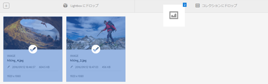
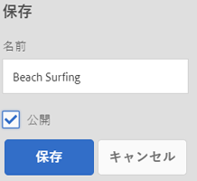
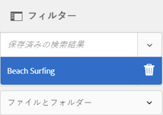

# コレクションの管理 {#managing-collections}

コレクションは、[!DNL Adobe Experience Manager Assets]内のアセットのセットです。 コレクションを使用して、ユーザー間でアセットを共有します。セットは、静的コレクションまたは検索結果に基づく動的コレクションにすることができます。

フォルダーとは異なり、1 つのコレクションに異なる複数の場所のアセットを含めることができます。異なるレベルの特権（表示、編集など）が割り当てられている様々なユーザーとコレクションを共有できます。

1 人のユーザーと複数のコレクションを共有できます。各コレクションには、アセットへの参照が含まれます。アセットの参照整合性はコレクション間で維持されます。

コレクションは、アセットを照合する方法に基づいて次のタイプに分かれます。

* アセット、フォルダーおよび他のコレクションの静的な参照リストを含むコレクション。

* 検索条件に基づいたアセットを動的に含むスマートコレクション。

## コレクションコンソールのアクセス {#navigating-the-collections-console}

**[!UICONTROL コレクション]**&#x200B;を開くには、[!DNL Experience Manager]インターフェイスで&#x200B;**[!UICONTROL アセット]**/**[!UICONTROL コレクション]**&#x200B;に移動します。

## コレクションを作成 {#creating-a-collection}

[静的な参照](#creating-a-collection-with-static-references)を含むコレクション、または[検索条件ベースのフィルター](#creating-a-smart-collection)に基づいたコレクションを作成できます。Lightbox からコレクションを作成することもできます。

### 静的な参照を含むコレクションの作成 {#creating-a-collection-with-static-references}

静的な参照を含むコレクションを作成できます。例えば、アセット、フォルダー、コレクション、スピンセット、画像セットへの参照を含むコレクションなどがあります。

1. **[!UICONTROL コレクション]**&#x200B;コンソールに移動します。
1. ツールバーで、**[!UICONTROL 「作成]**」をクリックします。
1. **[!UICONTROL コレクションを作成]**&#x200B;ページで、コレクションのタイトルとオプションの説明を入力します。
1. メンバーをコレクションに追加して、適切な権限を割り当てます。または、「**[!UICONTROL 公開コレクション]**」を選択すると、すべてのユーザーがコレクションにアクセスできるようになります。

   >[!NOTE]
   >
   >メンバーが他のユーザーとコレクションを共有するには、`dam-users` グループにパス `home/users` への読み取り権限を付与します。ユーザーがポップアップリストでコレクションを表示できるようにするには、`/content/dam/collections` の場所への権限をユーザーに与えます。または、ユーザーを `dam-users` グループのメンバーにします。

1. （オプション）コレクションのサムネール画像を追加します。
1. 「**[!UICONTROL 作成]**」をクリックし、「**[!UICONTROL OK]**」をクリックしてダイアログを閉じます。 指定されたタイトルとプロパティを含むコレクションがコレクションコンソールに表示されます。

   >[!NOTE]
   >
   >[!DNL Experience Manager Assets] では、アセットフォルダーのレビュータスクを作成するのと同じ方法で、コレクションのレビュータスクを作成できます。

   コレクションにアセットを追加するには、[!DNL Assets]ユーザーインターフェイスに移動します。 詳しくは、[コレクションへのアセットの追加](#adding-assets-to-a-collection)を参照してください。

### ドロップゾーンを使用したコレクションの作成 {#create-collections-using-dropzone}

アセットは[!DNL Assets]ユーザーインターフェイスからコレクションにドラッグできます。 コレクションのコピーを作成して、そこにアセットをドラッグすることもできます。

1. [!DNL Assets]ユーザーインターフェイスから、コレクションに追加するアセットを選択します。
1. アセットを「**[!UICONTROL コレクションにドロップ]**」ゾーンにドラッグします。または、ツールバーの&#x200B;**[!UICONTROL コレクション]**&#x200B;へをクリックします。

   

1. **[!UICONTROL コレクション追加]**&#x200B;へページで、ツールバーの&#x200B;**[!UICONTROL コレクションを作成]**&#x200B;をクリックします。

   既存のコレクションにアセットを追加する場合は、ページからアセットを選択し、「**[!UICONTROL 追加]**」をクリックします。 デフォルトでは、最も新しく更新されたコレクションが選択されます。

1. **[!UICONTROL 新しいコレクションを作成]**&#x200B;ダイアログで、コレクションの名前を指定します。すべてのユーザーがコレクションにアクセスできるようにする場合は、「**[!UICONTROL 公開コレクション]**」を選択します。
1. 「**[!UICONTROL 続行]**」をクリックして、コレクションを作成します。

### スマートコレクションの作成 {#creating-a-smart-collection}

スマートコレクションでは、検索条件を使用してアセットを動的に設定します。スマートコレクションの作成時に使用できるのはファイルのみであり、フォルダーや、ファイルとフォルダーは使用できません。

スマートコレクションを作成するには、次の手順に従います。

1. [!DNL Assets]ユーザーインターフェイスに移動し、「検索」をクリックします。

1. 「Omnisearch」ボックスに検索キーワードを入力し、`Enter`を選択します。 フィルターパネルを開き、検索フィルターを適用します。

1. 「**[!UICONTROL ファイルとフォルダー]**」リストから「**[!UICONTROL ファイル]**」を選択します。

   

1. 「**[!UICONTROL スマートコレクションを保存]**」をクリックします。

1. コレクション名を指定します。「**[!UICONTROL 公開]**」を選択して、閲覧者の役割を持つ DAM ユーザーグループをスマートコレクションに追加します。

   

   >[!NOTE]
   >
   >「**[!UICONTROL パブリック]**」を選択すると、スマートコレクションを作成した後、所有者の役割を持つすべてのユーザーがスマートコレクションを利用できるようになります。 「**[!UICONTROL 公開]**」オプションを選択解除すると、DAM ユーザーグループとスマートコレクションの関連付けが解除されます。

1. 「**[!UICONTROL 保存]**」をクリックしてスマートコレクションを作成し、メッセージボックスを閉じてプロセスを完了します。

   新しいスマートコレクションは「**[!UICONTROL 保存済みの検索結果]**」リストにも追加されます。

   

   「**[!UICONTROL スマート選択を作成]**」オプションのラベルが「**[!UICONTROL スマート選択を編集]**」に変わります。 スマートコレクションの設定を編集するには、「**[!UICONTROL ファイルとフォルダー]**」リストから「**[!UICONTROL ファイル]**」を選択します。「**[!UICONTROL スマート選択を編集]**  」オプションをクリックします。

## コレクションへのアセットの追加 {#adding-assets-to-a-collection}

参照元のアセットまたはフォルダーのリストを含むコレクションにアセットを追加できます。スマートコレクションでは、検索クエリを使用してアセットを設定します。そのため、アセットおよびフォルダーへの静的な参照はスマートコレクションに適用できません。

1. [!DNL A]setsユーザーインターフェイスで、アセットを選択し、ツールバーの「コレクション&#x200B;]**」をクリックします。**[!UICONTROL &#x200B;または、アセットをインターフェイス上の「コレクション&#x200B;]**にドロップ」領域にドラッグできます。**[!UICONTROL &#x200B;領域追加のラベルが&#x200B;**[!UICONTROL Drop to 追加]**&#x200B;に変わった場合のアセット。

1. **[!UICONTROL コレクションに追加]**&#x200B;ページで、アセットを追加するコレクションを選択します。

1. **[!UICONTROL 追加]**&#x200B;をクリックし、確認メッセージを閉じます。 アセットがコレクションに追加されます。

## スマートコレクションの編集 {#editing-a-smart-collection}

スマートコレクションは検索を保存することによって構築されるので、内容を変更するには、[保存済みの検索](#saved-searches)の検索パラメーターを変更します。

1. [!DNL Assets]ユーザーインターフェイスで、ツールバーの検索オプションをクリックします。
1. 「Omnisearch」ボックスにカーソルを置き、`Return`キーを選択します。
1. [!DNL Experience Manager]インターフェイスで、フィルターパネルを開きます。
1. 「**[!UICONTROL 保存済みの検索結果]**」リストから、変更するスマートコレクションを選択します。検索パネルに、該当する保存済みの検索用に設定されているフィルターが表示されます。

   

1. 「**[!UICONTROL ファイルとフォルダー]**」リストから「**[!UICONTROL ファイル]**」を選択します。
1. 必要に応じて、1 つ以上のフィルターを変更します。「**[!UICONTROL スマートコレクションを編集]**」をクリックします。

   スマートコレクションの名前を編集することもできます。

   

1. 「**[!UICONTROL 保存]**」をクリックします。**[!UICONTROL スマートコレクションを編集]**&#x200B;ダイアログが表示されます。
1. 「**[!UICONTROL 上書き]**」をクリックして、元のスマートコレクションを編集済みのコレクションで置き換えます。 または、「**[!UICONTROL 名前を付けて保存]**」を選択して、編集済みのコレクションを個別に保存します。
1. 確認ダイアログで、「**[!UICONTROL 保存]**」をクリックしてプロセスを完了します。

## コレクションのメタデータの表示と編集 {#view-edit-collection-metadata}

コレクションのメタデータは、コレクションに関するデータ（追加されたタグを含む）で構成されます。

1. [!UICONTROL コレクション]コンソールからコレクションを選択し、ツールバーの&#x200B;**[!UICONTROL プロパティ]**&#x200B;をクリックします。
1. **[!UICONTROL コレクションメタデータ]**&#x200B;ページの「**[!UICONTROL 基本]**」タブと「**[!UICONTROL 詳細]**」タブでコレクションメタデータを表示します。
1. 必要に応じて、メタデータを変更します。 変更を保存するには、ツールバーの「**[!UICONTROL 保存して閉じる]**」をクリックします。

## 複数のコレクションのメタデータを一括で編集{#editing-collection-metadata-in-bulk}

複数のコレクションのメタデータを同時に編集できます。この機能により、複数のコレクションで共通のメタデータをすばやくレプリケートできます。

1. コレクションコンソールで、2つ以上のコレクションを選択します。
1. ツールバーで、**[!UICONTROL プロパティ]**&#x200B;をクリックします。
1. 必要に応じて、**[!UICONTROL コレクションメタデータ]**&#x200B;ページの「**[!UICONTROL 基本]**」タブと「**[!UICONTROL 詳細]**」タブでメタデータを編集します。
1. 特定のコレクションのメタデータのプロパティを表示するには、コレクションリストの残りのコレクションの選択を解除します。メタデータエディターのフィールドには、その特定のコレクションのメタデータが入力されています。

   >[!NOTE]
   >
   >* [!UICONTROL プロパティ]ページで、コレクションのリストからコレクションを削除するには、コレクションの選択を解除します。 コレクションリストは、デフォルトではすべてのコレクションが選択されています。[!DNL Experience Manager] 削除したコレクションのメタデータは更新されません。
   >* リストの上部で、「**[!UICONTROL タイトル]**」の横にあるチェックボックスをオンにして、コレクションの選択とリストの消去を切り替えます。

1. ツールバーの「**[!UICONTROL 保存して閉じる]**」をクリックし、確認ダイアログを閉じます。
1. 新しいメタデータを既存のメタデータと共に追加するには、「**[!UICONTROL 追加モード]**」を選択します。 このオプションを選択しないと、フィールド内の既存のメタデータが新しいメタデータに置換されます。「**[!UICONTROL 送信]**」をクリックします。

   >[!NOTE]
   >
   >選択したコレクションに追加したメタデータは、これらのコレクションの以前のメタデータを上書きします。 [!UICONTROL 追加モード]を使用して、複数の値を含めることができるフィールドの既存のメタデータに新しい値を追加します。 単一値フィールドは常に上書きされます。 「[!UICONTROL タグ]」フィールドに追加する新しいタグはすべて、メタデータのタグの既存のリストに追加されます。

メタデータの[!UICONTROL プロパティ]ページをカスタマイズ（メタデータのプロパティの追加、編集、削除など）するには、スキーマエディターを使用します。

>[!TIP]
>
>バルク編集方法は、コレクションで使用可能なアセットに対して機能します。 フォルダー全体で使用可能なアセットまたは共通の基準に一致するアセットについては、[検索後にメタデータを一括更新する](/help/assets/search-assets.md#metadataupdates)ことが可能です。

## コレクションの検索 {#searching-collections}

コレクションコンソールからコレクションを検索できます。「Omnisearch」ボックスでキーワードを使用して検索する場合、[!DNL Assets]はコレクション名、メタデータ、コレクションに追加されたタグを検索します。

トップレベルからコレクションを検索する場合は、個々のコレクションのみ検索結果に返されます。[!DNL Assets] またはコレクション内のフォルダーは除外されます。他のすべての場合（例：個々のコレクション内またはフォルダー階層内）では、関連するすべてのアセット、フォルダー、コレクションが返されます。

## コレクション内の検索{#searching-within-collections}

コレクションコンソールで、コレクションをクリックして開きます。

コレクション内での[!DNL Experience Manager]検索は、表示中のコレクション内のアセット（およびアセットのタグとメタデータ）に制限されます。 フォルダー内を検索すると、現在のフォルダー内の一致するアセットと子フォルダーがすべて返されます。コレクション内を検索すると、一致するアセット、一致するフォルダー、（そのコレクションの直接のメンバーである）他の一致するコレクションのみ返されます。

## コレクション設定の編集 {#editing-collection-settings}

コレクション設定（タイトルや説明など）を編集したり、コレクションにメンバーを追加したりできます。

1. コレクションを選択し、ツールバーの&#x200B;**[!UICONTROL 設定]**&#x200B;をクリックします。 または、コレクションのサムネールの&#x200B;**[!UICONTROL 設定]**&#x200B;クイックアクションを使用します。
1. **[!UICONTROL コレクション設定]**&#x200B;ページでコレクション設定を変更します。例えば、[コレクションの追加](#creating-a-collection)の説明に従って、コレクションのタイトル、説明、メンバーおよび権限を変更します。

1. 変更を保存するには、「**[!UICONTROL 保存]**」をクリックします。

## コレクションの削除 {#deleting-a-collection}

1. コレクションコンソールで、1つまたは複数のコレクションを選択し、ツールバーの「削除」をクリックします。

1. ダイアログで、「**[!UICONTROL 削除]**」をクリックして削除操作を確定します。

   >[!NOTE]
   >
   >また、[保存済みの検索結果](#saved-searches)を削除することで、スマートコレクションを削除することもできます。

## コレクションのダウンロード {#downloading-a-collection}

コレクションをダウンロードすると、フォルダーや子コレクションを含む、コレクション内のアセットの階層全体がダウンロードされます。

1. コレクションコンソールから、ダウンロードする 1 つ以上のコレクションを選択します。
1. ツールバーで、**[!UICONTROL 「]**&#x200B;をダウンロード」をクリックします。
1. **[!UICONTROL ダウンロード]**&#x200B;ダイアログで、「**[!UICONTROL ダウンロード]**」をクリックします。コレクション内のアセットのレンディションをダウンロードする場合は、「**[!UICONTROL レンディション]**」を選択します。コレクションの所有者に電子メールで通知を送信するには、「**[!UICONTROL 電子メール]**」オプションを選択します。

   ダウンロードするコレクションを選択すると、そのコレクションの下位のフォルダーの階層全体がダウンロードされます。ダウンロードする各コレクション（親コレクションの下にネストされている子コレクションのアセットを含む）を個々のフォルダーに格納するには、「**[!UICONTROL アセットごとに別のフォルダーを作成]**」を選択します。

## ネストされたコレクションの作成 {#creating-nested-collections}

別のコレクションにコレクションを追加できます。これにより、ネストされたコレクションが作成されます。

1. コレクションコンソールから、目的のコレクションまたはコレクションのグループを選択し、ツールバーの「**[!UICONTROL コレクション]**&#x200B;へ」をクリックします。

1. **[!UICONTROL コレクションに追加]**&#x200B;ページで、コレクションを追加するコレクションを選択します。

   >[!NOTE]
   >
   >**[!UICONTROL コレクションに追加]**&#x200B;ページでは、直近に更新されたコレクションがデフォルトで選択されています。

1. 「**[!UICONTROL 追加]**」をクリックします。ターゲットコレクションにコレクションが追加されたことを確認するメッセージが&#x200B;**[!UICONTROL 宛先を選択]**&#x200B;ページに表示されます。メッセージを閉じてプロセスを完了します。

>[!NOTE]
>
>スマートコレクションをネストすることはできません。つまり、スマートコレクションに他のコレクションを含めることはできません。

## 保存済みの検索結果 {#saved-searches}

[!DNL Assets]ユーザーインターフェイスでは、特定のルール、検索条件、またはカスタム検索ファセットに基づいてアセットを検索またはフィルタリングできます。 その結果を&#x200B;**[!UICONTROL 保存済みの検索結果]**&#x200B;として保存すると、後でフィルターパネルの「**[!UICONTROL 保存済みの検索結果]**」リストからアクセスできます。保存済みの検索結果を作成すると、スマートコレクションも作成されます。

スマートコレクションの作成時には、保存済みの検索結果が作成されます。スマートコレクションは、「**[!UICONTROL 保存済みの検索結果]**」リストに自動的に追加されます。コレクションの[!UICONTROL 保存済み検索結果]クエリは、CRXDEの`dam:query`プロパティ（相対位置`/content/dam/collections/`）に保存されます。 保存できる検索と、リストに表示される保存済みの検索に制限はありません。

>[!NOTE]
>
>静的なコレクションを共有する場合と同じ方法でスマートコレクションを共有できます。

保存済みの検索結果の編集操作は、スマートコレクションを編集する際と同じです。詳しくは、[スマートコレクションの編集](#editing-a-smart-collection)を参照してください。

保存済みの検索結果を削除するには、次の手順に従います。

1. [!DNL Assets]ユーザーインターフェイスで、「検索」をクリックします。
1. Omnisearchフィールドにカーソルを置き、`Return`キーを選択します。
1. [!DNL Experience Manager]インターフェイスで、フィルターパネルを開きます。
1. **[!UICONTROL 保存済みの検索結果]**&#x200B;リストで、削除するスマートコレクションの横にある&#x200B;**[!UICONTROL 削除]**&#x200B;をクリックします。

   

1. ダイアログで、「**[!UICONTROL 削除]**」をクリックして、保存済みの検索を削除します。

## コレクションでのワークフローの実行 {#running-a-workflow-on-a-collection}

コレクション内のアセットのワークフローを実行できます。コレクションにネストされたコレクションが含まれている場合は、ネストされたコレクション内のアセットでもワークフローが実行されます。ただし、コレクションとネストされたコレクションでアセットが重複する場合、そのアセットのワークフローは 1 回しか実行されません。

1. **[!UICONTROL アセット]** > **[!UICONTROL コレクション]**&#x200B;を開きます。 特定のコレクションに対してワークフローを実行するには、そのコレクションを選択します。
1. **[!UICONTROL タイムライン]**&#x200B;パネルを開きます。 をクリックし、**[!UICONTROL 開始ワークフロー]**&#x200B;をクリックします。
1. 「**[!UICONTROL ワークフローを開始]**」セクションで、リストからワークフローモデルを選択します。例えば、「**[!UICONTROL DAM アセットの更新]**」モデルを選択します。
1. ワークフローのタイトルを入力し、**[!UICONTROL 開始]**&#x200B;をクリックします。
1. ダイアログで、「**[!UICONTROL 続行]**」をクリックします。ワークフローは、選択したコレクション内のすべてのアセットを処理します。

>[!MORELIKETHIS]
>
>* [Experience Managerアセットの電子メール通知の設定](/help/sites-administering/notification.md#assetsconfig)
>* [コレクション用レビュータスクの作成](bulk-approval.md)

