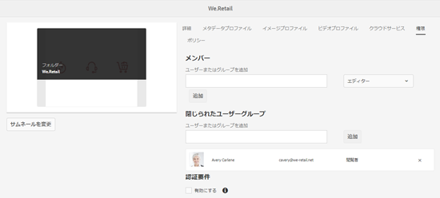
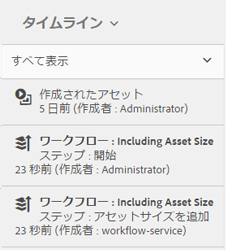

# デジタルアセットの管理 {#managing-assets-with-the-touch-optimized-ui}

この記事では、Adobe Experience Manager(AEM)Assetsでアセットを管理および編集する方法について説明します。 ユーザーインターフェイスとレイアウトの使用を開始するには、タッチ操作対応UI [の基本的な処理を参照してくださ](/help/sites-authoring/basic-handling.md)い。 コンテンツフラグメントを管理する方法については、「コンテ [ンツフラグメント](content-fragments-managing.md) 」アセットの管理を参照してください。

## フォルダーの作成 {#creating-folders}

When organizing a collection of assets, for example, all `Nature` images, you can create folders to keep them together. フォルダーを使用すると、アセットを分類および整理できます。ただし、効率向上のためには必ずアセットをフォルダーで整理しなければならないということではありません。

>[!NOTE]
>
>* `sling:OrderedFolder` タイプの Assets フォルダーの共有は、Marketing Cloud との共有時はサポートされません。If you want to share a folder, do not select [!UICONTROL Ordered] when creating a folder.
>* Experience Managerでは、単語をフォルダーの名 `subassets` 前として使用することはできません。 これは、複合アセットのサブアセットを含むノード用に予約されたキーワードです。

1. 新しいフォルダーを作成するデジタルアセットフォルダーの場所に移動します。メニューで、「**[!UICONTROL 作成]**」をクリックします。Select **[!UICONTROL New Folder]**.
1. In the **[!UICONTROL Title]** field, provide a folder name. デフォルトでは、フォルダー名として指定したタイトルが使用されます。フォルダーが作成されると、デフォルトのフォルダー名を上書きして、別のフォルダー名を指定できます。
1. 「**[!UICONTROL 作成]**」をクリックします。作成したフォルダーがデジタルアセットフォルダーに表示されます。

以下の文字（スペース区切りリスト）はサポートされません。

* アセットファイル名に次の文字を含めることはできません。 `* / : [ \\ ] | # % { } ? &`
* アセットフォルダ名には、次の文字を含めることはできません。 `* / : [ \\ ] | # % { } ? \" . ^ ; + & \t`

## Upload assets {#uploading-assets}

<!-- TBD the following:
Move this section into a new article. CQDOC-14874 ticket is created for this.
In this complete article, replace emphasis with UICONTROL where appropriate.
-->

様々な種類のアセット（画像、PDF ファイル、RAW ファイルなど）をローカルフォルダーやネットワークドライブから AEM Assets にアップロードできます。

>[!NOTE]
>
>Dynamic Media - Scene7 モードでは、ファイルサイズが 2 GB 以下のアセットのみアップロードできます。

アセットは、処理プロファイルが割り当てられたまたは割り当てられていないフォルダーにアップロードできます。

処理プロファイルが割り当てられているフォルダーの場合、プロファイル名がカード表示のサムネールに表示されます。リスト表示では、プロファイル名が「**処理プロファイル**」に表示されます。詳しくは、[処理プロファイル](/help/assets/processing-profiles.md)を参照してください。

Before uploading an asset, ensure that it is in a [format](/help/assets/assets-formats.md) that AEM Assets supports.

1. アセットユーザーインターフェイスで、デジタルアセットを追加する場所に移動します。
1. アセットをアップロードするには、以下のいずれかの操作をおこないます。

   * On the toolbar, tap the **[!UICONTROL Create]** icon. Then on the menu, tap **[!UICONTROL Files]**. 表示されたダイアログで、必要に応じてファイル名を変更できます。
   * HTML5をサポートするブラウザーで、アセットをアセットユーザーインターフェイスに直接ドラッグします。 ファイル名を変更するためのダイアログは表示されません。
   

   複数のファイルを選択するには、CtrlキーまたはCommandキーを押し、ファイル選択ダイアログでアセットを選択します。 iPadを使用する場合は、一度に1つのファイルのみを選択できます。

   サイズの大きなアセット（500 MB 超）のアップロードを一時停止して、同じページから後で再開できます。Tap the **[!UICONTROL Pause]** icon beside progress bar that appears when an upload starts.

   

   サイズが大きいと見なされるアセットのサイズは変更できます。例えば、（500 MB でなく）1000 MB を超えるサイズのアセットをサイズが大きいと見なすようにシステムを設定できます。In this case, **[!UICONTROL Pause]** appears on the progress bar when assets of size greater than 1000 MB are uploaded.

   1000 MB を超えるファイル 1 つと 1000 MB 未満のファイル 1 つをアップロードする場合、一時停止ボタンは表示されません。ただし、1000 MB 未満のファイルのアップロードをキャンセルすると、**[!UICONTROL 一時停止]**&#x200B;ボタンが表示されます。

   To modify the size limit, configure the `chunkUploadMinFileSize` property of the `fileupload`node in the CRX repository.

   **[!UICONTROL 一時停止]**&#x200B;アイコンをクリックすると、**[!UICONTROL 再生]**&#x200B;アイコンに切り替わります。To resume uploading, click the **[!UICONTROL Play]** icon.

   

   To cancel an ongoing upload, click close (`X`) next to the progress bar. アップロード操作をキャンセルすると、AEM Assetsはアセットの一部がアップロードされた部分を削除します。

   アップロードを再開する機能は、帯域幅が狭く、ネットワークの誤作動によりサイズの大きなアセットのアップロードに時間がかかるシナリオで特に便利です。アップロード処理を一時停止して、後で状況が改善したときに処理を再開できます。再開すると、処理を一時停止した箇所からアップロードが開始されます。

   アップロード処理中、AEM はアップロード中の部分のアセットをデータのチャンクとして CRX リポジトリに保存します。アップロードが完了すると、AEM はリポジトリ内のチャンクを 1 つのブロックに統合します。

   To configure the cleanup task for the unfinished chunk upload jobs, go to `https://[aem_server]:[port]/system/console/configMgr/org.apache.sling.servlets.post.impl.helper.ChunkCleanUpTask`.

   アセットのアップロード先に既に存在するアセットと同じ名前のアセットをアップロードすると、警告ダイアログが表示されます。

   既存のアセットを置き換えるか、別のバージョンを作成するか、アップロードする新しいアセットの名前を変更して両方のアセットを残すかを選択できます。既存のアセットを置き換えると、アセットのメタデータと、既存のアセットに対して行った以前の変更（注釈や切り抜きなど）がすべて削除されます。 If you choose to keep both assets, the new asset is renamed with number `1` appended to its name.

   

   >[!NOTE]
   >
   >When you select **[!UICONTROL Replace]** in the [!UICONTROL Name Conflict] dialog, the asset ID is regenerated for the new asset. この ID は以前のアセットの ID とは異なります。
   >
   >Adobe Analyticsでアセットインサイトがインプレッション数/クリック数の追跡を有効にしている場合、再生成されたアセットIDは、Analyticsでアセットに対して取り込まれたデータを無効にします。

   If the asset you upload exists in AEM Assets, the **[!UICONTROL Duplicates Detected]** dialog warns that you are attempting to upload a duplicate asset. The dialog appears only if the `SHA 1` checksum value of the binary of the existing asset matches the checksum value of the asset you upload. この場合、アセットの名前は関係ありません。

   >[!NOTE]
   >
   >The [!UICONTROL Duplicates Detected] dialog appears only when the duplicate detection feature is enabled. To enable the duplicate detection feature, see [Enable Duplicate Detection](/help/assets/duplicate-detection.md).

   

   AEM Assetsで重複したアセットを保持するには、「保持」をタップまたはクリッ **[!UICONTROL クします]**。 アップロードした複製アセットを削除するには、「削除」をタップまたはクリ **[!UICONTROL ックしま]**&#x200B;す。

   AEM Assetsでは、ファイル名に使用できない文字を使用してアセットをアップロードすることはできません。 許可されていない文字以上を含むファイル名のアセットをアップロードしようとすると、AEM Assetsは警告メッセージを表示し、これらの文字を削除するか、許可されている名前のアップロードを行うまで、アップロードを停止します。

   To suit specific file naming conventions for your organization, the [!UICONTROL Upload Assets] dialog lets you specify long names for the files that you upload.

   ただし、以下の文字（スペース区切りリスト）はサポートされません。

   * asset file name must not contain `* / : [ \\ ] | # % { } ? &`
   * asset folder name must not contain `* / : [ \\ ] | # % { } ? \" . ^ ; + & \t`
   

   さらに、Assets ユーザーインターフェイスには、アップロードした最新のアセットまたは最初に作成したフォルダーが表示されます。

   ファイルがアップロードされる前にアップロード操作をキャンセルすると、AEM Assets が現在のファイルのアップロードを停止し、コンテンツを更新します。ただし、既にアップロードされているファイルは削除されません。

   AEM Assets のアップロード進行状況ダイアログには、アップロードが成功したファイルと失敗したファイルの数が表示されます。

### 順次アップロード {#serialuploads}

一括で多数のアセットをアップロードすると、多くの I/O リソースを消費し、AEM Assets インスタンスのパフォーマンスが悪化することがあります。特に、インターネット接続が低速の場合、ディスク I/O のスパイクによりアップロード時間が非常に長くなります。さらに、Web ブラウザーでは、アセットの同時アップロードで AEM Assets が処理できる POST リクエスト数に制限が課されることがあります。その結果、アップロード操作に失敗したり、途中で終了してしまったりします。つまり、AEM Assets で多数のファイルを取り込むときに、一部のファイルを取り込めないことがあったり、まったくファイルを取り込めないことがあります。

この状況を回避するために、AEM Assets は一括アップロード操作時にすべてのアセットを同時に取り込まず、一度に 1 つずつアセットを取り込みます（順次アップロード）。

アセットの順次アップロードは、デフォルトで有効になっています。To disable the feature and allow concurrent uploading, overlay the `fileupload` node in Crx-de and set the value of the `parallelUploads` property to `true`.

### Upload assets using FTP {#uploading-assets-using-ftp}

Dynamic Media では、FTP サーバー経由でアセットをバッチアップロードできます。大きなアセット（1 GBを超える）をアップロードする場合、またはフォルダとサブフォルダ全体をアップロードする場合は、FTPを使用する必要があります。 定期的にFTPアップロードを行うように設定することもできます。

>[!NOTE]
>
>Dynamic Media - Scene7 モードでは、ファイルサイズが 2 GB 以下のアセットのみアップロードできます。

>[!NOTE]
>
>ダイナミックメディア — Scene7モードでFTP経由でアセットをアップロードするには、AEM作成者インスタンスに機能パック18912をインストールします。 Contact [Adobe Customer Care](https://helpx.adobe.com/contact/enterprise-support.ec.html) to get access to FP-18912 and complete the setup of your FTP account. 詳しくは、一括アセット移行の機 [能パック18912のインストールを参照してください](/help/assets/bulk-ingest-migrate.md)。
>
>アセットのアップロードに FTP を使用する場合、AEM で指定したアップロード設定は無視されます。代わりに、Dynamic Media Classic で定義したファイル処理ルールが使用されます。

**FTP によりアセットをアップロードするには**

1. 任意の FTP クライアントを使用して、プロビジョニングメールで受け取った FTP ユーザー名とパスワードで FTP サーバーにログインします。FTP クライアントで、ファイルやフォルダーを FTP サーバーにアップロードします。
1. プロビジョニングメールで受け取った資格情報で [Dynamic Media Classic にログイン](https://www.adobe.com/marketing-cloud/experience-manager/scene7-login.html)します。グローバルナビゲーションバーの「**[!UICONTROL アップロード]**」をタップします。

1. アップロードページの左上隅付近で「**[!UICONTROL FTP 経由]**」タブをタップします。
1. ページの左側でファイルのアップロード元の FTP フォルダーを選択し、ページの右側でアップロード先のフォルダーを選択します。
1. ページの右下隅付近で「**[!UICONTROL オプション]**」をクリックし、選択したフォルダー内のアセットに基づいて必要なオプションを設定します。

   [アップロードオプションを設定](#upload-job-options)を参照してください。

   >[!NOTE]
   >
   >FTP 経由でアセットをアップロードする場合、Dynamic Media Classic（S7）で設定したアップロードジョブのオプションのほうが AEM で設定した処理パラメーターより優先されます。

1. アップロードオプションを設定ダイアログボックスの右下隅で「**[!UICONTROL 保存]**」をタップします。
1. アップロードページの右下隅で「**[!UICONTROL アップロードを送信]**」をタップします。

   アップロードの進行状況を確認するには、グローバルナビゲーションバーの「**[!UICONTROL ジョブ]**」をタップします。ジョブページに、アップロードの進行状況が表示されます。ユーザーは、AEM で作業を続け、いつでも Dynamic Media Classic のジョブページに戻って進行中のジョブを確認できます。進行中のアップロードジョブをキャンセルするには、経過時間の横の「**[!UICONTROL キャンセル]**」をタップします。

#### アップロードオプションを設定 {#upload-job-options}

| アップロードオプション | サブオプション | 説明 |
|---|---|---|
| Job Name |  | テキストフィールドにあらかじめ入力されるデフォルト名。ユーザーが入力した名前部分や日付と時刻のスタンプが含まれます。デフォルト名を使用するか、このアップロードジョブ用に独自に作成した名前を入力することができます。 このジョブと他のアップロードジョブや公開ジョブはジョブページに記録されます。ここでジョブのステータスを確認できます。 |
| アップロード後に公開 |  | アップロードしたアセットを自動的に公開します。 |
| 任意のフォルダーでベース名が同じファイルを上書き |  | アップロードするファイルと同じ名前のファイルが既にある場合にアップロードするファイルで置き換えるには、このオプションを選択します。このオプションの名前は、**[!UICONTROL アプリケーション設定]**／**[!UICONTROL 一般設定]**／**[!UICONTROL アプリケーションへのアップロード]**／**[!UICONTROL 画像を上書き]**&#x200B;での設定に応じて異なる可能性があります。 |
| アップロード時に Zip または Tar ファイルを解凍 |  |  |
| オプション |  | Tap/ click **[!UICONTROL Job Options]** to open the [!UICONTROL Upload Job Options] dialog box and choose options that affect the entire upload job. これらのオプションはすべてのファイルタイプで同じです。 アプリケーションの全般設定ページから、ファイルのアップロード用のデフォルトオプションを選択できます。このページを開くには、**[!UICONTROL セットアップ]**／**[!UICONTROL アプリケーション設定]**&#x200B;を選択します。Tap the **[!UICONTROL Default Upload Options]** button to open the [!UICONTROL Upload Job Options] dialog box. |
|  | 実行時 | 「一時」または「定期」を選択します。定期ジョブを設定するには、繰り返しオプション（毎日、毎週、またはカスタム）を選択し、FTP アップロードジョブを反復する頻度を指定します。次に、必要に応じてスケジューリングオプションを指定します。 |
|  | サブフォルダーを含める | アップロードしたいフォルダー内のすべてのサブフォルダーをアップロードします。アップロードするフォルダーとそのサブフォルダーの名前は AEM Assets に自動的に登録されます。 |
|  | 切り抜きツールオプション | 画像の端から手動で切り抜くには、切り抜きメニューを選択し、「手動」を選択します。次に、画像のいずれかの辺または各辺から切り抜くピクセル数を入力します。画像から切り抜かれる範囲は、画像ファイルの ppi（画素密度）設定に応じて異なります。例えば、画像が 150 ppi で表示されている場合に、「上」、「右」、「下」、「左」テキストボックスに 75 と入力すると、各辺から 0.5 inch ずつ切り抜かれます。 画像からホワイトスペースを自動的に切り抜くには、切り抜きメニューを開き、「手動」を選択し、「上」、「右」、「下」、「左」フィールドに画像の各辺から切り抜くピクセル数を入力します。また、切り抜きメニューで「トリミング」を選択し、以下のオプションを選択することもできます。  **トリミング対象カラー** <ul><li>**色** - 「色」オプションを選択します。 次に、隅メニューを選択し、切り抜きたいホワイトスペースの色を最も表現している色の画像の角を選択します。</li><li>****&#x200B;透明度 - 「透明度」オプションを選択します。  **許容値** — スライダをドラッグして、許容値を0 ～ 1の範囲で指定します。色に基づいてトリミングする場合は、0を指定すると、画像の隅で選択した色と正確に一致する場合にのみピクセルが切り抜かれます。 1 に近いほど、色の違いに対する許容度が高くなります。  透明度に基づくトリミングでは、切り抜くピクセルが透明な場合のみ、0 を指定してください。1 に近いほど、不透明さに対する許容度が高くなります。</li></ul> これらの切り抜きツールオプションは、非破壊です（何度でも修正できます）。 |
|  | カラープロファイルオプション | 配信に使用される最適なファイルを作成するときのカラー変換を選択します。<ul><li>デフォルトの色保存：画像にカラースペース情報が含まれる場合はソース画像の色を保持します。カラー変換はおこなわれません。今日ほぼすべての画像に適切なカラープロファイルが埋め込まれています。ただし、CMYK のソース画像にカラープロファイルが埋め込まれていないと、色が standard Red Green Blue（sRGB）カラースペースに変換されます。sRGB は Web ページでの画像表示に最適なカラースペースです。</li><li>オリジナルカラースペースを維持：アップロード時にカラー変換をおこなわずに元の色を保持します。カラープロファイルが埋め込まれていない画像の場合、カラー変換はすべて、公開設定で設定したデフォルトのカラープロファイルを使用しておこなわれます。このカラープロファイルは、このオプションで作成したファイルのカラーと一致しない可能性があります。したがって、「デフォルトの色保存」オプションを使用することをお勧めします。</li><li>カスタム アップロード元／アップロード先  アップロード元とアップロード先のカラースペースを選択できるメニューが開きます。この詳細オプションは、ソースファイルに埋め込まれたカラー情報より優先されます。送信するすべての画像のカラープロファイルデータが正しくないか不足している場合に、このオプションを選択します。</li></ul> |
|  | 画像編集オプション | 画像のクリッピングマスクを保持し、カラープロファイルを選択できます。 [アップロード時の画像編集オプションの設定](#setting-image-editing-options-at-upload)を参照してください。 |
|  | Postscript オプション | PostScript® ファイルのラスタライズ、ファイルの切り抜き、透明背景の維持、解像度の選択、カラースペースの選択をおこなうことができます。 [PostScript および Illustrator のアップロードオプションの設定](#setting-postscript-and-illustrator-upload-options)を参照してください。 |
|  | Photoshop オプション | Adobe® Photoshop® ファイルからのテンプレート作成、レイヤーの維持、レイヤーの命名方法の指定、テキストの抽出、テンプレートへの画像のアンカー方法の指定をおこなうことができます。 テンプレートは AEM ではサポートされていません。 [Photoshop アップロードオプションの設定](#setting-photoshop-upload-options)を参照してください。 |
|  | PDF オプション | ファイルのラスタライズ、検索単語とリンクの抽出、eCatalog の自動生成、解像度の設定、カラースペースの選択をおこなうことができます。  AEMではeCatalogはサポートされていません。  [PDF アップロードオプションの設定](#setting-pdf-upload-options)を参照してください。 |
|  | Illustrator オプション | Adobe Illustrator® ファイルのラスタライズ、透明背景の維持、解像度の選択、カラースペースの選択をおこなうことができます。 [PostScript および Illustrator のアップロードオプションの設定](#setting-postscript-and-illustrator-upload-options)を参照してください。 |
|  | EVideo オプション | ビデオプリセットを選択して、ビデオファイルをトランスコードできます。 [eVideo アップロードオプションの設定](#setting-evideo-upload-options)を参照してください。 |
|  | バッチセットプリセット | アップロードしたファイルから画像セットまたはスピンセットを作成するには、使用したいプリセットの「アクティブ」列をクリックします。複数のプリセットを選択できます。プリセットは、Dynamic Media Classic のアプリケーション設定／バッチセットプリセットページで作成します。 バッチセットプリセットの作成について詳しくは、[画像セットとスピンセットの自動生成用のバッチセットプリセットの設定](config-dms7.md#creating-batch-set-presets-to-auto-generate-image-sets-and-spin-sets)を参照してください。 [アップロード時のバッチセットプリセットの設定](#setting-batch-set-presets-at-upload)を参照してください。 |

#### Set image editing options at upload {#setting-image-editing-options-at-upload}

When uploading image files, including AI, EPS, and PSD files, you can take the following editing actions in the [!UICONTROL Upload Job Options] dialog box:

* 画像の端からホワイトスペースを切り抜く（上の表の説明を参照してください）。
* 画像の側面から手動で切り抜く（上の表の説明を参照してください）。
* カラープロファイルを選択する（上の表でオプションの説明を参照してください）。
* クリッピングパスからマスクを作成する。
* アンシャープマスクオプションで画像にシャープニングを適用する
* ノックアウトの背景

<!--
| Option | Sub-option | Description |
|---|---|---|
| Create Mask From Clipping Path | | Create a mask for the image based on its clipping path information. This option applies to images created with image-editing applications in which a clipping path was created. |
| Unsharp Masking | | Lets you fine-tune a sharpening filter effect on the final downsampled image, controlling the intensity of the effect, the radius of the effect (as measured in pixels), and a threshold of contrast that is ignored.  This effect uses the same options as Photoshop’s Unsharp Mask filter. Contrary to what the name suggests, Unsharp Mask is a sharpening filter. Under Unsharp Masking, set the options you want. Setting options are described in the following: |
| | Amount | Controls the amount of contrast that is applied to edge pixels.  Think of it as the intensity of the effect. The main difference between the amount values of Unsharp Mask in Dynamic Media and the amount values in Adobe Photoshop, is that Photoshop has an amount range of 1% to 500%. Whereas, in Dynamic Media, the value range is 0.0 to 5.0. A value of 5.0 is the rough equivalent of 500% in Photoshop; a value of 0.9 is the equivalent of 90%, and so on. |
| | Radius | Controls the radius of the effect. The value range is 0-250.  The effect is run on all pixels in an image and radiates out from all pixels in all directions. The radius is measured in pixels. For example, to get a similar sharpening effect for a 2000 x 2000 pixel image and 500 x 500 pixel image, you would set a radius of two pixels on the 2000 x 2000 pixel image and a radius value of one pixel on the 500 x 500 pixel image. A larger value is used for an image that has more pixels. |
| | Threshold | Threshold is a range of contrast that is ignored when the Unsharp Mask filter is applied. It is important so that no "noise" is introduced to an image when this filter is used. The value range is 0-255, which is the number of brightness steps in a grayscale image. 0=black, 128=50% gray and 255=white.  For example, a threshold value of 12 ignores slight variations is skin tone brightness to avoid adding noise, but still add edge contrast to areas such as where eyelashes meet skin.  For example, if you have a photo of someone’s face, the Unsharp Mask affects the parts of the image, such as where eyelashes and skin meet to create an obvious area of contrast, and the smooth skin itself. Even the smoothest skin exhibits subtle changes in brightness values. If you do not use a threshold value, the filter accentuates these subtle changes in skin pixels. In turn, a noisy and undesirable effect is created while contrast on the eyelashes is increased, enhancing sharpness.  To avoid this issue, a threshold value is introduced that tells the filter to ignore pixels that do not change contrast dramatically, like smooth skin.  In the zipper graphic shown earlier, notice the texture next to the zippers. Image noise is exhibited because the threshold values were too low to suppress the noise. |
| | Monochrome | Select to unsharp-mask image brightness (intensity).  Deselect to unsharp-mask each color component separately. |
| Knockout Background | | Automatically removes the background of an image when you upload it. This technique is useful to draw attention to a particular object and make it stand out from a busy background. Select to enable or “turn on” the Knockout Background feature and the following sub-options: |
| | Corner | Required.  The corner of the image that is used to define the background color to knockout.  You can choose from **Upper Left**, **Bottom Left**, **Upper Right**, or **Bottom Right**. |
| | Fill Method | Required.  Controls pixel transparency from the Corner location that you set.  You can choose from the following fill methods: <ul><li>**Flood Fill** - turns all pixels transparent that match the Corner that you have specified and are connected to it.</li><li>**Match Pixel** - turns all matching pixels transparent, regardless of their location on the image.</li></ul> |
| | Tolerance | Optional.  Controls the allowable amount of variation in pixel color matching based on the Corner location that you set.  Use a value of 0.0 to match pixel colors exactly or, use a value of 1.0 to allow for the greatest variation. |
-->

#### Set PostScript and Illustrator upload options {#setting-postscript-and-illustrator-upload-options}

PostScript（EPS）または Illustrator（AI）画像ファイルのアップロード時に、様々な方法でファイルをフォーマットできます。ファイルのラスタライズ、透明背景の維持、解像度の選択、カラースペースの選択ができます。Options for formatting PostScript and Illustrator files are available in the [!UICONTROL Upload Job Options] dialog box under [!UICONTROL PostScript Options] and [!UICONTROL Illustrator Options].

| Option | サブオプション | 説明 |
|---|---|---|
| 処理中 |  | **[!UICONTROL ラスタライズ]**&#x200B;を選択して、ファイル内のベクターグラフィックスをビットマップ形式に変換します。 |
| レンダリングされた画像で透明な背景を保持する |  | ファイルの背景の透明度を維持します。 |
| 解決方法 |  | 解像度設定を決定します。この設定により、ファイル内の 1 inch あたりに表示するピクセル数を決定します。 |
| カラースペース |  | 「カラースペース」メニューを選択し、次のカラースペースオプションから選択します。 |
|  | 自動検出 | ファイルのカラースペースを保持します。 |
|  | RGB として強制 | RGB カラースペースに変換します。 |
|  | CMYKとしてレンダリング | CMYK カラースペースに変換します。 |
|  | グレースケールとして強制 | グレースケールカラースペースに変換します。 |

#### Photoshopのアップロードオプションの設定 {#setting-photoshop-upload-options}

Photoshop Document(PSD)ファイルは、画像テンプレートの作成に最もよく使用されます。 When you upload a PSD file, you can create an image template automatically from the file (select the [!UICONTROL Create Template] option on the Upload screen).

レイヤーの含まれる PSD ファイルをテンプレートの作成に使用すると、Dynamic Media はこのファイルから複数の画像を作成します。1 レイヤーにつき 1 画像作成されます。

Use the [!UICONTROL Crop Options] and [!UICONTROL Color Profile Options], described above, with Photoshop upload options.

>[!NOTE]
>
>テンプレートは AEM ではサポートされていません。

| Option | サブオプション | 説明 |
|---|---|---|
| レイヤーを維持 |  | PSD にレイヤーがあれば切り離して個別のアセットにします。アセットレイヤーは PSD に関連付けられたまま維持されます。詳細ビューで PSD ファイルを開き、レイヤーパネルを選択して、これらを確認できます。 |
| テンプレートを作成 |  | PSD ファイル内のレイヤーからテンプレートを作成します。 |
| テキストを抽出 |  | テキストを抽出して、ユーザーがビューア内でテキストを検索できるようにします。 |
| レイヤーを背景サイズに拡大 |  | 切り離した画像レイヤーのサイズを、背景レイヤーのサイズに拡大します。 |
| レイヤーの名前 |  | PSD ファイル内のレイヤーを別々の画像としてアップロードします。 |
|  | レイヤー名 | PSD ファイル内のレイヤー名に従って画像に名前を付けます。例えば、元の PSD ファイルに Price Tag という名前のレイヤーがある場合、Price Tag という名前の画像になります。ただし、PSD ファイル内のレイヤー名がデフォルトの Photoshop レイヤー名（背景、レイヤー 1、レイヤー 2 など）である場合、画像の名前はデフォルトレイヤー名ではなく PSD ファイル内のレイヤー番号に従って付けられます。 |
|  | Photoshop とレイヤー番号 | PSD ファイル内のレイヤー番号に従って画像の名前を付け、元のレイヤー名は無視します。Photoshop ファイル名の後にレイヤー番号を付けたものが画像の名前になります。例えば、Spring Ad.psd というファイルの 2 番目のレイヤーは、Photoshop でデフォルト以外の名前が付いていたとしても Spring Ad_2 という名前になります。 |
|  | Photoshop とレイヤー名 | PSD ファイル名の後にレイヤー名またはレイヤー番号を付けた名前になります。PSD ファイル内のレイヤー名がデフォルトの Photoshop レイヤー名である場合、レイヤー番号が使用されます。例えば、SpringAd という名前の PSD ファイルに Price Tag という名前のレイヤーがある場合、Spring Ad_Price Tag という名前になります。レイヤー 2 というデフォルト名のレイヤーは Spring Ad_2 となります。 |
| アンカー |  | PSD ファイルから作成されたレイヤーコンポジションから生成されたテンプレートに画像がどのようにアンカーされるのかを指定します。デフォルトで、アンカーは中央です。中央アンカーにより、置換画像の縦横比に関わらず、置換画像で同じ領域をより適切に埋めることができます。この画像を置換する縦横比が異なる画像が、テンプレートの参照時やパラメーターの置き換えの使用時に、同じ領域を効果的に専有します。アプリケーションでテンプレート内の割り当てられた領域を置換画像で埋める必要がある場合、別の設定に変更してください。 |

#### PDFアップロードオプションの設定 {#setting-pdf-upload-options}

PDF ファイルのアップロード時に、様々な方法でファイルをフォーマットできます。ページの切り抜き、検索単語の抽出、ppi 解像度の入力、カラースペースの選択ができます。PDF ファイルにはトリミング余白、内トンボ、登録マーク、その他のプリンター用マークなどが含まれる場合があります。PDF ファイルのアップロード時に、ページの端からこれらのマークを切り抜くことができます。

>[!NOTE]
>
>eCatalog は AEM ではサポートされていません。

次のいずれかのオプションを選択します。

| Option | サブオプション | 説明 |
|---|---|---|
| 処理中 | ラスタライズ | （デフォルト）PDF ファイルのページをリッピングし、ベクターグラフィックスをビットマップイメージに変換します。eCatalog を作成するには、このオプションを選択します。 |
| 抽出 | 検索ワード | PDF ファイルから単語を抽出し、eCatalog ビューア内でこのファイルをキーワード検索できるようにします。 |
|  | リンク | PDF ファイルからリンクを抽出し、eCatalog ビューアで使用できる画像マップに変換します。 |
| 複数ページの PDFから eCatalog を自動生成 |  | PDF ファイルから eCatalog を自動的に作成します。eCatalog の名前は、アップロードした PDF ファイルと同じになります。（このオプションは、アップロード時に PDF ファイルをラスタライズする場合にのみ使用できます。） |
| 解決方法 |  | 解像度設定を決定します。この設定により、PDF ファイル内の 1 inch あたりに表示するピクセル数を決定します。デフォルトは 150 です。 |
| カラースペース |  | 「カラースペース」メニューを選択し、PDF ファイルのカラースペースを選択します。ほとんどの PDF ファイルには、RGB と CMYK の両方のカラー画像が含まれています。RGB カラースペースはオンラインでの表示に適しています。 |
|  | 自動検出 | PDF ファイルのカラースペースを保持します。 |
|  | RGB として強制 | RGB カラースペースに変換します。 |
|  | CMYK として強制 | CMYK カラースペースに変換します。 |
|  | グレースケールとして強制 | グレースケールカラースペースに変換します。 |

#### eVideoアップロードオプションの設定 {#setting-evideo-upload-options}

様々なビデオプリセットから選択してビデオファイルをトランスコードする。

| Option | サブオプション | 説明 |
|---|---|---|
| アダプティブビデオ |  | モバイル、タブレットおよびデスクトップに配信するビデオを作成するための、任意の縦横比で機能する単一のエンコーディングプリセットです。 このプリセットでエンコードされたアップロード済みソースビデオは、固定の高さに設定されます。ただし、幅はビデオの縦横比を保持して自動的に拡大・縮小します。 ベストプラクティスは、アダプティブビデオのエンコーディングを使用することです。 |
| シングルエンコーディングプリセット | エンコードプリセットの並べ替え | 「名前」または「サイズ」を選択して、「デスクトップ」、「モバイル」および「タブレット」の下に表示されるエンコーディングプリセットを、名前または解像度サイズで並べ替えます。 |
|  | デスクトップ | デスクトップコンピュータにストリーミングビデオまたはプログレッシブビデオを配信するMP4ファイルを作成します。解像度サイズと目的のデータレートを持つ1つ以上の縦横比を選択します。 |
|  | Mobile | iPhoneまたはAndroid携帯端末に配信するMP4ファイルを作成します。解像度サイズと目的のデータレートを使用して、1つ以上の縦横比を選択します。 |
|  | タブレットなど）のアクティブマーカーを確認する。 | iPadまたはAndroidタブレットデバイスに配信するMP4ファイルを作成します。解像度サイズと目的のデータレートを使用して、1つ以上の縦横比を選択します。 |

#### Set Batch Set Presets at upload {#setting-batch-set-presets-at-upload}

アップロードした画像から画像セットまたはスピンセットを自動的に作成する場合は、使用するプリセットの「アクティブ」列をクリックします。 複数のプリセットを選択できます。

バッチセットプリセットの作成について詳しくは、[画像セットとスピンセットの自動生成用のバッチセットプリセットの設定](/help/assets/config-dms7.md#creating-batch-set-presets-to-auto-generate-image-sets-and-spin-sets)を参照してください。

### ストリーミングアップロード {#streamed-uploads}

AEMに多数のアセットをアップロードする場合、サーバーへのI/O要求が大幅に増加するので、アップロードの効率が低下し、一部のアップロードタスクがタイムアウトする場合もあります。 AEM Assets はアセットのストリーミングアップロードをサポートします。ストリームアップロードは、リポジトリにコピーする前にサーバ上の一時フォルダにアセットを保存しないようにすることで、アップロード操作中のディスクI/Oを削減します。 代わりに、データはリポジトリに直接転送されます。これにより、サイズの大きいアセットのアップロードにかかる時間を抑え、タイムアウトが発生する可能性を減少することができます。AEM Assets では、ストリーミングアップロードはデフォルトで有効になっています。

>[!NOTE]
>
>バージョン3.1より前のservlet-apiを持つJEEサーバー上で実行されているAEMでは、ストリーミングアップロードが無効になっています。

### アセットが含まれている ZIP アーカイブの抽出 {#extractzip}

ZIP アーカイブは、サポートされているその他のアセットと同じようにアップロードできます。ファイル名についても、同様のルールが ZIP ファイルに適用されます。AEM を使用すると、ZIP アーカイブを DAM の場所に抽出できます。アーカイブファイルに拡張子として ZIP が含まれていない場合、コンテンツを使用してファイルタイプの検出を有効にします。

一度に 1 つの ZIP アーカイブを選択し、「**[!UICONTROL アーカイブの抽出]**」をクリックして、抽出先フォルダーを選択します。ファイルの重複に対処するためのオプションを選択します（該当する場合）。ZIP ファイル内のアセットが抽出先フォルダー内に既に存在する場合は、抽出をスキップする、既存のファイルを置き換える、名前を変更して両方のアセットを保持する、または新しいバージョンを作成する、のいずれかを選択できます。

抽出が完了すると、AEM は通知領域にメッセージを表示します。AEM が ZIP を抽出している間、抽出を中断することなく作業に戻ることができます。

この機能には、いくつかの制限があります。

* 抽出先に同じ名前のフォルダーが存在する場合、ZIP ファイル内のアセットは既存のフォルダーに抽出されます。
* 抽出をキャンセルしても、既に抽出されたアセットは削除されません。
* 2 つの ZIP ファイルを同時に選択して抽出することはできません。一度に抽出できる ZIP アーカイブは 1 つだけです。
* ZIP アーカイブをアップロードするときに、アップロードダイアログに 500 サーバーエラーが表示される場合は、最新のサービスパックをインストールしてから再試行してください。

## アセットのプレビュー {#previewing-assets}

アセットをプレビューするには、次の手順に従います。

1. アセットユーザーインターフェイスから、プレビューするアセットの場所に移動します。
1. 目的のアセットをタップして開きます。

1. プレビューモードでは、[サポートされている画像タイプ](/help/assets/assets-formats.md#supported-raster-image-formats)で（インタラクティブ編集中に）ズームオプションを使用できます。

   To zoom into an asset, tap/click `+` (or tap/click the magnifying glass on the asset). To zoom out, tap/click `-`. ズームインすると、パンニングによって画像の任意の場所を詳細に確認できます。ズームのリセット矢印を使用すると、元のビューに戻ります。

   

   Tap **[!UICONTROL Reset]** to reset the view to the original size.

   

**キーボードキーのみを使用したアセットのプレビュー**

キーボードを使用してアセットをプレビューするには、次の手順に従います。

1. アセットユーザーインターフェイスから、および矢印キーを使用して目的のア `Tab` セットに移動します。

1. 目的の `Enter` アセットのキーを押して開きます。 プレビューモードでアセットをズームインできます。

1. アセットをズームインするには：
   1. ズームイ `Tab` ンアイコンにフォーカスを移動するには、Keyキーを使用します。
   1. キーを使 `Enter` 用して画像をズームインします。
   ズームアウトするには、 `Tab` キーを使用してズームアウトアイコンにフォーカスを移動し、を押しま `Enter`す。

1. +キーを `Shift` 使用 `Tab` して、画像にフォーカスを戻します。

1. 矢印キーを使用して、ズームされた画像の周りを移動します。

See also [Preview Dynamic Media Assets.](/help/assets/previewing-assets.md)

## プロパティとメタデータの編集 {#editing-properties}

1. メタデータを編集するアセットの場所に移動します。

1. Select the asset, and tap/click **[!UICONTROL Properties]** from the toolbar to view asset properties. または、アセットカードで&#x200B;**[!UICONTROL プロパティ]**&#x200B;クイックアクションを選択します。

   

1. In the [!UICONTROL Properties] page, edit the metadata properties under various tabs. 例えば、「**[!UICONTROL 基本]**」タブでは、タイトルや説明などを編集します。

   >[!NOTE]
   >
   >The layout of the [!UICONTROL Properties] page and the metadata properties available depend on the underlying metadata schema. To learn how to modify the layout of the [!UICONTROL Properties] page, see [Metadata Schemas](/help/assets/metadata-schemas.md).

1. アセットをアクティベートする特定の日付と時間をスケジュールするには、「**[!UICONTROL オンタイム]**」フィールドの横にある日付選択を使用します。

   

   *図：アセットの有効化のスケジュール*

1. To deactivate the asset after a particular duration, choose the deactivation date/time from the date picker beside the **[!UICONTROL Off Time]** field. アクティベートを解除する日付は、アセットに設定されたアクティベート日より後の日付にしてください。「オフ」の [!UICONTROL 後は]、アセットとそのレンディションは、アセットWebインターフェイスまたはHTTP API経由では使用できなくなります。

   

   *図：アセットの非アクティブ化のスケジュール*

1. 「**[!UICONTROL タグ]**」フィールドで、タグを 1 つ以上選択します。カスタムタグを追加するには、ボックスにタグの名前を入力し、Enter キーを押します。新しいタグが AEM に保存されます。YouTubeにはタグが必要です。 See [publish videos to YouTube](video.md#publishing-videos-to-youtube).

   >[!NOTE]
   >
   >タグを作成するには、CRXリポジトリでの書き込み権 `/content/cq:tags/default` 限が必要です。

1. アセットを評価するには、「**[!UICONTROL 詳細]**」タブをタップまたはクリックし、適切な位置の星をタップまたはクリックして、目的の評価を割り当てます。

   

   アセットに割り当てた評価スコアは、「**[!UICONTROL あなたの評価]**」の下に表示されます。ユーザーによるアセットの評価の平均スコアは、「**[!UICONTROL 評価]**」の下に表示されます。さらに、平均評価スコアの評価スコアの内訳は、「**[!UICONTROL 評価分類]**」の下に表示されます。平均評価スコアに基づいてアセットを検索できます。

1. To view usage usage statistics for the asset, click/tap the **[!UICONTROL Insights]** tab.

   使用状況の統計には、次の情報が含まれています。

   * アセットが表示またはダウンロードされた回数
   * アセットが使用されたチャネルまたはデバイス
   * アセットが最近使用されたクリエイティブソリューション
   詳しくは、[アセットインサイト](/help/assets/touch-ui-asset-insights.md)を参照してください。

1. 「**[!UICONTROL 保存して閉じる]**」をタップまたはクリックします。
1. アセットユーザーインターフェイスに移動します。 編集済みのメタデータのプロパティ（タイトル、説明、評価など）は、カード表示のアセットカードまたはリスト表示の関連する列に表示されます。

## アセットのコピー {#copying-assets}

アセットやフォルダーをコピーすると、そのアセットやフォルダーがコンテンツ構造と共にコピーされます。コピーされたアセットやフォルダーはコピー先に複製されます。コピー元にあるアセットは変更されません。

アセットの特定のコピーに一意に関連付けられる属性は継承されません。例えば、以下のものが該当します。

* アセットID、作成日時、バージョンとバージョン履歴。 Some of these properties are indicated by the properties `jcr:uuid`, `jcr:created`, and `cq:name`.

* 作成時間と参照パスは、各アセットとその各レンディションに対して一意です。

その他のプロパティとメタデータ情報は保持されます。アセットをコピーするときに、部分的なコピーが作成されることはありません。

1. From the Assets UI, select one or more assets, and then tap/click the **[!UICONTROL Copy]** icon from the toolbar. Alternatively, select the **[!UICONTROL Copy]** quick action from the asset card.
   

   >[!NOTE]
   >
   >If you use the [!UICONTROL Copy] quick action, you can only copy one asset at a time.

1. アセットをコピーする場所に移動します。

   >[!NOTE]
   >
   >同じ場所でアセットをコピーすると、AEM は自動的に名前のバリエーションを生成します。For example, if you copy an asset titled `Square`, AEM automatically generates the title for its copy as `Square1`.

1. Click/ tap the **[!UICONTROL Paste]** asset icon from the toolbar.

   Assetsがこの場所にコピーされます。

   >[!NOTE]
   >
   >The **[!UICONTROL Paste]** icon is available in the toolbar until the paste operation is completed.

### アセットの移動または名前の変更 {#moving-or-renaming-assets}

1. 移動するアセットの場所に移動します。

1. Select the asset, and tap/click the **[!UICONTROL Move]** icon from the toolbar.
   

1. アセットを移動ウィザードで、次のいずれかの操作をおこないます。

   * 移動後のアセットの名前を指定します。Then tap/click **[!UICONTROL Next]** to proceed.

   * Tap/click **[!UICONTROL Cancel]** to stop the process.
   >[!NOTE]
   >
   >* 新しい場所に同じ名前のアセットがない場合は、同じ名前を指定できます。ただし、アセットの移動先に同じ名前のアセットが既に存在する場合は、別の名前を使用する必要があります。同じ名前を使用すると、その名前のバリエーションが自動的に生成されます。例えば、「Square」という名前のアセットの場合、自動的にそのコピーの名前が「Square1」として生成されます。
   >* 名前の変更時に、ファイル名に空白は使用できません。

1. On the **[!UICONTROL Select Destination]** dialog, do one of the following:

   * Navigate to the new location for the assets, and then tap/click **[!UICONTROL Next]** to proceed.

   * Tap/click **[!UICONTROL Back]** to return to the **[!UICONTROL Rename]** screen.

1. If the assets being moved have any referencing pages, assets, or collections, the **[!UICONTROL Adjust References]** tab appears beside the **[!UICONTROL Select Destination]** tab.

   Do one of the following in the **[!UICONTROL Adjust References]** screen:

   * Specify the references to be adjusted based on the new details, and then tap/click **[!UICONTROL Move]** to proceed.

   * 「**[!UICONTROL 調整]**」列で、アセットへの参照を選択／選択解除します。
   * Tap/click **[!UICONTROL Back]** to return to the **[!UICONTROL Select Destination]** screen.

   * Tap/click **[!UICONTROL Cancel]** to stop the move operation.
   参照を更新しない場合、参照は引き続きアセットの前のパスを指します。 参照を調整すると、更新され、アセットの新しいパスが反映されます。

## レンディションの管理 {#managing-renditions}

1. アセットのレンディション（オリジナルを除く）を追加または削除できます。レンディションを追加または削除するアセットの場所に移動します。

1. アセットをタップまたはクリックして、そのアセットページを開きます。

   

1. Tap/click the GlobalNav icon, and select **[!UICONTROL Renditions]** from the list.

   

1. **[!UICONTROL レンディション]**&#x200B;パネルで、アセットに生成されたレンディションのリストを表示します。

   

   >[!NOTE]
   >
   >デフォルトで、AEM Assets はプレビューモードでアセットのオリジナルレンディションを表示しません。管理者の場合、オーバーレイを使用して AEM Assets を設定し、プレビューモードでもオリジナルレンディションを表示できます。

1. 表示または削除するレンディションを選択します。

   **レンディションの削除**

   Select a rendition from the **[!UICONTROL Renditions]** panel, and then tap/click the **[!UICONTROL Delete Rendition]** icon from the toolbar.

   

   **新しいレンディションのアップロード**

   アセットの詳細ページに移動し、ツールバーの「**[!UICONTROL レンディションを追加]**」アイコンをタップまたはクリックして、アセットの新しいレンディションをアップロードします。

   

   >[!NOTE]
   >
   >**[!UICONTROL レンディション]**&#x200B;パネルからレンディションを選択する場合、ツールバーのコンテキストが変わり、レンディションに関連するアクションのみが表示されます。「レンディションをアップロード」アイコンなどのオプションは表示されません。これらのオプションをツールバーに表示するには、アセットの詳細ページに移動します。

   画像またはビデオアセットの詳細ページに表示するレンディションのサイズを設定できます。指定するサイズに基づいて、AEM Assets はレンディションを正確なサイズまたは最も近いサイズで表示します。

   画像のレンディションサイズをアセットの詳細レベルで設定するには、`renditionpicker`ノード（`libs/dam/gui/content/assets/assetpage/jcr:content/body/content/content/items/assetdetail/items/col1/items/assetview/renditionpicker`）をオーバーレイし、width プロパティの値を設定します。画像サイズに基づいてアセットの詳細ページでレンディションをカスタマイズするには、幅の代わりに **[!UICONTROL size (Long) in KB]** プロパティを設定します。サイズベースのカスタマイズの場合、`preferOriginal` プロパティを使用すると、一致するレンディションのサイズがオリジナルより大きい場合でも、オリジナルが優先されます。

   同様に、Annotationページの画像をオーバーレイしてカスタマイズできま `libs/dam/gui/content/assets/annotate/jcr:content/body/content/content/items/content/renditionpicker`す。

   

   To configure rendition dimensions for a video asset, navigate to the `videopicker` node in the CRX repository at the location `/libs/dam/gui/content/assets/assetpage/jcr:content/body/content/content/items/assetdetail/items/col1/items/assetview/videopicker`, overlay the node, and then edit the appropriate property.

   >[!NOTE]
   >
   >ビデオの注釈は、HTML5 互換のビデオ形式に対応したブラウザーでのみサポートされます。また、ブラウザーによってサポートされるビデオ形式が異なります。

サブアセットの生成と表示について詳しくは、「サブアセットの管理」を [参照してくださ](managing-linked-subassets.md#generate-subassets)い。

## アセットを削除する {#deleting-assets}

他のページからの入力参照を解決または削除するには、アセットを削除する前に、関連する参照を更新します。

また、オーバーレイを使用して「削除を強制」ボタンを無効にすることで、参照されているアセットの削除と壊れたリンクの放置を禁止します。

1. 削除するアセットの場所に移動します。

1. Select the asset, and tap/click the **[!UICONTROL Delete]** icon from the toolbar.

   

1. 確認ダイアログで、次のいずれかをクリックします。

   * **[!UICONTROL キャンセル]**：アクションを停止します。
   * **[!UICONTROL 削除]**：アクションの実行を確定します。

      * アセットに参照がない場合は、アセットが削除されます。
      * アセットに参照がある場合は、「**1 つ以上のアセットが参照されています。**」というエラーメッセージが表示されます。「**[!UICONTROL 削除を強制]**」または「**[!UICONTROL キャンセル]**」を選択できます。
   >[!NOTE]
   >
   >アセットを削除するには、ユーザーがに対する削除権限が必要で `dam/asset`す。 変更権限のみ付与されている場合、アセットのメタデータの編集とアセットへの注釈の追加のみが可能で、アセットやそのメタデータの削除は実行できません。

   >[!NOTE]
   >
   >他のページからの入力参照を解決または削除するには、アセットを削除する前に、関連する参照を更新します。また、オーバーレイを使用して「削除を強制」ボタンを無効にすることで、参照されているアセットの削除と壊れたリンクの放置を禁止します。

## アセットのダウンロード {#downloading-assets}

[AEM からのアセットのダウンロード](/help/assets/download-assets-from-aem.md)を参照してください。

## Publish assets {#publishing-assets}

>[!NOTE]
>
>Dynamic Media 特有の追加情報については、[Dynamic Media アセットの公開](/help/assets/publishing-dynamicmedia-assets.md)を参照してください。

1. 発行するアセットまたはフォルダーの場所に移動します。

1. アセットカードで&#x200B;**[!UICONTROL 公開]**&#x200B;クイックアクションを選択するか、アセットを選択し、ツールバーの「**[!UICONTROL クイック公開]**」アイコンをタップまたはクリックします。
1. アセットが他のアセットを参照する場合は、その参照がウィザードに表示されます。表示されるのは、非公開の参照か、最後に公開または非公開にされた後に変更された参照だけです。公開する参照を選択します。

   >[!NOTE]
   >
   >公開したフォルダの一部である空のフォルダは、公開されません。

1. 「**[!UICONTROL 公開]**」をタップまたはクリックして、アセットのアクティベートを確認します。

>[!CAUTION]
>
>処理中のアセットを公開した場合は、オリジナルのコンテンツのみが公開されます。処理中のレンディションは失われます。処理が完了するまで待ってから公開するか、処理の完了後にアセットを公開し直してください。

## アセットの非公開 {#unpublishing-assets}

1. パブリッシュ環境から削除する（非公開にする）アセットまたはアセットフォルダーの場所に移動します。

1. Select the asset/folder to unpublish, and tap/click the **[!UICONTROL Manage Publication]** icon from the toolbar.

   

1. Select the **[!UICONTROL Unpublish]** action from the list.

   

1. 後でアセットを非公開にするには、「**[!UICONTROL 後で非公開にする]**」を選択して、アセットを非公開にする日付を選択します。
1. パブリッシュ環境でアセットを非公開にする日付をスケジュールします。
1. アセットが他のアセットを参照する場合は、非公開にする参照を選択します。Tap/click **[!UICONTROL Unpublish]**.
1. 確認ダイアログで、次のいずれかをタップまたはクリックします。

   * **[!UICONTROL キャンセル]**：アクションを停止します。
   * **[!UICONTROL 非公開]** ：指定した日にアセットが非公開（公開環境で使用できなくなった）であることを確認します。
   >[!NOTE]
   >
   >複雑なアセットを非公開にする場合は、アセットだけを非公開にします。参照は他の公開済みアセットから参照されている可能性があるので、非公開にしないでください。

## 閉じられたユーザーグループ {#closed-user-group}

閉じられたユーザーグループ（CUG）は、AEM から公開された特定のアセットフォルダーへのアクセスを制限するために使用します。フォルダーに対して CUG を作成すると、そのフォルダー（フォルダーのアセットとサブフォルダーを含む）へのアクセスは、割り当てられたメンバーまたはグループのみに制限されます。フォルダーにアクセスするには、セキュリティ資格情報を使用してログインする必要があります。

CUG は、アセットへのアクセスを制限する追加の方法です。また、フォルダーのログインページを設定することもできます。

1. Assets UI からフォルダーを選択し、ツールバーの「プロパティ」アイコンをタップまたはクリックして、プロパティページを表示します。
1. 「**[!UICONTROL 権限]**」タブで、「**[!UICONTROL 閉じられたユーザーグループ]**」の下でメンバーまたはグループを追加します。

   

1. ユーザーがフォルダーにアクセスしたときにログイン画面を表示するには、「**[!UICONTROL 有効]**」オプションを選択します。次に、AEM 内のログインページへのパスを選択し、変更を保存します。

   

   >[!NOTE]
   >
   >ログインページへのパスを指定しないと、AEM はパブリッシュインスタンスでデフォルトのログインページを表示します。

1. フォルダーを公開し、パブリッシュインスタンスからアクセスすると、ログイン画面が表示されます。
1. CUG メンバーの場合は、自分のセキュリティ資格情報を入力します。AEM によって認証されると、フォルダーが表示されます。

## アセットの検索 {#assetsearch}

アセットの検索は、デジタルアセット管理システムの利用の中核を成します。用途は、クリエイティブ担当者によるさらなる利用、ビジネスユーザーやマーケティング担当者によるアセットの堅牢な管理、DAM 管理者による管理などです。

最も適切なアセットを検出し使用するためのシンプル検索、アドバンス検索、カスタム検索については、[AEM でのアセットの検索](search-assets.md)を参照してください。

## クイックアクション {#quick-actions}

クイックアクションのアイコンは、一度に 1 つのアセットに対してのみ利用できます。デバイスに応じて、次の操作を実行してクイックアクションアイコンを表示します。

* タッチデバイス：タッチ＆ホールド。例えば、iPadでは、アセットをタップ&amp;ホールドして、クイックアクションを表示することができます。
* 非タッチデバイス：マウスポインターで指す。例えば、デスクトップデバイスで、アセットのサムネールにポインターを合わせると、クイックアクションバーが表示されます。

### アセットの移動と選択 {#navigating-and-selecting-assets}

You can view, navigate through, and select assets with any of the available views (Card, Column, and List) using the **[!UICONTROL Select]** option.

リストビューと列ビューで、アセットのサムネ **[!UICONTROL ールに]** （ポインターを合わせたとき）「選択」オプションが表示されます。

カード表示では、「選択」オ **[!UICONTROL プションが]** 、クイックアクションとして表示されます。

ブラウザのアセットユーザインターフェイスでフォルダまたはコレクションを参照する場合、右上隅の「すべて選択」オプションを使用して、表示または読み込まれたすべてのアセットを  「選択」で選択できます。 下にスクロールしないと、100個のアセットのみがカード表示に読み込まれ、200個のアセットがリスト表示に読み込まれます。 「すべてを選択」オプションを選択すると、多数のアセットのみが選択されます。

For more information, see [view and selecting your resources](/help/sites-authoring/basic-handling.md#viewing-and-selecting-resources).

## 画像の編集 {#editing-images}

AEM Assets インターフェイスの編集ツールを使用すると、画像アセットで細かい編集ジョブを実行できます。画像に対して切り抜き、回転、反転などの編集ジョブを実行できます。アセットに画像マップを追加することもできます。

>[!NOTE]
>
>一部のコンポーネントでは、フルスクリーンモードで追加のオプションも使用できます。

1. 編集モードでアセットを開くには、次のいずれかの操作をおこないます。

   * Select the asset and then click/tap the **[!UICONTROL Edit]** icon in the toolbar.
   * Tap/click the **[!UICONTROL Edit]** icon that appears on an asset in the Card view.
   * In the asset page, tap/click the **[!UICONTROL Edit]** icon in the toolbar.
   

1. To crop the image, tap/click the **Crop** icon.

   

1. リストから必要なオプションを選択します。選択したオプションに基づいて、画像に切り抜き領域が表示されます。「**フリーハンド**」オプションを使用すると、縦横比の制限に関係なく画像を切り抜くことができます。

   

1. 切り抜く領域を選択し、画像上でそのサイズまたは位置を変更します。
1. **完了**&#x200B;アイコン（右上隅）を使用して、画像を切り抜きます。「**完了**」アイコンをクリックすると、レンディションの再生成もおこなわれます。

   

1. 切り抜く前の画像に戻すには、右上の&#x200B;**取り消し**&#x200B;アイコンを使用します。切り抜いた画像を保持するには、右上の&#x200B;**やり直し**&#x200B;アイコンを使用します。

   

1. 適切な回転アイコンをタップまたはクリックして、画像を時計回りまたは反時計回りに回転します。

   

1. 適切な反転アイコンをタップまたはクリックして、画像を水平方向または垂直方向に反転します。

   

1. Tap/click the **Finish** icon to save the changes.

   

>[!NOTE]
>
>BMP、GIF、PNG、JPEG の各ファイル形式については、画像編集がサポートされています。

画像エディターを使用して画像マップを追加することもできます。詳しくは、[画像マップの追加](/help/assets/image-maps.md)を参照してください。

>[!NOTE]
>
>To edit a TXT file, set **Day CQ Link Externalizer** from Configuration Manager.

## タイムライン {#timeline}

タイムラインを使用すると、アセットのアクティブなワークフロー、コメントや注釈、アクティビティログ、バージョンなど、選択した項目の様々なイベントを表示できます。

*図：アセットのタイムラインエントリの並べ替え*

>[!NOTE]
>
>[コレクションコンソール](/help/assets/managing-collections-touch-ui.md#navigating-the-collections-console)の&#x200B;**[!UICONTROL すべて表示]**&#x200B;リストには、コメントとワークフローだけを表示するオプションがあります。さらに、タイムラインはコンソールにリストされているトップレベルのコレクションについてのみ表示されます。これらのコレクション内を移動する場合、タイムラインは表示されません。

>[!NOTE]
>
>タイムラインには、[コンテンツフラグメントに固有のオプション](/help/assets/content-fragments-managing.md#timeline-for-content-fragments)がいくつか含まれています。

## アセットに注釈を付ける {#annotating}

注釈とは、画像やビデオに追加するコメントまたは注記です。注釈を使用すると、マーケターはアセットに関する共同作業やフィードバックを残すことができます。

ビデオの注釈は、HTML5 互換のビデオ形式に対応したブラウザーでのみサポートされます。AEM Assetsでサポートされるビデオ形式は、ブラウザーによって異なります。

>[!NOTE]
>
>コンテンツフラグメントの場合、[注釈はフラグメントエディターで作成されます](/help/assets/content-fragments-variations.md#annotating-a-content-fragment)。

1. 注釈を追加するアセットの場所に移動します。
1. Tap/click the **[!UICONTROL Annotate]** icon from one of the following:

   * [クイックアクション](/help/assets/managing-assets-touch-ui.md#quick-actions)
   * アセットを選択した後またはアセットページに移動した後に、ツールバーから
   

1. タイムラインの一番下の&#x200B;**[!UICONTROL コメント]**&#x200B;ボックスにコメントを追加します。または、画像内の任意の領域をマークアップし、**[!UICONTROL 注釈を追加]**&#x200B;ダイアログに注釈を追加します。

   

1. 注釈についてユーザーに通知するには、ユーザーの電子メールアドレスを指定して、コメントを追加します。例えば、注釈について Aaron MacDonald というユーザーに通知するには、@aa と入力します。一致するすべてのユーザーに関するヒントがリストに表示されます。Aaron の電子メールアドレスをリストから選択し、コメントを使用してタグ付けします。同様に、注釈内の任意の場所、またはコメントの前後で追加のユーザーにタグ付けできます。

   >[!NOTE]
   >
   >For a non-administrator user, suggestions appear only if the user has Read permissions at */home* in Crx-de.

   

1. 注釈を追加したら、「**[!UICONTROL 追加]**」をクリックして注釈を保存します。注釈に関する通知が Aaron に送信されます。

   

   >[!NOTE]
   >
   >複数の注釈を追加してから、それらを保存できます。

1. 「**[!UICONTROL 閉じる]**」をタップまたはクリックして注釈モードを終了します。
1. To view the notification, log in to AEM Assets with Aaron MacDonald&#39;s credentials and click the **[!UICONTROL Notifications]** icon to view the notification.

   >[!NOTE]
   >
   >注釈はビデオアセットにも追加できます。ビデオに注釈を追加する際は、ユーザーがフレームに注釈を追加できるようにプレーヤーが一時停止します。For details, see [managing video assets](/help/assets/managing-video-assets.md).

1. 別の色を選択してユーザーを区別できるようにするには、プロフィールアイコンをクリックまたはタップし、「**[!UICONTROL 環境設定]**」をクリックまたはタップします。

   

   **[!UICONTROL 注釈カラー]**&#x200B;ボックスに必要な色を指定し、「**[!UICONTROL 確定]**」をクリックまたはタップします。

   

>[!NOTE]
>
>コレクションにも注釈を追加できます。ただし、コレクションに子コレクションが含まれる場合、親コレクションに対してのみ注釈／コメントを追加できます。「注釈」オプションは子コレクションでは使用できません。

### 保存された注釈の表示 {#viewing-saved-annotations}

1. アセットに対して保存された注釈を表示するには、アセットの場所に移動して、そのアセットのアセットページを開きます。

1. Tap/click the GlobalNav icon, and choose **[!UICONTROL Timeline]** from the list.

   

1. タイムラインの「**[!UICONTROL すべて表示]**」のリストから「**[!UICONTROL コメント]**」を選択し、注釈に基づいて結果にフィルターを適用します。

   

   **[!UICONTROL タイムライン]**&#x200B;パネルでコメントをタップまたはクリックし、対応する画像の注釈を表示します。

   

   特定のコメントを削除するには、「**[!UICONTROL 削除]**」をタップまたはクリックします。

### 注釈の印刷 {#printing-annotations}

アセットに注釈が含まれている場合や、アセットがレビューワークフローの対象になっている場合は、アセットを注釈と共に印刷し、オフラインレビュー用のPDFファイルとしてステータスを確認できます。

注釈またはレビューステータスのみ印刷することも選択できます。

注釈とレビューステータスを印刷するには、**[!UICONTROL 印刷]**&#x200B;アイコンをタップまたはクリックし、ウィザードの指示に従ってください。The **[!UICONTROL Print]** icon appears in the toolbar only when the asset has at least one annotation or review status assigned to it.

1. Assets UI から、アセットのプレビューページを開きます。
1. 次のいずれかの操作をおこないます。

   * すべての注釈とレビューステータスを印刷するには、手順 3 をスキップして手順 4 に直接進みます。
   * To print specific annotations and review status, open the [timeline](/help/assets/managing-assets-touch-ui.md#timeline) and then go to step 3.

1. 特定の注釈を印刷するには、タイムラインから注釈を選択します。

   

   レビューステータスのみを印刷するには、タイムラインからレビューステータスを選択します。

   

1. ツールバーの&#x200B;**[!UICONTROL 印刷]**&#x200B;アイコンをタップまたはクリックします。

   

1. 印刷ダイアログから、「注釈／レビューステータス」を PDF のどこに表示したいかを選択します。For example, if you want the annotations/status to be printed at the top-right of the page that contains the printed image, use the **Top-Left** setting. デフォルトで選択されています。

   

   印刷する PDF のどこに注釈／ステータスを表示するかに応じて、別の設定も選択できます。印刷されるアセットとは別のページに注釈／ステータスを表示したい場合、「**[!UICONTROL 次のページ]**」を選択します。

   >[!NOTE]
   >
   >長い注釈は PDF ファイルに適切にレンダリングされない可能性があります。最適なレンダリングのために、注釈を 50 語以内に制限することをお勧めします。

1. 「**[!UICONTROL 印刷]**」をタップまたはクリックします。手順 2 で選択したオプションに応じて、生成される PDF の特定の位置に注釈／ステータスが表示されます。例えば、注釈とレビューステータスの両方を「**左上**」設定を使用して印刷することを選択した場合、生成される PDF ファイルは次のようになります。

   

1. 右上のオプションを使用して PDF をダウンロードまたは印刷します。

   

   >[!NOTE]
   >
   >アセットにサブアセットがある場合、特定のページに関する注釈と共にすべてのサブアセットを印刷できます。

   レンダリングされた PDF ファイルの外観を変更するには、Configuration Manager から&#x200B;**[!UICONTROL 注釈 PDF の設定]**&#x200B;を開き、必要なオプションを変更します。例えば、コメントとステータスのフォントカラー、サイズ、スタイル、背景色を変更できます。例えば、承認済みステータスの表示色を変更したり、対応フィールドのカラーコードを変更したりします。注釈のフォントカラーの変更について詳しくは、[注釈](/help/assets/managing-assets-touch-ui.md#annotating)を参照してください。

   

   レンダリングされた PDF ファイルに戻り、更新します。更新された PDF に、変更が反映されています。

アセットに外国語（特に非ラテン言語）の注釈が含まれる場合、これらの注釈を印刷するには、まず AEM サーバーで CQ-DAM-Handler-Gibson Font Manager サービスを設定する必要があります。CQ-DAM-Handler-Gibson Font Manager サービスの設定では、必要な言語のフォントがある場所を指定します。

1. Open the CQ-DAM-Handler-Gibson Font Manager Service configuration page from the URL `https://[aem_server]:[port]/system/console/configMgr/com.day.cq.dam.handler.gibson.fontmanager.impl.FontManagerServiceImpl`.
1. CQ-DAM-Handler-Gibson Font Manager サービスを設定するには、以下のいずれかをおこないます。

   * 「システムフォントディレクトリ」オプションで、システムのフォントディレクトリの完全パスを指定する。例えば Mac ユーザーの場合、「システムフォントディレクトリ」オプションで */Library/Fonts* と指定します。AEM はこのディレクトリからフォントを取得します。
   * Create a directory named `fonts` inside the ``crx-quickstart`` folder. CQ-DAM-Handler-Gibson Font Manager Service automatically fetches the fonts at the location `crx-quickstart/fonts`. 「Adobe サーバーフォントディレクトリ」オプション内でデフォルトパスを上書きすることができます。

   * システムにフォント用の新しいフォルダーを作成し、必要なフォントをこのフォルダーに保存する。次に、「カスタマフォントディレクトリ」オプションにこのフォルダーへの完全パスを指定します。

1. Access the Annotation PDF configuration from the URL `https://[aem_server]:[4502]/system/console/configMgr/com.day.cq.dam.core.impl.annotation.pdf.AnnotationPdfConfig`.
1. 以下のように、正しいフォントファミリのセットを使用して注釈 PDF を設定します。

   * 文字列をfont-family `<font_family_name_of_custom_font, sans-serif>` オプション内に含めます。 For example, if you want to print annotations in CJK (Chinese, Japanese and Korean), include the string `Arial Unicode MS, Noto Sans, Noto Sans CJK JP, sans-serif` in the font-family option. ヒンディー語で注釈を印刷する場合は、適切なフォントをダウンロードし、フォントファミリーをArial Unicode MS、Noto Sans、Noto Sans CJK JP、Noto Sans Devanagari、sans-serifとして設定します。

1. AEM インスタンスを再起動します。

以下の例は、注釈を CJK（中国語、日本語、韓国語）で印刷する場合の AEM の設定方法を示しています。

1. 以下のリンクから Google Noto CJK フォントをダウンロードし、Font Manager サービスで設定したフォントディレクトリに保存します。

   * All In One Super CJK font: [https://www.google.com/get/noto/help/cjk/](https://www.google.com/get/noto/help/cjk/)
   * Noto Sans (for European languages): [https://www.google.com/get/noto/](https://www.google.com/get/noto/)
   * Noto fonts for a language of your choice: [https://www.google.com/get/noto/](https://www.google.com/get/noto/)

1. Configure the annotation PDF file by setting the font-family parameter to `Arial Unicode MS, Noto Sans, Noto Sans CJK JP, sans-serif`. この設定はデフォルトで使用でき、すべての欧文および CJK 言語で機能します。
1. 選択した言語が手順 2 の言語と異なる場合は、デフォルトフォントファミリに適切なエントリを（コンマで区切って）追加してください。

## アセットのバージョン {#asset-versioning}

バージョン管理では、特定の時点でのデジタルアセットのスナップショットが作成されます。バージョン管理を使用すると、後で、以前の状態にアセットを復元できます。例えば、アセットに対しておこなった変更を取り消したい場合、バージョン管理を使用して未編集のバージョンにアセットを復元できます。

バージョンを作成するシナリオは次のとおりです。

* 別のアプリケーションで画像を変更し、AEM Assets にアップロードします。元の画像が上書きされないように画像のバージョンが作成されます。
* アセットのメタデータを編集します。
* AEMデスクトップアプリを使用して、既存のアセットをチェックアウトし、変更を保存します。 アセットが保存されるたびに、新しいバージョンが作成されます。

また、ワークフローを使用して、自動バージョン管理を有効にすることもできます。アセットのバージョンを作成すると、メタデータとレンディションがバージョンと共に保存されます。 レンディションによって、同じ画像の代替となる画像が表示されます（例えば、アップロードされた JPEG ファイルの PNG レンディション）。

バージョン管理機能を使用すると、次の操作を実行できます。

* アセットのバージョンを作成する。
* アセットの現在のリビジョンを表示する。
* 以前のバージョンにアセットを復元する。

1. バージョンを作成するアセットの場所に移動し、アセットをタップまたはクリックしてそのアセットのページを開きます。

1. グローバルナビゲーションアイコンをタップまたはクリックし、メニューから「**[!UICONTROL タイムライン]**」を選択します。

   

1. Tap/click the **[!UICONTROL Actions]** (arrow) icon at the bottom to view the available actions you can perform on the asset.

   

1. 「**[!UICONTROL 保存するバージョン]**」をタップまたはクリックして、アセットのバージョンを作成します。

   

1. Add a label and comment, and then click **[!UICONTROL Create]** to create a version. Alternatively, tap/click **Cancel** to exit the operation.

   

1. 新しいバージョンを表示するには、アセットの詳細ページまたは Assets UI からタイムラインの「**[!UICONTROL すべて表示]**」リストを開き、「**[!UICONTROL バージョン]**」を選択します。アセット用に作成したすべてのバージョンが「タイムライン」タブに表示されます。リストにフィルターを適用して「バージョン」表示できます。そのためには、下向きの矢印をクリックして、リストから「**[!UICONTROL バージョン]**」を選択します。

   

1. アセットの特定のバージョンを選択してプレビューするか、Assets UI に表示されるように設定します。

   

   >[!NOTE]
   >
   >You can also select the asset from the [List view](/help/sites-authoring/basic-handling.md#viewing-and-selecting-resources) or the [Column view](/help/sites-authoring/basic-handling.md#viewing-and-selecting-resources).

1. Assets UI で特定のバージョンに戻すバージョンに、ラベルとコメントを追加します。

   

1. バージョンのプレビューを生成するには、「**[!UICONTROL バージョンをプレビュー]**」をタップまたはクリックします。
1. To display this version in the Assets UI, select **[!UICONTROL Revert to this Version]**.
1. 2 つのバージョンを比較するには、アセットのアセットページに移動し、現在のバージョンと比較するバージョンをタップまたはクリックします。

   

1. タイムラインで、比較するバージョンを選択し、スライダーを左にドラッグして、現在のバージョンの上にこのバージョンを重ねて表示して比較します。

   

### Start a workflow on an asset {#starting-a-workflow-on-an-asset}

1. ワークフローを開始するアセットの場所に移動し、アセットをタップまたはクリックしてそのアセットのページを開きます。
1. Tap the GlobalNav icon, then select **[!UICONTROL Timeline]** from the menu to display the timeline.

   

1. Tap the **[!UICONTROL Actions]** (arrow) icon at the bottom to open the list of actions available for the asset.

   

1. Tap **[!UICONTROL Start Workflow]** from the list.

   

1. **[!UICONTROL ワークフローを開始]**&#x200B;ダイアログで、リストからワークフローモデルを選択します。

   

1. （オプション）ワークフローインスタンスを参照するために使用するワークフローのタイトルを指定します。

   

1. Tap **[!UICONTROL Start]**, then tap **[!UICONTROL Proceed]** in the dialog to confirm. ワークフローの各ステップは、タイムラインにイベントとして表示されます。

   

## コレクション {#collections}

コレクションとは、一連のアセットを順序よく並べたものです。コレクションを使用して、関連するアセットをユーザー間で共有したり、類似のアセットをクラスター化して、簡単に見つけることができます。

* 1 つのコレクションにはアセットへの参照のみが含まれるので、様々な場所のアセットを含めることができます。各コレクションは、アセットの参照整合性を維持します。
* コレクションは、権限レベル（編集、表示など）の異なる複数のユーザー間で共有できます。

See [manage collections](/help/assets/managing-collections-touch-ui.md) for details on collection management.
