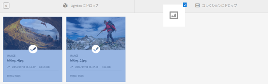
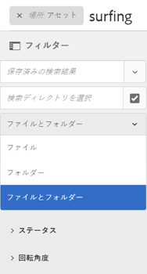
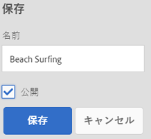
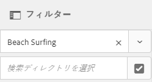
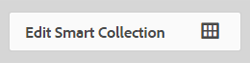
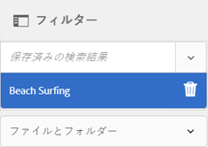
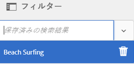

# コレクションの管理 {#managing-collections}

コレクションとは、Adobe Experience Manager Assets 内の一連のアセットです。コレクションを使用して、ユーザー間でアセットを共有します。セットは、静的コレクションまたは検索結果に基づく動的コレクションにすることができます。

フォルダーとは異なり、1 つのコレクションに異なる複数の場所のアセットを含めることができます。異なるレベルの特権（表示、編集など）が割り当てられている様々なユーザーとコレクションを共有できます。

1 人のユーザーと複数のコレクションを共有できます。各コレクションには、アセットへの参照が含まれます。アセットの参照整合性はコレクション間で維持されます。

コレクションは、アセットを照合する方法に基づいて次のタイプに分かれます。

* アセット、フォルダーおよび他のコレクションの静的な参照リストを含むコレクション。

* 検索条件に基づいたアセットを動的に含むスマートコレクション。

## コレクションコンソールのアクセス {#navigating-the-collections-console}

コレクションを開くには **[!UICONTROL 、Experience Managerインターフェイスで]**、 **[!UICONTROL アセット]** / **[!UICONTROL コレクションに移動します]**。

## コレクションを作成 {#creating-a-collection}

[静的な参照](#creating-a-collection-with-static-references)を含むコレクション、または[検索条件ベースのフィルター](#creating-a-smart-collection)に基づいたコレクションを作成できます。Lightbox からコレクションを作成することもできます。

### 静的な参照を含むコレクションの作成 {#creating-a-collection-with-static-references}

静的な参照を含むコレクションを作成できます。例えば、アセット、フォルダー、コレクション、スピンセット、画像セットへの参照を含むコレクションなどがあります。

1. **[!UICONTROL コレクション]**&#x200B;コンソールに移動します。
1. From the toolbar, click **[!UICONTROL Create]**.
1. **[!UICONTROL コレクションを作成]**&#x200B;ページで、コレクションのタイトルとオプションの説明を入力します。
1. メンバーをコレクションに追加して、適切な権限を割り当てます。または、「**[!UICONTROL 公開コレクション]**」を選択すると、すべてのユーザーがコレクションにアクセスできるようになります。

   >[!NOTE]
   >
   >メンバーが他のユーザーとコレクションを共有するには、`dam-users` グループにパス `home/users` への読み取り権限を付与します。ユーザーがポップアップリストでコレクションを表示できるようにするには、`/content/dam/collections` の場所への権限をユーザーに与えます。または、ユーザーを `dam-users` グループのメンバーにします。

1. （オプション）コレクションのサムネール画像を追加します。
1. Click **[!UICONTROL Create]**, and then click **[!UICONTROL OK]** to close the dialog. 指定されたタイトルとプロパティを含むコレクションがコレクションコンソールに表示されます。

   >[!NOTE]
   >
   >Experience Manager Assets では、アセットフォルダーのレビュータスクを作成するのと同じ方法で、コレクションのレビュータスクを作成できます。

   コレクションにアセットを追加するには、Assets ユーザーインターフェイスに移動します。詳しくは、[コレクションへのアセットの追加](#adding-assets-to-a-collection)を参照してください。

### ドロップゾーンを使用したコレクションの作成 {#create-collections-using-dropzone}

Assets UI からコレクションに、アセットをドラッグできます。コレクションのコピーを作成して、そこにアセットをドラッグすることもできます。

1. Assets ユーザーインターフェイスで、コレクションに追加するアセットを選択します。
1. アセットを「**[!UICONTROL コレクションにドロップ]**」ゾーンにドラッグします。または、ツールバー **[!UICONTROL から「コレクションへ]** 」をクリックします。

   

1. In the **[!UICONTROL Add To Collection]** page, click **[!UICONTROL Create Collection]** from the toolbar.

   If you want to add the assets to an existing collection, select it from the page, and click **[!UICONTROL Add]**. デフォルトでは、最も新しく更新されたコレクションが選択されます。

1. **[!UICONTROL 新しいコレクションを作成]**&#x200B;ダイアログで、コレクションの名前を指定します。すべてのユーザーがコレクションにアクセスできるようにする場合は、「**[!UICONTROL 公開コレクション]**」を選択します。
1. Click **[!UICONTROL Continue]** to create the collection.

### スマートコレクションの作成 {#creating-a-smart-collection}

スマートコレクションでは、検索条件を使用してアセットを動的に設定します。スマートコレクションの作成時に使用できるのはファイルのみであり、フォルダーや、ファイルとフォルダーは使用できません。

スマートコレクションを作成するには、次の手順に従います。

1. アセットユーザーインターフェイスに移動し、「検索」をクリックします。

1. 「Omnisearch」ボックスに検索キーワードを入力し、を押し `Enter`ます。 フィルターパネルを開き、検索フィルターを適用します。

1. 「**[!UICONTROL ファイルとフォルダー]**」リストから「**[!UICONTROL ファイル]**」を選択します。

   

1. Click **[!UICONTROL Save Smart Collection]**.

1. コレクション名を指定します。「**[!UICONTROL 公開]**」を選択して、閲覧者の役割を持つ DAM ユーザーグループをスマートコレクションに追加します。

   

   >[!NOTE]
   >
   >If you select **[!UICONTROL Public]**, the smart collection becomes available to everyone with the owner role after you create it. 「**[!UICONTROL 公開]**」オプションを選択解除すると、DAM ユーザーグループとスマートコレクションの関連付けが解除されます。

1. Click **[!UICONTROL Save]** to create the smart collection, and then close the message box to complete the process.

   新しいスマートコレクションは「**[!UICONTROL 保存済みの検索結果]**」リストにも追加されます。

   

   「**[!UICONTROL コレクションを作成]**」ボタンのラベルが「**[!UICONTROL スマートコレクションを編集]**」に変わります。スマートコレクションの設定を編集するには、「**[!UICONTROL ファイルとフォルダー]**」リストから「**[!UICONTROL ファイル]**」を選択します。Then, Click the **[!UICONTROL Edit Smart Selection]** button.

   

## コレクションへのアセットの追加 {#adding-assets-to-a-collection}

参照元のアセットまたはフォルダーのリストを含むコレクションにアセットを追加できます。スマートコレクションでは、検索クエリを使用してアセットを設定します。そのため、アセットおよびフォルダーへの静的な参照はスマートコレクションに適用できません。

1. アセットユーザーインターフェイスで、アセットを選択し、ツールバー **[!UICONTROL の「コレクションへ]** 」をクリックします。

   

   または、インターフェイスの「コレクションに **[!UICONTROL ドロップ]** 」領域にアセットをドラッグすることもできます。 領域追加のラベルが「ドロップ」に変わった場合のアセット追加。 ****

1. **[!UICONTROL コレクションに追加]**&#x200B;ページで、アセットを追加するコレクションを選択します。

1. Click **[!UICONTROL Add]**, and then close the confirmation message. アセットがコレクションに追加されます。

## スマートコレクションの編集 {#editing-a-smart-collection}

スマートコレクションは検索を保存することによって構築されるので、内容を変更するには、[保存済みの検索](#saved-searches)の検索パラメーターを変更します。

1. アセットユーザーインターフェイスで、ツールバーの検索オプション  「」をクリックします。
1. オムニサーチボックスにカーソルを置き、Enter キーを押します。
1. Experience Managerインターフェイスで、フィルターパネルを開きます。
1. 「**[!UICONTROL 保存済みの検索結果]**」リストから、変更するスマートコレクションを選択します。検索パネルに、該当する保存済みの検索用に設定されているフィルターが表示されます。

   

1. 「**[!UICONTROL ファイルとフォルダー]**」リストから「**[!UICONTROL ファイル]**」を選択します。
1. 必要に応じて、1 つ以上のフィルターを変更します。Click **[!UICONTROL Edit Smart Collection]**.

   スマートコレクションの名前を編集することもできます。

   

1. 「**[!UICONTROL 保存]**」をクリックします。**[!UICONTROL スマートコレクションを編集]**&#x200B;ダイアログが表示されます。
1. Click **[!UICONTROL Overwrite]** to replace the original smart collection with the edited collection. または、「**[!UICONTROL 名前を付けて保存]**」を選択して、編集済みのコレクションを個別に保存します。
1. In the confirmation dialog, Click **[!UICONTROL Save]** to complete the process.

## コレクションのメタデータの表示と編集 {#viewing-and-editing-collection-metadata}

コレクションのメタデータは、コレクションに関するデータ（追加されたタグを含む）で構成されます。

1. From the [!UICONTROL Collections] console, select a collection and click **[!UICONTROL Properties]** from the toolbar.
1. **[!UICONTROL コレクションメタデータ]**&#x200B;ページの「**[!UICONTROL 基本]**」タブと「**[!UICONTROL 詳細]**」タブでコレクションメタデータを表示します。
1. 必要に応じて、メタデータを変更します。 変更を保存するには、ツールバーの **[!UICONTROL 「保存して閉じる]** 」をクリックします。

## 複数のコレクションのメタデータを一括で編集 {#editing-collection-metadata-in-bulk}

複数のコレクションのメタデータを同時に編集できます。この機能により、複数のコレクションで共通のメタデータをすばやくレプリケートできます。

1. コレクションコンソールで、2つ以上のコレクションを選択します。
1. ツールバーで、「 **[!UICONTROL プロパティ]**」をクリックします。
1. 必要に応じて、**[!UICONTROL コレクションメタデータ]**&#x200B;ページの「**[!UICONTROL 基本]**」タブと「**[!UICONTROL 詳細]**」タブでメタデータを編集します。
1. 特定のコレクションのメタデータのプロパティを表示するには、コレクションリストの残りのコレクションの選択を解除します。メタデータエディターのフィールドには、その特定のコレクションのメタデータが入力されています。

   >[!NOTE]
   >
   >* In the [!UICONTROL Properties] page, you can remove collections from the list of collections by deselecting them. コレクションリストは、デフォルトではすべてのコレクションが選択されています。Experience Managerは、削除したコレクションのメタデータを更新しません。
   >* リストの上部で、「**[!UICONTROL タイトル]**」の横にあるチェックボックスをオンにして、コレクションの選択とリストの消去を切り替えます。

1. ツールバーの「 **[!UICONTROL 保存して閉じる]** 」をクリックし、確認ダイアログを閉じます。
1. To append the new metadata with the existing metadata, select **[!UICONTROL Append mode]**. このオプションを選択しないと、フィールド内の既存のメタデータが新しいメタデータに置換されます。「**[!UICONTROL 送信]**」をクリックします。

   >[!NOTE]
   >
   >選択したコレクションに追加したメタデータは、これらのコレクションの以前のメタデータを上書きします。 [!UICONTROL 追加モードを使用して] 、複数の値を含むことができるフィールド内の既存のメタデータに新しい値を追加します。 単一値フィールドは常に上書きされます。 「[!UICONTROL タグ]」フィールドに追加する新しいタグはすべて、メタデータのタグの既存のリストに追加されます。

メタデータの[!UICONTROL プロパティ]ページをカスタマイズ（メタデータのプロパティの追加、編集、削除など）するには、スキーマエディターを使用します。

>[!TIP]
>
>バルク編集方法は、コレクションで使用可能なアセットに対して機能します。 フォルダー全体で使用可能なアセットまたは共通の基準に一致するアセットについては、[検索後にメタデータを一括更新する](/help/assets/search-assets.md#metadataupdates)ことが可能です。

## コレクションの検索 {#searching-collections}

コレクションコンソールからコレクションを検索できます。「Omnisearch」ボックスでキーワードを使用して検索を行うと、Assetsはコレクション名、メタデータおよびコレクションに追加されたタグを検索します。

トップレベルからコレクションを検索する場合は、個々のコレクションのみ検索結果に返されます。コレクション内のアセットやフォルダーは除外されます。他のすべての場合（例：個々のコレクション内またはフォルダー階層内）では、関連するすべてのアセット、フォルダー、コレクションが返されます。

## Search within collections {#searching-within-collections}

コレクションコンソールで、コレクションをクリックして開きます。

コレクション内でのExperience Manager検索は、表示しているコレクション内のアセット（およびアセットのタグとメタデータ）に制限されます。 フォルダー内を検索すると、現在のフォルダー内の一致するアセットと子フォルダーがすべて返されます。コレクション内を検索すると、一致するアセット、一致するフォルダー、（そのコレクションの直接のメンバーである）他の一致するコレクションのみ返されます。

## コレクション設定の編集 {#editing-collection-settings}

コレクション設定（タイトルや説明など）を編集したり、コレクションにメンバーを追加したりできます。

1. Select a collection, and click **[!UICONTROL Settings]** in the toolbar. または、コレクションのサムネールの&#x200B;**[!UICONTROL 設定]**&#x200B;クイックアクションを使用します。
1. Modify the collection settings in the **[!UICONTROL Collection Settings]** page. For example, modify the collection title, descriptions, members, and permissions as discussed in [Adding Collections](#creating-a-collection).

1. 変更を保存するには、「 **[!UICONTROL 保存]**」をクリックします。

## コレクションの削除 {#deleting-a-collection}

1. コレクションコンソールで、1つまたは複数のコレクションを選択し、ツールバーの「削除」をクリックします。

1. In the dialog, click **[!UICONTROL Delete]** to confirm the delete action.

   >[!NOTE]
   >
   >You can also delete smart collections by [deleting saved searches](#saved-searches).

## コレクションのダウンロード {#downloading-a-collection}

コレクションをダウンロードすると、フォルダーや子コレクションを含む、コレクション内のアセットの階層全体がダウンロードされます。

1. コレクションコンソールから、ダウンロードする 1 つ以上のコレクションを選択します。
1. ツールバーで、「 **[!UICONTROL ダウンロード]**」をクリックします。
1. **[!UICONTROL ダウンロード]**&#x200B;ダイアログで、「**[!UICONTROL ダウンロード]**」をクリックします。コレクション内のアセットのレンディションをダウンロードする場合は、「**[!UICONTROL レンディション]**」を選択します。コレクションの所有者に電子メールで通知を送信するには、「**[!UICONTROL 電子メール]**」オプションを選択します。

   ダウンロードするコレクションを選択すると、そのコレクションの下位のフォルダーの階層全体がダウンロードされます。ダウンロードする各コレクション（親コレクションの下にネストされている子コレクションのアセットを含む）を個々のフォルダーに格納するには、「**[!UICONTROL アセットごとに別のフォルダーを作成]**」を選択します。

## ネストされたコレクションの作成 {#creating-nested-collections}

別のコレクションにコレクションを追加できます。これにより、ネストされたコレクションが作成されます。

1. From the Collections console, select the desired collection or group of collections, and click **[!UICONTROL To Collection]** in the toolbar.

1. **[!UICONTROL コレクションに追加]**&#x200B;ページで、コレクションを追加するコレクションを選択します。

   >[!NOTE]
   >
   >**[!UICONTROL コレクションに追加]**&#x200B;ページでは、直近に更新されたコレクションがデフォルトで選択されています。

1. 「**[!UICONTROL 追加]**」をクリックします。ターゲットコレクションにコレクションが追加されたことを確認するメッセージが&#x200B;**[!UICONTROL 宛先を選択]**&#x200B;ページに表示されます。メッセージを閉じてプロセスを完了します。

>[!NOTE]
>
>スマートコレクションをネストすることはできません。つまり、スマートコレクションに他のコレクションを含めることはできません。

## 保存済みの検索結果 {#saved-searches}

Assets ユーザーインターフェイスでは、特定のルール、検索条件またはカスタム検索ファセットに基づいてアセットの検索または絞り込みをおこなうことができます。その結果を&#x200B;**[!UICONTROL 保存済みの検索結果]**&#x200B;として保存すると、後でフィルターパネルの「**[!UICONTROL 保存済みの検索結果]**」リストからアクセスできます。保存済みの検索結果を作成すると、スマートコレクションも作成されます。

スマートコレクションの作成時には、保存済みの検索結果が作成されます。スマートコレクションは、「**[!UICONTROL 保存済みの検索結果]**」リストに自動的に追加されます。The [!UICONTROL Saved Searches] query for the collection is saved in the `dam:query` property in CRXDE at the relative location `/content/dam/collections/`. 保存できる検索と、リストに表示される保存済みの検索に制限はありません。

>[!NOTE]
>
>静的なコレクションを共有する場合と同じ方法でスマートコレクションを共有できます。

保存済みの検索結果の編集操作は、スマートコレクションを編集する際と同じです。For details, see [edit a smart collection](#editing-a-smart-collection).

保存済みの検索結果を削除するには、次の手順に従います。

1. アセットユーザーインターフェイスで、検索 をクリックします。
1. Omnisearchフィールドにカーソルを置き、Returnキーを押します。
1. Experience Managerインターフェイスで、フィルターパネルを開きます。
1. From the **[!UICONTROL Saved Searches]** list, click **[!UICONTROL Delete]** next to the smart collection that you want to delete.

   

1. In the dialog, click **[!UICONTROL Delete]** to delete the saved search.

## コレクションでのワークフローの実行 {#running-a-workflow-on-a-collection}

コレクション内のアセットのワークフローを実行できます。コレクションにネストされたコレクションが含まれている場合は、ネストされたコレクション内のアセットでもワークフローが実行されます。ただし、コレクションとネストされたコレクションでアセットが重複する場合、そのアセットのワークフローは 1 回しか実行されません。

1. ア **[!UICONTROL セット]** / **[!UICONTROL コレクションを開きます]**。 特定のコレクションに対してワークフローを実行するには、そのコレクションを選択します。
1. Open **[!UICONTROL Timeline]** rail. [ ![山形]をクリックし](assets/do-not-localize/chevron-up-icon.png) 、[ **[!UICONTROL 開始ワークフロー]**]をクリックします。
1. 「**[!UICONTROL ワークフローを開始]**」セクションで、リストからワークフローモデルを選択します。例えば、「**[!UICONTROL DAM アセットの更新]**」モデルを選択します。
1. Enter a title for the workflow and click **[!UICONTROL Start]**.
1. ダイアログで、「**[!UICONTROL 続行]**」をクリックします。ワークフローは、選択したコレクション内のすべてのアセットを処理します。

>[!MORELIKETHIS]
>
>* [Experience Managerアセットの電子メール通知の設定](/help/sites-administering/notification.md#assetsconfig)
>* [コレクション用レビュータスクの作成](bulk-approval.md)

