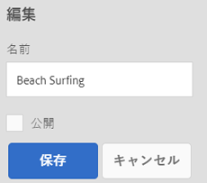

# コレクションの管理 {#managing-collections}

コレクションは、Adobe Experience Manager Assets内のアセットのセットです。 コレクションを使用して、ユーザー間でアセットを共有します。セットは、静的コレクションまたは検索結果に基づく動的コレクションにすることができます。

フォルダーとは異なり、コレクションには異なる場所のアセットを含めることができます。 異なるレベルの権限（表示、編集など）が割り当てられている様々なユーザーとコレクションを共有できます。

1 人のユーザーと複数のコレクションを共有できます。各コレクションには、アセットへの参照が含まれます。アセットの参照整合性はコレクション間で維持されます。

コレクションは、アセットを照合する方法に基づいて次のタイプに分かれます。

* アセット、フォルダーおよび他のコレクションの静的参照リストを含むコレクションです。

* 検索条件に基づいてアセットを動的に含めるスマートコレクション。

## コレクションコンソールにアクセスする {#navigating-the-collections-console}

コレクションを開く **[!UICONTROL には]**、Experience Managerのロゴをタップまたはクリックします。 From the navigation page, go to **[!UICONTROL Assets]** > **[!UICONTROL Collections]**.

## コレクションを作成 {#creating-a-collection}

You can create a collection either with [static references](#creating-a-collection-with-static-references) or based on a [search criteria-based filter](#creating-a-smart-collection). You can also create a collection from a lightbox.

### Create a collection with static references {#creating-a-collection-with-static-references}

静的な参照を含むコレクションを作成できます。例えば、アセット、フォルダー、コレクション、スピンセット、画像セットへの参照を含むコレクションなどがあります。

1. **[!UICONTROL コレクション]**&#x200B;コンソールに移動します。
1. From the toolbar, tap/click **[!UICONTROL Create]**.
1. **[!UICONTROL コレクションを作成]**&#x200B;ページで、コレクションのタイトルとオプションの説明を入力します。
1. メンバーをコレクションに追加して、適切な権限を割り当てます。または、「**[!UICONTROL 公開コレクション]**」を選択すると、すべてのユーザーがコレクションにアクセスできるようになります。

   >[!NOTE]
   >
   >メンバーが他のユーザーとコレクションを共有するには、`dam-users` グループにパス `home/users` への読み取り権限を付与します。Give permission to the users at `/content/dam/collections` location to allow the users to view the Collections in pop up lists. または、ユーザーを `dam-users` グループのメンバーにします。

1. （オプション）コレクションのサムネール画像を追加します。
1. 「**[!UICONTROL 作成]**」をタップまたはクリックしてから、「**[!UICONTROL OK]**」をタップまたはクリックしてダイアログを閉じます。指定されたタイトルとプロパティを含むコレクションがコレクションコンソールに表示されます。

   >[!NOTE]
   >
   >Experience Manager Assetsでは、アセットフォルダーのレビュータスクを作成するのと同じ方法で、コレクションのレビュータスクを作成できます。

   コレクションにアセットを追加するには、Assets ユーザーインターフェイスに移動します。For details, see [Add assets to a collection](#adding-assets-to-a-collection).

### Create collections using dropzone {#create-collections-using-dropzone}

Assets の UI からコレクションに、アセットをドラッグできます。コレクションのコピーを作成して、そこにアセットをドラッグすることもできます。

1. アセットユーザーインターフェイスから、コレクションに追加するアセットを選択します。
1. Drag the assets to the **[!UICONTROL Drop in Collection]** zone. または、ツールバーの「**[!UICONTROL コレクションに追加]**」アイコンをタップまたはクリックします。

   

1. **[!UICONTROL コレクションに追加]**&#x200B;ページで、ツールバーの「**[!UICONTROL コレクションを作成]**」アイコンをタップまたはクリックします。

   既存のコレクションにアセットを追加する場合は、ページからコレクションを選択して、「**[!UICONTROL 追加]**」をタップまたはクリックします。デフォルトでは、最も新しく更新されたコレクションが選択されます。

1. **[!UICONTROL 新しいコレクションを作成]**&#x200B;ダイアログで、コレクションの名前を指定します。すべてのユーザーがコレクションにアクセスできるようにする場合は、「**[!UICONTROL 公開コレクション]**」を選択します。
1. Tap/click **[!UICONTROL Continue]** to create the collection.

### スマートコレクションの作成 {#creating-a-smart-collection}

スマートコレクションでは、検索条件を使用してアセットを動的に設定します。スマートコレクションの作成時に使用できるのはファイルのみであり、フォルダーや、ファイルとフォルダーは使用できません。

スマートコレクションを作成するには、次の手順に従います。

1. アセットユーザーインターフェイスに移動し、検索アイコンをタップまたはクリックします。

1. 「Omnisearch」ボックスに検索キーワードを入力し、Enterキーを押します。 フィルターパネルを開き、検索フィルターを適用します。

1. 「**[!UICONTROL ファイルとフォルダー]**」リストから「**[!UICONTROL ファイル]**」を選択します。

   

1. 「**[!UICONTROL スマートコレクションを保存]**」をタップまたはクリックします。

1. コレクション名を指定します。「**[!UICONTROL 公開]**」を選択して、閲覧者の役割を持つ DAM ユーザーグループをスマートコレクションに追加します。

   

   >[!NOTE]
   >
   >If you select **[!UICONTROL Public]**, the smart collection becomes available to everyone with the owner role after you create it. 「**[!UICONTROL 公開]**」オプションを選択解除すると、DAM ユーザーグループとスマートコレクションの関連付けが解除されます。

1. 「**[!UICONTROL 保存]**」をタップまたはクリックしてスマートコレクションを作成し、メッセージボックスを閉じてプロセスを完了します。

   The new smart collection is also added to the **[!UICONTROL Saved Searches]** list.

   

   「**[!UICONTROL コレクションを作成]**」ボタンのラベルが「**[!UICONTROL スマートコレクションを編集]**」に変わります。スマートコレクションの設定を編集するには、「**[!UICONTROL ファイルとフォルダー]**」リストから「**[!UICONTROL ファイル]**」を選択します。次に、「**[!UICONTROL スマートコレクションを編集]**」ボタンをタップまたはクリックします。

   

## Add assets to a collection {#adding-assets-to-a-collection}

参照されているアセットまたはフォルダーのリストを含むコレクションにアセットを追加できます。スマートコレクションでは、検索クエリを使用してアセットを設定します。そのため、アセットおよびフォルダーへの静的な参照はスマートコレクションに適用できません。

1. In the Assets user interface, select the asset and tap/click the **[!UICONTROL To Collection]** icon from the toolbar.

   

   または、インターフェイスの「コレクションにドロップ **[!UICONTROL 」領域にアセットを]** 「ドラッグ」できます。 領域のラベルが「ドロップして追加」に変わったら、アセ **[!UICONTROL ットを追加します]**。

1. In the **[!UICONTROL Add To Collection]** page, select the collection to which you want to add the asset.

1. 「**[!UICONTROL 追加]**」をタップまたはクリックして、確認メッセージを閉じます。アセットがコレクションに追加されます。

## スマートコレクションの編集 {#editing-a-smart-collection}

Smart collections are built by saving a search so you can alter their content by modifying the search parameters of the [saved search](#editing-saved-searches).

1. アセットユーザーインターフェイスで、ツールバーの検索アイコンをタップまたはクリックします。

   

1. 「Omnisearch」ボックスにカーソルを置き、Returnキーを押します。
1. グローバルナビゲーションアイコンをタップまたはクリックして、フィルターパネルを表示します。
1. 「**[!UICONTROL 保存済みの検索結果]**」リストから、変更するスマートコレクションを選択します。検索パネルには、保存済みの検索用に設定されたフィルターが表示されます。

   

1. 「**[!UICONTROL ファイルとフォルダー]**」リストから「**[!UICONTROL ファイル]**」を選択します。
1. 必要に応じて、1 つ以上のフィルターを変更します。Tap/click **[!UICONTROL Edit Smart Collection]**.

   スマートコレクションの名前を編集することもできます。

   

1. 「**[!UICONTROL 保存]**」をタップまたはクリックします。**[!UICONTROL スマートコレクションを編集]**&#x200B;ダイアログが表示されます。
1. 「**[!UICONTROL 上書き]**」をタップまたはクリックして、元のスマートコレクションを編集済みのコレクションに置き換えます。または、「**[!UICONTROL 名前を付けて保存]**」を選択して、編集済みのコレクションを個別に保存します。
1. 確認ダイアログで、「**[!UICONTROL 保存]**」をタップまたはクリックしてプロセスを完了します。

## View and edit collection metadata {#viewing-and-editing-collection-metadata}

コレクションのメタデータは、コレクションに関するデータ（追加されたタグを含む）で構成されます。

1. From the Collections console, select a collection and tap/click the **[!UICONTROL Properties]** icon from the toolbar.
1. **[!UICONTROL コレクションメタデータ]**&#x200B;ページの「**[!UICONTROL 基本]**」タブと「**[!UICONTROL 詳細]**」タブでコレクションメタデータを表示します。
1. Modify the metadata, as necessary, and then tap/click **[!UICONTROL Save &amp; Close]** from the toolbar to save the changes.

### Edit collection metadata in bulk {#editing-collection-metadata-in-bulk}

複数のコレクションのメタデータを同時に編集できます。この機能により、複数のコレクションで共通のメタデータをすばやくレプリケートできます。

1. コレクションコンソールで、メタデータを編集する 2 つ以上のコレクションを選択します。
1. From the toolbar, tap/click the **[!UICONTROL Properties]** icon.
1. 必要に応じて、**[!UICONTROL コレクションメタデータ]**&#x200B;ページの「**[!UICONTROL 基本]**」タブと「**[!UICONTROL 詳細]**」タブでメタデータを編集します。
1. Tap/click **[!UICONTROL Save &amp; Close]** from the toolbar, and then close the confirmation dialog to complete the process.
1. To append the new metadata with the existing metadata, select **[!UICONTROL Append mode]**. このオプションを選択しないと、フィールド内の既存のメタデータが新しいメタデータに置換されます。「**[!UICONTROL 送信]**」をタップまたはクリックします。

   >[!NOTE]
   >
   >追加モードは、複数の値を指定できるフィールドに対してのみ機能します。1 つの値のみを指定できるフィールドの場合、「**[!UICONTROL 追加モード]**」を選択しても、フィールド内の既存の値に新しいメタデータが追加されません。

## コレクションの検索 {#searching-collections}

コレクションコンソールからコレクションを検索できます。オムニサーチボックスでキーワードを使用して検索する場合、AEM Assets はコレクション名、メタデータおよびコレクションに追加されたタグを検索します。

トップレベルからコレクションを検索する場合は、個々のコレクションのみ検索結果に返されます。コレクション内のアセットやフォルダーは除外されます。他のすべての場合（例：個々のコレクション内またはフォルダー階層内）では、関連するすべてのアセット、フォルダー、コレクションが返されます。

## コレクション内の検索 {#searching-within-collections}

コレクションコンソールで、コレクションをタップまたはクリックして開きます。

コレクション内では、AEM アセットの検索は、表示しているコレクション内のアセット（およびそのタグとメタデータ）に制限されます。フォルダー内を検索すると、現在のフォルダー内の一致するアセットと子フォルダーがすべて返されます。コレクション内を検索すると、一致するアセット、一致するフォルダー、（そのコレクションの直接のメンバーである）他の一致するコレクションのみ返されます。

## コレクション設定の編集 {#editing-collection-settings}

コレクション設定（タイトルや説明など）を編集したり、コレクションにメンバーを追加したりできます。

1. Select a collection, and tap/click the **[!UICONTROL Settings]** icon in the toolbar. または、コレクションのサムネールの&#x200B;**[!UICONTROL 設定]**&#x200B;クイックアクションを使用します。
1. Modify the collection settings in the **[!UICONTROL Collection Settings]** page. For example, modify the collection title, descriptions, members, and permissions as discussed in [Adding Collections](#creating-a-collection).

1. 変更を保存するには、「保存」をタップまたはクリ **[!UICONTROL ックしま]**&#x200B;す。

## コレクションの削除 {#deleting-a-collection}

1. コレクションコンソールから、1つ以上のコレクションを選択し、ツールバーの削除アイコンをタップまたはクリックします。

   

1. In the dialog, tap/click **[!UICONTROL Delete]** to confirm the delete action.

   >[!NOTE]
   >
   >You can also delete smart collections by [deleting saved searches](#deleting-saved-searches).

## コレクションのダウンロード {#downloading-a-collection}

コレクションをダウンロードすると、フォルダーや子コレクションを含む、コレクション内のアセットの階層全体がダウンロードされます。

1. コレクションコンソールから、ダウンロードする 1 つ以上のコレクションを選択します。
1. ツールバーで、ダウンロードアイコンをタップまたはクリックします。
1. **[!UICONTROL ダウンロード]**&#x200B;ダイアログで、「**[!UICONTROL ダウンロード]**」をタップまたはクリックします。コレクション内のアセットのレンディションをダウンロードする場合は、「**[!UICONTROL レンディション]**」を選択します。コレクションの所有者に電子メールで通知を送信するには、「**[!UICONTROL 電子メール]**」オプションを選択します。

   ダウンロードするコレクションを選択すると、そのコレクションの下位のフォルダーの階層全体がダウンロードされます。To include each collection you download (including assets in child collections nested under the parent collection) in an individual folder, select **[!UICONTROL Create separate folder for each asset]**.

## Edit metadata properties of multiple collections {#edit-metadata-in-bulk}

Adobe Enterprise Manager (AEM) Assetsを使用すると、多くのコレクションのメタデータを一括で編集できます。 プロパティペ [!UICONTROL ージを使用して] 、複数のコレクションに対してメタデータの変更を実行します。例えば、メタデータのプロパティを共通の値に変更したり、タグを追加または変更したりします。

To customize the metadata [!UICONTROL Properties] page, including adding, modifying, deleting metadata properties, use the Schema editor.

>[!NOTE]
>
>バルク編集方法は、コレクションで使用可能なアセットに対して機能します。 フォルダー全体で使用可能なアセットまたは共通の基準に一致するアセットについては、[検索後にメタデータを一括更新する](/help/assets/search-assets.md#metadataupdates)ことが可能です。

1. コレクションコンソールから、編集するコレクションを選択します。
1. From the toolbar, tap/click **[!UICONTROL Properties]** to open the [!UICONTROL Properties] page for the selected collections.
1. 様々なタブで選択したコレクションのメタデータプロパティを変更します。

   >[!NOTE]
   >
   >選択したコレクションにメタデータを追加すると、そのコレクションのタグ以外の以前のメタデータが上書きされます。Any tags you add in the **[!UICONTROL Tags]** field, are appended to the existing list of tags in the metadata.

1. 特定のコレクションのメタデータのプロパティを表示するには、コレクションリストの残りのコレクションの選択を解除します。メタデータエディターのフィールドには、その特定のコレクションのメタデータが入力されています。

   >[!NOTE]
   >
   >* コレクションのプロパティページで、コレクションのリストからコレクションの選択を解除することで、そのコレクションを削除できます。コレクションリストは、デフォルトではすべてのコレクションが選択されています。削除するコレクションのメタデータは更新されていません。
   >* At the top of the list, select the check box near **[!UICONTROL Title]** to toggle between selecting the collections and clearing the list.

1. 変更内容を保存します。

## ネストされたコレクションの作成 {#creating-nested-collections}

別のコレクションにコレクションを追加できます。これにより、ネストされたコレクションが作成されます。

1. From the Collections console, select the desired collection or group of collections, and tap or click **[!UICONTROL To Collection]** in the toolbar.

1. **[!UICONTROL コレクションに追加]**&#x200B;ページで、コレクションを追加するコレクションを選択します。

   >[!NOTE]
   >
   >The most recently updated collection is selected by default in the **[!UICONTROL Add To Collection]** page.

1. 「**[!UICONTROL 追加]**」をタップまたはクリックします。ターゲットコレクションにコレクションが追加されたことを確認するメッセージが&#x200B;**[!UICONTROL 宛先を選択]**&#x200B;ページに表示されます。メッセージを閉じてプロセスを完了します。

>[!NOTE]
>
>スマートコレクションをネストすることはできません。つまり、スマートコレクションに他のコレクションを含めることはできません。

## 保存済みの検索結果 {#saved-searches}

Assets ユーザーインターフェイスでは、特定のルール、検索条件またはカスタム検索ファセットに基づいてアセットの検索または絞り込みをおこなうことができます。その結果を&#x200B;**[!UICONTROL 保存済みの検索結果]**&#x200B;として保存すると、後でフィルターパネルの「**[!UICONTROL 保存済みの検索結果]**」リストからアクセスできます。保存済みの検索結果を作成すると、スマートコレクションも作成されます。

スマートコレクションの作成時には、保存済みの検索結果が作成されます。スマートコレクションは、「**[!UICONTROL 保存済みの検索結果]**」リストに自動的に追加されます。コレクションの保存済みの検索結果のクエリは、相対的な場所 `/content/dam/collections/`にある crxde の `dam:query` プロパティに保存されます。

>[!NOTE]
>
>静的なコレクションを共有する場合と同じ方法でスマートコレクションを共有できます。

保存済みの検索結果の編集操作は、スマートコレクションを編集する際と同じです。For details, see [edit a smart collection](#editing-a-smart-collection).

保存済みの検索結果を削除するには、次の手順に従います。

1. アセットユーザーインターフェイスで、ツールバーの検索アイコンをタップまたはクリックします。

   

1. Omnisearchフィールドにカーソルを置き、Enterキーを押します。

1. グローバルナビゲーションアイコンをクリックまたはタップして、フィルターパネルを表示します。

1. From the **[!UICONTROL Saved Searches]** list, tap/click **[!UICONTROL Delete]** next to the smart collection that you want to delete.

   

1. In the dialog, tap/click **[!UICONTROL Delete]** to delete the saved search.

## Execute a workflow on a collection {#running-a-workflow-on-a-collection}

コレクション内のアセットのワークフローを実行できます。コレクションにネストされたコレクションが含まれている場合は、ネストされたコレクション内のアセットでもワークフローが実行されます。ただし、コレクションとネストされたコレクションでアセットが重複する場合、そのアセットのワークフローは 1 回しか実行されません。

1. コレクションコンソールから、ワークフローを実行するコレクションを選択します。
1. Tap/click the GlobalNav icon, and choose **[!UICONTROL Timeline]** from the list.
1. タイムラインで、下部のキャレットアイコンをクリックまたはタップして、「**[!UICONTROL ワークフローを開始]**」をタップまたはクリックします。

   

1. 「**[!UICONTROL ワークフローを開始]**」セクションで、リストからワークフローモデルを選択します。例えば、「**[!UICONTROL DAM アセットの更新]**」モデルを選択します。
1. ワークフローのタイトルを入力して、「**[!UICONTROL 開始]**」をタップまたはクリックします。
1. 確認ダイアログで「**[!UICONTROL 続行]**」をタップまたはクリックします。コレクション内のすべてのアセットでワークフローが実行されます。

>[!MORELIKETHIS]
>
>* [Experience Manager Assets電子メール通知の設定](/help/sites-administering/notification.md#assetsconfig)
>* [複数コレクションのメタデータプロパティの編集](managing-multiple-assets.md)
>* [コレクション用レビュータスクの作成](bulk-approval.md)

