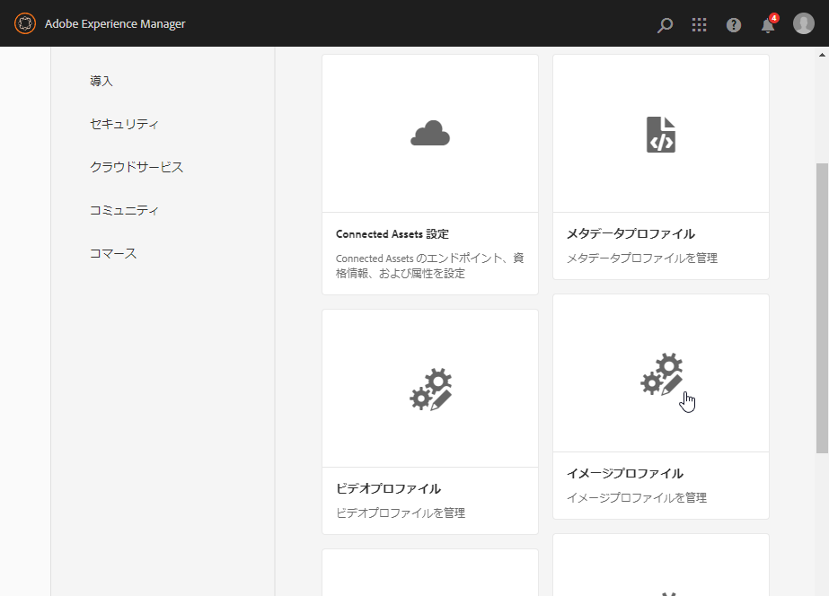
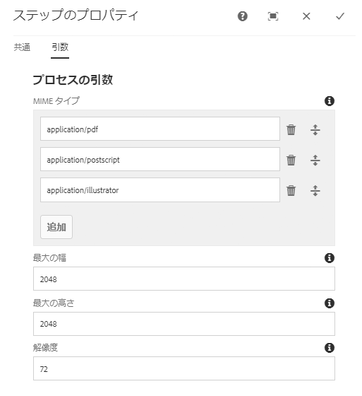
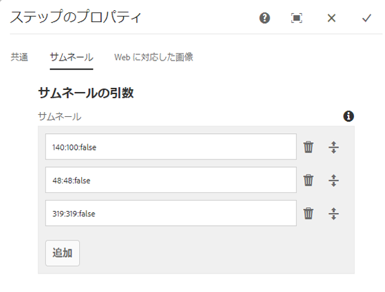
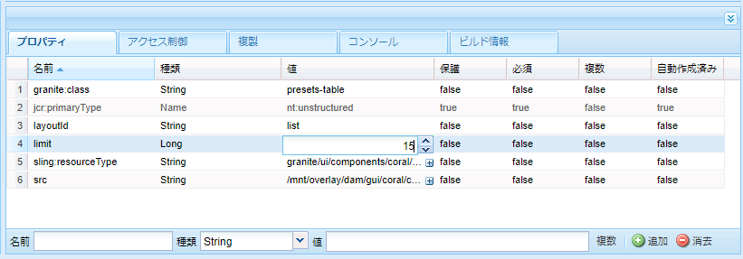
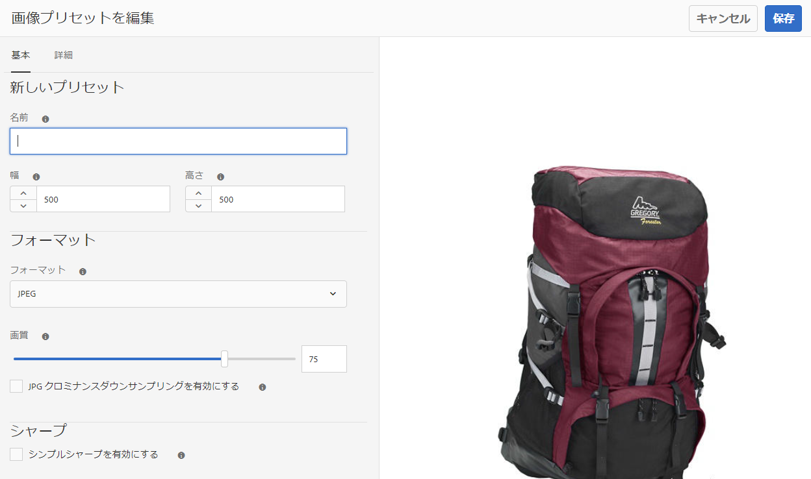
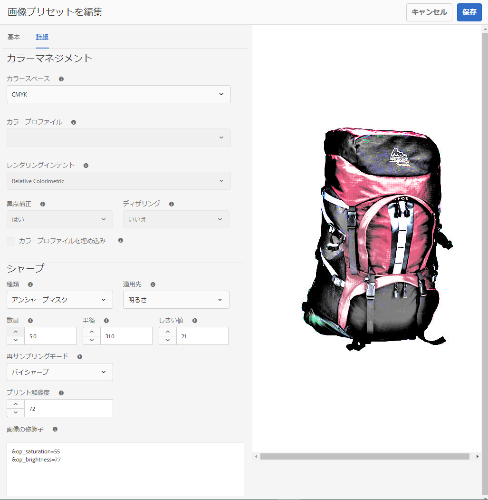

# Dynamic Media画像プリセットの管理{#managing-image-presets}

画像プリセットを使用すると、AEM Assets は異なるサイズや異なる形式の画像、あるいは動的に生成された他の画像プロパティを設定した画像を動的に配信できます。各画像プリセットは、画像表示用のサイズやフォーマットに関するコマンドの事前定義済みコレクションを表します。画像プリセットの作成時には、画像配信用のサイズを選択します。またフォーマットコマンドも選択し、表示対象画像の配信時に画像の見た目が最適化されるようにします。

管理者は、アセットを書き出すためのプリセットを作成できます。ユーザーは画像を書き出すときにプリセットを選択できます。また、この操作によって、管理者が指定した仕様に合わせて画像が再フォーマットされます。

レスポンシブな画像プリセットを作成することもできます。アセットにレスポンシブな画像プリセットを適用すると、画像が表示するデバイスや画面サイズに応じて変化します。画像プリセットは、RGB またはグレーに加えて CMYK をカラースペースで使用するよう設定できます。

ここでは、画像プリセットを作成、変更および全般的に管理する方法について説明します。作成者は画像をプレビューするときに、いつでも画像プリセットを適用できます。詳しくは、[画像プリセットの適用](/help/assets/image-presets.md)を参照してください。

>[!NOTE]
>
>スマートイメージングは、既存の画像プリセットで機能し、配信の直前にインテリジェンスを使用して、ブラウザーまたはネットワークの接続速度に基づいて画像のファイルサイズをさらに低減します。詳しくは、[スマートイメージング](/help/assets/imaging-faq.md)を参照してください。

## Dynamic Mediaの画像プリセットについて{#understanding-image-presets}

各画像プリセットはマクロと同様に、サイズおよびフォーマットのコマンドに関する事前定義済みのコレクションが、特定の名前で保存されたものです。画像プリセットの仕組みを理解するために、Web サイトで各商品画像を、デスクトップ配信用とモバイル配信用に異なるサイズ、異なる形式および圧縮率で表示する必要があるとします。

>[!NOTE]
>
>Dynamic Media-Scene7モードでは、画像プリセットは画像アセットに対してのみサポートされています。

デスクトップバージョン（500 x 500 ピクセル）とモバイルバージョン（150 x 150 ピクセル）の 2 つの画像プリセットを作成できます。2 つの画像プリセットを作成します。つまり、500 x 500 ピクセルで画像を表示するための `Enlarge` プリセットとで、150 x 150 ピクセルで画像を表示するための `Thumbnail` プリセットです。`Enlarge` および `Thumbnail` サイズの画像を配信するために、AEM では「拡大画像プリセット」と「サムネール画像プリセット」の定義を検索します。その後、AEM は各画像プリセットのサイズと形式の仕様に従って画像を動的に生成します。

この場合、動的に配信されるときに画像のサイズを削減すると、シャープさと細部の表現が失われる可能性があります。この理由で、各画像プリセットには、画像を特定のサイズで配信するときに最適化するためのフォーマット用のコントロールが含まれています。これらのコントロールによって、Web サイトまたはアプリケーションに画像が配信されるときに、画像がシャープでクリアに表示されるようになります。

管理者が画像プリセットを作成できます。画像プリセットを作成する際に、最初から作業を始めることも、既存のプリセットから始めて新しい名前で保存することもできます。

## Dynamic Media画像プリセットの管理{#managing-image-presets-1}

AEMで画像プリセットを管理するには、AEMロゴをタップまたはクリックしてグローバルナビゲーションコンソールにアクセスし、ツールアイコンをタップまたはクリックして&#x200B;**[!UICONTROL アセット/画像プリセットに移動します。]**



>[!NOTE]
>
>作成した画像プリセットは、アセットをプレビューまたは配信する際の動的レンディションとしても使用できます。
>
>*Dynamic Media - Scene7 モード*&#x200B;では、画像プリセットは自動的に公開されるので、ユーザーが画像プリセットを公開する必要は&#x200B;*ありません*。
>
>*Dynamic Media - ハイブリッドモード*&#x200B;では、画像プリセットを手動で公開する必要があります。
>
>[画像プリセットの公開](#publishing-image-presets)を参照してください。

>[!NOTE]
>
>アセットの詳細表示で「**[!UICONTROL レンディション]**」を選択すると、様々なレンディションがシステムによって表示されます。表示される画像プリセットの数を増減させることができます。[表示される画像プリセット数の引き上げ](#increasing-or-decreasing-the-number-of-image-presets-that-display)を参照してください。

### スマート切り抜き、Adobe Illustrator(AI)、Postscript(EPS)、PDFファイル形式{#adobe-illustrator-ai-postscript-eps-and-pdf-file-formats}

>[!NOTE]
>
>このトピックは、Dynamic Media — ハイブリッドモードにのみ該当します。

AI、EPS および PDF 形式の取り込みをサポートし、これらのファイル形式の動的レンディションを生成する場合、画像プリセットを作成する前に次の情報を確認することをお勧めします。

Adobe Illustrator のファイル形式は PDF のバリアントです。AEM Assets における主な違いは、次のとおりです。

* Adobe Illustrator のドキュメントは複数のレイヤーを持つ単一のページで構成されます。各レイヤーはメインの Illustrator アセットの下に PNG サブアセットとして抽出されます。
* PDF のドキュメントは 1 つ以上のページで構成されます。各ページはメインの複数ページの PDF ドキュメントの下に単一ページの PDF サブアセットとして抽出されます。

サブアセットは、`DAM Update Asset` ワークフロー全体で `Create Sub Asset process` コンポーネントによって作成されます。ワークフロー内でこのプロセスコンポーネントを表示するには、**[!UICONTROL ツール/ワークフロー/モデル/DAM更新アセット/編集をタップします。]**

[複数ページファイルのページの表示](/help/assets/managing-linked-subassets.md#view-pages-of-a-multi-page-file)も参照してください。

  サブアセットまたはページは、アセットを開き、コンテキストメニューをタップし、「**[!UICONTROL サブアセット]**」または「**[!UICONTROL ページ」を選択して表示できます。]**&#x200B;サブアセットは実在のアセットです。つまり、PDF ページは `Create Sub Asset` ワークフローコンポーネントによって抽出されます。その後それらは `page1.pdf` や `page2.pdf` などとして、メインアセットの下に保存されます。保存後、それらは `DAM Update Asset` ワークフローで処理されます。

  Dynamic Media を使用して AI、EPS または PDF ファイルの動的レンディションを表示および生成するには、次の処理ステップが必要です。

1. `DAM Update Asset` ワークフローで、`Rasterize PDF/AI Image Preview Rendition` プロセスコンポーネントが、（設定された解像度で）元のアセットの最初のページを `cqdam.preview.png` レンディションにラスタライズします。

1. その後、ワークフロー内の `Dynamic Media Process Image Assets` プロセスコンポーネントで、`cqdam.preview.png` レンディションが PTIFF に最適化されます。

>[!NOTE]
>
>[!UICONTROL DAM更新アセット]ワークフローで、**[!UICONTROL EPSサムネール]**&#x200B;ステップによってEPSファイルのサムネールが生成されます。

#### PDF/AI/EPS アセットのメタデータプロパティ  {#pdf-ai-eps-asset-metadata-properties}

| **メタデータプロパティ** | **説明** |
|---|---|
| dam:Physicalwidthininches | ドキュメントの幅（インチ単位） |
| dam:Physicalheightininches | ドキュメントの高さ（インチ単位） |

`Rasterize PDF/AI Image Preview Rendition` プロセスコンポーネントのオプションには、`DAM Update Asset` ワークフローを通じてアクセスします。

左上の Adobe Experience Manager をタップし、**[!UICONTROL ツール／ワークフロー／モデルに移動します。]**&#x200B;ワークフローモデルページで「**[!UICONTROL DAM アセットの更新]**」を選択し、ツールバーの「**[!UICONTROL 編集」をタップします。]**[!UICONTROL DAM アセットの更新ワークフローページで、] プロセスコンポーネントをダブルタップして、ステップのプロパティダイアログボックスを開きます。`Rasterize PDF/AI Image Preview Rendition`

#### PDF/AI 画像プレビューレンディションをラスタライズのオプション {#rasterize-pdf-ai-image-preview-rendition-options}



PDF または AI ワークフローのラスタライズの引数

<table>
 <tbody>
  <tr>
   <td><strong>プロセス引数</strong></td>
   <td><strong>デフォルト設定</strong></td>
   <td><strong>説明</strong></td>
  </tr>
  <tr>
   <td>MIME タイプ</td>
   <td><p>application/pdf</p> <p>application/postscript</p> <p>application/illustrator<br /> </p> </td>
   <td>PDF または Illustrator のドキュメントと見なされるドキュメントの MIME タイプのリスト。<br /> </td>
  </tr>
  <tr>
   <td>最大の幅</td>
   <td>2048</td>
   <td>生成されたプレビューレンディションの最大の幅（ピクセル単位）。<br /> </td>
  </tr>
  <tr>
   <td>最大の高さ</td>
   <td>2048</td>
   <td>生成されたプレビューレンディションの最大の高さ（ピクセル単位）。<br /> </td>
  </tr>
  <tr>
   <td>解像度</td>
   <td>72</td>
   <td>最初のページをラスタライズする解像度（ppi（インチあたりピクセル数）単位）</td>
  </tr>
 </tbody>
</table>

デフォルトのプロセス引数を使用して、PDF/AI ドキュメントの最初のページが 72 ppi でラスタライズされ、生成されたプレビュー画像のサイズは 2048 x 2048 ピクセルになります。通常のデプロイメントでは、解像度を 150 ppi 以上に増やす必要が生じる場合があります。例えば、300 ppi の US Letter サイズのドキュメントの幅と高さにはそれぞれ最大で 2550 x 3300 ピクセルが必要です。

  ラスタライズする解像度を制限する最大の幅と最大の高さ。例えば、最大値が変更されず、解像度が 300 ppi に設定された場合、US Letter のドキュメントは 186 ppi でラスタライズされます。つまり、ドキュメントは 1581 x 2046 ピクセルになります。

`Rasterize PDF/AI Image Preview Rendition` プロセスコンポーネントには、メモリに過度に大きな画像が作成されないように、最大値が定義されています。このようなサイズの大きな画像は、JVM（Java Virtual Machine）で提供されているメモリをオーバーフローさせることがあります。それぞれ設定された最大サイズで画像を作成可能なワークフローを、設定した数だけ並行して管理するのに十分なメモリを JVM に提供する必要があります。

### InDesign（INDD）ファイル形式  {#indesign-indd-file-format}

INDD 形式の取り込みをサポートし、これらのファイル形式の動的レンディションを生成する場合、画像プリセットを作成する前に次の情報を確認することをお勧めします。

InDesign ファイルでは、Adobe InDesign サーバーが AEM に統合されている場合にのみサブアセットが抽出されます。参照元のアセットは、メタデータに基づいてリンクされます。リンク設定に InDesign サーバーは不要です。ただし、リンクが InDesign ファイルと参照元のアセットの間に作成されるには、InDesign ファイルが処理される前に参照元のアセットが AEM 内に存在する必要があります。

[AEM Assets と InDesign Server の統合](/help/assets/indesign.md)を参照してください。

`DAM Update Asset`ワークフローのメディア抽出プロセスコンポーネントは、InDesignファイルを処理するために、事前に設定された拡張スクリプトをいくつか実行します。


[!UICONTROL DAM Update Asset]ワークフローのメディア抽出プロセスコンポーネントの引数内のExtendScriptパス。

Dynamic Media 統合では、以下のスクリプトが使用されます。

<table>
 <tbody>
  <tr>
   <td><strong>拡張スクリプト名</strong></td>
   <td><strong>デフォルト</strong></td>
   <td><strong>説明</strong></td>
  </tr>
  <tr>
   <td>ThumbnailExport.jsx</td>
   <td>はい</td>
   <td><code>Dynamic Media Process Image Assets</code> プロセスコンポーネントによって最適化され PTIFF レンディションに変換される 300 ppi の <code>thumbnail.jpg</code> レンディションを生成します。<br /> </td>
  </tr>
  <tr>
   <td>JPEGPagesExport.jsx</td>
   <td>はい</td>
   <td>各ページに 300 ppi の JPEG サブアセットを生成します。JPEG サブアセットは実在のアセットで、InDesign アセットの下に保存されます。また、<code>DAM Update Asset</code> ワークフローで最適化され PTIFF に変換されます。<br /> </td>
  </tr>
  <tr>
   <td>PDFPagesExport.jsx</td>
   <td>いいえ</td>
   <td>各ページに PDF サブアセットを生成します。PDF サブアセットは前述のように処理されます。PDF には 1 つのページのみ含まれているので、サブアセットは生成されません。<br /> </td>
  </tr>
 </tbody>
</table>

## 画像のサムネールサイズの設定 {#configuring-image-thumbnail-size}

**[!UICONTROL DAM アセットの更新]**&#x200B;ワークフローで設定することにより、サムネールのサイズを設定できます。画像アセットのサムネールサイズの設定にはワークフローで 2 つのステップがあります。1 つ（**[!UICONTROL Dynamic Media プロセスの画像アセット]**）はダイナミック画像アセット用に、もう 1 つは（**[!UICONTROL サムネールを処理]**）は静的サムネール生成または他のすべての処理が失敗した際のサムネール生成に利用されますが、*両方とも*&#x200B;同じ設定になっている必要があります。

**[!UICONTROL Dynamic Media プロセスの画像アセット]**&#x200B;のステップでは、サムネールは Image Server で生成されます。この設定は、**[!UICONTROL サムネールを処理]**&#x200B;のステップで適用される設定とは独立した設定です。**[!UICONTROL サムネールを処理]**&#x200B;のステップでおこなうサムネールの生成は、サムネール生成で最も遅く、最もメモリを使う方法です。

サムネールのサイズは次のフォーマットで定義されます。**[!UICONTROL width:height:center]**。例えば *80:80:false* となります。width と height はサムネールのサイズをピクセル単位で定義します。center の値は、false または true で、サムネール画像が設定で指定されたのとまったく同じサイズであることを示します。画像が指定よりも小さいサイズに変更された場合は、サムネール内で中央揃えされます。

>[!NOTE]
>
>* EPS ファイルのサムネールサイズは 「サムネール」の下の「**[!UICONTROL 引数]**」タブにある **[!UICONTROL EPS サムネール]**&#x200B;のステップで設定します。
   >
   >
* ビデオのサムネールサイズは、**[!UICONTROL FFmpegサムネール]**&#x200B;の&#x200B;**[!UICONTROL 引数の下の**[!UICONTROL &#x200B;プロセス&#x200B;]**タブで設定します。]**

>


**画像サムネールのサイズを設定するには**:

1. **[!UICONTROL ツール/ワークフロー/モデル/DAM更新アセット/編集をタップします。]**
1. **[!UICONTROL Dynamic Media プロセスの画像アセット]**&#x200B;のステップをタップし、「**[!UICONTROL サムネール]**」タブをタップまたはクリックします。必要に応じてサムネールサイズを変更し、「**[!UICONTROL OK」をタップします。]**

   

1. **[!UICONTROL サムネールを処理]**&#x200B;のステップをタップし、「**[!UICONTROL サムネール]**」タブをタップします。必要に応じてサムネールサイズを変更し、「**[!UICONTROL OK」をタップします。]**

   >[!NOTE]
   >
   >**[!UICONTROL サムネールを処理]**&#x200B;ステップのサムネール引数の値が、**[!UICONTROL Dynamic Media プロセスの画像アセット]**&#x200B;ステップのサムネール引数と一致する必要があります。

1. 「**[!UICONTROL 保存]**」をタップしてワークフローに対する変更を保存します。

### {#increasing-or-decreasing-the-number-of-image-presets-that-display}を表示するDynamic Media画像プリセットの数の増減

作成した画像プリセットは、アセットをプレビューする際の動的レンディションとして使用できます。AEM で、**[!UICONTROL 詳細表示／レンディションからアセットを表示すると、様々な動的レンディションが表示されます。]**&#x200B;表示されるレンディション数の制限を増減させることができます。

**表示されるDynamic Media画像プリセットの数を増減するには**:

1. CRXDE Lite（[https://localhost:4502/crx/de](https://localhost:4502/crx/de)）に移動します。
1. 画像プリセットリストノード（`/libs/dam/gui/coral/content/commons/sidepanels/imagepresetsdetail/imgagepresetslist`）に移動します。

   

1. 「**[!UICONTROL limit]**」プロパティで、「**[!UICONTROL 値]**」（デフォルトで 15 に設定されています）を目的の数に変更します。
1. 画像プリセットデータソース（`/libs/dam/gui/coral/content/commons/sidepanels/imagepresetsdetail/imgagepresetslist/datasource`）に移動します。

   

1. 「limit」プロパティの数を、目的の数（例：`{empty requestPathInfo.selectors[1] ? "20" : requestPathInfo.selectors[1]}`）に変更します。
1. 「**[!UICONTROL すべて保存」をタップします。]**

## Dynamic Media画像プリセットの作成{#creating-image-presets}

Dynamic Mediaの画像プリセットを作成すると、プレビュー時や公開時に、これらの設定を任意の画像に適用できます。

>[!NOTE]
>
>Internet Explorer 9 を使用している場合、プリセットを作成しても、保存後すぐにプリセットのリストに表示されません。この問題を回避するには、IE9 のキャッシュを無効にしてください。

AI、PDF および EPS 形式の取り込みをサポートし、これらのファイル形式の動的レンディションを生成する場合、画像プリセットを作成する前に次の情報を確認することをお勧めします。[Adobe Illustrator（AI）、Postscript（EPS）および PDF ファイル形式](#adobe-illustrator-ai-postscript-eps-and-pdf-file-formats)を参照してください。

INDD 形式の取り込みをサポートし、これらのファイル形式の動的レンディションを生成する場合、画像プリセットを作成する前に次の情報を確認することをお勧めします。[InDesign（INDD）ファイル形式](#indesign-indd-file-format)を参照してください。

>[!NOTE]
>
>Dynamic Media画像プリセットを作成するには、管理者権限がAEM管理者またはAdmin Console管理者である必要があります。

**Dynamic Media画像プリセットを作成するには**:

1. AEMで、AEMロゴをタップしてグローバルナビゲーションコンソールにアクセスし、**[!UICONTROL ツール/アセット/画像プリセットをタップします。]**
1. 「**[!UICONTROL 作成」をクリックします。]****[!UICONTROL 画像プリセットを編集]**&#x200B;ウィンドウが開きます。

   

   >[!NOTE]
   >
   >この画像プリセットをレスポンシブにするには、「**[!UICONTROL 幅]**」フィールドと「**[!UICONTROL 高さ]**」フィールドの値を消去して空のままにします。

1. 「**[!UICONTROL 基本]**」タブと「**[!UICONTROL 詳細]**」タブに、名前などの値を適宜入力します。オプションの概要については、[画像プリセットオプション](#image-preset-options)で説明しています。プリセットは左側のウィンドウに表示され、他のアセットにすぐに使用できます。

   

1. 「**[!UICONTROL 保存]**」をクリックします。

## レスポンシブ画像プリセットの作成{#creating-a-responsive-image-preset}

レスポンシブな画像プリセットを作成するには、[画像プリセットの作成](#creating-image-presets)の手順を実行します。**[!UICONTROL 画像プリセットを編集]**&#x200B;ウィンドウで高さと幅を入力する際に、これらの値を消去して空のままにします。

空のままにすることで、この画像プリセットがレスポンシブであることを示します。他の値は適宜変更できます。


>[!NOTE]
>
>画像プリセットをアセットに適用するときに「**[!UICONTROL URL]**」ボタンと「**[!UICONTROL RESS]**」ボタンを表示するには、アセットを公開する必要があります。
>
>
>
>Dynamic Media - Scene7 モードでは、画像プリセットと画像アセットは自動的に公開されます。
>
>Dynamic Media - ハイブリッドモードでは、画像プリセットと画像アセットを手動で公開する必要があります。

### 画像プリセットオプション {#image-preset-options}

画像プリセットを作成または編集するときに、ここで説明するオプションを使用できます。またアドビは、最初に使用すべきオプションとして、以下の「ベストプラクティス」のオプションをお勧めします。

* **[!UICONTROL 形式]**（「**[!UICONTROL 基本]**」タブ） - 「**[!UICONTROL JPEG]**」または要件を満たす他の形式を選択します。JPEG 画像形式はすべての Web ブラウザーでサポートされ、小さなファイルサイズと画質のバランスが良い形式です。ただし、JPEG 形式の画像では非可逆圧縮方式が使用されるので、圧縮設定が低すぎる場合は望ましくない画像アーティファクトが発生する可能性があります。このため、アドビは圧縮品質を 75 に設定することをお勧めします。この設定は、画質と小さなファイルサイズのバランスが取れた設定です。

* **[!UICONTROL シンプルシャープを有効にする]** - 「**[!UICONTROL シンプルシャープを有効にする]**」は選択しません（このシャープフィルターでは、アンシャープマスク設定よりも細かく制御できません）。

* **[!UICONTROL シャープ：再サンプリングモード]** - **[!UICONTROL バイキュービック法を選択します。]**

#### 「基本」タブオプション{#basic-tab-options}

<table>
 <tbody>
  <tr>
   <td><strong>フィールド</strong></td>
   <td><strong>説明</strong></td>
  </tr>
  <tr>
   <td><strong>名前</strong></td>
   <td>わかりやすい名前を空白なしで入力します。名前に画像サイズの仕様を含めることで、ユーザーがこの画像プリセットを識別しやすくなります。</td>
  </tr>
  <tr>
   <td><strong>「幅」と「高さ」</strong></td>
   <td>画像が配信されるサイズをピクセル単位で入力します。「幅」と「高さ」は 0 ピクセルより大きい値にする必要があります。いずれかの値が 0 の場合、プリセットは作成されません。両方の値が空の場合、レスポンシブな画像プリセットが作成されます。</td>
  </tr>
  <tr>
   <td><strong>形式</strong></td>
   <td><p>メニューから形式を選択します。</p> <p>「<strong>JPEG</strong>」を選択すると、次の追加オプションを入力できます。</p>
    <ul>
     <li><strong>画質</strong> - JPEG 圧縮レベルを制御します。この設定は、ファイルサイズと画質の両方に影響します。JPEG 画質の尺度は 1～100 です。スライダーをドラッグすると、この尺度が表示されます。</li>
     <li><strong>JPG クロミナンスダウンサンプリングを有効にする</strong> - 目は高周波の色情報よりも高周波の輝度に対して敏感であるので、JPEG 画像は画像情報を輝度成分と色の成分に分けています。JPEG 画像が圧縮されると、輝度成分はフル解像度のまま、色成分がピクセルのグループでまとめて平均化されることでダウンサンプリングされます。ダウンサンプリングによって、知覚される画質にはほぼ影響を与えることなく、データ量を半分から 3 分の 1 程度削減できます。ダウンサンプリングは、グレースケールの画像には適用されません。この技術によって圧縮量が削減されます。これは、高コントラストの画像（オーバーレイされたテキストを含む画像など）で役立ちます。</li>
    </ul>
    <div>
      「<strong>GIF</strong>」または「<strong>アルファ付き GIF</strong>」を選択すると、以下の追加の「<strong>GIF カラー量子化</strong>」オプションを入力できます。
    </div>
    <ul>
     <li><strong>タイプ</strong> - 「<strong>アダプティブ</strong>」（デフォルト）、「<strong>Web</strong>」、「<strong>Macintosh</strong>」のいずれかを選択します。「<strong>アルファ付き GIF</strong>」を選択した場合は、「Macintosh」オプションは選択できません。</li>
     <li><strong>ディザ</strong> - 「<strong>拡散</strong>」または「<strong>オフ</strong>」を選択します。</li>
     <li><strong>色数</strong> - 2 ～ 256 の値を入力します。</li>
     <li><strong>カラーリスト</strong> - コンマ区切りのリストを入力します。例えば、白、グレーおよび黒の場合は、"000000,888888,ffffff" と入力します。</li>
    </ul>
    <div>
      「<strong>PDF</strong>」、「<strong>TIFF</strong>」または「<strong>アルファ付き TIFF</strong>」を選択すると、以下の追加オプションを入力できます。
    </div>
    <ul>
     <li><strong>圧縮</strong> - 圧縮アルゴリズムを選択します。PDF 用のアルゴリズムオプションは、「<strong>なし</strong>」、「<strong>Zip</strong>」および「<strong>JPEG</strong>」です。TIFF の場合は、「<strong>なし</strong>」、「<strong>LZW</strong>」、「<strong>JPEG</strong>」および「<strong>Zip</strong>」です。アルファ付き TIFF の場合は、「<strong>なし</strong>」、「<strong>LZW</strong>」および「<strong>Zip</strong>」です。</li>
    </ul> <p>「<strong>PNG</strong>」、「<strong>アルファ付き PNG</strong>」または「<strong>EPS</strong>」を選択した場合は、追加オプションはありません。</p> </td>
  </tr>
  <tr>
   <td><strong>シャープ</strong></td>
   <td>「<strong>シンプルシャープを有効にする</strong>」オプションを選択すると、すべての拡大縮小の実行後、画像に対して基本的なシャープフィルターが適用されます。シャープにより、画像を異なるサイズで表示した場合に発生するぼかしを補うことができます。 </td>
  </tr>
 </tbody>
</table>

#### 「詳細」タブオプション{#advanced-tab-options}

<table>
 <tbody>
  <tr>
   <td><strong>フィールド</strong></td>
   <td><strong>説明</strong></td>
  </tr>
  <tr>
   <td><strong>カラースペース</strong></td>
   <td>カラースペースとして、「<strong>RGB」、「CMYK</strong>」または「<strong>グレースケール</strong>」を選択します。</td>
  </tr>
  <tr>
   <td><strong>カラープロファイル</strong></td>
   <td>作業プロファイルと異なる場合にアセットの変換対象となる出力カラースペースプロファイルを選択します。</td>
  </tr>
  <tr>
   <td><strong>レンダリングインテント</strong></td>
   <td>デフォルトのレンダリングインテントを上書きできます。レンダリングインテントは、対象のカラープロファイルでは再現できない（色域外の）色をどうするかを定義します。レンダリングインテントは、ICC プロファイルと互換性がない場合は無視されます。
    <ul>
     <li>「<strong>知覚的</strong>」は、元の画像の 1 つ以上の色が対象のカラースペースの色域外であるときに、一方のカラースペースの全色域をもう一方のカラースペースの色域に圧縮する場合に選択します。</li>
     <li>「<strong>相対的な色域を維持</strong>」は、現在のカラースペースの 1 色が対象のカラースペースの色域外であるときに、他の色に影響を与えることなく、その色を対象のカラースペースの色域内のできる限り近い色にマップしたい場合に選択します。 </li>
     <li>「<strong>彩度</strong>」は、対象のカラースペースに変換するときに元の画像の色の彩度を再現する場合に選択します。 </li>
     <li>「<strong>絶対的な色域を維持</strong>」は、画像の明るさを変える白点と黒点の調整なしで色を完全に一致させる場合に選択します。</li>
    </ul> </td>
  </tr>
  <tr>
   <td><strong>黒点補正</strong></td>
   <td>出力プロファイルでこの機能がサポートされている場合、このオプションを選択します。指定した ICC プロファイルと互換性がない場合、黒点補正は無視されます。</td>
  </tr>
  <tr>
   <td><strong>ディザリング</strong></td>
   <td>このオプションを選択すると、カラーバンディングアーティファクトを回避または軽減できる可能性があります。 </td>
  </tr>
  <tr>
   <td><strong>シャープタイプ</strong></td>
   <td><p>「<strong>なし</strong>」、「<strong>シャープ</strong>」または「<strong>アンシャープマスク</strong>」を選択します。 </p>
    <ul>
     <li>「<strong>なし</strong>」を選択すると、シャープが無効になります。</li>
     <li>「<strong>シャープ</strong>」を選択すると、すべての拡大縮小の実行後、画像に対して基本的なシャープフィルターが適用されます。シャープにより、画像を異なるサイズで表示した場合に発生するぼかしを補うことができます。 </li>
     <li>「<strong>アンシャープマスク</strong>」を選択すると、ダウンサンプリングされた最終的な画像に対するシャープフィルター効果を細かく調整できます。効果の強さ、効果の半径（ピクセル単位）、無視されるコントラストのしきい値を調整できます。この効果では、Photoshop の「アンシャープマスク」フィルターと同じオプションが使用されます。</li>
    </ul> <p>「<strong>アンシャープマスク</strong>」には次のオプションがあります。</p>
    <ul>
     <li><strong>量</strong> - 端のピクセルに適用されるコントラストを制御します。デフォルトの実数値は 1.0 です。高解像度の画像に対しては、この値を 5.0 まで増やすことができます。「量」は、フィルター強度の尺度だと考えてください。</li>
     <li><strong>半径</strong> - シャープに影響するエッジピクセルの周囲のピクセル数を決定します。解像度の高い画像では、1～2 の実数を入力します。値が小さい場合、エッジのピクセルのみがシャープニングされます。値が大きい場合、より広い範囲のピクセルがシャープニングされます。画像のサイズによって適切な値が変わります。</li>
     <li><strong>しきい値</strong> - アンシャープマスクフィルターが適用される場合のコントラストの範囲を指定します。つまり、このオプションは、シャープニングされるピクセルが周囲の領域とどの程度違えば、そのピクセルをエッジのピクセルと見なしてシャープニングするかを決定するものです。ノイズが入らないように、2～20 の範囲で様々な整数値を試してください。 </li>
     <li><strong>適用先</strong> - アンシャープを各カラーまたは明るさに適用するかを指定します。</li>
    </ul>
    <div>
      シャープニングについては、<a href="https://experienceleague.adobe.com/docs/dynamic-media-classic/assets/sharpening_images.pdf">画像のシャープニング</a>を参照してください。
    </div> </td>
  </tr>
  <tr>
   <td><strong>再サンプリングモード</strong></td>
   <td>「<strong>再サンプリングモード</strong>」オプションを選択します。画像がダウンサンプリングされる場合に、以下のオプションによって画像がシャープニングされます。
    <ul>
     <li><strong>バイリニア法</strong> - 最速の再サンプリング方法。目に見えるエイリアスアーティファクトが一部発生します。</li>
     <li><strong>バイキュービック法</strong> - CPU 使用率は上昇しますが、目に見えるエイリアスアーティファクトが減少した、よりシャープな画像が生成されます。</li>
     <li><strong>シャープ 2</strong> - バイキュービック法よりも少しシャープな画像を生成できますが、CPU コストはさらに大きくなります。</li>
     <li><strong>バイシャープ</strong> - 画像サイズを縮小するための Photoshop のデフォルトの再サンプリング方法を選択します。Adobe Photoshop では「<strong>バイキュービックシャーパー</strong>」と呼ばれています。</li>
     <li><strong>各カラー</strong>、<strong>明るさ</strong> - 色または明るさに基づいた手法です。デフォルトでは、「<strong>各カラー</strong>」が選択されます。</li>
    </ul> </td>
  </tr>
  <tr>
   <td><strong>プリント解像度</strong></td>
   <td>この画像のプリント用解像度を選択します。デフォルトは 72 ピクセルです。</td>
  </tr>
  <tr>
   <td><strong>画像の修飾子</strong></td>
   <td><p>UI で使用できる共通の画像設定のほか、Dynamic Media では「<strong>画像の修飾子</strong>」フィールドで画像の詳細を多数指定できます。これらのパラメーターは、<a href="https://experienceleague.adobe.com/docs/dynamic-media-developer-resources/image-serving-api/image-serving-api/http-protocol-reference/command-reference/c-command-reference.html?lang=en#image-serving-api">Image Server プロトコルのコマンドリファレンス（英語）</a>で定義されています。</p> <p>重要：API にリストされている次の関数はサポートされていません。</p>
    <ul>
     <li>基本的なテンプレートコマンドおよびテキストレンダリングコマンド：<code>text= textAngle= textAttr= textFlowPath= textFlowXPath= textPath=</code> および <code>textPs=</code></li>
     <li>ローカライゼーションコマンド：<code>locale=</code> および <code>req=xlate</code></li>
     <li><code>req=set</code> は汎用的には使用できません。</li>
     <li><code>req=mbrset</code></li>
     <li><code>req=saveToFile</code></li>
     <li><code>req=targets</code></li>
     <li><code>template=</code></li>
     <li>Dynamic Media のノンコアサービス：SVG、画像レンダリングおよび Web-to-Print</li>
    </ul> </td>
  </tr>
 </tbody>
</table>

## 画像修飾子を使用した画像プリセットオプションの定義{#defining-image-preset-options-with-image-modifiers}

「基本」タブと「詳細」タブで使用できるオプションに加えて、画像の修飾子を定義して、画像プリセットの定義でより多くのオプションを指定することができます。イメージレンダリングは、『[HTTPプロトコルリファレンス](https://experienceleague.adobe.com/docs/dynamic-media-developer-resources/image-serving-api/image-serving-api/http-protocol-reference/command-reference/c-command-reference.html#image-serving-api)』で詳細に定義されているイメージレンダリングAPIに依存しています。

画像の修飾子を使用して実行できることについて、以下に基本的な例を示します。

>[!NOTE]
>
>一部の画像の修飾子は、[AEM で使用できません](#advanced-tab-options)。

* [op_invert](https://experienceleague.adobe.com/docs/dynamic-media-developer-resources/image-serving-api/image-serving-api/http-protocol-reference/command-reference/r-op-invert.html#image-serving-api) - それぞれの色成分を、画像の効果が反対になるように逆転させます。

   ```xml
   &op_invert=1
   ```

   

* [op_blur](https://experienceleague.adobe.com/docs/dynamic-media-developer-resources/image-serving-api/image-serving-api/http-protocol-reference/command-reference/r-op-blur.html#image-serving-api) - 画像にぼかしフィルターを適用します。

   ```xml
   &op_blur=7
   ```

   

* コマンドの組み合わせ - op_blur と op-invert

   ```xml
   &op_invert=1&op_blur=7
   ```

   

* [op_brightness](https://experienceleague.adobe.com/docs/dynamic-media-developer-resources/image-serving-api/image-serving-api/http-protocol-reference/command-reference/r-op-brightness.html#image-serving-api) - 明るさを増減させます。

   ```xml
   &op_brightness=58
   ```

   

* [opac](https://experienceleague.adobe.com/docs/dynamic-media-developer-resources/image-serving-api/image-serving-api/http-protocol-reference/command-reference/r-opac.html#image-serving-api) - 画像の不透明度を調節します。前景の不透明度を減らすことができます。

   ```xml
   opac=29
   ```

   

## 画像プリセットの編集 {#modifying-image-presets}

1. AEMで、AEMロゴをタップしてグローバルナビゲーションコンソールにアクセスし、**[!UICONTROL ツール/アセット/画像プリセットをタップします。]**

   

1. プリセットを選択し、「**[!UICONTROL 編集」をクリックします。]**&#x200B;画像プリセットを編集ウィンドウが開きます。**[!UICONTROL 画像プリセットを編集ウィンドウ]**&#x200B;が開きます。
1. 変更を加え、「**[!UICONTROL 保存]**」をクリックして変更を保存するか、「**[!UICONTROL キャンセル]**」をクリックして変更をキャンセルします。

## Dynamic Media画像プリセットの公開{#publishing-image-presets}

Dynamic Media - ハイブリッドモードを実行している場合、画像プリセットを手動で公開する必要があります。

（Dynamic Media - Scene7 モードを実行している場合、画像プリセットは自動的に公開されるので、以下の手順を実行する必要はありません）。

**画像プリセットをDynamic Media — ハイブリッドモードで公開するには**:

1. AEMで、AEMロゴをタップまたはクリックしてグローバルナビゲーションコンソールにアクセスし、ツールアイコンをタップまたはクリックして&#x200B;**[!UICONTROL アセット/画像プリセットに移動します。]**
1. 画像プリセットのリストから画像プリセットまたは複数の画像プリセットを選択し、「**[!UICONTROL 公開」をクリックまたはタップします。]**
1. 画像プリセットが公開されると、ステータスが非公開から公開済みに変更されます。

   

## Dynamic Media画像プリセットの削除{#deleting-image-presets}

1. AEMで、AEMロゴをタップまたはクリックして、グローバルナビゲーションコンソールにアクセスします。
1. **[!UICONTROL ツール]**&#x200B;アイコンをタップし、**[!UICONTROL アセット/画像プリセットに移動します。]**
1. プリセットを選択し、「**[!UICONTROL 削除]**」をクリックします。プリセットを削除してよいか確認するメッセージが表示されます。「**[!UICONTROL 削除]**」をタップして削除するか、「**[!UICONTROL キャンセル]**」をタップして中止します。

