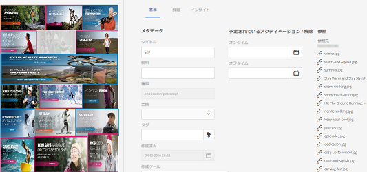
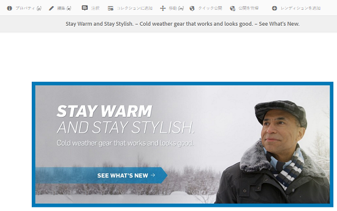
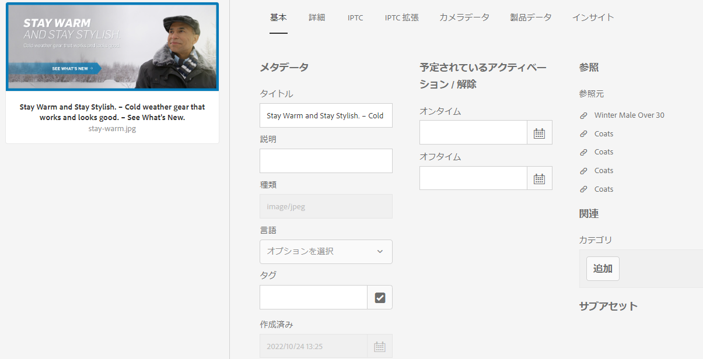
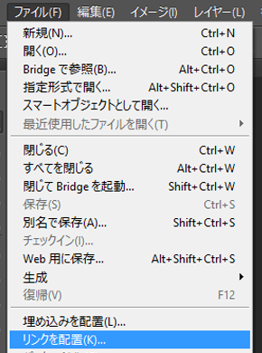

# 複合アセットと複数ページアセットの管理 {#managing-compound-assets}

[!DNL Adobe Experience Manager Assets] アップロードしたファイルに、リポジトリ内に既に存在するアセットへの参照が含まれているかどうかを識別できます。 この機能は、サポート対象のファイル形式でのみ使用できます。If the uploaded asset contains any references to [!DNL Experience Manager] assets, a bidirectional link is created between the uploaded and referenced assets.

Besides eliminating redundancy, referencing the assets in [!DNL Adobe Creative Cloud] applications enhances collaboration and increases the efficiency and productivity of users.

[!DNL Experience Manager Assets] は、双方向参照をサポートします。 参照元のアセットは、アップロードされたファイルのアセットの詳細ページで確認できます。また、参照元のアセットのアセットの詳細ページに、参照元のファイルを表示することもできます。

参照は、参照元のアセットのパス、ドキュメント ID およびインスタンス ID に基づいて解決されます。

## デジタ追加ルアセット [!DNL Adobe Illustrator] {#refai}

You can reference existing digital assets from within an [!DNL Adobe Illustrator] file.

1. [Experience Managerのデスクトップアプリケーションを使用して](https://docs.adobe.com/content/help/ja-JP/experience-manager-desktop-app/using/using.html)、デジタルアセットをローカルファイルシステムに取得します。 参照するアセットのファイルシステムの場所に移動します。
1. Drag the asset from the local folder to the [!DNL Illustrator] file.

1. Save the [!DNL Illustrator] file to the mounted drive, or [upload](/help/assets/manage-assets.md#uploading-assets) to the [!DNL Experience Manager] repository.

1. ワークフローが完了したら、そのアセットのアセットの詳細ページに移動します。The references to existing digital assets are listed under **[!UICONTROL Dependencies]** in the **[!UICONTROL References]** column.

   

1. 「**[!UICONTROL 依存関係]**」に表示される参照元のアセットは、現在のファイルとは異なるファイルからも参照できます。参照先のファイルのリストを表示するには、「**[!UICONTROL 依存関係]**」にあるアセットをクリックします。

   

1. Click **[!UICONTROL View Properties]** from the toolbar. In the [!UICONTROL Properties] page, the list of files that reference the current asset appear under the **[!UICONTROL References]** column in the **[!UICONTROL Basic]** tab.

   

   *図：アセットの詳細内のアセット参照。*

## デジタ追加ルアセット [!DNL Adobe InDesign] {#add-aem-assets-as-references-in-adobe-indesign}

To reference digital assets from within an [!DNL InDesign] file, either drag assets to the [!DNL InDesign] file or export the [!DNL InDesign] file as a ZIP archive.

Referenced assets already exist in [!DNL Experience Manager Assets]. You can extract subassets by [configuring InDesign Server](indesign.md). Embedded assets in an [!DNL InDesign] file are extracted as subassets.

>[!NOTE]
>
>If the [!DNL InDesign Server] is proxied, [!DNL InDesign] files have their preview embedded within their XMP metadata. この場合、サムネールの抽出は明示的には必要ありません。However, if the [!DNL InDesign Server] is not proxied, thumbnails must be explicitly extracted for [!DNL InDesign] files.

###  アセットをドラッグして参照を作成 {#create-references-by-dragging-aem-assets}

This procedure is similar to [add digital assets as references in Adobe Illustrator](#refai).

### ZIP ファイルに書き出してアセットの参照を作成 {#create-references-to-aem-assets-by-exporting-a-zip-file}

1. Perform the steps in [Create workflow models](/help/sites-developing/workflows-models.md) to create a new workflow.
1. Use the Package feature of [!DNL Adobe InDesign] to export the document. [!DNL Adobe InDesign] ではドキュメントおよびリンクされたアセットを 1 つのパッケージとして書き出すことができます。In this case, the exported folder contains a Links folder that contains sub-assets in the [!DNL InDesign] file.
1. Create a ZIP file and upload it to the [!DNL Experience Manager] repository.
1. Start the `Unarchiver` workflow.
1. ワークフローが完了すると、Linksフォルダー内の参照は自動的にサブアセットとして参照されます。 To view a list of referred assets, navigate to the asset details page of the [!DNL InDesign] asset and close the [Rail](/help/sites-authoring/basic-handling.md#rail-selector).

## デジタ追加ルアセット [!DNL Adobe Photoshop] {#refps}

1. デスクトップ [!DNL Experience Manager] アプリを使用してアクセス [!DNL Experience Manager Assets]します。 ローカルファイルシステム上のアセットをダウンロードして表示します。 の「リンクを [!UICONTROL 配置] 」機能を使用 [!DNL Adobe Photoshop]します。 デスクトップアプリでのア [セットの配置を参照してください](https://docs.adobe.com/content/help/en/experience-manager-desktop-app/using/using.html#place-assets-in-native-documents)。

   

1. Save in [!DNL Photoshop] file to the mounted drive or or [upload](/help/assets/manage-assets.md#uploading-assets) to the [!DNL Experience Manager] repository.
1. After the workflow completes, the references to existing [!DNL Experience Manager] assets are listed in the asset details page.

   参照元のアセットを表示するには、アセットの詳細ページで[パネル](/help/sites-authoring/basic-handling.md#rail-selector)を閉じます。

1. 参照元のアセットには、参照元のアセットのリストも含まれています。参照元のアセットのリストを表示するには、アセットの詳細ページに移動して、[パネル](/help/sites-authoring/basic-handling.md#rail-selector)を閉じます。

>[!NOTE]
>
>複合アセット内のアセットも、ドキュメント ID とインスタンス ID に基づいて参照できます。This functionality is available with [!DNL Adobe Illustrator] and [!DNL Adobe Photoshop] versions only. For others, referencing is done on the basis of relative path of linked assets in the main compound asset as done in earlier versions of [!DNL Experience Manager].

## サブアセットの作成 {#generate-subassets}

複数ページ形式のサポートされているアセット(PDFファイル、AIファイル、 [!DNL Microsoft PowerPoint] ファイル、 [!DNL Apple Keynote] ファイル)の場合、元のアセットの個々のページに対応するサブアセットを [!DNL Adobe InDesign][!DNL Experience Manager] 生成できます。 これらのサブアセットは *親アセットにリンクされ、複数ページの表示が容易になります* 。 その他の目的の場合、サブアセットは、では通常のアセットと同様に扱われ [!DNL Experience Manager]ます。

サブアセットの生成はデフォルトでは無効になっています。サブアセットの生成を有効にするには、次の手順に従います。

1. Log into [!DNL Experience Manager] as an administrator. **[!UICONTROL ツール]** / **[!UICONTROL ワークフロー]** / ****&#x200B;モデルにアクセスします。
1. 「 **[!UICONTROL DAM Update Asset]** workflow」を選択し、「 **[!UICONTROL 編集]**」をクリックします。
1. 「 **[!UICONTROL サイドパネルを]** 切り替え **[!UICONTROL 」をクリックし、「サブアセットを]** 作成」ステップを見つけます。 ワークフロー追加への手順です。 「**[!UICONTROL 同期]**」をクリックします。

サブアセットを生成するには、次のいずれかの操作を行います。

* 新しいアセット：DAMアセットの更新 [!UICONTROL ワークフローは、アップロード先の新しいアセットに対して実行され][!DNL Experience Manager]ます。 サブアセットは、新しい複数ページのアセット用に自動生成されます。
* 既存の複数ページアセット：次のいずれかの手順に従って、手動で [!UICONTROL DAMアセットの更新] ワークフローを実行します。

   * アセットを選択し、 [!UICONTROL タイムラインをクリックして] 、左側のパネルを開きます。 Alternately, use the keyboard shortcut `alt + 3`. 「 [!UICONTROL 開始ワークフロー]」をクリックし、「 [!UICONTROL DAM Update Asset]」を選択して「 [!UICONTROL 開始]」をクリックし、「 続行」をクリックします。
   * アセットを選択し、ツールバーで [!UICONTROL 作成] / [!UICONTROL ワークフロー] をクリックします。 ポップアップダイアログから「 [!UICONTROL DAM Update Asset] workflow」を選択し、「 [!UICONTROL 開始]」をクリックし、「 [!UICONTROL 続行]」をクリックします。

特にMicrosoft Wordドキュメントの場合は、 **[!UICONTROL DAM Parse Wordドキュメント]** ・ワークフローを実行します。 Microsoft Wordドキュメントのコンテンツから `cq:Page` コンポーネントを生成します。 このドキュメントから抽出された画像は `cq:Page` コンポーネントから参照されます。これらの画像は、サブアセットの生成が無効な場合も抽出されます。

## サブアセットの表示 {#viewing-subassets}

サブアセットは、サブアセットが生成され、選択した複数ページのアセットで使用できる場合にのみ表示されます。 生成されたサブアセットを表示するには、複数ページのアセットを開きます。 ページの左上の領域で、「  、リストの「 **[!UICONTROL サブアセット]** 」をクリックします。 リストから「 **[!UICONTROL サブアセット]** 」を選択した場合。 Alternately, use the keyboard shortcut `alt + 5`.

## 複数ページファイルのページの表示 {#view-pages-of-a-multi-page-file}

のページビューア機能を使用して、PDF、INDD、PPT、PPTX、AIファイルなどの複数ページのファイルを表示でき [!DNL Experience Manager Assets]ます。 複数ページのアセットを開き、ページの左上隅にある「 **[!UICONTROL 表示ページ]** 」をクリックします。 ページビューアが開き、アセットのページが表示されます。また、各ページを参照およびズームするためのコントロールが表示されます。

例えば、 [!DNL InDesign]を使用してページを抽出でき [!DNL InDesign Server]ます。 If the previews of pages are saved during [!DNL InDesign] file creation, then [!DNL InDesign Server] is not required for page extraction.

次のオプションは、ツールバー、左側のナビゲーションバーおよびページビューアコントロールで使用できます。

* **[!UICONTROL デスクトップアクション]** ：デスクトップアプリを使用して、特定のサブアセットを開いたり、表示したりし [!DNL Experience Manager] ます。 Desktop Appを使用する場合は、Desktop Actions [(デスクトップアクション](https://docs.adobe.com/content/help/en/experience-manager-desktop-app/using/using.html#desktopactions-v2) )を [!DNL Experience Manager] 設定する方法を参照してください。

* **[!UICONTROL 「プロパティ]** 」オプションを選択すると、特定のサブアセットの  プロパティページが開きます。

* **[!UICONTROL 注釈]** 」オプションを使用すると、特定のサブアセットに注釈を付けることができます。 別のサブアセットで使用する注釈は、親アセットを表示用に開いたときに収集され、一緒に表示されます。

* **[!UICONTROL 「ページの概要]** 」オプションを選択すると、すべてのサブアセットが同時に表示されます。

* **[!UICONTROL 左側のパネルを開くには]** 、左側のパネルで「  アクティビティを選択すると、ファイルのタイムラインストリームが表示されます。

## Best practices and limitation {#best-practice-limitation-tips}

* サブアセットの生成は、どの [!DNL Experience Manager] 展開でもリソースを大量に消費する可能性があります。 複雑なアセットがアップロードされたときにサブアセットを生成する場合は、DAMアセットの更新ワークフローで手順を追加します。 サブアセットをオンデマンドで生成する場合は、サブアセットを生成するための別のワークフローを作成します。 専用ワークフローを使用すると、DAM Update Assetワークフローの他の手順をスキップして、計算リソースを保存できます。

>[!MORELIKETHIS]
>
>* [Adobe Experience Manager デスクトップアプリケーションの使用](https://docs.adobe.com/content/help/ja-JP/experience-manager-desktop-app/using/using.html)
>* [Adobe Experience ManagerでのDesktop Actionsの設定](https://docs.adobe.com/content/help/en/experience-manager-desktop-app/using/using.html#desktopactions-v2)
>* [リンクされたスマートオブジェクトをAdobe Photoshopで作成](https://helpx.adobe.com/photoshop/using/create-smart-objects.html#create-linked-smart-objects)
>* [Adobe InDesignにグラフィックを配置](https://helpx.adobe.com/jp/indesign/using/placing-graphics.html)

