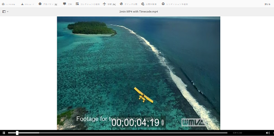
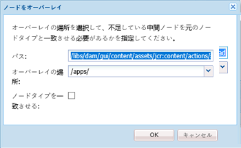
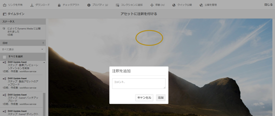
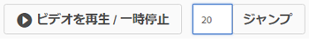
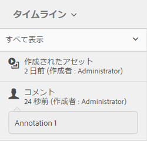

# ビデオアセットの管理 {#manage-video-assets}

ビデオ形式は、組織のデジタルアセットの重要な部分です。 [!DNL Adobe Experience Manager] 成熟したオファーは、ビデオアセットの作成後に、ビデオアセットのライフサイクル全体を管理するための製品と機能を提供しています。

Learn how to manage and edit the video assets in [!DNL Adobe Experience Manager Assets]. 例えば、FFmpegトランスコードのようなビデオエンコーディングとトランスコードは、 [!DNL Dynamic Media] 統合を使用して可能です。

## ビデオアセットのアップロードとプレビュー {#upload-and-preview-video-assets}

[!DNL Adobe Experience Manager Assets] 拡張子がMP4のビデオアセットのプレビューを生成します。 アセットの形式がMP4でない場合は、FFmpegパックをインストールしてプレビューを生成します。 FFmpegは、OGGタイプとMP4タイプのビデオレンディションを作成します。 You can preview the renditions in the [!DNL Assets] user interface.

1. デジタルアセットフォルダーまたはサブフォルダーで、デジタルアセットを追加する場所に移動します。
1. To upload the asset, click **[!UICONTROL Create]** from the toolbar and choose **[!UICONTROL Files]**. または、ユーザーインターフェイス上でファイルをドラッグします。詳しくは、[アセットのアップロード](managing-assets-touch-ui.md#uploading-assets)を参照してください。
1. To preview a video in the Card view, click the **[!UICONTROL Play]**  option on the video asset. ビデオの一時停止や再生は、カード表示でのみ可能です。The [!UICONTROL Play] and [!UICONTROL Pause] options are not available in the list view.

1. To preview the video in the asset details page, click **[!UICONTROL Edit]** on the card. ビデオは、ブラウザーのネイティブなビデオプレーヤーで再生されます。再生、一時停止、音量の調節およびビデオの全画面表示をおこなうことができます。

   

## 2 GB を超えるアセットをアップロードするための設定 {#configuration-to-upload-assets-that-are-larger-than-gb}

By default, [!DNL Assets] does not let you upload any assets that are larger than 2 GB because of a file size limit. ただし、この上限は CRXDE Lite を開き、`/apps` ディレクトリ配下にノードを作成することで上書きできます。ノードには、同じノード名とディレクトリ構造および類似した順序のノードプロパティが必要です。

In addition to [!DNL Assets] configuration, change the following configurations to upload large assets:

* トークンの有効期間を増やします。Webコンソールの「 [!UICONTROL AdobeGranite CSRF Servlet] 」()を参照し `https://[aem_server]:[port]/system/console/configMgr`てください。 詳しくは、「 [CSRF保護](/help/sites-developing/csrf-protection.md)」を参照してください。
* Dispatcher の設定で `receiveTimeout` を増やします。詳しくは、[Adobe Experience Manager Dispatcher の設定](https://docs.adobe.com/content/help/ja-JP/experience-manager-dispatcher/using/configuring/dispatcher-configuration.html#renders-options)を参照してください。

>[!NOTE]
>
>The [!DNL Experience Manager] Classic user interface does not have a 2-GB file size limit restriction. また、サイズの大きなビデオでは、エンドツーエンドのワークフローが完全にはサポートされません。

ファイルサイズの制限を高めに設定するには、`/apps` ディレクトリで次の手順を実行します。

1. In [!DNL Experience Manager], click **[!UICONTROL Tools]** > **[!UICONTROL General]** > **[!UICONTROL CRXDE Lite]**.
1. CRXDE Lite で、`/libs/dam/gui/content/assets/jcr:content/actions/secondary/create/items/fileupload` に移動します。To see the directory window, click the `>>`.
1. From the toolbar, click the **[!UICONTROL Overlay Node]**. または、コンテキストメニューの「**[!UICONTROL ノードをオーバーレイ]**」を選択します。
1. In the **[!UICONTROL Overlay Node]** dialog, click **[!UICONTROL OK]**.

   

1. ブラウザーを更新します。オーバーレイノード `/apps/dam/gui/content/assets/jcr:content/actions/secondary/create/items/fileupload` が選択されます。
1. サイズ上限を必要なサイズに増やすには、「**[!UICONTROL プロパティ]**」タブで適切な値をバイト単位で入力します。例えば、サイズ制限を 30 GB に増やすには、`32212254720` という値を入力します。

1. From the toolbar, click **[!UICONTROL Save All]**.
1. In [!DNL Experience Manager], click **[!UICONTROL Tools]** > **[!UICONTROL Operations]** > **[!UICONTROL Web Console]**.
1. On the [!DNL Adobe Experience Manager] [!UICONTROL Web Console Bundles] page, under the Name column of the table, locate and click **[!UICONTROL Adobe Granite Workflow External Process Job Handler]**.
1. On the [!UICONTROL Adobe Granite Workflow External Process Job Handler] page, set the seconds for both **[!UICONTROL Default Timeout]** and **[!UICONTROL Max Timeout]** fields to `18000` (five hours). 「**[!UICONTROL 保存]**」をクリックします。
1. で、 [!DNL Experience Manager]ツール **[!UICONTROL /]** ワークフロー **[!UICONTROL /]** モデルをクリックします ****。
1. On the Workflow Models page, select **[!UICONTROL Dynamic Media Encode Video]**, then click **[!UICONTROL Edit]**.
1. On the workflow page, double-click the **[!UICONTROL Dynamic Media Video Service Process]** component.
1. [!UICONTROL ステップのプロパティ]ダイアログボックスの「**[!UICONTROL 共通]**」タブにある「**詳細設定**」を展開します。
1. In the **[!UICONTROL Timeout]** field, specify a value of `18000`, then click **[!UICONTROL OK]** to return to the **[!UICONTROL Dynamic Media Encode Video]** workflow page.
1. Near the top of the page, below the [!UICONTROL Dynamic Media Encode Video] page title, click **[!UICONTROL Save]**.

## ビデオアセットを公開する {#publish-video-assets}

公開後、ビデオアセットをURLとしてWebページに含めたり、アセットを直接埋め込んだりできます。 詳しくは、ダイナミックメディアアセットの [公開を参照してください](/help/assets/publishing-dynamicmedia-assets.md)。

## ビデオアセットに注釈を付ける {#annotate-video-assets}

1. コン [!DNL Assets] ソールから、アセットカードの「 **[!UICONTROL 編集]** 」を選択して、アセットの詳細ページを表示します。
1. ビデオを再生するには、「 **[!UICONTROL プレビュー]**」をクリックします。
1. To annotate the video, click **[!UICONTROL Annotate]**. ビデオの特定の時間（フレーム）に注釈が追加されます。 注釈を付ける際に、キャンバスに描画して、その画像をコメントと一緒に含めることができます。コメントは自動保存されます。注釈ウィザードを終了するには、「**[!UICONTROL 閉じる]**」をクリックします。

   

1. ビデオ内の特定のポイントを探すには、**テキスト**&#x200B;フィールドに時刻（秒）を指定して、「**ジャンプ**」をクリックします。例えば、ビデオの最初の 20 秒をスキップするには、テキストフィールドに「20」と入力します。

   

1. タイムラインで表示するには、注釈をクリックします。タイムラインから注釈を削除するには、「**[!UICONTROL 削除]**」をクリックします。

   

>[!MORELIKETHIS]
>
>* [Experience Managerアセット内のデジタルアセットの管理](/help/assets/managing-assets-touch-ui.md)
>* [Experience Managerアセット内のコレクションの管理](/help/assets/managing-collections-touch-ui.md)
>* [ダイナミックメディアビデオドキュメント](/help/assets/video.md)。

