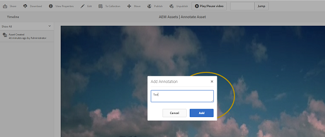

# ビデオアセットの管理 {#manage-video-assets}

Adobe Experience Manager（AEM）Assets でビデオアセットを管理および編集する方法について説明します。また、Dynamic Media のライセンスをお持ちの場合は、[Dynamic Media のビデオに関するドキュメント](/help/assets/video.md)を参照してください。

## ビデオアセットのアップロードとプレビュー {#upload-and-preview-video-assets}

Adobe Experience Manager Assetsは、拡張子がMP4のビデオアセットに関するプレビューを生成します。アセットの形式がMP4でない場合は、FFmpegパックをインストールしてプレビューを生成します。 FFmpegは、OGGタイプとMP4タイプのビデオレンディションを作成します。 これらのレンディションは、AEM Assets ユーザーインターフェイスでプレビューすることができます。

1. デジタルアセットフォルダー（またはサブフォルダー）で、デジタルアセットを追加する場所に移動します。
1. To upload the asset, click **[!UICONTROL Create]** from the toolbar and then choose **[!UICONTROL Files]**. または、アセット領域に直接ドロップします。アップロード操作について詳しくは、[アセットのアップロード](managing-assets-touch-ui.md#uploading-assets)を参照してください。
1. To preview a video in the Card view, click the **[!UICONTROL Play]** button on the video asset.

   

   ビデオの一時停止や再生は、カード表示でのみ可能です。リスト表示では、[!UICONTROL 再生]および[!UICONTROL 一時停止]ボタンを使用できません。

1. To preview the video in the asset details page, click the **[!UICONTROL Edit]** icon on the card.

   ビデオは、ブラウザーのネイティブなビデオプレーヤーで再生されます。再生、一時停止、音量の調節およびビデオの全画面表示をおこなうことができます。

   

## 2 GB を超えるアセットをアップロードするための設定 {#configuration-to-upload-assets-that-are-larger-than-gb}

デフォルトでは、ファイルサイズの上限により、Adobe Experience Manager Assets で 2 GB を超えるアセットをアップロードすることはできません。ただし、この上限は CRXDE Lite を開き、`/apps` ディレクトリ配下にノードを作成することで上書きできます。ノードには、同じノード名とディレクトリ構造および類似した順序のノードプロパティが必要です。

大きなアセットをアップロードするには、Adobe Experience Manager Assets の設定に加えて、次の設定を変更します。

* トークンの有効期間を増やします。Webコンソールの「 [!UICONTROL Adobe Granite CSRF Servlet] 」()を参照し `https://[aem_server]:[port]/system/console/configMgr`てください。 詳しくは、「 [CSRF保護](/help/sites-developing/csrf-protection.md)」を参照してください。
* Dispatcher の設定で `receiveTimeout` を増やします。詳しくは、[Adobe Experience Manager Dispatcher の設定](https://docs.adobe.com/content/help/ja-JP/experience-manager-dispatcher/using/configuring/dispatcher-configuration.html#renders-options)を参照してください。

>[!NOTE]
>
>AEM クラシックユーザーインターフェイスには、2 GB のファイルサイズ上限の制約がありません。また、サイズの大きなビデオでは、エンドツーエンドのワークフローが完全にはサポートされません。

ファイルサイズの制限を高めに設定するには、`/apps` ディレクトリで次の手順を実行します。

1. AEM で、**[!UICONTROL ツール]**／**[!UICONTROL 一般]**／**[!UICONTROL CRXDE Lite]** をクリックします。
1. CRXDE Lite で、`/libs/dam/gui/content/assets/jcr:content/actions/secondary/create/items/fileupload` に移動します。ディレクトリウィンドウを表示するには、「`>>`」アイコンをタッチします。
1. From the toolbar, click the **[!UICONTROL Overlay Node]**. または、コンテキストメニューの「**[!UICONTROL ノードをオーバーレイ]**」を選択します。
1. In the **[!UICONTROL Overlay Node]** dialog, click **[!UICONTROL OK]**.

   

1. ブラウザーを更新します。オーバーレイノード `/jcr_root/apps/dam/gui/content/assets/jcr:content/actions/secondary/create/items/fileupload` が選択されます。
1. サイズ上限を必要なサイズに増やすには、「**[!UICONTROL プロパティ]**」タブで適切な値をバイト単位で入力します。例えば、サイズ制限を 30 GB に増やすには、`{sizeLimit : "32212254720"}` という値を入力します。

1. ツールバーで「**[!UICONTROL すべて保存]**」をタッチします。
1. In AEM, click **[!UICONTROL Tools]** > **[!UICONTROL Operations]** > **[!UICONTROL Web Console]**.
1. On the Adobe Experience Manager Web Console Bundles page, under the Name column of the table, locate and click **[!UICONTROL Adobe Granite Workflow External Process Job Handler]**.
1. Adobe Granite Workflow External Process Job Handler ページで、「**[!UICONTROL Default Timeout]**」フィールドと「**[!UICONTROL Max Timeout]**」フィールドの秒数を`18000`（5 時間）に設定します。
1. 「**[!UICONTROL 保存]**」をクリックします。
1. In AEM, click **[!UICONTROL Tools]** > **[!UICONTROL Workflow]** > **[!UICONTROL Models]**.
1. On the Workflow Models page, select **[!UICONTROL Dynamic Media Encode Video]**, then click **[!UICONTROL Edit]**.
1. On the workflow page, double-click the **[!UICONTROL Dynamic Media Video Service Process]** component.
1. [!UICONTROL ステップのプロパティ]ダイアログボックスの「**[!UICONTROL 共通]**」タブにある「**詳細設定**」を展開します。
1. In the **[!UICONTROL Timeout]** field, specify a value of `18000`, then click **[!UICONTROL OK]** to return to the **[!UICONTROL Dynamic Media Encode Video]** workflow page.
1. Near the top of the page, below the Dynamic Media Encode Video page title, click **[!UICONTROL Save]**.

## ビデオアセットを公開する {#publish-video-assets}

ビデオアセットを公開すると、URL として Web ページに含めることや、Web ページに埋め込むことができます。[アセットの公開](/help/assets/publishing-dynamicmedia-assets.md)を参照してください。

## ビデオアセットに注釈を付ける {#annotate-video-assets}

1. From the Assets console, click the [!UICONTROL Edit] icon on the asset card to display the asset details page.
1. To play the video, click the [!UICONTROL Preview] icon.
1. ビデオに注釈を付けるには、「**[!UICONTROL 注釈]**」ボタンをクリックします。注釈がビデオ内の特定の時点（フレーム）に追加されます。注釈を付ける際に、キャンバスに描画して、その画像をコメントと一緒に含めることができます。コメントは自動保存されます。

   

   注釈ウィザードを終了するには、「**[!UICONTROL 閉じる]**」をクリックします。

1. ビデオ内の特定のポイントを探すには、**テキスト**&#x200B;フィールドに時刻（秒）を指定して、「**ジャンプ**」をクリックします。例えば、ビデオの最初の 20 秒をスキップするには、テキストフィールドに「10」と入力します。

   

1. タイムラインで表示するには、注釈をクリックします。タイムラインから注釈を削除するには、「**[!UICONTROL 削除]**」をクリックします。

   
