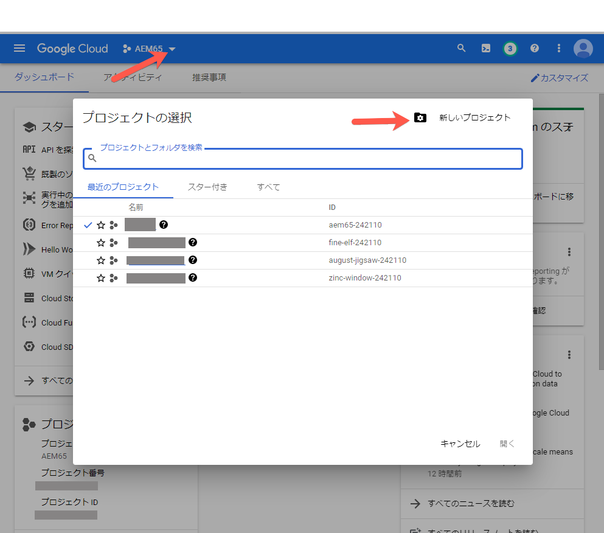
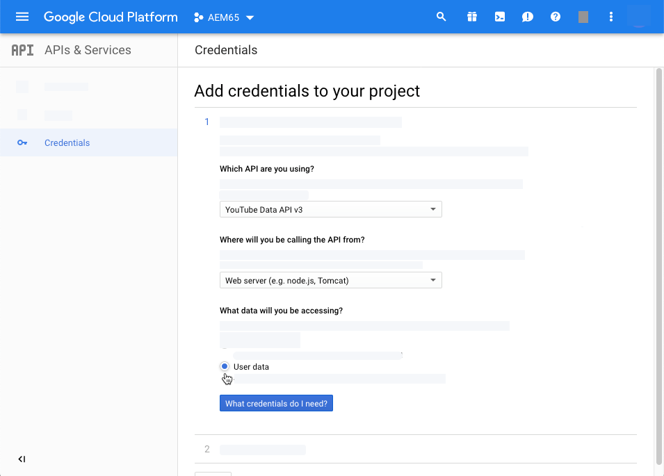
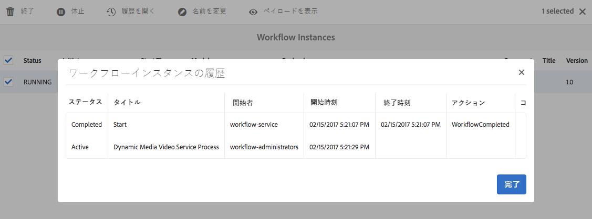

# ビデオアセットの管理 {#manage-video-assets}

| バージョン | 記事リンク |
| -------- | ---------------------------- |
| AEM as a Cloud Service | [ここをクリックしてください](https://experienceleague.adobe.com/docs/experience-manager-cloud-service/content/assets/manage/manage-video-assets.html?lang=ja) |
| AEM 6.5 | この記事 |

ビデオ形式は、組織のデジタルアセットの重要な部分です。[!DNL Adobe Experience Manager] は、ビデオアセットの作成後に、ビデオアセットのライフサイクル全体を管理するための充実した機能を提供しています。

[!DNL Adobe Experience Manager Assets] でビデオアセットを管理および編集する方法について説明します。FFmpeg トランスコーディングなどのビデオのエンコーディングとトランスコーディングは、[!DNL Dynamic Media] 統合を使用して行うことができます。

## ビデオアセットのアップロードとプレビュー {#upload-and-preview-video-assets}

[!DNL Adobe Experience Manager Assets] は、拡張子が MP4 のビデオアセットのプレビューを生成します。アセットの形式が MP4 でない場合は、FFmpeg パックをインストールしてプレビューを生成します。FFmpeg は、OGG タイプと MP4 タイプのビデオレンディションを作成します。これらのレンディションは、[!DNL Assets] ユーザーインターフェイスでプレビューできます。

1. デジタルアセットフォルダー（またはサブフォルダー）で、デジタルアセットを追加する場所に移動します。
1. アセットをアップロードするには、ツールバーの「**[!UICONTROL 作成]**」をクリックして、「**[!UICONTROL ファイル]**」を選択します。または、ユーザーインターフェイス上でファイルをドラッグします。詳しくは、[アセットのアップロード](manage-assets.md#uploading-assets)を参照してください。
1. カード表示でビデオをプレビューするには、ビデオアセットの「**[!UICONTROL 再生]**」オプションをクリックします。ビデオの一時停止や再生は、カード表示でのみ可能です。リスト表示では、[!UICONTROL 再生]および[!UICONTROL 一時停止]オプションを使用できません。

1. アセットの詳細ページでビデオをプレビューするには、カードの「**[!UICONTROL 編集]**」をクリックします。ビデオは、ブラウザーのネイティブなビデオプレーヤーで再生されます。再生、一時停止、音量の調節およびビデオの全画面表示を行うことができます。

   

## 2 GB を超えるアセットをアップロードするための設定 {#configuration-to-upload-assets-that-are-larger-than-gb}

[!DNL Assets] ではファイルサイズの制限により、デフォルトで 2 GB を超えるアセットをアップロードすることはできません。ただし、この上限は CRXDE Lite を開き、`/apps` ディレクトリ配下にノードを作成することで上書きできます。ノードには、同じノード名とディレクトリ構造および類似した順序のノードプロパティが必要です。

大きなアセットをアップロードするには、[!DNL Assets] 設定に加えて、次の設定を変更します。

* トークンの有効期間を増やします。詳しくは、web コンソールの [!UICONTROL Adobe Granite CSRF サーブレット]を `https://[aem_server]:[port]/system/console/configMgr` で参照してください。詳しくは、[CSRF 保護](/help/sites-developing/csrf-protection.md)を参照してください。
* Dispatcher の設定で `receiveTimeout` を増やします。詳しくは、[Adobe Experience Manager Dispatcher の設定](https://experienceleague.adobe.com/docs/experience-manager-dispatcher/using/configuring/dispatcher-configuration.html?lang=ja#renders-options)を参照してください。

>[!NOTE]
>
>[!DNL Experience Manager] クラシックユーザーインターフェイスには、2 GB のファイルサイズ上限の制約がありません。また、サイズの大きなビデオでは、エンドツーエンドのワークフローが完全にはサポートされません。

ファイルサイズの制限を高めに設定するには、`/apps` ディレクトリで次の手順を実行します。

1. [!DNL Experience Manager] で、**[!UICONTROL ツール]**／**[!UICONTROL 一般]**／**[!UICONTROL CRXDE Lite]** をクリックします。
1. CRXDE Lite で、`/libs/dam/gui/content/assets/jcr:content/actions/secondary/create/items/fileupload` に移動します。ディレクトリウィンドウを表示するには、「`>>`」をクリックします。
1. ツールバーで、「**[!UICONTROL ノードをオーバーレイ]**」をクリックします。または、コンテキストメニューの「**[!UICONTROL ノードをオーバーレイ]**」を選択します。
1. **[!UICONTROL ノードをオーバーレイ]**&#x200B;ダイアログで「**[!UICONTROL OK]**」をクリックします。

   

1. ブラウザーを更新します。オーバーレイノード `/apps/dam/gui/content/assets/jcr:content/actions/secondary/create/items/fileupload` が選択されます。
1. サイズ上限を必要なサイズに増やすには、「**[!UICONTROL プロパティ]**」タブで適切な値をバイト単位で入力します。例えば、サイズ制限を 30 GB に増やすには、`32212254720` という値を入力します。

1. ツールバーで「**[!UICONTROL すべて保存]**」をクリックします。
1. [!DNL Experience Manager] で、**[!UICONTROL ツール]**／**[!UICONTROL 操作]**／**[!UICONTROL web コンソール]**&#x200B;をクリックします。
1. [!DNL Adobe Experience Manager] の [!UICONTROL web コンソールバンドル]ページで、表の「名前」列で **[!UICONTROL Adobe Granite ワークフロー外部プロセスジョブハンドラー]**&#x200B;を探してクリックします。
1. [!UICONTROL Adobe Granite ワークフロー外部プロセスジョブハンドラー]ページで、「**[!UICONTROL デフォルトタイムアウト]**」フィールドと「**[!UICONTROL 最大タイムアウト]**」フィールドの秒数を`18000`（5 時間）に設定します。「**[!UICONTROL 保存]**」をクリックします。
1. [!DNL Experience Manager] で、**[!UICONTROL ツール]**／**[!UICONTROL ワークフロー]**／**[!UICONTROL モデル]**&#x200B;をクリックします。
1. ワークフローモデルページで「**[!UICONTROL Dynamic Media エンコーディングビデオ]**」を選択し、「**[!UICONTROL 編集]**」をクリックします。
1. ワークフローページで、**[!UICONTROL Dynamic Media ビデオサービスのプロセス]**&#x200B;コンポーネントをダブルクリックします。
1. [!UICONTROL ステップのプロパティ]ダイアログボックスの「**[!UICONTROL 共通]**」タブにある「**詳細設定**」を展開します。
1. 「**[!UICONTROL タイムアウト]**」フィールドの値を `18000` に指定し、「**[!UICONTROL OK]**」をクリックして **[!UICONTROL Dynamic Media エンコーディングビデオ]**&#x200B;ワークフローページに戻ります。
1. ページ上部付近の [!UICONTROL Dynamic Media エンコーディングビデオ]ページのタイトルの下にある「**[!UICONTROL 保存]**」をクリックします。

## ビデオアセットを公開する {#publish-video-assets}

公開後、ビデオアセットを URL として Web ページに含めたり、アセットを直接埋め込んだりできます。詳しくは、[Dynamic Media アセットの公開](/help/assets/publishing-dynamicmedia-assets.md)を参照してください。

## YouTube へのビデオの公開 {#publishing-videos-to-youtube}

以前作成した YouTube チャンネルに、オンプレミス Experience Manager ビデオアセットを直接公開できます。

ビデオアセットを YouTube に公開するには、タグを使用して Experience Manager Assets をセットアップします。これらのタグを YouTube チャンネルに関連付けます。ビデオアセットのタグが YouTube チャンネルのタグと一致する場合、ビデオが YouTube に公開されます。YouTube への公開は、関連するタグが使用されている限り、ビデオの通常公開と一緒に行われます。

YouTube は独自のエンコーディングを行います。そのため、Dynamic Media のエンコーディングで作成した版のビデオではなく、Experience Manager にアップロードされた元のビデオファイルが YouTube に公開されます。Dynamic Media を使用してビデオを処理する必要はありませんが、再生にビューアプリセットが必要な場合は、それが行われます。

ビデオ処理プロファイルをスキップして YouTube に直接公開すると、Experience Manager Assets のビデオアセットに対して、表示可能なサムネールが作成されません。また、 `dynamicmedia` または `dynamicmedia_scene7` 実行モードで実行する場合、エンコードされていないビデオは、どの Dynamic Media アセットタイプとも機能しません。

ビデオアセットの YouTube サーバーへの公開において、YouTube との安全でセキュアなサーバー間認証を行うには、次のタスクを実行する必要があります。

1. [Google Cloud の設定](#configuring-google-cloud-settings)
1. [YouTube チャンネルの作成](#creating-a-youtube-channel)
1. [公開用タグの追加](#adding-tags-for-publishing)
1. [YouTube への公開のレプリケーションエージェントを有効にする](#enabling-the-youtube-publish-replication-agent)
1. [Experience Manager での YouTube のセットアップ](#setting-up-youtube-in-aem)
1. [（オプション）アップロードしたビデオのデフォルト YouTube プロパティ設定の自動化](#optional-automating-the-setting-of-default-youtube-properties-for-your-uploaded-videos)
1. [YouTube チャンネルへのビデオの公開](#publishing-videos-to-your-youtube-channel)
1. [（オプション）YouTube での公開済みビデオの確認](/help/assets/video.md#optional-verifying-the-published-video-on-youtube)
1. [Web アプリケーションへの YouTube URL のリンク](#linking-youtube-urls-to-your-web-application)

また、[ビデオを非公開にして YouTube から削除する](#unpublishing-videos-to-remove-them-from-youtube)こともできます。

### Google Cloud の設定 {#configuring-google-cloud-settings}

YouTube に公開するには、Google アカウントが必要です。Gmail のアカウントを持っている場合は、既に Google アカウントも所有しています。Google アカウントがない場合も、簡単に作成できます。Google アカウントが必要な理由は、YouTube へのビデオアセットの公開時に秘密鍵証明書が必要だからです。既にアカウントを作成済みの場合は、このタスクをスキップして [YouTube チャンネルの作成](#creating-a-youtube-channel)タスクに進んでください。

Google Cloud で使用するアカウントと YouTube に使用する Google アカウントは、必ずしも同じである必要はありません。

Google ではユーザーインターフェイスが定期的に変更されます。そのため、YouTube にビデオを公開する手順は、以下の手順とは少し異なる場合があります。これは、ビデオが YouTube にアップロードされるかどうかを確認する場合にも当てはまります。

>[!NOTE]
>
>以下の手順は、このドキュメントの作成時点では正しいものです。Google は、Web サイトを予告なく定期的に更新します。そのため、以下の手順は、最新の手順とは少し異なる場合もあります。

Google Cloud を設定するには：

1. Google アカウントを作成します。
   [https://accounts.google.com/SignUp?service=mail](https://accounts.google.com/SignUp?service=mail)

   既に Google アカウントを持っている場合は、次のステップに進んでください。

1. [https://cloud.google.com/](https://cloud.google.com/) にアクセスします。
1. Google Cloud ページの右上隅付近にある、「**[!UICONTROL コンソール]**」をクリックします。

   必要に応じて、Google アカウントの資格情報を使用して&#x200B;**[!UICONTROL ログイン]**&#x200B;し、「**[!UICONTROL コンソール]**」オプションを確認します。

1. ダッシュボードページで、**[!UICONTROL Google Cloud Platform]** の右側にある「プロジェクト」ドロップダウンリストをクリックして、プロジェクトの選択ダイアログボックスを開きます。
1. プロジェクトの選択ダイアログボックスで、「**[!UICONTROL 新しいプロジェクト]**」を選択します。

   

1. 新しいプロジェクトダイアログボックスで、「プロジェクト名」フィールドに新しいプロジェクトの名前を入力します。

   プロジェクト ID は、プロジェクト名に基づいて付けられます。そのため、プロジェクト名は慎重に選んでください。プロジェクト名を後で変更することはできません。また、このプロジェクト ID は、後で Experience Manager で YouTube をセットアップする際にも入力する必要があるため、記録しておくことをお勧めします。

1. 「**[!UICONTROL 作成]**」をクリックします。

1. 次のいずれかの操作を行います。

   * プロジェクトのダッシュボードの「はじめに」カードで、 **[!UICONTROL API の確認と有効化]**.
   * プロジェクトのダッシュボードの「API」カードで「**[!UICONTROL API の概要に移動]**」を選択します。

   

1. API とサービスページの上部にある「**[!UICONTROL API とサービスを有効にする]**」を選択します。
1. API ライブラリページの左側の「**[!UICONTROL カテゴリ]**」で、「**[!UICONTROL YouTube]**」を選択します。ページの右側で、「**[!UICONTROL YouTube Data API]**」を選択します。
1. YouTube Data API v3 ページで、「**[!UICONTROL 有効にする]**」を選択します。

   

1. この API を使用するには、資格情報が必要です。その場合は、「**[!UICONTROL 認証情報を作成]**」をクリックします。

   

1. **[!UICONTROL プロジェクトへの認証情報の追加]**&#x200B;ページの手順 1 で以下を行います。

   * 「**[!UICONTROL どの API を使用しますか？」]** ドロップダウンリストで、「**[!UICONTROL YouTube Data API v3]**」を選択します。

   * 「**[!UICONTROL API を呼び出す場所]**」ドロップダウンリストから、「**[!UICONTROL web サーバー（node.js、Tomcat など）]**」を選択します。

   * 「**[!UICONTROL アクセスするデータの種類]**」ドロップダウンリストから、「**[!UICONTROL ユーザーデータ]**」を選択します。

   

1. 「**[!UICONTROL 必要な認証情報]**」を選択します。
1. **[!UICONTROL プロジェクトへの資格情報の追加]**&#x200B;ページの手順 2 で、「**[!UICONTROL OAuth 2.0 クライアント ID を作成する]**」の下の「名前」フィールドに、必要に応じて一意の名前を入力します。または、Google で指定されるデフォルトの名前を使用することもできます。
1. 「**[!UICONTROL 承認済みの JavaScript 生成元]**」の下にあるテキストフィールドに、次のパスに従って、実際に使用するドメインとポート番号を入力します。入力が終わったら、**[!UICONTROL Enter]** キーを押して、パスをリストに追加します。

   `https://<servername.domain>:<port_number>`

   例：`https://1a2b3c.mycompany.com:4321`

   **注意**：上記のパスはデモ用の例です。

   

1. 「**[!UICONTROL 承認済みのリダイレクト URI]**」の下にあるテキストフィールドに、次のように、実際に使用するドメインとポート番号を入力します。入力が終わったら、**[!UICONTROL Enter]** キーを押して、パスをリストに追加します。

   `https://<servername.domain>:<port_number>/etc/cloudservices/youtube.youtubecredentialcallback.json`

   例：`https://1a2b3c.mycompany.com:4321/etc/cloudservices/youtube.youtubecredentialcallback.json`

   **注意**：上記のパスはデモ用の例です。

1. 「**[!UICONTROL OAuth クライアント ID の作成]**」をクリックします。
1. **[!UICONTROL プロジェクトへの資格情報の追加]**&#x200B;ページの手順 3 で、「**[!UICONTROL OAuth 2.0 同意画面を設定する]**」の下で、現在使用している Gmail メールアドレスを選択します。

   

1. 「**[!UICONTROL ユーザーに表示される製品名]**」の下のテキストフィールドに、同意画面に表示する内容を入力します。

   同意画面は、Experience Manager 管理者が YouTube の認証をおこなう際に表示され、Experience Manager は YouTube に権限を要求します。

1. 「**[!UICONTROL 続行]**」をクリックします。
1. プロジェクトへの認証情報の追加ページの手順 4 で、「**[!UICONTROL 認証情報をダウンロードする]**」の下の「**[!UICONTROL ダウンロード]**」を選択します。

   

1. `client_id.json` ファイルを保存します。

   このダウンロードした JSON ファイルは、後で Adobe Experience Manager で YouTube をセットアップするときに必要になります。

1. 「**[!UICONTROL 完了]**」をクリックします。

   Google アカウントからログアウトします。次に、YouTube チャンネルを作成します。

### YouTube チャンネルの作成 {#creating-a-youtube-channel}

YouTube にビデオを公開するには、1 つ以上のチャンネルが必要です。既に YouTube チャンネルを作成している場合は、このタスクをスキップして、次の「[公開用タグの追加](/help/assets/video.md#adding-tags-for-publishing)」タスクに進んでください。

>[!WARNING]
>
>*Experience Manager* の「YouTube 設定」にチャンネルを追加する前に、YouTube のチャンネルを 1 つ以上セットアップ済みであることを確認してください（以下の [Experience Manager での YouTube のセットアップ](#setting-up-youtube-in-aem)を参照してください）。1 つ以上のチャネルのセットアップに失敗しても、存在しないチャネルに関する警告は表示されません。ただし、それでも、チャネルを追加する際に Google 認証がおこなわれますが、ビデオの送信先となるチャネルを選択するオプションがありません。

**YouTube チャンネルを作成するには：**

1. [https://www.youtube.com](https://www.youtube.com/) にアクセスし、Google アカウントの資格情報を使用してログインします。
1. YouTube ページの右上隅にあるプロフィール写真（内側に文字が表示された、べた塗りの円が表示されている場合はその円）をクリックし、「**[!UICONTROL YouTube 設定]**」（丸い歯車アイコン）をクリックします。
1. 概要ページの「その他の機能」見出しで、「**[!UICONTROL チャンネルをすべて表示するか、新しいチャンネルを作成する]**」をクリックします。
1. チャネルページで、「**[!UICONTROL 新しいチャネルを作成]**」をクリックします。
1. ブランドアカウントページで、「ブランドアカウント名」フィールドに、ビジネス名や、ビデオアセットの公開先となる他のチャネル名を入力し、「**[!UICONTROL 作成]**」をクリックします。

   ここで入力する名前は、Experience Manager で YouTube をセットアップするときに再度入力する必要があるので、覚えておいてください。

1. （オプション）必要に応じて、さらにチャンネルを追加します。

   次は、公開用タグを追加します。

### 公開用タグの追加 {#adding-tags-for-publishing}

Experience Manager で、YouTube にビデオを公開するには、1 つ以上の YouTube チャンネルにタグを関連付けます。公開用タグの追加については、[タグを管理](/help/sites-administering/tags.md)を参照してください。

また、Experience Manager のデフォルトのタグを使用する場合は、このタスクをスキップして、次の [YouTube への公開のレプリケーションエージェントを有効にする](#enabling-the-youtube-publish-replication-agent)に進んでください。

### YouTube への公開のレプリケーションエージェントを有効にする {#enabling-the-youtube-publish-replication-agent}

YouTube公開レプリケーションエージェントを有効にした後、Google Cloud アカウントへの接続をテストする場合は、 **[!UICONTROL 接続をテスト]**. ブラウザータブに接続結果が表示されます。YouTube チャンネルを追加した場合は、それらの一覧がテストの一部として表示されます。

1. Experience Manager の左上隅にある Experience Manager ロゴをクリックし、左側のレールで&#x200B;**[!UICONTROL ツール]**／**[!UICONTROL デプロイメント]**／**[!UICONTROL レプリケーション]**／**[!UICONTROL 作成者のエージェント]**&#x200B;をクリックします。
1. 作成者のエージェントページで、「**[!UICONTROL YouTube の公開]**」をクリックします。
1. ツールバーで、「設定」の右側にある「**[!UICONTROL 編集]**」をクリックします。
1. 「**[!UICONTROL 有効]**」チェックボックスをオンにして、レプリケーションエージェントを有効にします。
1. 「**[!UICONTROL OK]**」をクリックします。

   次に、Experience Manager で YouTube チャンネルをセットアップします。

### Experience Manager での YouTube のセットアップ {#setting-up-youtube-in-aem}

Experience Manager 6.4 以降では、Experience Manager で YouTube への公開をセットアップするための新しいタッチ対応ユーザーインターフェイスが導入されました。使用している Experience Manager のインストール済みインスタンスに応じて、次のいずれかを行います。

* 6.4 以前の Experience Manager で YouTube を設定するには、[6.4 以前の Experience Manager での YouTube のセットアップ](/help/assets/video.md#setting-up-youtube-in-aem-before)を参照してください。
* Experience Manager 6.4 以降で YouTube を設定するには、[Experience Manager 6.4 以降での YouTube のセットアップ](#setting-up-youtube-in-aem-and-later)を参照してください。

#### Experience Manager 6.4 以降での YouTube のセットアップ {#setting-up-youtube-in-aem-and-later}

1. Dynamic Media のインスタンスに管理者としてログインしてください。
1. 左上隅のExperience Managerロゴを選択し、左側のレールで「 」を選択します。 **[!UICONTROL ツール]**（ハンマーのアイコン） > **[!UICONTROL Cloud Service]** > **[!UICONTROL YouTube Publishing Configuration]**.
1. 「**[!UICONTROL グローバル]**」を選択します。

1. グローバルページの右上隅にある「**[!UICONTROL 作成]**」を選択します。
1. YouTube 設定を作成ページの「Google Cloud Platform 設定」で、「**[!UICONTROL アプリケーション名]**」フィールドに Google プロジェクト ID を入力します。

   このプロジェクト ID は、先ほど Google Cloud 設定を行ったときに指定したものです。YouTube 設定を作成ページを開いたままにしておきます。このページには後で戻ります。

   

1. 任意のテキストエディターを使用して、「[Google Cloud 設定](/help/assets/video.md#configuring-google-cloud-settings)」のタスクでダウンロードして保存しておいた JSON ファイルを開きます。
1. この JSON テキスト全体を選択してコピーします。
1. YouTube アカウント設定ダイアログボックスに戻ります。「**[!UICONTROL JSON 設定]**」フィールドに JSON テキストを貼り付けます。
1. ページの右上隅にある「**[!UICONTROL 保存]**」を選択します。

   次に、Experience Manager で YouTube チャンネルをセットアップします。

1. 「**[!UICONTROL チャンネルを追加]**」を選択します。
1. 「チャネル名」フィールドに、前に「**[!UICONTROL YouTube への 1 つ以上のチャネルの追加]**」タスクで作成したチャネルの名前を入力します。

   オプションで、必要に応じて説明を追加できます。

1. 「**[!UICONTROL 追加]**」を選択します。
1. YouTube または Google の認証画面が表示されます。まだ Google Cloud アカウントにログインしていない場合は、この手順をスキップします。

   * 前述の Google プロジェクト ID と JSON テキストに関連付けられた Google のユーザー名とパスワードを入力します。
   * アカウントのチャネル数に応じて、2 つ以上の項目が表示されます。チャネルを選択します。メールアドレスはチャネルではないので、選択しないでください。
   * 次のページで、「**[!UICONTROL 確定]**」を選択して、このチャネルへのアクセスを許可します。

1. 「**[!UICONTROL 許可]**」を選択します。

   次に、タグを公開用にセットアップします。

1. **[!UICONTROL 公開用タグの設定]** - クラウドサービス／YouTube ページで、鉛筆アイコンを選択して、使用するタグのリストを編集します。
1. ドロップダウンリストアイコン（上下逆のキャレット）を選択して、使用可能なタグのリストをExperience Managerで表示できます。
1. 1 つ以上のタグを選択して追加できます。

   追加したタグを削除するには、そのタグを選択して、**[!UICONTROL X]** を選択します。

1. 使用するタグの追加が終了したら、「**[!UICONTROL 保存]**」を選択します。

   次は、YouTube チャンネルにビデオを公開します。

#### 6.4 以前の Experience Manager での YouTube のセットアップ {#setting-up-youtube-in-aem-before}

1. Dynamic Media のインスタンスに管理者としてログインしてください。

1. 左上隅のExperience Managerロゴを選択し、左側のレールで「 」を選択します。 **[!UICONTROL ツール]** （ハンマーのアイコン） > **[!UICONTROL 導入]** > **[!UICONTROL Cloud Service]**.
1. 「サードパーティのサービス」ヘッダーの下の「YouTube」で、「**[!UICONTROL 今すぐ設定]**」を選択します。
1. 設定を作成ダイアログボックスで、タイトル（必須）と名前（オプション）をそれぞれのフィールドに入力します。
1. 「**[!UICONTROL 作成]**」を選択します。
1. YouTube アカウント設定ダイアログボックスで、「**[!UICONTROL アプリケーション名]**」フィールドに Google プロジェクト ID を入力します。

   このプロジェクト ID は、先ほど [Google Cloud 設定を行った](/help/assets/video.md#configuring-google-cloud-settings)ときに指定したものです。YouTube アカウント設定ダイアログボックスを開いたままにしておきます。このダイアログボックスには後で戻ります。

1. プレーンテキストのエディターを使用して、「Google Cloud 設定」のタスクでダウンロードして保存しておいた JSON ファイルを開きます。
1. この JSON テキスト全体を選択してコピーします。
1. YouTube アカウント設定ダイアログボックスに戻ります。「**[!UICONTROL JSON 設定]**」フィールドに JSON テキストを貼り付けます。
1. 「**[!UICONTROL OK]**」を選択します。

   次に、Experience Manager で YouTube チャンネルをセットアップします。

1. 「**[!UICONTROL 利用可能なチャネル]**」の右にある「**+**」（プラス記号のアイコン）を選択します。
1. YouTube チャンネル設定ダイアログボックスの「タイトル」フィールドに、前の「**[!UICONTROL YouTube への 1 つ以上のチャネルの追加]**」タスクで作成したチャネルの名前を入力します。

   オプションで、必要に応じて説明を追加できます。

1. 「**[!UICONTROL OK]**」を選択します。
1. YouTube または Google の認証画面が表示されます。まだ Google Cloud アカウントにログインしていない場合は、この手順をスキップします。

   * 前述の Google プロジェクト ID と JSON テキストに関連付けられた Google のユーザー名とパスワードを入力します。
   * アカウントのチャネル数に応じて、2 つ以上の項目が表示されます。チャネルを選択します。メールアドレスはチャネルではないので、選択しないでください。
   * 次のページで、「**[!UICONTROL 確定]**」を選択して、このチャネルへのアクセスを許可します。

1. 「**[!UICONTROL 許可]**」を選択します。

   次に、タグを公開用にセットアップします。

1. **[!UICONTROL 公開用タグの設定]** - クラウドサービス／YouTube ページで、鉛筆アイコンを選択して、使用するタグのリストを編集します。
1. ドロップダウンリストアイコン（上下逆のキャレット）を選択して、使用可能なタグのリストをExperience Managerで表示できます。
1. 1 つ以上のタグを選択して追加できます。

   追加したタグを削除するには、そのタグを選択して、**X** を選択します。

1. 使用するタグの追加が終了したら、「**[!UICONTROL OK]**」を選択します。

   次は、YouTube チャンネルにビデオを公開します。

### （オプション）アップロードしたビデオのデフォルト YouTube プロパティ設定の自動化 {#optional-automating-the-setting-of-default-youtube-properties-for-your-uploaded-videos}

ビデオのアップロード時に YouTube プロパティの設定を自動化することもできます。それには、Experience Manager でメタデータ処理プロファイルを作成します。

メタデータ処理プロファイルを作成するには、まず「**[!UICONTROL フィールドラベル]**」、「**[!UICONTROL プロパティにマッピング]**」、「**[!UICONTROL 選択肢]**」の各フィールドの値をコピーします。これらはすべてビデオのメタデータスキーマで見つかります。次に、これらの値を追加して、YouTube ビデオメタデータ処理プロファイルを作成します。

アップロードしたビデオのデフォルト YouTube プロパティの設定を自動化するには：

1. 左上隅で、Experience Managerロゴを選択し、左側のレールで、 **[!UICONTROL ツール]** （ハンマーのアイコン） > **[!UICONTROL Assets]** > **[!UICONTROL メタデータスキーマ]**.
1. 「**[!UICONTROL デフォルト値]**」をクリックします（「デフォルト値」の左側にある選択ボックスにチェックマークを追加しないでください）。
1. **[!UICONTROL デフォルト値]**&#x200B;ページで、「**[!UICONTROL ビデオ]**」の左側にあるボックスをオンにし、「**[!UICONTROL 編集]**」を選択します。
1. メタデータスキーマエディターページで、「**[!UICONTROL 詳細]**」タブを選択します。
1. 「YouTube への公開」の下で、「**[!UICONTROL YouTube カテゴリ]**」をクリックします。
1. ページの右側の「**[!UICONTROL 設定]**」タブで次の手順を実行します。

   * 「**[!UICONTROL プロパティにマッピング]**」テキストフィールドで、値を選択してコピーします。コピーした値を、開いているテキストエディターに貼り付けます。この値は、後でメタデータ処理プロファイルを作成する際に必要になります。テキストエディターは開いたままにしておきます。

   * 「**[!UICONTROL 選択肢]**」の下で、使用するデフォルト値（「人とブログ」または「科学と技術」など）を選択してコピーします。コピーした値を、開いているテキストエディターに貼り付けます。この値は、後でメタデータ処理プロファイルを作成する際に必要になります。テキストエディターは開いたままにしておきます。

1. 「YouTube への公開」の下で、「**[!UICONTROL YouTube のプライバシー]**」を選択します。
1. ページの右側の「**[!UICONTROL 設定]**」タブで次の手順を実行します。

   * 「**[!UICONTROL プロパティにマッピング]**」テキストフィールドで、値を選択してコピーします。コピーした値を、開いているテキストエディターに貼り付けます。この値は、後でメタデータ処理プロファイルを作成する際に必要になります。テキストエディターは開いたままにしておきます。

   * **[!UICONTROL 選択肢]**&#x200B;で、使用するデフォルト値を選択してコピーします。選択肢は 2 つが 1 組になっています。1 組の下のフィールドは、コピーするデフォルト値（公開、非公開またはプライベート）です。コピーした値を、開いているテキストエディターに貼り付けます。この値は、後でメタデータ処理プロファイルを作成する際に必要になります。テキストエディターを開いたままにします。

1. メタデータスキーマエディターページの右上隅にある「**[!UICONTROL キャンセル]**」をクリックします。
1. Experience Managerの左上隅で、Experience Managerロゴを選択し、左側のレールで、 **[!UICONTROL ツール]** （ハンマーのアイコン） > **[!UICONTROL Assets]** > **[!UICONTROL メタデータプロファイル]**.

1. メタデータプロファイルページの右上隅にある「**[!UICONTROL 作成]**」をクリックします。
1. メタデータプロファイルを追加ダイアログボックスの「**[!UICONTROL プロファイルのタイトル]**」テキストフィールドに、「`YouTube Video`」と入力した後、「**[!UICONTROL 作成]**」をクリックします。
1. メタデータプロファイルエディターページで、「**[!UICONTROL 詳細]**」タブをクリックします。
1. 次の手順を実行して、コピーした「YouTube への公開」の値を、プロファイルに追加します。

   * ページの右側にある「**[!UICONTROL フォームを作成]**」タブをクリックします。
   * （オプション）**[!UICONTROL セクションヘッダー]**&#x200B;というラベルのコンポーネントを左にドラッグして、フォーム領域にドロップします。
   * （オプション）「**[!UICONTROL フィールドラベル]**」をクリックして、コンポーネントを選択します。
   * （オプション）ページの右側にある「設定」タブで、「フィールドラベル」テキストフィールドに「`YouTube Publishing`」と入力します。
   * 「**[!UICONTROL フォームを作成]**」タブをクリックし、「**[!UICONTROL 複数値テキスト]**」というラベルのコンポーネントをドラッグして、作成した「**[!UICONTROL YouTube への公開]**」の下にドロップします。

   * **[!UICONTROL フィールドラベル]**&#x200B;をクリックし、コンポーネントを選択します。
   * ページの右側にある「設定」タブで、先ほどコピーした「YouTube への公開」の値（フィールドラベル値と、プロパティにマッピング値）をフォームのそれぞれのフィールドに貼り付けます。選択肢値を「デフォルト値」フィールドに貼り付けます。

1. 次の手順を実行して、コピーした「YouTube のプライバシー」の値を、プロファイルに追加します。

   * ページの右側にある「**[!UICONTROL フォームを作成]**」タブをクリックします。
   * （オプション）**[!UICONTROL セクションヘッダー]**&#x200B;というラベルのコンポーネントを左にドラッグして、フォーム領域にドロップします。
   * （オプション）「**[!UICONTROL フィールドラベル]**」をクリックして、コンポーネントを選択します。
   * （オプション）ページの右側にある「設定」タブで、「フィールドラベル」テキストフィールドに「`YouTube Privacy`」と入力します。
   * 「**[!UICONTROL フォームを作成]**」タブをクリックし、「**[!UICONTROL 複数値テキスト]**」というラベルのコンポーネントをドラッグして、作成した「**[!UICONTROL YouTube のプライバシー]**」の下にドロップします。

   * **[!UICONTROL フィールドラベル]**&#x200B;をクリックし、コンポーネントを選択します。
   * ページの右側にある「設定」タブで、先ほどコピーした「YouTube への公開」の値（フィールドラベル値と、プロパティにマッピング値）をフォームのそれぞれのフィールドに貼り付けます。選択肢値を「デフォルト値」フィールドに貼り付けます。

1. ページの右上隅にある「**[!UICONTROL 保存]**」をクリックします。
1. YouTube への公開メタデータプロファイルを、ビデオのアップロード先フォルダーに適用します。メタデータプロファイルとビデオプロファイルの両方を設定する必要があります。

   詳しくは、[メタデータプロファイル](/help/assets/metadata-config.md#metadata-profiles)と[ビデオプロファイル](/help/assets/video-profiles.md)を参照してください。

### YouTube チャンネルへのビデオの公開 {#publishing-videos-to-your-youtube-channel}

次は、前の手順で追加したタグを、ビデオアセットに関連付けます。このプロセスによって、Experience Manager が YouTube チャンネルに公開するアセットを把握できるようになります。

>[!NOTE]
>
>Dynamic Media - Scene7 モードで実行する場合は、即時公開しても YouTube に自動的には公開されません。Dynamic Media - Scene7 モードが設定されている場合は、**[!UICONTROL 即時]**&#x200B;と&#x200B;**[!UICONTROL アクティベーション時]**&#x200B;の 2 つの公開オプションから選択できます。
>
>**[!UICONTROL 即時公開]**&#x200B;の場合、アップロードされたアセットは、IPS と同期された後で配信システムに自動的に公開されます。これは Dynamic Media には当てはまりますが、YouTube には当てはまりません。YouTube に公開するには、Experience Manager オーサーを介して公開する必要があります。

>[!NOTE]
>
>Experience Manager では、YouTube からのコンテンツの公開に **[!UICONTROL YouTube に公開]**&#x200B;ワークフローを使用します。このワークフローでは、進行状況を監視して、エラー情報を表示できます。
>
>詳しくは、[ビデオエンコーディングと YouTube への公開の進行状況の監視](#monitoring-video-encoding-and-youtube-publishing-progress)を参照してください。
>
>詳細な進行状況については、レプリケーション下の YouTube ログを監視できます。ただし、この監視には管理者アクセスが必要です。

**YouTube チャンネルにビデオを公開するには：**

1. Experience Manager で、YouTube チャンネルに公開するビデオアセットの場所に移動します。
1. ビデオアセット（アダプティブビデオセット）を選択します。
1. ツールバーの「**[!UICONTROL プロパティ]**」をクリックします。
1. 「基本」タブの「メタデータ」で、「タグ」フィールドの右側にある「**[!UICONTROL 選択ダイアログを開く]**」をクリックします。
1. 「タグを選択」ページで、使用するタグに移動し、1 つまたは複数のタグを選択します。

   タグは YouTube チャネルに関連付ける必要があります。

1. ページの右上隅にある「**[!UICONTROL 選択]**」をクリックします。
1. ビデオのプロパティページの右上隅にある「**[!UICONTROL 保存して閉じる]**」をクリックします。
1. ツールバーの「**[!UICONTROL クイック公開]**」をクリックします。

   [Experience Manager Sites での公開管理の使用](https://experienceleague.adobe.com/docs/experience-manager-learn/sites/page-authoring/publication-management-feature-video-use.html?lang=ja)も参照してください。

   オプションで、YouTube チャンネルで公開済みビデオを確認できます。

### （オプション）YouTube での公開済みビデオの確認 {#optional-verifying-the-published-video-on-youtube}

オプションで、YouTube への公開（または非公開）の進行状況を監視できます。

詳しくは、[ビデオエンコーディングと YouTube への公開の進行状況の監視](#monitoring-video-encoding-and-youtube-publishing-progress)を参照してください。

公開にかかる時間は、プライマリソースビデオの形式、ファイルサイズ、アップロードトラフィックなどの多数の要因により左右されます。公開プロセスにかかる時間は、数分から数時間までの幅があります。また、高解像度の形式の方が、レンダリングの時間が長くなります。例えば、720p や 1080p の場合、表示されるまでの時間が 480p よりも長くなります。

8 時間経っても「**[!UICONTROL アップロード済み（処理しています、お待ちください）]**」というステータスメッセージが表示される場合は、アドビのサイトからビデオを削除して再度アップロードしてみてください。

### Web アプリケーションへの YouTube URL のリンク {#linking-youtube-urls-to-your-web-application}

ビデオの公開後、Dynamic Media によって生成された YouTube URL 文字列を取得できます。YouTube URL をコピーしたらクリップボードに配置されるので、必要に応じて web サイトのページまたはアプリケーションに貼り付けることができます。

>[!NOTE]
>
>YouTube URL は、ビデオアセットを YouTube に公開するまではコピーできません。

**Web アプリケーションに YouTube URL をリンクするには：**

1. *YouTube へ公開済み*&#x200B;ビデオアセットに移動して、URL をコピーするアセットを選択します。

   YouTube URL をコピーするには、*その前に*&#x200B;ビデオアセットを YouTube に&#x200B;*公開しておく*&#x200B;必要があります。

1. ツールバーの「**[!UICONTROL プロパティ]**」をクリックします。
1. 「**[!UICONTROL 詳細]**」タブをクリックします。
1. 「YouTube への公開」の「YouTube URL リスト」で、URL テキストを選択し、web ブラウザーにコピーしてアセットをプレビューするか、web コンテンツページに追加します。

### ビデオの非公開による YouTube からの削除 {#unpublishing-videos-to-remove-them-from-youtube}

Experience Manager のビデオアセットを非公開にすると、そのビデオは YouTube から削除されます。

>[!CAUTION]
>
>YouTube 内からビデオを直接削除すると、Experience Manager はそのことを認識できないので、そのビデオがまだ YouTube に公開されているかのように動作を続けます。ビデオアセットを YouTube で非公開にするときは、必ず Experience Manager から行ってください。

>[!NOTE]
>
>Experience Manager では、YouTube からのコンテンツの削除に **[!UICONTROL YouTube で非公開]**&#x200B;ワークフローを使用します。このワークフローでは、進行状況を監視して、エラー情報を表示できます。
>
>詳しくは、[ビデオエンコーディングと YouTube への公開の進行状況の監視](#monitoring-video-encoding-and-youtube-publishing-progress)を参照してください。

**ビデオを非公開にして YouTube から削除するには：**

1. YouTube チャネルで非公開にするビデオアセットの場所に移動します。
1. アセット選択モードで、1 つまたは複数の公開済みビデオアセットを選択します。
1. ツールバーで「**[!UICONTROL 公開を管理]**」をクリックします。3 つのドットのアイコン (..) ツールバーにあるので、**[!UICONTROL パブリケーションの管理]**&#x200B;が開きます。
1. 公開を管理ページで、「**[!UICONTROL 非公開]**」を選択します。
1. ページの右上隅にある「**[!UICONTROL 次へ]**」を選択します。
1. ページの右上隅にある「**[!UICONTROL 非公開]**」を選択します。

## ビデオエンコーディングと YouTube への公開の進行状況を監視 {#monitoring-video-encoding-and-youtube-publishing-progress}

ビデオエンコーディングが適用されたフォルダーに新しいビデオをアップロードしたり、YouTube にビデオを公開したりする場合は、ビデオエンコーディング／YouTube への公開の進行状況を監視できます。YouTube への公開の実際の進行状況は、ログによってのみ確認できます。ただし、その失敗または成功は、次の手順で説明する追加の方法で一覧表示されます。さらに、YouTube の公開ワークフローやビデオエンコーディングが完了するか中断されると、そのことを知らせるメール通知を受け取ります。

### 進行状況の監視 {#monitoring-progress}

1. アセットフォルダーでビデオエンコーディングの進行状況を表示します。

   * カードビューでは、ビデオエンコーディングの進行状況がパーセント単位でアセットに表示されます。エラーがある場合、エラー情報はアセットにも表示されます。

   

   * リスト表示では、ビデオエンコーディングの進行状況は、「**[!UICONTROL 処理ステータス]**」列に表示されます。エラーがある場合は、そのメッセージも同じ列に表示されます。

   

   この列は、デフォルトでは表示されません。列を有効にするには、「 **[!UICONTROL 設定を表示]** 「ビュー」ドロップダウンメニューから、「 **[!UICONTROL 処理ステータス]** 列とクリック **[!UICONTROL 更新]**.

   

1. アセット詳細の進行状況を表示します。アセットをクリックしたら、ドロップダウンメニューを開いて、「 」を選択します。 **[!UICONTROL タイムライン]**. タイムラインを、エンコーディングや YouTube への公開などのワークフローアクティビティに絞り込むには、「**[!UICONTROL ワークフロー]**」を選択します。

   

   エンコーディングなどのワークフロー情報がタイムラインに表示されます。YouTube での公開の場合、ワークフロータイムラインには YouTube チャンネルの名前と YouTube 動画の URL も含まれます。さらに、公開が完了すると、ワークフロータイムラインにエラー通知も表示されます。

   >[!NOTE]
   >
   >[https://localhost:4502/system/console/configMgr](https://localhost:4502/system/console/configMgr) からの&#x200B;**[!UICONTROL 再試行]**、**[!UICONTROL 再試行遅延]**&#x200B;および&#x200B;**[!UICONTROL タイムアウト]**&#x200B;に関する複数のワークフロー設定があるので、失敗／エラーメッセージが最終的に記録されるまでには時間がかかる可能性があります。例えば、次の設定です。
   >
   >* Apache Sling ジョブキューの設定
   >* Adobe Granite ワークフロー外部プロセスジョブハンドラー
   >* Granite ワークフロータイムアウトキュー
   >
   >これらの設定の&#x200B;**[!UICONTROL 再試行]**、**[!UICONTROL 再試行遅延]**&#x200B;および&#x200B;**[!UICONTROL タイムアウト]**&#x200B;プロパティは調整できます。

1. 進行中のワークフローについては、**[!UICONTROL ツール]**／**[!UICONTROL ワークフロー]**／**[!UICONTROL インスタンス]**&#x200B;からワークフローインスタンスを表示します。

   >[!NOTE]
   >
   >**[!UICONTROL ツール]**&#x200B;メニューにアクセスするには、管理者権限が必要です。

   

   インスタンスを選択し、「**[!UICONTROL 履歴を開く]**」を選択します。

   

   ワークフローインスタンス領域から、ワークフローを休止、終了または名前変更できます。詳しくは、[ワークフローの管理](/help/sites-administering/workflows-administering.md)を参照してください。

1. エラーが発生したジョブについては、**[!UICONTROL ツール]**／**[!UICONTROL ワークフロー]**／**[!UICONTROL エラー]**&#x200B;からワークフローエラーを表示します。**[!UICONTROL ワークフローエラー]**&#x200B;に、エラーが発生したすべてのワークフローアクティビティが表示されます。

   >[!NOTE]
   >
   >**[!UICONTROL ツール]**&#x200B;メニューにアクセスするには、管理者権限が必要です。

   

   >[!NOTE]
   >
   >[https://localhost:4502/system/console/configMgr](https://localhost:4502/system/console/configMgr) からの&#x200B;**[!UICONTROL 再試行]**、**[!UICONTROL 再試行遅延]**、および&#x200B;**[!UICONTROL タイムアウト]**&#x200B;に関する複数のワークフロー設定があるので、エラーメッセージが最終的に記録されるまでには時間がかかる可能性があります。例えば、次の設定です。
   >
   >* Apache Sling ジョブキューの設定
   >* Adobe Granite ワークフロー外部プロセスジョブハンドラー
   >* Granite ワークフロータイムアウトキュー
   >
   >これらの設定の&#x200B;**[!UICONTROL 再試行]**、**[!UICONTROL 再試行遅延]**&#x200B;および&#x200B;**[!UICONTROL タイムアウト]**&#x200B;プロパティは調整できます。

1. 完了したワークフローについては、**[!UICONTROL ツール]**／**[!UICONTROL ワークフロー]**／**[!UICONTROL アーカイブ]**&#x200B;からワークフローアーカイブを表示します。**[!UICONTROL ワークフローアーカイブ]**&#x200B;に、完了したすべてのワークフローアクティビティが表示されます。

   >[!NOTE]
   >
   >**[!UICONTROL ツール]**&#x200B;メニューにアクセスするには、管理者権限が必要です。

   

1. 中止またはエラーが発生したワークフロージョブに関するメール通知を受け取ります。これらのメール通知は、管理者が設定できます。詳しくは、[メール通知の設定](#configuring-e-mail-notifications)を参照してください。

#### メール通知の設定 {#configuring-e-mail-notifications}

>[!NOTE]
>
>**[!UICONTROL ツール]**&#x200B;メニューにアクセスするには、管理者権限が必要です。

通知の設定方法は、エンコーディングジョブに関する通知と、YouTube への公開ジョブに関する通知のどちらを希望しているかによって異なります。

* エンコーディングジョブの場合、**[!UICONTROL ツール]**／**[!UICONTROL 運営]**／**[!UICONTROL web コンソール]**&#x200B;を選択して、**[!UICONTROL Day CQ Workflow Email Notification Service]** を検索することで、すべての Experience Manager ワークフローメール通知の設定ページにアクセスできます。[Experience Manager でメール通知を設定](/help/sites-administering/notification.md)を参照してください。「**[!UICONTROL Notify on Abort]**」または「**[!UICONTROL Notify on Complete]**」のチェックボックスをオン／オフにできます。

* YouTube への公開ジョブの場合、次の手順に従います。

1. 「Experience Manager」で、「 **[!UICONTROL ツール]** > **[!UICONTROL ワークフロー]** > **[!UICONTROL モデル]**.
1. ワークフローモデルページで、「 」を選択します。 **[!UICONTROL YouTubeに公開]**&#x200B;を選択し、「 **[!UICONTROL 編集]** をクリックします。
1. YouTubeに公開ワークフローページの右上隅にある「 」を選択します。 **[!UICONTROL 編集]**.
1. YouTubeアップロードコンポーネントにマウスポインターを置いてから、1 回選択するとインラインツールバーが表示されます。

   

1. インラインツールバーで、設定アイコン（レンチ）を選択します。 「**[!UICONTROL 引数]**」タブをクリックします。

   

1. YouTubeアップロードプロセス — ステップのプロパティダイアログボックスで、 **[!UICONTROL 引数]** タブをクリックします。

   

1. 次のチェックボックスをオンまたはオフにすることができます。

   * 公開開始
   * 公開失敗
   * 公開完了（チャネルと URL に関する情報を含む）

   チェックボックスをオフにすると、YouTube の公開ワークフローから指定されたメール通知は届きません。

   >[!NOTE]
   >
   >これらのメールは YouTube に固有で、かつ一般的なワークフローメール通知です。結果として、設定に応じて、**[!UICONTROL Day CQ Workflow Email Notification Service]** で使用できる一般的な通知と、YouTube に固有の通知の 2 つのメール通知セットを受け取ることができます。

1. 作業が完了したら、ダイアログボックスの右上隅付近にある **[!UICONTROL 完了]** アイコン（チェックマーク）をクリックします。
1. YouTubeに公開ワークフローページの右上隅付近にある、「 」を選択します。 **[!UICONTROL 同期]**.

## ビデオアセットに注釈を付ける {#annotate-video-assets}

1. [!DNL Assets] コンソールから、アセットカードの「**[!UICONTROL 編集]**」を選択して、アセット詳細ページを表示します。
1. ビデオを再生するには、「**[!UICONTROL プレビュー]**」をクリックします。
1. ビデオに注釈を付けるには、「**[!UICONTROL 注釈]**」をクリックします。注釈がビデオ内の特定の時点（フレーム）に追加されます。注釈を付ける際に、キャンバスに描画して、その画像をコメントと一緒に含めることができます。コメントは自動保存されます。注釈ウィザードを終了するには、「**[!UICONTROL 閉じる]**」をクリックします。

   

1. ビデオ内の特定のポイントを探すには、**テキスト**&#x200B;フィールドに時刻（秒）を指定して、「**ジャンプ**」をクリックします。例えば、ビデオの最初の 20 秒をスキップするには、テキストフィールドに「20」と入力します。

   

1. タイムラインで表示するには、注釈をクリックします。タイムラインから注釈を削除するには、「**[!UICONTROL 削除]**」をクリックします。

   

>[!MORELIKETHIS]
>
>* [Experience Manager Assets でのデジタルアセットの管理](/help/assets/manage-assets.md)
>* [Experience Manager Assets でのコレクションの管理](/help/assets/manage-collections.md)
>* [Dynamic Media ビデオドキュメント。](/help/assets/video.md)
