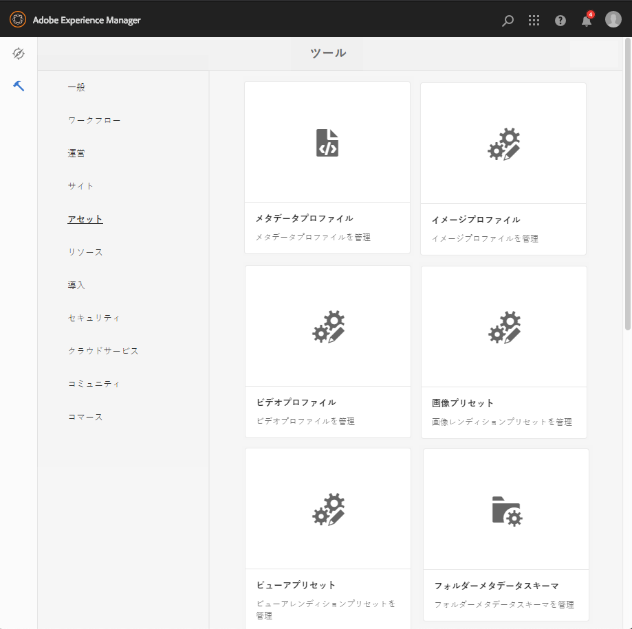
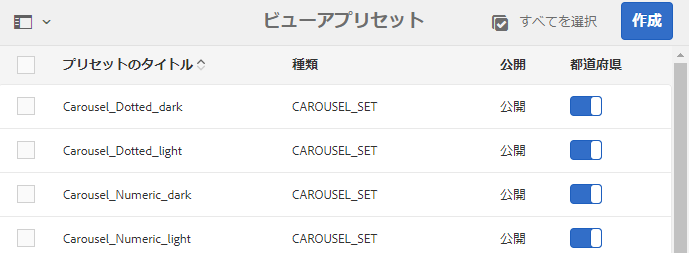

# ビューアプリセットの管理{#managing-viewer-presets}

ビューアプリセットは、ユーザーのコンピューター画面やモバイルデバイスでのリッチメディアアセットの表示方法を決定する様々な設定の集まりです。管理者は、ビューアプリセットを作成できます。設定は、幅広いビューア設定オプションで使用できます。例えば、ビューアの表示サイズやズームの動作を変更できます。

HTML5 ビューアーのプリセットを独自に作成およびカスタマイズする方法については、Adobe Dynamic Media の *HTML5 Viewer SDK API ドキュメント*&#x200B;を参照してください。SDK は、SDK 自体に組み込まれている IS 公開サーバーで使用できます。各ライブラリバージョンには、独自の SDK ドキュメントが含まれています。

パス：`<scene7_domain>/s7sdk/<library_version>/docs/jsdocs/index.html`\
たとえば、3.10 SDK の場合：[https://s7d1.scene7.com/s7sdk/3.10/docs/jsdoc/index.html](https://s7d1.scene7.com/s7sdk/3.10/docs/jsdoc/index.html)

[Adobe Dynamic Media ビューアリファレンスガイド](https://experienceleague.adobe.com/docs/dynamic-media-developer-resources.html?lang=ja)も参照してください。

このセクションでは、ビューアのプリセットを作成、編集、管理する方法について説明します。ビューアのプリセットは、アセットをプレビューする際にいつでも適用できます。詳しくは、「[ビューアのプリセットの適用](#applying-a-viewer-preset-to-an-asset)」を参照してください。

>[!NOTE]
>
>*事前に定義された標準提供ビューアプリセット*&#x200B;を編集するシナリオはサポートされていません。標準提供のビューアのプリセットを編集しようとすると、ビューアのプリセットに新しい名前を付けて保存するよう求められます。

## 閲覧者のキーボードアクセシビリティ {#keyboard-accessibility-for-viewers}

すべての標準提供ビューアでキーボードアクセシビリティがサポートされています。

[キーボードアクセシビリティとナビゲーション](https://experienceleague.adobe.com/docs/dynamic-media-developer-resources/library/c-keyboard-accessibility.html?lang=ja)に関するページも参照してください。

## ビューアプリセットの管理 {#managing-viewer-presets-1}

Adobe Experience Manager でビューアプリセットの追加、編集、削除、公開、非公開およびプレビューを実行できます。そのためには、**[!UICONTROL ツール（ハンマーアイコン）]**／**[!UICONTROL アセット]**／**[!UICONTROL ビューアプリセット]**&#x200B;を選択します。

>[!NOTE]
>
>アセットの詳細表示で「閲覧者」を選択すると、デフォルトでビューアのプリセットが 15 個表示されます。この制限は増やすことができます。[表示されるビューアプリセットの数を増やす](#increasing-the-number-of-viewer-presets-that-display)を参照してください。

### レスポンシブデザイン Web ページのビューアサポート {#viewer-support-for-responsive-designed-web-pages}

Web ページによってニーズは異なります。例えば、HTML5 ビューアが別のブラウザーウィンドウで 開くリンクを提供する web ページが必要な場合があります。ホスティングページに直接 HTML5 ビューアを埋め込む必要が生じる場合があります。後者の場合は、web ページのレイアウトが静的な場合や、「レスポンシブ」な場合があり、デバイスの違いやブラウザーウィンドウのサイズの違いによって表示が異なります。これらのニーズに対応するために、Dynamic Media に付属する事前定義済みの標準提供 HTML5 ビューアはすべて、静的な Web ページとレスポンシブデザイン Web ページの両方をサポートしています。

レスポンシブビューアを Web ページに埋め込む方法については、[レスポンシブ画像ライブラリ](https://experienceleague.adobe.com/docs/dynamic-media-developer-resources/image-serving-api/image-serving-api/responsive-static-image-library/c-about-responsive-static-image-library.html?lang=ja)を参照してください。

>[!NOTE]
>
>標準提供ビューアを使用するには、まずすべて公開する必要があります。
>[ビューアプリセットの公開]を参照してください。（#publishing-viewer-presets）

### ビューアプリセットのシステム互換性  {#viewer-preset-system-compatibility}

Dynamic Media に付属するすべての標準提供のビューアのプリセットは、次のシステムと完全に互換性があります。

* デスクトップ
* Apple iPhone
* Apple iPad
* Android™ スマートフォン
* Android™ タブレット
* ビデオについては、[Blackberry®](https://developer.blackberry.com/devzone/develop/supported_media/bb_media_support_at_a_glance.html#kba1328730952678) と [Windows Phone](https://docs.microsoft.com/ja-jp/windows/uwp/audio-video-camera/supported-codecs) 用に MP4 の再生が追加でサポートされています。

### ビューアプリセットのリッチメディアタイプ {#rich-media-types-for-viewer-presets}

管理者は、ビューアプリセットの作成時に次のリッチメディアタイプを追加してカスタマイズすることができます。

<table>
 <tbody>
  <tr>
   <td><strong>カルーセルセット</strong>  </td>
   <td>
ホットスポットや画像マップ、またはその両方が 2 つ以上の一連の画像に追加されます。お客様は画像を左右にパンし、画像のホットスポットをクリックして追加の詳細情報を入力したり、web サイトのテゴリー、ホーム、ランディングページから直接購入したりすることができます。
 </td>
  </tr>
  <tr>
   <td><strong>ディメンション</strong>  </td>
   <td>
3D シーンが表示され、カメラの回転、パン、ズーム、中心の変更が可能です。
 </td>
  </tr>
  <tr>
   <td><strong>フライアウトズーム</strong></td>
   <td>
ズームされた領域の 2 つ目の画像を元の画像の横に表示します。使用できるコントロールはありません。表示する領域に選択範囲を移動します。
 
このビューアの完全な帯域幅使用量を判断する際には、メイン画像とフライアウト画像の両方がビューアに提供されることを考慮してください。 メイン画像のサイズ（ステージの幅と高さ）とズーム率によって、フライアウト画像のサイズが決まります。フライアウトのファイルサイズが大きくなりすぎないようにするには、次の 2 つの値のバランスを取ります。メイン画像のサイズが大きい場合は、ズーム率の値を小さくします。（フライアウトの幅と高さによってフライアウトウィンドウのサイズが決まりますが、ビューアに提供されるフライアウト画像のサイズは決まりません。）
 
例えば、メイン画像のサイズが 350 x 350 ピクセルで、ズーム率が 3 の場合、生成されるフライアウト画像は 1050 x 1050 ピクセルになります。メイン画像のサイズが 300 x 300 ピクセルで、ズーム率が 4 の場合、フライアウト画像は 1200 x 1200 ピクセルになります。 JPEG 品質の設定（推奨設定は 80～90）によって、ファイルサイズを大幅に小さくすることができます。推奨ズーム率は、メイン画像のサイズに応じて 2.5～4 です。
 </td>
  </tr>
  <tr>
   <td><strong>インラインズーム</strong></td>
   <td>元のビューア内でズームされた領域の画像を表示します。使用するコントロールはありません。つまり、ユーザーは表示したい領域に選択範囲を移動します。</td>
  </tr>
  <tr>
   <td><strong>画像セット</strong></td>
   <td>画像セットビューアでは、サムネール画像を選択してアイテムの様々なビューやカラーを表示できます。このビューアは、画像を接近して確認するためのズームツールも提供しています。</td>
  </tr>
  <tr>
   <td><strong>インタラクティブ画像</strong></td>
   <td>ユーザーがクリックして追加の詳細情報を入力したり、web サイトのカテゴリ、ホームまたはランディングページから直接購入したりするためのホットスポットを画像の一部に追加します。</td>
  </tr>
  <tr>
   <td><strong>インタラクティブビデオ</strong></td>
   <td>ユーザーがクリックして追加の詳細情報を入力したり、web サイトのカテゴリ、ホームまたはランディングページから直接購入したりできるサムネールが、ビデオ内のタイムラインセグメントに追加されます。</td>
  </tr>
  <tr>
   <td><strong>混在メディア</strong></td>
   <td>1 つのビューアで異なる複数のタイプのメディアを表示します。スピンセット、画像セット、画像、ビデオを使用できます。</td>
  </tr>
  <tr>
   <td><strong>パノラマ画像</strong></td>
   <td>
パノラマ画像およびパノラマ VR ビューアでは球状のパノラマ画像をレンダリングして、部屋、プロパティ、場所、風景などの 360° の視聴エクスペリエンスにユーザーを没入させます。
 
アップロードした画像が球パノラマと見なされるには、次のいずれかまたは両方を満たす必要があります。

    <ul>
     <li>アスペクト比が 2:1 です。</li>
     <li>キーワード <code>equirectangular</code>、または <code>spherical</code> と <code>panorama</code>、または <code>spherical </code> と <code>panoramic</code> でタグ付けされている必要があります。<a href="/help/sites-authoring/tags.md">タグの使用</a>を参照してください。</li>
    </ul> 
アスペクト比とキーワードの両方の条件が、アセットの詳細ページと「パノラマメディア」WCM コンポーネントのパノラマアセットに適用されます。
 
<strong>重要</strong>：このビューアを使用できるのは、Dynamic Media - Scene7 モードのみです。
 </td>
  </tr>
  <tr>
   <td><strong>スマート切り抜きビデオ</strong>  </td>
   <td>
このビューアを使用して、ビデオの焦点を自動的に検出し、切り抜きます。
 </td>
  </tr>
  <tr>
   <td><strong>スピンセット</strong></td>
   <td>ユーザーがオブジェクトを回転させて、様々な面や角度を確認できるように、複数の画像ビューを提供します。</td>
  </tr>
  <tr>
   <td><strong>360 ビデオ</strong></td>
   <td>
360/VR ビデオビューアを使用すると、エクイレクタングラー形式でビデオをレンダリングして、室内、物件、場所、風景、医療処置などの臨場感あふれる表示を実現することができます。
 
フラットディスプレイでの再生時に、ユーザーは視野角を制御できます。また、モバイルデバイスでの再生では通常、デバイス組み込みのジャイロスコープ制御を適用します。
 
ビューアは、360 ビデオアセットの配信をネイティブでサポートしています。デフォルトでは、表示や再生のために追加の設定は必要ありません。360 ビデオは、.mp4、.mkv、.mov などの標準のビデオ拡張子を使用して配信します。最も一般的なコーデックは H.264 です。
 
<strong>重要</strong>：このビューアを使用できるのは、Dynamic Media - Scene7 モードのみです。
 </td>
  </tr>
  <tr>
   <td><strong>ビデオ</strong></td>
   <td>
プログレッシブまたはアダプティブビットレートストリーミングを使用してビデオを再生します。アダプティブビットレートストリーミングはデバイスと帯域幅を自動的に検出し、適切な形式で適切な品質のビデオを配信します。
 </td>
  </tr>
  <tr>
   <td><strong>垂直方向ズーム</strong></td>
   <td>
垂直ズームビューアでは、製品画像の視聴エクスペリエンスを最大化して、ユーザーに製品を最適に表示できます。スウォッチの垂直方向の位置では、次の操作を行います。

    <ul>
     <li>スクロールしなくてもスウォッチが表示されます。  水平方向のスウォッチの場合、ユーザーのデスクトップ画面サイズによっては、ユーザーがページを下にスクロールするまでスウォッチが見えないことがあります。ビューアにスウォッチを垂直方向に配置すると、ユーザの画面サイズに関係なくスウォッチが表示されます。</li>
     <li>メイン画像のサイズを最大化する。  水平方向のスウォッチの場合、確実に表示されるようにページ上にスペースを確保しておく必要があります。この配置によって、メイン画像のサイズが小さくなります。ただし、垂直方向のスウォッチレイアウトの場合は、こうしたスペースを確保する必要がありません。そのため、メイン画像のサイズを最大化できます。</li>
    </ul> </td>
  </tr>
  <tr>
   <td><strong>ズーム</strong></td>
   <td>ユーザーが領域を選択してズームインできます。ユーザーは、コントロールを選択して、ズームイン、ズームアウトおよび画像をデフォルトのサイズにリセットすることができます。</td>
  </tr>
 </tbody>
</table>

### 標準提供のビューアのプリセットの一覧 {#list-of-out-of-the-box-viewer-presets}

次の表に、Dynamic Media に付属するすべての事前定義済みの標準提供ビューアプリセットについて示します。

[ライブデモ](https://landing.adobe.com/en/na/dynamic-media/ctir-2755/live-demos.html)も参照してください。

ビューアでサポートされている Web ブラウザーとオペレーティングシステムのバージョンについては、ビューアのリリースノートに記載されています。

『[ビューアリファレンスガイド](https://experienceleague.adobe.com/docs/dynamic-media-developer-resources.html?lang=ja)』の目次の「ビューアのリリースノート」を参照してください。

>[!NOTE]
>
>Dynamic Media の標準提供のビューアプリセットはすべてアクティベート済み（オン）になっていますが、それらを公開する必要があります。
>[ビューアプリセットの公開](#publishing-viewer-presets)を参照してください。
>
>作成および追加した新しいすべてのビューアプリセットは、アクティベートされ公開されている必要があります。
>[ビューアプリセットのアクティベートとアクティベート解除](#activating-or-deactivating-viewer-presets)と[ビューアプリセットの公開](#publishing-viewer-presets)を参照してください。

<table>
 <tbody>
  <tr>
   <td><strong>ビューアプリセットのタイトル</strong></td>
   <td><strong>タイプ</strong></td>
   <td><strong>CSS ファイル名</strong>  </td>
  </tr>
  <tr>
   <td>Carousel_Dotted_dark</td>
   <td>Carousel_Set</td>
   <td><code>html5_carouselviewer_dotted_dark.css</code></td>
  </tr>
  <tr>
   <td>Carousel_Dotted_light</td>
   <td>Carousel_Set</td>
   <td><code>html5_carouselviewer_dotted_light.css</code></td>
  </tr>
  <tr>
   <td>Carousel_Numeric_dark</td>
   <td>Carousel_Set</td>
   <td><code>html5_carouselviewer_numeric_dark.css</code></td>
  </tr>
  <tr>
   <td>Carousel_Numeric_light</td>
   <td>Carousel_Set</td>
   <td><code>html5_carouselviewer_numeric_light.css</code></td>
  </tr>
  <tr>
   <td>ディメンショナル</td>
   <td>ディメンショナル</td>
   <td><code>html5_dimensionalviewer.css</code></td>
  </tr>
  <tr>
   <td>フライアウト</td>
   <td>Flyout_Zoom</td>
   <td><code>html5_flyoutviewer.css</code></td>
  </tr>
  <tr>
   <td>ImageSet_dark</td>
   <td>画像セット</td>
   <td><code>html5_zoomviewer_dark.css</code></td>
  </tr>
  <tr>
   <td>ImageSet_light</td>
   <td>画像セット</td>
   <td><code>html5_zoomviewer_light.css</code></td>
  </tr>
  <tr>
   <td>InlineMixedMedia_dark</td>
   <td>Mixed_Media</td>
   <td><code>html5_inlinemixedmediaviewer_dark.css</code></td>
  </tr>
  <tr>
   <td>InlineMixedMedia_light</td>
   <td>Mixed_Media</td>
   <td><code>html5_inlinemixedmediaviewer_light.css</code></td>
  </tr>
  <tr>
   <td>InlineZoom</td>
   <td>Flyout_Zoom</td>
   <td><code>html5_inlinezoomviewer.css</code></td>
  </tr>
  <tr>
   <td>MixedMedia_dark</td>
   <td>Mixed_Media</td>
   <td><code>html5_mixedmediaviewer_dark.css</code></td>
  </tr>
  <tr>
   <td>MixedMedia_light</td>
   <td>Mixed_Media</td>
   <td><code>html5_mixedmediaviewer_light.css</code></td>
  </tr>
  <tr>
   <td>PanoramicImage</td>
   <td>Panoramic_Image</td>
   <td><code>html5_panoramicimage.css</code></td>
  </tr>
  <tr>
   <td>PanoramicImageVR</td>
   <td>Panoramic_Image</td>
   <td><code>html5_panoramicimage.css</code></td>
  </tr>
  <tr>
   <td>Shoppable_Banner</td>
   <td>Interactive_Image</td>
   <td><code>html5_interactiveimage.css</code></td>
  </tr>
  <tr>
   <td>Shoppable_Video_dark</td>
   <td>Interactive_Video</td>
   <td><code>html5_interactivevideoviewer_dark.css</code></td>
  </tr>
  <tr>
   <td>Shoppable_Video_light</td>
   <td>Interactive_Video</td>
   <td><code>html5_interactivevideovewer_light.css</code></td>
  </tr>
  <tr>
   <td>SmartCropVideo</td>
   <td>Smart_Crop_Video</td>
   <td><code>html5_smartcropvideoviewer.css</code></td>
  </tr>
  <tr>
   <td>SmartCropVideo_social</td>
   <td>Smart_Crop_Video</td>
   <td><code>html5_smartcropvideoviewersocial.css</code></td>
  </tr>
  <tr>
   <td>SpinSet_dark</td>
   <td>Spin_Set</td>
   <td><code>html5_spinviewer_dark.css</code></td>
  </tr>
  <tr>
   <td>SpinSet_light</td>
   <td>Spin_Set</td>
   <td><code>html5_spinviewer_light.css</code></td>
  </tr>
  <tr>
   <td>
ビデオ
 
（クローズドキャプションのサポートを含む）
 </td>
   <td>ビデオ</td>
   <td><code>html5_videoviewer.css</code></td>
  </tr>
  <tr>
   <td>
Video360_social
 
（基本的なビデオ再生制御を含んでいます。ビデオレンダリングはステレオモードで行われます。手動の視点制御はオフですが、ジャイロスコープ制御はオンです。ソーシャルメディア機能はありません）
 </td>
   <td>ビデオ 360</td>
   <td><code>html5_video360viewersocial.css</code></td>
  </tr>
  <tr>
   <td>
Video360VR
 
（VR グラスを使用するエンドユーザー向けに設計。基本的なビデオ再生コントロールとソーシャルメディア機能を含む）
 </td>
   <td>ビデオ 360</td>
   <td><code>html5_video360viewer.css</code></td>
  </tr>
  <tr>
   <td>
Video_social
 
（クローズドキャプションおよびソーシャルメディアのサポートを含む）
 </td>
   <td>ビデオ</td>
   <td><code>html5_videoviewersocial.css</code></td>
  </tr>
  <tr>
   <td>Zoom_dark  </td>
   <td>ズーム  </td>
   <td><code>html5_basiczoomviewer_dark.css</code></td>
  </tr>
  <tr>
   <td>Zoom_light  </td>
   <td>ズーム</td>
   <td><code>html5_basiczoomviewer_light.css</code></td>
  </tr>
  <tr>
   <td>ZoomVertical_dark  </td>
   <td>Vertical_Zoom</td>
   <td><code>html5_zoomverticalviewer_dark.css</code></td>
  </tr>
  <tr>
   <td>ZoomVertical_light</td>
   <td>Vertical_Zoom</td>
   <td><code>html5_zoomverticalviewer_light.css</code></td>
  </tr>
 </tbody>
</table>

### サポートされているモバイルビューアのジェスチャーに関する表 {#supported-mobile-viewers-gestures-matrix}

iOS、Android™ 2.x および Android™ 3.x デバイスでサポートされているモバイルビューアジェスチャーを次の表に示します。

<table>
 <tbody>
  <tr>
   <td><strong>ジェスチャー</strong></td>
   <td><strong>フライアウトズーム</strong></td>
   <td><strong>ズーム</strong></td>
   <td><strong>スピン</strong></td>
  </tr>
  <tr>
   <td>
<strong>ドラッグ</strong>
 </td>
   <td>
パン
 </td>
   <td>
パン
 </td>
   <td>
パン
 </td>
  </tr>
  <tr>
   <td>
<strong>選択</strong>
 </td>
   <td>
フライアウトウィンドウを表示
 </td>
   <td>
ユーザインターフェイスを表示または非表示
 </td>
   <td>
ユーザインターフェイスを表示または非表示
 </td>
  </tr>
  <tr>
   <td>
<strong>ダブルタップ</strong>
 </td>
   <td>
適用なし
 </td>
   <td>
ズームインまたはリセット
 </td>
   <td>
ズームインまたはリセット
 </td>
  </tr>
  <tr>
   <td>
<strong>ピンチオープン</strong>
 </td>
   <td>
適用なし
 </td>
   <td>
ズームイン（iOS、Android™ 3x のみ）
 </td>
   <td>
ズームイン（iOS、Android™ 3x のみ）
 </td>
  </tr>
  <tr>
   <td>
<strong>ピンチクローズ</strong>
 </td>
   <td>
適用なし
 </td>
   <td>
ズームアウト（iOS、Android™ 3x のみ）
 </td>
   <td>
ズームアウト（iOS、Android™ 3x のみ）
 </td>
  </tr>
  <tr>
   <td>
<strong>スワイプ</strong>
 </td>
   <td>
スウォッチバーをスクロール
 </td>
   <td>
画像をスクロール
 </td>
   <td>
スピン
 </td>
  </tr>
  <tr>
   <td>
<strong>フリック</strong>
 </td>
   <td>
スウォッチバーをスクロール
 </td>
   <td>
画像をスクロール
 </td>
   <td>
スピン
 </td>
  </tr>
 </tbody>
</table>

## 表示されるビューアプリセットの数を増やす {#increasing-the-number-of-viewer-presets-that-display}

Experience Manager では、**[!UICONTROL 詳細ビュー]**／**[!UICONTROL ビューア]**&#x200B;でアセットを表示すると、さまざまなビューアのプリセットが表示されます。表示されるビューアの数を増減できます。

**表示されるビューアプリセットの数を増やす：**

1. CRXDE Lite（[https://localhost:4502/crx/de](https://localhost:4502/crx/de)）に移動します。
1. 次の場所にあるビューアプリセットリストノードに移動します。

   `/libs/dam/gui/coral/content/commons/sidepanels/viewerpresets/viewerpresetslist`

   

1. 「**[!UICONTROL limit]**」プロパティで、「**[!UICONTROL 値]**」（デフォルトで 15 に設定されています）を目的の数に変更します。
1. ビューアプリセットデータソース（`/libs/dam/gui/coral/content/commons/sidepanels/viewerpresets/viewerpresetslist/datasource`）に移動します。

   

1. 「limit」プロパティの数を、目的の数（例：`{empty requestPathInfo.selectors[1] ? "20" : requestPathInfo.selectors[1]}`）に変更します。
1. 「**[!UICONTROL すべて保存]**」を選択します。

## ビューアプリセットを作成する {#creating-a-new-viewer-preset}

ビューアプリセットを作成しておくと、アセットの表示やアセットとの対話のための様々な設定を適用できます。ただし、ビューアプリセットを作成する必要はありません。デフォルトの、すぐに使えるビューアプリセットが既に AEM Assets に付属していますので、これを使用できます。

ビューアプリセットの作成を選んだ場合、ビューアプリセットを保存すると、ビューアプリセットページのそのビューアの状態が自動的にアクティベート済みになります（「**[!UICONTROL オン]**」に設定されます）。この状態は、画像やビデオをプレビューするときは常に Dynamic Media コンポーネントとインタラクティブメディアコンポーネントに表示されることを意味します。

一部のビューアプリセットには、ビューアの全体的な動作に影響する専用の設定があります。作成するピューアプリセットによっては、これらの特別な配慮が必要な場合があります。

[インタラクティブなビューアのプリセットを作成するための特別な考慮事項](#special-considerations-for-creating-an-interactive-viewer-preset)を参照してください。

[カルーセルバナーのビューアプリセットの作成に関する考慮事項](#special-considerations-for-creating-a-carousel-banner-viewer-preset)を参照してください。

**ビューアプリセットを作成するには：**

1. Adobe Experience Manager の左上隅にある Adobe Experience Manager ロゴを選択し、左のレールで&#x200B;**[!UICONTROL ツール]**（ハンマーのアイコン）／**[!UICONTROL Assets]／[!UICONTROL ビューアプリセット]**&#x200B;を選択します。

   

1. ビューアプリセットページのツールバーで、「**[!UICONTROL 作成]**」を選択します。
1. **[!UICONTROL 新規ビューアプリセット]**&#x200B;ダイアログボックスで、「**[!UICONTROL プリセット名]**」フィールドに新しいプリセットの名前を入力します。名前は慎重に選択してください。「**[!UICONTROL 作成]**」を選択した後で編集することはできません。

   後述の手順でプリセットを保存すると、この名前がビューアプリセットページの「プリセットのタイトル」列ヘッダーの下に表示されます。

1. 「リッチメディアタイプ」ドロップダウンメニューで、作成するビューアプリセットのタイプを選択し、ページ右上隅の「**[!UICONTROL 作成]**」を選択します。

   [ビューアプリセットのリッチメディアタイプ](#rich-media-types-for-viewer-presets)を参照してください。

1. ビューアプリセットエディターページで、「**[!UICONTROL 外観]**」タブを選択します。
1. 次のいずれかの操作を行います。

   * 「**[!UICONTROL 選択したタイプ]**」プルダウンメニューで、ビジュアルデザインをカスタマイズするコンポーネントを選択します。または、設定するビジュアル要素をビューアで選択することもできます。

      Visual Editor を使用すると、特定のプロパティがスタイルに与える効果を確認できます。プロパティを設定または調整すると、Visual Editor の左にあるサンプルを使用して、ビューア上での効果を瞬時に確認できます。

      ビューアプリセットタイプごとの CSS スタイル設定プロパティについては、『[ビューアリファレンスガイド](https://experienceleague.adobe.com/docs/dynamic-media-developer-resources.html?lang=ja)』の「*`<viewer name>`* ビューアのカスタマイズ」のヘルプトピックを参照してください。例えば、`Mixed_Media` タイプのビューアプリセットを作成している場合、プロパティのリストと各プロパティの説明については、[混在メディアビューアのカスタマイズ](https://experienceleague.adobe.com/docs/dynamic-media-developer-resources/library/viewers-aem-assets-dmc/mixed-media/customing-mixed-media/c-html5-mixedmedia-viewer-customizingviewer.html?lang=ja)を参照してください。

   * スタイル設定を別個の CSS ファイルで定義している場合は、その CSS ファイルを AEM Assets にアップロードできます。「**[!UICONTROL 選択したタイプ]**」プルダウンメニューの下の「**[!UICONTROL CSS を読み込み]**」をタップし（必要に応じて、Visual Editor を上にスクロールして表示します）、アップロードした CSS ファイルを探してビューアプリセットと関連付けます。

      CSS ファイルを読み込むと、Visual Editor は、その CSS に正しいビューアマーカーが使用されているかを確認します。例えば、ズームビューアを作成している場合、読み込むすべての CSS ルールが、親のビューアエレメントに定義されているズームビューアのクラス名 `.s7mixedmediaviewer` を使用して定義されている必要があります。

      指定ビューアの CSS マーカーが正しく定義された CSS であれば、自作した任意の CSS を読み込むことができます（CSS マーカーについては、『[ビューアリファレンスガイド](https://experienceleague.adobe.com/docs/dynamic-media-developer-resources.html?lang=ja)』の「*&lt;viewer name>* ビューアのカスタマイズ」のヘルプトピックを参照してください。例えば、ズームビューアの CSS マーカーについては、[ズームビューアのカスタマイズ](https://experienceleague.adobe.com/docs/dynamic-media-developer-resources/library/viewers-aem-assets-dmc/zoom/customizing-zoom/c-html5-20-zoom-viewer-customizingviewer.html?lang=ja)を参照してください）。ただし、Visual Editor が一部の CSS 値を理解できないこともありえます。そのような場合、Visual Editor は、CSS が正常に機能するように、エラーを上書きしようとします。
   >[!NOTE]
   >
   >RAW 形式で CSS を直接編集する場合は、「選択したタイプ」プルダウンメニューの下の「**[!UICONTROL CSS を表示／非表示]**」を選択します（必要に応じて、ビジュアルエディターを上にスクロールして表示します）。
   >Visual Editor と同様に、CSS でプロパティを直接変更すると、ビューアサンプルにその効果がすぐに反映されます。また、ビジュアルエディターでは、同じプロパティが同時に自動的に更新されます。そのため、生の CSS エディターまたはビジュアルエディターを使用することも、両方を区別なく使用することもできます。

   >[!NOTE]
   >
   >ボタンのアートワークの場合は、2 倍画像を選択し、高解像度のアートワークをアップロードします。インタラクティブ画像やショッパブルバナーを操作する場合は、すぐに使える様々なホットスポットボタンから選択することもできます。

1. （オプション）ビューアプリセットを編集ページの最上部の近くにある「**[!UICONTROL デスクトップ]**」、「**[!UICONTROL タブレット]**」または「**[!UICONTROL 電話]**」を選択して、異なる種類のデバイスや画面のビジュアルスタイルを個別に定義します。
1. ビューアプリセットエディターページで、「**[!UICONTROL ビヘイビアー]**」タブを選択します。または、任意のビジュアル要素をビューアで選択して設定することもできます。
例えば、 *VideoPlayer* タイプの場合、**[!UICONTROL 修飾子]**／**[!UICONTROL 再生]**&#x200B;で、アダプティブビットレートストリーミングの 3 つのオプションの中から 1 つを選択できます。

   * **[!UICONTROL dash]** - ビデオは DASH としてのみストリーミングされます。ただし、Safari または iOS デバイスでは、代わりに **[!UICONTROL hls]** タイプを選択する必要があります。
   * **[!UICONTROL hls]** - ビデオは HLS としてのみストリーミングされます。
   * **[!UICONTROL auto]** - ベストプラクティスです。DASH ストリームおよび HLS ストリームの作成では、ストレージの最適化が図られています。そのため、再生タイプには常に **[!UICONTROL auto]** を選択することを推奨します。ビデオは、次の再生順序のように、ダッシュ、HLS、プログレッシブとしてストリーミングされます。
      * ブラウザーが DASH をサポートしている場合は、最初に DASH ストリーミングが使用されます。
      * ブラウザーが DASH をサポートしていない場合は、次に HLS ストリーミングが使用されます。
      * ブラウザーが DASH も HLS もサポートしていない場合は、最後にプログレッシブ再生が使用されます。

   >[!NOTE]
   >
   >**[!UICONTROL dash]**&#x200B;オプションを表示して使用するには、まずアドビテクニカルサポートでアカウントを有効にする必要があります。詳しくは、「[アカウントでの DASH の有効化](/help/assets/video.md#enable-dash)」を参照してください。

1. 「**[!UICONTROL 選択したタイプ]**」プルダウンメニューで、動作を変更するコンポーネントを選択します。

   ビジュアルエディターの多くのコンポーネントには、詳細な説明が関連付けられています。これらの説明は、コンポーネントを展開して関連するパラメーターを表示したときに、青いボックス内に表示されます。

   一部のビューアタイプには、「**[!UICONTROL IS コマンド]**」テキストフィールドに画像サービングコマンドを指定できるコンポーネントがあります。使用できるコマンドのリストについては、[画像サービング API リファレンス（英語）](https://experienceleague.adobe.com/docs/dynamic-media-developer-resources/image-serving-api/image-serving-api/c-is-home.html?lang=ja)を参照してください。

   >[!NOTE]
   >
   >**スマートフォンやタブレットなどのタッチデバイスを使用している場合**
   >
   >
   >テキストフィールドに値を入力後、ユーザーインターフェイス内を選択すると、変更内容が送信され、仮想キーボードが閉じられます。Enter キーを押した場合は、何も実行されません。

1. ページの右上隅にある「**[!UICONTROL 保存]**」を選択します。
1. 新しいビューアプリセットを公開して、web サイトで使用できるようにします。

   [ビューアプリセットの公開](#publishing-viewer-presets)を参照してください。

   >[!IMPORTANT]
   >
   >アダプティブビットレートストリーミングのプロファイルを使用する古いビデオでは、[ビデオアセットを再処理](/help/assets/processing-profiles.md#reprocessing-assets)するまで、その URL で通常通り HLS ストリーミングを使用して再生を行います。再処理後も、同じ URL が引き続き機能しますが、 *両方* DASH および HLS ストリーミングが有効になっています。

### インタラクティブなビューアのプリセットを作成するための特別な考慮事項 {#special-considerations-for-creating-an-interactive-viewer-preset}

**パネル内の画像サムネールのディスプレイモードについて**

インタラクティブビデオのビューアプリセットを作成または編集するとき、「**[!UICONTROL ビヘイビアー]**」タブの&#x200B;**[!UICONTROL 選択したコンポーネント]**&#x200B;メニューから `InteractiveSwatches` を選択するときに使用するディスプレイモードの設定を選択できます。選択するディスプレイモードは、ビデオの再生中にサムネールを表示する方法とタイミングに影響します。`segment`ディスプレイモード（デフォルト）または `continuous` ディスプレイモードを選択できます。

<table>
 <tbody>
  <tr>
   <td><strong>ディスプレイモード</strong></td>
   <td><strong>説明</strong></td>
  </tr>
  <tr>
   <td>セグメント</td>
   <td>
<code>Segment </code>は、既製のインタラクティブビデオビューアプリセット <code>Shoppable_Video_light</code> と <code>Shoppable_Video_dark</code> および自身で作成するすべてのインタラクティブビデオビューアプリセットのデフォルトのディスプレイモードです。
 
このモードでは、ビデオセグメントに割り当てられているサムネールの数がディスプレイパネルに表示されるスポットの数よりも少ない場合、次または前のサブセグメントのサムネールが取り込まれて、パネル内の空白部分が埋められることは<i>ありません</i>。つまり、特定のビデオセグメントに割り当てられたスウォッチの表示が保持されます。
 </td>
  </tr>
  <tr>
   <td>連続</td>
   <td>
<code>continuous </code>ディスプレイモードでは、セグメント内のサムネールの数がパネルに表示される数より少ない場合、ビューアには次のセグメントからのサムネールの表示が自動的に含まれます。または、最後のサムネールが表示されている場合、ビューアには前のセグメントのサムネールの表示が自動的に含まれます。
 
<a href="/help/assets/interactive-videos.md">このトピックの</a>ビデオは <code>continuous </code> ディスプレイモードの一例です。
 </td>
  </tr>
 </tbody>
</table>

**インタラクティブビデオビューアの自動スクロール動作について**

インタラクティブなビデオビューアのサムネイルの自動スクロールは、選択した表示モードとは関係なく機能します。

インタラクティブビデオのビューアプリセットを作成または編集するときは、「ビヘイビアー」タブから自動スクロールにアクセスします。**[!UICONTROL 選択したコンポーネント]**&#x200B;ドロップダウンメニューの「ビヘイビアー」タブで、「**[!UICONTROL InteractiveSwatches]**」を選択します。「自動スクロール」チェックボックスは「IS コマンド」テキストフィールドの下にリストされます。

ビューアプリセットで「**[!UICONTROL 自動スクロール」]**&#x200B;を無効（チェックボックスをオフ）にした場合、ユーザーによるビデオの再生中、パネルにはビデオの全長につき最初のサムネール画像のみが表示されます。ただし、ユーザーは必要に応じて上下の矢印アイコンを使用してサムネール間を手動でスクロールできます。

ビューアプリセットで「**[!UICONTROL 自動スクロール]**」を有効（チェックボックスをオン）にすると、ビデオの再生中、セグメントの開始時に、ビデオセグメントに割り当てられたサムネール画像まで表示がスクロールされます。ただし、セグメントによっては特定のサムネールが前後のサムネールの 2 倍の時間表示されることもあります。この動作は、セグメント内のサムネールの数がパネルに表示される数よりも多く、均等に分割できないことが原因で発生します。

説明のために、30 秒のビデオセグメントが 1 つあるとします。また、30 秒間に表示されるサムネイルは合計 9 個です。ブラウザーのサイズは、ディスプレイパネルの 4 つの位置でサムネイルが表示されるように設定されます。30 秒のビデオの時間セグメントは 3 つのサブセグメントに分割されています。次の表に、指定の時間サブセグメントに表示されるサムネールの内訳を示します。

| **ビデオサブセグメント** | **サブセグメント時間（秒単位）** | **パネルに表示されるサムネイル** |
|---|---|---|
| 1 | 0～10 | 1、2、3、4 |
| 2 | 10～20 | 4、5、6、7 |
| 3 | 20～30 | 6、7、8、9 |

ビデオサブセグメント 3 が、割り当てられているサムネールを超えて拡張されることはありません。また、サムネール 4、6、7 は、他のサムネールの 2 倍の長さでパネルに表示されます。

ビューアが、表示できる位置の数に基づいて、パネルに表示するサムネイルの数を決定するロジックは次のとおりです。

* サブセグメントの数 = 次のサブセグメントに切り上げ（サムネールの数／サムネールパネル内に表示されるスロットの数（ブラウザー画面のサイズに基づく））前述の表の例では、「9 サムネール / 4 スロット = 2.25」になります（ビューアのロジックにより 2.25 が 3 サブセグメントに切り上げられます）。

* サムネールの数 = 次のサムネールに切り上げ（サムネールの数／ビデオサブセグメントの数）前述の表の例では、「9 サムネール / 3 ビデオサブセグメント = 3 サムネール」になります。

* サブセグメントの表示時間 = ビデオの合計再生時間 / ビデオサブセグメントの数
前述の表の例では、「30 秒 / 3 ビデオサブセグメント = 各ビデオサブセグメントで 10 秒」の再生時間になります。

#### カルーセルバナーのビューアプリセットの作成に関する特別な考慮事項 {#special-considerations-for-creating-a-carousel-banner-viewer-preset}

カルーセルバナーのビューアプリセットを作成するときに、ホットスポットのスタイル変更は次のように実行できます。

|  | **説明** | **アクション** |
|---|---|---|
| **[!UICONTROL ホットスポットアイコン]** | ホットスポットに使用するアイコンを変更する | ホットスポットアイコンの画像を変更するには、「**[!UICONTROL 外観]**」タブで、「**[!UICONTROL 選択したコンポーネント]**」の「**[!UICONTROL ImageMapEffect]**」を選択します。「**[!UICONTROL アイコン]**」で「**[!UICONTROL 背景]**」を選択し、「**[!UICONTROL 画像]**」フィールドで目的に背景画像に移動します。 |

## ビューアプリセットのアクティベートまたはアクティベート解除 {#activating-or-deactivating-viewer-presets}

ユーザーインターフェイスで使用できるビューアのプリセットは、どれがオーサーモードでアクティブになっているかによって異なります。デフォルトでは、ビューアのプリセットは作成後に「オン」になります。プリセットをオフにすると、オーサーモードでは表示されなくなります。プリセットを公開する場合は、オン／オフに関係なく、常に公開されます。リストの項目が多すぎる場合や、特定のビューアプリセットを使用できないようにする場合は、ビューアプリセットのアクティベートを解除することもできます。

**ビューアプリセットをアクティベートまたはアクティベート解除するには：**

1. Adobe Experience Manager の左上隅にある Adobe Experience Manager ロゴを選択し、左のレールで&#x200B;**[!UICONTROL ツール]**（ハンマーのアイコン）／**[!UICONTROL アセット]**／**[!UICONTROL ビューアプリセット]**&#x200B;を選択します。
1. ビューアプリセットページの「**[!UICONTROL 状態]**」列ヘッダーの下で、ビューアプリセットのアクティベートとアクティベート解除の切り替えアイコンを選択します。

   アクティベートされたビューアプリセットには、右側の青いボックスに切替スイッチが表示されます。アクティベート解除されたビューアプリセットには、左側の薄いグレーのボックスに切替スイッチが表示されます。

## ビューアプリセットの公開 {#publishing-viewer-presets}

ビューアプリセットの状態をアクティベートする（または「オン」に切り替える）と、Dynamic Media コンポーネントとインタラクティブメディアコンポーネント内、およびアセットを表示する際に表示されるようになります。

ただし、ビューアプリセットを使用しているアセットを&#x200B;*配信*&#x200B;するには、そのビューアプリセットも公開する必要があります。URL を取得したりアセットのコードを埋め込むには、すべてのビューアプリセットをアクティベートし、*かつ*&#x200B;公開する必要があります。Dynamic Media に付属しているすべての初期設定されているビューアプリセットをアクティベートして公開する必要があります。自分で作成して追加したカスタムビューアプリセットは自動的にアクティベートされますが、やはり手動で公開する必要があります。

「[ビューアのプリセットのアクティベートとアクティベート解除](#activating-or-deactivating-viewer-presets)」を参照してください。

「[アセットのプレビュー](/help/assets/previewing-assets.md)」も参照してください。

**ビューアプリセットを公開するには：**

1. Adobe Experience Manager の左上隅にある Adobe Experience Manager ロゴを選択し、左のレールで&#x200B;**[!UICONTROL ツール]**（ハンマーのアイコン）／**[!UICONTROL アセット]**／**[!UICONTROL ビューアプリセット]**&#x200B;を選択します。
1. 公開するビューアプリセットを 1 つ以上選択します。
1. ツールバーの&#x200B;**[!UICONTROL 公開]**&#x200B;アイコンを選択します。

## ビューアプリセットの並べ替え {#sorting-viewer-presets}

1. Adobe Experience Manager の左上隅にある Adobe Experience Manager ロゴを選択し、左のレールで&#x200B;**[!UICONTROL ツール]**（ハンマーのアイコン）／**[!UICONTROL アセット]**／**[!UICONTROL ビューアプリセット]**&#x200B;を選択します。
1. 「**[!UICONTROL プリセットのタイトル]**」、「**[!UICONTROL タイプ]**」、「**[!UICONTROL 公開]**」または「**[!UICONTROL 状態]**」を選択して、その見出しの列でソートします。例えば、「**[!UICONTROL タイプ]**」を選択すると、ビューアプリセットのタイプが、アルファベット順で、またはアルファベットの逆の順序でソートされます。

## ビューアプリセットの編集 {#editing-viewer-presets}

*事前に定義された標準提供ビューアプリセット*&#x200B;を編集するシナリオはサポートされていません。標準提供ビューアプリセットを編集すると、新しい名前で保存するように指示されます。

**ビューアプリセットを編集するには：**

1. Adobe Experience Manager の左上隅にある Adobe Experience Manager ロゴを選択し、左のレールで&#x200B;**[!UICONTROL ツール]**（ハンマーのアイコン）／**[!UICONTROL アセット]**／**[!UICONTROL ビューアプリセット]**&#x200B;を選択します。
1. ビューアプリセットのタイトルの左側にあるチェックボックスをオンにして、プリセットを選択します。
1. ツールバーの「**[!UICONTROL 編集]**」を選択します。
1. **[!UICONTROL ビューアプリセットエディター]**&#x200B;ページで、「**[!UICONTROL 外観]**」タブと「**[!UICONTROL 動作]**」タブのオプションを使用して、必要な変更をビューアプリセットに加えます。

   「**[!UICONTROL 外観]**」タブで、ビューアプリセットエディターページの左上隅近くにある「**[!UICONTROL デスクトップ]**」、「**[!UICONTROL タブレット]**」、「**[!UICONTROL 電話]**」のいずれかを選択して、アセットの表示モードを変更します。

1. ページの右上隅近くで、次のいずれかの操作を行います。

   * 「**[!UICONTROL 保存]**」を選択して変更内容を保存し、ビューアプリセットページに戻ります。
   * 「**[!UICONTROL キャンセル]**」を選択して変更内容をキャンセルし、ビューアプリセットページに戻ります。

## カスタムビューアプリセットの削除 {#deleting-custom-viewer-presets}

作成して Dynamic Media に追加したビューアプリセットを削除できます。

**カスタムビューアプリセットを削除するには：**

1. Experience Manager の左上隅にある Experience Manager ロゴを選択し、左のレールで「**[!UICONTROL ツール]**」（ハンマーのアイコン）／**[!UICONTROL アセット]**／**[!UICONTROL ビューアプリセット]**&#x200B;を選択します。
1. ビューアプリセットページで、「プリセットのタイトル」のチェックボックスをオンにして、**[!UICONTROL ごみ箱]**&#x200B;アイコンを選択します。
1. 「**[!UICONTROL 削除]**」を選択します。

## アセットへのビューアプリセットの適用 {#applying-a-viewer-preset-to-an-asset}

アセットと選択したビューアを既に公開している場合は、ビューアプリセットの選択後に「**[!UICONTROL URL]**」ボタンと「**[!UICONTROL 埋め込み]**」ボタンが表示されます。

**アセットにビューアプリセットを適用するには：**

1. アセットを開き、ページの左上隅付近にあるドロップダウンメニュー選択して、「**[!UICONTROL ビューア]**」を選択します。

   >[!NOTE]
   >
   >アセットと選択したビューアを既に公開している場合は、ビューアプリセットの選択後に「**[!UICONTROL URL]**」ボタンと「**[!UICONTROL 埋め込み]**」ボタンが表示されます。

1. 左側のウィンドウからビューアプリセットを選択して、アセットに適用できるようにします。

   [この URL をコピー](/help/assets/linking-urls-to-yourwebapplication.md)して、他のユーザーと共有できます。

## ビューアプリセットを使用したアセットの配信 {#delivering-assets-with-viewer-presets}

ビューアプリセットの URL を取得する方法については、[Web アプリケーションへの URL のリンク](/help/assets/linking-urls-to-yourwebapplication.md)を参照してください。[Web ページへのビデオビューアの埋め込み](/help/assets/embed-code.md)も参照してください。

Adobe Experience Manager を WCM として使用している場合は、ビューアプリセットを使用するアセットをページに直接追加できます。[ページへの Dynamic Media アセットの追加](/help/assets/adding-dynamic-media-assets-to-pages.md)を参照してください。
