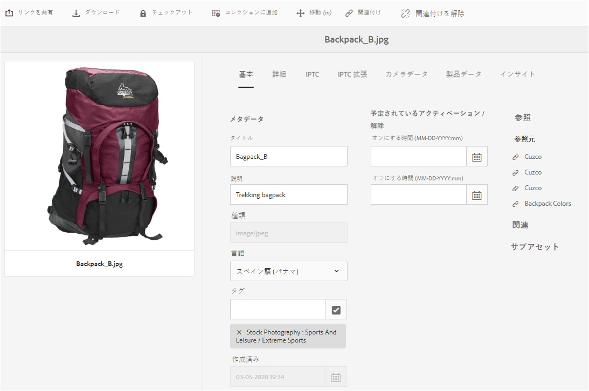

# メタデータの編集と追加 {#how-to-edit-or-add-metadata}

メタデータは、検索可能なアセットに関する追加情報です。画像をアップロードすると自動的に抽出されます。既存のメタデータを編集したり、新しいメタデータプロパティを既存のフィールドに追加したりできます。例えば、メタデータフィールドが空白の場合などです。

組織は、制御された信頼性の高いメタデータの語彙を必要とします。 したがって、 [!DNL Experience Manager Assets] 新しいメタデータプロパティのオンデマンド追加は許可されません。 作成者ではなく開発者が、アセット用に新しいメタデータフィールドを追加できます。 詳しくは、アセットのメタデータプロパティの [作成を参照してください](meta-edit.md#editing-metadata-schema)。

## Edit metadata for an asset {#editing-metadata-for-an-asset}

メタデータを編集するには、次の手順に従います。

1. 次のいずれかの操作をおこないます。

   * インター [!DNL Assets] フェイスでアセットを選択し、ツールバーの「 **[!UICONTROL 表示プロパティ]** 」をクリックします。
   * アセットのサムネールから、「**[!UICONTROL プロパティを表示]**」クイックアクションを選択します。
   * アセットページで、ツールバーの **[!UICONTROL 表示プロパティ]** アセット情報アイコンをクリックします。

   アセットページには、すべてのアセットのメタデータが表示されます。 アセットがにアップロード（取り込む）されると、メタデータが抽出され [!DNL Experience Manager]ます。

   

   *図： アセットの[!UICONTROL プロパティ]ページのメタデータを編集または追加します。*

1. Make edits to the metadata under the various tabs, as required, and when completed, click **[!UICONTROL Save]** from the toolbar to save your changes. Click **[!UICONTROL Close]** to return to the [!DNL Assets] web interface.

   >[!NOTE]
   >
   >テキストフィールドが空の場合、現在設定されているメタデータはありません。フィールドに値を入力して保存すると、そのメタデータプロパティを追加できます。

アセットのメタデータへの変更内容は、XMP データの一部として元のバイナリに書き戻されます。メタデータ書き込みワークフローは、元のバイナリにメタデータを追加します。 Changes made to the existing properties (such as `dc:title`) are overwritten and new properties (including custom properties like `cq:tags`) are added with the schema.

XMP write-back is supported and enabled for the platforms and file formats described in [technical requirements.](/help/sites-deploying/technical-requirements.md)

## Edit metadata schema {#editing-metadata-schema}

詳しくは、「メタデータスキーマフォームの [編集](metadata-schemas.md#edit-metadata-schema-forms)」を参照してください。

## カスタム名前空間を [!DNL Experience Manager] {#registering-a-custom-namespace-within-aem}

You can add your own namespaces within [!DNL Experience Manager]. Just as there are predefined namespaces such as `cq`, `jcr`, and `sling`, you can have a namespace for your repository metadata and XML processing.

1. ノードタイプ管理ページにアクセス `https://[aem_server]:[port]/crx/explorer/nodetypes/index.jsp`します。
1. 名前空間管理ページにアクセスするには、ページの上部にある **[!UICONTROL 名前空間]** をクリックします。
1. 名前空間を追加するには、ページの下部にある **[!UICONTROL 新規]** (New)をクリックします。
1. XML名前空間の規則でカスタム名前空間を指定します。 URIの形式でIDを指定し、IDに関連付けられたプレフィックスを指定します。 「**[!UICONTROL 保存]**」をクリックします。

>[!MORELIKETHIS]
>
>* [メタデータとアセット内でのニーズについて](metadata.md)
>* [XMP メタデータ](xmp.md)
>* [メタデータのスキーマに関する参照情報](meta-ref.md)

