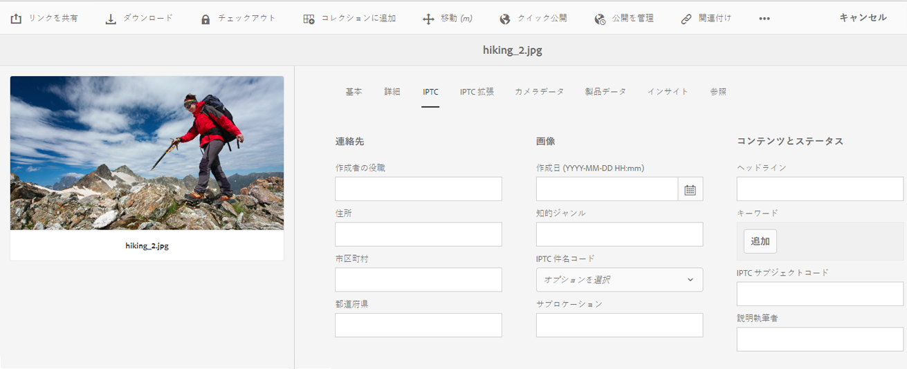

# メタデータの概念について {#why-we-need-metadata}

メタデータとは、データに関する情報のことです。この点に関して、データは、例えば画像などのデジタルアセットを指します。メタデータは、効率的なアセット管理をおこなうために重要です。

メタデータは、対象のアセットで使用できるすべてのデータのコレクションですが、次のようなデータはそのアセットに含まれているとは限りません。メタデータの例を以下に示します。

* アセットの名前。
* 最終変更の日時。
* リポジトリに格納されたときのアセットのサイズ。
* アセットが含まれるフォルダーの名前。
* 関連するアセットまたは適用したタグ。

上記は、アセットに対して [!DNL Experience Manager] が管理できる基本的なメタデータプロパティです。これにより、ユーザーはすべてのアセットを表示できます。例えば、最終変更日にアセットを並べ替えると、最近追加したアセットを検出する場合に便利です。

デジタルアセットに、次のようなデータをさらに追加できます。

* アセットのタイプ（画像、ビデオ、オーディオクリップ、ドキュメントなど）。
* アセットの所有者。
* アセットのタイトル。
* アセットの説明。
* アセットに割り当てられたタグ。

メタデータが多いほど、アセットをより細かく分類でき、デジタル情報量が大きくなるにつれ便利です。数百個のファイルをファイル名だけに基づいて管理することは可能です。ただし、このアプローチは拡張性に欠けます。関係者の数や管理対象のアセット数が増えると不十分になります。

メタデータを追加すると、以下の理由からデジタルアセットの価値が大きくなります。

* アクセスが容易になる - システムやユーザーが簡単に見つけることができます。
* 管理しやすくなる - 一連の同じプロパティを持つアセットを容易に検索し、これらのアセットに変更を適用できます。
* 完全 - アセットは、より多くの情報とコンテキスト、より多くのメタデータを保持します。

したがって、[!DNL Assets] ではデジタルアセットのメタデータの作成、管理およびやり取りをおこなう適切な方法を提供します。

## メタデータのタイプ {#types-of-metadata}

メタデータの 2 つの基本的なタイプは、テクニカルメタデータと記述メタデータです。

テクニカルメタデータは、デジタルアセットを操作しているソフトウェアアプリケーションで役に立つもので、手動で管理できません。[!DNL Experience Manager Assets] と他のソフトウェアは、自動的にテクニカルメタデータを決定し、アセットが変更されるとメタデータが変更される場合があります。アセットで使用可能なテクニカルメタデータは、主にアセットのファイルタイプによって決まります。テクニカルメタデータの例を以下に示します。

* ファイルのサイズ。
* 画像の寸法（高さと幅）。
* オーディオまたはビデオファイルのビットレート。
* 画像の解像度（詳細レベル）。

記述メタデータは、アセットが属するビジネスなど、アプリケーションドメインに関するメタデータです。記述メタデータは自動で定義できません。手動または半自動で作成されます。例えば、GPS 対応のカメラでは、緯度と経度を自動的に追跡し、画像に地理タグを追加できます。

記述メタデータ情報を手動で作成する場合のコストは高くなります。そのため、ソフトウェアシステムや組織間でのメタデータの交換を容易にするための基準が確立されています。[!DNL Experience Manager Assets] は、メタデータの管理に関連するすべての規格をサポートします。

## エンコーディング規格 {#encoding-standards}

メタデータをファイルに埋め込む方法は様々です。エンコーディング規格は、次の中から選択できます。

* XMP：[!DNL Assets] で抽出したメタデータをリポジトリに格納するために使用されます。
* ID3：オーディオファイルおよびビデオファイル用の規格です。
* Exif：画像ファイル用の規格です。
* その他、従来の規格：[!DNL Microsoft Word]、[!DNL PowerPoint]、[!DNL Excel] など。

### XMP {#xmp}

[!DNL Extensible Metadata Platform]（XMP）は、すべてのメタデータ管理に対して [!DNL Experience Manager Assets] で使用されるオープンな標準です。XMP は、すべてのファイル形式に埋め込むことができる、ユニバーサルメタデータエンコーディングを提供します。アドビやその他の企業は、リッチコンテンツモデルを提供する XMP 標準をサポートしています。XMP 標準および [!DNL Experience Manager Assets] のユーザーは、基盤となる強力なプラットフォームを持っています。詳しくは、[XMP](https://www.adobe.com/products/xmp.html) を参照してください。

### ID3 {#id}

これらの ID3 タグに格納されたデータは、コンピューターまたはポータブル MP3 プレーヤー上でデジタルオーディオファイルの再生時に表示されます。

ID3 タグは、MP3 ファイルフォーマット用に設計されています。各フォーマットのその他の情報：

* ID3 タグは、MP3 ファイルおよび mp3PRO ファイルで使用できます。
* WAV ではタグが使用されません。
* WMA には、オープンソースの実装を許可しない独自のタグがあります。
* Ogg Vorbis では、Ogg コンテナに埋め込まれた Xiph コメントを使用します。
* AAC では独自のタグフォーマットが使用されます。

### Exif {#exif}

Exchangeable image file format（Exif）は、デジタル写真で最も一般的に使用されるメタデータフォーマットです。JPEG、TIFF、RIFF、WAV など、多くのファイル形式でメタデータプロパティの固定語彙を埋め込む方法を提供します。Exif によって、メタデータの名前と値のペアとして、メタデータが格納されます。これらのメタデータの名前と値のペアはタグとも呼ばれます。[!DNL Experience Manager] のタグと混同しないようにしてください。最新のデジタルカメラは Exif メタデータを作成し、最新のグラフィックソフトウェアでサポートされています。Exif 形式は、特に画像に関するメタデータ管理で最も一般的な共通項です。

Exif の主な制限は、BMP、GIF、PNG などの一般的な画像ファイル形式ではサポートされないことです。

Exif で定義されるメタデータフィールドは、通常、テクニカルなもので、記述メタデータ管理では使用が制限されています。For this reason, [!DNL Experience Manager Assets] offers mapping of Exif properties into [common metadata schemata](metadata-schemas.md) and into [XMP](xmp-writeback.md).

### その他のメタデータ {#other-metadata}

ファイルから埋め込み可能なその他のメタデータには、[!DNL Microsoft Word]、[!DNL PowerPoint]、[!DNL Excel] などがあります。

## メタデータスキーマの理解 {#metadata-schemata}

メタデータスキーマは、メタデータプロパティの事前定義のセットで、様々なアプリケーションで使用できます。プロパティは常にアセットと関連付けられています。つまり、プロパティはリソースの「説明」です。

必要なメタデータスキーマが存在しない場合は、独自のメタデータスキーマを設計することもできます。既存の情報を重複しないようにします。組織内でスキーマを分割すると、メタデータを共有しやすくなります。[!DNL Experience Manager] は、最も頻繁に使用されるメタデータスキーマのデフォルトリストを提供します。このリストを使用すると、メタデータ戦略がすぐに開始でき、必要なメタデータプロパティをすばやく選択できます。

サポートされるメタデータスキーマを以下に示します。

### 標準的なメタデータ {#standard-metadata}

* DC - [!DNL Dublin Core] は、重要で広く使用されている一連のメタデータです。
* DICOM - Digital Imaging and Communications in Medicine。
* `Iptc4xmpCore` および `iptc4xmpExt` - International Press Communications Standard には、多くのサブジェクト固有のメタデータが含まれています。
* RDF - Resource Description Framework - 汎用のセマンティック Web メタデータ用。
* XMP - [!DNL Extensible Metadata Platform]。
* `xmpBJ` - Basic Job Ticketing。

### アプリケーション固有のメタデータ {#application-specific-metadata}

アプリケーション固有のメタデータには、テクニカルメタデータも記述メタデータも存在します。そのようなメタデータを使用する場合、他のアプリケーションでそのメタデータを使用することはできません。例えば、別の画像レンダリングアプリケーションが [!DNL Adobe Photoshop] メタデータにアクセスできない場合があります。アプリケーション固有のプロパティを標準プロパティに変更するワークフロー手順を作成できます。

* ACDSee - [!DNL ACDSee] プログラムで管理されるメタデータ。[www.acdsee.com/](https://www.acdsee.com/) を参照してください。
* Album - [!DNL Adobe Photoshop Album]。
* CQ - [!DNL Experience Manager Assets] で使用。
* DAM - [!DNL Experience Manager Assets] で使用。
* DEX - [Optima SC Description explorer](http://www.optimasc.com/products/dex/index.html) は、Windows オペレーティングシステム向けのメタデータおよびファイル管理向けのツールのコレクションです。
* CRS - [Adobe Photoshop Camera Raw](https://helpx.adobe.com/jp/camera-raw/using/introduction-camera-raw.html)。
* LR - [!DNL Adobe Lightroom]。
* MediaPro - [iView MediaPro](https://en.wikipedia.org/wiki/Phase_One_Media_Pro)。
* MicrosoftPhoto および MP - Microsoft Photo。
* PDF および PDF/X。
* Photoshop および psAux - [!DNL Adobe Photoshop]。

### Digital Rights Management (DRM) metadata {#digital-rights-management-metadata}

* CC - [!DNL Creative Commons]。
* [!DNL XMPRights]。
* PLUS - [Picture Licensing Universal System](https://www.useplus.com)。
* PRISM - [Publishing Requirements for Industry Standard Metadata](https://www.idealliance.org/prism-metadata)。
* PRL - PRISM Rights Language。
* PUR - PRISM Usage Rights。
* `xmpPlus` - PLUS と XMP の統合。

### 写真固有のメタデータ {#photography-specific-metadata}

* Exif - GPS 位置など、カメラからのテクニカル情報。
* CRS - [!DNL Camera Raw] スキーマ。
* `iptc4xmpCore` および `iptc4xmpExt`。
* TIFF - 画像メタデータ（TIFF 画像に限らない）。

### 印刷固有のメタデータ {#print-specific-metadata}

* PDF および PDF/X - Adobe PDF およびサードパーティのアプリケーション。
* PRISM - [Publishing Requirements for Industry Standard Metadata](https://www.idealliance.org/prism-metadata)。
* XMP - [!DNL Extensible Metadata Platform]。
* `xmpPG` - ページテキストの XMP メタデータ。

### マルチメディア固有のメタデータ {#multimedia-specific-metadata}

* `xmpDM` - [!DNL Dynamic Media]。
* `xmpMM` - メディア管理。

## メタデータのスキーマに関する参照情報 {#metadata-schemata-reference}

次のリファレンスでは、一部のメタデータスキーマに関する情報（アルファベット順）と、プロパティおよびその定義のリストを示します。

### Dublin Core {#dublin-core}

Dublin Core メタデータは、アセットをより検索しやすい形で記述できるように、標準化された規則のセットを提供します。In [!DNL Assets], the Dublin Core describes digital assets including video, sound, images, and documents.

シンプルな Dublin Core Metadata Element Set（DCMES）には、以下の表に示すように、15 個のメタデータ要素が含まれます。それぞれの Dublin Core 要素はオプションであり、繰り返し可能です。Dublin Core メタデータ情報は、メディアタイプ固有のメタデータと同様に、削除および追加が可能です。

In addition to the DCMES, there are other metadata elements created by the Dublin Core Initiative. See the [Dublin Core initiative](https://dublincore.org/) for more information.

| プロパティ | 説明 |
| ----------- | ------------------------------------------------------------------------------------------------------------------------ |
| contributor | コンテンツに貢献する責任を負う人または会社。 |
| coverage | アセットの対象となる地理的な場所または期間。 |
| creator | コンテンツを作成する責任を負う人または会社。 |
| date | アセットに関連付けられた日付または期間。 |
| description | アセットの詳細。 |
| format | アセットのファイル形式、物理的な媒体またはサイズ。[!DNL Experience Manager] では、`dc:format` を使用してアセットの MIME タイプを示します。 |
| identifier | アセットの一意の参照。 |
| language | アセットの言語（英語の場合は en、など）。 |
| publisher | アセットを使用可能にする責任を負う人または会社。 |
| relation | 関連アセット。 |
| rights | このアセットに対して権限を持つ者に関する情報。 |
| source | アセットの派生元の関連アセット。 |
| subject | アセットのトピック。 |
| title | アセットの名前。 |
| type | アセットの性質またはジャンル。 |

### IPTC {#iptc}

IPTC（International Press Telecommunications Council）は各国の通信社による協会で、技術的な規格の開発および管理を目的とします。IPTC によって定義された、画像向けの一連のフォトメタデータ標準は、フォトグラファーの間で一般的に広く受け入れられています。これらメタデータ標準は、IPTC Information Interchange Model（IIM）として知られる、1990 年代に制定されたより広範な標準の一部です。

IPTC のヘッダー情報は、ほとんどが XMP に置き換わりましたが、IPTC のコアスキーマと拡張スキーマは XMP で利用可能です。画像プログラムでは、XMP と IPTC のプロパティは同期されます。

## メタデータ駆動型のワークフロー {#metadata-driven-workflows}

メタデータ駆動型のワークフローを作成することで、一部のプロセスを自動化し、効率性を高めることができます。メタデータ駆動型のワークフローでは、ワークフロー管理システムでワークフローが読み取られ、その結果、事前定義された動作が実行されます。例として、メタデータ駆動型のワークフローの使用方法をいくつか示します。

* ワークフローで画像にタイトルがあるかチェックできます。タイトルがない場合、システムはタイトルを追加するよう通知します。
* ワークフローでアセットの著作権情報によって配布が許可されているかをチェックできます。そのため、システムはアセットを 1 台のサーバーまたは他のサーバーに送信します。
* ワークフローでは、定義済みの必須のメタデータがないアセット、または&#x200B;*無効な*&#x200B;メタデータを持つアセットがないことを確認できます。

## XMP メタデータ {#xmp-metadata}

XMP (Extensible Metadata Platform) is the metadata standard used by [!DNL Adobe Experience Manager Assets] for all metadata management. XMP で提供される標準形式によって、多様なアプリケーションに対応したメタデータの作成、処理およびやり取りができます。

XMP では、すべてのファイル形式に埋め込むことができる共通のメタデータエンコーディングのほか、リッチ[コンテンツモデル](#xmp-core-concepts)も提供され、[アドビによるサポート](#advantages-of-xmp)やその他各社のサポートがあるので、XMP を と組み合わせて使用すると強力なプラットフォームを構築できます。[!DNL Assets]

[XMP の仕様](https://www.adobe.com/devnet/xmp.html)は、アドビから入手できます。

### What is XMP? {#what-is-xmp}

XMP 規格は、アドビが初めて Adobe Acrobat ソフトウェア製品の一部として導入しました。それ以降、XMP 規格が広く採用されてきました。[!DNL Assets] は、アドビ主導の XMP（Extensible Metadata Platform）をネイティブでサポートしています。XMP は、デジタルアセット内の標準化されたメタデータと独自メタデータを処理および格納するための規格です。XMP は、複数のアプリケーションでメタデータを効率的に使用するための共通規格となるよう設計されています。

例えば制作のプロフェッショナルは、アドビのアプリケーションに組み込まれた XMP サポートを使用して、複数のファイル形式に情報を渡します。[!DNL Assets] repositoryはXMPメタデータを抽出し、それを使用してコンテンツのライフサイクルを管理し、オファーは自動化ワークフローを作成する機能を管理します。

XMP が提供するデータモデル、ストレージモデルおよびスキーマを使用して、メタデータの定義、作成および処理方法を規格化できます。これらの概念は、すべてこの節で説明します。

EXIF、ID3、Microsoft Office などの従来のメタデータは、すべて自動的に XMP に解釈され、製品カタログなどの顧客固有のメタデータスキーマをサポートするよう拡張することができます。

XMP のメタデータは、一連のプロパティで構成されます。これらのプロパティは、常にリソースとして参照される特定のエンティティに関連付けられます。つまり、プロパティはリソースの「説明」です。XMP の場合、リソースとなるのは常にアセットです。

### XMP ecosystem {#xmp-ecosystem}

XMP によって定義される[メタデータ](https://en.wikipedia.org/wiki/Metadata)モデルは、任意の定義済みメタデータ項目のセットと併用できます。また、XMP によって、リソースで複数の処理手順がおこなわれる際にその履歴を記録するうえで便利な基本的なプロパティに対して、特定の[スキーマ](https://en.wikipedia.org/wiki/XML_schema)も定義されます。処理手順は、撮影、[スキャン](https://en.wikipedia.org/wiki/Image_scanner)またはテキスト作成から、画像編集手順（[切り抜き](https://en.wikipedia.org/wiki/Cropping_%28image%29)やカラー調整など）を経て、最終的な画像へのアセンブリまでです。XMP の処理中に、各ソフトウェアプログラムまたはデバイスでデジタルリソースに独自の情報を付加できます。この情報は、最終的なデジタルファイルで保持されます。

XMP のシリアライズおよび格納は、通常 [W3C](https://ja.wikipedia.org/wiki/World_Wide_Web_Consortium) [Resource Description Framework](https://en.wikipedia.org/wiki/Resource_Description_Framework)（RDF）のサブセットを使用して実行され、[XML](https://ja.wikipedia.org/wiki/XML) で表記されます。

### XMP の利点 {#advantages-of-xmp}

XMP には、他のエンコーディング規格およびエンコーディングスキーマに比べて次の利点があります。

* XMP ベースのメタデータは利便性が高く、細かく分類されています。  
* XMP では 1 つのプロパティに複数の値を指定できます。
* XMP の規格化されたエンコーディングによって、メタデータを簡単にやり取りできます。
* XMP は拡張可能です。アセットに詳細情報を追加できます。

XMP 規格は拡張できるように設計されていて、カスタムタイプのメタデータを XMP データに追加できます。一方、EXIF は拡張できません。EXIF のプロパティのリストは固定されていて、拡張することはできません。

>[!NOTE]
>
>XMP では通常、バイナリデータタイプを埋め込むことはできません。XMP でバイナリデータ（サムネール画像など）を扱う場合、XML に対応するフォーマット（`Base64` など）でエンコーディングする必要があります。

### XMPの概念 {#xmp-core-concepts}

次の節では、名前空間とスキーマ、プロパティと値、代替言語など、XMP の中心概念について説明します。

#### 名前空間とスキーマ {#namespaces-and-schemata}

XMP スキーマは、一連のプロパティ名を共通の XML 名前空間で定義したものです。
名前空間には、データタイプや識別情報が含まれます。XMP スキーマは、そのスキーマの XML 名前空間 URI によって識別されます。名前空間を使用すると、異なるスキーマに存在する、名前が同じで意味が異なるプロパティとの競合を防ぐことができます。

例えば、別個に設計された 2 つのスキーマにある `Creator` プロパティは、アセットを作成した個人を意味する場合と、アセットの作成元アプリケーション（Adobe Photoshop など）を意味する場合があります。

#### Properties and values {#properties-and-values}

XMP には、1 つ以上のスキーマからプロパティを選択し含めることができます。多くのアドビアプリケーションで使用される一般的なサブセットに含まれるプロパティの例を示します。

* Dublin Core スキーマ：`dc:title`、`dc:creator`、`dc:subject`、`dc:format`、`dc:rights`。
* XMP basic schema: `xmp:CreateDate`, `xmp:CreatorTool`, `xmp:ModifyDate`, `xmp:metadataDate`.
* XMP rights management schema: `xmpRights:WebStatement`, `xmpRights:Marked`.
* XMP media management schema: `xmpMM:DocumentID`.

#### 代替言語 {#language-alternatives}

XMP lets you add an `xml:lang` property to text properties to specify the language of the text.

## IPTCメタデータの操作 {#support-for-iptc-metadata}

Learn how [!DNL Adobe Experience Manager Assets] supports the IPTC metadata, Creative ratings, and keywords added to assets through [!DNL Adobe Bridge] and other [!DNL Adobe Creative Cloud] apps.

[!DNL Adobe Experience Manager Assets] は、アセットの記述に広く使用されるIPTCメタデータ標準をサポートしています。 This way, [!DNL Assets] enhances the acceptance of its images among various parties, including photographers, creative agencies, libraries, museums, and so on.

包括的なメタデータプロパティを定義するための IPTC コアおよび IPTC 拡張のメタデータスキーマが、アセット用のデフォルトのメタデータスキーマに組み込まれました。これにより、画像に示されている人、場所、製品に関して、正確で信頼性の高いデータを追加できます。また、画像作成に関する日付、名前および識別子に加え、著作権情報を表示する柔軟な方法もサポートされています。

アセットのプロパティページに新たなタブが組み込まれていて、編集可能なフィールドに IPTC コアと IPTC 拡張のメタデータが個別に表示されます。

1. From the [!DNL Assets] user interface, select an image.
1. ツールバーの「**[!UICONTROL プロパティ]**」をクリックします。
1. 「 **[!UICONTROL IPTC]** 」タブをクリックして、アセットのIPTCメタデータを表示します。
1. 必要に応じて、IPTCメタデータのプロパティを編集します。

   

1. Click the **[!UICONTROL IPTC Extension]** tab to view IPTC Extension metadata for the asset.
1. 必要に応じて、IPTC Extensionメタデータのプロパティを編集します。
1. Click **[!UICONTROL Save &amp; Close]** to save the changes.

### Creative rating support {#creative-rating-support}

プロパティページには、個々のユーザーの評価と総評価が表示されるほか、Adobe Bridge およびその他のクリエイティブアプリを通じてアセットに割り当てられた評価も表示されるようになりました。

これらの評価は、「**[!UICONTROL 詳細]**」タブ内の「**[!UICONTROL クリエイティブの評価]**」セクションの下に表示されます。

この評価は読み取り専用プロパティであり、評価値は 1～5 です。検索パネルで、クリエイティブの評価に基づいてアセットを検索できます。

ただし、ユーザーがおこなったカスタムの変更との競合を避けるため、このプロパティには現在のところインデックスは付けられません。

### Keyword support {#keyword-support}

The **[!UICONTROL IPTC]** tab of the [!UICONTROL Properties] page also displays keywords added to assets through Adobe Bridge and other Adobe Creative Cloud apps. これらのキーワードの編集や、キーワードの追加も「**[!UICONTROL IPTC]**」タブでおこなえます。

