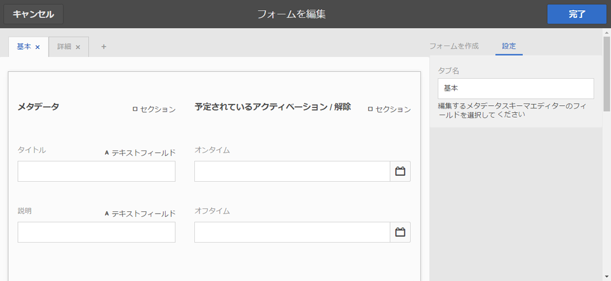
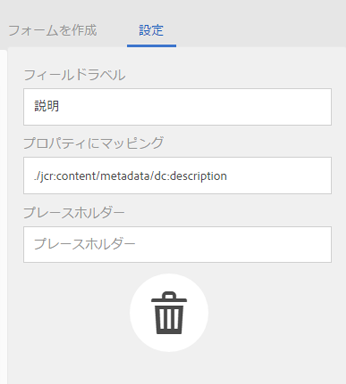
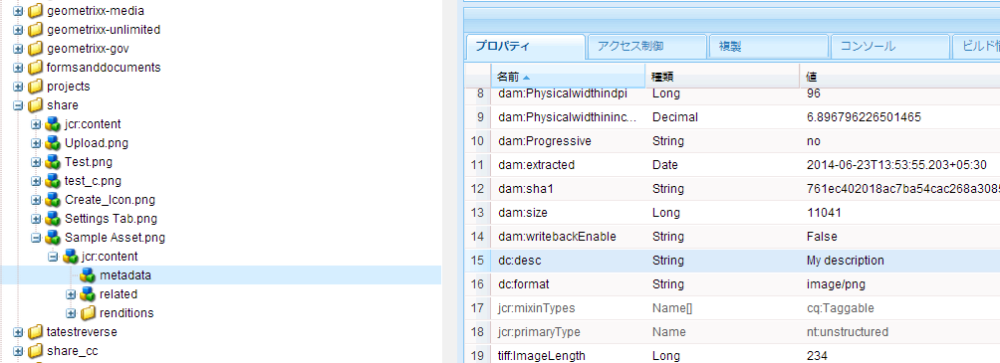
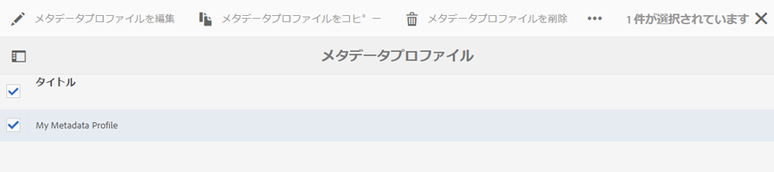
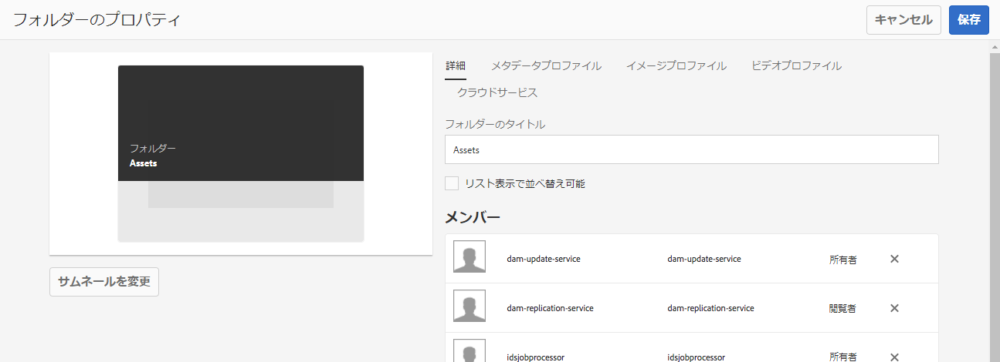

# [!DNL Assets] {#config-metadata}のメタデータ機能の設定と管理

<!-- Scope of metadata articles:
* metadata.md: The scope of this article is basic metadata updates, changes, etc. operations that end-users can do.
* metadata-concepts.md: All conceptual information. Minor instructions are OK but it is an FYI article about support and standards.
* metadata-config.md: New article. Contains all configuration and administration how-to info related to metadata of assets.
-->

[!DNL Adobe Experience Manager Assets] では、あらゆるアセットのメタデータを保持します。したがって、アセットの分類と編成が容易にでき、特定のアセットを検索しやすくなります。アセットの任意のメタデータを保持して管理する機能によって、メタデータに基づいてアセットを自動的に編成および処理できます。[!DNL Adobe Experience Manager Assets] 管理者は、メタデータ機能を設定およびカスタマイズして、デフォルトのAdobe機能を変更できます。

## メタデータスキーマの編集{#metadata-schema}

詳しくは、[メタデータスキーマフォームの編集](metadata-schemas.md#edit-metadata-schema-forms)を参照してください。

## [!DNL Experience Manager] {#registering-a-custom-namespace-within-aem}内にカスタム名前空間を登録

[!DNL Experience Manager]内に独自の名前空間を追加できます。 `cq`、`jcr`、`sling`などの定義済みの名前空間があるのと同様に、リポジトリのメタデータとXML処理に関する名前空間を設定できます。

1. ノードタイプ管理ページ`https://[aem_server]:[port]/crx/explorer/nodetypes/index.jsp`にアクセスします。
1. 名前空間管理ページにアクセスするには、ページ上部の「**[!UICONTROL 名前空間]**」をクリックします。
1. 名前空間を追加するには、ページの下部にある「**[!UICONTROL 新規]**」をクリックします。
1. XML名前空間の規則でカスタム名前空間を指定します。URIの形式でIDを指定し、IDに関連付けられたプレフィックスを指定します。 「**[!UICONTROL 保存]**」をクリックします。

## バルクメタデータの更新に関する制限の設定{#bulk-metadata-update-limit}

サービス拒否(DOS)のような状況を防ぐため、[!DNL Enterprise Manager]はSling要求でサポートされるパラメーターの数を制限します。 一度に多くのアセットのメタデータを更新すると、上限に到達する可能性があり、それ以上のアセットでメタデータが更新されなくなります。次の警告がログに生成されます。

`org.apache.sling.engine.impl.parameters.Util Too many name/value pairs, stopped processing after 10000 entries`

この制限を変更するには、**[!UICONTROL ツール]**/**[!UICONTROL 操作]**/**[!UICONTROL ウェブコンソール]**&#x200B;にアクセスし、**[!UICONTROL Apache Sling Request Parameter Handling]** OSGi設定の&#x200B;**[!UICONTROL 最大POSTパラメータ]**&#x200B;の値を変更します。

## メタデータプロファイル {#metadata-profiles}

メタデータプロファイルを使用すると、フォルダー内のアセットに初期設定のメタデータを適用できます。メタデータプロファイルを作成し、フォルダに適用します。その後フォルダーにアップロードするアセットは、メタデータプロファイルで設定した初期設定のメタデータを継承します。

### メタデータプロファイルの追加 {#adding-a-metadata-profile}

1. **[!UICONTROL ツール]**/**[!UICONTROL アセット]**/**[!UICONTROL メタデータプロファイル]**&#x200B;に移動し、**[!UICONTROL 作成]**&#x200B;をクリックします。
1. プロファイルのタイトル（例：`Sample Metadata`）を入力し、「**[!UICONTROL 作成]**」をクリックします。 メタデータプロファイルの[!UICONTROL Edit Form]が表示されます。

   

1. コンポーネントをクリックし、「**[!UICONTROL 設定]**」タブでプロパティを設定します。例えば、**[!UICONTROL 説明]**&#x200B;コンポーネントをクリックして、そのプロパティを編集します。

   

   **[!UICONTROL 説明]**&#x200B;コンポーネントについて、次のプロパティを編集します。

   * **[!UICONTROL フィールドラベル]**:メタデータプロパティの表示名です。ユーザーの参照用のみで使用します。

   * **[!UICONTROL プロパティにマップ]**:このプロパティの値は、リポジトリに保存されるアセットノードの相対パスまたは名前を提供します。この値は必ず`./`と開始する必要があります。これは、パスがアセットのノードの下にあることを示しているからです。

   

   「**[!UICONTROL プロパティにマッピング]**」に指定した値は、アセットの metadata ノードの下のプロパティとして保存されます。例えば、`./jcr:content/metadata/dc:desc`を&#x200B;**[!UICONTROL プロパティ]**&#x200B;にマップを指定した場合、[!DNL Assets]はアセットのメタデータノードに値`dc:desc`を保存します。

   * **[!UICONTROL デフォルト値]**：メタデータコンポーネントのデフォルト値を追加するには、このプロパティを使用します。例えば、「My description」と指定すると、この値がアセットのメタデータノードの `dc:desc` プロパティに割り当てられます。

   

   >[!NOTE]
   >
   >（`/jcr:content/metadata` ノードにまだ存在していない）新しいメタデータプロパティにデフォルト値を追加しても、そのプロパティとプロパティ値はアセットのプロパティページにデフォルトでは表示されません。アセットの[!UICONTROL プロパティ]ページに新しいプロパティを表示するには、対応するスキーマフォームを変更します。

1. （オプション）「**[!UICONTROL フォームを作成]**」タブから、「フォームを編集」にコンポーネントを追加し、「**[!UICONTROL 設定]**」タブでプロパティを設定します。次のプロパティが「**[!UICONTROL フォームを作成]**」タブで使用できます。

| コンポーネント | プロパティ |
| ----------------------------- | ----------------------------------------------------------------------- |
| [!UICONTROL セクションヘッダー] | フィールドラベル、 説明 |
| [!UICONTROL 1 行のテキスト] | フィールドラベル，  プロパティにマップ，  デフォルト値 |
| [!UICONTROL 複数値テキスト] | フィールドラベル，  プロパティにマップ，  デフォルト値 |
| [!UICONTROL 番号] | フィールドラベル，  プロパティにマップ，  デフォルト値 |
| [!UICONTROL 日付] | フィールドラベル，  プロパティにマップ，  デフォルト値 |
| [!UICONTROL 標準タグ] | フィールドラベル，  プロパティにマップ，  既定値，  説明 |

1. 「**[!UICONTROL 完了]**」をクリックします。メタデータプロファイルが、**[!UICONTROL メタデータプロファイル]**&#x200B;ページのプロファイルのリストに追加されます。 

   

### メタデータプロファイルのコピー {#copying-a-metadata-profile}

1. **[!UICONTROL メタデータプロファイル]**&#x200B;ページから、メタデータプロファイルを選択してコピーします。

   

1. ツールバーの&#x200B;**[!UICONTROL コピー]**&#x200B;をクリックします。
1. **[!UICONTROL メタデータプロファイルをコピー]**&#x200B;ダイアログで、メタデータプロファイルの新しいコピーのタイトルを入力します。
1. 「**[!UICONTROL コピー]**」をクリックします。メタデータプロファイルのコピーが、**[!UICONTROL メタデータプロファイル]**&#x200B;ページのプロファイルのリストに表示されます。

   

### メタデータプロファイルの削除 {#deleting-a-metadata-profile}

1. **[!UICONTROL メタデータプロファイル]**&#x200B;ページで、削除するプロファイルを選択します。

1. ツールバーの&#x200B;**[!UICONTROL メタデータプロファイル]**&#x200B;を削除をクリックします。
1. ダイアログで、「**[!UICONTROL 削除]**」をクリックして、削除操作を確定します。メタデータプロファイルがリストから削除されます。

<!-- TBD: Revisit to find out the correct config. and update these steps. When fixed, also o
These steps have been carried forward from old AEM versions. See https://helpx.adobe.com/experience-manager/6-2/assets/using/metadata-profiles.html#ApplyingaMetadataProfiletoFolders

### Configuration to apply a metadata profile globally {#apply-a-metadata-profile-globally}

In addition to applying a profile to a folder, you can also apply one globally so that any content uploaded into [!DNL Experience Manager] assets in any folder has the selected profile applied.

You can reprocess assets in a folder that already has an existing metadata profile that you later changed. See [Reprocessing assets in a folder after you have edited its processing profile](processing-profiles.md#reprocessing-assets).

To apply a metadata profile globally, follow these steps:

* Navigate to `https://[aem_server]:[port]/mnt/overlay/dam/gui/content/assets/foldersharewizard.html/content/dam` and apply the appropriate profile and click **[!UICONTROL Save]**.

  

* In CRXDE Lite, navigate to the following node: `/content/dam/jcr:content`. Add the property `metadataProfile:/etc/dam/metadata/dynamicmedia/<name of metadata profile>` and click **[!UICONTROL Save All]**.

  
-->

## フォルダー{#folder-metadata-schema}のメタデータスキーマ

[!DNL Adobe Experience Manager Assets] では、フォルダープロパティページに表示されるレイアウトおよびメタデータを定義する、アセットフォルダーのメタデータスキーマを作成できます。

### フォルダーメタデータスキーマフォームの追加 {#add-a-folder-metadata-schema-form}

フォルダーメタデータスキーマフォームエディターを使用して、フォルダーのメタデータスキーマを作成および編集します。

1. [!DNL Experience Manager]インターフェイスで、**[!UICONTROL ツール]**/**[!UICONTROL アセット]**/**[!UICONTROL フォルダーメタデータスキーマ]**&#x200B;に移動します。
1. [!UICONTROL フォルダーメタデータスキーマーForms]ページで、**[!UICONTROL 作成]**&#x200B;をクリックします。
1. フォームの名前を指定し、「**[!UICONTROL 作成]**」をクリックします。 新しいスキーマフォームは、[!UICONTROL スキーマForms]ページに一覧表示されます。

### フォルダーメタデータスキーマフォームの編集 {#edit-folder-metadata-schema-forms}

以下を含む、新しく追加された、または既存のメタデータスキーマフォームを編集できます。

* タブ
* タブ内のフォーム項目

これらのフォーム項目を CRX リポジトリのメタデータノード内のフィールドにマップしたり、フォーム項目を設定したりできます。新しいタブまたはフォーム項目をメタデータスキーマフォームに追加できます。

1. スキーマFormsページで、作成したフォームを選択し、ツールバーから「**[!UICONTROL 編集]**」オプションを選択します。
1. フォルダーメタデータスキーマエディターページで、`+`をクリックしてフォームにタブを追加します。 タブの名前を変更するには、デフォルト名をクリックし、「**[!UICONTROL 設定]**」で新しい名前を指定します。

   

   タブを追加するには、`+`をクリックします。 タブの`X`をクリックして削除します。

1. アクティブになっているタブで、「**[!UICONTROL フォームを作成]**」タブから 1 つ以上のコンポーネントを追加します。

   

   複数のタブを作成する場合は、特定のタブをクリックしてコンポーネントを追加します。

1. コンポーネントを設定するには、コンポーネントを選択して、「**[!UICONTROL 設定]**」タブでそのプロパティを変更します。

   必要に応じて、「**[!UICONTROL 設定]**」タブからコンポーネントを削除します。

   

1. ツールバーの「**[!UICONTROL 保存]**」をクリックして、変更を保存します。

#### フォームを作成するコンポーネント {#components-to-build-forms}

「**[!UICONTROL フォームを作成]**」タブには、フォルダーメタデータスキーマフォーム内で使用するフォーム項目が一覧表示されます。「**[!UICONTROL 設定]**」タブには、「**[!UICONTROL フォームを作成]**」タブで選択した各項目の属性が表示されます。以下は、「**[!UICONTROL フォームを作成]**」タブで使用可能なフォーム項目のリストです。

| コンポーネント名 | 説明 |
|---|---|
| [!UICONTROL セクションヘッダー] | 共通コンポーネントのリストに対してセクションヘッダーを追加します。 |
| [!UICONTROL 1 行のテキスト] | 1 行のテキストのプロパティを追加します。これは文字列として保存されます。 |
| [!UICONTROL 複数値テキスト] | 複数値テキストプロパティを追加します。これは文字列の配列として保存されます。 |
| [!UICONTROL 番号] | 数値コンポーネントを追加します。 |
| [!UICONTROL 日付] | 日付コンポーネントを追加します。 |
| [!UICONTROL ドロップダウン] | ドロップダウンリストを追加します。 |
| [!UICONTROL 標準タグ] | タグを追加します。 |
| [!UICONTROL 非表示のフィールド] | 非表示のフィールドを追加します。このフィールドは、アセットの保存時に POST パラメーターとして送信されます。 |

#### フォーム項目の編集 {#editing-form-items}

フォーム項目のプロパティを編集するには、コンポーネントをクリックし、「**[!UICONTROL 設定]**」タブで次のプロパティのすべてまたはサブセットを編集します。

**[!UICONTROL フィールドラベル]**：フォルダーのプロパティページに表示されるメタデータプロパティの名前。

**[!UICONTROL プロパティにマッピング]**：このプロパティは、フォルダーノードが保存されている CRX リポジトリ内でのフォルダーノードの相対パスを指定します。この値は、パスがフォルダーのノードの下にあることを示す「**./**」で始まります。

このプロパティの有効な値は次のとおりです。

* `./jcr:content/metadata/dc:title`：フォルダーのメタデータノードにある値を、プロパティ `dc:title` として格納します。

* `./jcr:created`：フォルダーのノードにある JCR プロパティを表示します。これらのプロパティを CRXDE で設定する場合、これらのプロパティは保護されているので、「編集を無効にする」としてマークすることをお勧めします。そうしない場合は、アセットのプロパティを保存するときに、「`Asset(s) failed to modify`」というエラーが発生します。

プロパティパスにスペースを含めないでください。コンポーネントがメタデータスキーマフォームに適切に表示されなくなります。

**[!UICONTROL JSON パス]**：オプションのキーと値のペアを指定する JSON ファイルのパスを指定します。

**[!UICONTROL プレースホルダー]**：このプロパティを使用して、メタデータプロパティに関連するプレースホルダーテキストを指定します。

**[!UICONTROL 選択肢]**：リストの選択肢を指定するには、このプロパティを使用します。

**[!UICONTROL 説明]**：メタデータコンポーネントの短い説明を追加するには、このプロパティを使用します。

**[!UICONTROL クラス]**：プロパティに関連付けられているオブジェクトクラス。

### フォルダーメタデータスキーマフォームの削除  {#delete-folder-metadata-schema-forms}

フォルダーメタデータスキーマフォームページから、フォルダーメタデータスキーマフォームを削除できます。フォームを削除するには、フォームを選択し、ツールバーの削除オプションをクリックします。

### フォルダーメタデータスキーマの割り当て {#assign-a-folder-metadata-schema}

フォルダーメタデータスキーマフォームページから、またはフォルダーの作成時に、フォルダーにフォルダーメタデータスキーマを割り当てることができます。

フォルダーのメタデータスキーマを設定した場合、スキーマフォームへのパスは、`./jcr:content`の下のフォルダーノードの`folderMetadataSchema`プロパティに保存されます。

#### フォルダーメタデータスキーマページからのスキーマへの割り当て {#assign-to-a-schema-from-the-folder-metadata-schema-page}

1. [!DNL Experience Manager]インターフェイスで、**[!UICONTROL ツール]**/**[!UICONTROL アセット]**/**[!UICONTROL フォルダーメタデータスキーマ]**&#x200B;に移動します。
1. フォルダーメタデータスキーマフォームページから、フォルダーに適用するスキーマフォームを選択します。
1. ツールバーで、**[!UICONTROL Apply to Folder(s)]**&#x200B;をクリックします。

1. スキーマを適用するフォルダーを選択し、「**[!UICONTROL 適用]**」をクリックします。 既にフォルダーにメタデータスキーマが適用されている場合は、既存のメタデータスキーマを上書きするかどうかを確認する警告メッセージが表示されます。「**[!UICONTROL 上書き]**」をクリックします。
1. メタデータスキーマを適用したフォルダーのメタデータプロパティを開きます。

   

   フォルダーのメタデータフィールドを表示するには、「**[!UICONTROL フォルダーのメタデータ]**」タブをクリックします。

   

#### フォルダー作成時のスキーマの割り当て {#assign-a-schema-when-creating-a-folder}

フォルダーを作成するときに、フォルダーメタデータスキーマを割り当てることができます。システムに 1 つ以上のフォルダーメタデータスキーマが存在する場合は、**[!UICONTROL フォルダーを作成]**&#x200B;ダイアログに追加リストが表示されます。希望のスキーマを選択できます。デフォルトではスキーマは選択されていません。

1. [!DNL Experience Manager Assets]ユーザーインターフェイスで、ツールバーの&#x200B;**[!UICONTROL 「作成]**」をクリックします。
1. フォルダーのタイトルと名前を指定します。
1. フォルダーメタデータスキーマリストから希望のスキーマを選択します。次に、「**[!UICONTROL 作成]**」をクリックします。

   

1. メタデータスキーマを適用したフォルダーのメタデータプロパティを開きます。
1. フォルダーのメタデータフィールドを表示するには、「**[!UICONTROL フォルダーのメタデータ]**」タブをクリックします。

### フォルダーメタデータスキーマの使用 {#use-the-folder-metadata-schema}

フォルダーメタデータスキーマが設定されたフォルダーのプロパティを開きます。フォルダー[!UICONTROL プロパティ]ページに「**[!UICONTROL フォルダーメタデータ]**」タブが表示されます。 フォルダーメタデータスキーマフォームを表示するには、このタブを選択します。

様々なフィールドにメタデータ値を入力し、「**[!UICONTROL 保存]**」をクリックして値を保存します。 指定した値は、CRX リポジトリ内のフォルダーノードに保存されます。

## ヒントと制限事項 {#best-practices-limitations}

* カスタム名前空間にメタデータを読み込むには、まず、その名前空間を登録します。
* プロパティピッカーは、スキーマエディターおよび検索フォームで使用されるプロパティを表示します。 プロパティ選択では、アセットからメタデータプロパティは選択されません。
* [!DNL Experience Manager] 6.5にアップグレードする前から、既に存在するメタデータプロファイルが存在する可能性があります。アップグレード後、[!UICONTROL 「メタデータプロファイル]」タブの[!UICONTROL Properties]にこのプロファイルを適用すると、メタデータフォームフィールドは表示されません。 ただし、新しく作成したメタデータプロファイルを適用すると、フォームフィールドは表示されますが、期待どおりに使用できなくなります。 機能は失われませんが、（使用できない）フォームフィールドを表示したい場合は、既存のメタデータプロファイルを編集して保存します。

>[!MORELIKETHIS]
>
>* [メタデータの概念と理解](metadata-concepts.md)。
>* [複数コレクションのメタデータプロパティの編集](manage-collections.md#editing-collection-metadata-in-bulk).
>* [Experience Managerアセットでのメタデータの読み込みと書き出し](https://experienceleague.adobe.com/docs/experience-manager-learn/assets/metadata/metadata-import-feature-video-use.html)。
>* [メタデータ、画像およびビデオを処理するプロファイル](processing-profiles.md)。
>* [処理プロファイルを使用するようにデジタルアセットを整理するためのベストプラクティス](/help/assets/organize-assets.md)。
>* [XMP の書き戻し](/help/assets/xmp-writeback.md).

