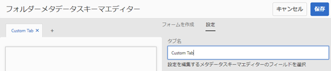
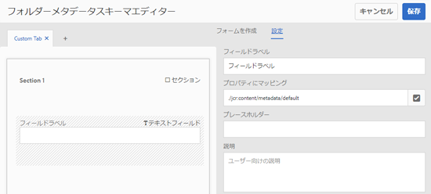
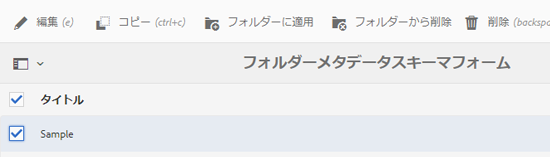

# でのメタデータ機能の設定と管理 [!DNL Assets] {#config-metadata}

<!-- Scope of metadata articles:
* metadata.md: The scope of this article is basic metadata updates, changes, etc. operations that end-users can do.
* metadata-concepts.md: All conceptual information. Minor instructions are OK but it is an FYI article about support and standards.
* metadata-config.md: New article. Contains all configuration and administration how-to info related to metadata of assets.
-->

[!DNL Adobe Experience Manager Assets] では、あらゆるアセットのメタデータを保持します。したがって、アセットの分類と編成が容易にでき、特定のアセットを検索しやすくなります。アセットの任意のメタデータを保持して管理する機能によって、メタデータに基づいてアセットを自動的に編成および処理できます。[!DNL Adobe Experience Manager Assets] 管理者は、メタデータ機能を設定およびカスタマイズして、デフォルトのAdobe機能を変更できます。

## メタデータスキーマを編集 {#metadata-schema}

詳しくは、 [メタデータスキーマフォームの編集](metadata-schemas.md#edit-metadata-schema-forms).

## 内でのカスタム名前空間の登録 [!DNL Experience Manager] {#registering-a-custom-namespace-within-aem}

内に独自の名前空間を追加できます [!DNL Experience Manager]. 次のような事前定義済みの名前空間があるのと同様に、 `cq`, `jcr`、および `sling`を使用すると、リポジトリのメタデータと XML 処理用の名前空間を設定できます。

1. ノードタイプ管理ページへのアクセス `https://[aem_server]:[port]/crx/explorer/nodetypes/index.jsp`.
1. 名前空間管理ページにアクセスするには、 **[!UICONTROL 名前空間]** をクリックします。
1. 名前空間を追加するには、 **[!UICONTROL 新規]** をクリックします。
1. XML 名前空間規則でカスタム名前空間を指定します。URI 形式の ID と、その ID に関連付けられているプレフィックスを指定します。 「**[!UICONTROL 保存]**」をクリックします。

## 一括メタデータ更新の制限を設定する {#bulk-metadata-update-limit}

サービス拒否 (DOS) を防ぐには、 [!DNL Enterprise Manager] は、Sling 要求でサポートされるパラメーターの数を制限します。 一度に多くのアセットのメタデータを更新すると、上限に到達する可能性があり、それ以上のアセットでメタデータが更新されなくなります。Enterprise Manager では、ログに次の警告が生成されます。

`org.apache.sling.engine.impl.parameters.Util Too many name/value pairs, stopped processing after 10000 entries`

制限を変更するには、 **[!UICONTROL ツール]** > **[!UICONTROL 運用]** > **[!UICONTROL Web コンソール]** をクリックし、 **[!UICONTROL 最大POSTパラメータ]** in **[!UICONTROL Apache Sling 要求パラメーターの処理]** OSGi 設定。

## メタデータプロファイル {#metadata-profiles}

メタデータプロファイルを使用すると、フォルダー内のアセットにデフォルトのメタデータを適用できます。メタデータプロファイルを作成し、フォルダーに適用します。 後でフォルダーにアップロードするアセットは、メタデータプロファイルで設定したデフォルトのメタデータを継承します。

### メタデータプロファイルの追加 {#adding-a-metadata-profile}

1. に移動します。 **[!UICONTROL ツール]** > **[!UICONTROL Assets]** > **[!UICONTROL メタデータプロファイル]** をクリックし、 **[!UICONTROL 作成]**.
1. プロファイルのタイトルを入力します（例： ）。 `Sample Metadata`をクリックし、 **[!UICONTROL 作成]**. この [!UICONTROL フォームを編集] メタデータプロファイルのが表示されます。

   

1. コンポーネントをクリックし、「**[!UICONTROL 設定]**」タブでプロパティを設定します。例えば、**[!UICONTROL 説明]**&#x200B;コンポーネントをクリックして、そのプロパティを編集します。

   

   **[!UICONTROL 説明]**&#x200B;コンポーネントについて、次のプロパティを編集します。

   * **[!UICONTROL フィールドラベル]**:メタデータプロパティの表示名。 ユーザーの参照用のみで使用します。

   * **[!UICONTROL プロパティにマッピング]**:このプロパティの値は、リポジトリー内の保存先のアセットノードへの相対パスまたは名前を提供します。 値は常に次の値で始まる必要があります： `./` これは、パスがアセットノードの下にあることを示しているからです。

   

   「**[!UICONTROL プロパティにマッピング]**」に指定した値は、アセットの metadata ノードの下のプロパティとして保存されます。例えば、 `./jcr:content/metadata/dc:desc` 名前として **[!UICONTROL プロパティにマッピング]**, [!DNL Assets] 値を保存 `dc:desc` アセットのメタデータノードに配置します。 Adobeでは、1 つのフィールドのみをメタデータスキーマの特定のプロパティにマッピングすることをお勧めします。 それ以外の場合は、プロパティにマッピングされた最新の追加フィールドがシステムによって選択されます。

   * **[!UICONTROL デフォルト値]**：メタデータコンポーネントのデフォルト値を追加するには、このプロパティを使用します。例えば、「My description」と指定すると、この値がアセットのメタデータノードの `dc:desc` プロパティに割り当てられます。

   

   >[!NOTE]
   >
   >（次の場所に存在しない）新しいメタデータプロパティにデフォルト値を追加する `/jcr:content/metadata` ノード ) は、アセットの [!UICONTROL プロパティ] デフォルトでは、ページに配置されます。 アセットの新しいプロパティを表示するには [!UICONTROL プロパティ] ページで、対応するスキーマフォームを変更します。

1. （オプション） **[!UICONTROL フォームを作成]** タブ、その他のコンポーネントの追加先 [!UICONTROL フォームを編集]を設定し、 **[!UICONTROL 設定]** タブをクリックします。 以下のプロパティが **[!UICONTROL フォームを作成]** タブ：

| コンポーネント | プロパティ |
| ----------------------------- | ----------------------------------------------------------------------- |
| [!UICONTROL セクションヘッダー] | フィールドラベル   説明 |
| [!UICONTROL 1 行のテキスト] | フィールドラベル   プロパティにマッピング   デフォルト値 |
| [!UICONTROL 複数値テキスト] | フィールドラベル   プロパティにマッピング   デフォルト値 |
| [!UICONTROL 数値] | フィールドラベル   プロパティにマッピング   デフォルト値 |
| [!UICONTROL 日付] | フィールドラベル   プロパティにマッピング   デフォルト値 |
| [!UICONTROL 標準タグ] | フィールドラベル   プロパティにマッピング   デフォルト値   説明 |

1. 「**[!UICONTROL 完了]**」をクリックします。メタデータプロファイルが、**[!UICONTROL メタデータプロファイル]**&#x200B;ページのプロファイルのリストに追加されます。 

   

### メタデータプロファイルのコピー {#copying-a-metadata-profile}

1. 次の **[!UICONTROL メタデータプロファイル]** ページで、コピーを作成するメタデータプロファイルを選択します。

   

1. ツールバーの「**[!UICONTROL コピー]**」をクリックします。
1. **[!UICONTROL メタデータプロファイルをコピー]**&#x200B;ダイアログで、メタデータプロファイルの新しいコピーのタイトルを入力します。
1. 「**[!UICONTROL コピー]**」をクリックします。メタデータプロファイルのコピーが、**[!UICONTROL メタデータプロファイル]**&#x200B;ページのプロファイルのリストに表示されます。

   

### メタデータプロファイルの削除 {#deleting-a-metadata-profile}

1. **[!UICONTROL メタデータプロファイル]**&#x200B;ページで、削除するプロファイルを選択します。

1. ツールバーの「**[!UICONTROL メタデータプロファイルを削除]**」をクリックします。
1. ダイアログで、「**[!UICONTROL 削除]**」をクリックして、削除操作を確定します。メタデータプロファイルがリストから削除されます。

<!-- TBD: Revisit to find out the correct config. and update these steps. When fixed, also o
These steps have been carried forward from old AEM versions. See https://helpx.adobe.com/experience-manager/6-2/assets/using/metadata-profiles.html#ApplyingaMetadataProfiletoFolders

### Configuration to apply a metadata profile globally {#apply-a-metadata-profile-globally}

In addition to applying a profile to a folder, you can also apply one globally so that any content uploaded into [!DNL Experience Manager] assets in any folder has the selected profile applied.

You can reprocess assets in a folder that already has an existing metadata profile that you later changed. See [Reprocessing assets in a folder after you have edited its processing profile](processing-profiles.md#reprocessing-assets).

To apply a metadata profile globally, follow these steps:

* Navigate to `https://[aem_server]:[port]/mnt/overlay/dam/gui/content/assets/foldersharewizard.html/content/dam` and apply the appropriate profile and click **[!UICONTROL Save]**.

  

* In CRXDE Lite, navigate to the following node: `/content/dam/jcr:content`. Add the property `metadataProfile:/etc/dam/metadata/dynamicmedia/<name of metadata profile>` and click **[!UICONTROL Save All]**.

  
-->

## フォルダーのメタデータスキーマ {#folder-metadata-schema}

[!DNL Adobe Experience Manager Assets] では、フォルダープロパティページに表示されるレイアウトおよびメタデータを定義する、アセットフォルダーのメタデータスキーマを作成できます。

### フォルダーメタデータスキーマフォームの追加 {#add-a-folder-metadata-schema-form}

フォルダーメタデータスキーマフォームエディターを使用して、フォルダーのメタデータスキーマを作成および編集します。

1. In [!DNL Experience Manager] インターフェイス、に移動します。 **[!UICONTROL ツール]** > **[!UICONTROL Assets]** > **[!UICONTROL フォルダーメタデータスキーマ]**.
1. の [!UICONTROL フォルダーメタデータスキーマForms] ページ、クリック **[!UICONTROL 作成]**.
1. フォームの名前を指定し、 **[!UICONTROL 作成]**. 新しいスキーマフォームは、 [!UICONTROL スキーマForms] ページ。

### フォルダーメタデータスキーマフォームの編集 {#edit-folder-metadata-schema-forms}

以下を含む、新しく追加された、または既存のメタデータスキーマフォームを編集できます。

* タブ
* タブ内のフォーム項目

これらのフォーム項目を CRX リポジトリーのメタデータノード内のフィールドにマップしたり、フォーム項目を設定したりできます。新しいタブまたはフォーム項目をメタデータスキーマフォームに追加できます。

1. スキーマFormsページで、作成したフォームを選択し、 **[!UICONTROL 編集]** 」オプションを使用します。
1. フォルダーメタデータスキーマエディターページで、 `+` をクリックして、フォームにタブを追加します。 タブの名前を変更するには、デフォルト名をクリックし、以下に新しい名前を指定します。 **[!UICONTROL 設定]**.

   

   タブを追加するには、 `+`. 削除するには、 `X` 」をクリックします。

1. アクティブになっているタブで、「**[!UICONTROL フォームを作成]**」タブから 1 つ以上のコンポーネントを追加します。

   

   複数のタブを作成する場合は、特定のタブをクリックしてコンポーネントを追加します。

1. コンポーネントを設定するには、コンポーネントを選択して、「**[!UICONTROL 設定]**」タブでそのプロパティを変更します。

   必要に応じて、 **[!UICONTROL 設定]** タブをクリックします。

   

1. 変更を保存するには、 **[!UICONTROL 保存]** をクリックします。

#### フォームを作成するコンポーネント {#components-to-build-forms}

「**[!UICONTROL フォームを作成]**」タブには、フォルダーメタデータスキーマフォーム内で使用するフォーム項目が一覧表示されます。「**[!UICONTROL 設定]**」タブには、「**[!UICONTROL フォームを作成]**」タブで選択した各項目の属性が表示されます。以下は、「**[!UICONTROL フォームを作成]**」タブで使用可能なフォーム項目のリストです。

| コンポーネント名 | 説明 |
|---|---|
| [!UICONTROL セクションヘッダー] | 共通コンポーネントのリストに対してセクションヘッダーを追加します。 |
| [!UICONTROL 1 行のテキスト] | 1 行のテキストのプロパティを追加します。これは文字列として保存されます。 |
| [!UICONTROL 複数値テキスト] | 複数値テキストプロパティを追加します。これは文字列の配列として保存されます。 |
| [!UICONTROL 数値] | 数値コンポーネントを追加します。 |
| [!UICONTROL 日付] | 日付コンポーネントを追加します。 |
| [!UICONTROL ドロップダウン] | ドロップダウンリストを追加します。 |
| [!UICONTROL 標準タグ] | タグを追加します。 |
| [!UICONTROL 非表示のフィールド] | 非表示のフィールドを追加します。このフィールドは、アセットの保存時に POST パラメーターとして送信されます。 |

#### フォーム項目の編集 {#editing-form-items}

フォーム項目のプロパティを編集するには、コンポーネントをクリックし、 **[!UICONTROL 設定]** タブをクリックします。

**[!UICONTROL フィールドラベル]**：フォルダーのプロパティページに表示されるメタデータプロパティの名前。

**[!UICONTROL プロパティにマッピング]**：このプロパティは、フォルダーノードが保存されている CRX リポジトリ内でのフォルダーノードの相対パスを指定します。この値は、パスがフォルダーのノードの下にあることを示す「**./**」で始まります。

このプロパティの有効な値は次のとおりです。

* `./jcr:content/metadata/dc:title`：フォルダーのメタデータノードにある値を、プロパティ `dc:title` として格納します。

* `./jcr:created`：フォルダーのノードにある JCR プロパティを表示します。これらのプロパティを CRXDE で設定する場合、これらのプロパティは保護されているので、「編集を無効にする」としてマークすることをお勧めします。そうしない場合は、アセットのプロパティを保存するときに、「`Asset(s) failed to modify`」というエラーが発生します。

プロパティパスにスペースを含めないでください。コンポーネントがメタデータスキーマフォームに適切に表示されなくなります。

**[!UICONTROL JSON パス]**：オプションのキーと値のペアを指定する JSON ファイルのパスを指定します。

**[!UICONTROL プレースホルダー]**：このプロパティを使用して、メタデータプロパティに関連するプレースホルダーテキストを指定します。

**[!UICONTROL 選択肢]**：リストの選択肢を指定するには、このプロパティを使用します。

**[!UICONTROL 説明]**：メタデータコンポーネントの短い説明を追加するには、このプロパティを使用します。

**[!UICONTROL クラス]**：プロパティに関連付けられているオブジェクトクラス。

### フォルダーメタデータスキーマフォームの削除 {#delete-folder-metadata-schema-forms}

フォルダーメタデータスキーマフォームページから、フォルダーメタデータスキーマフォームを削除できます。フォームを削除するには、フォームを選択し、ツールバーの「削除」オプションをクリックします。

### フォルダーメタデータスキーマの割り当て {#assign-a-folder-metadata-schema}

フォルダーメタデータスキーマフォームページから、またはフォルダーの作成時に、フォルダーにフォルダーメタデータスキーマを割り当てることができます。

フォルダーのメタデータスキーマを設定すると、スキーマフォームのパスは `folderMetadataSchema` の下のフォルダーノードのプロパティ `./jcr:content`.

#### フォルダーメタデータスキーマページからのスキーマへの割り当て {#assign-to-a-schema-from-the-folder-metadata-schema-page}

1. In [!DNL Experience Manager] インターフェイス、に移動します。 **[!UICONTROL ツール]** > **[!UICONTROL Assets]** > **[!UICONTROL フォルダーメタデータスキーマ]**.
1. フォルダーメタデータスキーマフォームページから、フォルダーに適用するスキーマフォームを選択します。
1. ツールバーで、 **[!UICONTROL フォルダーに適用]**.

1. スキーマを適用するフォルダーを選択し、「 **[!UICONTROL 適用]**. 既にフォルダーにメタデータスキーマが適用されている場合は、既存のメタデータスキーマを上書きするかどうかを確認する警告メッセージが表示されます。「**[!UICONTROL 上書き]**」をクリックします。
1. メタデータスキーマを適用したフォルダーのメタデータプロパティを開きます。

   

   フォルダーメタデータフィールドを表示するには、 **[!UICONTROL フォルダーメタデータ]** タブをクリックします。

   

#### フォルダー作成時のスキーマの割り当て {#assign-a-schema-when-creating-a-folder}

フォルダーを作成するときに、フォルダーメタデータスキーマを割り当てることができます。システムに 1 つ以上のフォルダーメタデータスキーマが存在する場合は、**[!UICONTROL フォルダーを作成]**&#x200B;ダイアログに追加リストが表示されます。希望のスキーマを選択できます。デフォルトではスキーマは選択されていません。

1. 次の [!DNL Experience Manager Assets] ユーザインタフェース： **[!UICONTROL 作成]** をクリックします。
1. フォルダーのタイトルと名前を指定します。
1. フォルダーメタデータスキーマリストから希望のスキーマを選択します。次に、「 **[!UICONTROL 作成]**.

   

1. メタデータスキーマを適用したフォルダーのメタデータプロパティを開きます。
1. フォルダーメタデータフィールドを表示するには、 **[!UICONTROL フォルダーメタデータ]** タブをクリックします。

### フォルダーメタデータスキーマの使用 {#use-the-folder-metadata-schema}

フォルダーメタデータスキーマが設定されたフォルダーのプロパティを開きます。A **[!UICONTROL フォルダーメタデータ]** 」タブがフォルダーに表示されます。 [!UICONTROL プロパティ] ページ。 フォルダーメタデータスキーマフォームを表示するには、このタブを選択します。

各種フィールドにメタデータ値を入力し、「 **[!UICONTROL 保存]** を使用して値を保存します。 指定した値は、CRX リポジトリ内のフォルダーノードに保存されます。

## ヒントと制限事項 {#best-practices-limitations}

* カスタム名前空間にメタデータを読み込むには、まず、その名前空間を登録します。
* プロパティピッカーは、スキーマエディターおよび検索フォームで使用されるプロパティを表示します。 プロパティピッカーがアセットからメタデータプロパティを選択しない。
* にアップグレードする前に、既存のメタデータプロファイルが存在する場合があります [!DNL Experience Manager] 6.5.アップグレード後に、このようなプロファイルをフォルダーに適用する場合 [!UICONTROL プロパティ] in [!UICONTROL メタデータプロファイル] 」タブに値を入力しない場合、メタデータフォームフィールドは表示されません。 ただし、新しく作成したメタデータプロファイルを適用すると、フォームのフィールドは表示されますが、期待どおりに使用できません。 機能は失われませんが、（使用できない）フォームフィールドを表示したい場合は、既存のメタデータプロファイルを編集して保存します。

>[!MORELIKETHIS]
>
>* [メタデータの概念と理解](metadata-concepts.md).
>* [複数コレクションのメタデータプロパティの編集](manage-collections.md#editing-collection-metadata-in-bulk).
>* [Experience Manager Assetsでのメタデータの読み込みと書き出し](https://experienceleague.adobe.com/docs/experience-manager-learn/assets/metadata/metadata-import-export.html).
>* [メタデータ、画像およびビデオを処理するためのプロファイル](processing-profiles.md).
>* [処理プロファイルを使用するためのデジタルアセットの整理のベストプラクティス](/help/assets/organize-assets.md).
>* [XMP の書き戻し](/help/assets/xmp-writeback.md).

