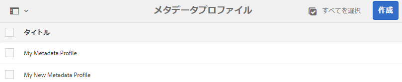

# メタデータプロファイル {#metadata-profiles}

メタデータプロファイルを使用すると、フォルダー内のアセットに初期設定のメタデータを適用できます。 メタデータプロファイルを作成し、フォルダに適用します。 その後フォルダーにアップロードするアセットは、メタデータプロファイルで設定した初期設定のメタデータを継承します。

## メタデータプロファイルの追加 {#adding-a-metadata-profile}

1. **[!UICONTROL ツール/アセット/メタデータプロファイル]** に移動し、「 **[!UICONTROL 作成]**」をクリックします。
1. Enter a title for the Metadata Profile, for example Sample Metadata, and click **[!UICONTROL Create]**. The [!UICONTROL Edit Form] for the metadata profile is displayed.

   

1. コンポーネントをクリックし、「**[!UICONTROL 設定]**」タブでプロパティを設定します。例えば、**[!UICONTROL 説明]**&#x200B;コンポーネントをクリックして、そのプロパティを編集します。

   

   **[!UICONTROL 説明]**&#x200B;コンポーネントについて、次のプロパティを編集します。

   * **[!UICONTROL フィールドラベル]**: メタデータプロパティの表示名です。 ユーザーの参照用のみで使用します。

   * **[!UICONTROL プロパティにマップ]**: このプロパティの値は、リポジトリに保存されるアセットノードの相対パス/名前を提供します。 この値は常にと開始する必要があります。これは、パスがアセットのノード下にあることを示している `./` からです。
   

   「**[!UICONTROL プロパティにマッピング]**」に指定した値は、アセットのメタデータノード下のプロパティとして保存されます。例えば、「**[!UICONTROL プロパティにマッピング]**」の名前として `/jcr:content/metadata/dc:desc` を指定した場合は、アセットのメタデータノードに値 `dc:desc` が保存されます。

   * **[!UICONTROL デフォルト値]**：メタデータコンポーネントのデフォルト値を追加するには、このプロパティを使用します。例えば、「My description」と指定すると、この値がアセットのメタデータノードの `dc:desc` プロパティに割り当てられます。
   

   >[!NOTE]
   >
   >（`/jcr:content/metadata` ノードにまだ存在していない）新しいメタデータプロパティにデフォルト値を追加しても、そのプロパティとプロパティ値はアセットのプロパティページにデフォルトでは表示されません。To view the new property on the assets&#39; [!UICONTROL Properties] page, modify the corresponding schema form.

1. （オプション）「**[!UICONTROL フォームを作成]**」タブから、「フォームを編集」にコンポーネントを追加し、「**[!UICONTROL 設定]**」タブでプロパティを設定します。次のプロパティが「**[!UICONTROL フォームを作成]**」タブで使用できます。

| コンポーネント | プロパティ |
| ----------------------------- | ----------------------------------------------------------------------- |
| [!UICONTROL セクションヘッダー] | Field Label,   Description |
| [!UICONTROL 1 行のテキスト] | Field Label,   Map to property,   Default Value |
| [!UICONTROL 複数値テキスト] | Field Label,   Map to property,   Default Value |
| [!UICONTROL 番号] | Field Label,   Map to property,   Default Value |
| [!UICONTROL 日付] | Field Label,   Map to property,   Default Value |
| [!UICONTROL 標準タグ] | Field Label,   Map to property,   Default Value,   Description |

1. 「**[!UICONTROL 完了]**」をクリックします。メタデータプロファイルが、**[!UICONTROL メタデータプロファイル]**&#x200B;ページのプロファイルのリストに追加されます。 

   

## メタデータプロファイルのコピー {#copying-a-metadata-profile}

1. From the **[!UICONTROL Metadata Profiles]** page, select a metadata profile to make a copy of it.

   

1. Click **[!UICONTROL Copy]** from the toolbar.
1. **[!UICONTROL メタデータプロファイルをコピー]**&#x200B;ダイアログで、メタデータプロファイルの新しいコピーのタイトルを入力します。
1. 「**[!UICONTROL コピー]**」をクリックします。メタデータプロファイルのコピーが、**[!UICONTROL メタデータプロファイル]**&#x200B;ページのプロファイルのリストに表示されます。

   

## メタデータプロファイルの削除 {#deleting-a-metadata-profile}

1. **[!UICONTROL メタデータプロファイル]**&#x200B;ページで、削除するプロファイルを選択します。

   

1. Ta[] **[!UICONTROL Delete Metadata Profiles]** in the toolbar.
1. ダイアログで、「**[!UICONTROL 削除]**」をクリックして、削除操作を確定します。メタデータプロファイルがリストから削除されます。

## フォルダーへのメタデータプロファイルの適用 {#applying-a-metadata-profile-to-folders}

フォルダーにメタデータプロファイルを割り当てると、サブフォルダーは自動的に親フォルダーのプロファイルを継承します。つまり、フォルダーに適用できるのは 1 つのメタデータプロファイルのみとなります。そのため、アセットをアップロード、保存、使用およびアーカイブする場所のフォルダー構造については入念に検討してください。

フォルダーに異なるメタデータプロファイルを割り当てた場合、新しいプロファイルが以前のプロファイルよりも優先されます。以前に存在していたフォルダーのアセットは変更されずに維持されます。新しいプロファイルは、その後にフォルダーに追加されるアセットに対して適用されます。

プロファイルが割り当てられているフォルダーは、ユーザーインターフェイスでカード名にプロファイルの名前が表示されます。

特定のフォルダーまたはすべてのアセットにグローバルにメタデータプロファイルを適用できます。

後で変更した既存のメタデータプロファイルが存在するフォルダー内のアセットを再処理できます。[処理プロファイルを編集した後のフォルダー内のアセットの再処理](processing-profiles.md#reprocessing-assets)を参照してください。

### 特定のフォルダーへのメタデータプロファイルの適用 {#applying-metadata-profiles-to-specific-folders}

**[!UICONTROL ツール]**&#x200B;メニュー内から、またはフォルダー内にいる場合は「**[!UICONTROL プロパティ]**」から、メタデータプロファイルをフォルダーに適用できます。この節では、メタデータプロファイルをフォルダーに適用する両方の方法について説明します。

既にプロファイルが割り当てられているフォルダーには、フォルダー名のすぐ下にプロファイルの名前が表示されます。

後で変更した既存のビデオプロファイルが存在するフォルダー内のアセットを再処理できます。[処理プロファイルを編集した後のフォルダー内のアセットの再処理](processing-profiles.md#reprocessing-assets)を参照してください。

#### プロファイルユーザーインターフェイスからのフォルダーへのメタデータプロファイルの適用 {#applying-metadata-profiles-to-folders-from-profiles-user-interface}

メタデータプロファイルを適用する手順は、次のとおりです。

1. Click the AEM logo and navigate to **[!UICONTROL Tools > Assets > Metadata Profiles]**.
1. 1 つまたは複数のフォルダーに適用するメタデータプロファイルを選択します。

   

1. Click **[!UICONTROL Apply Metadata Profile to Folder(s)]** and select the folder or multiple folders you want use to receive the newly uploaded assets and click **[!UICONTROL Done]**. 既にプロファイルが割り当てられているフォルダーには、フォルダー名のすぐ下にプロファイルの名前が表示されます。

#### 「プロパティ」からのフォルダーへのメタデータプロファイルの適用 {#applying-metadata-profiles-to-folders-from-properties}

1. In the left rail, click **[!UICONTROL Assets]** then navigate to the folder that you want to apply a metadata profile to.
1. On the folder, click the check mark to select it and then click **[!UICONTROL Properties]**.

1. 「**[!UICONTROL メタデータプロファイル]**」タブを選択し、ドロップダウンメニューからプロファイルを選択して、「**[!UICONTROL 保存]**」をクリックします。

   

   既にプロファイルが割り当てられているフォルダーには、フォルダー名のすぐ下にプロファイルの名前が表示されます。

### メタデータプロファイルのグローバルな適用 {#applying-a-metadata-profile-globally}

特定のフォルダーにプロファイルを適用できるだけでなく、グローバルにプロファイルを適用することもできます。これにより、AEM アセットにアップロードされている、すべてのフォルダー内にあるすべてのコンテンツに、選択したプロファイルを適用できます。

後で変更した既存のメタデータプロファイルが存在するフォルダー内のアセットを再処理できます。[処理プロファイルを編集した後のフォルダー内のアセットの再処理](processing-profiles.md#reprocessing-assets)を参照してください。

メタデータプロファイルをグローバルに適用するには、次の手順に従います。

* Navigate to `https://[aem_server]:[port]/mnt/overlay/dam/gui/content/assets/foldersharewizard.html/content/dam` and apply the appropriate profile and click **[!UICONTROL Save]**.

   

* In CRXDE Lite, navigate to the following node: `/content/dam/jcr:content`. Add the property `metadataProfile:/etc/dam/metadata/dynamicmedia/<name of metadata profile>` and click **[!UICONTROL Save All]**.

   

## Remove a metadata profile from folders {#removing-a-metadata-profile-from-folders}

フォルダーからメタデータプロファイルを削除すると、サブフォルダーは自動的に親フォルダーのプロファイルの削除状態を継承します。ただし、フォルダー内で実行されたファイルの処理はそのまま維持されます。

**[!UICONTROL ツール]**&#x200B;メニュー内で、またはフォルダー内にいる場合は「**[!UICONTROL プロパティ]**」で、メタデータプロファイルをフォルダーから削除できます。この節では、メタデータプロファイルをフォルダーから削除する両方の方法について説明します。

### Remove metadata profiles from folders via Profiles user interface {#removing-metadata-profiles-from-folders-via-profiles-user-interface}

1. Click the AEM logo and navigate to **[!UICONTROL Tools > Assets > Metadata Profiles]**.
1. 1 つまたは複数のフォルダーから削除するメタデータプロファイルを選択します。
1. Click **[!UICONTROL Remove Metadata Profile from Folder(s)]** and select the folder or multiple folders you want use to remove a profile from and click **[!UICONTROL Done]**.

   名前がフォルダー名の下に表示されなくなっていることで、メタデータプロファイルがフォルダーに適用されていないことを確認できます。

### Remove metadata profiles from folders via Properties {#removing-metadata-profiles-from-folders-via-properties}

1. Click the AEM logo and navigate **[!UICONTROL Assets]** and then to the folder that you want to remove an metadata profile from.
1. On the folder, click the check mark to select it and then click **[!UICONTROL Properties]**.
1. 「**[!UICONTROL メタデータプロファイル]**」タブを選択し、ドロップダウンメニューから「**[!UICONTROL なし]**」を選択して、「**[!UICONTROL 保存]**」をクリックします。既にプロファイルが割り当てられているフォルダーには、フォルダー名のすぐ下にプロファイルの名前が表示されます。

## 制限事項とベストプラクティス {#limitations-best-practices-tips}

* 6.5へのアップグレード以降、既存のメタデータプロファイルが存在する場合があります。アップグレード後、「メタデータプロファイル [!DNL Experience Manager][!UICONTROL 」タブのフォルダー] プロパティ  にこのプロファイルを適用すると、メタデータフォームフィールドは表示されません。 ただし、新しく作成したメタデータプロファイルを適用すると、フォームフィールドは表示されますが、期待どおりに使用できなくなります。 機能は失われませんが、（使用できない）フォームフィールドを表示したい場合は、既存のメタデータプロファイルを編集して保存します。

>[!MORELIKETHIS]
>
>* [メタデータ、画像およびビデオの処理プロファイル](processing-profiles.md)
>* [処理プロファイルを使用するデジタルアセットを整理するためのベストプラクティス](/help/assets/organize-assets.md)

