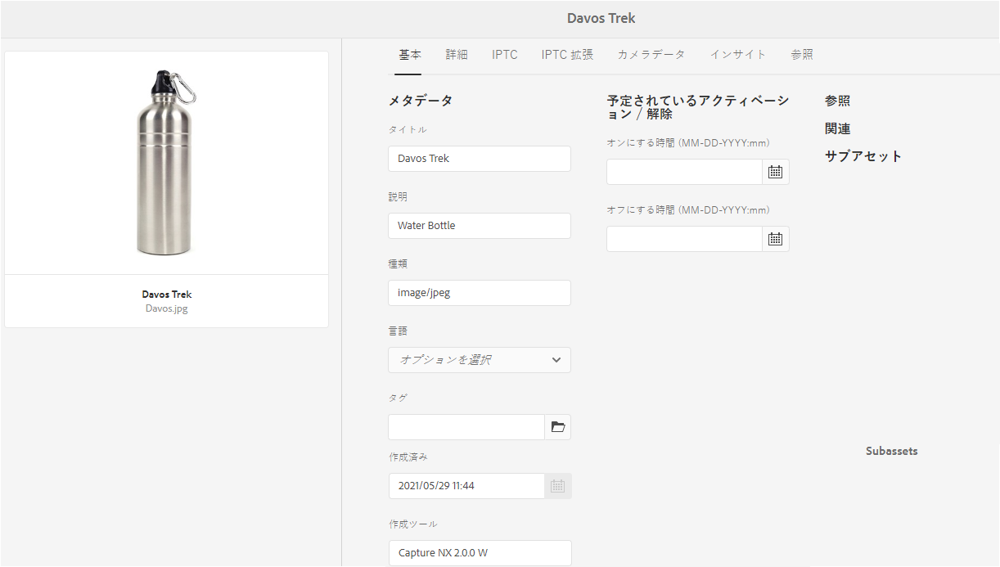
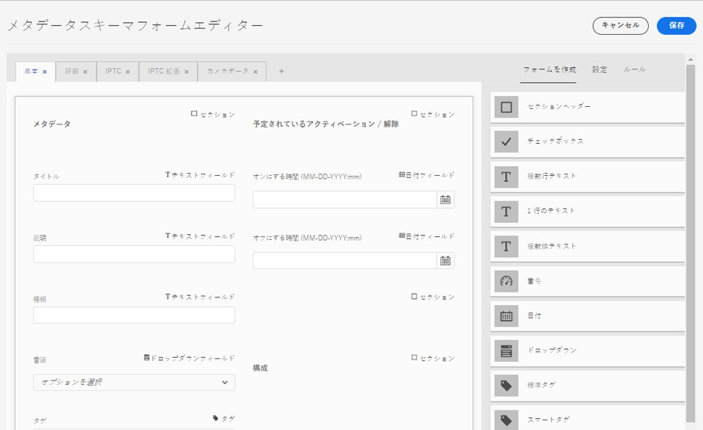
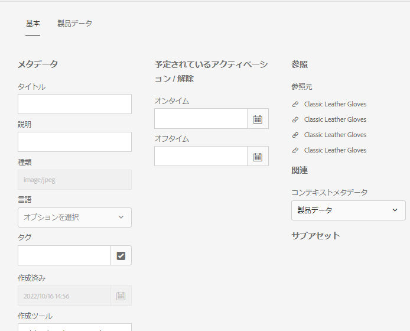
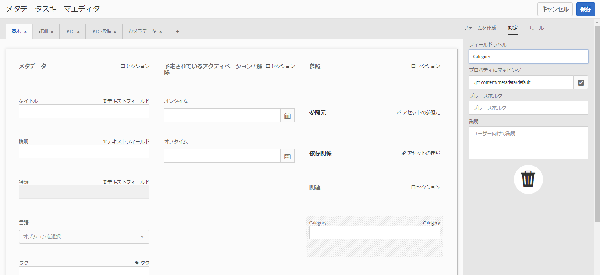
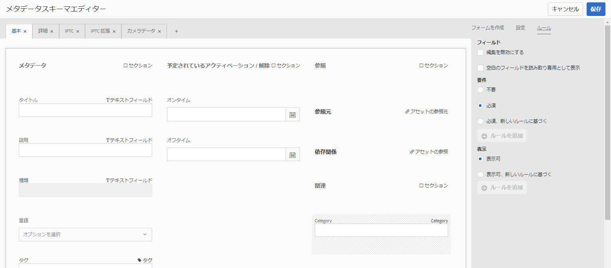
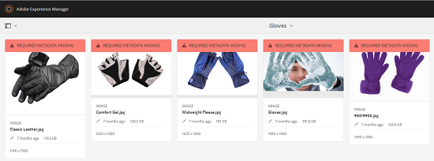

# メタデータスキーマ {#metadata-schemas}

組織は、アセットの検出、使用、相互運用性などを強化するメタデータモデルを考案しています。 正しいメタデータアプリケーションは、メタデータ主導のワークフローとプロセスを維持するために適切です。 組織全体のメタデータの戦略と標準に従うため、DAMユーザーの整列に役立つメタデータスキーマを使用できます。 [!DNL Adobe Experience Manager] メタデータスキーマの作成、管理および適用を、簡単で柔軟な方法で行うことができます。

で [!DNL Adobe Experience Manager Assets]は、スキーマに、入力する特定の情報の特定のフィールドが含まれています。 また、メタデータフィールドをユーザにわかりやすく表示するためのレイアウト情報も含まれます。 メタデータプロパティには、タイトル、説明、MIMEタイプ、タグなどがあります。 You can use the [!UICONTROL Metadata Schema Forms] editor to modify the existing schemas or add custom metadata schemas.

アセットのプロパティページを表示して編集するには、次の手順に従います。

1. カード表示のアセットタイルにあるクイックアクションから、 **[!UICONTROL 表示のプロパティ]** (Asset Properties)オプションをクリックします。

   

   または、アセットを選択し、ツールバーの「 **[!UICONTROL プロパティ]** 」をクリックします。

1. 使用可能なタブで、編集可能な様々なメタデータプロパティを編集できます。 However, you cannot modify the asset [!UICONTROL Type] in the [!UICONTROL Basic] tab of properties page.

   

*図： アセットの[!UICONTROL プロパティの「基本」タブ]。*

アセットの MIME タイプを変更するには、カスタムメタデータスキーマフォームを使用するか、既存のフォームを変更します。See [Edit Metadata Schema Forms](/help/assets/metadata-schemas.md#edit-metadata-schema-forms) for more information. MIMEタイプのメタデータスキーマを変更すると、アセットとすべてのサブタイプのプロパティページレイアウトが変更されます。 例えば、`default/image` 配下の jpeg スキーマを変更すると、MIME タイプが `image/jpeg` のアセットのメタデータのレイアウト（アセットプロパティ）のみが変更されます。ただし、デフォルトスキーマを編集する場合は、すべてのタイプのアセットのメタデータのレイアウトを変更します。

## メタデータスキーマフォーム {#default-metadata-schema-forms}

フォームまたはテンプレートのリストを表示するには、インター [!DNL Experience Manager] フェイスで、 **[!UICONTROL ツール]** / **[!UICONTROL アセット]** / **[!UICONTROL メタデータスキーマに移動します]**。

[!DNL Experience Manager] には、次のメタデータスキーマフォームテンプレートが用意されています。

| テンプレート |  | 説明 |
|---|---|---|
| [!UICONTROL default] |  | アセットのベースメタデータスキーマフォーム。 |
|  | The following child forms inherit the properties of the [!UICONTROL default] form: |  |
|  | [!UICONTROL 画像] | MIMEタイプがandなどの画像のスキーマフォ `image/jpeg` ーム `image/png`。   [!UICONTROL 画像フォームには] 、次の子フォームテンプレートがあります。 <ul><li> [!UICONTROL jpeg]: サブタイプが [!UICONTROL jpegのアセットのスキーマフォーム]。</li> <li>[!UICONTROL tiff]: サブタイプがTIFFのアセットのスキーマフォーム。</li></ul> |
|  | [!UICONTROL アプリケーション] | Schema form for assets with MIME type such as `application/pdf` and `application/zip`.  [!UICONTROL pdf]: サブタイプがPDFのアセットのスキーマフォームです。 |
|  | [!UICONTROL ビデオ] | MIMEタイプ（例：および）を持つビデオアセットのスキーマフォ `video/avi` ーム `video/mp4`。 |
| [!UICONTROL collection] |  | コレクションのスキーマフォーム。 |
| [!UICONTROL contentfragment] |  | [コンテンツフラグメントのスキーマフォーム](/help/sites-developing/customizing-content-fragments.md)。 |
| [!UICONTROL forms] |  | This schema form relates to [Adobe Experience Manager Forms](/help/forms/home.md). |

<!-- 
TBD: Add dm_video child for the default form OOTB.
video doesn't contain any sub types as listed above OOTB.
application doesn't contain the sub type zip OOTB.
-->

>[!NOTE]
>
>スキーマフォームの子フォームを表示するには、スキーマフォーム名をクリックします。

## メタデータスキーマフォームの追加 {#add-a-metadata-schema-form}

メタデータスキーマフォームを追加するには、次の手順に従います。

1. リストにカスタムテンプレートを追加するには、ツールバーの「**[!UICONTROL 作成]**」をクリックします。

   >[!NOTE]
   >
   >ロック記号は、編集されていないテンプレートと共に表示されます。 テンプレートをカスタマイズしても、ロックは 。

1. In the dialog, provide the title of the schema form and click **[!UICONTROL Create]** to complete the form creation process.

## メタデータスキーマフォームの編集 {#edit-metadata-schema-forms}

新しく追加したメタデータスキーマフォームまたは既存のメタデータスキーマフォームを編集できます。メタデータスキーマフォームは、タブ内にタブとフォーム項目を含みます。 これらのフォーム項目を CRX リポジトリのメタデータノード内のフィールドにマップしたり、フォーム項目を設定したりできます。メタデータスキーマフォームには、タブまたはフォーム項目を追加できます。 親から派生したタブおよびフォーム項目はロック状態です。子レベルではこれらを変更できません。

1. メタデータ [!UICONTROL スキーマフォーム] ページで、フォームを選択し、ツールバーの **[!UICONTROL 編集]** をクリックします。

1. メタデータ **[!UICONTROL スキーマフォームエディタ]** ページで、メタデータフォームをカスタマイズします。 必要なコンポーネントを「 **[!UICONTROL Build Form]** 」タブからいずれかのタブにドラッグします。

   

   *図： 使用可能なタブを含む[!UICONTROL メタデータスキーマフォームエディタ]ページ。*

1. コンポーネントを設定するには、コンポーネントを選択して、「**[!UICONTROL 設定]**」タブでそのプロパティを変更します。

### Components within the [!UICONTROL Build Form] tab {#components-within-the-build-form-tab}

「**[!UICONTROL フォームを作成]**」タブには、スキーマフォーム内で使用するフォーム項目が表示されます。「**[!UICONTROL 設定]**」タブに、「**[!UICONTROL フォームを作成]**」タブで選択した各項目の属性が表示されます。「**[!UICONTROL フォームを作成]**」タブで使用できるフォーム項目を次の表に示します。

| コンポーネント名 | 説明 |
| -------------------------------- | ----------------------------------------------------------------------------------- |
| [!UICONTROL セクションヘッダー] | 共通コンポーネントのリストに対してセクションヘッダーを追加します。 |
| [!UICONTROL 1 行のテキスト] | 1 行のテキストプロパティを追加します。これは文字列として保存されます。 |
| [!UICONTROL 複数値テキスト] | 複数値テキストプロパティを追加します。これは文字列の配列として保存されます。 |
| [!UICONTROL 番号] | 数値コンポーネントを追加します。 |
| [!UICONTROL 日付] | 日付コンポーネントを追加します。 |
| [!UICONTROL ドロップダウン] | ドロップダウンリストを追加します。 |
| [!UICONTROL 標準タグ] | タグを追加します。 |
| [!UICONTROL スマートタグ] | メタデータタグを自動的に追加して、検索機能を強化します。 |
| [!UICONTROL 非表示のフィールド] | 非表示のフィールドを追加します。このフィールドは、アセットの保存時に POST パラメーターとして送信されます。 |
| [!UICONTROL アセットの参照元] | このアセットが参照しているアセットのリストを表示するには、このコンポーネントを追加します。 |
| [!UICONTROL アセットの参照] | このアセットを参照しているアセットのリストを表示するには、このコンポーネントを追加します。 |
| [!UICONTROL 製品リファレンス] | このアセットとリンクされている製品のリストを表示するには、このコンポーネントを追加します。 |
| [!UICONTROL アセット評価] | アセットを評価するオプションを表示するには、このコンポーネントを追加します。 |
| [!UICONTROL コンテキストメタデータ] | アセットのプロパティページにある他のメタデータタブの表示を制御するために追加します。 |

#### メタデータコンポーネントの編集 {#edit-the-metadata-component}

To edit the properties of a metadata component on the form, click the component to edit all or a subset of the following properties in the **[!UICONTROL Settings]** tab.

**フィールドラベル**：アセットのプロパティページに表示されるメタデータプロパティの名前。

**プロパティにマップ**: このプロパティは、CRXリポジトリに保存されるアセットノードの相対パスまたは名前を指定します。 It starts with `./` to indicate that the path is under the asset&#39;s node.

このプロパティの有効な値は次のとおりです。

* `./jcr:content/metadata/dc:title`：アセットのメタデータノードにある値を、プロパティ `dc:title` として格納します。

* `./jcr:created`: アセットの作成日時が格納されます。 保護されたプロパティです。 これらのプロパティを設定する場合は、「編集を無効にする」とマークすることをお勧めします。

コンポーネントがメタデータスキーマフォームに適切に表示されるように、プロパティのパスにはスペースを含めないでください。

* **プレースホルダー**：このプロパティを使用して、メタデータプロパティに関連するプレースホルダーテキストを指定します。
* **必須**：プロパティページでメタデータプロパティを必須としてマークするには、このプロパティを使用します。
* **編集を無効にする**: プロパティページのプロパティに対する編集を禁止するには、このプロパティを使用します。
* **空白のフィールドを読み取り専用として表示**：プロパティページでメタデータプロパティに値がなくても表示するには、このプロパティをオンにします。デフォルトでは、メタデータプロパティに値がない場合、プロパティページには表示されません。
* **リストを並べ替えて表示**：選択肢のリストを並べ替えて表示するには、このプロパティを使用します。。
* **選択肢**：リストの選択肢を指定するには、このプロパティを使用します。
* **説明**：メタデータコンポーネントの短い説明を追加するには、このプロパティを使用します。
* **クラス**：プロパティに関連付けられているオブジェクトクラス。
* **削除**: 「 [!UICONTROL 削除] 」をクリックして、スキーマフォームからコンポーネントを削除します。

>[!NOTE]
>
>The [!UICONTROL Hidden Field] component does not include these attributes. 代わりに、属性の名前、値、フィールドラベル、説明などのプロパティが含まれています。非表示のフィールドコンポーネントの値は、アセットの保存時に常に POST パラメーターとして送信されます。この値は、アセットのメタデータとして保存されません。

「**[!UICONTROL 必須]**」オプションを選択した場合、必須のメタデータが設定されていないアセットを検索できます。**[!UICONTROL フィルター]**&#x200B;パネルで、「**[!UICONTROL メタデータの検証]**」述語を展開して、「**[!UICONTROL 無効]**」オプションを選択します。検索結果に、スキーマフォームで設定した必須のメタデータが設定されていないアセットが表示されます。

スキーマフォームのいずれかのタブにコンテキストメタデータコンポーネントを追加した場合、コンポーネントは、その特定のスキーマが適用されているアセットのプロパティページに  リストとして表示されます。このリストには、コンテキストメタデータコンポーネントを適用したタブを除く、他のすべてのタブが含まれます。現在、この機能は、コンテキストに応じてメタデータの表示を制御する基本的な機能を提供しています。

Contextual Metadataコンポーネントが適用されるタブに加えて、プロパティページにタブを表示するには、リストからタブを選択します。 タブがプロパティページに追加されます。

*図： アセットプロパティページのコンテキストメタデータ。*

### JSON ファイルでのプロパティの指定 {#specify-properties-in-json-file}

「**[!UICONTROL 設定]**」タブのオプションでプロパティを指定する代わりに、対応するキーと値のペアを指定することで JSON ファイルでオプションを定義できます。「**[!UICONTROL JSON パス]**」フィールドに JSON ファイルのパスを指定します。

#### スキーマフォームでのタブの追加または削除 {#adding-deleting-a-tab-in-the-schema-form}

スキーマエディターで、タブを追加または削除できます。The default schema form includes the **[!UICONTROL Basic]**, **[!UICONTROL Advanced]** , **[!UICONTROL IPTC]**, and **[!UICONTROL IPTC Extension]** tabs.

Click `+` to add a tab on a schema form. By default, the new tab has the name `Unnamed-1`. この名前は、「**[!UICONTROL 設定]**」タブから編集できます。

タブを削除するには、「`X`」をクリックします。

## メタデータスキーマフォームの削除 {#delete-metadata-schema-forms}

[!DNL Experience Manager] では、カスタムのスキーマフォームのみを削除できます。デフォルトのスキーマフォームまたはテンプレートを削除することはできません。ただし、これらのフォームでのカスタムの変更内容は削除できます。

フォームを削除するには、フォームを選択し、「削除」をクリックします。

>[!NOTE]
>
>* デフォルトのフォームに対するカスタム変更を削除すると、ロック  ます。 これは、フォームがデフォルトの状態に戻されることを示します。
>* では、デフォルトのメタデータスキーマフォームを削除できません [!DNL Assets]。

## MIME タイプ用のスキーマフォーム {#schema-forms-for-mime-types}

[!DNL Experience Manager] には、様々な MIME タイプですぐに使用できるデフォルトのフォームが用意されています。ただし、様々な MIME タイプのアセットにカスタムのフォームを追加することができます。

### Add new forms for MIME types {#add-new-forms-for-mime-types}

適切なフォームの種類でフォームを作成します。 For example, to add a template for the `image/png` subtype, create the form under the &quot;image&quot; forms. スキーマフォームのタイトルはサブタイプ名です。In this case, the title is `png`.

#### Use an existing schema template for various MIME types {#use-an-existing-schema-template-for-various-mime-types}

別の MIME タイプに対して既存のテンプレートを使用できます。例えば、MIME タイプ `image/png` のアセットに対して `image/jpeg` フォームを使用します。

In this case, create a node at `/etc/dam/metadataeditor/mimetypemappings` in the CRX repository. そのノードの名前を指定し、次のプロパティを定義します。

| 名前 | 説明 | タイプ | 値 |
|------|-------------|------|-------|
| `exposedmimetype` | マッピングする既存フォームの名前 | `String` | `image/jpeg` |
| `mimetypes` | `exposedmimetype` 属性で定義したフォームを使用する MIME タイプのリスト | `String` | `image/png` |

[!DNL Assets] では、次の MIME タイプとスキーマフォームがマッピングされます。

| スキーマフォーム | MIME タイプ |
| --------------------------- | --------------------------------------------------- |
| image/jpeg | image/pjpeg |
| image/tiff | image/x-tiff |
| application/pdf | application/postscript |
| application/x-ImageSet | Multipart/Related; type=application/x-ImageSet |
| application/x-SpinSet | Multipart/Related; type=application/x-SpinSet |
| application/x-MixedMediaSet | Multipart/Related; type=application/x-MixedMediaSet |
| video/quicktime | video/x-quicktime |
| video/mpeg4 | video/mp4 |
| video/avi | video/avi, video/msvideo, video/x-msvideo |
| video/wmv | video/x-ms-wmv |
| video/flv | video/x-flv |

## メタデータスキーマへのアクセス権の付与 {#grant-access-to-metadata-schemas}

メタデータスキーマ機能は、管理者のみが使用できます。ただし、管理者は、権限を変更することで、管理者以外のユーザーにアクセス権を与えることができます。 管理者以外のユーザーがフォルダーの権限を作成、変更および削除できるように `/conf` します。

## フォルダー固有のメタデータの適用 {#apply-folder-specific-metadata}

[!DNL Assets] では、メタデータスキーマのバリアントを定義して、それを特定のフォルダーに適用できます。

例えば、デフォルトのメタデータスキーマのバリアントを定義して、それをフォルダーに適用できます。変更したスキーマを適用すると、フォルダー内のアセットに適用されている元のデフォルトのメタデータスキーマがオーバーライドされます。

このスキーマが適用されるフォルダーにアップロードされたアセットのみが、バリアントメタデータスキーマで定義されている変更済みメタデータに準拠します。 [!DNL Assets] は、元のスキーマが適用される他のスキーマでも、元のフォルダで定義されたメタデータに従い続けます。

アセットごとのメタデータの継承は、階層の第 1 レベルのフォルダーに適用されているスキーマに基づきます。言い換えると、フォルダーにサブフォルダーがない場合、そのフォルダー内のアセットはそのフォルダーに適用されているスキーマからメタデータを継承します。

サブスキーマーに別のサブフォルダーを適用できます。 サブフォルダー内のアセットは、immediateサブフォルダーのメタデータスキーマを継承します。 サブスキーマーレベルにスキーマーまたは同じフォルダーが適用されていない場合、そのアセットは親フォルダーからスキーマを継承します。

1. インター [!DNL Experience Manager] フェイスで、 **[!UICONTROL ツール]** / **[!UICONTROL アセット]** / **[!UICONTROL メタデータスキーマに移動します]**。 **[!UICONTROL メタデータスキーマフォーム]**&#x200B;ページが表示されます。
1. Select the check box before a form, for example the default metadata form, and click the **[!UICONTROL Copy]** and save it as a custom form. そのフォームに `my_default` などの名前を付けます。カスタムフォームを作成することもできます。

1. In the **[!UICONTROL Metadata Schema Forms]** page, select the `my_default` form, and then click **[!UICONTROL Edit]**.

1. **[!UICONTROL メタデータスキーマエディター]**&#x200B;ページで、スキーマフォームにテキストフィールドを追加します。For example, add a field with the label **[!UICONTROL Category]**.

   

   *図： メタデータスキーマフォームエディターに追加されたテキストフィールド。*

1. 「**[!UICONTROL 保存]**」をクリックします。変更されたフォームは&#x200B;**[!UICONTROL メタデータスキーマフォーム]**&#x200B;ページにリストされます。
1. Click **[!UICONTROL Apply to Folder(s)]** from the toolbar to apply the custom metadata to a folder.

1. Select the folder on which to apply the modified schema and then click **[!UICONTROL Apply]**.

   

1. フォルダーに他のメタデータが適用されている場合は、既存のメタデータスキーマを上書きする旨の警告メッセージが表示されます。「**上書き**」をクリックします。
1. 「**OK**」をクリックして、成功メッセージを閉じます。
1. 変更したメタデータスキーマを適用したフォルダーに移動します。

## 必須メタデータの定義 {#define-mandatory-metadata}

必須フィールドをフォルダーレベルで定義すると、そのフォルダーにアップロードされるアセットに強制的に適用されます。前に定義した必須フィールドのメタデータが欠落しているアセットをアップロードすると、メタデータが欠落している場合は、カード表示のアセットに視覚的に表示されます。

>[!NOTE]
>
>メタデータフィールドは、別のフィールドの値に基づいて、必須フィールドとして定義できます。In the card view, [!DNL Experience Manager] does not display the warning message about missing metadata for such mandatory metadata fields.

1. インター [!DNL Experience Manager] フェイスで、 **[!UICONTROL ツール]** / **[!UICONTROL アセット]** / **[!UICONTROL メタデータスキーマに移動します]**。 **[!UICONTROL メタデータスキーマフォーム]**&#x200B;ページが表示されます。
1. デフォルトのメタデータフォームをカスタムフォームとして保存します。例えば、`my_default` として保存します。

1. カスタムフォームを編集します。必須フィールドを追加します。例えば、「**[!UICONTROL カテゴリ]**」フィールドを追加して、それを必須フィールドにします。

   

   *図： メタデータスキーマフォームエディターの必須フィールド。*

1. 「**[!UICONTROL 保存]**」をクリックします。変更されたフォームは&#x200B;**[!UICONTROL メタデータスキーマフォーム]**&#x200B;ページにリストされます。Select the form and then click **[!UICONTROL Apply to Folder(s)]** from the toolbar to apply the custom metadata to a folder.

1. フォルダーに移動し、カスタムフォームに追加した必須フィールドにメタデータが指定されていないアセットをアップロードします。必須フィールドのメタデータが見つからない場合のメッセージが、アセットのカード表示に表示されます。

   

1. （オプション）`https://[aem_server]:[port]/system/console/components/` にアクセスします。`com.day.cq.dam.core.impl.MissingMetadataNotificationJob` コンポーネントを設定して有効にします。このコンポーネントはデフォルトで無効になっています。Set a frequency at which [!DNL Experience Manager] checks for the validity of metadata on the assets. この設定により、`hasValidMetadata` プロパティがアセットの `jcr:content` に追加されます。[!DNL Experience Manager] このプロパティを使用して、検索結果内の無効なアセットをフィルタリングします。 チェックの後にアセットを追加した場合、次のスケジュール済みチェックまで、アセットにはフラグが付けら `hasValidMetadata` れません。 したがって、次にスケジュールされたチェックの後まで、無効なメタデータに関するアセットは検索フィルターに表示されません。

   >[!CAUTION]
   >
   >メタデータの検証チェックはリソースを大量に消費し、システムのパフォーマンスに影響を与える場合があります。 検証チェックのスケジュール設定は、適切におこなう必要があります。サーバーがチェックの負荷に対処できない場合は、このジョブを無効にしてください.

<!-- TBD: Add this method to find invalid metadata in the metadata.md article later when it is published as a top-level metadata article.
-->
