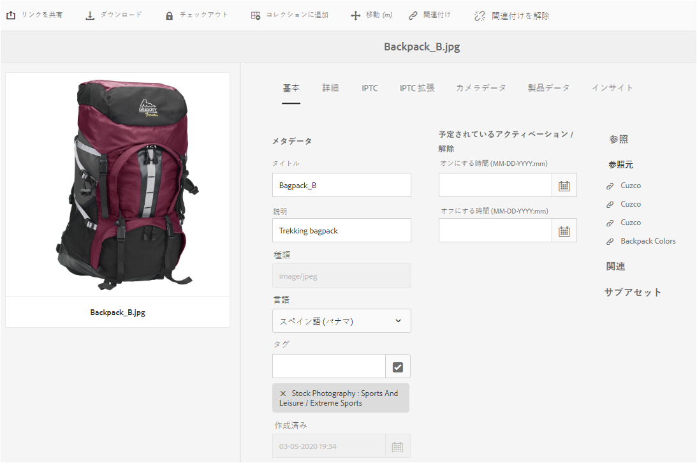

# デジタルアセットのメタデータの管理 {#managing-metadata-for-digital-assets}

<!-- Scope of metadata articles:
* metadata.md: The scope of this article is basic metadata updates, changes, etc. operations that end-users can do.
* metadata-concepts.md: All conceptual information. Minor instructions are OK but it is an FYI article about support and standards.
* metadata-config.md: New article. Contains all configuration and administration how-to info related to metadata of assets.
-->

[!DNL Adobe Experience Manager Assets] では、あらゆるアセットのメタデータを保持します。したがって、アセットの分類と編成が容易にでき、特定のアセットを検索しやすくなります。メタデータ管理は、[!DNL Experience Manager Assets] にアップロードされるファイルからメタデータを抽出する機能と共に、クリエイティブワークフローに統合されます。アセットの任意のメタデータを保持して管理する機能によって、メタデータに基づいてアセットを自動的に編成および処理できます。

## メタデータとその接触チャネル{#how-to-edit-or-add-metadata}

メタデータは、検索可能なアセットに関する追加情報です。アセットに追加され、[!DNL Experience Manager]内でアセットのアップロード時に処理されます。 既存のメタデータを編集し、新しいメタデータプロパティを既存のフィールドに追加できます。 組織は、制御された信頼性の高いメタデータの語彙を必要とします。 したがって、[!DNL Experience Manager Assets]は、新しいメタデータプロパティのオンデマンド追加を許可しません。 メタデータを保持する新しいプロパティまたはフィールドを追加できるのは、管理者と開発者だけです。 ユーザーは、既存のフィールドにメタデータを埋め込むことができます。

デジタルアセットにメタデータを追加するには、次の方法を使用できます。

* まず、アセットを作成するネイティブアプリケーションがメタデータを追加します。 例えば、[AcrobatがPDFファイルにメタデータ](https://helpx.adobe.com/acrobat/using/pdf-properties-metadata.html)を追加したり、カメラが写真に基本的なメタデータを追加したりします。 アセットを生成する際に、ネイティブアプリケーション自体にメタデータを追加できます。 例えば、AdobeLightroom](https://helpx.adobe.com/lightroom-classic/help/metadata-basics-actions.html)に[IPTCメタデータを追加できます。

* アセットを[!DNL Experience Manager]にアップロードする前に、アセットの作成に使用するネイティブアプリケーションまたは他のメタデータ編集アプリケーションを使用して、メタデータを編集および変更できます。 アセットをExperience Managerにアップロードすると、メタデータが処理されます。 例えば、 [!DNL Adobe Bridge]](https://helpx.adobe.com/bridge/user-guide.html/bridge/using/metadata-adobe-bridge.ug.html)のメタデータを[操作する方法と、[!DNL Adobe Exchange]の [!DNL Bridge CC]](https://exchange.adobe.com/creativecloud.details.20009.aem-tags-panel-for-bridge-cc.html)の[タグパネルを参照してください。

* [!DNL Experience Manager Assets]では、[!UICONTROL プロパティ]ページのアセットのメタデータを手動で追加または編集できます。

* [!DNL Experience Manager Assets]の[メタデータプロファイル](/help/assets/metadata-config.md#metadata-profiles)機能を利用して、アセットがDAMにアップロードされる際にメタデータを自動的に追加できます。

## または[!DNL Experience Manager Assets] {#add-edit-metadata}のメタデータを追加編集

[!DNL Assets]ユーザーインターフェイスでアセットのメタデータを編集するには、次の手順に従います。

1. 次のいずれかの操作をおこないます。

   * [!DNL Assets]インターフェイスからアセットを選択し、ツールバーの&#x200B;**[!UICONTROL 表示プロパティ]**&#x200B;をクリックします。
   * アセットのサムネールから、「**[!UICONTROL プロパティを表示]**」クイックアクションを選択します。
   * アセットページで、ツールバーの&#x200B;**[!UICONTROL 表示プロパティ]** をクリックします。

   アセットページには、すべてのアセットのメタデータが表示されます。 アセットが[!DNL Experience Manager]にアップロード（取り込む）されると、メタデータが抽出されます。

   

   *図：アセットのプロパティページでメタデータを編集または追加  します。*

1. 必要に応じて、様々なタブのメタデータに編集を加え、完了したら、ツールバーの「**[!UICONTROL 保存]**」をクリックして変更を保存します。 「**[!UICONTROL 閉じる]**」をクリックして[!DNL Assets] Webインターフェイスに戻ります。

   >[!NOTE]
   >
   >テキストフィールドが空の場合、現在設定されているメタデータはありません。フィールドに値を入力して保存すると、そのメタデータプロパティを追加できます。

アセットのメタデータへの変更内容は、XMP データの一部として元のバイナリに書き戻されます。メタデータ書き込みワークフローは、元のバイナリにメタデータを追加します。 既存のプロパティ（`dc:title`など）に対して行った変更は上書きされ、新しいプロパティ（`cq:tags`などのカスタムプロパティを含む）はスキーマに追加されます。

[技術要件で説明されているプラットフォームとファイル形式に対しては、XMP書き込みバックがサポートされ、有効になっています。](/help/sites-deploying/technical-requirements.md)

## 複数のアセットのメタデータプロパティの編集{#editing-metadata-properties-of-multiple-assets}

[!DNL Adobe Enterprise Manager Assets] 複数のアセットのメタデータを同時に編集できるので、一般的なメタデータの変更をアセットに一括してすばやく反映できます。複数のコレクションのメタデータを同時に編集することもできます。プロパティページを使用して、複数のアセットまたはコレクションのメタデータを変更できます。

* メタデータプロパティを共通の値に変更する
* タグを追加または変更する

メタデータプロパティの追加、変更、削除を含む、メタデータプロパティページをカスタマイズするには、[スキーマエディター](metadata-config.md#folder-metadata-schema)を使用します。

>[!NOTE]
>
>一括編集メソッドは、フォルダーまたはコレクションで使用可能なアセットに対して機能します。フォルダー全体で使用可能なアセットまたは共通の基準に一致するアセットについては、[検索後にメタデータを一括更新する](search-assets.md#metadataupdates)ことが可能です。

1. [!DNL Assets]ユーザーインターフェイスで、編集するアセットの場所に移動します。
1. 共通のプロパティを編集するアセットを選択します。
1. ツールバーで、**[!UICONTROL プロパティ]**&#x200B;をクリックして、選択したアセットのプロパティページを開きます。

   >[!NOTE]
   >
   >複数のアセットを選択すると、それらのアセットに対して最も下位の共通親フォームが選択されます。つまり、プロパティページには、すべての個々のアセットのプロパティページに共通のメタデータフィールドのみが表示されます。

1. 様々なタブで選択したアセットのメタデータプロパティを変更します。
1. 特定のアセットのメタデータエディターを表示するには、リストの残りのアセットの選択を解除します。メタデータエディターのフィールドには、その特定のアセットのメタデータが入力されています。

   >[!NOTE]
   >
   >* プロパティページで、アセットのリストからアセットの選択を解除することでそのアセットを削除できます。アセットリストは、デフォルトではすべてのアセットが選択されています。リストから削除するアセットのメタデータは更新されていません。
   >* アセットリストの上部で、「**[!UICONTROL タイトル]**」の横にあるチェックボックスをオンにして、アセットの選択とリストの消去を切り替えます。

1. アセットに別のメタデータスキーマを選択するには、ツールバーの&#x200B;**[!UICONTROL 設定]**&#x200B;をクリックし、目的のスキーマを選択します。
1. 変更内容を保存します。
1. 複数の値が含まれるフィールドで、既存のメタデータに新しいメタデータを追加するには、「**[!UICONTROL 追加モード]**」を選択します。このオプションを選択しないと、フィールド内の既存のメタデータが新しいメタデータに置換されます。「**[!UICONTROL 送信]**」をクリックします。

   >[!CAUTION]
   >
   >1 つの値のみを指定できるフィールドの場合、「**[!UICONTROL 追加モード]**」を選択しても、フィールド内の既存の値に新しいメタデータが追加されません。

## メタデータの読み込み {#import-metadata}

[!DNL Assets] では、CSV ファイルを使用して、アセットのメタデータを一括で読み込むことができます。CSV ファイルを読み込むことで、最近アップロードされたアセットや既存のアセットの一括更新をおこなうことができます。また、サードパーティシステムから CSV 形式でアセットメタデータを一括で取り込むこともできます。

メタデータの読み込みは非同期的で、システムのパフォーマンスを妨げません。 ワークフロー実行フラグがチェックされている場合、XMP 書き戻しアクティビティが発生するので、複数のアセットのメタデータを同時に更新すると、リソースが集中的に使用されるおそれがあります。このような読み込みは、他のユーザーのパフォーマンスに影響しないように、サーバー使用率が低いときに計画します。

>[!NOTE]
>
>カスタム名前空間にメタデータを読み込むには、まず、その名前空間を登録します。

1. [!DNL Assets]ユーザーインターフェイスに移動し、ツールバーの&#x200B;**[!UICONTROL 作成]**&#x200B;をクリックします。
1. メニューから「**[!UICONTROL メタデータ]**」を選択します。
1. **[!UICONTROL メタデータの読み込み]**&#x200B;ページで、**[!UICONTROL ファイルを選択]**&#x200B;をクリックします。 メタデータが入った CSV ファイルを選択します。
1. 次のパラメーターを指定します。 [metadata-import-sample-file.csv](/help/assets/assets/metadata-import-sample-file.csv)のサンプルCSVファイルを参照してください。

   | メタデータ読み込みパラメーター | 説明 |
   |:---|:---|
   | [!UICONTROL バッチサイズ] | メタデータを読み込むバッチ内のアセット数。デフォルト値は 50 です。最大値は 100 です。 |
   | [!UICONTROL フィールドセパレーター] | デフォルト値は `,`（コンマ）です。他の文字も指定できます。 |
   | [!UICONTROL 複数の値の区切り文字] | メタデータ値のセパレーター。デフォルト値は `|` です。 |
   | [!UICONTROL ワークフローを開始] | デフォルトでは false です。`true`に設定し、[!UICONTROL DAM Metadata WriteBack]ワークフローに対してデフォルトのランチャー設定が有効になっている場合(メタデータをバイナリXMPデータに書き込みます)。 「ワークフローを開始」を有効にすると、システムの反応が遅くなります。 |
   | [!UICONTROL アセットパス列名] | アセットが含まれている、CSV ファイルの列名を定義します。 |

1. ツールバーの&#x200B;**[!UICONTROL 「]**&#x200B;を読み込み」をクリックします。 メタデータが読み込まれると、[!UICONTROL 通知]インボックスに通知が表示されます。

1. 正しい読み込みを検証するには、アセットの[!UICONTROL プロパティ]ページに移動し、フィールドの値を確認します。

メタデータの読み込み時に日付とタイムスタンプを追加するには、日付と時刻の `YYYY-MM-DDThh:mm:ss.fff-00:00` 形式を使用します。日付と時刻は `T` で区切られます。`hh` は 24 時間形式の時間、`fff` はナノ秒、`-00:00` はタイムゾーンオフセットです。例えば、`2020-03-26T11:26:00.000-07:00` は、2020 年 3 月 26 日の午前 11:26:00.000 PST 時間です。

>[!CAUTION]
>
>日付形式が `YYYY-MM-DDThh:mm:ss.fff-00:00` と一致しない場合、日付値は設定されません。書き出されたメタデータ CSV ファイルの日付形式は、`YYYY-MM-DDThh:mm:ss-00:00` 形式になります。インポートする場合は、`fff` で示すナノ秒値を追加して、有効な形式に変換します。

## メタデータの書き出し{#export-metadata}

CSV形式で複数のアセットのメタデータを書き出すことができます。 メタデータは非同期的に書き出され、システムのパフォーマンスに影響を及ぼしません。メタデータを書き出すには、[!DNL Experience Manager]がアセットノード`jcr:content/metadata`とその子ノードのプロパティを調べ、メタデータプロパティをCSVファイルに書き出します。

メタデータの一括書き出しの使用例は次のとおりです。

* アセットの移行時にサードパーティシステムにメタデータを読み込む。
* より広範なプロジェクトチームとアセットメタデータを共有する。
* メタデータをテストまたは監査してコンプライアンスを確保する。
* メタデータを外部化して、個別にローカライズします。

1. メタデータを書き出すアセットを含んだアセットフォルダーを選択します。ツールバーの「**[!UICONTROL メタデータを書き出し]**」を選択します。

1. [!UICONTROL メタデータの書き出し]ダイアログで、CSVファイルの名前を指定します。 サブフォルダー内のアセットのメタデータを書き出すには、「**[!UICONTROL サブフォルダーのアセットを含める]**」を選択します。

   

1. 目的のオプションを選択します。ファイル名を指定し、必要に応じて日付を指定します。

1. 「**[!UICONTROL 書き出すプロパティ]**」フィールドで、すべてのプロパティを書き出すか、特定のプロパティを書き出すかを指定します。書き出すプロパティを選択する場合は、目的のプロパティを追加します。

1. ツールバーで、**[!UICONTROL 書き出し]**&#x200B;をクリックします。 メタデータが書き出されることを確認するメッセージが表示されます。メッセージを閉じます。

1. 書き出しジョブのインボックス通知を開きます。ジョブを選択し、ツールバーの「**[!UICONTROL 開く]**」をクリックします。メタデータを含むCSVファイルをダウンロードするには、ツールバーの&#x200B;**[!UICONTROL CSVダウンロード]**&#x200B;をクリックします。 「**[!UICONTROL 閉じる]**」をクリックします。

   

   *図：一括で書き出したメタデータを格納した CSV ファイルをダウンロードするためのダイアログ.*

## コレクションのメタデータの編集{#collections-metadata}

詳しくは、[表示およびコレクションのメタデータの編集](/help/assets/manage-collections.md#view-edit-collection-metadata)および[複数のコレクションのメタデータの一括編集](/help/assets/manage-collections.md#editing-collection-metadata-in-bulk)を参照してください。

## フォルダーへのメタデータプロファイルの適用 {#applying-a-metadata-profile-to-folders}

<!-- TBD: Review this overview.
-->

フォルダーにメタデータプロファイルを割り当てると、サブフォルダーは自動的に親フォルダーのプロファイルを継承します。つまり、フォルダーに適用できるのは 1 つのメタデータプロファイルのみとなります。そのため、アセットをアップロード、保存、使用およびアーカイブする場所のフォルダー構造については入念に検討してください。

フォルダーに異なるメタデータプロファイルを割り当てた場合、新しいプロファイルが以前のプロファイルよりも優先されます。以前に存在していたフォルダーのアセットは変更されずに維持されます。新しいプロファイルは、その後にフォルダーに追加されるアセットに対して適用されます。

プロファイルが割り当てられているフォルダーは、ユーザーインターフェイスでカード名にプロファイルの名前が表示されます。

特定のフォルダーまたはすべてのアセットにグローバルにメタデータプロファイルを適用できます。

後で変更した既存のメタデータプロファイルが存在するフォルダー内のアセットを再処理できます。[処理プロファイルを編集した後のフォルダー内のアセットの再処理](processing-profiles.md#reprocessing-assets)を参照してください。

**[!UICONTROL ツール]**&#x200B;メニュー内から、またはフォルダー内にいる場合は「**[!UICONTROL プロパティ]**」から、メタデータプロファイルをフォルダーに適用できます。この節では、メタデータプロファイルをフォルダーに適用する両方の方法について説明します。

既にプロファイルが割り当てられているフォルダーには、フォルダー名のすぐ下にプロファイルの名前が表示されます。

後で変更した既存のビデオプロファイルが存在するフォルダー内のアセットを再処理できます。[処理プロファイルを編集した後のフォルダー内のアセットの再処理](processing-profiles.md#reprocessing-assets)を参照してください。

### [!UICONTROL プロファイル]ユーザーインターフェイス{#applying-metadata-profiles-to-folders-from-profiles-user-interface}からフォルダーにメタデータプロファイルーを適用

メタデータプロファイルを適用する手順は、次のとおりです。

1. [!DNL Experience Manager]ロゴをクリックし、**[!UICONTROL ツール]**/**[!UICONTROL アセット]**/**[!UICONTROL メタデータプロファイル]**&#x200B;に移動します。
1. 1 つまたは複数のフォルダーに適用するメタデータプロファイルを選択します。
1. 「**[!UICONTROL メタデータプロファイルをフォルダーに適用]**」をクリックし、新しくアップロードされたアセットの受信に使用するフォルダーまたは複数のフォルダーを選択して、「**[!UICONTROL 完了]**」をクリックします。 既にプロファイルが割り当てられているフォルダーには、フォルダー名のすぐ下にプロファイルの名前が表示されます。

### [!UICONTROL プロパティ] {#applying-metadata-profiles-to-folders-from-properties}からフォルダーにメタデータプロファイルを適用

1. 左側のレールで、「**[!UICONTROL アセット]**」をクリックし、メタデータプロファイルを適用するフォルダーに移動します。
1. フォルダーのチェックマークをクリックして選択し、「**[!UICONTROL プロパティ]**」をクリックします。

1. 「**[!UICONTROL メタデータプロファイル]**」タブを選択し、ポップアップメニューからプロファイルを選択して、「**[!UICONTROL 保存]**」をクリックします。

既にプロファイルが割り当てられているフォルダーには、フォルダー名のすぐ下にプロファイルの名前が表示されます。

<!-- TBD: Commenting as the topic in metadata-config.md is incomplete.

### Apply metadata profile globally {#metadata-profile-global}

For details, see [configuration to apply metadata profile globally](/help/assets/metadata-config.md#apply-a-metadata-profile-globally). -->

### フォルダ{#removing-a-metadata-profile-from-folders}からのメタデータプロファイルの削除

フォルダーからメタデータプロファイルを削除すると、サブフォルダーは自動的に親フォルダーのプロファイルの削除状態を継承します。ただし、フォルダー内で実行されたファイルの処理はそのまま維持されます。

メタデータプロファイルは、**[!UICONTROL ツール]**&#x200B;メニュー内または&#x200B;**[!UICONTROL プロパティ]**&#x200B;内のフォルダーから削除できます。

#### プロファイルユーザーインターフェイス{#removing-metadata-profiles-from-folders-via-profiles-user-interface}を使用して、フォルダーからメタデータプロファイルーを削除

1. [!DNL Experience Manager]ロゴをクリックし、**[!UICONTROL ツール]**/**[!UICONTROL アセット]**/**[!UICONTROL メタデータプロファイル]**&#x200B;に移動します。
1. 1 つまたは複数のフォルダーから削除するメタデータプロファイルを選択します。
1. 「**[!UICONTROL フォルダーからメタデータプロファイルーを削除]**」をクリックし、プロファイルーの削除に使用するフォルダーまたは複数のフォルダーを選択して、「**[!UICONTROL 完了]**」をクリックします。

   名前がフォルダー名の下に表示されなくなっていることで、メタデータプロファイルがフォルダーに適用されていないことを確認できます。

#### プロパティ{#removing-metadata-profiles-from-folders-via-properties}を使用して、フォルダーからメタデータプロファイルーを削除

1. [!DNL Experience Manager]ロゴをクリックし、**[!UICONTROL アセット]**&#x200B;に移動して、メタデータプロファイルーを削除するフォルダーに移動します。
1. フォルダーのチェックマークをクリックして選択し、「**[!UICONTROL プロパティ]**」をクリックします。
1. 「**[!UICONTROL メタデータプロファイル]**」タブを選択し、ドロップダウンメニューから「**[!UICONTROL なし]**」を選択して、「**[!UICONTROL 保存]**」をクリックします。既にプロファイルが割り当てられているフォルダーには、フォルダー名のすぐ下にプロファイルの名前が表示されます。

## ヒントと制限事項 {#best-practices-limitations}

* ユーザーインターフェイスを介してメタデータが更新され、`dc`名前空間ーのメタデータプロパティが変更されます。 HTTP APIを使用して更新を行うと、`jcr`名前空間ーのメタデータプロパティが変更されます。 HTTP API[を使用してメタデータを更新する方法を参照してください。](/help/assets/mac-api-assets.md#update-asset-metadata)

* アセットのメタデータを読み込むためのCSVファイルは、非常に特殊な形式です。 手間と時間を節約し、意図しないエラーを回避するために、書き出したCSVファイルの形式を使用してCSVを作成する開始を作成できます。

* CSVファイルを使用してメタデータを読み込む場合、必要な日付形式は`YYYY-MM-DDThh:mm:ss.fff-00:00`です。 その他の形式を使用すると、日付値は設定されません。 書き出されたメタデータ CSV ファイルの日付形式は、`YYYY-MM-DDThh:mm:ss-00:00` 形式になります。インポートする場合は、`fff` で示すナノ秒値を追加して、有効な形式に変換します。

>[!MORELIKETHIS]
>
>* [メタデータの概念と理解](metadata-concepts.md)。
>* [複数コレクションのメタデータプロパティの編集](manage-collections.md#editing-collection-metadata-in-bulk)
>* [Experience Managerアセットでのメタデータの読み込みと書き出し](https://experienceleague.adobe.com/docs/experience-manager-learn/assets/metadata/metadata-import-feature-video-use.html)

<!-- TBD: Try filling the available information in these topics to the extent possible. As and when complete, publish the sections live.

## Where to find metadata of an asset or folder {#find-metadata}

What all methods to access asset Properties. More Details option in column view. Select asset and click Properties. Keyboard shortcut `p`. What else?

## Understand metadata handling in Experience Manager {#metadata-possibilities-with-aem}

Describe the journey of an assets' metadata. What all happens to metadata when an asset is added to Experience Manager.

## Add metadata to your digital assets {#add-metadata}

* To begin with, assets come with some metadata. The applications that create digital assets add some metadata to the assets created. Before uploading an asset to Experience Manager, you can edit and modify metadata using either the native application used to create an asset or using some other metadata editing application. When you upload an asset to Experience Manager, the metadata is processed.

* Link to PS, ID, AI, PDF, etc. metadata-related help articles.

* Link to XMP writeback.

* Manually add (or edit) metadata in AEM in Properties page.

* Metadata profiles

* Any workflows related to metadata?

* Advanced topic: Add, edit, modify, process and writeback metadata of subassets.

## Metadata of assets, folders, and collections {#metadata-of-assets-folders-collections}

Similarities and differences between metadata of asset and folder. 

Link to metadata handling of collections.

## Modify metadata of an asset, folder, or collection {#modify-metadata}

* While creating assets: Native application.

* Before ingesting assets: Metadata editors

* After ingesting assets: Properties of an asset, folder, collection, etc.

* Any supported programmatic method to bulk edit metadata directly in JCR?

## Modify metadata in bulk {#modify-metadata-in-bulk}

[!DNL Adobe Enterprise Manager Assets] lets you edit the metadata of multiple assets simultaneously so you can quickly propagate common metadata changes to assets in bulk. You can also edit the metadata for multiple collections in bulk.

Use the properties page to perform metadata changes on multiple assets or collections:

* Change metadata properties to a common value

* Add or modify tags

To customize the metadata properties page, including adding, modifying, deleting metadata properties, use the schema editor.

>[!NOTE]
>
>The bulk editing methods work for assets available in a folder or a collection. For the assets that are available across folders or match a common criteria, it is possible to [bulk update the metadata after searching](search-assets.md#metadataupdates).

1. In the [!DNL Assets] user interface, navigate to the location of the assets you want to edit.
1. Select the assets for which you want to edit common properties.
1. From the toolbar, click **[!UICONTROL Properties]** to open the properties page for the selected assets.

   >[!NOTE]
   >
   >When you select multiple assets, the lowest common parent form is selected for the assets. In other words, the properties page only displays metadata fields that are common across the properties pages of all the individual assets.

1. Modify the metadata properties for selected assets under the various tabs.
1. To view the metadata editor for a specific asset, deselect the remaining assets in the list. The metadata editor fields are populated with the metadata for the particular asset.

   >[!NOTE]
   >
   >* In the Properties page, you can remove assets from the asset list by deselecting them. The asset list has all the assets selected by default. The metadata for assets that you remove from the list is not updated.
   >
   >* At the top of assets list, select the check box near **[!UICONTROL Title]** to toggle between selecting the assets and clearing the list.

1. To select a different metadata schema for the assets, click **[!UICONTROL Settings]** from the toolbar, and select the desired schema.
1. Save the changes.
1. To append the new metadata with the existing metadata in fields that contain multiple values, select **[!UICONTROL Append mode]**. If you do not select this option, the new metadata replaces the existing metadata in the fields. click **[!UICONTROL Submit]**.

   >[!CAUTION]
   >
   >For single-value fields, the new metadata is not appended to the existing value in the field even if you select **[!UICONTROL Append mode]**.

-->
