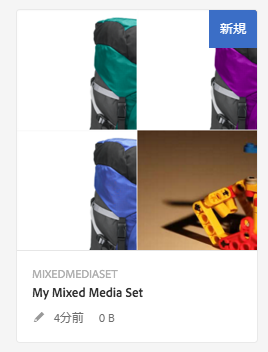
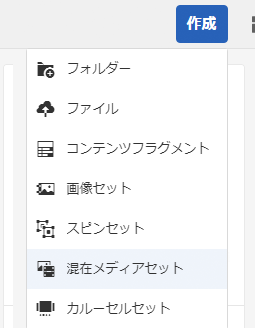
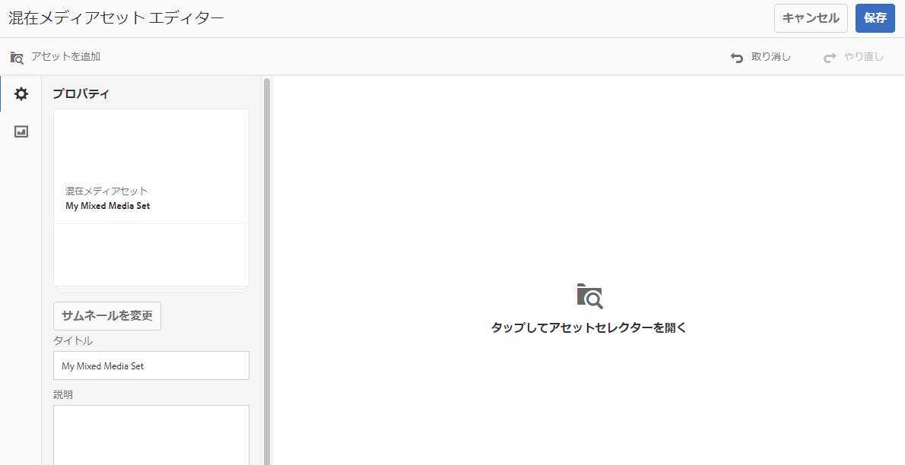

# 混在メディアセット{#mixed-media-sets}

混在メディアセットは、画像、画像セット、スピンセットおよびビデオを 1 つのプレゼンテーションで混在させて表示するものです。

混在メディアセットのバナーには、「**[!UICONTROL MixedMediaSet」と表示されます。]**&#x200B;また、混在メディアセットが公開されている場合、公開日が&#x200B;**[!UICONTROL 地球]**&#x200B;アイコン付きでバナーに表示され、最終変更日も&#x200B;**[!UICONTROL 鉛筆]**&#x200B;アイコン付きで表示されます。

>[!NOTE]
>
>アセットユーザーインターフェイスについて詳しくは、アセットの [管理を参照してください](/help/assets/manage-assets.md)。

## クイックスタート：混在メディアセット {#quick-start-mixed-media-sets}

混在メディアセットをすぐに使い始めるには、次の手順を実行します。

1. [アセットをアップロードします](#uploading-assets)。

   まずは混在メディアセット用の画像およびビデオをアップロードします。必要に応じて、[画像セット](/help/assets/image-sets.md)と[スピンセット](/help/assets/spin-sets.md)を作成します。ユーザーは混在メディアセットビューアで画像をズームできるので、画像を選択する際にはズームを考慮します。最大サイズで 2,000 ピクセル以上の画像を使用してください。

1. [混在メディアセットを作成します。](#creating-mixed-media-sets)

   アセットページで混在メディアセットを作成するには、**[!UICONTROL 作成／混在メディアセット]**&#x200B;をタップし、セットの名前を付け、アセットを選択し、さらに画像の表示順を選択します。

   [セレクターの操作](/help/assets/working-with-selectors.md)を参照してください。

1. 必要に応じて[混在メディアビューアプリセット](/help/assets/managing-viewer-presets.md)を設定します。

   管理者は、混在メディアセットビューアプリセットを作成または編集できます。To see your mixed media with a viewer preset, select the mixed media set, and in the left-rail drop-down menu, select **[!UICONTROL Viewers.]**

   **[!UICONTROL ツール／アセット／ビューアプリセット]**&#x200B;を選択して、ビューアプリセットを作成または編集します。

   詳しくは、[ビューアプリセットの追加と編集](/help/assets/managing-viewer-presets.md)を参照してください。

1. [混在メディアセットをプレビューします。](#previewing-mixed-media-sets)

   混在メディアセットを選択すると、プレビューできます。サムネールアイコンをクリックして、選択したビューアでの混在メディアセットの表示を確認します。**[!UICONTROL ビューア]**&#x200B;メニューから様々なビューアを選択できます。このメニューは左側のレールのドロップダウンメニューにあります。

1. [混在メディアセットを公開します。](#publishing-mixed-media-sets)

   混在メディアセットを公開すると、URL と埋め込み文字列がアクティベートされます。また、[ビューアプリセットを公開](/help/assets/managing-viewer-presets.md#publishing-viewer-presets)する必要があります。

1. [URL を Web アプリケーションにリンクする](/help/assets/linking-urls-to-yourwebapplication.md)か、[ビデオビューアまたは画像ビューアを埋め込みます](/help/assets/embed-code.md)。

   混在メディアセットの URL コールが作成され、混在メディアセットの公開後にそれらの URL コールがアクティベートされます。アセットをプレビューする際に、これらの URL をコピーできます。または、URL を Web サイトに埋め込むこともできます。

   Select the Mixed Media Set, then in the left rail drop-down menu, select **[!UICONTROL Viewers.]**

   詳しくは、[Web ページへの混在メディアセットのリンク](/help/assets/linking-urls-to-yourwebapplication.md)および[ビデオビューアまたは画像ビューアの埋め込み](/help/assets/embed-code.md)を参照してください。

必要に応じて、[混在メディアセット](#editing-mixed-media-sets)を編集できます。また、[混在メディアセットのプロパティ](/help/assets/manage-assets.md#editing-properties)を表示および変更することができます。

>[!NOTE]
>
>If you have issues creating sets, see [Troubleshooting Dynamic Media - Scene7 mode](/help/assets/troubleshoot-dms7.md).

## アセットのアップロード {#uploading-assets}

まずは混在メディアセット用の画像およびビデオをアップロードします。ユーザーは混在メディアセットビューアで画像をズームできるので、画像を選択する際には必ずズームを考慮してください。最大サイズで 2,000 ピクセル以上の画像を使用してください。

また、混在メディアセットにスピンセットまたは画像セットを追加する場合は、それらのセットも作成します。

## 混在メディアセットの作成 {#creating-mixed-media-sets}

混在メディアセットには画像、画像セット、スピンセットおよびビデオを追加できます。ファイル、画像セットおよびスピンセットを公開できる状態にしてから、混在メディアセットに追加するようにしてください。

画像セットに追加したアセットは、自動的に英数字順で追加されます。追加後に、手動でアセットの順番を変更したり、並べ替えたりすることができます。

**混在メディアセットを作成するには：**

1. Assets で、混在メディアセットを作成する場所に移動し、**[!UICONTROL 作成]**／**[!UICONTROL 混在メディアセットを選択します。]**&#x200B;アセットを格納しているフォルダー内からセットを作成することもできます。混在メディアセットエディターが表示されます。

   

1. 混在メディアセットエディターで、「**[!UICONTROL タイトル]**」に混在メディアセットの名前を入力します。この名前は、混在メディアセット全般のバナーに表示されます。オプションで、説明を入力します。

   

   >[!NOTE]
   >
   >混在メディアセットを作成するときに、混在メディアセットのサムネールを変更したり、AEM で混在メディアセット内のアセットに基づいてサムネールを自動的に選択したりすることができます。サムネールを選択するには、「**[!UICONTROL サムネールを変更]**」をクリックし、画像を選択します（他のフォルダーに移動して画像を探すこともできます）。If you have selected a thumbnail and then decide that you want AEM to generate one from the mixed media set, select **[!UICONTROL Switch to Automatic thumbnail.]**

1. アセットセレクターをタップして、混在メディアセットに組み込むアセットを選択します。Select them and click **[!UICONTROL Select.]**

   アセットセレクターでは、キーワードを入力して **[!UICONTROL Enter キーをタップすることで、アセットを検索することができます。]**&#x200B;フィルターを適用して、検索結果を絞り込むこともできます。パス、コレクション、ファイルタイプおよびタグでフィルタリングできます。フィルターを選択してから、ツールバーの&#x200B;**[!UICONTROL フィルター]**&#x200B;アイコンをタップします。Change the view by selecting the **[!UICONTROL View]** icon and selecting **[!UICONTROL List View]**, **[!UICONTROL Column View]**, or **[!UICONTROL Card View.]**

   [セレクターの操作](/help/assets/working-with-selectors.md)を参照してください。

   

1. 必要に応じて、アセットをリスト内で上下にドラッグしてアセットを並べ替えます（ドラッグするには、**[!UICONTROL 並べ替え]**&#x200B;アイコンを選択する必要があります）。

   

   サムネールを追加する場合は、画像の横の **+** **[!UICONTROL サムネール]**&#x200B;アイコンをクリックし、必要なサムネールに移動します。When done selecting all the thumbnail images click **[!UICONTROL Save.]**

   >[!NOTE]
   >
   >If you want to add assets, tap **[!UICONTROL Add Asset.]**

1. To delete an asset, select the corresponding check box and tap **[!UICONTROL Delete Asset.]**
1. プリセットを適用するには、右上隅にある「**[!UICONTROL プリセット]**」をタップし、アセットに適用するプリセットを選択します。
1. Click **[!UICONTROL Save.]** Your newly created Mixed Media Set appears in the folder you created it in.

## 混在メディアセットの編集 {#editing-mixed-media-sets}

[アセットの編集と同じように](/help/assets/manage-assets.md)、ユーザーインターフェイスで直接、混在メディアセット内のアセットに対して様々な編集タスクを実行できます。また、混在メディアセットでは次のアクションも実行できます。

* 混在メディアセットへのアセットの追加
* 混在メディアセット内のアセットの並べ替え
* 混在メディアセット内のアセットの削除
* ビューアプリセットの適用
* デフォルトサムネールの変更

**混在メディアセットを編集するには：**

1. 次のいずれかの操作をおこないます。

   * 混在メディアセットアセットの上にマウスポインターを置き、**[!UICONTROL 編集]**（鉛筆アイコン）をタップします。
   * 混在メディアセットアセットの上にマウスポインターを置き、**[!UICONTROL 選択]**（チェックマークアイコン）をタップしてからツールバーの「**[!UICONTROL 編集]**」をタップします。

   * 混在メディアセットアセットをタップし、ツールバーの「**[!UICONTROL 編集]**」（鉛筆アイコン）をタップします。

1. 混在メディアセットエディターで、次のいずれかをおこないます。

   * アセットを並べ替えるには - 左側のパネルで「**[!UICONTROL アセット]**」（写真アイコン）をタップし、アセットを新しい位置にドラッグします。
   * アセットを追加するには - ツールバーの「**[!UICONTROL アセットを追加」をタップします。]**&#x200B;アセットに移動します。追加するアセットごとに、（アセットの名前ではなく）アセットの画像の上にマウスポインターを置き、チェックマークアイコンをタップします。In the upper-right corner, tap **[!UICONTROL Select.]**

   * アセットを削除するには - 左側のパネルで「**[!UICONTROL アセット]**」（写真アイコン）をタップし、アセットを選択します。On the toolbar bar tap **[!UICONTROL Delete Asset.]**

   * アセットを名前の昇順または降順に並べ替えるには、左側のパネルで「**[!UICONTROL アセット]**」（写真アイコン）をタップします。「**[!UICONTROL アセット]**」見出しの右側にある上向きまたは下向きキャレットアイコンをタップします。

      >[!NOTE]
      >
      >* 混在メディアセット全体を削除するには、任意の表示モード（**[!UICONTROL カード表示]**&#x200B;や&#x200B;**[!UICONTROL 列表示]**&#x200B;など）から混在メディアセットに移動します。アセットの上にマウスポインターを置き、チェックマークアイコンをタップして選択します。Press **[!UICONTROL Backspace]** on the keyboard, or click **[!UICONTROL More]** (three dots) on the toolbar, then tap **[!UICONTROL Delete.]**
         >
         >
      * You can edit the assets in a Mixed Media Set by navigating to the set, clicking **[!UICONTROL Set Members]** in the left rail, and then tapping the **[!UICONTROL Pencil]** icon on an individual asset to open the editing window.

1. 編集が完了したら、「**[!UICONTROL 保存]**」をタップします。

   >[!NOTE]
   >
   >* 混在メディアセット内のアセットを編集するには - 混在メディアセットに移動します。セットを（選択ではなく）タップして、AEM プレビューを設定ページでセットを開きます。左側のレールで、下向きキャレットをクリックしてドロップダウンリストを開き、「**[!UICONTROL メンバーを設定」をタップします。]**&#x200B;メンバーを設定ページで、アセットの上にマウスポインターを置き、「**[!UICONTROL 編集]**」（鉛筆アイコン）をタップして編集ページを開きます。
      >
      >
   * 混在メディアセット全体を削除するには - 任意の表示モード（カード表示や列表示など）から混在メディアセットに移動します。セットの上にマウスポインターを置き、「**選択**」（チェックマークアイコン）をタップします。Press **[!UICONTROL Backspace]** on your keyboard, or tap **[!UICONTROL More]** (row of three dots), then tap **[!UICONTROL Delete.]**

## 混在メディアセットのプレビュー {#previewing-mixed-media-sets}

混在メディアセットのプレビュー方法について詳しくは、[アセットのプレビュー](/help/assets/previewing-assets.md)を参照してください。

## 混在メディアセットの公開 {#publishing-mixed-media-sets}

混在メディアセットの公開方法について詳しくは、[アセットの公開](/help/assets/publishing-dynamicmedia-assets.md)を参照してください。

>[!NOTE]
>
>混在メディアセットが最初の公開時に配信サービスに完全に送信されなかった場合は、2 回目の公開をおこなう必要があります。

