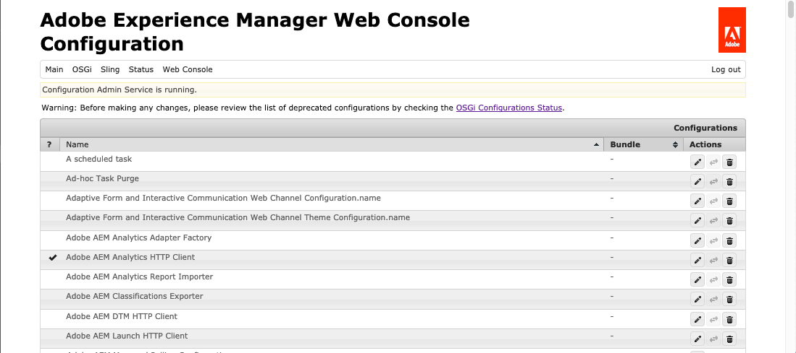
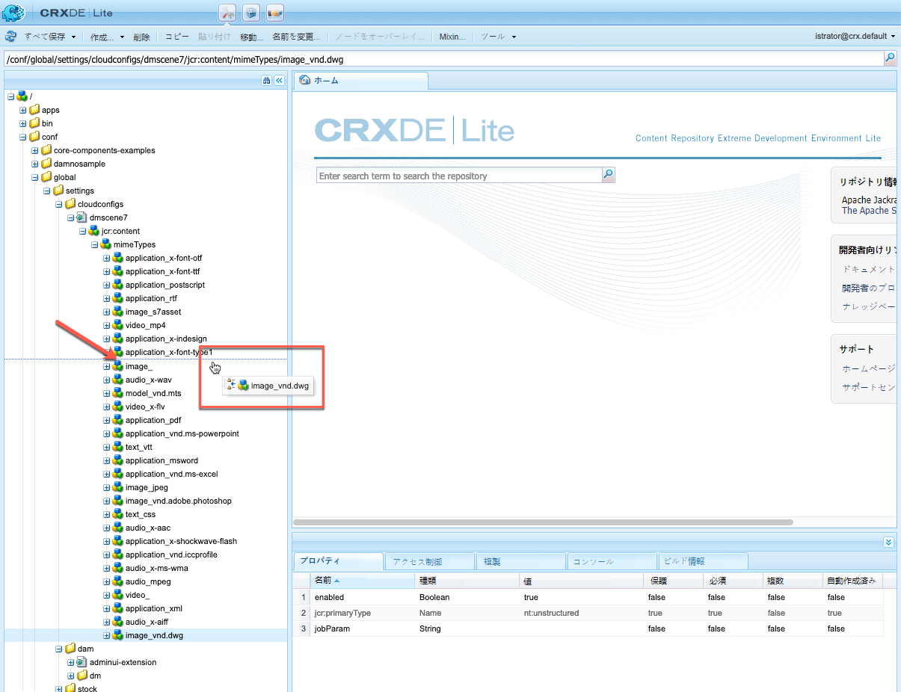
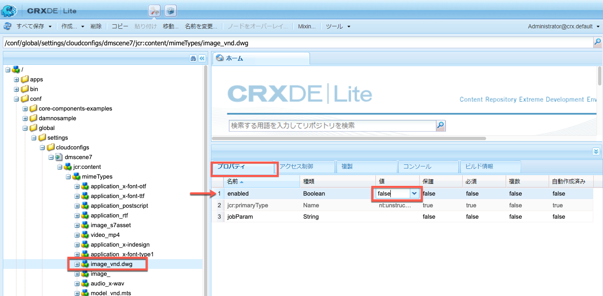
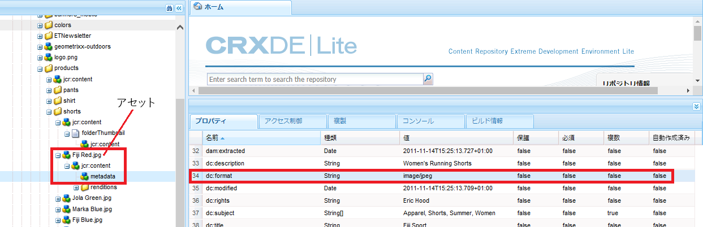

# オプション A - Dynamic Mediaの設定 — Scene7モード{#configuring-dynamic-media-scene-mode}

>[!NOTE]
>
>オプション A — 私が書いた 2 つの新しいトピックは削除されます。 しかし、トピックを削除する前に、その内容はすべてこのトピック内の、「一般設定」と「公開設定」について既に説明した各領域に移動されました。

開発、ステージング、実稼動など、異なる環境用にAdobe Experience Managerを設定して使用する場合は、それらの環境のそれぞれにDynamic MediaCloud Servicesを設定します。

## Dynamic Media - Scene7 モードのアーキテクチャ図 {#architecture-diagram-of-dynamic-media-scene-mode}

**RICK:現状のままに保つ**

以下のアーキテクチャ図に Dynamic Media - Scene7 モードの仕組みを示します。

新しいアーキテクチャでは、Experience Managerはプライマリソースアセットを担当し、Dynamic Mediaと同期してアセットの処理と公開をおこないます。

1. プライマリソースアセットがExperience Managerにアップロードされると、Dynamic Mediaにレプリケートされます。 その時点で、Dynamic Media は、ビデオエンコーディングおよび画像の動的バリアントなど、すべてのアセットの処理とレンディションの生成を扱います。(Dynamic Media - Scene7モードでは、デフォルトのアップロードファイルサイズは 2 GB 以下です。 アップロードファイルのサイズを 2 GB まで 15 GB にするには、 [（オプション）2 GB を超えるアセットのアップロードに対するDynamic Media - Scene7モードの設定](#optional-config-dms7-assets-larger-than-2gb).)
1. レンディションが生成されると、Experience Managerは、リモートのDynamic Mediaレンディションに安全にアクセスし、プレビューできます ( バイナリはExperience Managerインスタンスに送り返されません )。
1. コンテンツを公開および承認する準備が整ったら、Dynamic Mediaサービスがコンテンツを配信サーバーにプッシュして CDN（コンテンツ配信ネットワーク）でコンテンツをキャッシュするようトリガーします。


>[!IMPORTANT]
>
>次の機能のリストでは、Adobe Experience Manager - Dynamic Mediaに組み込まれている標準搭載の CDN を使用する必要があります。 他のカスタム CDN は、これらの機能ではサポートされません。
>
>* [スマートイメージング](/help/assets/imaging-faq.md)
>* [キャッシュの無効化](/help/assets/invalidate-cdn-cache-dynamic-media.md)
>* [ホットリンクの保護](/help/assets/hotlink-protection.md)
>* [コンテンツの HTTP/2 配信](/help/assets/http2.md)
>* CDN レベルでの URL リダイレクト
>* Akamai ChinaCDN（中国での最適な配信用）


## Scene7モードでのDynamic Mediaの有効化 {#enabling-dynamic-media-in-scene-mode}

**RICK:現状のままに保つ**

[Dynamic Media はデフォルトで無効になっています。](https://business.adobe.com/products/experience-manager/assets/dynamic-media.html)Dynamic Mediaの機能を活用するには、有効にする必要があります。

>[!WARNING]
>
>Dynamic Media - Scene7モードは *Experience Managerオーサーインスタンスのみ*. そのため、 `runmode=dynamicmedia_scene7` Experience Managerオーサーインスタンスで、 *not* Experience Managerパブリッシュインスタンス

Dynamic Mediaを有効にするには、 `dynamicmedia_scene7` ターミナルウィンドウで次のように入力して、コマンドラインから実行モードを指定します（使用するポートの例は 4502）。

```shell
java -Xms4096m -Xmx4096m -Doak.queryLimitInMemory=500000 -Doak.queryLimitReads=500000 -jar cq-quickstart-6.5.0.jar -gui -r author,dynamicmedia_scene7 -p 4502
```

## （オプション）Dynamic Mediaのプリセットと設定を 6.3 から 6.5 にダウンタイムなしで移行 {#optional-migrating-dynamic-media-presets-and-configurations-from-to-zero-downtime}

**RICK:現状のままに保つ**

Experience ManagerDynamic Mediaを 6.3 から 6.4 または 6.5 にアップグレードする際に、ダウンタイムなしのデプロイメントを実行できるようになりました。 すべてのプリセットと設定を次の場所から移行するには： `/etc` から `/conf` CRXDE Liteでは、次の curl コマンドを必ず実行してください。

>[!NOTE]
>
>Experience Managerインスタンスを互換モードで実行する場合（つまり、互換性パッケージがインストールされている場合）、これらのコマンドを実行する必要はありません。

互換性パッケージの有無にかかわらず、すべてのアップグレードについて、次の Linux® curl コマンドを実行して、Dynamic Mediaに付属しているデフォルトの標準提供ビューアプリセットをコピーできます。

`curl -u admin:admin -X POST https://<server_address>:<server_port>/libs/settings/dam/dm/presets/viewer.pushviewerpresets.json`

作成したカスタムビューアプリセットと設定を移行するには `/etc` から `/conf`、次の Linux® curl コマンドを実行します。

`curl -u admin:admin -X POST https://<server_address>:<server_port>/libs/settings/dam/dm/presets.migratedmcontent.json`

## 一括アセット移行用の機能パック18912をインストールする {#installing-feature-pack-for-bulk-asset-migration}

**RICK:現状のままに保つ**

機能パック18912のインストールは次のとおりです。 *オプション*.

機能パック18912では、FTP を使用してアセットを一括取り込むことも、Experience Manager時にDynamic Media — ハイブリッドモードまたはDynamic Media ClassicからDynamic Media - Scene7モードにアセットを移行することもできます。 次の場所から利用できます。 [Adobe Professional Services](https://business.adobe.com/customers/consulting-services/main.html).

詳しくは、 [一括アセット移行用の機能パック18912をインストールする](/help/assets/bulk-ingest-migrate.md) を参照してください。

## Cloud Services での Dynamic Media 設定の作成 {#configuring-dynamic-media-cloud-services}

**RICK:現状のままに保つ**

**Dynamic Mediaを設定する前に** - Dynamic Media資格情報を含むプロビジョニング電子メールを受け取ったら、 [Dynamic Media Classicデスクトップアプリケーション](https://experienceleague.adobe.com/docs/dynamic-media-classic/using/getting-started/signing-out.html?lang=ja#getting-started)をクリックし、アカウントにサインインしてパスワードを変更します。 プロビジョニング電子メールで提供されたパスワードは、システムが生成したもので、一時的なパスワードです。Dynamic Media Cloud Service が正しい資格情報で設定されるように、パスワードを更新することが重要です。


**Cloud ServicesでDynamic Media設定を作成するには：**

1. Experience Manager作成モードで、Experience Managerロゴを選択してグローバルナビゲーションコンソールにアクセスし、ツールアイコンを選択して、 **[!UICONTROL Cloud Services]** > **[!UICONTROL Dynamic Media Configuration]**.
1. Dynamic Media Configuration Browser ページの左側のペインで、を選択します。 **[!UICONTROL global]** ( 左側のフォルダーアイコンを選択しないでください。 **[!UICONTROL global]**) を選択し、「 **[!UICONTROL 作成]**.
1. **[!UICONTROL Dynamic Media 設定を作成]**&#x200B;ページで、タイトル、Dynamic Media アカウントの電子メールアドレス、パスワードを入力し、地域を選択します。この情報は、プロビジョニングの電子メールでアドビから提供されます。電子メールが届かない場合は、Adobeカスタマーサポートにお問い合わせください。

   「**[!UICONTROL Dynamic Media に接続]**」をクリックします。

   >[!NOTE]
   **RICK:現状のままに保つ??** Dynamic Media資格情報を含むプロビジョニング電子メールを受け取ったら、 [Dynamic Media Classicデスクトップアプリケーション](https://experienceleague.adobe.com/docs/dynamic-media-classic/using/getting-started/signing-out.html#getting-started)をクリックし、アカウントにサインインしてパスワードを変更します。 プロビジョニング電子メールで提供されたパスワードは、システムが生成したもので、一時的なパスワードです。Dynamic Media Cloud Service が正しい資格情報で設定されるように、パスワードを更新することが重要です。

1. 接続に成功したら、次のように設定します。 アスタリスク (*) を含む見出しは必須です。

   * **[!UICONTROL 会社]** - Dynamic Media アカウントの名前です。複数のDynamic Mediaアカウントがある。 例えば、異なるサブブランド、事業部、ステージングまたは実稼動環境を持つことができます。

   * **[!UICONTROL 会社のルートフォルダーのパス]**

   * **[!UICONTROL アセットの公開]** - 次の 3 つのオプションから選択できます。
      * **[!UICONTROL 即時公開]**&#x200B;とは、アセットがアップロードされると、システムがアセットを取り込み、URL／埋め込みをすぐに提供することを意味します。アセットを公開するためにユーザーが操作する必要はありません。
      * **[!UICONTROL アクティベーション時]** とは、URL/埋め込みリンクが提供される前に、最初にアセットを明示的に公開する必要があることを意味します。<br><!-- CQDOC-17478, Added March 9, 2021-->Experience Manager6.5.8 以降では、Experience Managerパブリッシュインスタンスは、次のような正確なDynamic Mediaメタデータ値を反映します。 `dam:scene7Domain` および `dam:scene7FileStatus` in **[!UICONTROL アクティベーション時]** 公開モードのみ。 この機能を有効にするには、Service Pack 8 をインストールしてから、Experience Managerを再起動します。 Sling Config Manager に移動します。 の設定を検索 `Scene7ActivationJobConsumer Component` または新しく作成 )。 チェックボックスを選択します。 **[!UICONTROL Dynamic Mediaの公開後にメタデータをレプリケート]**&#x200B;を選択し、「 **[!UICONTROL 保存]**.

         

      * **[!UICONTROL 選択的公開]** このオプションを使用すると、Dynamic Mediaに公開するフォルダーを制御できます。 スマート切り抜きや動的レンディションなどの機能を使用したり、プレビュー用にExperience Managerでのみ公開するフォルダーを指定したりできます。 同じ資産が *not* Dynamic Mediaで公開され、パブリックドメインで配信されます。<br>このオプションは、 **[!UICONTROL Dynamic Media Cloud Configuration]** または、必要に応じて、このオプションをフォルダーレベルで、フォルダーの **[!UICONTROL プロパティ]**.<br>詳しくは、[Dynamic Media での選択的公開の操作](/help/assets/selective-publishing.md)を参照してください。<br>この設定を後で変更した場合、または後でフォルダーレベルで変更した場合、その変更の影響を受けるのは、その時点からアップロードする新しいアセットだけです。 フォルダー内の既存のアセットの公開状態は、**[!UICONTROL クイック公開]**&#x200B;または&#x200B;**[!UICONTROL 公開を管理]**&#x200B;ダイアログボックスから手動で変更するまで、そのままになります。
   * **[!UICONTROL プレビューサーバーを保護]** - セキュアなレンディションプレビューサーバーへの URL パスを指定できます。つまり、レンディションが生成されると、Experience Managerは、リモートのDynamic Mediaレンディションに安全にアクセスし、プレビューできます ( バイナリはExperience Managerインスタンスに送り返されません )。
自社のサーバーまたは特別なサーバーを使用する特別な取り決めがない限り、アドビでは、この設定を指定されたとおりにしておくことをお勧めします。

   * **[!UICONTROL すべてのコンテンツを同期]** - <!-- NEW OPTION, CQDOC-15371, Added March 4, 2020-->デフォルトで選択されています。 Dynamic Media との同期で、アセットを選択して含めるまたは除外する場合は、このオプションの選択を解除します。このオプションの選択を解除すると、次の 2 つの Dynamic Media 同期モードから選択できるようになります。

   * **[!UICONTROL Dynamic Media 同期モード]**
      * **[!UICONTROL デフォルトで有効]** - フォルダーを特別に除外するようにマークしない限り、設定はすべてのフォルダーにデフォルトで適用されます。<!-- you can then deselect the folders that you do not want the configuration applied to.-->
      * **[!UICONTROL デフォルトで無効]** - 選択したフォルダーを Dynamic Media と同期するように明示的にマークしない限り、設定はどのフォルダーにも適用されません。
選択したフォルダーをDynamic Mediaと同期するようにマークするには、アセットフォルダーを選択し、ツールバーで「 **[!UICONTROL プロパティ]**. 「**[!UICONTROL 詳細]**」タブの **[!UICONTROL Dynamic Media 同期モード]**&#x200B;ドロップダウンリストで、次の 3 つのオプションから選択します。完了したら、「**[!UICONTROL 保存]**」を選択します。*注意：以前に「**[!UICONTROL すべてのコンテンツを同期]**」を選択した場合、これら 3 つのオプションは使用できません。*[Dynamic Media のフォルダーレベルでの選択的公開の設定](/help/assets/selective-publishing.md)も参照してください。
         * **[!UICONTROL 継承]**  — フォルダーに明示的な同期値はありません。代わりに、上位フォルダーの 1 つ、またはクラウド設定のデフォルトモードから同期値を継承します。 継承された詳細なステータスは、ツールチップで表示されます。
         * **[!UICONTROL サブフォルダーで有効にする]** - このサブツリー内のすべての項目を Dynamic Media との同期に含めます。フォルダー固有の設定は、クラウド設定内のデフォルトモードよりも優先されます。
         * **[!UICONTROL サブフォルダーで無効にする]** - このサブツリー内のすべての項目を Dynamic Media との同期から除外します。

   >[!NOTE]
   DMS7 ではバージョン管理はサポートされていません。また、遅延アクティベーションは、Dynamic Media 設定を編集ページの「**[!UICONTROL アセットを公開]**」が「**[!UICONTROL アクティベーション時]**」に設定されている場合にのみ、アセットが最初にアクティベートされるまでの間に限って適用されます。
   アセットがアクティベートされるとすぐに、すべての更新が S7 配信にライブ公開されます。

1. 「**[!UICONTROL 保存]**」を選択します。
1. Dynamic Mediaコンテンツを公開する前に安全にプレビューするには、Experience Managerオーサーインスタンスを「許可リスト」して、Dynamic Mediaに接続する必要があります。

   * **RICK:新しい「公開設定」トピックへのリンク** を開きます。 [Dynamic Media Classicデスクトップアプリケーション](https://experienceleague.adobe.com/docs/dynamic-media-classic/using/getting-started/signing-out.html#getting-started)をクリックし、アカウントにログインします。 資格情報とログオンの詳細は、プロビジョニング時にアドビから付与されたものです。この情報がない場合は、Adobeカスタマーサポートにお問い合わせください。

   * ページ右上付近のナビゲーションバーで、に移動します。 **[!UICONTROL 設定]** > **[!UICONTROL アプリケーション設定]** > **[!UICONTROL 公開設定]** > **[!UICONTROL Image Server]**.

   * Image Server 公開ページの「公開コンテキスト」ドロップダウンリストで、「**[!UICONTROL 画像サービングをテスト]**」を選択します。
   * 「クライアントアドレスフィルター」で、**[!UICONTROL 「追加」]**&#x200B;を選択します。
   * アドレスを有効（オン）にするには、チェックボックスをオンにします。Dispatcher IP ではなく、Experience Managerオーサーインスタンスの IP アドレスを入力します。
   * 「**[!UICONTROL 保存]**」を選択します。

これで基本設定が完了しました。Dynamic Media - Scene7 モードを使用する準備が整いました。

設定をさらにカスタマイズする場合は、以下の任意のタスクを任意で実行できます。 [（オプション） Dynamic Media - Scene7モードでの詳細設定](#optional-configuring-advanced-settings-in-dynamic-media-scene-mode).

## （オプション） Dynamic Media - Scene7モードでの詳細設定 {#optional-configuring-advanced-settings-in-dynamic-media-scene-mode}

**RICK:現状のままに保つ**

Dynamic Media - Scene7 モードのセットアップと設定をさらにカスタマイズしたり、パフォーマンスを最適化したりする場合は、次の&#x200B;*オプション*&#x200B;タスクを 1 つまたは複数実行できます。

* [（オプション）2 GB を超えるアセットのアップロードに対するDynamic Media - Scene7モードの設定](#optional-config-dms7-assets-larger-than-2gb)
* [（オプション） Dynamic Media Publish Setup の設定](#optional-setup-and-configuration-of-dynamic-media-scene7-mode-settings)
   * [（オプション）アセットを公開する前にテストする](#test-assets-before-making-public)
* [（オプション） Dynamic Mediaの一般設定を構成する](#configuring-application-general-settings)
* [（オプション）追加の設定タスク](#additional-configuration-tasks)
* [（オプション） Dynamic Media - Scene7モードのパフォーマンスの調整](#optional-tuning-the-performance-of-dynamic-media-scene-mode)
* [（オプション）レプリケーション用のアセットのフィルタリング](#optional-filtering-assets-for-replication)

### （オプション）2 GB を超えるアセットのアップロードに対するDynamic Media - Scene7モードの設定 {#optional-config-dms7-assets-larger-than-2gb}

**RICK:現状のままに保つ**

Dynamic Media - Scene7モードでは、デフォルトのアセットアップロードファイルサイズは 2 GB 以下です。 ただし、オプションで、2 GB を超え 15 GB までのアセットのアップロードを設定できます。

この機能を使用する場合は、次の前提条件とポイントに注意してください。

* Dynamic Media - Scene7モードで、Experience Manager6.5 と Service Pack 6.5.4.0 以降を実行している。
* この大きなアップロード機能は、次の場合にのみサポートされます。 [*Managed Services*](https://business.adobe.com/products/experience-manager/managed-services.html) 顧客。
* Experience ManagerインスタンスにAmazon S3 またはMicrosoft® Azure Blob ストレージが設定されていることを確認してください。

   >[!NOTE]
   この大規模なアップロード機能は BLOB ストレージ構成の AzureSas ではサポートされていないので、アクセスキーと秘密鍵を使用して Azure BLOB ストレージを構成します。

* オークの [直接バイナリアクセスのダウンロード](https://jackrabbit.apache.org/oak/docs/features/direct-binary-access.html) が有効 (Oak の *直接バイナリアクセスのアップロード* は必須ではありません )。

   直接バイナリアクセスのダウンロードを有効にするには、プロパティを設定します `presignedHttpDownloadURIExpirySeconds > 0` （データストア設定内）。 値は、大きなバイナリをダウンロードし、再試行するのに十分な長さにする必要があります。

* 15 GB を超えるアセットはアップロードされません。 （サイズ制限は、以下の手順 8 で設定します）。
* 次の場合に **[!UICONTROL Dynamic Media Reprocess]** assets ワークフローがフォルダーでトリガーされ、Dynamic Mediaの会社と既に同期している大きなアセットが再処理されます。 ただし、大きなアセットがまだフォルダー内で同期されていない場合、アセットはアップロードされません。 したがって、Dynamic Mediaの既存の大きなアセットを同期するには、 **[!UICONTROL Dynamic Media Reprocess]** 個々のアセットに対するアセットワークフロー。

**2 GB を超えるアセットのアップロード用にDynamic Media - Scene7モードを設定するには：**

1. Experience Managerで、Experience Managerロゴを選択してグローバルナビゲーションコンソールにアクセスし、に移動します。 **[!UICONTROL ツール]** > **[!UICONTROL 一般]** > **[!UICONTROL CRXDE Lite]**.

1. CRXDE Liteウィンドウで、次のいずれかの操作を行います。

   * 左側のレールで、次のパスに移動します。

      `/libs/dam/gui/content/assets/jcr:content/actions/secondary/create/items/fileupload`

   * 上のパスをコピーしてツールバーの下のCRXDE Liteパスフィールドに貼り付け、「 `Enter`.

1. 左側のレールで、を右クリックします。 `fileupload`を選択し、ポップアップメニューから「 **[!UICONTROL ノードをオーバーレイ]**.

   

1. ノードをオーバーレイダイアログボックスで、 **[!UICONTROL ノードタイプを一致させる]** チェックボックスをオンにしてオプションを有効（オン）にし、 **[!UICONTROL OK]**.

   

1. CRXDE Liteウィンドウで、次のいずれかの操作を行います。

   * 左側のレールで、次のオーバーレイノードパスに移動します。

      `/apps/dam/gui/content/assets/jcr:content/actions/secondary/create/items/fileupload`

   * 上のパスをコピーしてツールバーの下のCRXDE Liteパスフィールドに貼り付け、「 `Enter`.

1. 内 **[!UICONTROL プロパティ]** タブの **[!UICONTROL 名前]** 列、場所 `sizeLimit`.
1. 右 `sizeLimit` 名前、 **[!UICONTROL 値]** 列で、値フィールドをダブルクリックします。
1. サイズ制限を、必要な最大アップロードサイズに増やせるよう、適切な値をバイト単位で入力します。 例えば、アップロードアセットのサイズ制限を 10 GB に増やすには、 `10737418240` 」と入力します。
最大 15 GB の値を入力できます (`2013265920` バイト ) です。 この場合、15 GB を超えるアップロード済みアセットはアップロードされません。


   

1. [CRXDE Lite] ウィンドウの左上隅付近で、 **[!UICONTROL すべて保存]**.

   *次に、次の操作を行って、AdobeGranite Workflow External Process Job Handler のタイムアウトを設定します。*

1. Experience Managerで、Experience Manager ロゴを選択して、グローバルナビゲーションコンソールにアクセスします。
1. 次のいずれかの操作を行います。

   * 次の URL パスに移動します。

      `localhost:4502/system/console/configMgr/com.adobe.granite.workflow.core.job.ExternalProcessJobHandler`

   * 上のパスをコピーして、ブラウザーの「 URL 」フィールドに貼り付けます。 必ず `localhost:4502` を独自のExperience Managerインスタンスで

1. 内 **[!UICONTROL AdobeGranite Workflow External Process Job Handler]** ダイアログボックス、 **[!UICONTROL 最大タイムアウト]** フィールドの値を `18000` 分（5 時間）です。 デフォルトは10800分（3 時間）です。

   

1. ダイアログボックスの右下隅で、 **[!UICONTROL 保存]**.

   *次の手順を実行して、Scene7直接バイナリアップロードプロセスのタイムアウトを設定します。*

1. Experience Managerで、Experience Manager ロゴを選択して、グローバルナビゲーションコンソールにアクセスします。
1. **[!UICONTROL ツール]**／**[!UICONTROL ワークフロー]**／**[!UICONTROL モデル]**&#x200B;に移動します。
1. ワークフローモデルページで、「 」を選択します。 **[!UICONTROL Dynamic Media Encode Video]**.
1. ツールバーの「**[!UICONTROL 編集]**」を選択します。
1. ワークフローページで、 **[!UICONTROL Scene7直接バイナリアップロード]** プロセスステップ。
1. 内 **[!UICONTROL ステップのプロパティ]** ダイアログボックスの **[!UICONTROL 共通]** タブの **[!UICONTROL 詳細設定]** 見出し、 **[!UICONTROL タイムアウト]** フィールドに値を入力 `18000` 分（5 時間）です。 デフォルトはです。 `3600` 分（1 時間）です。
1. 「**[!UICONTROL OK]**」を選択します。
1. 選択 **[!UICONTROL 同期]**.
1. 手順 14～21 を **[!UICONTROL DAM アセットの更新]** ワークフローモデルと **[!UICONTROL Dynamic Media Reprocess]** ワークフローモデル。

### （オプション） Dynamic Media Publish Setup の設定 {#optional-setup-and-configuration-of-dynamic-media-scene7-mode-settings}

**RICK:「新しい公開設定」トピックのコンテンツ全体をここに追加**

>[!IMPORTANT]
Dynamic Media公開設定は、次の場合にのみ使用できます。
* Scene7モードでDynamic Mediaを実行しています。
* 次のアカウントがある *既存* **[!UICONTROL Dynamic Media Configuration]** ( **[!UICONTROL Cloud Services]**) をAdobe Experience Manager 6.5 またはExperience Manageras a Cloud Serviceで使用する場合。
* 管理者権限を持つExperience Manager・システム管理者です。


Dynamic Media公開設定ページの設定によって、デフォルトでAdobeDynamic Mediaサーバーから Web サイトやアプリケーションにアセットを配信する方法が決まります。 設定が指定されていない場合、AdobeDynamic Mediaサーバーは公開設定ページのデフォルト設定に従ってアセットを配信します。 例えば、解像度属性を含まない画像を配信するように要求すると、Image Server ページの「デフォルトのオブジェクト解像度」設定を持つ画像が生成されます。

管理者は、Image Server、Image Renderer およびビネットページのデフォルト設定を変更して、サーバーからアセットを配信する際のデフォルト設定を指定できます。

>[!NOTE]
Dynamic Media公開設定は、経験豊富な Web サイト開発者およびプログラマーが使用することを目的としています。 Adobeでは、これらのデフォルトの公開設定を変更するユーザーに対し、Dynamic MediaAdobe、HTTP プロトコルの標準と規則、基本的な画像技術に精通していることをお勧めします。

**Dynamic Media Publish Setup を設定するには：**

1. Experience Manager作成モードで、Experience Managerロゴを選択して、グローバルナビゲーションコンソールにアクセスします。
1. 左側のレールでツールアイコンを選択し、に移動します。 **[!UICONTROL Assets]** > **[!UICONTROL Dynamic Media Publish Setup]**.
1. Image Server ページで、Image Server — 公開コンテキストを設定し、5 つのタブを使用してデフォルトの公開設定を指定します。

   * [Image Server](#image-server)
   * [「Security」タブ](#security-tab)
   * [カタログ管理](#catalog-management-tab) タブ
   * [要求属性](#request-attributes-tab) タブ
   * [共通のサムネール属性](#common-thumbnail-attributes-tab) タブ
   * [カラーマネジメント属性](#color-management-attributes-tab) タブ

   
   *Dynamic Media公開設定ページ、**[!UICONTROL 要求属性]**」タブが選択されています。*<br><br>

1. 作業が完了したら、ページの右上隅付近にある「 」を選択します。 **[!UICONTROL 保存]**.

#### Image Server {#image-server}

Image Server ページでは、Image Server から画像を配信するためのデフォルト設定を指定します。 設定は 5 つのカテゴリで使用できます

| 公開コンテキスト | 説明 |
| --- | --- |
| 画像サービング | パブリッシュ設定のコンテキストを指定します。 |
| テスト画像サービング | 公開設定をテストするコンテキストを指定します。<br>詳しくは、 [アセットを公開する前にテストする](#test-assets-before-making-public). |

#### 「Security」タブ {#security-tab}

**[!UICONTROL クライアントアドレス]** - 1 つ以上の IP アドレスまたは IP アドレスの範囲を指定できます。 指定した場合、登録されていない IP アドレスのクライアントからのこの画像カタログへの要求は拒否されます。 このルールは、画像とレンダリングされた画像の両方の配信に適用されます。

#### 「カタログ管理」タブ {#catalog-management-tab}

**[!UICONTROL ルールセット定義ファイルのパス]**  — 画像カタログのルールセット定義を含むファイルを指定します。

関連トピック [RuleSetFile](https://experienceleague.adobe.com/docs/dynamic-media-developer-resources/image-serving-api/image-serving-api/attributes/r-rulesetfile.html) パラメーターに関する情報をDynamic Mediaビューアリファレンスガイドで参照してください。

#### 「要求属性」タブ {#request-attributes-tab}

これらの設定は、画像のデフォルトの表示に関係します。

| 設定 | 説明 |
| --- | --- |
| **[!UICONTROL 返信画像のサイズ制限]** | 必須。<br>クライアントに返される返信画像の最大の幅と高さを指定します。 要求によって返信画像の幅または高さ（またはその両方）がこの設定よりも大きい場合、サーバーはエラーを返します。<br>関連トピック [MaxPix](https://experienceleague.adobe.com/docs/dynamic-media-developer-resources/image-serving-api/image-serving-api/attributes/r-maxpix.html) パラメーターに関する情報をDynamic Mediaビューアリファレンスガイドで参照してください。 |
| **[!UICONTROL リクエスト暗号化モード]** | 有効な要求に base64 エンコーディングを適用する場合は、有効にします。<br>関連トピック [RequestObfuscation](https://experienceleague.adobe.com/docs/dynamic-media-developer-resources/image-serving-api/image-serving-api/attributes/r-requestobfuscation.html) パラメーターに関する情報をDynamic Mediaビューアリファレンスガイドで参照してください。 |
| **[!UICONTROL リクエストロックモード]** | リクエストに単純なハッシュロックを含める場合は、有効にします。<br>関連トピック [RequestLock](https://experienceleague.adobe.com/docs/dynamic-media-developer-resources/image-serving-api/image-serving-api/attributes/r-requestlock.html) パラメーターに関する情報をDynamic Mediaビューアリファレンスガイドで参照してください。 |
| **[!UICONTROL デフォルトのリクエスト属性]** |  |
| **[!UICONTROL デフォルトの画像ファイルサフィックス]** | 必須。<br>パスにファイルサフィックスが含まれていない場合に、カタログの [ パス ] および [ マスクパス ] フィールドの値に追加される既定のデータファイル拡張子。<br>関連トピック [DefaultExt](https://experienceleague.adobe.com/docs/dynamic-media-developer-resources/image-serving-api/image-serving-api/attributes/r-defaultext.html) パラメーターに関する情報をDynamic Mediaビューアリファレンスガイドで参照してください。 |
| **[!UICONTROL デフォルトのフォント書体名]** | テキストレイヤー要求でフォントが提供されない場合に使用するフォントを指定します。 指定する場合は、この画像カタログのフォントマップまたはデフォルトカタログのフォントマップで有効なフォント名の値を指定する必要があります。<br>関連トピック [DefaultFont](https://experienceleague.adobe.com/docs/dynamic-media-developer-resources/image-serving-api/image-serving-api/attributes/r-defaultfont.html) パラメーターに関する情報をDynamic Mediaビューアリファレンスガイドで参照してください。 |
| **[!UICONTROL デフォルト画像]** | リクエストされた画像が見つからない場合にリクエストに応じて返すデフォルトの画像を提供します。<br>関連トピック [DefaultImage](https://experienceleague.adobe.com/docs/dynamic-media-developer-resources/image-serving-api/image-serving-api/attributes/r-is-cat-defaultimage.html) パラメーターに関する情報をDynamic Mediaビューアリファレンスガイドで参照してください。 |
| **[!UICONTROL デフォルトの画像モード]** | スライダボックスが有効な場合（右側のスライダ）、 **[!UICONTROL デフォルトの画像]** ソースイメージ内の見つからない各レイヤをデフォルトのイメージで置き換え、通常どおり合成を返します。 スライダボックスが無効の場合（左側のスライダ）、見つからないイメージが複数のレイヤの 1 つに過ぎない場合でも、デフォルトのイメージが合成イメージ全体を置き換えます。<br>関連トピック [DefaultImageMode](https://experienceleague.adobe.com/docs/dynamic-media-developer-resources/image-serving-api/image-serving-api/attributes/r-defaultimagemode.html) パラメーターに関する情報をDynamic Mediaビューアリファレンスガイドで参照してください。 |
| **[!UICONTROL デフォルトの表示サイズ]** | 必須。<br>要求で `wid=`, `hei=`または `scl=`.<br>関連トピック [DefaultPix](https://experienceleague.adobe.com/docs/dynamic-media-developer-resources/image-serving-api/image-serving-api/attributes/r-defaultpix.html) パラメーターに関する情報をDynamic Mediaビューアリファレンスガイドで参照してください。 |
| **[!UICONTROL デフォルトのサムネールサイズ]** | 必須。<br>属性の代わりに使用 **[!UICONTROL デフォルトの表示サイズ]** (`req=tmb`) をクリックします。 サムネール要求 (`req=tmb`) は、 `wid=`, `hei=`または `scl=`.<br>関連トピック [DefaultThumbPix](https://experienceleague.adobe.com/docs/dynamic-media-developer-resources/image-serving-api/image-serving-api/attributes/r-defaultthumbpix.html) パラメーターに関する情報をDynamic Mediaビューアリファレンスガイドで参照してください。 |
| **[!UICONTROL デフォルトの背景色]** | 実際のRGBデータを含まない返信画像の任意の領域を埋めるのに使用する画像値を指定します。<br>関連トピック [BkgColor](https://experienceleague.adobe.com/docs/dynamic-media-developer-resources/image-serving-api/image-serving-api/attributes/r-bkgcolor.html) パラメーターに関する情報をDynamic Mediaビューアリファレンスガイドで参照してください。 |
| **[!UICONTROL JPEG エンコード属性]** |  |
| **[!UICONTROL 品質]** | JPEG 返信画像のデフォルト属性を指定します。この **[!UICONTROL 品質]** フィールドは 1 ～ 100 の範囲で定義されます。<br>関連トピック [JpegQuality](https://experienceleague.adobe.com/docs/dynamic-media-developer-resources/image-serving-api/image-serving-api/attributes/r-jpegquality.html) パラメーターに関する情報をDynamic Mediaビューアリファレンスガイドで参照してください。 |
| **[!UICONTROL 色度のダウンサンプリング]** | JPEGエンコーダーで使用される色分けダウンサンプリングを有効または無効にします。 |
| **[!UICONTROL デフォルトの再サンプリングモード]** | 画像データの拡大/縮小に使用する初期設定の再サンプリングおよび補間属性を指定します。 使用条件 `resMode` がリクエストで指定されていません。<br>関連トピック [ResMode](https://experienceleague.adobe.com/docs/dynamic-media-developer-resources/image-serving-api/image-serving-api/attributes/r-is-cat-resmode.html) パラメーターに関する情報をDynamic Mediaビューアリファレンスガイドで参照してください。 |

#### 「共通のサムネール属性」タブ {#common-thumbnail-attributes-tab}

これらの設定は、サムネール画像のデフォルトの外観と配置に関係します。

| 設定 | 説明 |
| --- | --- |
| **[!UICONTROL サムネールのデフォルトの背景色]** | 実際のRGBデータを含まない出力サムネール画像の領域を埋めるための画像値を指定します。 サムネール要求 (`req=tmb`) および **[!UICONTROL 初期設定のサムネールの種類]** 設定が **[!UICONTROL フィット]** または **[!UICONTROL テクスチャ]**.<br>関連トピック [ThumbBkgColor](https://experienceleague.adobe.com/docs/dynamic-media-developer-resources/image-serving-api/image-serving-api/attributes/r-thumbbkgcolor.html) パラメーターに関する情報をDynamic Mediaビューアリファレンスガイドで参照してください。 |
| **[!UICONTROL 水平方向の整列]** | 返信画像の長方形で、サムネール画像の水平方向の配置を指定します ( `wid=` および `hei=` 値。<br>サムネール要求 (`req=tmb`) および **[!UICONTROL 初期設定のサムネールの種類]** 設定が **[!UICONTROL フィット]**.<br>次の 3 つの水平線形から選択できます。 **[!UICONTROL 中央揃え]**, **[!UICONTROL 左揃え]**、および **[!UICONTROL 右揃え]**.<br>関連トピック [ThumbHorizAlign](https://experienceleague.adobe.com/docs/dynamic-media-developer-resources/image-serving-api/image-serving-api/attributes/r-thumbhorizalign.html) パラメーターに関する情報をDynamic Mediaビューアリファレンスガイドで参照してください。 |
| **[!UICONTROL 垂直方向の整列]** | 返信画像の長方形で、サムネール画像の垂直方向の配置を指定します ( `wid=` および `hei=` 値。 サムネール要求 (`req=tmb`) および **[!UICONTROL 初期設定のサムネールの種類]** 設定が **[!UICONTROL フィット]**.<br>次の 3 つの垂直線形から選択できます。 **[!UICONTROL 上揃え]**, **[!UICONTROL 中央揃え]**、および **[!UICONTROL 下揃え]**.<br>関連トピック [ThumbVertAlign](https://experienceleague.adobe.com/docs/dynamic-media-developer-resources/image-serving-api/image-serving-api/attributes/r-thumbvertalign.html) パラメーターに関する情報をDynamic Mediaビューアリファレンスガイドで参照してください。 |
| **[!UICONTROL デフォルトのクライアントキャッシュの有効期限]** | 特定のカタログレコードに有効なカタログ有効期限の値が含まれていない場合のデフォルトの有効期限間隔（時間単位）を指定します。に設定 `-1` 期限切れにならないとマークする <br>関連トピック [有効期限](https://experienceleague.adobe.com/docs/dynamic-media-developer-resources/image-serving-api/image-serving-api/attributes/r-expiration.html) パラメーターに関する情報をDynamic Mediaビューアリファレンスガイドで参照してください。 |
| **[!UICONTROL デフォルトのサムネールの種類]** | 特定のカタログレコードに有効なカタログの ThumbType 値が含まれていない場合のサムネールの種類の初期設定を指定します。 サムネール要求 (`req=tmb`) をクリックします。<br>選択できるサムネールの種類は次の 3 つです。 **[!UICONTROL 切り抜き]**, **[!UICONTROL フィット]**、および **[!UICONTROL テクスチャ]**.<br>関連トピック [ThumbType](https://experienceleague.adobe.com/docs/dynamic-media-developer-resources/image-serving-api/image-serving-api/attributes/r-thumbtype.html) パラメーターに関する情報をDynamic Mediaビューアリファレンスガイドで参照してください。 |
| **[!UICONTROL デフォルトのサムネール解像度]** | 特定のカタログレコードに有効な catalog ThumbRes 値が含まれていない場合の、サムネールオブジェクトの解像度の初期設定を指定します。 サムネール要求 (`req=tmb`) および **[!UICONTROL デフォルトのサムネールの種類]** 設定が **[!UICONTROL テクスチャ]**.<br>関連トピック [ThumbRes](https://experienceleague.adobe.com/docs/dynamic-media-developer-resources/image-serving-api/image-serving-api/attributes/r-thumbres.html) パラメーターに関する情報をDynamic Mediaビューアリファレンスガイドで参照してください。 |

#### 「カラーマネジメント属性」タブ {#color-management-attributes-tab}

これらの設定は、画像に使用する ICC カラープロファイルを決定します。

**カラー変換レンダリングの方法**
色変換レンダリングインテントを使用すると、作業プロファイルのデフォルトのレンダリングインテントを上書きして、ソースカラーの調整方法を決定できます。 次の場合に使用されます。

1. デフォルトの ICC プロファイルの 1 つは、色変換のターゲットカラースペースです。
1. 出力デバイス（プリンタまたはモニタ）は、このプロファイルによって特徴付けられます。
1. また、指定したレンダリングインテントはこのプロファイルに対して有効です。

レンダリングの目的が異なると、ソースカラーの調整方法を決定する際に異なる規則が使用されます。

例えば、 **[!UICONTROL RGBの初期設定のカラースペース]** から **[!UICONTROL sRGB]**、および **[!UICONTROL CMYK の初期設定カラースペース]** から **[!UICONTROL WebCoated]**.

それには、次のようにします。

* RGB および CMYK 画像のカラー補正を有効にします。
* カラープロファイルを持たない RGB 画像は、*sRGB* カラースペースにあると見なされます。
* カラープロファイルを持たない CMYK 画像は、*WebCoated* カラースペースにあると見なされます。
* RGB 出力を返す動的レンディションは、RGB 出力を *sRGB* カラースペース内で返します。
* CMYK 出力を返す動的レンディションは、CMYK 出力を *WebCoated* カラースペース内で返します。

関連トピック [IccRenderIntent](https://experienceleague.adobe.com/docs/dynamic-media-developer-resources/image-serving-api/image-serving-api/attributes/r-iccrenderintent.html) パラメーターに関する情報をDynamic Mediaビューアリファレンスガイドで参照してください。

>[!NOTE]
一般に、選択したカラー設定に対しては、業界標準に準拠するためにAdobeがテストしたデフォルトのレンダリング方法を使用することをお勧めします。 例えば、北米またはヨーロッパのカラー設定を選択した場合、デフォルトのカラー変換レンダリング方法は次のようになります。 **[!UICONTROL 相対的な色域]**. 日本のカラー設定を選択した場合のデフォルトのカラー変換レンダリング方法は次のとおりです。 **[!UICONTROL 知覚的]**.

| 設定 | 特徴 |
| --- | --- |
| **[!UICONTROL CMYK の初期設定カラースペース]** | CMYK データの作業プロファイルとして使用する ICC カラープロファイルの名前を指定します。 If **[!UICONTROL 指定なし]** が選択されている場合、CMYK ソース画像が関係しているときは、この画像カタログのカラーマネジメントが無効になります。 すべての CMYK 作業用スペースはデバイスに依存します。つまり、実際のインクと紙の組み合わせに基づいています。 CMYK 作業用スペースAdobeの供給は、標準的な商業印刷条件に基づいています。<br> 関連トピック [IccProfileCMYK](https://experienceleague.adobe.com/docs/dynamic-media-developer-resources/image-serving-api/image-serving-api/attributes/r-iccprofilecmyk.html) パラメーターに関する情報をDynamic Mediaビューアリファレンスガイドで参照してください。 |
| **[!UICONTROL グレースケールの初期設定カラースペース]** | グレースケールデータの作業プロファイルとして使用する ICC カラープロファイルの名前を指定します。 If **[!UICONTROL 指定なし]** を選択した場合、グレースケールのソース画像が関係する場合、この画像カタログのカラーマネジメントは無効になります。<br>関連トピック [IccProfileGray](https://experienceleague.adobe.com/docs/dynamic-media-developer-resources/image-serving-api/image-serving-api/attributes/r-iccprofilegray.html) パラメーターに関する情報をDynamic Mediaビューアリファレンスガイドで参照してください。 |
| **[!UICONTROL RGBの初期設定のカラースペース]** | RGBデータの作業プロファイルとして使用する ICC カラープロファイルの名前を指定します。 If **[!UICONTROL 指定なし]** が選択されている場合、RGBソース画像が関係すると、この画像カタログのカラーマネジメントは無効になります。 一般に、選択するのが最善です **[!UICONTROL Adobe RGB]** または **[!UICONTROL sRGB]**&#x200B;特定のデバイス（モニタープロファイルなど）のプロファイルではなく。 **[!UICONTROL sRGB]** は、web またはモバイルデバイス用の画像を準備する際に推奨されます。これは、web 上の画像の表示に使用される標準モニタのカラースペースを定義するからです。 **[!UICONTROL sRGB]** また、消費者レベルのデジタルカメラの画像を操作する場合にも適しています。これらのカメラのほとんどは sRGB をデフォルトのカラースペースとして使用するからです。<br>関連トピック [IccProfileRBG](https://experienceleague.adobe.com/docs/dynamic-media-developer-resources/image-serving-api/image-serving-api/attributes/r-iccprofilergb.html) パラメーターに関する情報をDynamic Mediaビューアリファレンスガイドで参照してください。 |
| **[!UICONTROL カラー変換レンダリングの方法]** | **[!UICONTROL 知覚的]**  — 色の値自体が変化する場合でも、人間の目に自然と感じられるように、色間の視覚的な関係を保つことを目的としています。 この目的は、色域外の色が多い写真画像に適しています。 この設定は、日本の印刷業界にとっての標準的なレンダリング意図です。 |
|  | **[!UICONTROL 相対的な色域を維持]**  — ソースカラースペースの極端なハイライトを、目的のカラースペースのハイライトと比較し、それに応じてすべての色をシフトします。 色域外の色は、出力先のカラースペースで最も近く再現可能な色にシフトします。 「相対的な色域を維持」では、「知覚的」よりも多くの元の色が画像に保持されます。 この設定は、北米およびヨーロッパでの印刷の標準的なレンダリング方法です。 |
|  | **[!UICONTROL 彩度]**  — 画像内で色の精度を犠牲にして鮮やかな色を生成しようとします。 このレンダリング方法は、グラフやグラフなどのビジネスグラフィックに適しています。色間の正確な関係よりも明るい飽和色が重要です。 |
|  | **[!UICONTROL 絶対的な色域を維持]**  — 対象の色域内に含まれる色は変更されません。 色域外の色は切り取られます。 目的の白点に対する色の拡大・縮小は行われません。 この目的は、色間の関係を保つことを犠牲にして色の精度を維持することを目的とし、特定のデバイスの出力をシミュレートするための校正に適しています。 この方法は、用紙の色が印刷色に与える影響をプレビューする場合に便利です。 |

### アセットを公開する前にテストする {#test-assets-before-making-public}

セキュアテストを使用すると、セキュアテスト環境を定義し、IP アドレスと範囲の設定可能なセットに基づいて、堅牢な B2B ソリューションを構築できます。 この機能を使用すると、AdobeのDynamic Mediaの導入と、コンテンツ管理およびビジネスシステムのアーキテクチャを一致させることができます。

セキュアテストを使用すると、非公開のコンテンツを含む Web サイトのステージングバージョンをプレビューできます。

必要に応じて、以下の理由でアセットを公開する代わりに、ステージング環境を作成します。

* 公開前に Web サイトをプレビューする（ステージング用 Web サイト）。
* B2B Web アプリケーションで価格を表示する eCatalog など、制限付きアクセスを必要とするアセットを提供する。
* 製品情報管理システム、顧客サービスアプリケーション、トレーニングサイトなどの一部として、ファイアウォールの内側にあるアセットを使用する。

>[!NOTE]
セキュアテストは、Adobe Dynamic Media Classicへのアクセスに影響しません。 Adobe Dynamic Media Classicのセキュリティは一貫しており、Adobe Dynamic Media Classicおよび関連する Web サービスにアクセスするための通常の資格情報が必要です。

#### セキュアテストの仕組み {#how-test-assets-works}

ほとんどの企業は、ファイアウォールの内側でインターネットを実行します。 インターネットへのアクセスは、特定のルートを通じて可能で、通常は限られた範囲のパブリック IP アドレスを通じて可能です。

企業ネットワークから、 [https://www.whatismyip.com](https://www.whatismyip.com/) または、企業の IT 組織にこの情報を要求します。

セキュアテストを使用すると、AdobeDynamic Mediaは、ステージング環境または内部アプリケーション用に専用の画像サーバーを確立します。 このサーバーへのリクエストはすべて、発信元 IP アドレスをチェックします。受信リクエストが IP アドレスの承認済みリストに含まれていない場合は、失敗のレスポンスが返されます。
AdobeDynamic Mediaの会社管理者が、自社のセキュアテスト環境で使用する承認済み IP アドレスリストを設定します。

元のリクエストの場所を確認する必要があるので、セキュアテストサービスのトラフィックは、パブリックDynamic Media Image Server トラフィックのようなコンテンツ配布ネットワークを通じてルーティングされません。 セキュアテストサービスへのリクエストの待ち時間は、パブリックなDynamic Media Image Server に比べて若干長くなります。

非公開のアセットは、セキュアテストサービスから直ちに使用できます。公開する必要はありません。 この方法では、公開されている Image Server にアセットを公開する前にプレビューを実行できます。

>[!NOTE]
セキュアテストサービスは、内部公開コンテキストで設定されたカタログサーバを使用します。 したがって、セキュアテストに公開するように会社が設定されている場合、AdobeDynamic Media内にアップロードされたアセットは、セキュアテストサービスですぐに使用できるようになります。 この機能は、アセットがアップロード時に公開用にマークされているかどうかに関係なく当てはまります。

セキュアテストサービスは、現在、次のアセットのタイプと機能をサポートしています。

* 画像.
* ビネット（Render Server 要求）。
* Render Server リクエスト（サポート対象、ただしお客様が明示的にリクエストする必要あり）。
* 画像セット、eCatalog、レンダリングセット、メディアセットなどのセット。
* 標準AdobeのDynamic Mediaリッチメディアビューア。
* AdobeDynamic Media OnDemand JSP ページ。
* 静的コンテンツ (PDFファイルやプログレッシブにビデオを提供するなど )。
* HTTP ビデオストリーミング。
* プログレッシブビデオストリーミング。

次のアセットタイプと機能は、現在、サポートされていません。

* Adobe Dynamic Media Classic Info または eCatalog 検索
* RTMP ビデオストリーミング
* Web-to-print
* UGC（ユーザー生成コンテンツ）サービス

>[!IMPORTANT]
AdobeDynamic Mediaでの新規または既存の UGC ベクトル画像アセットのサポートは、2021 年 9 月 30 日に終了しました。

#### セキュアテストサービスのテスト {#test-secure-testing-service}

セキュアテストサービスが期待どおりに動作することを確認するには、次の手順を実行します。

##### アカウントの準備

1. Adobeカスタマーケアに問い合わせ、お使いのアカウントでセキュアテストを有効にするよう依頼します。
1. Adobe Experience Managerで、 **[!UICONTROL ツール]** > **[!UICONTROL Assets]** > **[!UICONTROL Dynamic Media Publish Setup]**.
1. Image Server ページの **[!UICONTROL 公開コンテキスト]** ドロップダウンリストで、「 **[!UICONTROL 画像サービングをテスト]**.
1. を選択します。 **[!UICONTROL セキュリティ]** タブをクリックします。
1. の **[!UICONTROL クライアントアドレス]** フィルター、選択 **[!UICONTROL 追加]**.
1. 内 **[!UICONTROL IP アドレス]** 「 」フィールドに、IP アドレスを入力します。
1. 内 **[!UICONTROL マスク]** 「 」フィールドに、ネットマスクを入力します。

   >[!NOTE]
   複数の IP アドレスとネットマスクを追加する場合は、有効に許可されます *すべて* アセット呼び出しをおこなう IP アドレス。すべて表示されます。

1. 次のいずれかの操作を行います。

   * さらに IP アドレスを追加するには、前の 3 つの手順を繰り返します。
   * 次の手順に進みます。

1. Image Server ページの右上隅で、 **[!UICONTROL 保存]**.
1. 目的の画像をAdobeDynamic Mediaアカウントにアップロードします。

<!--    See [Upload files](uploading-files.md#uploading_files). -->

1. 一部の画像が公開用にマークされ、他の画像がマークされていないことを確認してから、公開ジョブを送信します。

<!--    See [Publish files](publishing-files.md#publishing_files). -->

1. セキュアテストサービスの名前を決定するには、 **[!UICONTROL ツール]** > **[!UICONTROL Assets]** > **[!UICONTROL Dynamic Media General Setting]**.
1. の **[!UICONTROL サーバー]** 」ページで、右側のサーバー名を探します。 **[!UICONTROL 公開先サーバー名]**.

Adobeケアに問い合わせて、サーバー名が見つからないか、サーバーの URL が機能しない場合。

##### Web サイトのバリエーションを準備する

公開済みアセットと非公開アセットをリンクする Web サイトには、次の 2 つのバリエーションが必要です。

* 公開バージョン — 従来のAdobeDynamic Media URL 構文を使用してアセットをリンクします。
* ステージングバージョン — 同じ構文を使用し、セキュアテストサイト名を使用してアセットをリンクします。

##### テストの実行

次のテストを実行します。

1. 会社のネットワーク内からアセットが表示されるかどうかを確認します。

   以前に定義した IP アドレス範囲で識別される企業ネットワーク内から、Web サイトのステージングバージョンには、公開用にマークされているかどうかに関わらず、すべての画像が表示されます。 したがって、プレビューの承認や製品の起動の前に、誤って画像を使用可能にすることなくテストできます。

   サイトの公開バージョンに、AdobeDynamic Mediaで以前に経験した公開済みアセットが表示されていることを確認します。

1. 企業のネットワーク外から、非公開のアセット（公開用にマークされていない）がサードパーティのアクセスから保護されていることを確認します。

   外部（自宅のコンピューターや 4G/5G 接続など）からネットワークにアクセスし、サイトの公開バージョンに公開済みのアセットがすべて表示され、非公開のコンテンツは表示されないことを確認します。

   未承認の IP アドレスからセキュアテストサービスにアクセスしているので、ステージングバージョンでアセットが表示されないことを確認します。

### Dynamic Mediaの一般設定 {#configuring-application-general-settings}

>[!IMPORTANT]
Dynamic Mediaの一般設定は、次の場合にのみ使用できます。
* Scene7モードでDynamic Mediaを実行しています。
* 次のアカウントがある *既存* **[!UICONTROL Dynamic Media Configuration]** ( **[!UICONTROL Cloud Services]**) をAdobe Experience Manager 6.5 またはExperience Manageras a Cloud Serviceで使用する場合。
* 管理者権限を持つExperience Manager・システム管理者です。


アカウントの作成時に、AdobeDynamic Mediaが会社に割り当てられたサーバーを自動的に提供します。 これらのサーバーは、Web サイトとアプリケーションの URL 文字列を生成するのに使用されます。これらの URL 呼び出しは、アカウントに固有です。

関連トピック [セキュアテストサービスのテスト](/help/assets/dm-publish-settings.md#test-assets-before-making-public).

**Dynamic Mediaの一般設定を設定するには：**

1. Experience Manager作成モードで、Experience Managerロゴを選択して、グローバルナビゲーションコンソールにアクセスします。
1. 左側のレールでツールアイコンを選択し、に移動します。 **[!UICONTROL Assets]** > **[!UICONTROL Dynamic Media General Setting]**.
1. サーバーページで、 **[!UICONTROL 公開先サーバー名]** および **[!UICONTROL オリジンサーバー名]**&#x200B;をクリックし、5 つのタブを使用してデフォルトの公開設定を指定します。

   * [サーバー](#server-general-setting)
   * [アプリケーションへのアップロード](#upload-to-application)
   * [画像編集](#image-editing-tab) タブ
   * [PostScript](#postscript-tab) タブ
   * [Photoshop](#photoshop-tab) タブ
   * [PDF](#pdf-tab) タブ
   * [Illustrator](#illustrator-tab) タブ

   
   *Dynamic Mediaの一般設定ページ、**[!UICONTROL 画像編集]**」タブが選択されています。*<br><br>

1. 作業が完了したら、ページの右上隅付近にある「 」を選択します。 **[!UICONTROL 保存]**.

#### サーバー {#server-general-setting}

アカウントの作成時に、AdobeDynamic Mediaが会社に割り当てられたサーバーを自動的に提供します。 これらのサーバーは、Web サイトとアプリケーションの URL 文字列を生成するのに使用されます。これらの URL 呼び出しは、アカウントに固有です。

| オプション | 説明 |
| --- | --- |
| **[!UICONTROL 公開先サーバ名]** | 必須。<br>このサーバーは、アカウントに固有のすべてのシステム生成 URL 呼び出しで使用されるライブ CDN（コンテンツ配信ネットワーク）サーバーです。 Adobe・テクニカル・サポートから指示されない限り、このサーバ名は変更しないでください。 名前は `https://` パスに含まれています。 |
| **[!UICONTROL 公開元サーバ名]** | 必須。<br>このサーバーは、品質保証テストにのみ使用されます。 Adobe・テクニカル・サポートから指示がない限り、このサーバ名を変更しないでください。 |

#### アプリケーションへのアップロード {#upload-to-application}

* **[!UICONTROL 画像を上書き]**

   AdobeDynamic Mediaでは、2 つのファイルが同じ名前を持つことを許可していません。 各項目のAdobeDynamic Media ID（画像名からファイル名拡張子を取り除いた部分）は一意である必要があります。 この規則のため、 **[!UICONTROL アプリケーションにアップロード]** は上書きされます。 このオプションの正確な効果は、選択した「画像を上書き」オプションによって異なります。 次のオプションで、置き換え画像のアップロード方法を指定します。元の画像を置き換えるか、重複画像にするかを指定します。 重複する画像の名前は `-1`. 例： `chair.tif` の名前が変更されました `chair-1.tif`. これらのオプションは、元の画像とは別のフォルダにアップロードされた画像や、元の画像とは異なるファイル名拡張子 (JPG、TIF、PNG など ) を持つ画像に影響を与えます。

   | 「画像を上書き」オプション | 説明 |
   | --- | --- |
   | **[!UICONTROL 現在のフォルダーでベース名と拡張子が同じファイルを上書き]** | デフォルト.<br>このオプションは最も厳格な置換規則です。 置き換え画像を元の画像と同じフォルダーにアップロードし、置き換え画像と元の画像のファイル名拡張子が同じになっている必要があります。これらの要件が満たされない場合は、重複する画像が作成されます。 |
   | **[!UICONTROL 現在のフォルダーでベース名が同じファイルを上書き]** | 置き換え画像を元の画像と同じフォルダーにアップロードする必要がありますが、ファイル名の拡張子は元の画像と異なる場合があります。 例えば、chair.tif は chair.jpg を置き換えます。 |
   | **[!UICONTROL 任意のフォルダでベース名と拡張子が同じファイルを上書き]** | 置き換え画像のファイル名拡張子が元の画像と同じである必要があります（例えば、chair.jpg は chair.tif ではなく chair.jpg を置き換える必要があります）。 ただし、置き換え画像を、元の画像と別のフォルダーにアップロードできます。更新された画像は新しいフォルダーにあり、元の場所のファイルはなくなります。  |
   | **[!UICONTROL 任意のフォルダーでベース名が同じファイルを上書き]** | このオプションは、最も包括的な置換規則です。 置き換え画像を、元の画像と別のフォルダーにアップロードでき、ファイル名拡張子が異なるファイルをアップロードして、元のファイルと置き換えることができます。元のファイルが別のフォルダーにある場合、置き換え画像は、アップロード先の新しいフォルダーに存在します。 |

* **[!UICONTROL 切り抜きを保持]**

   既存の手動切り抜き定義の保存をコントロールします。

   関連トピック `preserveCrop` in [UploadPostJob](https://experienceleague.adobe.com/docs/dynamic-media-developer-resources/image-production-api/data-types/r-upload-post-job.html) および [ReprocessAssetsJob](https://experienceleague.adobe.com/docs/dynamic-media-developer-resources/image-production-api/data-types/r-reprocess-assets-job.html)(『Dynamic Mediaビューアリファレンスガイド』の )

#### デフォルトのアップロードオプション {#default-upload-options}

##### 「画像編集」タブ {#image-editing-tab}

このフィルターを使用すると、ダウンサンプリングされた最終的な画像に対するシャープフィルター効果を微調整できます。 効果の強さ、効果の半径（ピクセル単位）、無視されるコントラストのしきい値を制御するのに役立ちます。

「アンシャープマスク」エフェクトでは、Photoshopのアンシャープマスクフィルターと同じオプションが使用されます。 名前から連想される機能と違い、アンシャープマスクとはシャープニングフィルターのことです。

| アンシャープマスクオプション | 説明 |
| --- | --- |
| **[!UICONTROL 量]** | 必須。<br>端のピクセルに適用するコントラストを制御します。<br>この量は、効果の強さと考えることができます。AdobeDynamic Mediaのアンシャープマスクの量の値とAdobe Photoshopの量の値の主な違いは、Photoshopの量の範囲が 1%～500%である点です。 一方、AdobeDynamic Mediaでは、値の範囲は `0.0` から `5.0`. AdobeDynamic Mediaの値が 5.0 の場合、Photoshopの 500%に相当します。値が 0.9 の場合は 90%と等しくなります。 |
| **[!UICONTROL 半径]** | 必須。<br>効果の半径を制御します。<br>値の範囲は `0` から `250`. 効果は画像内の全ピクセルに切れ目なく続き、すべてのピクセルから全方向に放射されます。半径はピクセル単位です。例えば、2000 x 2000 ピクセルの画像と 500 x 500 ピクセルの画像で同様のシャープ効果を得るには、2000 x 2000 ピクセルの画像で 2 ピクセルの半径を設定します。 次に、500 x 500 ピクセルのイメージ上で 1 ピクセルの半径値を設定します。 ピクセル数の多い画像には大きい値を使用します。 |
| **[!UICONTROL しきい値]** | 必須。<br>しきい値とは、アンシャープマスクフィルターの適用時に無視されるコントラストの範囲です。この効果は、このフィルタを使用する際に画像に「ノイズ」が入り込まないようにするために重要です。 値の範囲は `0` - `255`：グレースケール画像の明るさのステップ数です。 `0`=黒、=50% グレー、=白です。`128``255`<br>しきい値： `12` は、ノイズの追加を避けるために、わずかなバリエーションがスキントーンの明るさであることを無視しますが、まつげがスキンと交わる場所など、コントラストの強い領域にはエッジのコントラストが追加されます。<br>他のユーザーの顔写真がある場合は、アンシャープマスクが画像のコントラストの部分に影響します。 例えば、まつ毛と肌がぶつかり合い、明らかなコントラストの領域を作り出し、滑らかな肌自体を作り出す場所です。 非常に滑らかな肌でも、明るさの値はわずかに変化しています。しきい値を使用しないと、このフィルターはこのような肌部分のピクセルのわずかな変化を強調します。同様に、まつげのコントラストを強めてシャープさを強調し、ノイズのある望ましくない効果を生み出してしまいます。<br>しきい値は、この問題を解決するために導入されたもので、フィルターに対し、滑らかな肌のようにコントラストが大きく変化しないピクセルは無視するよう指示します。<br>先ほど示したファスナーのグラフィックで、ファスナーの横の生地に注目してください。しきい値が低すぎてノイズを抑制できなかったので、画像ノイズが発生しています。 |
| **[!UICONTROL モノクロ]** | 選択すると、画像の明るさ（強さ）にアンシャープマスクが適用されます。<br>選択を解除すると、それぞれの色成分に別々にアンシャープマスクが適用されます。 |

関連トピック [AdobeDynamic Mediaおよび Image Server での画像のシャープニング](/help/assets/assets/sharpening_images.pdf).

##### 「PostScript」タブ {#postscript-tab}

Adobe PostScript®ファイルのラスタライズ、透明背景の維持、解像度の選択、カラースペースの選択を行うことができます。

Adobe PostScript® (EPS) ファイルは、AdobeDynamic Mediaで使用できます。 AdobeDynamic Mediaには、アップロード時にこれらのファイルを設定するためのコマンドが用意されています。

PostScript(EPS) 画像ファイルをアップロードする際には、様々な方法で形式を設定できます。 ファイルのラスタライズ、透明背景の維持、解像度の選択、カラースペースの選択ができます。

| PostScript オプション | 説明 |
| --- | --- |
| **[!UICONTROL 処理]** | ラスタライズを選択して、ファイル内のベクターグラフィックスをビットマップ形式に変換します。 |
| **[!UICONTROL レンダリング済みの画像で透明背景色を維持]** | ファイルの背景の透明度を保持します。 |
| **[!UICONTROL 解像度 (ピクセル/インチ)]** | 解像度設定を決定します。この設定により、ファイル内の 1 inch あたりに表示するピクセル数を決定します。 |
| **[!UICONTROL カラースペース]** | ・ **[!UICONTROL 自動検出]**  — ファイルのカラースペースを保持します。<br>・ **[!UICONTROL 強制RGB]**  — をRGBのカラースペースに変換します。<br>・ **[!UICONTROL CMYK としてレンダリング]** - CMYK カラースペースに変換します。<br>・ **[!UICONTROL グレースケールとして強制]**  — グレースケールカラースペースに変換します。 |

##### Photoshopタブ {#photoshop-tab}

Adobe® Photoshop® ファイルからのテンプレート作成、レイヤーの維持、レイヤーの命名方法の指定、テキストの抽出、テンプレートへの画像のアンカー方法の指定をおこなうことができます。

| Photoshopオプション | 説明 |
| --- | --- |
| **[!UICONTROL レイヤーを維持]** | PSD にレイヤーがあれば切り離して個別のアセットにします。アセットレイヤーは PSD に関連付けられたまま維持されます。詳細ビューでPSDファイルを開き、画層パネルを選択すると、画層を表示できます。 詳しくは、レイヤーファイルの表示とPSDを参照してください。 |
| **[!UICONTROL テンプレートを作成]** | PSD ファイル内のレイヤーからテンプレートを作成します。 |
| **[!UICONTROL テキストを抽出]** | テキストを抽出して、ユーザーがビューア内でテキストを検索できるようにします。 |
| **[!UICONTROL レイヤーを背景サイズに拡大]** | 切り離した画像レイヤーのサイズを、背景レイヤーのサイズに拡大します。 |
| **[!UICONTROL レイヤーの名前]** | 切り離した画像レイヤーのサイズを、背景レイヤーのサイズに拡大します。<br>・ **[!UICONTROL レイヤー名]**  — イメージファイル内のレイヤー名の後にPSDの名前を付けます。 例えば、元の PSD ファイルに Price Tag という名前のレイヤーがある場合、Price Tag という名前の画像になります。ただし、PSDファイル内のレイヤー名がデフォルトのPhotoshopレイヤー名（背景、レイヤー 1、レイヤー 2 など）の場合、PSDファイル内のレイヤー番号に基づいてイメージの名前が付けられます。 <br>・ **[!UICONTROL Photoshopとレイヤー番号]**  — イメージファイルのレイヤ番号に従ってPSDに名前を付け、元のレイヤ名は無視します。 Photoshop ファイル名の後にレイヤー番号を付けたものが画像の名前になります。例えば、という名前のファイルの 2 番目のレイヤー `Spring Ad.psd` が `Spring Ad_2` (Photoshopでデフォルト以外の名前が付いていた場合でも )<br>・ **[!UICONTROL Photoshopとレイヤー名]**  — イメージファイルの後にPSDの名前を付け、その後にレイヤ名またはレイヤ番号を付けます。 PSD ファイル内のレイヤー名がデフォルトの Photoshop レイヤー名である場合、レイヤー番号が使用されます。例えば、という名前のレイヤー `Price Tag` 次の名前のPSDファイル内： `SpringAd` が `Spring Ad_Price Tag`. 既定の名前が Layer 2 の画層が呼び出されます。 `Spring Ad_2`. |
| **[!UICONTROL アンカー]** | PSD ファイルから作成されたレイヤーコンポジションから生成されたテンプレートに画像がどのようにアンカーされるのかを指定します。デフォルトで、アンカーは中央です。中央アンカーにより、置換画像の縦横比に関わらず、置換画像で同じ領域をより適切に埋めることができます。この画像を置換する縦横比が異なる画像が、テンプレートの参照時やパラメーターの置き換えの使用時に、同じ領域を効果的に専有します。アプリケーションでテンプレート内の割り当てられた領域を置換画像で埋める必要がある場合、別の設定に変更してください。 |

##### 「PDF」タブ {#pdf-tab}

ファイルのラスタライズ、検索語とリンクの抽出、解像度の設定、カラースペースの選択を行うことができます。

| PDFオプション | 説明 |
| --- | --- |
| **[!UICONTROL 処理]** | ・ **[!UICONTROL なし]**  — 処理はおこなわれていないPDFです。<br>・ **[!UICONTROL サムネール]** -PDFファイルの各ページをリッピングし、サムネール画像に変換します。<br> ・ **[!UICONTROL ラスタライズ]** -PDFファイル内のページをリッピングし、ベクトルグラフィックをビットマップ画像に変換します。 eCatalog を作成するには、このオプションを選択します。 |
| **[!UICONTROL 抽出]** | ・ **[!UICONTROL なし]**  — 検索語やリンクは、PDFから抽出されません。<br>・ **[!UICONTROL 検索語]** - eCatalog ビューアでPDFで検索できるように、キーワードファイルから検索語を抽出します。<br>・ **[!UICONTROL リンク]** -PDFファイルからリンクを抽出し、eCatalog ビューアで使用される画像マップに変換します。<br>・ **[!UICONTROL 検索単語とリンク]** - eCatalog ビューアで使用する検索語とリンクの両方を抽出します。 |
| **[!UICONTROL 解像度 (ピクセル/インチ)]** | 解像度設定を決定します。この設定により、PDF ファイル内の 1 inch あたりに表示するピクセル数を決定します。デフォルトは 150 です。 |
| **[!UICONTROL カラースペース]** | ・ **[!UICONTROL 自動検出]** -PDF・ファイルのカラー・スペースを維持します。<br>・ **[!UICONTROL 強制RGB]**  — をRGBのカラースペースに変換します。<br>・ **[!UICONTROL CMYK としてレンダリング]** - CMYK カラースペースに変換します。<br>・ **[!UICONTROL グレースケールとして強制]**  — グレースケールカラースペースに変換します。 |

##### Illustratorタブ {#illustrator-tab}

Adobe Illustrator® ファイルのラスタライズ、透明背景の維持、解像度の選択、カラースペースの選択をおこなうことができます。

AdobeDynamic MediaでAdobe® Illustrator® (AI) ファイルを使用できます。 AdobeDynamic Mediaには、アップロード時にこれらのファイルを設定するためのコマンドが用意されています。

Illustrator(AI) 画像ファイルをアップロードする際に、様々な形式で書式設定できます。 ファイルのラスタライズ、透明背景の維持、解像度の選択、カラースペースの選択ができます。PostScript ファイルとIllustratorファイルをフォーマットするためのオプションは、アップロード画面の PostScript オプションとIllustratorオプションの Upload Job Options ボックスで使用できます。


| Illustratorオプション | 説明 |
| --- | --- |
| **[!UICONTROL 処理]** | ラスタライズを選択して、ファイル内のベクターグラフィックスをビットマップ形式に変換します。 |
| **[!UICONTROL レンダリング済みの画像で透明背景色を維持]** | ファイルの背景の透明度を保持します。 |
| **[!UICONTROL 解像度 (ピクセル/インチ)]** | 解像度設定を決定します。この設定により、ファイル内の 1 inch あたりに表示するピクセル数を決定します。 |
| **[!UICONTROL カラースペース]** | ・ **[!UICONTROL 自動検出]**  — ファイルのカラースペースを保持します。<br>・ **[!UICONTROL 強制RGB]**  — をRGBのカラースペースに変換します。<br>・ **[!UICONTROL CMYK としてレンダリング]** - CMYK カラースペースに変換します。<br>・ **[!UICONTROL グレースケールとして強制]**  — グレースケールカラースペースに変換します。 |


**[!UICONTROL 初期設定のカラープロファイル]** - 詳細については、[カラーマネジメントの設定](#configuring-color-management)を参照してください。

>[!NOTE]
デフォルトでは、アセットの詳細表示で「**[!UICONTROL レンディション]**」を選択した場合 15 個のレンディションが表示され、「**[!UICONTROL ビューア]**」を選択した場合 15 個のビューアプリセットが表示されます。この制限は増やすことができます。詳しくは、 [表示される画像プリセットの数を増やします](/help/assets/managing-image-presets.md#increasing-or-decreasing-the-number-of-image-presets-that-display) または [表示されるビューアプリセットの数を増やします](/help/assets/managing-viewer-presets.md#increasing-the-number-of-viewer-presets-that-display).

### （オプション）追加の設定タスク {#additional-configuration-tasks}

オプションのセットアップおよび設定タスクは次のとおりです。

* [サポートされる形式の MIME タイプの編集](#editing-mime-types-for-supported-formats) **RICK:保つ？**
* [サポートされていない形式の MIME タイプを追加](#adding-mime-types-for-unsupported-formats) **RICK:保つ？**
* [画像セットおよびスピンセットを自動生成するためのバッチセットプリセットの作成](#creating-batch-set-presets-to-auto-generate-image-sets-and-spin-sets) **RICK:保つ？**

* **[!UICONTROL 互換性の属性]** - **RICK:まだ必要なの？ クラシックだった** この設定により、後方互換性を保つためにバージョン 3.6 と同様に、テキストレイヤーの先頭と末尾の段落が処理されます。
* **[!UICONTROL ローカリゼーションサポート]** - **RICK:まだ必要なの？ クラシックだった** これらの設定を使用すると、複数のロケール属性を管理できます。 また、ロケールマップ文字列を指定することもできます。これにより、ビューアのツールチップで使用する言語を指定できます。**[ローカライゼーションサポート]**&#x200B;の設定について詳しくは、[アセットのローカライゼーションを設定する場合の考慮事項](https://experienceleague.adobe.com/docs/dynamic-media-classic/using/setup/publish-setup.html?lang=ja#considerations-when-setting-up-localization-of-assets)を参照してください。

#### サポートされている形式の MIME タイプの編集 {#editing-mime-types-for-supported-formats}

**RICK:現状のままに保つ??**

Dynamic Media によって処理されるアセットタイプを定義して、高度なアセット処理パラメーターをカスタマイズできます。例えば、アセット処理パラメーターを指定して次のことができます。

* Adobe PDF を eCatalog アセットに変換する。
* Adobe Photoshop ドキュメント（.PSD）をパーソナライズ用のバナーテンプレートアセットに変換する。
* Adobe Illustrator ファイル（.AI）または Adobe Photoshop Encapsulated PostScript® ファイル（.EPS）をラスタライズする。
* [ビデオプロファイル](/help/assets/video-profiles.md) および [イメージプロファイル](/help/assets/image-profiles.md) を使用して、それぞれビデオと画像の処理を定義できます。

[アセットのアップロード](/help/assets/manage-assets.md#uploading-assets)を参照してください。

**サポートされている形式の MIME タイプを編集するには：**

1. Experience Managerで、Experience Managerロゴを選択してグローバルナビゲーションコンソールにアクセスし、に移動します。 **[!UICONTROL ツール]** > **[!UICONTROL 一般]** > **[!UICONTROL CRXDE Lite]**.
1. 左側のパネルで、次の場所に移動します。

   `/conf/global/settings/cloudconfigs/dmscene7/jcr:content/mimeTypes`

   

1. mimeTypes フォルダーで、MIME タイプを選択します。
1. CRXDE Lite ページの右側の下部で、次の操作をおこないます。

   * 「**[!UICONTROL 有効]**」フィールドをダブルクリックします。デフォルトでは、すべてのアセットの MIME タイプが有効になっています（に設定されています）。 **[!UICONTROL true]**) と呼ばれ、アセットがDynamic Mediaに同期されて処理されます。 このアセットの MIME タイプを処理から除外する場合、この設定を **[!UICONTROL false]** に変更します。

   * **[!UICONTROL jobParam]** をダブルタップして、関連するテキストフィールドを開きます。特定の MIME タイプに使用可能な、許可されている処理パラメーター値のリストについては、[サポートされる MIME タイプ](/help/assets/assets-formats.md#supported-mime-types)を参照してください。

1. 次のいずれかの操作を行います。

   * 手順 3～4 を繰り返して、その他の MIME タイプを編集します。
   * CRXDE Lite ページのメニューバーで、「**[!UICONTROL すべて保存]**」を選択します。

1. ページの左上隅で、「 **[!UICONTROL CRXDE Lite]** Experience Managerに戻る

#### サポートされていない形式のカスタム MIME タイプの追加 {#adding-mime-types-for-unsupported-formats}

**RICK:現状のままに保つ??**

Experience Manager Assets でサポートされていない形式のカスタム MIME タイプを追加できます。CRXDE Liteに追加する新しいノードがExperience Managerによって削除されないようにするには、MIME タイプを `image_`. また、有効な値が **[!UICONTROL false]**.

**サポートされていない形式のカスタム MIME タイプを追加するには:**

1. Experience Managerから、に移動します。 **[!UICONTROL ツール]** > **[!UICONTROL 運用]** > **[!UICONTROL Web コンソール]**.

   

1. 新しいブラウザータブが開き、**[!UICONTROL Adobe Experience Manager Web コンソール設定]**&#x200B;ページが表示されます。

   

1. ページ上で、*Adobe CQ Scene7 Asset MIME type Service* という名前まで下にスクロールします。次のスクリーンショットを参照してください。名前の右側で、 **[!UICONTROL 設定値の編集]** （鉛筆アイコン）を使用します。

   

1. **Adobe CQ Scene7 Asset MIME type Service** ページで、任意のプラス記号アイコン「+」を選択します。新しい MIME タイプを追加する際にプラス記号を選択するテーブル内の場所は簡単です。

   

1. 空のテキストフィールドに追加した `DWG=image/vnd.dwg` を入力します。

   例 `DWG=image/vnd.dwg` は、デモ目的でのみ使用します。 ここで追加する MIME タイプは、その他のサポートされていない形式でもかまいません。

   

1. ページの右下隅にある「**[!UICONTROL 保存]**」を選択します。

   この時点で、Adobe Experience Manager Web コンソール設定ページが開いているブラウザータブを閉じることができます。

1. 開いているブラウザーコンソールの「Experience Manager」タブに戻ります。
1. Experience Managerから、に移動します。 **[!UICONTROL ツール]** > **[!UICONTROL 一般]** > **[!UICONTROL CRXDE Lite]**.

   

1. 左側のパネルで、次の場所に移動します。

   `conf/global/settings/cloudconfigs/dmscene7/jcr:content/mimeTypes`

1. `image_vnd.dwg` MIME タイプをドラッグし、次のスクリーンショットに示すように、ツリー内の `image_` の上にドロップします。

   

1. MIME タイプを使用 `image_vnd.dwg` 選択された状態 ( **[!UICONTROL プロパティ]** タブ、 **[!UICONTROL 有効]** 行、 **[!UICONTROL 値]** 列ヘッダーで、値をダブルタップして **[!UICONTROL 値]** 」ドロップダウンリストから選択できます。
1. フィールドに `false` と入力します（または、ドロップダウンリストから「**[!UICONTROL false]**」を選択します）。

   

1. CRXDE Lite ページの左上隅付近にある「**[!UICONTROL すべて保存]**」を選択します。

#### 画像セットおよびスピンセットを自動生成するためのバッチセットプリセットの作成 {#creating-batch-set-presets-to-auto-generate-image-sets-and-spin-sets}

**RICK:現状のままに保つ??**

アセットを Dynamic Media にアップロードしながら画像セットやスピンセットを自動作成するには、バッチセットプリセットを使用します。

まず、アセットを 1 つのセットにグループ化する際の命名規則を定義します。 次に、一意の名前を持つ、自己完結型の命令のセットであるバッチセットプリセットを作成します。 プリセットレシピ内で定義された命名規則に一致する画像を使用してセットを作成する方法を定義する必要があります。

ファイルをアップロードする際に、Dynamic Media によって、アクティブプリセット内の定義された命名規則に一致するすべてのファイルのセットが自動的に作成されます。

##### デフォルトの命名規則を設定

バッチセットプリセット手法で使用するデフォルトの命名規則を作成します。バッチセットプリセット定義で選択されたデフォルトの命名規則は、セットのバッチ生成に会社で必要なものだけである可能性があります。 バッチセットプリセットは、定義するデフォルトの命名規則を使用するために作成されます。会社が定義するデフォルトの命名規則に例外がある場合のために、特定のコンテンツのセットに必要な代替のカスタム命名規則を含むバッチセットプリセットを、必要なだけいくつでも作成できます。

バッチセットプリセット機能を使用する場合は、デフォルトの命名規則を設定する必要はありませんが、ベストプラクティスでは、デフォルトの命名規則を使用することをお勧めします。 これにより、1 つのセットにグループ化する命名規則の要素をいくつでも定義できるので、バッチセットの作成を合理化できます。

別の方法として、 **[!UICONTROL コードを表示]** フォームフィールドを使用できません。 このビューでは、正規表現を完全に使用して命名規則の定義を作成します。

定義には、一致とベース名という 2 つの要素を使用できます。これらのフィールドでは、命名規則のすべての要素を定義して、要素が含まれるセットを命名するために使用される規則の一部を指定できます。会社の個々の命名規則では、多くの場合、これらの要素ごとに 1 行以上の定義を使用します。 独自の定義行を必要なだけ使用して、メイン画像、カラー要素、代替表示要素およびスウォッチ要素などの個別の要素にグループ化できます。

**デフォルトの命名規則を設定するには：:**

**RICK:現状のままに保つ??**

1. [Dynamic Media Classic デスクトップアプリケーション](https://experienceleague.adobe.com/docs/dynamic-media-classic/using/getting-started/signing-out.html#getting-started)を開き、アカウントにログインします。

   資格情報とログオンの詳細は、プロビジョニング時にアドビから付与されたものです。この情報がない場合は、Adobeカスタマーサポートにお問い合わせください。

1. ページ上部付近のナビゲーションバーで、に移動します。 **[!UICONTROL 設定]** > **[!UICONTROL アプリケーション設定]** > **[!UICONTROL バッチセットプリセット]** > **[!UICONTROL デフォルトの名前]**.
1. 「**[!UICONTROL フォームを表示]**」または「**[!UICONTROL コードを表示]**」を選択し、各要素に関する情報の表示と入力の方法を指定します。

   「**[!UICONTROL コードを表示]**」チェックボックスを選択して、選択した形式と同時に作成される正規表現値を表示できます。フォーム表示により制限を受ける場合、命名規則の要素を定義するために正規表現値を入力または変更できます。値をフォーム表示で解析できない場合は、フォームフィールドは非アクティブになります。

   >[!NOTE]
   非アクティブなフォームフィールドは、正規表現の正誤に関する検証を実行しません。「結果」行で各要素に作成する正規表現の結果を確認できます。完全な正規表現は、ページの一番下に表示されます。

1. 必要に応じて各要素を展開し、使用する命名規則を入力します。
1. 必要に応じて、次の操作をおこないます。

   * 選択 **[!UICONTROL 追加]** 別の命名規則を要素に追加する場合。
   * 選択 **[!UICONTROL 削除]** 要素の命名規則を削除する場合。

1. 次のいずれかの操作を行います。

   * 選択 **[!UICONTROL 名前を付けて保存]** プリセットの名前を入力します。
   * 選択 **[!UICONTROL 保存]** （既存のプリセットを編集している場合）

##### バッチセットプリセットの作成

Dynamic Media では、バッチセットプリセットを使用して、アセットをビューアで表示するための画像のセット（代替画像、カラーオプション、360 スピン）に整理します。バッチセットプリセットは、Dynamic Media でのアセットアップロード処理と同時に自動的に実行されます。

バッチセットプリセットを作成、編集および管理できます。バッチセットプリセット定義には次の 2 つの形式があります。1 つは、設定可能なデフォルトの命名規則用、もう 1 つはその場で作成するカスタムの命名規則用です。

バッチセットプリセットを定義するフォームフィールドメソッドとコードメソッドのどちらかを使用できます（正規表現を使用できます）。デフォルトの名前では、「フォームを表示」での定義と同時に「コードを表示」を選択して、正規表現を使用して定義を作成できます。また、どちらかの表示をオフにして、一方の表示のみを使用することもできます。

**バッチセットプリセットを作成するには：:**

**RICK:現状のままに保つ??**

1. [Dynamic Media Classic デスクトップアプリケーション](https://experienceleague.adobe.com/docs/dynamic-media-classic/using/getting-started/signing-out.html#getting-started)を開き、アカウントにログインします。

   資格情報とログオンの詳細は、プロビジョニング時にアドビから付与されたものです。この情報がない場合は、Adobeカスタマーサポートにお問い合わせください。

1. ページ上部付近のナビゲーションバーで、に移動します。 **[!UICONTROL 設定]** > **[!UICONTROL アプリケーション設定]** > **[!UICONTROL バッチセットプリセット]** > **[!UICONTROL バッチセットプリセット]**.

   **[!UICONTROL フォームを表示]**&#x200B;詳細ページの右上隅に設定されているように、はデフォルトの表示です。

1. プリセットリストパネルで、「 **[!UICONTROL 追加]** をクリックして、画面の右側にある詳細パネルで定義フィールドをアクティブにします。
1. 詳細パネルの「プリセット名」フィールドに、プリセットの名前を入力します。
1. 「バッチセットの種類」ドロップダウンメニューで、プリセットの種類を選択します。
1. 次のいずれかの操作をおこないます。

   * 以前に **[!UICONTROL アプリケーション設定]** > **[!UICONTROL バッチセットプリセット]** > **[!UICONTROL デフォルトの名前]**、展開 **[!UICONTROL アセットの命名規則]**&#x200B;を選択し、「ファイル名」ドロップダウンリストで、 **[!UICONTROL デフォルト]**.

   * プリセット設定時に新しい命名規則を定義するには、を展開します。 **[!UICONTROL アセットの命名規則]**&#x200B;を選択し、「ファイル名」ドロップダウンリストで、 **[!UICONTROL カスタム]**.

1. 「シーケンスの順序」では、セットがDynamic Mediaでグループ化された後の画像の表示順を定義します。

   デフォルトでは、アセットはアルファベット順に並んでいます。ただし、コンマ区切りの正規表現リストを使用して順番を定義できます。

1. 命名規則と作成オプションの設定では、アセットの命名規則で定義したベース名にサフィックスとプレフィックスを指定します。また、Dynamic Mediaフォルダー構造内でセットを作成する場所を定義します。

   多数のセットを定義する場合は、アセット自体を含むフォルダーとは別にセットを保存してください。 例えば、画像セットフォルダーを作成し、生成したセットをここに配置します。

1. 詳細パネルで、 **[!UICONTROL 保存]**.
1. 選択 **[!UICONTROL アクティブ]** 新しいプリセット名の横に表示されます。

   プリセットをアクティブにすると、アセットを Dynamic Media にアップロードする際に、バッチセットプリセットを適用してセットを生成できます。

##### 2D スピンセットを自動生成するためのバッチセットプリセットの作成

バッチセットの種類の&#x200B;**[!UICONTROL 多軸スピンセット]**&#x200B;を使用して、2D スピンセットの生成を自動化する手法を作成できます。画像のグループ化では行と列の正規表現を使用するので、画像アセットが多次元の配列の対応する場所に正しく配置されます。多軸スピンセットの行数または列数には、上限または下限はありません。

例として、`spin-2dspin` という名前の多軸スピンセットを作成します。1 行あたり 12 個の画像が含まれる 3 行のスピンセット画像セットがあります。画像の名前は次のとおりです。

```
spin-01-01
 spin-01-02
 …
 spin-01-12
 spin-02-01
 …
 spin-03-12
```

この情報を使用して、次のようにバッチセットの種類のレシピを作成できます。


スピンセット内の共有アセット名部分のグループ化が **[!UICONTROL 一致]** フィールド（ハイライト表示されているとおり） 行と列を含むアセット名の可変部分は、それぞれ「**[!UICONTROL 行]**」フィールドと「**[!UICONTROL 列]**」フィールドに追加しています。

このスピンセットをアップロードして公開する際に、**[!UICONTROL アップロードオプションを設定]**&#x200B;ダイアログボックスの&#x200B;**[!UICONTROL バッチセットプリセット]**&#x200B;の下に表示される 2D スピンセット手法の名前をアクティブ化します。

**2D スピンセットを自動生成するためのバッチセットプリセットを作成するには：:**

**RICK:現状のままに保つ??**

1. [Dynamic Media Classic デスクトップアプリケーション](https://experienceleague.adobe.com/docs/dynamic-media-classic/using/getting-started/signing-out.html#getting-started)を開き、アカウントにログインします。

   資格情報とログオンの詳細は、プロビジョニング時にアドビから付与されたものです。この情報がない場合は、Adobeカスタマーサポートにお問い合わせください。

1. ページ上部付近のナビゲーションバーで、に移動します。 **[!UICONTROL 設定]** > **[!UICONTROL アプリケーション設定]** > **[!UICONTROL バッチセットプリセット]** > **[!UICONTROL バッチセットプリセット]**.

   **[!UICONTROL フォームを表示]**&#x200B;詳細ページの右上隅に設定されているように、はデフォルトの表示です。

1. プリセットリストパネルで、「 **[!UICONTROL 追加]** をクリックして、画面の右側にある詳細パネルで定義フィールドをアクティブにします。
1. 詳細パネルの「プリセット名」フィールドに、プリセットの名前を入力します。
1. 「バッチセットの種類」ドロップダウンメニューで、「**[!UICONTROL アセットセット]**」を選択します。
1. 「サブタイプ」ドロップダウンリストで、「**[!UICONTROL 多軸スピンセット]**」を選択します。
1. 展開 **[!UICONTROL アセットの命名規則]**&#x200B;を選択し、「ファイル名」ドロップダウンリストで、 **[!UICONTROL カスタム]**.
1. 「**[!UICONTROL 一致]**」およびオプションとして「**[!UICONTROL ベース名]**」の属性を使用して、グループを構成する画像アセットの命名に使用する正規表現を定義します。

   リテラルの Match 正規表現の例を次に示します。

   `(w+)-w+-w+`

1. 「**[!UICONTROL 行と列の位置]**」を展開し、2D スピンセット配列内の画像アセットの位置の名前形式を定義します。

   ファイル名内での行または列の位置は丸括弧で囲みます。

   例えば、行の正規表現の場合、次のようになります。

   `\w+-R([0-9]+)-\w+`

   または

   `\w+-(\d+)-\w+`

   列の正規表現の例を次に示します。

   `\w+-\w+-C([0-9]+)`

   または

   `\w+-\w+-C(\d+)`

   上記のサンプルは、デモ目的でのみ使用します。 必要に応じて独自の正規表現を作成できます。

   >[!NOTE]
   行と列の正規表現の組み合わせで、多次元スピンセット配列内のアセットの位置を判断できない場合、アセットはセットに追加されません。 エラーもログに記録されます。

1. 命名規則と作成オプションの設定では、アセットの命名規則で定義したベース名にサフィックスとプレフィックスを指定します。

   また、Dynamic Media Classicのフォルダー構造内でスピンセットを作成する場所を定義します。

   多数のセットを定義する場合は、アセット自体を含むフォルダーとは別にセットを保存してください。 例えば、スピンセットフォルダーを作成して、生成されたセットをここに配置します。

1. 詳細パネルで、 **[!UICONTROL 保存]**.
1. 選択 **[!UICONTROL アクティブ]** 新しいプリセット名の横に表示されます。

   プリセットをアクティブにすると、アセットを Dynamic Media にアップロードする際に、バッチセットプリセットを適用してセットを生成できます。

### （オプション） Dynamic Media - Scene7モードのパフォーマンスの調整 {#optional-tuning-the-performance-of-dynamic-media-scene-mode}

**RICK:現状のままに保つ??**

Dynamic Media - Scene7モードのスムーズな実行を維持するために、Adobeでは、次の同期パフォーマンス/拡張性の微調整のヒントをお勧めします。

* 様々なファイル形式の処理に対応する定義済みのジョブパラメーターを更新する。
* 事前定義済みの Granite のワークフロー（ビデオアセット）キューワーカースレッドを更新する。
* Granite の事前定義済みの一時的なワークフロー（画像および非ビデオアセット）キューワーカースレッドを更新する。
* Dynamic Media Classic サーバーへの最大アップロード接続数を更新する。

#### 様々なファイル形式の処理に対応する定義済みジョブパラメーターの更新

**RICK:現状のままに保つ??**

ジョブパラメーターを調整して、ファイルアップロード時の処理を高速化できます。例えば、PSD ファイルをアップロードしても、テンプレートとして処理しない場合は、レイヤー抽出を false（オフ）に設定できます。この場合、調整されたジョブパラメーターは次のように表示されます。`process=None&createTemplate=false`

テンプレートの作成を有効にする場合は、次のパラメーターを使用します。`process=MaintainLayers&layerNaming=AppendName&createTemplate=true`

<!-- THIS PARAGRAPH WAS REPLACED WITH THE TWO PARAGRAPHS DIRECTLY ABOVE BASED ON CQDOC-17657 You can tune job parameters for faster processing when you upload files. For example, if you are uploading PSD files, but do not want to process them as templates, you can set layer extraction to false (off). In such case, the tuned job parameter would appear as `process=None&createTemplate=false`. -->

PDF ファイル、PostScript® ファイル、PSD ファイルには、以下の「調整済み」ジョブパラメーターを使用することをお勧めします。

<!-- OLD PDF JOB PARAMETERS `pdfprocess=Rasterize&resolution=150&colorspace=Auto&pdfbrochure=false&keywords=false&links=false` -->

<!-- OLD POSTSCRIPT JOB PARAMETERS `psprocess=Rasterize&psresolution=150&pscolorspace=Auto&psalpha=false&psextractsearchwords=false&aiprocess=Rasterize&airesolution=150&aicolorspace=Auto&aialpha=false` -->

| ファイルタイプ | 推奨されるジョブパラメーター |
| ---| ---|
| PDF | `pdfprocess=Thumbnail&resolution=150&colorspace=Auto&pdfbrochure=false&keywords=false&links=false` |
| PostScript® | `psprocess=Rasterize&psresolution=150&pscolorspace=Auto&psalpha=false&psextractsearchwords=false&aiprocess=Thumbnail&airesolution=150&aicolorspace=Auto&aialpha=false` |
| PSD | `process=None&layerNaming=AppendName&anchor=Center&createTemplate=false&extractText=false&extendLayers=false` |

<!-- CQDOC-17657 for PSD entry in table above -->

これらのパラメーターのいずれかを更新するには、[MIME タイプベースの Assets／Dynamic Media Classic アップロードジョブパラメーターサポートの有効化](/help/sites-administering/scene7.md#enabling-mime-type-based-assets-scene-upload-job-parameter-support)の手順に従います。

#### Granite の一時的なワークフローキューの更新 {#updating-the-granite-transient-workflow-queue}

**RICK:現状のままに保つ??**

Granite の一時的なワークフローキューは、**[!UICONTROL DAM アセットの更新]**&#x200B;ワークフローに使用されます。Dynamic Media では、画像の取り込みおよび処理に使用されます。

**Granite の一時的なワークフローキューを更新するには：**

1. に移動します。 [https://localhost:4502/system/console/configMgr](https://localhost:4502/system/console/configMgr) およびを検索します。 **キュー：Granite 一時的なワークフローキュー**.

   >[!NOTE]
   OSGi PID は動的に生成されるので、ダイレクト URL ではなく、テキスト検索が必要です。

1. 「**[!UICONTROL 並列ジョブの最大数]**」フィールドで、目的の値に数値を変更します。

   **[!UICONTROL 並列ジョブの最大数]**&#x200B;を増やすと、Dynamic Media へのファイルの大量アップロードを適切にサポートできます。正確な値は、ハードウェアの容量に依存します。初期移行や 1 回限りのバルクアップロードなど、特定のシナリオでは、大きな値を使用できます。 ただし、大きな値（コア数の 2 倍など）を使用すると、他の同時アクティビティに悪影響を及ぼす可能性があることに注意してください。そのため、特定事例で値をテストして整する必要があります。

<!--    By default, the maximum number of parallel jobs depends on the number of available CPU cores. For example, on a 4-core server, it assigns 2 worker threads. (A value between 0.0 and 1.0 is ratio based, or any numbers greater than 1 will assign the number of worker threads.)

   Adobe recommends that 32 **[!UICONTROL Maximum Parallel Jobs]** be configured to adequately support heavy upload of files to Dynamic Media Classic (Scene7). -->


1. 「**[!UICONTROL 保存]**」を選択します。

#### Granite のワークフローキューの更新 {#updating-the-granite-workflow-queue}

**RICK:現状のままに保つ??**

Granite のワークフローキューは、一時的でないワークフローに使用されます。Dynamic Media では、**[!UICONTROL Dynamic Media エンコーディングビデオ]**&#x200B;ワークフローでビデオを処理するために使用されます。

**Granite のワークフローキューを更新するには：**

1. `https://<server>/system/console/configMgr` に移動して、**Queue: Granite Workflow Queue** を検索します。

   >[!NOTE]
   OSGi PID は動的に生成されるので、ダイレクト URL ではなく、テキスト検索が必要です。

1. 「**[!UICONTROL 並列ジョブの最大数]**」フィールドで、目的の値に数値を変更します。

   並列ジョブの最大数を増やすと、Dynamic Media へのファイルの大量アップロードを適切にサポートできます。正確な値は、ハードウェアの容量に依存します。初期移行や 1 回限りのバルクアップロードなど、特定のシナリオでは、大きな値を使用できます。 ただし、大きな値（コア数の 2 倍など）を使用すると、他の同時アクティビティに悪影響を及ぼす可能性があることに注意してください。そのため、特定事例で値をテストして整する必要があります。

   

1. 「**[!UICONTROL 保存]**」を選択します。

#### Dynamic Media Classicアップロード接続の更新 {#updating-the-scene-upload-connection}

**RICK:現状のままに保つ??**

Scene7 アップロード接続の設定は、Experience Manager Assets を Dynamic Media Classic サーバーと同期します。

**Dynamic Media Classicアップロード接続を更新するには：**

1. `https://<server>/system/console/configMgr/com.day.cq.dam.scene7.impl.Scene7UploadServiceImpl` に移動します。
1. 「**[!UICONTROL Number of connections]**」フィールドおよび「**[!UICONTROL Active job timeout]**」フィールドで、必要に応じて数値を変更します。

   この **[!UICONTROL 接続数]** 設定は、Dynamic Mediaのアップロードに許可される HTTPExperience Managerの最大数を制御します。通常、事前定義された 10 個の接続の値で十分です。

   「**[!UICONTROL Active job timeout]**」設定は、アップロードされた Dynamic Media アセットが配信サーバーで公開されるまでの待機時間を決定します。デフォルトでは、この値は 2100 秒または 35 分です。

   ほとんどの事例では、2100 の設定で十分です。

   

1. 「**[!UICONTROL 保存]**」を選択します。

### （オプション）レプリケーション用のアセットのフィルタリング {#optional-filtering-assets-for-replication}

**RICK:現状のままに保つ**

非Dynamic Mediaデプロイメントでは、 *すべて* アセット（画像とビデオの両方）をExperience Managerオーサー環境からExperience Manager公開ノードに移動します。 このワークフローは、Experience Managerパブリッシュサーバーもアセットを配信するので、必要です。

ただし、Dynamic Mediaデプロイメントでは、アセットはCloud Serviceを通じて配信されるので、Experience Managerのパブリッシュノードに同じアセットをレプリケートする必要はありません。 このような「ハイブリッド公開」ワークフローを使用すると、余分なストレージコストと、アセットをレプリケートする処理時間が長くなるのを防ぐことができます。 サイトページなどのその他のコンテンツは、引き続きExperience Managerパブリッシュノードから提供されます。

フィルターを使用すると、次のことができます。 *除外* アセットのパブリッシュノードへのExperience Managerのレプリケートから。

#### レプリケーションにデフォルトのアセットフィルターを使用 {#using-default-asset-filters-for-replication}

**RICK:現状のままに保つ**

Dynamic Mediaを画像やビデオ、またはその両方に使用する場合、Adobeがそのまま提供するデフォルトのフィルターを使用できます。 次のフィルターがデフォルトでアクティブです。

|  | フィルター | MIME タイプ | レンディション |
| --- | --- | --- | --- |
| ダイナミックメディア画像配信 | filter-image<br>filter-sets | 次で始まる **image/**<br>&#x200B;次を含む **アプリケーション/** で終わる **設定**. | 標準搭載の「filter-images」（インタラクティブ画像を含む単一の画像アセットに適用）および「filter-sets」（スピンセット、画像セット、混在メディアセット、カルーセルセットに適用）は、次のようになります。<br>・元の画像と静的な画像のレンディションをレプリケーションから除外します。 |
| ダイナミックメディアビデオ配信 | filter-video | **video/** で始まる | 標準の「ビデオをフィルター」では、次の操作を実行できます。<br>・元のビデオと静的なサムネールのレンディションをレプリケーションから除外します。 |

>[!NOTE]
フィルターは MIME タイプに適用され、パスに固有にはできません。

#### レプリケーション用のアセットフィルターのカスタマイズ {#customizing-asset-filters-for-replication}

**RICK:現状のままに保つ**

1. Experience Managerで、Experience Managerロゴを選択してグローバルナビゲーションコンソールにアクセスし、に移動します。 **[!UICONTROL ツール]** > **[!UICONTROL 一般]** > **[!UICONTROL CRXDE Lite]**.
1. 左側のフォルダーツリーで、に移動します。 `/etc/replication/agents.author/publish/jcr:content/damRenditionFilters` をクリックして、フィルターを確認します。

   

1. フィルターの MIME タイプを定義するために、次のように MIME タイプを特定することができます。

   左側のレールで、を展開します。 `content > dam > <locate_your_asset> > jcr:content > metadata`をクリックし、テーブルで `dc:format`.

   次の図は、 `dc:format`.

   

   この `dc:format` （アセット用） `Fiji Red.jpg` が `image/jpeg`.

   このフィルターをすべての画像に適用するには、形式に関係なく、値をに設定します。 `image/*` 場所 `*` は、あらゆる形式のすべての画像に適用される正規表現です。

   フィルターをタイプが「JPEG」の画像にのみ適用するには、値を `image/jpeg`.

1. レプリケーションに含める、またはレプリケーションから除外するレンディションを定義します。

   レプリケーション用のフィルターに使用できる文字は次のとおりです。

   | 使用する文字 | レプリケーション用のアセットのフィルター方法 |
   | --- | --- |
   | * | ワイルドカード文字 |
   | + | レプリケーション用のアセットを含む |
   | - | レプリケーションからアセットを除外 |

   `content/dam/<locate your asset>/jcr:content/renditions` に移動します。

   次の図は、あるアセットのレンディションの例を示しています。

   

   オリジナルを複製する場合は、「 `+original`.
