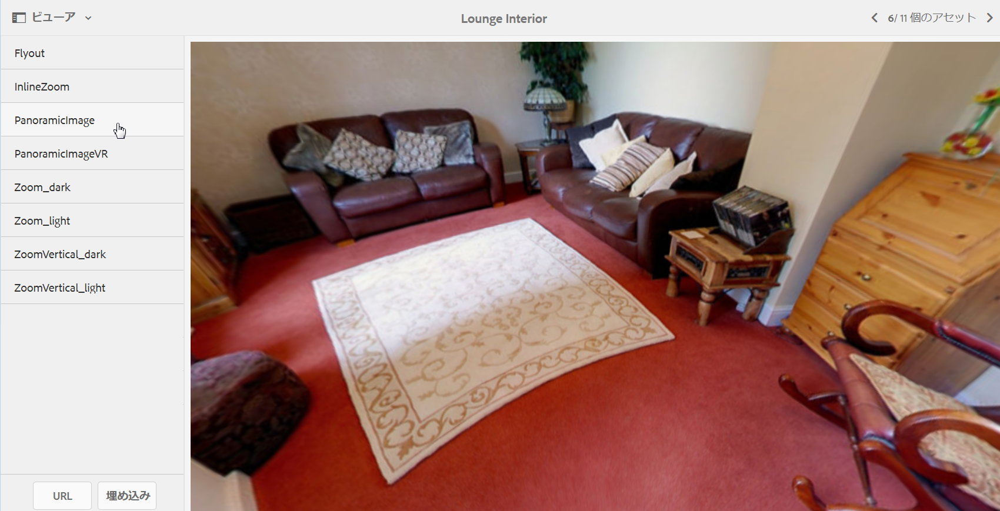

# パノラマ画像{#panoramic-images}

ここでは、パノラマ画像ビューアを使用して球パノラマ画像をレンダリングし、室内、物件、場所、風景などをあらゆる角度から見ることができる臨場感あふれる体験を提供する方法について説明します。

[ビューアプリセットの管理](/help/assets/managing-viewer-presets.md)も参照してください。

## パノラマ画像ビューアで使用するアセットのアップロード {#uploading-assets-for-use-with-the-panoramic-image-viewer}

アップロードするアセットが、パノラマ画像ビューアで使用する球パノラマ画像として適格となるには、アセットが以下の一方または両方の条件を満たしている必要があります。

* 縦横比が 2 である必要があります。次の場所で、CRXDE Liteのデフォルトの縦横比設定である2を上書きできます。
   `/conf/global/settings/cloudconfigs/dmscene7/jcr:content`

* キーワード `equirectangular`、または `spherical` と `panorama`、または `spherical` と `panoramic` でタグ付けされている必要があります。[タグの使用](/help/sites-authoring/tags.md)を参照してください。

縦横比とキーワードの両方の条件が、アセットの詳細ページと `Panoramic Media` WCM コンポーネントのパノラマアセットに適用されます。

パノラマ画像ビューアで使用するアセットをアップロードするには、[アセットのアップロード](/help/assets/manage-assets.md#uploading-assets)を参照してください。

## Dynamic Media Classic（Scene7）の設定  {#configuring-dynamic-media-classic-scene}

パノラマ画像ビューアが AEM 内で正しく機能するには、パノラマ画像ビューアプリセットが JCR で更新されるように、ビューアプリセットを Dynamic Media Classic（Scene7）および Dynamic Media Classic（Scene7）固有のメタデータと同期する必要があります。そのためには、Dynamic Media Classic（Scene7）を次のように設定します。

1. 各会社アカウントの [Dynamic Media Classic（Scene7）のインスタンスにログイン](https://www.adobe.com/jp/marketing/experience-manager/scene7-login.html)します。

1. ページの右上隅近くにある、**[!UICONTROL 設定/アプリケーション設定/公開設定/Image Serverをクリックします。]**
1. Image Server公開ページの上部近くにある&#x200B;**[!UICONTROL 公開コンテキスト]**&#x200B;ドロップダウンメニューで、「**[!UICONTROL 画像サービング]**」を選択します。

1. 同じImage Server公開ページで、「**[!UICONTROL Request Attributes.]**」という見出しを探します。
1. 「要求属性」の見出しの下で、「**[!UICONTROL 返信画像のサイズ制限」を探します。]** 次に、関連する「幅」と「高さ」フィールドで、パノラマ画像に使用できる最大画像サイズを大きくします。

   Dynamic Media Classic（Scene7）には、25,000,000 ピクセルという制限があります。縦横比が2:1の画像で許可される最大サイズは7000 x 3500です。 ただし、通常のデスクトップ画面の場合、4096 x 2048 ピクセルで十分です。

   >[!NOTE]
   >
   >許容される最大画像サイズ以内の画像のみがサポートされます。サイズ制限を超える画像を要求すると、403 応答が生成されます。

1. 「要求属性」の見出しの下で、次の操作をおこないます。

   * リクエストの不明化モードを&#x200B;**[!UICONTROL 無効に設定します。]**
   * Request Locking Modeを&#x200B;**[!UICONTROL Disabledに設定します。]**

   これらの設定は、AEMで`Panoramic Media` WCMコンポーネントを使用する場合に必要です。

1. Image Server公開ページの下部の左側で、「**[!UICONTROL 保存]**」をクリックします。

1. 右下隅の「**[!UICONTROL 閉じる」をクリックします。]**

### パノラマメディア WCM コンポーネントのトラブルシューティング {#troubleshooting-the-panoramic-media-wcm-component}

WCM でパノラマメディアコンポーネントに画像をドロップしたときに、コンポーネントプレースホルダーが壊れた場合、以下のトラブルシューティングをおこなってください。

* 403 Forbidden エラーが発生する場合は、要求された画像のサイズが大きすぎることが原因となっている可能性があります。[Dynamic Media Classic（Scene7）の設定](/help/assets/panoramic-images.md#configuring-dynamic-media-classic-scene)でおこなった「**[!UICONTROL 返信画像のサイズ制限]**」の設定を確認します。

* アセットの「無効なロック」やページに表示される「解析エラー」については、「要求難読化モード」と「要求ロックモード」が無効になっていることを確認します。
* キャンバスが汚染されているというエラーについては、ルールセット定義ファイルのパスを設定し、画像アセットについて以前の要求の CDN を無効にします。
* サポートされている制限を超えるサイズの画像を要求した後に画質が大幅に低下した場合は、**[!UICONTROL JPEG エンコード属性／画質]**&#x200B;の設定が空でないことを確認します。**[!UICONTROL クォリティ]**&#x200B;フィールドの一般的な設定は`95`です。 この設定は、Image Server 公開ページにあります。このページにアクセスするには、[ダイナミックメディアクラシック(Scene7)の設定](/help/assets/panoramic-images.md#configuring-dynamic-media-classic-scene)を参照してください。

## パノラマ画像のプレビュー {#previewing-panoramic-images}

詳しくは、[アセットのプレビュー](/help/assets/previewing-assets.md)を参照してください。

## パノラマ画像の公開  {#publishing-panoramic-images}

[アセットの公開](/help/assets/publishing-dynamicmedia-assets.md)を参照してください。
