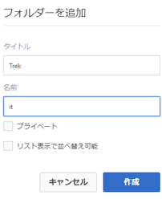
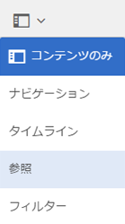
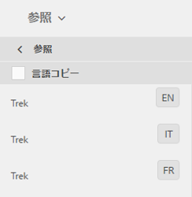

# 翻訳するアセットの準備 {#preparing-assets-for-translation}

多言語アセットとは、複数の言語のバイナリ、メタデータ、タグを含むアセットです。通常、アセットのバイナリ、メタデータ、タグに使用される言語は 1 つですが、多言語プロジェクト用に他の言語へと翻訳されます。

[!DNL Adobe Experience Manager Assets]では、多言語アセットがフォルダーに含まれ、各フォルダーには異なる言語のアセットが含まれています。

各言語のフォルダーは言語コピーと呼ばれます。言語コピーのルートフォルダー（言語ルート）が、言語コピー内のコンテンツの言語を識別します。例えば、*/content/dam/it*&#x200B;はイタリア語コピーのイタリア語ルートです。 ソースアセットの翻訳の実行時に適切な言語がターゲットになるように、言語コピーは、[正しく設定された言語ルート](preparing-assets-for-translation.md#creating-a-language-root)を使用する必要があります。

最初にアセットを追加した言語コピーが言語プライマリです。言語プライマリは、他の言語に翻訳されるソースです。サンプルフォルダー階層にはいくつかの言語ルートが含まれています。

```shell
/content
    /- dam
        |- en
        |- fr
        |- de
        |- es
        |- it
        |- ja
        |- zh
```

翻訳するアセットを準備するには、次の手順を実行します。

1. 言語プライマリの言語ルートを作成します。例えば、サンプルフォルダー階層の英語言語コピーの言語ルートは `/content/dam/en` です。[言語ルートの作成](preparing-assets-for-translation.md#creating-a-language-root)の情報に従って言語ルートが正しく設定されていることを確認します。

1. 言語プライマリにアセットを追加します。
1. 言語コピーが必要な各ターゲット言語の言語ルートを作成します。

## 言語ルート{#creating-a-language-root}の作成

言語ルートを作成するには、フォルダーを作成し、「名前」プロパティの値として ISO 言語コードを使用します。言語ルートを作成したら、言語ルート内の任意のレベルに言語コピーを作成できます。

例えば、サンプル階層のイタリア語言語コピーのルートページの「名前」プロパティは `it` になります。Nameプロパティは、リポジトリ内のアセットノードの名前として使用されるので、アセットのパスを決定します。(`https://[aem_server]:[port]/assets.html/content/dam/it/`)。

1. [!DNL Assets]コンソールで、「**[!UICONTROL 作成]**」をクリックし、メニューから「**[!UICONTROL フォルダー]**」を選択します。

   

1. 「**[!UICONTROL 名前]**」フィールドに、`<language-code>`の形式で国コードを入力します。

   

1. 「**[!UICONTROL 作成]**」をクリックします。言語ルートは[!DNL Assets]コンソールに作成されます。

## 言語ルートの表示 {#viewing-language-roots}

[!DNL Experience Manager] インターフェイスには、内で作成された言語ルートのリストを表示する **** 参照パネルが用意されて [!DNL Assets]います。

1. [!DNL Assets]コンソールで、言語コピーを作成する言語のプライマリを選択します。
1. 左側のレールから、「**[!UICONTROL 参照]**」オプションを選択して、[!UICONTROL 参照]ペインを開きます。

   

1. 「References」ペインで、「**[!UICONTROL Language Copies]**」をクリックします。 [!UICONTROL 言語コピー]パネルには、アセットの言語コピーが表示されます。

   
