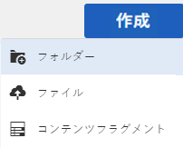
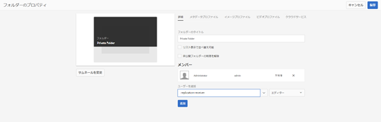
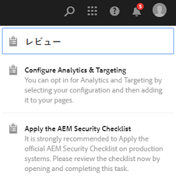
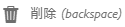

# プライベートフォルダー( [!DNL Adobe Experience Manager Assets] {#private-folder}

You can create a private folder in the [!DNL Adobe Experience Manager Assets] user interface that is available exclusively to you. このプライベートフォルダーを他のユーザーと共有し、他のユーザーに様々な権限を割り当てることができます。 ユーザーはフォルダーに対して、割り当てられた特権のレベルに応じた様々なタスク（フォルダー内のアセットの表示、アセットの編集など）を実行できます。

>[!NOTE]
>
>プライベートフォルダーには、所有者の役割を持つメンバが少なくとも1つ存在します。

## プライベートフォルダーの作成と共有 {#create-share-private-folder}

プライベートフォルダーを作成して共有するには：

1. In the [!DNL Assets] console, click **[!UICONTROL Create]** from the toolbar and then choose **[!UICONTROL Folder]** from the menu.

   

1. In the **[!UICONTROL Create Folder]** dialog, enter a title and name (optional) for the folder, and select **[!UICONTROL Private]** option.

1. 「 **[!UICONTROL 作成]**」をクリックします。プライベートフォルダーが作成されます。

   

1. To share the folder with other users and the assign privileges to them, select the folder, and click **[!UICONTROL Properties]** from the toolbar.

   

   >[!NOTE]
   >
   >フォルダーを共有するまで、他のユーザーにはフォルダーが表示されません。

1. In the **[!UICONTROL Folder Properties]** page, select a user from the **[!UICONTROL Add User]** list, assign a role to the user on your private folder, and click **[!UICONTROL Add]**.

   

   >[!NOTE]
   >
   >フォルダーを共有するユーザーに、各種役割（編集者、所有者、閲覧者など）を割り当てることができます。ユーザーに所有者の役割を割り当てると、ユーザーにフォルダーにエディター特権が付与されます。さらに、フォルダーを他のユーザーと共有できるようになります。編集者の役割を割り当てると、ユーザーがプライベートフォルダーのアセットを編集できるようになります。ビューアの役割を割り当てた場合、ユーザはプライベートフォルダ内のアセットの表示のみが可能です。

   >[!NOTE]
   >
   >プライベートフォルダーには、所有者の役割を持つメンバが少なくとも1つ存在します。 したがって、管理者はすべての所有者メンバーをプライベートフォルダーから削除することはできません。 ただし、既存の所有者（および管理者自体）をプライベートフォルダーから削除するには、管理者は別のユーザーを所有者として追加する必要があります。

1. 「**[!UICONTROL 保存]**」をクリックします。Depending on the role you assign, the user is assigned a set of privileges on your private folder when the user logs in to [!DNL Assets].
1. 「**[!UICONTROL OK]**」をクリックして、確認メッセージを閉じます。
1. フォルダーを共有するユーザーに対して、共有に関する通知が送信されます。Log in to [!DNL Assets] with the credentials of the user to view the notification.

   

1. 「通知」をクリックして、通知のリストを開きます。

   

1. 管理者が共有するプライベートフォルダーのエントリをクリックして、フォルダーを開きます。

>[!NOTE]
>
>To create a private folder, you require Read and Modify [access control permissions](/help/sites-administering/security.md#permissions-in-aem) on the parent folder under which you want to create a private folder. If you are not an administrator, these permissions are not enabled for you by default on `/content/dam`. この場合、プライベートフォルダーを作成する前に、ユーザーID/グループに対するこれらの権限を取得する必要があります。

## プライベートフォルダーの削除 {#delete-private-folder}

フォルダを削除するには、フォルダを選択して上部のメニューから「 [!UICONTROL 削除] 」オプションを選択するか、キーボードのBackspaceキーを使用します。

>[!CAUTION]
>
>プライベートCRXDE Liteーをフォルダーから削除すると、冗長なユーザーグループがリポジトリに残ります。

>[!NOTE]
>
>上記の方法を使用してユーザーインターフェイスからフォルダーを削除すると、関連付けられたユーザーグループも削除されます。
ただし、既存の冗長、未使用および自動生成されたユーザーグループは、 [JMXを使用してリポジトリからクリーンアップできます](#group-clean-up-jmx)。

### JMXを使用して、未使用のユーザーグループをクリーンアップします。 {#group-clean-up-jmx}

未使用のユーザー・グループのリポジトリをクリーンアップするには、次の手順に従います。

1. JMXを開き、オーサーインスタンス上のアセットの冗長なグループを [!DNL Experience Manager] 削除し `http://[server]:[port]/system/console/jmx/com.day.cq.dam.core.impl.team%3Atype%3DClean+redundant+groups+for+Assets`ます。
例： `http://no1010042068039.corp.adobe.com:4502/system/console/jmx/com.day.cq.dam.core.impl.team%3Atype%3DClean+redundant+groups+for+Assets`

1. このJMXから `clean` メソッドを呼び出します。

すべての冗長なユーザーグループまたは自動生成されたグループ（以前に削除したグループと同じ名前のフォルダーを作成したときに作成される）が、パスから削除されることが確認でき `/home/groups/mac/default/<user_name>/<folder_name>`ます。
