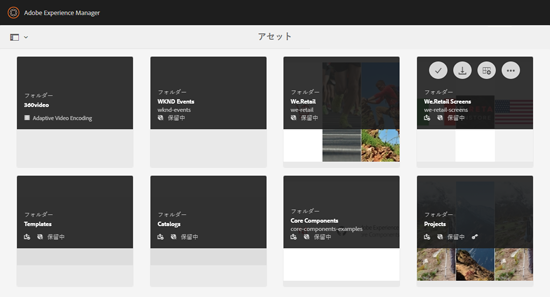

# [!DNL Adobe Experience Manager Assets] {#private-folder}のプライベートフォルダー

[!DNL Adobe Experience Manager Assets]ユーザーインターフェイスに専用のプライベートフォルダーを作成できます。 このプライベートフォルダーを他のユーザーと共有し、他のユーザーに様々な権限を割り当てることができます。 ユーザーはフォルダーに対して、割り当てられた特権のレベルに応じた様々なタスク（フォルダー内のアセットの表示、アセットの編集など）を実行できます。

>[!NOTE]
>
>プライベートフォルダーには、所有者の役割を持つメンバが少なくとも1つ存在します。

## プライベートフォルダーの作成と共有{#create-share-private-folder}

プライベートフォルダーを作成して共有するには：

1. [!DNL Assets]コンソールで、ツールバーの「**[!UICONTROL 作成]**」をクリックし、メニューから「**[!UICONTROL フォルダー]**」を選択します。

   

1. **[!UICONTROL フォルダーを作成]**&#x200B;ダイアログで、フォルダーのタイトルと名前（オプション）を入力し、**[!UICONTROL プライベート]**&#x200B;オプションを選択します。

1. 「**[!UICONTROL 作成]**」をクリックします。プライベートフォルダーが作成されます。

   

1. フォルダーを他のユーザーと共有し、他のユーザーに権限を割り当てるには、フォルダーを選択し、ツールバーの「**[!UICONTROL プロパティ]**」をクリックします。

   

   >[!NOTE]
   >
   >フォルダーを共有するまで、他のユーザーにはフォルダーが表示されません。

1. **[!UICONTROL フォルダーのプロパティ]**&#x200B;ページで、**[!UICONTROL ユーザー追加]**&#x200B;リストからユーザーを選択し、プライベートフォルダーのユーザーにロールを割り当てて、**[!UICONTROL 追加]**&#x200B;をクリックします。

   

   >[!NOTE]
   >
   >`Editor`、`Owner`、`Viewer`など、様々な役割を、フォルダーを共有するユーザーに割り当てることができます。 ユーザーに`Owner`ロールを割り当てると、そのユーザーは`Editor`権限を持ちます。 さらに、フォルダーを他のユーザーと共有できるようになります。`Editor`ロールを割り当てると、ユーザーはプライベートフォルダー内のアセットを編集できます。 ビューアの役割を割り当てた場合、ユーザはプライベートフォルダ内のアセットの表示のみが可能です。

   >[!NOTE]
   >
   >プライベートフォルダーには、`Owner`役割を持つ1つ以上のメンバーがあります。 したがって、管理者はすべての所有者メンバーをプライベートフォルダーから削除することはできません。 ただし、既存の所有者（および管理者自体）をプライベートフォルダーから削除するには、管理者は別のユーザーを所有者として追加する必要があります。

1. 「**[!UICONTROL 保存]**」をクリックします。割り当てる役割に応じて、ユーザーが[!DNL Assets]にログインすると、プライベートフォルダーの権限のセットがユーザーに割り当てられます。
1. 「**[!UICONTROL OK]**」をクリックして、確認メッセージを閉じます。
1. フォルダーを共有するユーザーに対して、共有に関する通知が送信されます。ユーザーの資格情報を使用して[!DNL Assets]にログインし、通知を表示します。

   

1. 「[!UICONTROL 通知]」をクリックして、通知のリストを開きます。

   

1. 管理者が共有するプライベートフォルダーのエントリをクリックして、フォルダーを開きます。

>[!NOTE]
>
>プライベートフォルダーを作成するには、プライベートフォルダーを作成する親フォルダーの[アクセス制御ーの読み取りと変更の権限](/help/sites-administering/security.md#permissions-in-aem)が必要です。 管理者でない場合、これらの権限はデフォルトで`/content/dam`に対して有効になっていません。 この場合、プライベートフォルダーを作成する前に、ユーザーID/グループに対するこれらの権限を取得する必要があります。

## プライベートフォルダーの削除{#delete-private-folder}

フォルダーを削除するには、フォルダーを選択し、上部のメニューから「を削除」オプションを選択するか、キーボードのBackspaceキーを使用します。

>[!CAUTION]
>
>プライベートCRXDE Liteーをフォルダーから削除すると、冗長なユーザーグループがリポジトリに残ります。

>[!NOTE]
>
>上記の方法を使用してユーザーインターフェイスからフォルダーを削除すると、関連付けられたユーザーグループも削除されます。
>
>ただし、既存の冗長、未使用および自動生成ユーザーグループは、作成者インスタンス(`http://[server]:[port]/system/console/jmx/com.day.cq.dam.core.impl.team%3Atype%3DClean+redundant+groups+for+Assets`)のJMXの`clean`メソッドを使用して、リポジトリから削除できます。
