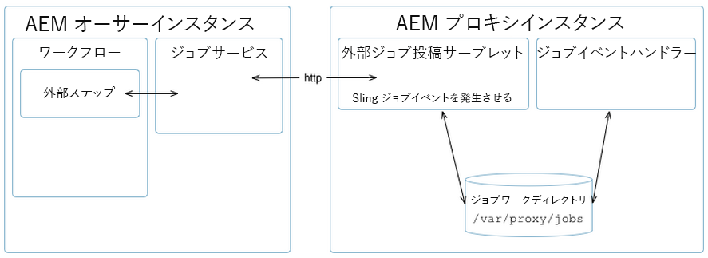

# Assets proxy development {#assets-proxy-development}

Adobe Experience Manager（AEM）Assets では、プロキシを使用して、特定のタスクの処理を分散させます。

プロキシは、ジョブの処理および結果の作成を担当するプロセッサーとしてプロキシワーカーを使用する特定の（場合によっては個別の）AEM インスタンスです。プロキシワーカーは、幅広いタスクに使用できます。AEM Assetsプロキシの場合は、AEM Assets内でレンダリングするアセットを読み込むために使用できます。 例えば、[IDS プロキシワーカー](indesign.md)は、InDesign Server を使用して、AEM Assets 内で使用できるようにファイルを処理します。

プロキシが個別の AEM インスタンスである場合は、AEM オーサリングインスタンスの負荷の軽減に役立ちます。デフォルトでは、AEM Assetsは同じJVM（プロキシを介して外部化）でアセット処理タスクを実行し、AEMオーサリングインスタンスの負荷を軽減します。

## Proxy (HTTP Access) {#proxy-http-access}

A proxy is available via the HTTP Servlet when it is configured to accept processing jobs at: `/libs/dam/cloud/proxy`. このサーブレットは、POST されたパラメーターから Sling ジョブを作成します。作成されたジョブはプロキシのジョブキューに追加され、適切なプロキシワーカーに接続されます。

### サポートされている操作 {#supported-operations}

* `job`

   **要件**：パラメーター `jobevent` をシリアル化されたバリューマップとして設定する必要があります。This is used to create an `Event` for a job processor.

   **結果**：新しいジョブが追加されます。成功した場合、一意のジョブ ID が返されます。

```shell
curl -u admin:admin -F":operation=job" -F"someproperty=xxxxxxxxxxxx"
    -F"jobevent=serialized value map" http://localhost:4502/libs/dam/cloud/proxy
```

* `result`

   **要件**:パラメーターを設 `jobid` 定する必要があります。

   **結果**：ジョブプロセッサーによって作成されたノードの JSON 表現が返されます。

```shell
curl -u admin:admin -F":operation=result" -F"jobid=xxxxxxxxxxxx"
    http://localhost:4502   /libs/dam/cloud/proxy
```

* `resource`

   **要件**：パラメーター jobid を設定する必要があります。

   **結果**：指定されたジョブに関連付けられているリソースが返されます。

```shell
curl -u admin:admin -F":operation=resource" -F"jobid=xxxxxxxxxxxx"
    -F"resourcePath=something.pdf" http://localhost:4502/libs/dam/cloud/proxy
```

* `remove`

   **要件**：パラメーター jobid を設定する必要があります。

   **結果**：見つかった場合にジョブが削除されます。

```shell
curl -u admin:admin -F":operation=remove" -F"jobid=xxxxxxxxxxxx"
    http://localhost:4502/libs/dam/cloud/proxy
```

### プロキシワーカー {#proxy-worker}

プロキシワーカーは、ジョブの処理および結果の作成を担当するプロセッサーです。ワーカーはプロキシインスタンスにあり、プロキシワーカーとして認識されるには、[sling JobProcessor](https://sling.apache.org/site/eventing-and-jobs.html) を実装する必要があります。

>[!NOTE]
>
>ワーカーがプロキシワーカーとして認識されるには、[sling JobProcessor](https://sling.apache.org/site/eventing-and-jobs.html) を実装する必要があります。

### クライアント API {#client-api}

[`JobService`](https://helpx.adobe.com/experience-manager/6-5/sites/developing/using/reference-materials/javadoc/index.html) は、ジョブを作成および削除し、ジョブの結果を取得するためのメソッドを提供する OSGi サービスとして使用できます。このサービスのデフォルトの実装（`JobServiceImpl`）は、HTTP クライアントを使用して、リモートプロキシサーブレットと通信します。

API の使用例を以下に示します。

```xml
@Reference
 JobService proxyJobService;

 // to create a new job
 final Hashtable props = new Hashtable();
 props.put("someproperty", "some value");
 props.put(JobUtil.PROPERTY_JOB_TOPIC, "myworker/job"); // this is an identifier of the worker
 final String jobId = proxyJobService.addJob(props, new Asset[]{asset});

 // to check status (returns JobService.STATUS_FINISHED or JobService.STATUS_INPROGRESS)
 int status = proxyJobService.getStatus(jobId)

 // to get the result
 final String jsonString = proxyJobService.getResult(jobId);

 // to remove job and cleanup
 proxyJobService.removeJob(jobId);
```

### クラウドサービスの設定 {#cloud-service-configurations}

>[!NOTE]
>
>プロキシ API の参考ドキュメントは、[`com.day.cq.dam.api.proxy`](https://helpx.adobe.com/experience-manager/6-5/sites/developing/using/reference-materials/javadoc/com/day/cq/dam/api/proxy/package-summary.html) にあります。

Both proxy and proxy worker configurations are available via cloud services configurations as accessible from the AEM Assets **Tools** console or under `/etc/cloudservices/proxy`. 各プロキシワーカーは、ワーカー固有の設定の詳細( `/etc/cloudservices/proxy` 例：)の下にノードを追加する必要があ `/etc/cloudservices/proxy/workername`ります。

>[!NOTE]
>
>詳しくは、[InDesign Server プロキシワーカーの設定](indesign.md#configuring-the-proxy-worker-for-indesign-server)および[クラウドサービスの設定](../sites-developing/extending-cloud-config.md)を参照してください。

API の使用例を以下に示します。

```xml
@Reference(policy = ReferencePolicy.STATIC)
 ProxyConfig proxyConfig;

 // to get proxy config
 Configuration cloudConfig = proxyConfig.getConfiguration();
 final String value = cloudConfig.get("someProperty", "defaultValue");

 // to get worker config
 Configuration cloudConfig = proxyConfig.getConfiguration("workername");
 final String value = cloudConfig.get("someProperty", "defaultValue");
```

### カスタマイズしたプロキシワーカーの開発 {#developing-a-customized-proxy-worker}

[IDSプロキシワーカーは](indesign.md) 、Indesignアセットの処理をアウトソースするために、既に標準搭載されているAEM Assetsプロキシワーカーの例です。

独自のAEM Assetsプロキシワーカーを開発および設定して、AEM Assets処理ワーカーを送出およびアウトソースする特殊なワーカーを作成することもできます。

独自のカスタムプロキシワーカーを設定するには、以下を実行する必要があります。

* 以下を設定および実装します（Sling イベントを使用）。

   * カスタムジョブトピック
   * カスタムジョブイベントハンドラー

* 次に、JobService API を使用して以下を実行します。

   * プロキシへのカスタムジョブのディスパッチ
   * ジョブの管理

* ワークフローからプロキシを使用する場合は、WorkflowExternalProcess API および JobService API を使用して、カスタム外部手順を実装する必要があります。

以下の図および手順に、実行方法の詳細を示します。



>[!NOTE]
>
>以下の手順では、参照例として InDesign での該当項目を示しています。

1. [Sling ジョブ](https://sling.apache.org/site/eventing-and-jobs.html)が使用されるので、ユーザーの使用例向けにジョブトピックを定義する必要があります。

   例として、IDS プロキシワーカーの `IDSJob.IDS_EXTENDSCRIPT_JOB` を参照してください。

1. 外部手順を使用してイベントを呼び出し、それが終了するまで待機します。これは、ID をポーリングすることによって実行されます。新機能を実装する独自の手順を開発する必要があります。

   `WorkflowExternalProcess` を実装してから、JobService API およびジョブトピックを使用してジョブイベントを準備し、JobService（OSGi サービス）にディスパッチします。

   例として、IDS プロキシワーカーの `INDDMediaExtractProcess`.java を参照してください。

1. トピックのジョブハンドラーを実装します。特定のアクションを実行し、ワーカー実装と見なされるように、このハンドラーを開発する必要があります。

   例として、IDS プロキシワーカーの `IDSJobProcessor.java` を参照してください。

1. dam-commons の `ProxyUtil.java` を使用します。これにより、DAM プロキシを使用してジョブをワーカーにディスパッチできます。

>[!NOTE]
>
>AEM Assetsプロキシフレームワークでは、プールのメカニズムがすぐに使用できます。
>
>InDesign 統合によって、InDesign Server のプール（IDSPool）にアクセスできるようになります。このプールは、AEM Assetsプロキシフレームワークの一部ではなく、Indesign統合に固有のものです。

>[!NOTE]
>
>結果の同期：
>
>同じプロキシを使用するインスタンスが n 個ある場合、処理結果はプロキシに保持されます。クライアント（AEM オーサー）のジョブによって、ジョブ作成時にクライアントに指定されるものと同じ一意のジョブ ID を使用して結果がリクエストされます。プロキシでは、単にジョブを実行し、リクエストに備えて結果を準備しておくだけです。
