# Related assets {#related-assets}

Adobe Experience Manager (AEM)Assetsを使用すると、関連アセット機能を使用して、組織のニーズに基づいて手動でアセットを関連付けることができます。 例えば、ライセンスファイルを、類似のトピックのアセットまたは画像／ビデオに関連付けることができます。特定の共通属性を共有するアセットを関連付けることができます。この機能を使用して、アセット間にソース／派生関係を作成することもできます。例えば、INDD ファイルから生成した PDF ファイルがある場合、その PDF ファイルをソースの INDD ファイルに関連付けることができます。

この機能を使用すると、ベンダーや代理店と低解像度のPDFファイルやJPGファイルを共有し、高解像度のINDDファイルを要求された場合にのみ利用できるように柔軟に調整できます。

>[!NOTE] アセットの関連付けと関連付け解除を行えるのは、アセットの編集権限を持つユーザーだけです。
>

## Relate assets {#relating-assets}

1. From the AEM interface, open the **[!UICONTROL Properties]** page for an asset that you want to relate.

   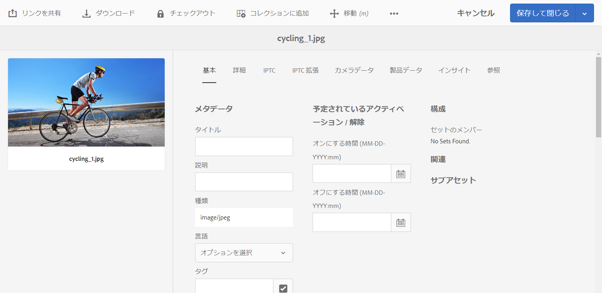

   *図：アセットを関連付けるアセットのプロパティページ*

   または、リスト表示からアセットを選択します。

   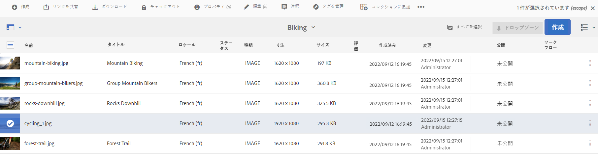

   コレクションからアセットを選択することもできます。

   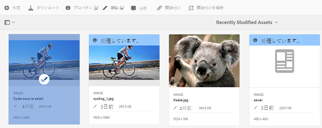

1. 選択したアセットに別のアセットを関連付けるには、ツールバーの「**[!UICONTROL 関連付け]**」アイコンをクリックまたはタップします。

   

1. 次のいずれかの操作をおこないます。

   * アセットのソースファイルを関連付けるには、リストから「**[!UICONTROL ソース]**」を選択します。
   * To relate a derived file, select **[!UICONTROL Derived]** from the list.
   * アセット間に双方向の関係を作成するには、リストから「**[!UICONTROL その他]**」を選択します。
   

1. **[!UICONTROL アセットを選択]**&#x200B;画面から、関連付けをおこなうアセットの場所に移動して、選択します。

   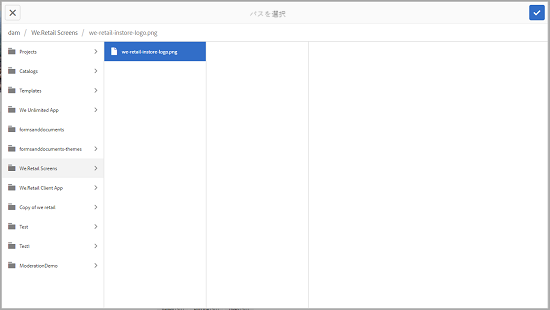

1. 「**[!UICONTROL 確認]**」アイコンをクリックまたはタップします。
1. Click/tap **[!UICONTROL OK]** to close the dialog. 手順 3 で選択した関係に応じて、関連付けられたアセットが「**[!UICONTROL 関連]**」セクションの適切なカテゴリーに表示されます。例えば、関連付けたアセットが現在のアセットのソースファイルの場合は、「**[!UICONTROL ソース]**」に表示されます。

   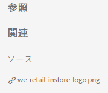

1. To un-relate an asset, click/tap **[!UICONTROL Unrelate]** from the toolbar.

   

1. Select the asset(s) you want to un-relate from the **[!UICONTROL Remove Relations]** dialog, and the click/tap **[!UICONTROL Unrelate]**.

   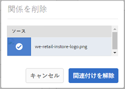

1. 「**[!UICONTROL OK]**」をクリックまたはタップして、ダイアログを閉じます。関係を削除したアセットは、「**[!UICONTROL 関連]**」セクションの関連付けられたアセットのリストから削除されます。

## 関連アセットの翻訳 {#translating-related-assets}

関連アセット機能を使用してアセット間でソース／派生関係を作成すると、翻訳ワークフローにも役立ちます。派生アセットで翻訳ワークフローを実行すると、AEM Assets は自動的にソースファイルが参照するすべてのアセットを取得し、翻訳用に組み込みます。このようにして、ソースアセットに参照されているアセットが、ソースおよび派生アセットとともに翻訳されます。例えば、以下のように英語のコピーに派生アセットおよびそのソースファイルが含まれている場合を考えてみます。

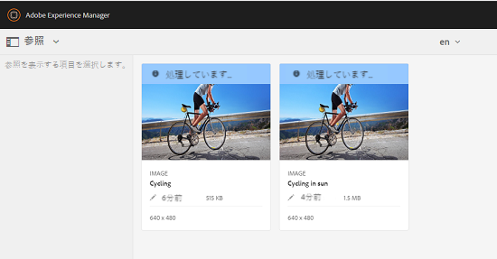

ソースファイルが別のアセットに関連付けられている場合、Experience Manager Assetsは参照されているアセットを取得し、翻訳用に含めます。

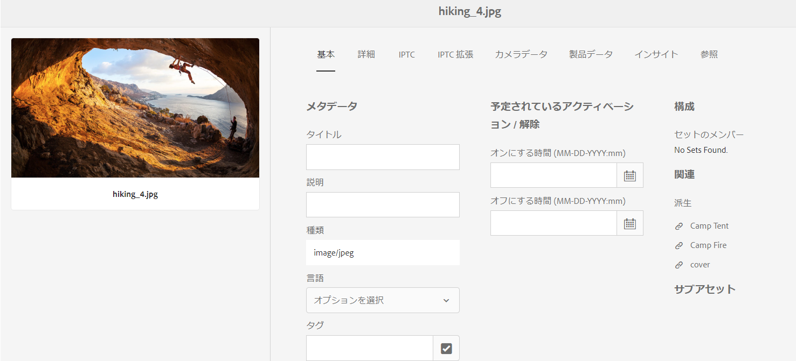

*図：翻訳に含める関連アセットのソースアセット*

1. [新しい翻訳プロジェクトを作成](translation-projects.md#create-a-new-translation-project)の手順に従って、ソースフォルダー内のアセットをターゲット言語に翻訳します。例えば、この場合はアセットをフランス語に翻訳します。

1. From the [!UICONTROL Projects] page, open the translation folder.

   

1. プロジェクトタイルをクリックまたはタップして詳細ページを開きます。

   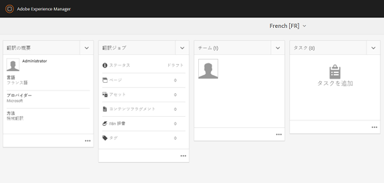

1. 「翻訳ジョブ」カードの下にある省略記号をクリックまたはタップして、翻訳ステータスを表示します。

   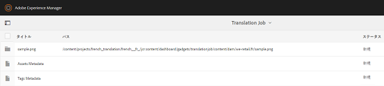

1. アセットを選択し、ツールバーの「**[!UICONTROL アセットで表示]**」をクリックまたはタップして、アセットの翻訳ステータスを表示します。

   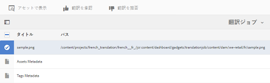

1. ソースに関連付けられているアセットが翻訳されているかどうかを確認するには、ソースアセットをクリックまたはタップします。

   

1. Select the asset that is related to the source, and then click/tap **[!UICONTROL Reveal in Assets]**. 翻訳された関連アセットが表示されます。

   
