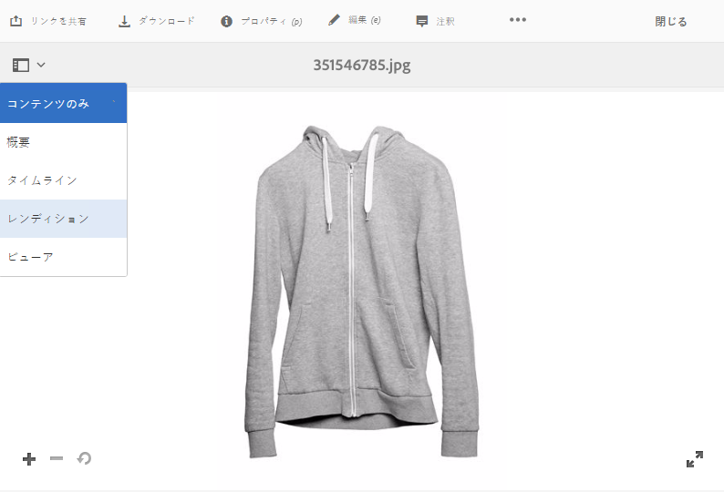
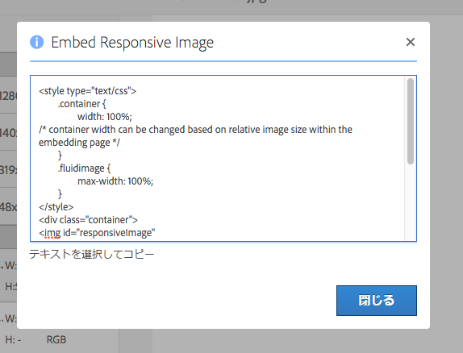

# レスポンシブサイト用に最適化された画像の配信 {#delivering-optimized-images-for-a-responsive-site}

レスポンシブサービング用のコードを Web 開発者と共有する場合は、レスポンシブコード機能を使用します。レスポンシブ（**[!UICONTROL RESS]**）コードをクリップボードにコピーして、Web 開発者と共有することができます。

この機能は、Web サイトがサードパーティの WCM で稼動する場合に有効です。ただし、Web サイトが AEM で稼動する場合は、オフサイトの Image Server が画像をレンダリングして Web ページに提供します。

[Web ページへのビデオビューアの埋め込み](embed-code.md)も参照してください。

[Web アプリケーションへの URL のリンク](linking-urls-to-yourwebapplication.md)も参照してください。

**レスポンシブサイトに最適化された画像を配信するには**：

1. レスポンシブコードを提供する画像の場所に移動して、ドロップダウンメニューで「**[!UICONTROL レンディション]**」をタップします。

   

1. レスポンシブ画像プリセットを選択します。「**[!UICONTROL URL]**」ボタンと「**[!UICONTROL RESS]**」ボタンが表示されます。

   

   >[!NOTE]
   >
   >「**[!UICONTROL URL]**」ボタンまたは「**[!UICONTROL RESS]**」ボタンを使用可能にするには、選択したアセット&#x200B;*と*&#x200B;選択した画像プリセットまたはビューアプリセットを公開する必要があります。
   >
   >ダイナミックメディア — ハイブリッドモードでは、画像プリセットを公開する必要があります。ダイナミックメディア —Scene7モードは、画像プリセットを自動的に公開します。

1. 「**[!UICONTROL RESS]**」をタップします。

   

1. **[!UICONTROL レスポンシブ画像を埋め込み]**&#x200B;ダイアログボックスで、レスポンシブコードテキストを選択してコピーし Web サイトに貼り付けて、レスポンシブアセットにアクセスします。
1. 埋め込みコード内でデフォルトのブレークポイントを編集して、コード内で直接、レスポンシブ Web サイトのブレークポイントに合わせます。また、異なるページのブレークポイントで、異なる解像度の画像が配信されることをテストします。

## HTTP/2 による Dynamic Media アセットの配信 {#using-http-to-delivery-your-dynamic-media-assets}

HTTP/2 は、ブラウザーとサーバーの交信を強化する、新しく更新された Web プロトコルです。このプロトコルを使用すれば、情報の伝送を高速化し、必要な処理能力を抑えることができます。Dynamic Media アセットの配信は HTTP/2 を使用しておこなうことができ、応答時間と読み込み時間を短縮できます。

Dynamic Media アカウントでの HTTP/2 の使用方法について詳しくは、[コンテンツの HTTP/2 配信](http2.md)を参照してください。
