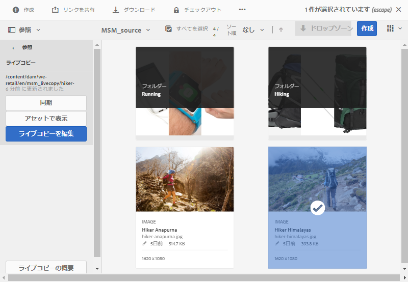

# MSM for を使用したアセットの再利用[!DNL Assets]{#reuse-assets-using-msm-for-assets}

Multi Site Manager (MSM) functionality in [!DNL Adobe Experience Manager] enables users to reuse content that is authored once and reused across multiple web-locations. The same is available for digital assets as MSM for [!DNL Assets] functionality. Using MSM for [!DNL Assets], you can:

* 一度アセットを作成した後、そのアセットのコピーを作成して、サイトの他の領域で再利用する。
* 複数のコピーを同期させ、元のプライマリ・コピーを1回更新して、変更内容を子コピーにプッシュします。
* 親アセットと子アセットの間のリンクを一時的または永続的に休止してローカルに変更をおこなう。

## 前提条件 {#configprereq}

To use MSM for [!DNL Assets], install at least Service Pack 1. 詳しくは、[リリースノート](/help/release-notes/sp-release-notes.md)を参照してください。

## 利点と概念の理解 {#concepts}

### 仕組みと利点 {#how-it-works-and-the-benefits}

複数の Web サイトで同じコンテンツ（テキストとアセット）を再利用するための使用シナリオを理解するには、[考えられる MSM シナリオ](/help/sites-administering/msm.md)を参照してください。[!DNL Experience Manager] では、元のアセットとそのリンクコピーとのリンクを維持します。このコピーはライブコピー（LC）と呼ばれます。リンクが維持されるので、変更を一元化して、多くのライブコピーにプッシュすることができます。これにより、重複コピー管理の制限をなくしつつ、更新を迅速化することができます。変更の伝播はエラーがなく、一元化されています。この機能により、選択した一部のライブコピーに限定した更新も可能になります。ユーザは、リンクのデタッチ、つまり継承の中断、および次回のプライマリコピーの更新時に上書きされないローカル編集を行って、変更をロールアウトできます。 分離は、選択した一部のメタデータフィールドまたはアセット全体に対しておこなうことができます。これにより、元々プライマリコピーから継承されたアセットをローカルで更新する柔軟性が得られます。

MSM では、ソースアセットとそのライブコピーとのライブ関係を次の目的で維持します。

* ソースアセットの変更がライブコピーにも適用（ロールアウト）されます。つまり、ライブコピーはソースと同期しています。
* ライブ関係を休止してライブコピーを更新することも、一部の限られたフィールドについて継承を解除することもできます。ソースに対する変更はライブコピーに適用されなくなります。

### Glossary of MSM for [!DNL Assets] terms {#glossary}

**ソース：** 元のアセットまたはフォルダー。 ライブコピーの派生元となるプライマリコピー。

**ライブコピー：** ソースと同期しているソースアセット/フォルダーのコピー。 ライブコピーは、さらに別のライブコピーのソースになることができます。LC の作成方法を参照してください。

**継承：** ライブコピーのアセット/フォルダーと、システムが更新の送信先を記憶するために使用するソースとの間のリンク/参照。 メタデータフィールドの継承は詳細なレベルで存在します。ソースとそのライブコピーとのライブ関係を維持しながら、一部のメタデータフィールドの継承を解除することができます。

**ロールアウト：** ソースに対して行われた変更を、そのソースのライブコピーの下流にプッシュするアクション。 ロールアウトアクションを使用して、一度に 1 つ以上のライブコピーを更新することができます。ロールアウトを参照してください。

**ロールアウト設定：** どのプロパティがどのような場合、どのように、どのような場合に同期されるかを決定するルール。 これらの設定はライブコピーの作成時に適用され、後で編集できます。子は親アセットからロールアウト設定を継承できます。For MSM for [!DNL Assets], use only the Standard rollout config. The other rollout configurations are not available for MSM for [!DNL Assets].

**同期：** 展開に加えて、更新をソースからライブコピーに送信することで、ソースとライブコピーの間でパリティを持たせるもう1つのアクションがあります。 同期は特定のライブコピーに対して開始され、このアクションでソースから変更内容が取得されます。このアクションを使用すると、ライブコピーのいずれか 1 つだけを更新することができます。同期アクションを参照してください。

**休止：** ライブコピーとソースアセット/フォルダー間のライブ関係を一時的に削除します。 関係は再開できます。休止アクションを参照してください。

**再開：** ライブリレーションシップを再開し、ライブコピーを再び開始がソースから更新を受け取るようにします。 再開アクションを参照してください。

**リセット：** リセット操作は、ローカルの変更を上書きしてライブコピーを再びソースのレプリカにします。 また、継承のキャンセルを解除し、すべてのメタデータフィールドに対して継承をリセットします。後でローカルに変更を加えるには、特定のフィールドの継承を再びキャンセルする必要があります。LC に対するローカルの変更を参照してください。

**デタッチ：** ライブコピーのアセット/フォルダーのライブリレーションシップを取り消しできません。 分離アクションの後、ライブコピーはソースから更新内容を受け取ることができなくなり、ライブコピーではなくなります。関係の解除を参照してください。

## アセットのライブコピーの作成 {#createlc}

1 つ以上のソースアセットまたはフォルダーからライブコピーを作成するには、次のいずれかを実行します。

* Method 1: Select the source assets and click **[!UICONTROL Create]** > **[!UICONTROL Live Copy]** from toolbar at the top.
* Method 2: In [!DNL Experience Manager] user interface, click **[!UICONTROL Create]** > **[!UICONTROL Live Copy]** from upper-right corner of the interface.

アセットまたはフォルダーのライブコピーを 1 つずつ作成できます。それ自体がライブコピーであるアセットまたはフォルダーから派生したライブコピーを作成できます。この使用例では、コンテンツフラグメント（CF）はサポートされていません。ライブコピーを作成しようとすると、CF は関係を除きそのままコピーされます。コピーされた CF はある時点でのスナップショットであり、元の CF が更新されても更新されません。

最初の方法でライブコピーを作成するには、次の手順に従います。

1. ソースアセットまたはフォルダーを選択します。From the toolbar, click **[!UICONTROL Create]** > **[!UICONTROL Live Copy]**.

   

   *図：インター[!DNL Experience Manager]フェイスからライブコピーを作成します。*

1. 保存先フォルダーを選択します。「**[!UICONTROL 次へ]**」をクリックします。
1. タイトルと名前を入力します。アセットには子はありません。フォルダーのライブコピーを作成する場合は、子を含めるか含めないかを選択できます。
1. ロールアウト設定を選択します。「**[!UICONTROL 作成]**」をクリックします。

2 番目の方法でライブコピーを作成するには、次の手順に従います。

1. In [!DNL Experience Manager] interface, from upper-right corner, click **[!UICONTROL Create]** > **[!UICONTROL Live Copy]**.

   

   *図：インター[!DNL Experience Manager]フェイスからライブコピーを作成します。*

1. ソースアセットまたはフォルダーを選択します。「**[!UICONTROL 次へ]**」をクリックします。
1. 保存先フォルダーを選択します。「**[!UICONTROL 次へ]**」をクリックします。
1. タイトルと名前を入力します。アセットには子はありません。フォルダーのライブコピーを作成する場合は、子を含めるか含めないかを選択できます。
1. ロールアウト設定を選択します。「**[!UICONTROL 作成]**」をクリックします。

>[!NOTE]
>
>ソースまたはライブコピーが移動されても、関係は保持されます。ライブコピーが削除されると、関係は解除されます。

## ソースおよびライブコピーの各種プロパティおよびステータスの表示 {#properties}

You can view the information and MSM-related statuses of live copy such as relationship, synchronization, rollouts, and more from the various areas of the [!DNL Experience Manager] user interface.

アセットとフォルダーに対しては次の 2 通りの方法があります。

* ライブコピーアセットを選択し、そのプロパティページで情報を確認します。
* Select source folder and find the detailed information of each live copy from the [!UICONTROL Live Copy Console].

>[!TIP]
>
>いくつかの個別のライブコピーのステータスを確認するには、最初にプロパティページを表示する方法を使用します。 多数のライブコピーのステータスを確認するには、第 2 の方法を使用します。つまり、**[!UICONTROL 関係ステータス]** ページを表示します。

### ライブコピーの情報とステータス {#statuslcasset}

ライブコピーアセットまたはフォルダーの情報とステータスを確認するには、次の手順に従います。

1. ライブコピーアセットまたはフォルダーを選択します。ツールバーの「**[!UICONTROL プロパティ]**」をクリックします。または、キーボードショートカット `p` を使用します。
1. 「**[!UICONTROL ライブコピー]**」をクリックします。ソースのパス、休止ステータス、同期ステータス、前回のロールアウト日、前回のロールアウトをおこなったユーザーを確認できます。

   

   *図：ライブコピーの情報とステータス。*

1. 子アセットがライブコピー設定を借用するかどうかを選択できます。

1. ライブコピーがロールアウト設定を親から継承するか、設定を変更するかを指定するオプションを選択できます。

### フォルダーのすべてのライブコピーの情報とステータス {#statuslcfolder}

[!DNL Experience Manager] には、ソースフォルダーの全ライブコピーのステータスを確認できるコンソールが用意されています。このコンソールには、すべての子アセットのステータスが表示されます。

1. ソースフォルダーを選択します。ツールバーの「**[!UICONTROL プロパティ]**」をクリックします。または、キーボードショートカット `p` を使用します。
1. 「**[!UICONTROL ライブコピーのソース]**」をクリックします。コンソールを開くには、「**[!UICONTROL ライブコピーの概要]**」をクリックします。このダッシュボードには、すべての子アセットの最上位ステータスが表示されます。

   

   *図：ライブコピーコンソール[!UICONTROL （ソース）でのライブコピーの表示ステータス]。*

1. ライブコピーフォルダー内の各アセットに関する詳細情報を表示するには、アセットを選択し、ツールバーの「**[!UICONTROL 関係ステータス]**」をクリックします。

   

   フォルダー内のライブコピー子アセットの詳細情報とステータス

>[!TIP]
>
>参照しすぎなくても、他のフォルダーのライブコピーのステータスをすばやく確認できます。 **[!UICONTROL ライブコピーの概要]**&#x200B;インターフェイスの上部中央にあるポップアップリストでフォルダーを変更するだけです。

### ソースの参照パネルのクイックアクション {#refrailsource}

ソースアセットまたはフォルダーの場合は、参照パネルから以下の情報を参照したり以下のアクションを直接実行したりできます。

* ライブコピーのパスを参照する。
* Open or reveal a specific live copy in [!DNL Experience Manager] user interface.
* 更新内容を特定のライブコピーに同期させる。
* 特定のライブコピーについて、関係を休止したりロールアウト設定を変更したりする。
* ライブコピーの概要コンソールにアクセスする。

ソースアセットまたはフォルダーを選択し、左側のパネルを開いて「**[!UICONTROL 参照]**」をクリックします。あるいは、アセットまたはフォルダーを選択し、キーボードショートカット `Alt + 4` を使用します。

*図：選択したソースの参照レールで使用できるアクションと情報です。*

特定のライブコピーの場合は、「**[!UICONTROL ライブコピーを編集]**」をクリックすると、関係を休止したり、ロールアウト設定を変更したりできます。

*図：特定のライブコピーの関係を中断するか、ロールアウト構成を変更します。*

### ライブコピーの参照パネルのクイックアクション {#refraillc}

ライブコピーアセットまたはフォルダーの場合は、参照パネルから以下の情報を参照したり以下のアクションを直接実行したりできます。

* ソースのパスを参照する。
* Open or reveal a specific live copy in [!DNL Experience Manager] user interface.
* 更新内容をロールアウトする。

ライブコピーアセットまたはフォルダーを選択し、左側のパネルを開いて「**[!UICONTROL 参照]**」をクリックします。あるいは、アセットまたはフォルダーを選択し、キーボードショートカット `Alt + 4` を使用します。

*図：選択したライブコピーの参照レールで使用できるアクション。*

## ソースからライブコピーへの変更の伝播 {#rolloutsync}

ソースが変更されると、同期アクションまたはロールアウトアクションを使用して、変更内容をライブコピーに伝播させることができます。両方のアクションの違いを理解するには、[用語集](#glossary)を参照してください。

### ロールアウトアクション {#rollout}

ソースアセットからロールアウトアクションを開始して、全部または選択した一部のライブコピーを更新できます。

1. ライブコピーアセットまたはフォルダーを選択します。ツールバーの「**[!UICONTROL プロパティ]**」をクリックします。または、キーボードショートカット `p` を使用します。
1. 「**[!UICONTROL ライブコピーのソース]**」をクリックします。上部のツールバーで「**[!UICONTROL ロールアウト]**」をクリックします。
1. 更新するライブコピーを選択します。「**[!UICONTROL ロールアウト]**」をクリックします。子アセットに対する更新内容をロールアウトするには、「**[!UICONTROL ソースとすべての子をロールアウト]**」をオンにします。

   

   *図：ソースの変更を数部またはすべてのライブコピーにロールアウトします。*

>[!NOTE]
>
>ソースアセットでおこなわれた変更は、直接関係するライブコピーにのみロールアウトされます。ライブコピーが別のライブコピーから派生したものである場合、派生したライブコピーには変更内容はロールアウトされません。

または、特定のライブコピーを選択した後で参照パネルからロールアウトアクションを開始することもできます。詳しくは、[ライブコピーの参照パネルのクイックアクション](#refraillc)を参照してください。このロールアウト方法では、選択したライブコピーとその子（任意指定）のみ更新されます。

*図：ソースの変更を選択したライブコピーにロールアウトします。*

### 同期アクションについて {#aboutsync}

同期アクションは、ソースの変更内容を取り込んで、選択したライブコピーにのみ適用します。同期アクションでは、継承のキャンセル後におこなわれたローカルの変更を尊重して維持します。ローカルの変更は上書きされず、キャンセルした継承も復元されません。同期アクションは 3 通りの方法で開始できます。

| Where in [!DNL Experience Manager] interface | 使用するタイミングと理由 | 使用方法 |
|---|---|---|
| [!UICONTROL 参照パネル] | ソースが既に選択されているときにすばやく同期させます。 | [ソースの参照パネルのクイックアクション](#refrailsource)を参照 |
| Toolbar in the [!UICONTROL Properties] page | ライブコピーのプロパティが既に開いているときに同期を開始します。 | [ライブコピーの同期](#synclc)を参照 |
| [!UICONTROL ライブコピーの概要コンソール] | Quickly synchronize multiple assets (not necessarily all) when source folder is selected or [!UICONTROL Live Copy Overview] console is already open. 同期アクションは一度に 1 つのアセットに対して開始されますが、複数のアセットの同期を一度に実行する手軽な方法です。 | [ライブコピーフォルダー内の多数のアセットに対するアクション](#bulkactions)を参照 |

### ライブコピーの同期 {#synclc}

同期アクションを開始するには、ライブコピーの&#x200B;**[!UICONTROL プロパティ]**&#x200B;ページを開き、「**[!UICONTROL ライブコピー]**」をクリックして、ツールバーで目的のアクションをクリックします。

同期アクションに関連するステータスと情報を確認するには、[ライブコピーの情報とステータス](#statuslcasset)および[フォルダーのすべてのライブコピーの情報とステータス](#statuslcfolder)を参照してください。

*図：同期アクションは、ソースに対して行われた変更を取り込みます。*

>[!NOTE]
>
>関係が休止されている場合は、ツールバーの同期アクションは使用できません。参照パネルでは同期アクションを使用できますが、ロールアウトが正常に完了しても変更内容は伝播しません。

## 関係の休止と再開 {#suspendresume}

関係を一時的に休止して、ソースアセットまたはフォルダーの変更内容をライブコピーが受け取らないようにすることができます。また、関係を再開して、ソースの変更内容の受け取りをライブコピーが再び開始するようにすることもできます。

関係を休止または再開するには、ライブコピーの&#x200B;**[!UICONTROL プロパティ]**&#x200B;ページを開き、「**[!UICONTROL ライブコピー]**」をクリックして、ツールバーで目的のアクションをクリックします。

または、**[!UICONTROL ライブコピーの概要]**&#x200B;コンソールから、ライブコピーフォルダー内の複数のアセットについて、関係をすばやく休止または再開することができます。[ライブコピーフォルダー内の多数のアセットに対するアクションの実行](#bulkactions)を参照してください。

## ライブコピーのローカル編集 {#localmods}

ライブコピーは、元のソースの作成時のレプリカです。ライブコピーのメタデータ値はソースから継承されます。メタデータフィールドでは、ソースアセットのそれぞれのフィールドについて継承を個別に維持します。

ただし、ライブコピーをローカルに変更して、一部の限定されたプロパティを変更する柔軟性があります。ローカルに変更するには、目的のプロパティの継承をキャンセルします。1 つ以上のメタデータフィールドの継承がキャンセルされても、アセットのライブ関係と他のメタデータフィールドの継承は保持されます。同期やロールアウトでローカルの変更内容が上書きされることはありません。To do so, open **[!UICONTROL Properties]** page of a live copy asset, click the **[!UICONTROL cancel inheritance]** option next to a metadata field.

ローカルの変更をすべて取り消して、アセットをソースの状態に戻すことができます。リセットアクションはローカルの変更をすべて完全かつ即座に無効にし、すべてのメタデータフィールドに関して継承を復元します。元に戻すには、ライブコピーアセットの&#x200B;**[!UICONTROL プロパティ]**&#x200B;ページでツールバーの「**[!UICONTROL リセット]**」クリックします。

*図：リセット操作はローカルの編集を上書きし、ライブコピーの一部をそのソースに移動します。*

## ライブ関係の解除 {#detach}

分離アクションを使用して、ソースとライブコピーとの関係を完全に解除できます。ライブコピーは、分離後、スタンドアロンのアセットまたはフォルダーになります。It is displayed as a new asset in [!DNL Experience Manager] interface, immediately after detaching. ライブコピーをソースから分離するには、次の手順に従います。

1. ライブコピーアセットまたはフォルダーを選択します。ツールバーの「**[!UICONTROL プロパティ]**」をクリックします。または、キーボードショートカット `p` を使用します。

1. 「**[!UICONTROL ライブコピー]**」をクリックします。ツールバーの「**[!UICONTROL 分離]**」をクリックします。表示されるダイアログで「**[!UICONTROL 分離]**」クリックします。

   

   *図：デタッチアクションは、ソースコピーとライブコピーの間の関係を完全に削除します。*

   >[!CAUTION]
   >
   >ダイアログで「**[!UICONTROL 分離]**」をクリックするとすぐに、関係が解除されます。プロパティページで「**[!UICONTROL キャンセル]**」をクリックしても、関係を元に戻すことはできません。

または、**[!UICONTROL ライブコピーの概要]**&#x200B;コンソールでライブコピーフォルダー内の複数のアセットをすばやく分離することができます。[ライブコピーフォルダー内の多数のアセットに対するアクションの実行](#bulkactions)を参照してください。

## ライブコピーフォルダー内の多数のアセットに対するアクションの実行 {#bulkactions}

ライブコピーフォルダーに複数のアセットがある場合、アセットごとにアクションを開始するのは面倒なことがあります。You can quickly initiate the basic actions on many assets from [!UICONTROL Live Copy Console]. 上記の方法は、個々のアセットに対して引き続き機能します。

1. ソースフォルダーを選択します。ツールバーの「**[!UICONTROL プロパティ]**」をクリックします。または、キーボードショートカット `p` を使用します。
1. 「**[!UICONTROL ライブコピーのソース]**」をクリックします。コンソールを開くには、「**[!UICONTROL ライブコピーの概要]**」をクリックします。
1. このダッシュボードで、ライブコピーフォルダーからライブコピーアセットを選択します。ツールバーで目的のアクションをクリックします。使用可能なアクションは、**[!UICONTROL 同期]**、**[!UICONTROL リセット]**、**[!UICONTROL 休止]**、**[!UICONTROL 分離]**&#x200B;です。選択したソースフォルダーとライブ関係にある任意の数のライブコピーフォルダーに含まれている任意のアセットに対して、これらの操作をすばやく開始できます。

   

   *図：ライブコピーフォルダー内の多数のアセットを、[!UICONTROL ライブコピーの概要](Live Copy Overview)コンソールから簡単に更新できます。*

## Extend MSM for [!DNL Assets] {#extendapi}

[!DNL Experience Manager] では、MSM Java API を使用して機能を拡張することができます。For [!DNL Assets], the extending works just the same as it works with MSM for [!DNL Sites]. 詳しくは、[MSM の拡張](/help/sites-developing/extending-msm.md)を参照してください。具体的な作業については、以下を参照してください。

* [Java API の概要](/help/sites-developing/extending-msm.md#overview-of-the-java-api)
* [新しい同期アクションの作成](/help/sites-developing/extending-msm.md#creating-a-new-synchronization-action)
* [新しいロールアウト設定の作成](/help/sites-developing/extending-msm.md#creating-a-new-rollout-configuration)
* [シンプルな LiveActionFactory クラスの作成と使用](/help/sites-developing/extending-msm.md#creating-and-using-a-simple-liveactionfactory-class)

>[!NOTE]
>
>* Blueprint in MSM for [!DNL Sites] is called Live Copy source in MSM for [!DNL Assets].
>* Removing the chapters step in the create site wizard is not supported in MSM for [!DNL Assets].
>* Configuring MSM locks, on the page properties (Touch-enabled UI), is not supported in MSM for [!DNL Assets].

## ライブコピーに対するアセット管理タスクの影響 {#manageassets}

ライブコピーとソースは、ある程度までデジタルアセットとして管理できるアセットまたはフォルダーです。Some asset management tasks in [!DNL Experience Manager] have a specific impact on the live copies.

* ライブコピーをコピーすると、最初のライブコピーと同じソースのライブコピーアセットが作成されます。
* ソースまたはソースのライブコピーを移動しても、ライブ関係は保持されます。
* 編集アクションはライブコピーアセットには機能しません。ライブコピーのソース自体がライブコピーである場合、編集アクションはそのソースには機能しません。
* チェックアウトアクションはライブコピーアセットには使用できません。
* ソースフォルダーの場合は、レビュータスクを作成するオプションが使用可能です。
* アセットリストをリスト表示および列表示で表示する場合、ライブコピーアセットまたはフォルダーには「ライブコピー」と表示されます。これにより、フォルダー内のライブコピーを識別しやすくなります。

## Compare MSM for [!DNL Assets] and [!DNL Sites] {#comparison}

In more scenarios, MSM for [!DNL Assets] matches the behavior of MSM for Sites functionality. 注意すべき重要な違いは次のとおりです。

* Blueprint in MSM for [!DNL Sites] is called Live Copy source in MSM for [!DNL Assets].
* In Sites, you can compare a blueprint and its live copy but it is not possible in [!DNL Assets] to compare a source to its live copy.
* You cannot edit a live copy in [!DNL Assets].
* Sites usually have children, but [!DNL Assets] do not. 個々のアセットのライブコピーを作成する際に、子を含めるか含めないかを選択するオプションはありません。
* Removing the chapters step in the create site wizard is not supported in MSM for [!DNL Assets].
* Configuring MSM locks on page properties (Touch-enabled UI) is not supported in MSM for [!DNL Assets].
* For MSM for [!DNL Assets], use only the **[!UICONTROL Standard rollout config]**. The other rollout configurations are not available for MSM for [!DNL Assets].

## ベストプラクティス {#bestpractices}

MSM のベストプラクティスの一部を次に示します。

* 実装を開始する前に、アセットとコンテンツフローの親子関係を計画します。

## MSM for の制限事項と既知の問題 [!DNL Assets] {#limitations}

Following is a limitation of MSM for [!DNL Assets].

* この使用例では、コンテンツフラグメント（CF）はサポートされていません。ライブコピーを作成しようとすると、CF は関係を除きそのままコピーされます。コピーされた CF はある時点でのスナップショットであり、元の CF が更新されても更新されません。
