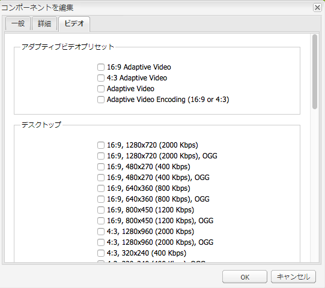
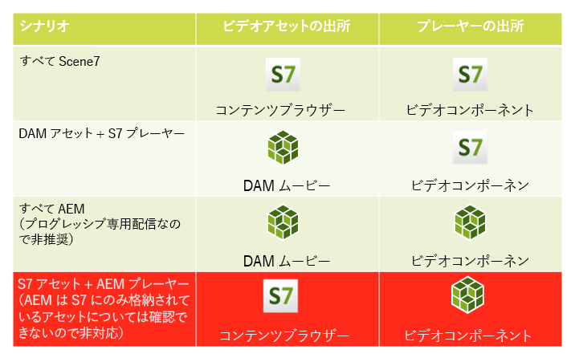
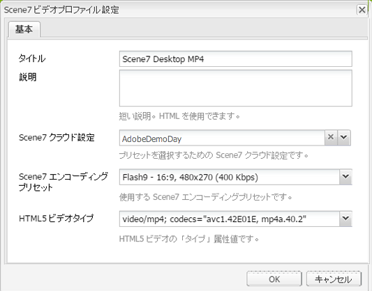

# ビデオ {#video}

アセットを使用すると、ビデオアセット管理を一元化できます。この機能を使用して、ビデオをDynamic Media Classic(Scene7)に自動エンコードするためにアセットに直接アップロードし、アセットから直接Dynamic Media Classicビデオにアクセスしてページを作成できます。

Dynamic Media Classicビデオの統合により、最適化されたビデオの提供先がすべての画面（自動デバイスおよび帯域幅検出）に拡張されます。

* The **[!UICONTROL Scene7 Video]** component automatically performs device and bandwidth detection to play the right format and right quality video across desktop, tablets and mobile.
* Assets - You can include adaptive video sets rather than only single video assets. An adaptive video set is a container for all video renditions required to playback video seamlessly across multiple screens. An Adaptive Video Set groups versions of the same video that are encoded at different bit rates and formats such as 400 kbps, 800 kbps, and 1000 kbps. You use an Adaptive Video Set, along with S7 video component, for adaptive video streaming across multiple screens including desktop, iOS, Android, Blackberry, and Windows mobile devices. See [Scene7 documentation about adaptive video sets for more information](https://help.adobe.com/en_US/scene7/using/WS53492AE1-6029-45d8-BF80-F4B5CF33EB08.html).

## FFMPEGとDynamic Media Classicについて {#about-ffmpeg-and-scene}

デフォルトのビデオエンコーディングプロセスは、ビデオプロファイルとの FFMPEG ベースの統合の使用に基づいています。そのため、組み込みの DAM 収集ワークフローには、ffmpeg ベースの次の 2 つのワークフローのステップが含まれています。

* FFMPEG のサムネール
* FFMPEG エンコーディング

Dynamic Media Classic統合の有効化と設定を行っても、これら2つのワークフロー手順は、設定済みのDAMインジェストワークフローから自動的に削除または非アクティブ化されません。 FFMPEG ベースのビデオエンコーディングを既に AEM で使用している場合は、オーサリング環境に FFMPEG がインストールされている可能性があります。この場合、DAMを使用して取り込む新しいビデオは2回エンコードされます。をFFMPEGエンコーダーから、またはDynamic Media Classic統合から1回呼び出します。

AEM で FFMPEG ベースのビデオエンコーディングが設定済みで、FFMPEG がインストールされている場合は、2 つの FFMPEG ワークフローを DAM 収集ワークフローから削除することをお勧めします。

## サポートされるファイル形式 {#supported-formats}

Scene7 ビデオコンポーネントでは次の形式がサポートされます。

* F4V H.264
* MP4 H.264

## ビデオのアップロード先の指定 {#deciding-where-to-upload-your-video}

ビデオアセットのアップロード先の指定は、次の条件によって決まります。

* ビデオアセットのワークフローが必要かどうか
* ビデオアセットのバージョン管理が必要かどうか

これらの質問のいずれかまたは両方に対する回答が「はい」の場合は、ビデオをAdobeDAMに直接アップロードします。 両方の質問に対する答えが「いいえ」の場合は、ビデオを直接Dynamic Media Classicにアップロードします。 各シナリオのワークフローについて、次の節で説明します。

### ビデオを直接 Adobe DAM にアップロードする場合 {#if-you-are-uploading-your-video-directly-to-adobe-dam}

アセットのワークフローまたはバージョン管理が必要な場合は、まず Adobe DAM にアップロードする必要があります。推奨されるワークフローは次のとおりです。

1. ビデオアセットをAdobeDAMにアップロードし、自動的にエンコードしてDynamic Media Classicに公開します。
1. AEM の WCM（コンテンツファインダーの「**[!UICONTROL ムービー]**」タブ）で、ビデオアセットにアクセスします。
1. Author with **[!UICONTROL Scene7 Video]** or **[!UICONTROL Foundation Video]** component.

### ビデオを Scene7 にアップロードする場合 {#if-you-are-uploading-your-video-to-scene}

アセットのワークフローまたはバージョン管理が必要でない場合は、Scene7 にアセットをアップロードする必要があります。推奨されるワークフローは次のとおりです。

1. In Dynamic Media Classic, [set up a scheduled FTP uploading and encoding to Scene7 (system automated)](https://help.adobe.com/en_US/scene7/using/WS70B173EC-4CAD-4b4c-BF9C-43A11F3A5950.html).
1. AEM の WCM（コンテンツファインダーの「**[!UICONTROL Scene7]**」タブ）で、ビデオアセットにアクセスします。
1. Author with the **[!UICONTROL Scene7 Video]** component.

## Scene7 ビデオとの統合の設定 {#configuring-integration-with-scene-video}

ユニバーサルプリセットを設定するには：

1. **[!UICONTROL Cloud Servicesで]**、 **[!UICONTROL Scene7設定に移動し、「]****[!UICONTROL 編集」をクリックします。]**
1. 「**[!UICONTROL ビデオ]**」タブを選択します。

   

   >[!NOTE]
   >
   >クラウド設定がページにない場合は、「**[!UICONTROL ビデオ]**」タブが表示されません。

1. アダプティブビデオエンコーディングプロファイル、組み込みの単一のビデオエンコーディングプロファイルまたはカスタムビデオエンコーディングプロファイルを選択します。

   >[!NOTE]
   >
   >For more information about what the video presets mean, see the [Dynamic Media Classic documentation](https://help.adobe.com/en_US/scene7/using/WSE86ACF2B-BD50-4c48-A1D7-9CD4405B62D0.html).
   >
   >ユニバーサルプリセットを設定する際に両方のアダプティブビデオセットを選択するか、「**[!UICONTROL アダプティブビデオエンコーディング]**」オプションを選択することをお勧めします。

1. 選択したエンコーディングプロファイルは、この Scene7 クラウド設定用に指定した CQ DAM のターゲットフォルダーにアップロードされたすべてのビデオに自動的に適用されます。必要に応じて、別のターゲットフォルダーに別のエンコーディングプロファイルを適用することで、複数の Scene7 クラウド設定を指定できます。

## ビューアとエンコーディングプリセットの更新 {#updating-viewer-and-encoding-presets}

If you need to update the viewer and encoding presets for video in AEM because the presets have been updated in Scene7, navigate to the Scene7 configuration in the cloud configuration and click **[!UICONTROL Update the viewer and encoding presets.]**

## AdobeDAMからScene7にプライマリソースビデオをアップロード中 {#uploading-your-master-video}

1. Scene7 のエンコーディングプロファイルと共にクラウド設定を指定した CQ DAM のターゲットフォルダーに移動します。
1. 「 **[!UICONTROL アップロード]** 」をクリックして、プライマリソースビデオをアップロードします。 Video uploading and encoding is complete after the [!UICONTROL DAM Update Asset] workflow is complete and **[!UICONTROL Publish to Scene7]** has a checkmark.

   >[!NOTE]
   >
   >ビデオのサムネイルの生成にはある程度の時間がかかることがあります。

   Dragging the DAM primary source video on to the video component accesses *all* of the Scene7 encoded proxy renditions for delivery.

## 基盤ビデオコンポーネントと Scene7 ビデオコンポーネントの比較 {#foundation-video-component-versus-scene-video-component}

AEM を使用する場合は、サイトで使用可能なビデオコンポーネントと Scene7 ビデオコンポーネントの両方にアクセスします。これらのコンポーネントに互換性はありません。

Scene7 ビデオコンポーネントは、Scene7 ビデオでのみ使用できます。基盤コンポーネントは、AEM から保存された（ffmpeg を使用）ビデオと Scene7 ビデオで使用できます。

次の表は、どのコンポーネントをどのようなシナリオで使用すべきかを示しています。

>[!NOTE]
>
>既製の S7 ビデオコンポーネントはユニバーサルビデオプロファイルを使用します。ただし、Scene7で次のいずれかを実行すると、AEMで使用するHTML5ベースのビデオプレーヤーを取得できます。標準搭載のHTML5ビデオプレーヤーの埋め込みコードをコピーして、AEMページに配置します。

## AEM ビデオコンポーネント {#aem-video-component}

Scene7 のビデオを表示するには Scene7 のビデオコンポーネントを使用することが推奨されますが、ここでは、完全を期すために、AEM の基盤ビデオコンポーネントで Scene7 ビデオを使用する方法を説明します。

### AEM ビデオと Scene7 ビデオの比較 {#aem-video-and-scene-video-comparison}

次の表は、AEM 基盤ビデオコンポーネントと Scene7 ビデオコンポーネントでサポートされている機能の簡単な比較です。

|  | AEM 基盤ビデオ | Scene7 ビデオ |
|---|---|---|
| アプローチ | HTML5 における最優先のアプローチです。Flash は HTML5 以外のフォールバックでのみ使用されます。 | ほとんどのデスクトップでは Flash です。HTML5 はモバイルとタブレットで使用されます。 |
| 配信 | プログレッシブ | アダプティブストリーミング |
| 追跡 | はい | はい |
| 拡張性 | 可 | 対応（Scene7 ビューア SDK を使用） |
| モバイルビデオ | はい | Yes |

### 設定 {#setting-up}

#### ビデオプロファイルの作成 {#creating-video-profiles}

S7 クラウド設定で選択した S7 エンコーディングプリセットに応じて、様々なビデオエンコーディングが作成されます。基盤ビデオコンポーネントでそのエンコーディングを使用するには、選択した S7 エンコーディングプリセットごとにビデオプロファイルを作成する必要があります。これにより、対応する DAM レンディションをビデオコンポーネントで選択できます。

>[!NOTE]
>
>新しいビデオプロファイルおよびビデオプロファイルに対する変更をアクティベートして公開する必要があります。

1. AEMで、 **[!UICONTROL ツール] / [!UICONTROL 設定コンソールをタップします]**。
1. **[!UICONTROL 設定コンソールで、ナビゲーションツリーの]** ツール **[!UICONTROL /DAM/ビデオプロファイル]** に移動します。
1. Create a new S7 Video Profile. In the **[!UICONTROL New...]** menu, select **[!UICONTROL Create Page]** and then select the Scene7 Video Profile template. Give the new video profile page a name and click **[!UICONTROL Create.]**

   

1. 新しいビデオプロファイルを編集します。最初にクラウド設定を選択します。次に、クラウド設定で選択したものと同じエンコーディングプリセットを選択します。

   

   | プロパティ | 説明 |
   |---|---|
   | Scene7 クラウド設定 | エンコーディングプリセットで使用するクラウド設定です。 |
   | Scene7 エンコーディングプリセット | このビデオプロファイルをマップするために使用するエンコーディングプリセットです。 |
   | HTML5 ビデオタイプ | このプロパティを使用すると、HTML5 ビデオのソース要素の type プロパティの値を設定できます。この情報は、S7 エンコーディングプリセットでは提供されませんが、HTML5 ビデオ要素を使用してビデオを適切にレンダリングするために必要です。共通の形式用のリストが提供されますが、他の形式用に上書きできます。 |

   ビデオコンポーネントで使用する、クラウド設定で選択したすべてのエンコーディングプリセットについて、この手順を繰り返します。

#### Configuring design {#configuring-design}

ビデオソース **[!UICONTROL リストを構築するために使用するビデオプロファイルについて、Foundation Video]** Componentが知っている必要があります。 ビデオコンポーネントデザインダイアログボックスを開き、新しいビデオプロファイルを使用するためのコンポーネントデザインを設定する必要があります。

>[!NOTE]
>
>If you use the **[!UICONTROL Foundation Video]** component on a mobile page, you might need to repeat these steps on the design of the mobile page.

>[!NOTE]
>
>デザインを変更するには、デザインのアクティベーションをおこなって、公開時に変更を有効にする必要があります。

1. Open the **[!UICONTROL Foundation Video]** component&#39;s design dialog box and change to the **[!UICONTROL Profiles]** tab. 次に、そのまま使用できるプロファイルを削除し、新しいS7ビデオプロファイルを追加します。 デザインダイアログボックス内のプロファイルリストの順序によって、レンダリング時のビデオソース要素の順序が定義されます。
1. HTML5をサポートしていないブラウザーの場合、ビデオコンポーネントを使用してFlashのフォールバックを設定できます。 Open the video components design dialog box and change to the **[!UICONTROL Flash]** tab. Flashプレイヤーの設定を行い、Flash Playerのフォールバックプロファイルを割り当てます。

#### チェックリスト {#checklist}

1. S7 クラウド設定を作成します。ビデオエンコーディングプリセットが設定されていることと、インポーターが実行されていることを確認します。
1. クラウド設定で選択した各ビデオエンコーディングプリセット用の S7 ビデオプロファイルを作成します。
1. ビデオプロファイルをアクティベートする必要があります。
1. Configure the design of the **[!UICONTROL oundation Video]** component on your page.
1. デザインの変更が完了したら、デザインをアクティベートします。

