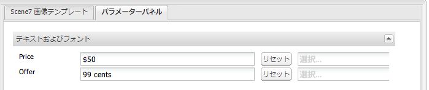

# ページへのDynamic Mediaクラシック機能の追加 {#adding-scene-features-to-your-page}

[AdobeDynamic MediaClassic](https://help.adobe.com/en_US/scene7/using/WS26AB0D9A-F51C-464e-88C8-580A5A82F810.html) は、リッチメディアアセットを管理、強化、公開、およびWeb、モバイル、電子メール、インターネットに接続されたディスプレイや印刷に配信するためのホストソリューションです。

Dynamic Mediaクラシックで公開されたAEMアセットは、様々なビューアで表示できます。

* ズーム
* フライアウト
* ビデオ
* 画像テンプレート
* 画像

デジタルアセットはAEMからDynamic Mediaクラシックに直接公開でき、Dynamic MediaクラシックからAEMに公開できます。

このドキュメントでは、デジタルアセットをAEMからDynamic Mediaクラシックに公開する方法と、デジタルアセットをAdobe ClassicからAdobe Classicに公開する方法を説明します。 また、ビューアについても詳しく説明します。AEMをDynamic Mediaクラシック用に設定する方法について詳しくは、「Dynamic MediaクラシックとAEM 」を参照してください。

[画像マップの追加](image-maps.md)も参照してください。

AEM でのビデオコンポーネントの使用について詳しくは、[ビデオ](video.md)を参照してください。

>[!NOTE]
>
>If Dynamic Media Classic assets do not display properly, make sure that Dynamic media is [disabled](config-dynamic.md#disabling-dynamic-media) and then refresh the page.

## アセットからDynamic Mediaクラシックへの手動公開 {#manually-publishing-to-scene-from-assets}

デジタルアセットは、次のようにDynamic Mediaクラシックに公開できます。

* [クラシック UI を使用して Assets コンソールから](/help/sites-classic-ui-authoring/manage-assets-classic-s7.md#publishing-from-the-assets-console)
* [クラシック UI を使用してアセットから](/help/sites-classic-ui-authoring/manage-assets-classic-s7.md#publishing-from-an-asset)
* [CQTargetフォルダーの外側からの従来のユーザーインターフェイス](/help/sites-classic-ui-authoring/manage-assets-classic-s7.md#publishing-assets-from-outside-the-cq-target-folder)

>[!NOTE]
>
>AEMは、Dynamic MediaClassicに非同期で公開します。 After you click **[!UICONTROL Publish]**, it may take several seconds for your asset to publish to Dynamic Media Classic.

## Dynamic Mediaクラシックコンポーネント {#scene-components}

AEMでは次のDynamic MediaのClassicコンポーネントを使用できます。

* ズーム
* フライアウト（ズーム）
* 画像テンプレート
* 画像
* ビデオ

>[!NOTE]
>
>These components are not available by default and need to be selected in **[!UICONTROL Design]** mode before using.

After they are made available in **[!UICONTROL Design]** mode, you can add the components to your page like any other AEM component. まだDynamic Mediaクラシックに公開されていないアセットは、同期済みのDynamic Media内、ページ上、またはDynamic Mediaクラシックのクラウド設定にある場合、クラシックに公開されます。

>[!NOTE]
>
>If you are creating and developing custom viewers and using the Content Finder, you need to explicity add the **[!UICONTROL allowfullscreen]** parameter.

### Flash ビューアのサポート終了に関する通知 {#flash-viewers-end-of-life-notice}

2017年1月31日、Adobe AdobeDynamic MediaクラシックはFlashビューアプラットフォームのサポートを終了しました。

この重要な変更について詳しくは、[Flash ビューアのサポート終了に関する FAQ](https://docs.adobe.com/content/docs/jp/aem/6-1/administer/integration/marketing-cloud/scene7/flash-eol.html) を参照してください。

### Adding a Dynamic Media Classic component (Scene7) to a page {#adding-a-scene-component-to-a-page}

Dynamic Mediaクラシック(Scene7)コンポーネントをページに追加するのと、コンポーネントをページに追加するのと同じです。 Dynamic Mediaクラシックコンポーネントについては、以下の節で詳しく説明します。

**ページにDynamic Mediaクラシック(Scene7)コンポーネントを追加するには**

1. AEMで、Dynamic Mediaクラシック(Scene7)コンポーネントを追加するページを開きます。

1. If no Dynamic Media Classic components are available, click **[!UICONTROL Design]** mode, tap any component with a blue border, tap the **[!UICONTROL Parent]** icon, and then the **[!UICONTROL Configuration]** icon. In **[!UICONTROL Parsys (Design)]**, select all the Dynamic Media Classic components to make them available and click **[!UICONTROL OK.]**

   

1. Click **[!UICONTROL Edit]** to return to **[!UICONTROL Edit]** mode.

1. サイドキックの「Dynamic Mediaクラシック」グループから、目的の場所のページにコンポーネントをドラッグします。

1. Click the **[!UICONTROL Configuration]** icon to open the component.

1. コンポーネントの編集を必要に応じておこない、「**[!UICONTROL OK]**」をクリックして変更内容を保存します。
1. 画像またはビデオをコンテンツブラウザーから、ページに追加したDynamic Mediaクラシックコンポーネントにドラッグします。

   >[!NOTE]
   >
   >タッチ操作対応UIのみ、画像またはビデオをページに配置したDynamic Mediaクラシックコンポーネントにドラッグ&amp;ドロップする必要があります。 Dynamic Mediaクラシックコンポーネントの選択と編集、およびアセットの選択はサポートされていません。

### Adding interactive viewing experiences to a responsive site {#adding-interactive-viewing-experiences-to-a-responsive-website}

アセットのレスポンシブデザインとは、アセットが表示される場所に適応することを意味します。レスポンシブデザインを使用すると、同じアセットを複数のデバイスで効果的に表示できます。

[Web ページのレスポンシブデザイン](/help/sites-developing/responsive.md)も参照してください。

**インタラクティブな表示エクスペリエンスをレスポンシブサイトに追加するには**

1. Log in to AEM, and ensure that you have [configured Adobe Dynamic Media Classic Cloud Services](/help/sites-administering/scene7.md#configuring-scene-integration) and that Dynamic Media Classic components are available.

   >[!NOTE]
   >
   >Dynamic Mediaクラシックコンポーネントが使用できない場合は、デザインモード [を使用してコンポーネントを有効にしてください](/help/sites-authoring/default-components-designmode.md)。

1. In a website with the **[!UICONTROL Dynamic Media Classic]** components enabled, drag an **[!UICONTROL Image]** component to the page.
1. コンポーネントを選択し、設定アイコンをタップします。
1. 「 **[!UICONTROL Dynamic Mediaクラシック設定]** 」タブで、ブレークポイントを調整します。

   

1. ビューアがレスポンシブにサイズ変更され、すべてのインタラクションがデスクトップ、タブレットおよびモバイル用に最適化されていることを確認します。

### すべてのDynamic MediaClassicコンポーネントに共通の設定 {#settings-common-to-all-scene-components}

Although configuration options vary, the following are common to all [!UICONTROL Dynamic Media Classic] components:

* **[!UICONTROL ファイル参照]** — 参照するファイルを参照します。 ファイル参照にはアセットURLが表示されます。URLコマンドとパラメーターを含む完全なDynamic MediaのクラシックURLとは限りません。 このフィールドには、Dynamic MediaクラシックURLのコマンドおよびパラメーターを追加できません。 それらは、コンポーネントの対応する機能を使用して追加する必要があります。
* **[!UICONTROL 幅]** — 幅を設定します。
* **[!UICONTROL 高さ]** — 高さを設定します。

You set these configuration options by opening (double-clicking) a Dynamic Media Classic component, for example, when you open a **[!UICONTROL Zoom]** component:

### ズーム {#zoom}

The HTML5 Zoom component displays a larger image when you press the **[!UICONTROL +]** button.

アセットの下部にはズームツールが用意されています。「+」をタップ **[!UICONTROL して拡大]** します。 タップ **[!UICONTROL して減ら]** します。 Tapping the **[!UICONTROL x]** or the reset zoom arrow brings the image back to the original size it was imported as. 斜めの矢印をタップして、画面全体を表示します。 Tap **[!UICONTROL Edit]** to configure the component. With this component, you can configure [settings common to all [!UICONTROL Dynamic Media Classic] components](#settings-common-to-all-scene-components).

### Flyout {#flyout}

In the HTML5 **[!UICONTROL Flyout]** component, the asset is shown as split screen; left the asset in the specified size; right the zoom portion is displayed. Tap **[!UICONTROL Edit]** to configure the component. With this component, you can configure [settings common to all Dynamic Media Classic components](#settings-common-to-all-scene-components).

>[!NOTE]
>
>**[!UICONTROL Flyout]** コンポーネントでカスタムサイズを使用する場合は、そのカスタムサイズが使用され、コンポーネントのレスポンシブ設定が無効になります。
>
>If your **[!UICONTROL Flyout]** component uses the default size, as set in the **[!UICONTROL Design View]**, then the default size is used and the component stretches to accomodate the page layout size with responsive setup of the component enabled. Be aware, however, that there is a limitation on responsive setup of the component. When the you use the **[!UICONTROL Flyout]** component with responsive setup, you should not use it with full page stretch. Otherwise, the **[!UICONTROL Flyout]** may extend beyond the page&#39;s right border.

### 画像 {#image}

Dynamic Mediaクラシック **[!UICONTROL Image]** コンポーネントを使用すると、Dynamic Mediaクラシック修飾子、Dynamic Mediaまたはビューアプリセット、シャープなどの画像にクラシック機能を追加できます。 Dynamic Mediaクラシック **[!UICONTROL 画像]** コンポーネントは、AEMの特殊Dynamic Mediaクラシック機能を備えた他の画像コンポーネントと似ています。 この例では、画像にクラシックURL修飾子がDynamic Media `&op_invert=1` 適用されています。

**[!UICONTROL タイトル、代替テキスト]** - 「 **** 詳細」タブで、画像にタイトルを追加し、グラフィックをオフにしているユーザーの代替テキストを追加します。

**[!UICONTROL URL、開く場所]** — アセットを設定して、リンクを開くことができます。 「**[!UICONTROL URL]**」と「**[!UICONTROL 次のウィンドウで開く]**」で、同じウィンドウで開くか新しいウィンドウで開くかを指定します。

**[!UICONTROL ビューアプリセット]** — ドロップダウンメニューから既存のビューアプリセットを選択します。 探しているビューアプリセットが表示されない場合は、表示できるように設定する必要があります。詳しくは、[ビューアプリセットの管理](/help/assets/managing-viewer-presets.md)を参照してください。画像プリセットを使用している場合は、ビューアプリセットを選択できません。逆の場合も同様です。

**[!UICONTROL Dynamic Mediaクラシック設定]** — アクティブなDynamic MediaプリセットをScene7 Publishing Systemから取得する際に使用する画像クラシック設定を選択します。

**[!UICONTROL 画像プリセット]** — ドロップダウンメニューから既存の画像プリセットを選択します。 探している画像プリセットが表示されない場合は、表示できるように設定する必要があります。[画像プリセットの管理](/help/assets/managing-image-presets.md)を参照してください。画像プリセットを使用している場合は、ビューアプリセットを選択できません。逆の場合も同様です。

**[!UICONTROL 出力形式]** — 画像の出力形式（jpegなど）を選択します。 選択する出力形式によっては、追加の設定オプションが表示される場合があります。[画像プリセットのベストプラクティス](/help/assets/managing-image-presets.md#image-preset-options)を参照してください。

**[!UICONTROL シャープ]** — 画像にシャープを適用する方法を選択します。 シャープニングについて詳しくは、[画像プリセットのベストプラクティス](/help/assets/managing-image-presets.md#image-preset-options)および[シャープニングのベストプラクティス](/help/assets/assets/s7_sharpening_images.pdf)を参照してください。

**[!UICONTROL URL修飾子]** — 画像効果を変更するには、クラシックDynamic Mediaのコマンドを追加します。 詳しくは、[画像プリセット](/help/assets/managing-image-presets.md)および「[コマンドリファレンス](https://docs.adobe.com/content/help/en/dynamic-media-developer-resources/image-serving-api/image-serving-api/http-protocol-reference/command-reference/c-command-reference.html)」を参照してください。

**[!UICONTROL ブレークポイント]** - Webサイトがレスポンシブである場合は、ブレークポイントを調整する必要があります。 ブレークポイントはコンマ（,）で区切って指定してください。

### 画像テンプレート {#image-template}

[Dynamic Mediaクラシック画像テンプレート](https://docs.adobe.com/help/en/dynamic-media-classic/using/template-basics/quick-start-template-basics.html) は、Dynamic Mediaクラシックに読み込まれたPhotoshopのレイヤーコンテンツで、コンテンツとプロパティが可変性を考慮してパラメータ化されていました。 **[!UICONTROL 画像テンプレート]**&#x200B;コンポーネントを使用すると、画像を読み込んで、テキストを AEM で動的に変更できます。また、ClientContext の値を使用するように&#x200B;**[!UICONTROL 画像テンプレート]**&#x200B;コンポーネントを設定できます。これにより、各ユーザーが個別に画像を活用できます。

Tap **[!UICONTROL Edit]** to configure the component. You can configure [settings common to all Dynamic Media Classic components](#settings-common-to-all-scene-components) as well as other settings described in this section.

**[!UICONTROL ファイル参照、幅、高さ]** - ScDynamic Media Classicene7のすべてのコンポーネントに共通の設定を参照してください。

>[!NOTE]
>
>Dynamic MediaクラシックURLのコマンドとパラメーターをファイル参照URLに直接追加することはできません。 これらは、**[!UICONTROL パラメーター]**&#x200B;パネルのコンポーネントの UI でのみ定義できます。

**[!UICONTROL タイトル、代替テキスト]** - 「Dynamic Mediaクラシック画像テンプレート」タブで、画像にタイトルを追加し、グラフィックをオフにしているユーザー用の代替テキストを追加します。

**[!UICONTROL URL、開く場所]** — アセットを設定して、リンクを開くことができます。 「URL」と「次のウィンドウで開く」で、同じウィンドウで開くか新しいウィンドウで開くかを指定します。

**[!UICONTROL パラメータパネル]** — 画像を読み込むと、パラメーターに画像の情報が事前に入力されます。 動的に変更できるコンテンツがない場合、このウィンドウは空になります。

#### テキストの動的な変更 {#changing-text-dynamically}

To change the text dynamically, enter new text in the fields and click **[!UICONTROL OK.]** In this example, the **[!UICONTROL Price]** is now $50 and shipping is 99 cents.

画像内のテキストが変更されます。You can reset the text back to the original value by tapping **[!UICONTROL Reset]** next to the field.

#### ClientContext の値を反映したテキストの変更 {#changing-text-to-reflect-the-value-of-a-client-context-value}

To link a field to a client context value, tap **[!UICONTROL Select]** to open the client-context menu, select the client context, and tap **[!UICONTROL OK.]**&#x200B;この例では、「名前」フィールドとプロファイル内の書式設定された名前とのリンクに基づいて名前が変わります。

現在ログインしているユーザーの名前がテキストに反映されます。フィールドの横にある「**[!UICONTROL リセット]**」をクリックすると、テキストを元の値に戻すことができます。

#### クラシックDynamic Mediaテンプレートをリンクにする {#making-the-scene-image-template-a-link}

1. 「Dynamic Mediaクラシック **[!UICONTROL 画像テンプレート]** 」コンポーネントを含むページで、「 **[!UICONTROL 編集」をタップします。]**
1. In the **[!UICONTROL URL]** field, enter the URL that users go to when the image is tapped. 「**[!UICONTROL 次のウィンドウで開く]**」フィールドで、ターゲットを新しいウィンドウと同じウィンドウのどちらで開くかを選択します。

   

1. Tap **[!UICONTROL OK.]**

### ビデオコンポーネント {#video-component}

The Dynamic Media Classic **[!UICONTROL Video]** component (available from the Dynamic Media Classic section of the sidekick) uses device and bandwidth detection to serve the right video to each screen. このコンポーネントは HTML5 ビデオプレーヤー（チャネルを超えて使用可能な単一のビューア）です。

このコンポーネントはアダプティブビデオセット（単一の MP4 ビデオまたは単一の F4V ビデオ）で使用できます。

See [Video](s7-video.md) for more information on how videos work with Dynamic Media Classic integration. また、Foundation Videoコンポーネント [とFoundation VideoコンポーネントのDynamic Mediaについても参照してください](s7-video.md)。

### ビデオコンポーネントに関する既知の制限事項 {#known-limitations-for-the-video-component}

Adobe DAMとWCMは、プライマリソースビデオがアップロードされたかどうかを表示します。 次に示すプロキシアセットは表示されません。

* Dynamic Mediaクラシックのエンコードされたレンディション
* Dynamic Mediaクラシックアダプティブビデオセット

Dynamic Mediaクラシックビデオコンポーネントでアダプティブビデオセットを使用する場合は、ビデオのサイズに合わせてコンポーネントのサイズを変更する必要があります。

## Dynamic Mediaクラシックコンテンツブラウザー {#scene-content-browser}

Dynamic Mediaクラシックコンテンツブラウザーを使用すると、Dynamic MediaクラシックのコンテンツをAEMで直接表示できます。 To access the content browser, in the **[!UICONTROL Content Finder]**, select **[!UICONTROL Dynamic Media Classic]** in the touch-optimized user interface or the **[!UICONTROL S7]** icon in the classic user interface. どちらの UI を使用しても機能は同じです。

設定が複数ある場合、AEM では既定で[デフォルト設定](/help/sites-administering/scene7.md#configuring-a-default-configuration)が表示されます。ドロップダウンメニューのDynamic Mediaクラシックコンテンツブラウザーで、異なる設定を直接選択できます。

>[!NOTE]
>
>* アドホックフォルダーにあるアセットは、Dynamic Mediaクラシックコンテンツブラウザーには表示されません。
>* セキュアプレビューを有効にすると 、Dynamic Mediaクラシックの公開済みアセットと未公開アセットの両方がDynamic Mediaクラシックコンテンツブラウザーに表示されます。
>* If you do not see **[!UICONTROL Dynamic Media Classic]** or the **[!UICONTROL S7]** icon as an option in the content browser, you need to [configure Dynamic Media Classic to work with AEM](/help/sites-administering/scene7.md).
>* ビデオの場合、Dynamic Mediaクラシックコンテンツブラウザーは次の機能をサポートします。
   >   * アダプティブビデオセット：複数の画面でシームレスに再生するために必要なすべてのビデオレンディションのコンテナ
   >   * 単一の MP4 ビデオ
   >   * 単一の F4V ビデオ

### Browsing content in the touch-optimized UI {#browsing-content-in-the-touch-optimized-ui}

タッチ対応 UI またはクラシック UI を使用してコンテンツブラウザーにアクセスできます。現時点では、タッチ対応 UI には次の制限事項があります。

* Dynamic MediaクラシックのFXGおよびFlashアセットはサポートされていません。

3番目のドロップダウンメニューから「 **[!UICONTROL Dynamic Media」「クラシック]** 」を選択して、Dynamic Mediaのクラシックアセットを参照します。 Dynamic MediaClassic/AEM統合を設定していない場合、リストにDynamic MediaClassicは表示されません。

>[!NOTE]
>
>* Dynamic MediaClassicコンテンツブラウザは、約100個のアセットを読み込み、名前順に並べ替えます。
>* セキュリティで保護されたプレビューサーバーが設定されている場合、ブラウザーはそのプレビューサーバーを使用してサムネールとアセットをレンダリングします。

>

また、ブラウザー内でアセットの上にマウスポインターを置くと、解像度の情報、サイズ、変更後の日数およびファイル名を参照できます。

* アダプティブビデオセットとテンプレートの場合は、サムネール用のサイズ情報が生成されません。
* アダプティブビデオセットの場合は、サムネール用の解像度が生成されません。

### コンテンツブラウザーを使用したDynamic Mediaクラシックアセットの検索 {#searching-for-scene-assets-with-the-content-browser}

Dynamic Mediaクラシックアセットの検索は、AEMアセットの検索と似ていますが、検索時に、実際にはAEMに直接読み込むのではなく、Dynamic Mediaクラシックシステムでアセットのリモート表示が表示される点が異なります。

クラシック UI またはタッチ操作向け UI を使用して、アセットを表示および検索できます。インターフェイスによって検索方法は多少異なります。

どちらの UI で検索する場合でも、次の基準でフィルターを適用できます（ここでは、タッチ操作向け UI を示しています）。

**[!UICONTROL キーワードの入力]** — アセットを名前で検索できます。 検索時には、入力したキーワードで始まるファイル名が検索されます。例えば、「swimming」という単語を入力すると、入力した順序どおりの文字列で始まるアセットファイルの名前が検索されます。キーワードを入力した後は、必ずenterをタップしてアセットを検索してください。

**[!UICONTROL Folder/path]** — 表示されるフォルダーの名前は、選択した設定に基づいています。 フォルダーのアイコンをタップし、サブフォルダーを選択し、チェックマークをタップしてレベルを下げることができます。

キーワードを入力してフォルダーを選択すると、AEM ではそのフォルダーがとすべてのサブフォルダーが検索されます。ただし、検索時にキーワードを入力しない場合は、フォルダーを選択してもそのフォルダー内のアセットしか表示されず、サブフォルダーは含まれません。

デフォルトでは、AEM は、選択したフォルダーとすべてのサブフォルダーを検索します。

**[!UICONTROL アセットのタイプ]** - **** Dynamic MediaClassicを選択して、Dynamic MediaClassicコンテンツを参照します。 このオプションは、Dynamic Mediaクラシックが設定されている場合にのみ使用できます。

**[!UICONTROL 設定]** - [!UICONTROL Cloud Serviceで複数のDynamic MediaClassic設定が定義されている場合は]、ここで選択できます。 そのため、選択した設定に基づいてフォルダーが変わります。

**[!UICONTROL アセットタイプ]** -Dynamic Mediaクラシックブラウザでは、結果をフィルタリングして次のいずれかを含めることができます。 画像、テンプレート、ビデオおよびアダプティブビデオセットを参照してください。 アセットタイプを選択しない場合、AEM ではデフォルトですべてのアセットタイプが検索されます。

>[!NOTE]
>
>* クラシック UI では、**Flash** と **FXG** も検索できます。現時点では、タッチ対応 UI でのこれらのフィルタリングはサポートされていません。
   >
   >
* ビデオを検索するときは、単一のレンディションが検索されています。結果は、元のレンディション（&amp;ast;.mp4のみ）とエンコードされたレンディションを返します。
>* アダプティブビデオセットを検索すると、フォルダとすべてのサブフォルダが検索されますが、検索にキーワードを追加した場合にのみ検索されます。 キーワードを追加しない場合、AEM はサブフォルダーを検索しません。

>

**[!UICONTROL 公開ステータス]** — 公開ステータスに基づいてアセットをフィルタリングできます。 **[!UICONTROL 非公開]** 、または **[!UICONTROL 公開済み。]** 「 **[!UICONTROL 公開ステータス」を選択しない場合、デフォルトでは、AEMはすべての]**&#x200B;公開ステータスを検索します。

