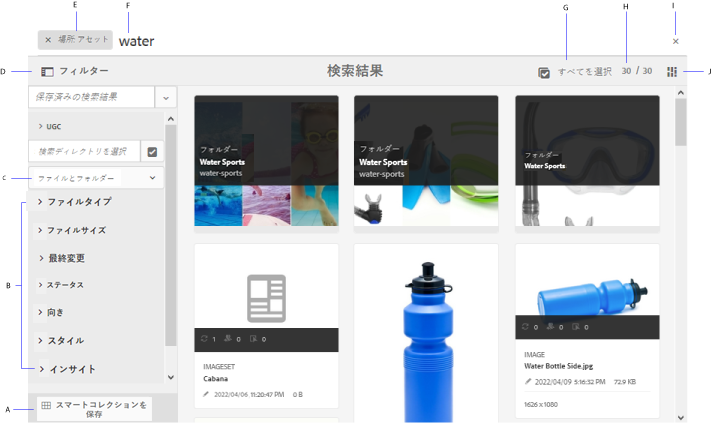
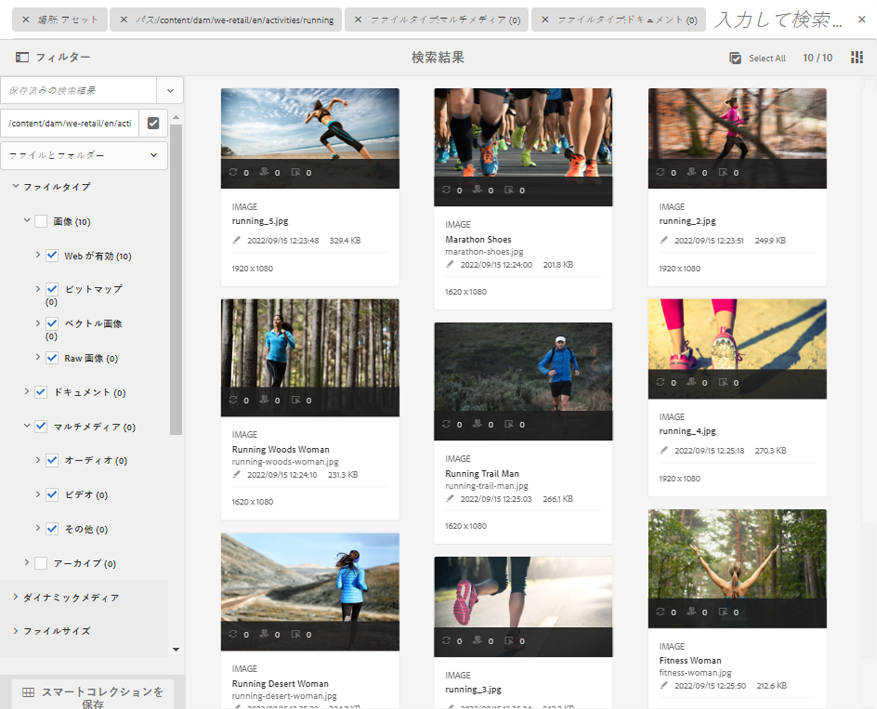
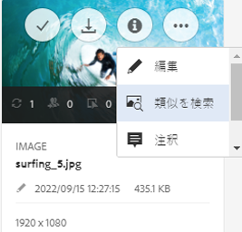
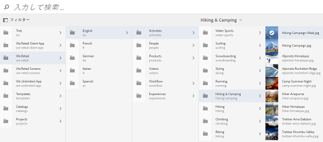
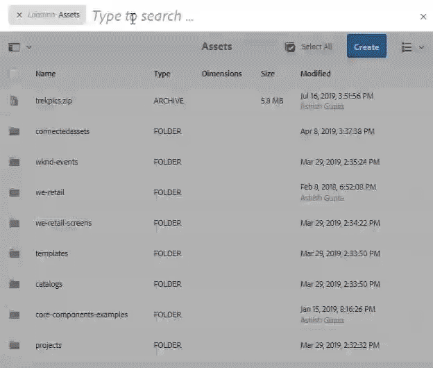

# AEM でのアセットの検索 {#search-assets-in-aem}

Adobe Experience Manager (AEM)Assetsは、より高いコンテンツ速度を実現するための堅牢なアセット検出方法を提供します。 標準搭載の機能とカスタム方法を使用して、シームレスでインテリジェントな検索を実現し、チームがタイム・トゥ・マーケティングを短縮します。 アセットの検索は、デジタルアセット管理システムの利用の中核を成します。用途は、クリエイティブ担当者によるさらなる利用、ビジネスユーザーやマーケティング担当者によるアセットの堅牢な管理、DAM 管理者による管理などです。AEM Assetsのユーザーインターフェイスや他のアプリケーションやサーフェスを介して実行できる、シンプル、高度、カスタムの検索は、これらの使用例を満たすのに役立ちます。

AEMは次の使用例をサポートしています。この記事では、これらの使用例の使用方法、概念、設定、制限、トラブルシューティングについて説明します。

| アセットの検索 | 設定と管理 | 検索結果の操作 |
|---|---|---|
| [基本検索](#searchbasics) | [検索インデックス](#searchindex) | [結果の並べ替え](#sort) |
| [検索UIについて](#searchui) | [視覚検索または類似性検索](#configvisualsearch) | [アセットのプロパティとメタデータの確認](#checkinfo) |
| [サーチクエリ](#searchsuggestions) | [必須メタデータ](#mandatorymetadata) | [ダウンロード](#download) |
| [検索結果と行動を理解する](#searchbehavior) | [検索ファセットの変更](#searchfacets) | [バルクメタデータの更新](#metadataupdates) |
| [検索ランクと昇順](#searchrank) | [テキストの抽出](#extracttextupload) | [スマートコレクション](#collections) |
| [アドバンス検索：検索のフィルタと範囲](#scope) | [カスタム述語](#custompredicates) | [予期しない結果を把握し、トラブルシューティング](#troubleshoot-unexpected-search-results-and-issues) |
| [他のソリューションやアプリから検索](#beyondomnisearch):<ul><li>[Adobe Asset Link](#aal)</li><li>[Brand Portal](#brandportal)</li><li>[AEM Desktop App](#desktopapp)</li><li>[Adobe Stock画像](#adobestock)</li><li>[ダイナミックメディアアセット](#dynamicmedia)</li></ul> |  |  |
| [アセットの選択/選択](#assetselector) |  |  |
| [制限事項](#limitations) とヒ [ント](#tips) |  |  |
| [図の例](#samples) |  |  |

AEM Webインターフェイスの上部にあるOmnisearchフィールドを使用してアセットを検索します。 AEMのアセッ **[!UICONTROL ト]** / **[!UICONTROL ファイル]** (AEM)に移動し、上部バーの検索アイコンをクリックし、検索キーワードを入力して、Returnキーを押します。 または、キーワードショートカット/（スラッシュ）を使用してOmnisearchフィールドを開きます。 場所：検索をDAMアセットに制限するために、アセットが事前に選択されています。 検索キーワードの入力を開始すると、AEMは提案を提供します。

フィルターパネル **[!UICONTROL を使用して]** 、ファイルタイプ、ファイルサイズ、最終変更日、アセットのステータス、インサイトデータ、Adobe Stockのライセンスなど、様々なオプション（述部）に基づいて検索結果をフィルターし、検索結果を絞り込みます。 管理者は、フィルターパネルをカスタマイズし、検索ファセットを使用して検索述部を追加または削除できます。 フィル [!UICONTROL タパネルのファイルタ] イプフィル [!UICONTROL タには] 、混在状態のチェックボックスがあります。 したがって、ネストされた述語（またはフォーマット）をすべて選択しない限り、第1レベルのチェックボックスは部分的にオンになります。

AEMの検索機能では、コレクションの検索と、コレクション内のアセットの検索がサポートされています。 コレクション [の検索を参照してくださ](/help/assets/managing-collections-touch-ui.md)い。

## 検索インターフェイスの理解 {#searchui}

検索インターフェイスと使用可能なアクションを確認します。

*図：アセットの検索結果インターフェイスの一部について*

**A.** 検索をスマートコレクションとして保存します。**B.** 検索結果を絞り込むフィルター（述語）。**C.** 検索結果にファイル、フォルダー、またはその両方を表示します。**D.** 「フィルター」をクリックして、左側のパネルを開くか閉じます。**E.** 検索場所は DAM です。**F.** ユーザが指定した検索キーワードを含むOmnisearchフィールド。 **G.** すべての検索結果を選択する場合は、チェックボックスをオンにします。 **H.** 検索結果の合計の中で表示された検索結果の数。 **私。** 検索 **Jを閉じます。** カード表示とリスト表示を切り替えます。

### 動的検索ファセット {#dynamicfacets}

検索ファセット内で予想される検索結果の数は動的に更新されますが、この数を使用して、検索結果ページから目的のアセットをより迅速に見つけることができます。検索フィルターを適用する前であっても、予想されるアセット数は更新されます。フィルターに対して予想されるアセット数を確認すると、検索結果をすばやく効率的にナビゲートすることができます。詳しくは、[AEM でのアセットの検索](search-assets.md)を参照してください。

*図：検索結果を検索ファセットでフィルタリングせずに、およその数のアセットを確認する*

## 検索結果と行動を理解する {#searchbehavior}

### 基本検索用語と検索結果 {#searchbasics}

キーワード検索はOmniSearchフィールドから実行できます。 キーワード検索では大文字と小文字が区別されず、（よく使用されるメタデータフィールド全体での）全文検索です。 複数のキーワードを検索する場合、キーワード間の初期設定の演算子は初期設定の検索で、アセ `AND` ットにスマートタグが付けら `OR` れている場合に検索が行われます。

結果は、最も近い一致から順に、関連性の高い順に並べ替えられます。 複数のキーワードの場合、メタデータに両方の語句が含まれるアセットが、より関連性の高い結果になります。 メタデータ内では、スマートタグとして表示されるキーワードは、他のメタデータフィールドに表示されるキーワードよりも高いランク付けが行われます。 AEMでは、特定の検索用語により高い重み付けを許可します。 また、特定の検索用語に対し [て、ターゲット設定された](#searchrank) いくつかのアセットのランクを上げることもできます。

関連するアセットをすばやく見つけるために、リッチインターフェイスは、フィルタリング、並べ替え、選択のメカニズムを提供します。 複数の条件に基づいて結果をフィルタリングし、様々なフィルターで検索したアセットの数を確認できます。 または、[Omnisearch]フィールドのクエリを変更して検索を再実行することもできます。 検索用語やフィルターを変更しても、他のフィルターは適用されたままで、検索のコンテキストが保持されます。

結果が多数のアセットの場合、AEMは最初の100をカード表示、200をリスト表示に表示します。 ユーザがスクロールすると、読み込まれるアセットが増えます。 これは、パフォーマンスを向上させるためです。

>[!VIDEO](https://www.youtube.com/watch?v=LcrGPDLDf4o)

検索結果に予期しないアセットが表示される場合があります。 詳しくは、予期しない結果を参照 [してください](#troubleshoot-unexpected-search-results-and-issues)。

AEMでは様々なファイル形式を検索でき、検索フィルターはビジネス要件に合わせてカスタマイズできます。 DAMリポジトリで使用できる検索オプションと、アカウントにどのような制限があるかについては、管理者に問い合わせてください。

### 強化されたスマートタグのある場合とない場合の結果 {#withsmarttags}

デフォルトでは、検索用語どうしを AND 句で組み合わせて AEM 検索がおこなわれます。例えば、「woman running」というキーワードを検索するとします。 メタデータに「woman」と「running」の両方のキーワードを含むアセットのみが、デフォルトで検索結果に表示されます。 特殊文字（ピリオド、アンダースコアまたはダッシュ）をキーワードと共に使用する場合も、同じ動作が保持されます。 次の検索クエリは同じ結果を返します。

* `woman running`
* `woman.running`
* `woman-running`

ただし、このクエリは、メタデ `woman -running` ータに含まれていな `running` いアセットを返します。
Using smart tags adds an extra `OR` clause to find any of the search terms as the applied smart tags. An asset tagged with either `woman` or `running` using Smart Tags also appear in such a search query. つまり、検索結果は、以下を組み合わせたものになります。

* メタデータにお `woman` よびキ `running` ーワードを含むアセット（デフォルトの動作）

* いずれかのキーワードでスマートタグ付けされたアセット（スマートタグの動作）

### 入力時にサーチクエリを検索する {#searchsuggestions}

キーワードの入力を開始すると、AEMは検索キーワードまたはフレーズを候補として提示します。 提案は、既存のアセットのメタデータに基づいて行われます。 AEMは、検索に役立つすべてのメタデータフィールドのインデックスを作成します。 検索の提案を行うために、次のいくつかのメタデータフィールドの値が使用されます。 検索の提案を行うには、以下のフィールドに適切なキーワードを入力することを検討してください。

* アセットタグ。 (マップ先 `jcr:content/metadata/cq:tags`)
* アセットのタイトル。 (マップ先 `jcr:content/metadata/dc:title`)
* アセットの説明。 (マップ先 `jcr:content/metadata/dc:description`)
* JCRリポジトリ内のタイトル。 この値は、アセットのタイトルにマップされる場合があります。 (マップ先 `jcr:content/jcr:title`)
* JCRリポジトリ内の説明。 この値は、アセットの説明にマッピングされる場合があります。 (マップ先 `jcr:content/jcr:description`)

複数の検索キーワードのサーチクエリを受け取る場合は、1つのキーワードのサーチクエリを選択せずに、引き続きすべてのキーワードを入力します。

*図：複数のキーワードを入力して、すべてに適したサーチクエリを表示します*

### 検索のランク付けと昇順 {#searchrank}

メタデータフィールド内のすべての検索用語に一致する検索結果が最初に表示され、スマートタグ内の検索用語のいずれかに一致する検索結果はその後に表示されます。上記の例の場合、検索結果が表示される順序はおおよそ次のようになります。

1. Matches of `woman running` in the various metadata fields.
1. Matches of `woman running` in smart tags.
1. Matches of `woman` or of `running` in smart tags.

特定のアセットに対するキーワードの有効性を高めることで、キーワードに基づいた検索を強化できます。つまり、特定のキーワードを昇格させた場合、それらのキーワードに基づいて検索すると、それらのキーワードの対象となる画像が検索結果の最上部に表示されます。

1. Assets ユーザーインターフェイスから、アセットのプレビューページを開きます。「**[!UICONTROL 詳細]**」タブをクリックし、「**[!UICONTROL 検索キーワード用に評価]**」の下の「**[!UICONTROL 追加]**」をクリックまたはタップします。
1. 「**[!UICONTROL 昇格を検索]**」ボックスで、画像検索時の強化の対象となるキーワードを指定し、「**[!UICONTROL 追加]**」をクリックまたはタップします。同じ方法で複数のキーワードを指定できます。
1. 「**[!UICONTROL 保存して閉じる]**」をクリックまたはタップします。このキーワードに対して昇格したアセットが、最上位の検索結果に表示されます。

ターゲットキーワードの検索結果で一部のアセットのランクを上げることで、これを利点に使用できます。 以下のビデオの例を参照してください。 For detailed info, see [search in AEM](https://helpx.adobe.com/experience-manager/kt/assets/using/search-feature-video-use.html).

>[!VIDEO](https://video.tv.adobe.com/v/16766/?quality=6)

*検索結果のランク付け方法とランクへの影響を理解します。*

## 詳細検索 {#scope}

AEMは、検索したアセットに適用されるフィルターなど、様々な方法を提供し、目的のアセットをすばやく見つけるのに役立ちます。 一般的に使用される方法のいくつかを以下に示します。 以下に、 [図の例を](#samples) いくつか示します。

**ファイルまたはフォルダの検索**:検索結果には、ファイル、フォルダ、またはその両方が表示されます。 フィルタ **[!UICONTROL ーパネルから]** 、適切なオプションを選択できます。 検索インタ [ーフェイスを参照](#searchui)。

**フォルダー内のアセットの検索**:検索対象を特定のフォルダーに限定できます。 フィルター **[!UICONTROL パネルで]** 、フォルダーのパスを追加します。 一度に1つのフォルダーのみを選択できます。

*図：フィルターパネルでフォルダーパスを追加して、検索結果をフォルダーに制限する*

### 類似の画像の検索 {#visualsearch}

ユーザーが選択した画像と視覚的に類似した画像を検索するには、画像のカード表示またはツールバーから「**[!UICONTROL 類似を検索]**」オプションをクリックします。AEM は、ユーザーが選択した画像に類似した、DAM リポジトリのスマートタグ付き画像を表示します。[類似性検索の設定方法](#configvisualsearch)を参照してください。

*図：カード表示のオプションを使用して類似の画像を検索する*

### Adobe Stock画像 {#adobestock}

From within the AEM user interface, users can search [Adobe Stock assets](/help/assets/aem-assets-adobe-stock.md) and license the required assets. Omnisearchバ `Location: Adobe Stock` ーでを追加します。 また、フィルターパネルを使用して、ライセンス済みまたはライセンスされていないすべてのアセットを検索したり、Adobe Stockのファイル番号を使用して特定のアセットを検索したりすることもできます。

### ダイナミックメディアアセット {#dmassets}

**[!UICONTROL フィルター]**&#x200B;パネルで&#x200B;**[!UICONTROL Dynamic Media／セット]**&#x200B;を選択し、Dynamic Media をフィルタリングできます。これにより、画像セット、カルーセル、混在メディアセット、スピンセットなどのアセットをフィルタリングして表示します。

### メタデータフィールドの特定の値を使用した検索 {#gqlsearch}

タイトル、説明、作成者など、特定のメタデータフィールドの正確な値に基づいてアセットを検索できます。 GQLの全文検索機能は、メタデータ値が検索クエリと完全に一致するアセットのみを取得します。 プロパティの名前（作成者、タイトルなど）と値の大文字と小文字は区別されます。

| メタデータフィールド | ファセットの値と使用方法 |
|---|---|
| タイトル | title:John |
| 作成者 | creator:John |
| 場所 | 場所：NA |
| 説明 | description:&quot;Sample Image&quot; |
| 作成ツール | creatortool:&quot;Adobe Photoshop CC 2015&quot; |
| 著作権の所有者 | copyrightowner:&quot;Adobe Systems&quot; |
| 貢献者 | contributor:John |
| 使用条件 | usageterms:&quot;CopyRights Reserved&quot; |
| 作成日 | created:YYYY-MM-DDTHH |
| 有効期限 | expires:YYYY-MM-DDTHH |
| オンタイム | ontime:YYYY-MM-DDTHH |
| オフタイム | offtime:YYYY-MM-DDTHH |
| 時間の範囲（有効期限、オンタイム、オフタイム） | facet field : lowerbound..upperbound |
| パス | /content/dam/&lt;folder name> |
| PDF タイトル | pdftitle:&quot;Adobe Document&quot; |
| 件名 | subject:&quot;Training&quot; |
| タグ | tags:&quot;Location And Travel&quot; |
| タイプ | type:&quot;image\png&quot; |
| 画像の幅 | width:lowerbound..upperbound |
| 画像の高さ | height:lowerbound..upperbound |
| 人 | person:John |

プロパティのパス、制限、サイズ、およびorderbyを他のプロパティとORすることはできません。

ユーザー生成プロパティのキーワードは、プロパティエディターにおけるフィールドラベルからスペースを削除して小文字で表記したものです。

複雑なクエリの検索形式の例：

* 複数のファセットフィールドを持つアセットをすべて表示する（例：タイトル = John Doe、作成ツール = Adobe Photoshop）： `tiltle:"John Doe" creatortool : Adobe*`
* To display all assets when the facets value is not a single word but a sentence (for example: title=Scott Reynolds): `title:"Scott Reynolds"`
* To display assets with multiple values of a single property (for example: title=Scott Reynolds or John Doe): `title:"Scott Reynolds" OR "John Doe"`
* To display assets with property values starting with a specific string (for example: title is Scott Reynolds): `title:Scott*`
* To display assets with property values ending with a specific string (for example: title is Scott Reynolds): `title:*Reynolds`
* To display assets with a property value that contains a specific string (for example: title = Basel Meeting Room): `title:*Meeting*`
* To display assets that contain a particular string and have a specific property value (for example: search for string Adobe in assets having title=John Doe): `*Adobe* title:"John Doe"`

## 他のAEMサービスまたはインターフェイスからのアセットの検索 {#beyondomnisearch}

Adobe Experience Manager (AEM)は、DAMリポジトリを様々なAEMソリューションに接続して、デジタルアセットへのアクセスを高速化し、クリエイティブワークフローを効率化します。 アセットの検出は、ブラウズまたは検索で始まります。 検索の動作は、さまざまなサーフェスやソリューションでほとんど同じままです。 ターゲットオーディエンス、使用例およびユーザーインターフェイスはAEMソリューションによって異なるので、一部の検索方法は変更されます。 個々のソリューションに関する具体的な方法は、以下のリンクに記載されています。 この記事では、一般的に適用されるヒントと動作について説明します。

### Adobe Asset Linkパネルからのアセットの検索 {#aal}

クリエイティブプロフェッショナルは、Adobe Asset Linkを使用して、サポート対象のAdobe Creative Cloudアプリケーションから離れることなく、AEM Assetsに保存されたコンテンツにアクセスできるようになりました。 クリエイティブは、Creative Cloudアプリケーションのアプリケーション内パネルを使用して、アセットの参照、検索、チェックアウト、チェックインをシームレスに行うことができます。Photoshop、IllustratorおよびInDesign。 また、アセットリンクを使用すると、視覚的に類似した結果を検索できます。 視覚的な検索の表示結果は、Adobe Senseiの機械学習アルゴリズムを利用して、美的に類似した画像を見つけるのに役立ちます。 詳しくは、 [Adobe Asset Linkを使用したアセットの検索](https://helpx.adobe.com/enterprise/using/manage-assets-using-adobe-asset-link.html#UseAdobeAssetLink) および参照を参照してください。

### AEMデスクトップアプリでのアセットの検索 {#desktopapp}

クリエイティブプロフェッショナルは、デスクトップアプリを使用して、AEM Assetsをローカルデスクトップ（WindowsまたはMac OS）で簡単に検索および利用できるようにします。 クリエイティブは、Mac FinderまたはWindowsエクスプローラーで目的のアセットを簡単に表示し、デスクトップアプリケーションで開いてローカルで変更し、AEMに保存し、リポジトリで新しいバージョンを作成して変更を反映させることができます。 1つ以上のキーワード*と？を使用した基本検索をサポートします。 ワイルドカード、およびAND演算子。 デスクトップ [アプリケーションでのアセットの参照](https://docs.adobe.com/content/help/en/experience-manager-desktop-app/using/using.html#browse-search-preview-assets) 、検索およびプレビューを参照してください。

### Search assets in Brand Portal {#brandportal}

基幹業務のユーザーおよびマーケティング担当者は、Brand Portalを使用して、承認されたデジタルアセットを、社内の拡張チーム、パートナーおよびリセラーと効率的かつ安全に共有します。 See [search assets on Brand Portal](https://docs.adobe.com/content/help/en/experience-manager-brand-portal/using/search-capabilities/brand-portal-searching.html).

### Adobe Stock画像の検索 {#adobestock-1}

AEM のユーザーインターフェイス内から Adobe Stock アセットを検索し、必要なアセットのライセンスを取得できます。「Omnisearch」フ `Location: Adobe Stock` ィールドにを追加します。 また、フィルターパネルを使用し **[!UICONTROL て]** 、ライセンス済みまたはライセンスされていないすべてのアセットを検索したり、Adobe Stockのファイル番号を使用して特定のアセットを検索したりすることもできます。 AEMでのAdobe Stock [画像の管理を参照してください](/help/assets/aem-assets-adobe-stock.md#usemanage)。

### ダイナミックメディアアセットの検索 {#dynamicmedia}

**[!UICONTROL フィルター]**&#x200B;パネルで&#x200B;**[!UICONTROL Dynamic Media]**／**[!UICONTROL セット]**&#x200B;を選択し、Dynamic Media をフィルタリングできます。これにより、画像セット、カルーセル、混在メディアセット、スピンセットなどのアセットをフィルタリングして表示します。Web ページの作成時、作成者はコンテンツファインダー内でセットを検索できます。セットのフィルターは、ポップアップメニューで使用できます。

### Webページの作成時にコンテンツファインダーでアセットを検索 {#contentfinder}

作成者は、コンテンツファインダーを使用してDAMリポジトリで関連アセットを検索し、作成したWebページのアセットを使用できます。 作成者は、接続されたアセット機能を使用して、リモートのAEMデプロイメントで使用可能なアセットを検索することもできます。 作成者は、これらのアセットをローカルAEMデプロイメントのWebページで使用できます。 See [use remote assets](/help/assets/use-assets-across-connected-assets-instances.md#use-remote-assets).

### コレクションの検索 {#collections}

AEMの検索機能では、コレクションの検索と、コレクション内のアセットの検索がサポートされています。 コレクション [の検索を参照してくださ](/help/assets/managing-collections-touch-ui.md)い。

## Asset selector {#assetselector}

アセットセレクターを使用すると、DAMアセットを特別な方法で検索、フィルターおよび参照できます。 アセットセレクターは、で使用できま `https://[aem-server]:[port]/aem/assetpicker.html`す。 選択したアセットのメタデータは、アセットセレクターを使用して取得できます。 アセットタイプ（画像、ビデオ、テキスト）や選択モード（単一または複数の選択）など、サポートされているリクエストパラメーターを使用して起動できます。 これらのパラメーターは、特定の検索インスタンスのアセットセレクターのコンテキストを設定し、選択範囲全体を通してそのまま残ります。

アセットセレクターは、HTML5 Window.postMessageメッセージを使用して、選択したアセットのデータを受信者に送信します。 アセットセレクターは、Granite の基盤ピッカーのボキャブラリに基づいています。デフォルトでは、アセットセレクターは、参照モードで動作します。

次のリクエストパラメーターを URL で渡して、特定のコンテキストでアセットセレクターを起動できます。

| 名前 | 値 | 例 | 目的 |
|---|---|---|---|
| resource suffix (B) | URL のリソースサフィックスとしてのフォルダーパス：[https://localhost:4502/aem/assetpicker.html/&lt;フォルダーパス>](https://localhost:4502/aem/assetpicker.html) | To launch the asset selector with a particular folder selected, for example with the folder `/content/dam/we-retail/en/activities` selected, the URL should be of the form: [https://localhost:4502/aem/assetpicker.html/content/dam/we-retail/en/activities?assettype=images](https://localhost:4502/aem/assetpicker.html/content/dam/we-retail/en/activities?assettype=images) | アセットセレクターの起動時に特定のフォルダーを選択する必要がある場合、そのフォルダーをリソースサフィックスとして渡します。 |
| mode | single、multiple | <ul><li>[https://localhost:4502/aem/assetpicker.html?mode=single](https://localhost:4502/aem/assetpicker.html?mode=single)</li><li>[https://localhost:4502/aem/assetpicker.html?mode=multiple](https://localhost:4502/aem/assetpicker.html?mode=multiple)</li></ul> | 複数モードでは、アセットセレクターを使用して、いくつかのアセットを同時に選択できます。 |
| mimetype | mimetype(s) (`/jcr:content/metadata/dc:format`) of an asset (wildcard also supported) | <ul><li>[https://localhost:4502/aem/assetpicker.html?mimetype=image/png](https://localhost:4502/aem/assetpicker.html?mimetype=image/png)</li><li>[https://localhost:4502/aem/assetpicker.html?mimetype=*png](https://localhost:4502/aem/assetpicker.html?mimetype=*png)</li><li>[https://localhost:4502/aem/assetpicker.html?mimetype=*presentation](https://localhost:4502/aem/assetpicker.html?mimetype=*presentation)</li><li>[https://localhost:4502/aem/assetpicker.html?mimetype=*presentation&amp;mimetype=*png](https://localhost:4502/aem/assetpicker.html?mimetype=*presentation&mimetype=*png)</li></ul> | MIME タイプに基づいてアセットをフィルタリングするために使用します |
| dialog | true、false | [https://localhost:4502/aem/assetpicker.html?dialog=true](https://localhost:4502/aem/assetpicker.html?dialog=true) | これらのパラメータを使用して、アセットセレクタをGranite Dialogとして開きます。 このオプションは、Granite Path Fieldからアセットセレクタを起動し、pickerSrc URLとして設定する場合にのみ適用されます。 |
| assettype (S) | images、documents、multimedia、archives | <ul><li>[https://localhost:4502/aem/assetpicker.html?assettype=images](https://localhost:4502/aem/assetpicker.html?assettype=images)</li><li>[https://localhost:4502/aem/assetpicker.html?assettype=documents](https://localhost:4502/aem/assetpicker.html?assettype=documents)</li><li>[https://localhost:4502/aem/assetpicker.html?assettype=multimedia](https://localhost:4502/aem/assetpicker.html?assettype=multimedia)</li><li>[https://localhost:4502/aem/assetpicker.html?assettype=archives](https://localhost:4502/aem/assetpicker.html?assettype=archives)</li></ul> | 渡された値に基づいてアセットタイプをフィルタリングするには、このオプションを使用します。 |
| root | &lt;folder_path> | [https://localhost:4502/aem/assetpicker.html?assettype=images&amp;root=/content/dam/we-retail/en/activities](https://localhost:4502/aem/assetpicker.html?assettype=images&root=/content/dam/we-retail/en/activities) | アセットセレクターのルートフォルダーを指定するには、このオプションを使用します。この場合、アセットセレクターを使用すると、ルートフォルダーの下の子アセット（直接／間接）のみを選択できます。 |

To access the asset selector interface, go to `https://[aem_server]:[port]/aem/assetpicker`. 目的のフォルダーに移動して、1 つまたは複数のアセットを選択します。または、「Omnisearch」ボックスで目的のアセットを検索し、必要に応じてフィルターを適用してから選択します。

*図：アセットピッカーでアセットを参照して選択します。*

## 制限事項 {#limitations}

AEM Assetsの検索機能には、次の制限があります。

* 検索クエリの先頭にスペースを入力しないでください。スペースが入力されていない場合、検索は機能しません。
* 検索結果からアセットのプロパティを選択し、検索をキャンセルした後も、AEMは検索語を引き続き表示する場合があります。 <!-- (CQ-4273540) -->
* フォルダ、ファイル、フォルダを検索する場合、検索結果をどのパラメータでも並べ替えることはできません。
* Omnisearchバーに何も入力しないでReturnキーを押すと、AEMはファイルのみのリストを返し、フォルダーは返しません。 キーワードを使用せずに特定のフォルダーを検索した場合、AEMは結果を返しません。
* 「すべて選択 [!UICONTROL 」チェックボックスを使用すると] 、最初に検索した100個のアセットをカード表示で選択し、最初に検索した200個のアセットをリスト表示で選択できます。 ユーザインターフェイスでスクロールして読み込むアセットの数を増やす場合は、「すべて選択」オプションを使用して [!UICONTROL さらに選択でき] ます。

ビジュアル検索または類似性検索には、次の制限があります。

* ビジュアル検索は、大きなリポジトリで最も効果的です。 良好な結果を得るために必要な画像の数は最小限ですが、少数の画像を含む一致の質は、大きなリポジトリの一致ほど良くない場合があります。
* モデルを変更したり、AEMをトレーニングして類似の画像を見つけることはできません。 例えば、一部のアセットにスマートタグを追加または削除しても、モデルは変更されません。 アセットは、視覚的に類似した検索結果から除外されます。

次のシナリオでは、検索機能のパフォーマンスに制限がある場合があります。

* カード表示は、検索結果を表示するリスト表示と比較して、読み込み時間が短くなりました。

## 検索のヒント {#tips}

* アセットのレビューステータスを監視する場合は、該当するオプションを使用して、承認されているアセットまたは承認待ちのアセットを検索します。
* 様々な Creative アプリから取得した使用状況の統計に基づいて、サポートされるアセットを検索するには、インサイトの述語を使用します。使用状況データは、アセットがカテゴリとして表示される使用状況スコア、インプレッション数、クリック数、メディアチャネルの下にグループ化されます。
* 「すべて選択」 **[!UICONTROL チェックボックスを使用し]** 、検索したアセットを選択します。 カード表示の最初の100アセットと、リスト表示の最初の200アセットを選択します。 選択範囲に対して操作を行うことができます。例えば、選択したアセットのダウンロード、選択したアセットのメタデータプロパティの一括更新、選択したアセットのコレクションへの追加などが可能です。
* 必須のメタデータを含まないアセットを検索するには、必須のメタデータを参照 [してください](#mandatorymetadata)。
* 検索では、すべてのメタデータフィールドが使用されます。 12の検索など、一般的な検索は、通常多くの結果を返します。 より良い結果を得るには、二重引用符（一重引用符ではない）を使用するか、特殊文字のない単語に番号が連続していることを確認し *ます(shoe12*)。
* フルテキスト検索では、-、^などの演算子がサポートされます。 これらの文字を文字列リテラルとして検索するには、検索式を二重引用符で囲みます。例えば、「ノート — 美」の代わりに「ノート — 美」を使用します。
* 検索結果が多すぎる場合は、目的のアセ [ットの検索範囲](#scope) を0に制限します。 これは、特定のファイルタイプ、特定の場所、特定のメタデータなど、目的のアセットの検索方法を理解した上で最も効果的です。

* **タグ**:タグを使用すると、閲覧や検索が効率的に行えるアセットを分類できます。 タグ付けは、適切な分類を他のユーザーやワークフローに反映するのに役立ちます。 AEMは、使用状況やトレーニングを使用してアセットをより効率的にタグ付けできる、Adobe Senseiの人為的なインテリジェントなサービスを使用して、アセットに自動的にタグ付けする方法を提供しています。 アセットを検索する場合、アカウントで機能が有効になっていると、スマートタグが組み込まれます。 AEMの組み込み検索機能と同時に機能します。 検索動 [作を参照](#searchbehavior)。 検索結果が表示される順序を最適化するには、選択した複数のアセ [ットの検索ランク](#searchrank) を上げることができます。

* **インデックス**:インデックス付きのメタデータとアセットのみが検索結果に返されます。 有効範囲とパフォーマンスを向上させるために、適切なインデックス作成を行い、ベストプラクティスに従ってください。 indexingを参 [照](#searchindex)。

## 検索の例 {#samples}

キーワードの前後に二重引用符を使用して、ユーザーが指定した順序で完全に一致するフレーズを含むアセットを検索します。

*図：検索動作（引用符付き）と引用符なし*

**アスタリスクのワイルドカードで検索**:検索範囲を広げるには、任意の文字数に一致するように、検索語の前または後にアスタリスクを使用します。 例えば、アスタリスクなしでrunを検索しても、（メタデータに含まれる）単語のバリエーションを含むアセットは返されません。 アスタリスクは任意の数の文字を置き換えます。 例：

* `run` 実行キーワードが正確に含まれるアセットを返す
* `run*` 実行、実行、暴走などのアセットを返します。
* `*run` は、outurn、renuなどを返します。
* `*run*` 可能な組み合わせをすべて返します。

*図：例を使用したアセット検索でのアスタリスクワイルドカードの使用例*

**疑問符ワイルドカードで検索**:検索範囲を広げるには、1つ以上の「?」を使用します。 文字を入力します。 例えば、次の図では、

* `run???` クエリがどのアセットとも一致しません。

* `run????` queryは、4文字後の単語 `running` と一致します `run`。

* `??run` queryは、2文字前の単 `rerun` 語に一致します `run`。

*図：例を使用したアセット検索での疑問符ワイルドカードの使用例*

**キーワードの除外**:ダッシュを使用して、キーワードを含まないアセットを検索します。 例えば、クエリ `running -shoe` ーは、を含むが含まないア `running`セットを返しま `shoe`す。 同様に、クエ `camp -night` リーは、を含むが含まないアセット `camp` を返しま `night`す。 クエリーは、 `camp-night` との両方を含むアセットを返すこ `camp` とに注意してくださ `night`い。

*図：ダッシュを使用して、除外されたキーワードを含まないアセットを検索する*

## 検索機能に関連する設定および管理タスク {#configadmin}

### 検索インデックスの設定 {#searchindex}

アセットの検出は、メタデータを含むDAMコンテンツのインデックス作成に依存します。 迅速で正確なアセットの検出は、最適化されたインデックス作成と適切な設定に依存しています。 「検索インデ [ックス](/help/assets/performance-tuning-guidelines.md#search-indexes)」、「オーク [クエリとインデックス作成](/help/sites-deploying/queries-and-indexing.md)」、「ベストプラクティス [」を参照してください](/help/sites-deploying/best-practices-for-queries-and-indexing.md)。

### 視覚検索または類似性検索 {#configvisualsearch}

ビジュアル検索ではスマートタグを使用し、AEM 6.5.2.0以降が必要です。 スマートタグ機能を設定した後、次の手順に従います。

1. AEM CRXDEのノードで、 `/oak:index/lucene` 次のプロパティと値を追加し、変更を保存します。

   * `costPerEntry` 値を持つタイプ `Double` のプロパティ `10`。

   * `costPerExecution` 値を持つタイプ `Double` のプロパティ `2`。

   * `refresh` 値を持つタイプ `Boolean` のプロパティ `true`。
   この設定により、適切なインデックスからの検索が可能になります。

1. Luceneインデックスを作成するには、CRXDEで、次のタ `/oak:index/damAssetLucene/indexRules/dam:Asset/properties`イプのノードを作 `imageFeatures` 成しま `nt-unstructured`す。 ノード `imageFeatures` 内で、

   * 値を持 `name` つタイプのプ `String` ロパティを追加しま `jcr:content/metadata/imageFeatures/haystack0`す。

   * の値を `nodeScopeIndex` 使用して、タ `Boolean` イプのプロパティを追加しま `true`す。

   * の値を `propertyIndex` 使用して、タ `Boolean` イプのプロパティを追加しま `true`す。

   * 値を持 `useInSimilarity` つタイプのプ `Boolean` ロパティを追加しま `true`す。
   変更内容を保存します。

1. の値を `/oak:index/damAssetLucene/indexRules/dam:Asset/properties/predictedTags` 持つタ `similarityTags` イプのプロパテ `Boolean` ィにアクセスし、追加しま `true`す。
1. スマートタグをAEMリポジトリ内のアセットに適用します。 スマート [タグの設定方法を参照してください](https://docs.adobe.com/content/help/en/experience-manager-learn/assets/metadata/smart-tags-technical-video-setup.html)。
1. CRXDEのnodeで、プ `/oak-index/damAssetLucene` ロパティをに設 `reindex` 定します `true`。 変更内容を保存します。
1. （オプション）検索フォームをカスタマイズした場合は、ノードをにコ `/libs/settings/dam/search/facets/assets/jcr%3Acontent/items/similaritysearch` ピーしま `/conf/global/settings/dam/search/facets/assets/jcr:content/items`す。 すべての変更を保存します。

関連情報については、AEMのスマー [トタグと、スマートタグの管理方法](https://helpx.adobe.com/experience-manager/kt/assets/using/smart-tags-feature-video-understand.html) ( [英語のみ)を参照してください](/help/assets/managing-smart-tags.md)。

### 必須メタデータ {#mandatorymetadata}

ビジネスユーザー、管理者またはDAMライブラリは、ビジネスプロセスが機能するための必須の必須メタデータとして、一部のメタデータを定義できます。 様々な理由で、既存のアセットや一括で移行されたアセットなど、一部のアセットにこのメタデータが欠落している可能性があります。 メタデータがないか無効なアセットが検出され、インデックス付きのメタデータプロパティに基づいてレポートされます。 設定するには、必須のメタデータを [参照してくださ](/help/assets/metadata-schemas.md#define-mandatory-metadata)い。

### 検索ファセットの変更 {#searchfacets}

AEM Assetsでは、検索の速度を向上させるために検索ファセットを提供し、検索結果をフィルタリングできます。 フィルターパネルには、デフォルトでいくつかの標準ファセットが含まれています。 管理者は、Filtersパネルをカスタマイズして、組み込み述語を使用してデフォルトのファセットを変更できます。 AEMは、組み込みの述語の適切なコレクションと、ファセットをカスタマイズするエディターを提供します。 検索ファセ [ットを参照](/help/assets/search-facets.md)。

### アセットのアップロード時のテキストの抽出 {#extracttextupload}

PSDやPDFファイルなどのアセットをアップロードする際に、アセットからテキストを抽出するようにAEMを設定できます。 AEMは、抽出されたテキストのインデックスを作成し、抽出されたテキストに基づいてこれらのアセットを検索するのに役立ちます。 See [upload assets](/help/assets/managing-assets-touch-ui.md#uploading-assets).

### 検索結果をフィルタするカスタム述語 {#custompredicates}

述部は、ファセットの作成に使用されます。 管理者は、事前設定の述語を使用して、フィルターパネルで検索ファセットをカスタマイズできます。 これらの述語は、オーバーレイを使用してカスタマイズできます。 「カスタム述 [部の作成」を参照してくださ](/help/assets/searchx.md)い。

デジタルアセットは、次の1つ以上のプロパティに基づいて検索できます。 これらのプロパティの一部に適用されるフィルターは、デフォルトで使用でき、他の一部のフィルターは、カスタム作成して他のプロパティに適用できます。

| 検索フィールド | 検索プロパティの値 |
|---|---|
| MIME タイプ | 画像、ドキュメント、マルチメディア、アーカイブ、その他 |
| 最終変更 | 時間、日、週、月、年 |
| ファイルサイズ | 小、中、大 |
| 公開ステータス | 公開済みまたは非公開 |
| 承認ステータス | 承認または却下 |
| 向き | 水平方向、垂直方向、四角形 |
| スタイル | カラーまたは白黒 |
| ビデオの高さ | 最小値と最大値として指定。値はビデオレンディションのメタデータにのみ保存されます。 |
| ビデオの幅 | 最小値と最大値として指定。値はビデオレンディションのメタデータにのみ保存されます。 |
| ビデオ形式 | DVI、Flash、MPEG4、MPEG、OGG Theora、QuickTime、Windows Media。値は、ソースビデオのメタデータとレンディションに保存されます。 |
| ビデオコーデック | x264。値はビデオレンディションのメタデータにのみ保存されます。 |
| ビデオビットレート | 最小値と最大値として指定。値はビデオレンディションのメタデータにのみ保存されます。 |
| オーディオコーデック | Libvorbis、Lame MP3、AACエンコーディング。 値はビデオレンディションのメタデータにのみ保存されます。 |
| オーディオビットレート | 最小値と最大値として指定。値はビデオレンディションのメタデータにのみ保存されます。 |

## アセットの検索結果の操作 {#aftersearch}

検索条件に一致する検索済みアセットが表示されたら、これらの検索結果に対して次の一般的なタスクを実行するか、または次のアクションを実行できます。

* メタデータのプロパティおよびその他の情報を表示します。
* 1つ以上のアセットをダウンロードします。
* 「Desktop Actions」を使用して、デスクトップアプリケーションでこれらのアセットを開きます。
* スマートコレクションを作成します。

### 検索結果の並べ替え {#sort}

検索結果を並べ替えると、必要なアセットをすばやく見つけることができます。検索結果の並べ替えは、リストビューで、**[!UICONTROL フィルター]**&#x200B;パネルで「**[!UICONTROL [ファイル](#searchui)]**」を選択した場合のみ機能します。AEM Assets では、サーバーサイドの並べ替えを使用して、フォルダー内のすべてのアセット（数量）や検索クエリの結果をすばやく並べ替えます。サーバーサイドでの並べ替えは、クライアントサイドでの並べ替えよりも高速で正確な結果を提供します。

リストビューでは、任意のフォルダ内のアセットを並べ替えるのと同じように、検索結果を並べ替えることができます。 並べ替えは、「名前」、「タイトル」、「ステータス」、「ディメンション」、「サイズ」、「評価」、「使用状況」、「作成日」、「変更日」、「発行日」、「ワークフロー」、「チェックアウト済み」の各列で行われます。

並べ替え機能の制限については、制限を参照して [ください](#limitations)。

### アセットの詳細情報の確認 {#checkinfo}

検索したアセットの詳細情報は、検索結果ページで確認できます。

アセットのすべてのメタデータを表示するには、アセットを選択し、ツールバーから **[!UICONTROL プロパティ]** をクリックします。

アセットに対するコメント、またはアセットのバージョン履歴を確認するには、アセットをクリックして大きいサイズのプレビューを開きます。左側のパネルでタイムラインを開き、「**[!UICONTROL コメント]**」または「**[!UICONTROL バージョン]**」を選択します。また、コメントやバージョンなどのタイムラインアクティビティを時系列順に並べ替えることもできます。

*図：検索アセットのタイムラインエントリの並べ替え*

### 検索されたアセットのダウンロード {#download}

フォルダから通常のアセットをダウンロードするのと同じように、検索したアセットとそのレンディションをダウンロードできます。 検索結果から1つ以上のアセットを選択し、ツールバーの「ダ **[!UICONTROL ウンロード]** 」をクリックします。

### メタデータプロパティの一括更新 {#metadataupdates}

複数のアセットの共通のメタデータフィールドを一括更新できます。 検索結果から1つ以上のアセットを選択します。 ツールバ **[!UICONTROL ーの]** 「プロパティ」をクリックし、必要に応じてメタデータを更新します。 完了したら **[!UICONTROL 「保存して閉じる]** 」をクリックします。 更新されたフィールド内の既存のメタデータが上書きされます。

単一のフォルダーまたはコレクションで使用できるアセットの場合、検索機能を使用しな [くても、メタデータを一括](/help/assets/managing-multiple-assets.md) で更新する方が簡単です。 複数のフォルダーで使用できるアセットや共通の条件に一致するアセットの場合、検索を使用してメタデータを一括更新する方が高速です。

### スマートコレクション {#collections-1}

コレクションとは、異なる場所のアセットを含めることができる、順序付けられた一連のアセットです。コレクションには、これらのアセットへの参照のみが含まれるからです。 コレクションは、次の2つのタイプで構成されます。

* アセット、フォルダーおよびその他のコレクションの静的参照リストです。
* 検索条件に基づいてコレクション内のアセットを入力する動的リスト（スマートコレクション）。

検索条件に基づいてスマートコレクションを作成できます。**[!UICONTROL フィルター]**&#x200B;パネルで「**[!UICONTROL ファイル]**」を選択し、「**[!UICONTROL スマートコレクションを保存]**」をクリックします。[コレクションの管理](/help/assets/managing-collections-touch-ui.md)を参照してください。

## 予期しない検索結果や問題のトラブルシューティング {#troubleshoot-unexpected-search-results-and-issues}

| エラー、問題、症状 | 考えられる理由 | 問題の修正または理解 |
|---|---|---|
| メタデータがないアセットを検索する際に誤った結果が生じる | 必須のメタデータがないアセットを検索すると、AEMで有効なメタデータを持つ一部のアセットが表示される場合があります。 結果は、インデックス付きのメタデータプロパティに基づいています。 | メタデータの更新後、アセットメタデータの正しい状態を反映するために、インデックスの再作成が必要です。 必須メタデ [ータを参照](metadata-schemas.md#define-mandatory-metadata)。 |
| 検索結果が多すぎます | 部分一致検索パラメータ。 | 検索範囲の制限 [を検討します](#scope)。 スマートタグを使用すると、予想以上に多くの検索結果が得られる場合があります。 スマートタ [グを使用した検索動作を参照してくださ](#withsmarttags)い。 |
| 関連のない、または一部関連の検索結果 | スマートタグを使用した検索動作の変更。 | スマートタ [グ付け後の検索の変化を理解します](#withsmarttags)。 |
| アセットのオートコンプリートの提案なし | 新しくアップロードされたアセットのインデックスはまだ作成されていません。 Omnisearchバーで検索キーワードを入力し始めたときに、メタデータが提案としてすぐに使用できるわけではありません。 | AEM Assetsは、タイムアウト期間（デフォルトで1時間）が経過するまで待ってから、バックグラウンドジョブを実行し、新しくアップロードまたは更新されたすべてのアセットのメタデータのインデックスを作成し、そのメタデータを提案のリストに追加します。 |
| 検索結果はありません | <ul><li>クエリに一致するアセットが存在しません。</li><li>検索クエリの前に空白を追加しました。</li><li>サポートされていないメタデータフィールドに、検索するキーワードが含まれています。</li><li>オンタイムおよびオフタイムは、アセットに対して設定され、アセットのオフタイム中に検索が行われました。</li></ul> | <ul><li>別のキーワードを使用して検索します。 または、（スマート）タグ付けを使用して検索結果を改善します。</li><li>これは既知の [制限です](#limitations)。</li><li>すべてのメタデータフィールドが検索対象とは見なされません。 「 [scope](#scope)」を参照</li><li>後で検索するか、必要なアセットのオン/オフのタイミングを変更します。</li></ul> |
| 検索フィルター/述語が使用できません | <ul><li>検索フィルターが設定されていない。</li><li>ログインできません。</li><li>（考えにくい）検索オプションは、使用している展開でカスタマイズされません。</li></ul> | <ul><li>検索のカスタマイズが使用可能かどうかを管理者に問い合わせて確認してください。</li><li>管理者に問い合わせて、お使いのアカウントにカスタマイズを使用する権限/権限があるかどうかを確認してください。</li><li>管理者に問い合わせて、使用しているAEM Assetsデプロイメントで使用可能なカスタマイズを確認します。</li></ul> |
| 視覚的に類似した画像を検索する場合、期待される画像が見つからない | <ul><li>画像はAEMでは使用できません。</li><li>画像のインデックスが作成されません。 通常、最近アップロードされた日時。</li><li>画像にスマートタグが付いていません。</li></ul> | <ul><li>画像をAEM Assetsに追加します。</li><li>リポジトリのインデックスを再作成するには、管理者に問い合わせてください。 また、適切なインデックスを使用していることを確認します。</li><li>管理者に問い合わせて、関連アセットのスマートタグを付けます。</li></ul> |
| 視覚的に類似した画像を検索する場合、無関係な画像が表示されます | ビジュアル検索の動作。 | AEMは、可能な限り多くの関連するアセットを表示します。 関連性の低い画像がある場合は、その画像が結果に追加されますが、検索のランクが低くなります。 検索結果を下にスクロールすると、一致の質と検索されたアセットの関連性が低下します。 |
| 検索結果を選択して操作する場合、検索されたすべてのアセットは操作されません。 | 「すべ [!UICONTROL て選択] 」オプションでは、カード表示では最初の100件の検索結果、リスト表示では最初の200件の検索結果のみが選択されます。 |  |

>[!MORELIKETHIS]
>
>* [AEM検索導入ガイド](https://docs.adobe.com/content/help/en/experience-manager-learn/sites/developing/search-tutorial-develop.html)
>* [複数値およびタグ検索述語の詳細設定](https://docs.adobe.com/content/help/en/experience-manager-learn/assets/metadata/search-feature-video-use.html)
>* [スマート翻訳検索の設定](https://docs.adobe.com/content/help/en/experience-manager-learn/assets/translation/smart-translation-search-technical-video-setup.html)

