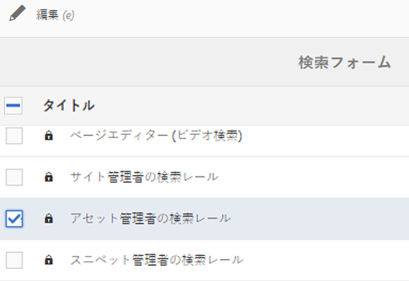
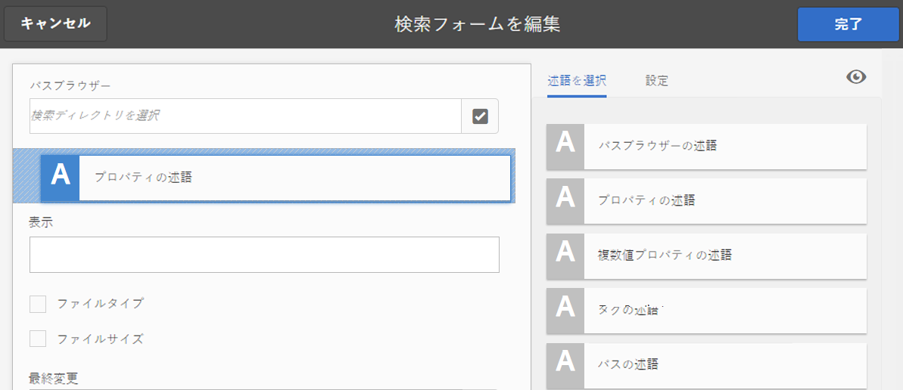
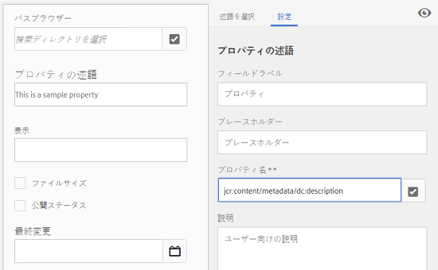
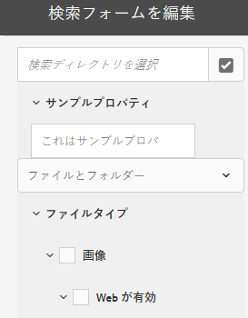
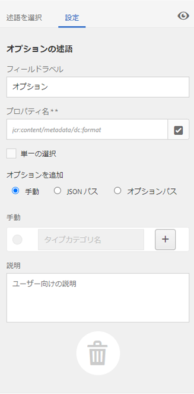
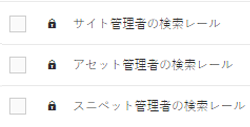

# 検索ファセット {#search-facets}

An enterprise-wide deployment of [!DNL Adobe Experience Manager Assets] has the capacity to store many assets. Sometimes, finding the right asset can be arduous and time-consuming if you only use the generic search capabilities of [!DNL Experience Manager].

フィルターパネルの検索ファセットを使用すると、より詳細な検索が可能になり、検索機能がより効率的で柔軟になります。検索ファセットは、複数のディメンション（述語）を追加するので、ユーザーはより複雑な検索を実行できます。フィルターパネルには、いくつかの標準ファセットが含まれます。カスタム検索ファセットを追加することもできます。

つまり、検索ファセットを使用すると、事前に決定された単一の分類上の順序ではなく、複数の方法でアセットを検索できます。より焦点を絞った検索のために、目的の詳細レベルまで簡単にドリルダウンできます。

例えば、画像を検索する場合、ビットマップとベクトル画像のどちらを検索するかを選択できます。画像の MIME タイプを指定して、検索の範囲をさらに絞り込むことができます。同様に、ドキュメントを検索する場合は、PDF や MS Word などの形式を指定できます。

## 述語の追加 {#adding-a-predicate}

フィルターパネルに表示される検索ファセットは、述語を使用した基盤となる検索フォームで定義されます。より多くのファセットや別のファセットを表示するには、述語をデフォルトフォームに追加するか、選択したファセットを含むカスタムフォームを使用します。

For full-text searches, add the [!UICONTROL Fulltext] predicate to the form. 「プロパティの述語」を使用すると、ユーザーが指定した 1 つのプロパティと一致するアセットが検索されます。「オプションの述語」を使用すると、特定のプロパティについて 1 つ以上の値と一致するアセットが検索されます。「日付の範囲の述語」を追加すると、指定した期間内に作成されたアセットが検索されます。

1. Click the [!DNL Experience Manager] logo, and then go to **[!UICONTROL Tools]** > **[!UICONTROL General]** > **[!UICONTROL Search Forms]**.
1. From the Search Forms page, select **[!UICONTROL Assets Admin Search Rail]**, then click **[!UICONTROL Edit]** .

   

   >[!NOTE]
   >
   >以前のバージョンの事前設定済みの **アセット管理者用検索パネルからフォルダー検索機能を使用するには** 、次の手順を実行します。
   >
   >1. Navigate to `/conf/global/settings/dam/search/facets/assets/jcr:content/items` in CRXDE.
   >1. 「 **type** 」ノードを削除します。
   >1. パス */libs/settings/dam/search/facets/assets/jcr:content/items* から、ノード&#x200B;**アセット、ディレクトリ、typeor、excludepaths**、および **searchtype** を、手順 1 のパスにコピーします。
   >1. 変更内容を保存します。


1. 検索フォームを編集ページで、「**[!UICONTROL 述語を選択]**」タブからメインウィンドウに述語をドラッグします。例えば、「**[!UICONTROL プロパティの述語]**」をドラッグします。

   

   *図： 述語を押して移動し、検索フィルターをカスタマイズします。*

1. 「設定」タブで、その述語のフィールドラベル、プレースホルダーテキストおよび説明を入力します。述語に関連付けるメタデータプロパティの有効な名前を指定します。

   「設定」タブのヘッダーラベルは、選択した述語のタイプを示します。

   

   「設定」タブを使用した述語の必須オプションの指定

1. 「**[!UICONTROL プロパティ名]**」フィールドで、述語に関連付けるメタデータプロパティの有効な名前を指定します。実行される検索に基づく名前です。例えば、`jcr:content/metadata/dc:description` や `./jcr:content/metadata/dc:description` を入力します。

   選択ダイアログから既存のノードを選択することもできます。

   

   「プロパティ名」フィールドでのメタデータプロパティと述語の関連付け

1. Click the **[!UICONTROL Preview]**  to generate a preview of the Filters panel as it appears after you add the predicate.
1. プレビューモードで述語のレイアウトを確認します。

   

   変更送信前の検索フォームのプレビュー

1. To close the preview, click the **[!UICONTROL Close]**  on the upper-right corner of the preview.
1. 「**[!UICONTROL 完了]**」をクリックして、設定を保存します。
1. Navigate to the Search panel in the [!DNL Assets] user interface. プロパティの述語がパネルに追加されています。
1. Enter a description for the asset to be searched in the text box. For example, enter `Adobe`. When you perform a search, assets with description matching `Adobe` are listed in the search results.

## オプションの述語の追加 {#adding-an-options-predicate}

オプションの述語を使用すると、フィルターパネルに複数の検索オプションを追加できます。フィルターパネルで 1 つ以上のオプションを選択して、アセットを検索できます。例えば、ファイルタイプに基づいてアセットを検索するには、検索フォームに「画像」、「マルチメディア」、「ドキュメント」、「アーカイブ」などのオプションを設定します。これらのオプションを設定後、フィルターパネルで「画像」オプションを選択すると、GIF、JPEG、PNG などのタイプのアセットに対して検索が実行されます。

オプションをそれぞれのプロパティにマップするには、オプション用のノード構造を作成し、「オプションの述語」の「プロパティ名」プロパティに親ノードのパスを指定します。親ノードのタイプは `sling`:`OrderedFolder` とする必要があります。オプションのタイプは `nt:unstructured` とする必要があります。オプションノードには、`jcr:title` プロパティと `value` プロパティを設定する必要があります。

`jcr:title` プロパティは、フィルターパネルに表示される、オプションのわかりやすい名前です。`value` フィールドは、指定されたプロパティと照合するためにクエリで使用されます。

オプションを選択すると、検索がオプションノードの `value` プロパティとその子ノード（存在する場合）に基づいて実行されます。オプションノード以下のツリー全体がトラバースされ、各子ノードの `value` プロパティが OR 演算子によって結合されて、検索クエリが作成されます。

例えば、ファイルタイプとして「画像」を選択した場合、アセットの検索クエリは OR 演算子によって `value` プロパティを結合することで作成されます。例として、画像の検索クエリは、プロパティ `jcr:content/metadata/dc:format` に対して *image/jpeg*、*image/gif*、*image/png*、*image/pjpeg*、*image/tiff* として一致する結果を OR 演算で結合することにより作成されます。


CRXDE に見られるように、ファイルタイプの値プロパティは、検索クエリが機能するために使用されます。

CRXDEリポジトリのオプションのノード構造を手動で作成する代わりに、対応するキーと値のペアを指定して、JSONファイルでオプションを定義できます。 JSON ファイルのパスを「**[!UICONTROL プロパティ名]**」フィールドに指定します。例えば、キーと値のペア `image/bmp`、`image/gif`、`image/jpeg`、`image/png` を定義し、次の JSON ファイルのサンプルに示すように、それらの値を指定します。In the **[!UICONTROL Property Name]** field, you can specify the CRXDE path for this file.

```json
{
    "options" :
 [
          {"value" : "image/bmp","text" : "BMP"},
          {"value" : "image/gif","text" : "GIF"},
          {"value" : "image/jpeg","text" : "JPEG"},
          {"value" : "image/png","text" : "PNG"}
 ]
}
```

既存のノードを使用する場合は、選択ダイアログを使用して指定します。

>[!NOTE]
>
>オプションの述語は、求める動作を実行するためにプロパティの述語を組み合わせたカスタムのラッパーです。現時点で、この機能をネイティブにサポートする REST エンドポイントは存在しません。

1. Click the [!DNL Experience Manager] logo, and then go to **[!UICONTROL Tools]** > **[!UICONTROL General]** > **[!UICONTROL Search Forms]**.
1. From the **[!UICONTROL Search Forms]** page, select **[!UICONTROL Assets Admin Search Rail]**, then click **[!UICONTROL Edit]**.
1. **[!UICONTROL 検索フォームを編集]**&#x200B;ページで、「**[!UICONTROL 述語を選択]**」タブからメインウィンドウに&#x200B;**[!UICONTROL オプションの述語]**&#x200B;をドラッグします。
1. 「**[!UICONTROL 設定]**」タブで、プロパティのラベルと名前を入力します。例えば、アセットの形式に基づいてアセットを検索するには、ラベルに対してわかりやすい名前（例：**[!UICONTROL ファイルタイプ]**）を指定します。検索実行の基準となるプロパティをプロパティフィールドに指定します（例：`jcr:content/metadata/dc:format.`）。
1. 次のいずれかの操作をおこないます。

   * 「**[!UICONTROL プロパティ名]**」フィールドで、オプションのノードを定義する JSON ファイルのパスを指定し、対応するキーと値のペアを指定します。
   * Click the `+` symbol next to the Options field to specify the display text and value for the options you want to supply in the Filters panel. To add another option, click `+` symbol and repeat the step.

1. ユーザーが一度に複数のファイルタイプのオプション（例：「画像」、「ドキュメント」、「マルチメディア」、「アーカイブ」）を選択可能にするには、「**[!UICONTROL 単一の選択]**」チェックボックスをオフにします。「**[!UICONTROL 単一の選択]**」をオンにすると、ユーザーは一度に 1 つのファイルタイプのオプション選択できます。

   

   オプションの述語で使用可能なフィールド

1. 「**[!UICONTROL 説明]**」フィールドに説明を任意で入力し、「**[!UICONTROL 完了]**」をクリックします。
1. 検索パネルに移動します。オプションの述語が&#x200B;**検索**&#x200B;パネルに追加されています。**[!UICONTROL ファイルタイプ]**&#x200B;のオプションがチェックボックスとして表示されます。

## 複追加数値のプロパティ述語 {#adding-a-multi-value-property-predicate}

複数値プロパティの述語では、複数の値でアセットを検索できます。Consider a scenario where you have images of multiple products in [!DNL Assets] and the metadata for each image includes an SKU number associated with the product. この述語を利用すれば、複数の SKU 番号で製品の画像を検索できます。

1. Click the [!DNL Experience Manager] logo, and then go to **[!UICONTROL Tools]** > **[!UICONTROL General]** > **[!UICONTROL Search Forms]**.
1. On the Search Forms page, select **[!UICONTROL Assets Admin Search Rail]**, the click **[!UICONTROL Edit]** .
1. 検索フォームを編集ページで、「**[!UICONTROL 述語を選択]**」タブからメインウィンドウに&#x200B;**[!UICONTROL 複数値プロパティの述語]**&#x200B;をドラッグします。
1. 「**[!UICONTROL 設定]**」タブで、述語のラベルとプレースホルダーテキストを入力します。プロパティフィールドに検索したいプロパティ名を指定します（例：`jcr:content/metadata/dc:value`）。選択ダイアログを使用してノードを選択することもできます。
1. 「**[!UICONTROL 区切り文字サポート]**」が選択されていることを確認します。「**[!UICONTROL 入力区切り文字]**」フィールドで、それぞれの値を区切る文字を指定します。デフォルトでは、コンマが区切り文字に指定されています。別の区切り文字を指定できます。
1. 「**説明**」フィールドに説明を任意で入力し、「**[!UICONTROL 完了]**」をクリックします。
1. Navigate to the Filters panel in the [!DNL Assets] user interface. **[!UICONTROL 複数値プロパティ]**&#x200B;の述語がパネルに追加されています。
1. 「複数値」フィールドに、複数の値を区切り文字で区切って検索します。述語は、指定した値とテキストが完全に一致するものを返します。

## タグ用述語の追加 {#adding-a-tags-predicate}

Tag Predicateを使用すると、アセットをタグベースで検索できます。 By default, [!DNL Assets] searches assets for one or more tags matches based on the tags you specify. 言い換えれば、検索クエリは指定したタグを用いて OR 演算を実行します。ただし、「すべてのタグに一致」オプションを使用すれば、すべての指定したタグを含むアセットを検索することも可能です。

1. Click the [!DNL Experience Manager] logo, and then go to **[!UICONTROL Tools]** > **[!UICONTROL General]** > **[!UICONTROL Search Forms]**.
1. From the Search Forms page, select **[!UICONTROL Assets Admin Search Rail]** and then click **[!UICONTROL Edit]** .
1. 検索フォームを編集ページで、「**[!UICONTROL 述語を選択]**」タブからメインウィンドウにタグの述語をドラッグします。
1. 「設定」タブで、述語のプレースホルダーテキストを入力します。プロパティフィールドに検索したいプロパティ名を指定します（例：*jcr:content/metadata/cq:tags*）。または、選択ダイアログから CRXDE のノードを選択することもできます。
1. この述語の「ルートタグ」の「パス」プロパティを設定して、「タグ」リストに様々なタグを表示させます。
1. すべての指定したタグを含むアセットを検索するには、「**[!UICONTROL すべてのタグに一致オプションを表示]**」を選択します。

   

   タグの述語の一般的な設定

1. 「**[!UICONTROL 説明]**」フィールドに説明を任意で入力し、「**[!UICONTROL 完了]**」をクリックします。
1. 検索パネルに移動します。**[!UICONTROL タグ]**&#x200B;の述語が検索パネルに追加されています。
1. アセットの検索に使用するタグを指定または表示されたリストから選択します。

   

   *図： タグ名を入力する際にExperience Managerが提示する提案です。*

1. すべての指定したタグに一致するアセットを検索するには、「**[!UICONTROL すべてに一致]**」を選択します。

## 追加他の予測 {#adding-other-predicates}

プロパティの述語やオプションの述語の追加と同様の手順で、検索パネルにその他の次の述語を追加できます。

| 述語名 | 説明 | プロパティ |
|---|---|---|
| [!UICONTROL フルテキスト] | アセットノード全体に対してフルテキスト検索を実行する検索用述語。これは jcr:contains 演算子と共にマッピングされます。アセットノードの特定の部分に対してフルテキスト検索を実行する場合は、相対パスを指定できます。 | <ul><li>ラベル</li><li>プレースホルダー</li><li>プロパティ名</li><li>説明</li></ul> |
| [!UICONTROL パスブラウザー] | 事前設定されたルートパスでフォルダーとサブフォルダー内のアセットを検索するための検索述語 | <ul><li>プレースホルダー</li><li>ルートパス</li><li>説明</li></ul> |
| [!UICONTROL パス] | 場所で結果をフィルタリングするために使用します。オプションとして複数のパスを指定できます。 | <ul><li>ラベル</li><li>パス</li><li>説明</li></ul> |
| [!UICONTROL 公開ステータス] | 公開ステータスに基づいてアセットを検索するための検索用述語。 | <ul><li>ラベル</li><li>プロパティ名</li><li>説明</li></ul> |
| [!UICONTROL 相対的な日付] | アセットの相対的な作成日に基づいてアセットを検索するための検索用述語。例えば、2 ヶ月前、3 週間前などのようにオプションを設定できます。 | <ul><li>ラベル</li><li>プロパティ名</li><li>相対的な日付</li></ul> |
| [!UICONTROL 範囲] | 指定した範囲内にあるアセットを検索するための検索用述語。検索パネルで、範囲の最小値と最大値を指定できます。 | <ul><li>ラベル</li><li>プロパティ名</li><li>説明</li></ul> |
| [!UICONTROL 日付の範囲] | 指定した日付プロパティの範囲内で作成されたアセットを検索するための検索用述語。検索パネルで、日付選択を使用して開始日と終了日を指定できます。 | <ul><li>ラベル</li><li>プレースホルダー</li><li>プロパティ名</li><li>範囲テキスト (開始)</li><li>範囲テキスト (終了)</li><li>説明</li></ul> |
| [!UICONTROL 日付] | 日付プロパティに基づいて、スライダーを使用してアセットを検索するための検索用述語。 | <ul><li>ラベル</li><li>プロパティ名</li><li>説明</li></ul> |
| [!UICONTROL ファイルサイズ] | サイズに基づいてアセットを検索するための検索用述語。スライダーベースの述語で、設定可能なノードからスライダーのオプションを選択します。デフォルトのオプションは、CRXDEリポジトリの/libs/dam/options/predicates/filesizeで定義されます。 ファイルサイズはバイト単位で示します。 | <ul><li>ラベル</li><li>プロパティ名</li><li>パス</li><li>説明</li></ul> |
| [!UICONTROL 最終変更アセット] | 最近変更されたアセットを検索するための検索用述語。 | <ul><li>プロパティ名</li><li>プロパティ値</li><li>説明</li></ul> |
| [!UICONTROL 公開ステータス] | 公開ステータスに基づいてアセットを検索するための検索用述語。 | <ul><li>ラベル</li><li>プロパティ名</li><li>説明</li></ul> |
| [!UICONTROL 評価] | 平均評価に基づいてアセットを検索するための検索用述語。 | <ul><li>ラベル</li><li>プロパティ名</li><li>オプションパス</li><li>説明</li></ul> |
| [!UICONTROL 有効期限ステータス] | 有効期限に基づいてアセットを検索するための検索用述語。 | <ul><li>ラベル</li><li>プロパティ名</li><li>説明</li></ul> |
| [!UICONTROL 非表示] | 非表示のフィールドプロパティを定義してアセットを検索するための検索用述語。 | <ul><li>プロパティ名</li><li>プロパティ値</li><li>説明</li></ul> |

## デフォルトの検索ファセットを復元 {#restoring-default-search-facets}

By default, a lock icon  appears before **[!UICONTROL Assets Admin Search Rail]** in the **[!UICONTROL Search Forms]** page. 検索フォームページのオプションに対するロックアイコンは、デフォルト設定がそのままになっており、カスタマイズされていないことを示します。The icon  disappears if you add search facets to the form indicating that the default form has been modified.



デフォルトの検索ファセットを復元するには、次の手順を実行します。

1. **[!UICONTROL 検索フォーム]**&#x200B;ページで「**[!UICONTROL アセット管理者の検索レール]**」を選択します。
1. ツールバーで「 **[!UICONTROL 削除]** 」をクリックし  ます。
1. In the confirmation dialog, click **[!UICONTROL Delete]** to remove the custom changes.

   After you delete the custom changes to search facets, the lock icon  reappears before **[!UICONTROL Assets Admin Search Rail]** in the **[!UICONTROL Search Forms]** page.

## ユーザーの権限 {#user-permissions}

管理者の役割が割り当てられていない場合に、検索ファセットに関連する編集、削除およびプレビューアクションを実行するために必要な権限を次に示します。

| アクション | 権限 |
| ------------------- | ---------------------------------------------------------------- |
| [!UICONTROL 編集] | Read and Write permissions on the `/apps` node in CRXDE |
| [!UICONTROL 削除] | Read, Write, and Delete permissions on the `/apps` node in CRXDE |
| [!UICONTROL プレビュー] | Read, Write, and Delete permissions on the `/var/dam/content` node in CRXDE. また、`/apps` の読み取りおよび書き込み権限 |

>[!MORELIKETHIS]
>
>* [アセット検索機能の拡張](searchx.md)
>* [アセットの検索](search-assets.md)

