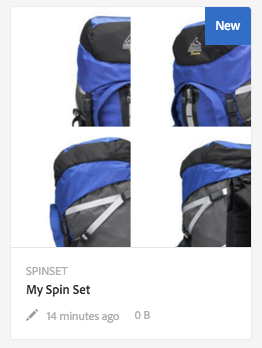

# スピンセット{#spin-sets}

スピンセットは、物体を回転させて調べるという現実世界の操作をシミュレートしたものです。スピンセットによって、あらゆる角度からアイテムを表示して、あらゆる角度から重要な細部を目で確認できます。

スピンセットは、360 度の閲覧エクスペリエンスをシミュレートします。Dynamic Media は、ビューアがアイテムを回転できる単一軸のスピンセットを提供します。さらに、ユーザーは「自由形式」のズームを実行し、マウスを数回クリックするだけで任意のビューをパンできます。このようにして、ユーザーは特定の視点からより詳しくアイテムを調べることができます。

Spin Sets are designated by a banner with the word **[!UICONTROL SPINSET.]** In addition, if the Spin Set is published, then the publish date, indicated by the **[!UICONTROL World]** icon is on the banner along with the last modification date, indicated by the **[!UICONTROL Pencil]** icon displays.

>[!NOTE]
>
>アセットユーザーインターフェイスについて詳しくは、[タッチ UI を使用したアセットの管理](/help/assets/managing-assets-touch-ui.md)を参照してください。

## クイックスタート：スピンセット {#quick-start-spin-sets}

スピンセットをすぐに使い始めるには、次の手順を実行します。

1. [複数ビュー用の画像をアップロードします。](#uploading-assets-for-spin-sets)

   アイテムの写真は最低でも、1 次元スピンセットで 8～12 個、2 次元スピンセットで 16～24 個必要になります。アイテムが回転および反転している印象を与えるためには、写真を一定の間隔で撮影する必要があります。例えば、1 次元スピンセットに 12 個の写真を含める場合、写真を撮影するごとに 30 度ずつ（360/12）アイテムを回転します。

1. [スピンセットを作成します。](#creating-spin-sets)

   スピンセットを作成するには、**[!UICONTROL 作成／スピンセット]**&#x200B;を選択し、セットの名前を付け、アセットを選択し、画像の表示順を選択します。

   [セレクターの操作](/help/assets/working-with-selectors.md)を参照してください。

   >[!NOTE]
   >
   >[バッチセットプリセット](/help/assets/config-dms7.md#creating-batch-set-presets-to-auto-generate-image-sets-and-spin-sets)を使用してスピンセットを自動的に作成することもできます。**重要：**&#x200B;バッチセットは IPS（Image Production System）によってアセット取り込みの一環として作成され、Dynamic Media - Scene7 モードでのみ使用できます。

1. 必要に応じて[スピンセットビューアプリセット](/help/assets/managing-viewer-presets.md)を設定します。

   管理者は、スピンセットビューアプリセットを作成または編集できます。スピンセットを特定のビューアプリセットで表示するには、スピンセットを選択し、左側のレールのドロップダウンメニューで「**ビューア**」を選択します。

   **[!UICONTROL ツール／アセット／ビューアプリセット]**&#x200B;を選択して、ビューアプリセットを作成または編集します。

   詳しくは、[ビューアプリセットの追加と編集](/help/assets/managing-viewer-presets.md)を参照してください。

1. [スピンセットを表示します。](#viewing-spin-sets)

   バッチセットプリセットを使用して作成したセットを表示したり、それらのセットにアクセスしたりするには、3 つの方法があります（バッチセットプリセットを使用して作成したセットは、ユーザーインターフェイスに表示&#x200B;*されません*）。

1. [スピンセットをプレビューします。](/help/assets/previewing-assets.md)

   スピンセットを選択すると、プレビューできます。スピンセットを回転します。**[!UICONTROL ビューア]**&#x200B;メニューから様々なビューアを選択できます。このメニューは左側のレールのドロップダウンメニューにあります。

1. [スピンセットを公開します。](/help/assets/publishing-dynamicmedia-assets.md)

   スピンセットを公開すると、URL と埋め込み文字列がアクティベートされます。また、[ビューアプリセットを公開](/help/assets/managing-viewer-presets.md)する必要があります。

1. [URL を Web アプリケーションにリンクする](/help/assets/linking-urls-to-yourwebapplication.md)か、[ビデオビューアまたは画像ビューアを埋め込みます](/help/assets/embed-code.md)。

   スピンセットの URL コールが作成され、スピンセットの公開後にそれらの URL コールがアクティベートされます。アセットをプレビューする際に、これらの URL をコピーできます。または、URL を Web サイトに埋め込むこともできます。

   Select the Spin Set, then in the left rail drop-down menu, select **[!UICONTROL Viewers.]**

   詳しくは、[Web ページへのスピンセットのリンク](/help/assets/linking-urls-to-yourwebapplication.md)と[ビデオビューアまたは画像ビューアの埋め込み](/help/assets/embed-code.md)を参照してください。

必要に応じて、[スピンセットを編集](#editing-spin-sets)できます。また、[スピンセットのプロパティ](/help/assets/managing-assets-touch-ui.md#editing-properties)の表示と変更もできます。

## スピンセット用のアセットのアップロード {#uploading-assets-for-spin-sets}

アイテムの写真は最低でも、1 次元スピンセットで 8～12 個、2 次元スピンセットで 16～24 個必要になります。アイテムが回転および反転している印象を与えるためには、写真を一定の間隔で撮影する必要があります。例えば、1 次元スピンセットに 12 個の写真を含める場合、写真を撮影するごとに 30 度ずつ（360/12）アイテムを回転します。

スピンセット用の画像のアップロードは、[AEM Assets での他のアセットのアップロード](/help/assets/managing-assets-touch-ui.md)と同様に実行できます。

### スピンセット用の画像のキャプチャに関するガイドライン {#guidelines-for-shooting-spin-set-images}

ここでは、スピンセット画像に関するベストプラクティスを説明します。一般に、スピンセット内の画像が多いほど、画像のスピン効果が向上します。ただし、セット内に多くの画像を追加すると、画像の読み込みにかかる時間も長くなります。AEM では、スピンセットで使用する画像の撮影について、次のガイドラインに従うことを推奨します。

* 最低でも、1 次元スピンセットで 8～12 個、2 次元スピンセットで 16～24 個の画像を使用するようにします。360 度回転できるようにするには、最小で 8 個の画像が必要になります。2 次元スピンセットの作成には多大な労力がかかるので、1 次元スピンセットのほうが一般的です。
* 可逆圧縮形式を使用します。TIFF および PNG が推奨されます。
* 真っ白または他の高コントラストの背景上にアイテムが表示されるように、すべての画像をマスクします。オプションで、シャドウを追加します。
* 製品の細部に十分に光を当て、ピントを合わせるようにします。
* ファッション衣料の場合は、マネキンやモデルに着せてスピン画像を撮影します。多くの場合、ガラス製のマネキンを使用してマネキンを完全にマスクするか、画像内に定型化されたマネキンを表示します。角度を定義することで、モデルによるスピンセットを作成できます。床にテープを貼って角度をマークし、モデルが撮影ごとに動いて向きを変えるための手助けをします。

## スピンセットの作成 {#creating-spin-sets}

ここでは、AEM でスピンセットを作成する方法について説明します。

>[!NOTE]
>
>[バッチセットプリセット](/help/assets/config-dms7.md#creating-batch-set-presets-to-auto-generate-image-sets-and-spin-sets)を使用してスピンセットを自動的に作成することもできます。**重要：**&#x200B;バッチセットは IPS（Image Production System）によってアセット取り込みの一環として作成され、Dynamic Media - Scene7 モードでのみ使用できます。
>
>[Dynamic Media - Scene7 モードの設定](/help/assets/config-dms7.md#creating-batch-set-presets-to-auto-generate-image-sets-and-spin-sets)の「画像セットおよびスピンセットを自動生成するためのバッチセットプリセットの作成」を参照してください。

>[!NOTE]
>
>スピンセット内での画像の表示順は重要です。スピンがスムーズに 360 度のビューを描けるように画像を並べてください。

**スピンセットを作成するには**

1. アセットで、スピンセットを作成する場所に移動し、「**[!UICONTROL 作成]**」をクリックし、「**[!UICONTROL スピンセット」を選択します。]**&#x200B;アセットを格納しているフォルダー内からセットを作成することもできます。スピンセットエディターが表示されます。

   

1. スピンセットエディターの「**[!UICONTROL タイトル]**」フィールドにスピンセットの名前を入力します。この名前は、スピンセット全般のバナーに表示されます。オプションで、説明を入力します。

   

   >[!NOTE]
   >
   >スピンセットを作成するときに、スピンセットのサムネールを変更したり、AEM でスピンセット内のアセットに基づいてサムネールを自動的に選択したりすることができます。サムネールを選択するには、「**[!UICONTROL サムネールを変更]**」をクリックし、画像を選択します（他のフォルダーに移動して画像を探すこともできます）。If you have selected a thumbnail and then decide that you want AEM to generate one from the spin set, select **[!UICONTROL Switch to Automatic thumbnail.]**

1. 次のいずれかの操作をおこないます。

   * Near the upper-left corner of the Spin Set Editor page, tap **[!UICONTROL Add Asset.]**

   * Near the middle of the Spin Set Editor page, tap **[!UICONTROL Tap to open Asset Selector.]**
   スピンセットに含めるアセットをタップして選択しします。選択済みのアセットにはチェックマークアイコンが付いています。When you are finished, near the upper-right corner of the page, tap **[!UICONTROL Select.]**

   アセットセレクターでは、キーワードを入力して **[!UICONTROL Enter]** キーをタップすることで、アセットを検索することができます。フィルターを適用して、検索結果を絞り込むこともできます。パス、コレクション、ファイルタイプおよびタグでフィルタリングできます。フィルターを選択してから、ツールバーの&#x200B;**[!UICONTROL フィルター]**&#x200B;アイコンをタップします。Change the view by tapping the View icon and selecting **[!UICONTROL Column View]**, **[!UICONTROL Card View]**, or **[!UICONTROL List View.]**

   [セレクターの操作](/help/assets/working-with-selectors.md)を参照してください。

   

1. 画像セットに追加したアセットは、自動的に英数字順で追加されます。追加後に、手動でアセットの順番を変更したり、並べ替えたりすることができます。

   必要に応じて、アセットの並べ替えアイコンをアセットのファイル名の右にドラッグして、画像をセットリスト内で上下に並べ替えます。

   

   スピンセットのフレーム 11 を新しい位置にドラッグして並べ替える

1. （オプション）次のいずれかの操作をおこないます。

   * To delete an image, select the image and tap **[!UICONTROL Delete Asset.]**

   * ページの右上隅付近にプリセットを適用するには、「]**プリセット**[!UICONTROL 」をタップした後、すべてのアセットに一度に適用するプリセットを選択します。

1. Click **[!UICONTROL Save.]** Your newly created Spin Set appears in the folder you created it in.

## スピンセットの表示 {#viewing-spin-sets}

スピンセットは、ユーザーインターフェイスで作成することも、[バッチセットプリセット](/help/assets/config-dms7.md#creating-batch-set-presets-to-auto-generate-image-sets-and-spin-sets)を使用して自動的に作成することもできます。ただし、バッチセットプリセットを使用して作成したセットは、ユーザーインターフェイスに表示&#x200B;*されません*。バッチセットプリセットを使用して作成したセットには、3 つの方法でアクセスできます（これらの方法は、スピンセットをユーザーインターフェイスで作成した場合も使用できます）。

>[!NOTE]
>
>[スピンセットの編集](#editing-spin-sets)の説明に従って、ユーザーインターフェイスを使用してセットを表示することもできます。

**スピンセットを表示するには**

1. 個々のアセットのプロパティを開きます。（「**[!UICONTROL セットのメンバー]**」の下に）選択したアセットがメンバーとして含まれるセットが表示されます。セットの名前をクリックして、セット全体を表示します。

   

1. 任意のセットのメンバー画像で、**[!UICONTROL セット]**&#x200B;メニューを選択して、アセットがメンバーとして含まれているセットを表示します。

   

1. From search, you can Select **[!UICONTROL Filters]**, then expand **[!UICONTROL Dynamic Media]** and select **[!UICONTROL Sets.]**

   検索結果として、UI で手動で作成した一致するセットか、バッチセットプリセットを使用して自動的に作成した一致するセットが返されます。自動セットの場合、検索クエリは、AEM での検索とは異なる「`Starts with`」検索条件を使用して実行されます。AEM での検索は、「`Contains`」検索条件に基づいて実行されます。フィルターを「**[!UICONTROL セット]**」に設定するのが、自動セットを検索する唯一の方法です。

   

## スピンセットの編集 {#editing-spin-sets}

スピンセットには、次のような様々な編集タスクを実行できます。

* スピンセットへの画像の追加
* スピンセット内の画像の並べ替え
* スピンセットのアセットの削除
* ビューアプリセットの適用
* スピンセットの削除

**スピンセットを編集するには**

1. 次のいずれかの操作をおこないます。

   * スピンセットアセット上にマウスポインターを置き、]**編集**[!UICONTROL （鉛筆アイコン）をタップします。
   * スピンセットアセット上にマウスポインターを置き、**[!UICONTROL 選択]**（チェックマークアイコン）をタップした後、ツールバーの「**[!UICONTROL 編集]**」をタップします。

   * スピンセットアセットをタップしてから、ツールバーの&#x200B;]**編集**[!UICONTROL （鉛筆アイコン）をタップします。

1. スピンセットを編集するには、次のいずれかの操作をおこないます。

   * 画像を並べ替えるには、画像を新しい位置までドラッグします（並べ替えアイコンを選択して項目を移動します）。
   * 項目を昇順または降順に並べ替えるには、列の見出しをクリックします。
   * アセットを追加するか既存のアセットを更新するには、「**[!UICONTROL アセットを追加」をクリックします。]**&#x200B;アセットに移動して選択し、右上隅の「**[!UICONTROL 選択]**」をタップします。AEM でサムネール用に使用されている画像を別の画像に置き換えて削除しても、元のアセットは表示されたままになります。
   * To delete an asset, select it and click or tap **[!UICONTROL Delete Asset.]**
   * プリセットを適用するには、「プリセット」アイコンをタップまたはクリックし、プリセットを選択します。
   * スピンセット全体を削除するには、スピンセットに移動して選択し、「**[!UICONTROL 削除]**」を選択します

   >[!NOTE]
   >
   >スピンセットの画像を編集するには、スピンセットに移動し、左側のレールの「**[!UICONTROL メンバーを設定]**」をタップしてから、個々のアセットの鉛筆アイコンをタップして編集ウィンドウを開きます。

1. 編集が完了したら、「**[!UICONTROL 保存]**」をクリックします。

## スピンセットのプレビュー {#previewing-spin-sets}

詳しくは、[アセットのプレビュー](/help/assets/previewing-assets.md)を参照してください。

## スピンセットの公開 {#publishing-spin-sets}

[アセットの公開](/help/assets/publishing-dynamicmedia-assets.md)を参照してください。
