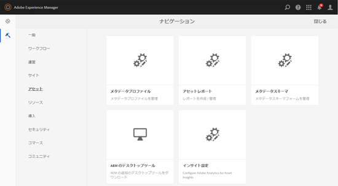
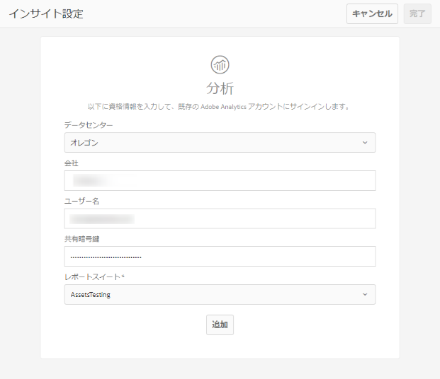

# アセットインサイトの設定 {#configure-asset-insights}

[!DNL Adobe Experience Manager Assets] サードパーティWebサイトで使用されるデジタルアセットの使用状況データを、から取得 [!DNL Adobe Analytics]します。 アセットインサイトでこのようなデータを取得して洞察を得るためには、最初に Adobe Analytics と統合するようにこの機能を設定します。

>[!NOTE]
>
>インサイトのサポートおよび提供がおこなわれるのは、画像に対してのみです。

1. In [!DNL Experience Manager], click **[!UICONTROL Tools]** > **[!UICONTROL Assets]**.

   

1. 「**[!UICONTROL インサイト設定]**」カードをクリックします。
1. ウィザードで、データセンターを選択し、会社名、ユーザー名、共有暗号鍵などの資格情報を指定します。

   

   *図：でアセットインサイト[!DNL Adobe Analytics]を設定し[!DNL Experience Manager]ます。*

1. 「 **[!UICONTROL 認証]**」をクリックします。
1. After [!DNL Experience Manager] authenticates your credentials, from the **[!UICONTROL Report Suite]** list, choose an [!DNL Adobe Analytics] report suite from where you want Asset Insights to fetch data. 「**[!UICONTROL 追加]**」をクリックします。
1. After [!DNL Experience Manager] sets up your report suite, click **[!UICONTROL Done]**.

## Page tracker {#page-tracker}

After you configure your [!DNL Adobe Analytics] account, the Page Tracker code is generated for you. To enable Assets Insights to track [!DNL Experience Manager] assets used in third-party websites, include the page tracker code in the website code. Use the [!UICONTROL Page Tracker] utility in [!DNL Experience Manager Assets] to generate the page tracker code. For more information on how to include your Page Tracker code in third-party web pages, see [Use page tracker and embed code in web pages](/help/assets/touch-ui-using-page-tracker.md).

1. In [!DNL Experience Manager], click **[!UICONTROL Tools]** > **[!UICONTROL Assets]**.

   

1. **[!UICONTROL ナビゲーション]**&#x200B;ページで、「**[!UICONTROL インサイトページトラッカー]**」カードをクリックします。
1. 「**[!UICONTROL ダウンロード]**」をクリックして、ページトラッカーコードをダウンロードします。
