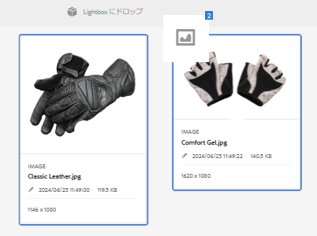

# Lightbox {#lightbox}

Lightbox は、アセットに容易にアクセスするための特別なタイプのコレクションです。Lightbox にすぐにアクセスして、アセットを追加または削除できます。Lightbox は、個人用の画像ギャラリーとして使用することができます。

If you are an [!DNL Adobe Experience Manager Assets] user, Lightbox is automatically created when you first log in to the application. この Lightbox は自分専用です。他のユーザーはこの Lightbox にアクセスできません。

## Lightbox へのアセットの追加 {#adding-assets-to-lightbox}

1. From the [!DNL Assets] user interface, select the assets that you want to add to Lightbox.
1. アセットを **[!UICONTROL Lightbox にドロップ]**&#x200B;ゾーンにドラッグします。Release when the drop-zone becomes active, and its label changes to **[!UICONTROL Drop to Add]**.

   

1. In the dialog, click **[!UICONTROL Add]**, and then close it to complete the process. 選択したアセットが Lightbox に追加されます。
1. Lightbox を表示するには、コレクションコンソールに移動します。
1. Click **[!UICONTROL Lightbox]** to view the assets in it.

   >[!NOTE]
   >
   >Lightbox はコレクションに似ていますが、コレクションに対して通常実行するすべてのアクションを実行できるわけではありません。例えば、Lightbox の設定を削除、共有または表示することはできません。また、Lightbox を他のコレクションに追加することはできません。ただし、Lightbox 内のアセットを編集することはできます。

## Remove assets from Lightbox {#removing-assets-from-lightbox}

1. コレクションコンソールに移動し、「ライトボックス」をクリックしてアセットを表示します。
1. 削除するアセットを選択します。
1. From the toolbar, click **[!UICONTROL Remove]**.
1. In the dialog, click **[!UICONTROL Remove]** to confirm the delete action. アセットが Lightbox から削除されます。
